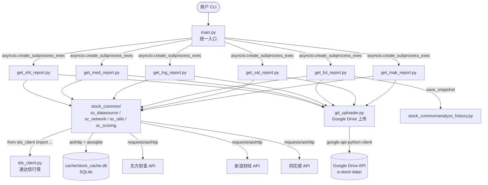
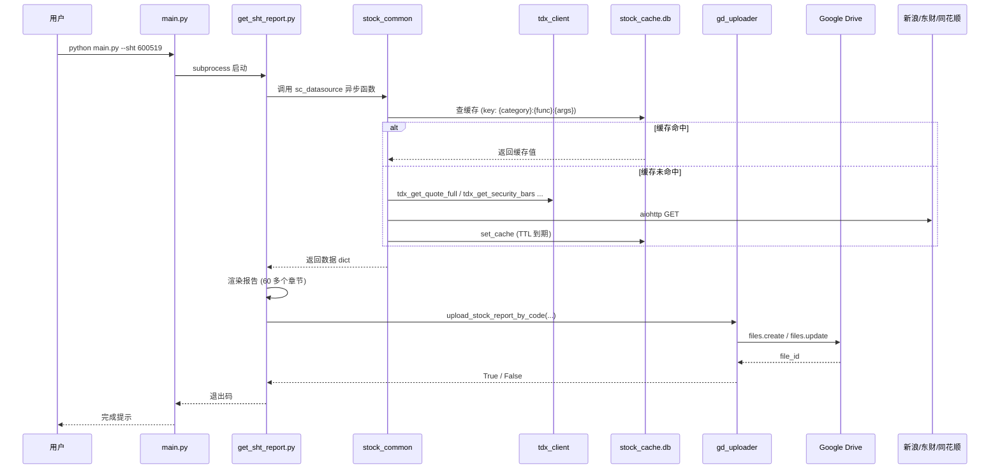
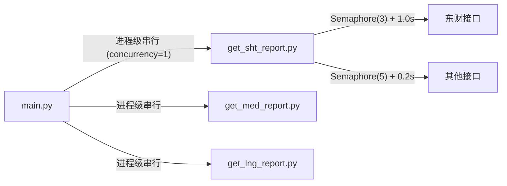
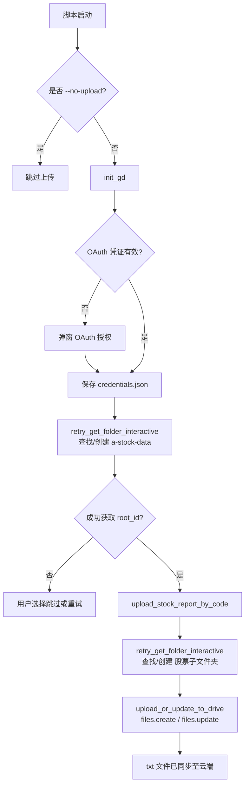

# 项目结构与数据流图

本项目采用「**main.py 调度 → 子进程执行报告脚本 → 调用数据源层 → 上传 GD**」的层次化架构。
下文使用 Mermaid 描述核心模块之间的实际调用关系，便于开发者快速了解系统全景。

## 1. 总体架构



## 2. 模块职责

| 模块 | 职责 |
|------|------|
| **`main.py`** | 统一 CLI 入口；通过 `asyncio.create_subprocess_exec` 串行执行各报告脚本（进程级并发默认 1） |
| **`get_*.py`** (6 个) | 6 种报告类型的执行入口；负责数据聚合、报告渲染、Google Drive 上传 |
| **`stock_common/`** 包 | 数据源层与公共工具的集合，由各报告脚本统一调用 |
| ├ `sc_datasource.py` | 数据源适配层（新浪/东财/同花顺），含 `aiohttp` 异步与 `requests` 同步两套实现 |
| ├ `sc_network.py` | 限流、代理、UA 池、`_debug_log` 日志等基础网络工具 |
| ├ `sc_utils.py` | CLI 参数解析、配置加载、字符串清洗等通用工具 |
| ├ `sc_scoring.py` | 短/中/长线评分权重与计算函数 |
| ├ `analyze_history.py` | 快照保存、跨日期评分对比、趋势背离检测 |
| ├ `stock_calendar.py` | A 股交易日历（含节假日、调休） |
| └ `f10_parser.py` | 通达信 F10 文本解析器 |
| **`tdx_client.py`** | 通达信行情接口（实时行情、K 线、F10、财务数据等），由 `sc_datasource` 内部调用 |
| **`stock_cache.py`** | SQLite + TTL + 交叉验证的缓存装饰器（`@cached` / `@cached_async`） |
| **`gd_uploader.py`** | Google Drive 上传业务；提供 `init_gd` / `upload_stock_report_by_code` / `upload_type_reports` |

## 3. 单只股票的处理流程（以 `get_sht_report.py` 为例）



## 4. 并发与限流策略



- **进程级串行**：`main.py` 通过子进程方式一次只跑一个报告脚本，避免东财接口请求叠加导致被封。
- **脚本级并发**：单个 `get_*.py` 内部用 `asyncio.Semaphore(3)` 并发 3 只股票，配合 1.0s 间隔。
- **跨进程文件锁**：`stock_cache.py` 使用文件锁协调多进程对 SQLite 缓存的并发写。

## 5. Google Drive 上传流程



> **注意**：代码仅会查找/创建文件夹、上传/覆盖文件，**不会移动或删除已有文件夹**。
> 若根目录出现个股文件夹，根因通常是 Google Drive 桌面客户端的同步冲突，
> 而非脚本行为。详见 `README.md` FAQ 章节。

## 6. 缓存层设计

```mermaid
graph LR
    A[业务函数] -- "@cached('dragon_tiger', ttl=...)" --> B[stock_cache.py]
    A2[异步业务函数] -- "@cached_async('financial', ...)" --> B
    B --> C{SQLite cache_entries 表}
    C -- "命中 + 未过期" --> D[直接返回]
    C -- "未命中或过期" --> E[调用原始函数]
    E --> F[写入缓存 (TTL 计算)]
```

- **TTL 分级**（详见 `stock_cache.py` 顶部说明）：
  - 静态数据（股票基本信息、概念板块）：7 天
  - 财务数据（财报、资产负债表）：90 天
  - 日频数据（龙虎榜、北向、融资融券）：当日有效
  - 研报：3 天
  - 行业/概念热度：24 小时
- **交叉验证**：11 个多天 TTL 分类启用两次获取对比，写入 `prev_value` / `verified` 字段。
- **CLI**：`python stock_cache.py stats/clear-all/clear --category <name>`。

## 7. 文件清单

| 类别 | 文件 |
|------|------|
| 入口 | `main.py` |
| 报告脚本 | `get_sht_report.py` / `get_med_report.py` / `get_lng_report.py` / `get_ful_report.py` / `get_val_report.py` / `get_mak_report.py` |
| 数据源层 | `tdx_client.py` / `stock_common/sc_datasource.py` / `stock_common/sc_network.py` |
| 缓存 | `stock_cache.py` |
| 上传 | `gd_uploader.py` |
| 工具脚本 | `scripts/update_calendar.py` |
| 公共模块 | `stock_common/sc_utils.py` / `stock_common/sc_scoring.py` / `stock_common/analyze_history.py` / `stock_common/stock_calendar.py` / `stock_common/f10_parser.py` |
| 测试 | `tests/test_*.py` / `tests/diag_*.py` |
| 文档 | `README.md` / `CHANGELOG.md` / `CONTRIBUTING.md` / `CODE_OF_CONDUCT.md` / `LICENSE` / `docs/architecture.md` |
