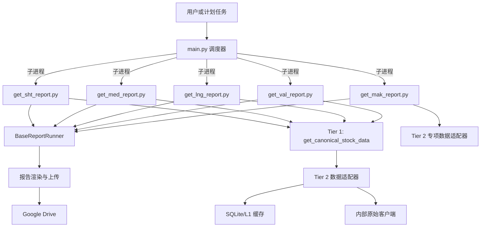
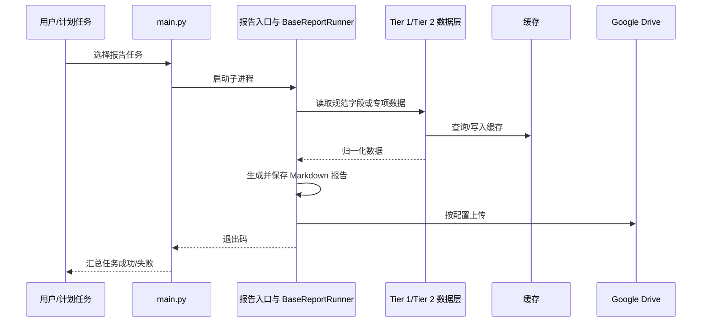

# 项目架构与数据流

> 本文描述当前代码路径；架构边界的完整依据见 [`ARCHITECTURE_THEORY.md`](ARCHITECTURE_THEORY.md)，字段定义见 [`field_dict.md`](field_dict.md)。最近核对：2026-09-28。

## 1. 系统结构

```mermaid
flowchart TD
    User[用户或计划任务] --> Main[main.py 调度器]
    Main -->|子进程| Sht[get_sht_report.py]
    Main -->|子进程| Med[get_med_report.py]
    Main -->|子进程| Lng[get_lng_report.py]
    Main -->|子进程| Val[get_val_report.py]
    Main -->|子进程| Mak[get_mak_report.py]

    Sht --> Runner[BaseReportRunner]
    Med --> Runner
    Lng --> Runner
    Val --> Runner
    Mak --> Runner

    Sht --> Gate[Tier 1: get_canonical_stock_data]
    Med --> Gate
    Lng --> Gate
    Val --> Gate
    Mak --> Specialty[Tier 2 专项数据适配器]
    Gate --> Adapters[Tier 2 数据适配器]
    Adapters --> Cache[SQLite/L1 缓存]
    Adapters --> Clients[内部原始客户端]
    Runner --> Render[报告渲染与上传]
    Render --> Drive[Google Drive]
```

`main.py` 负责参数与任务调度，不负责字段映射。报告入口使用 `stock_common/sc_report_runner.py` 的 `BaseReportRunner` 管理公共生命周期；`get_mak_report.py` 还会调用全市场扫描所需的专项数据适配器。

## 2. 数据访问层

| 层 | 主要入口 | 职责与边界 |
|---|---|---|
| 调度层 | `main.py` | 启动报告子进程并汇总结果；必选脚本缺失、子任务异常或返回失败码都应导致整体失败 |
| 报告层 | `get_*_report.py`、`BaseReportRunner` | 组织报告工作流、渲染文件、处理上传 |
| Tier 1 统一门面 | `core/data_provider.get_canonical_stock_data()` | 86 个核心字段的归一化契约、来源选择、fallback、单位归一化和 `field_sources` 溯源 |
| Tier 2 专项适配器 | `stock_common/sc_datasource`、`sc_fuyao`、`core/tdx_client.py` 的公开接口 | 提供 CYQ、F10、龙虎榜、涨停梯队、行业 L2、资金流、竞价等专用数据 |
| 原始客户端 | `stock_common/` 与 `core/tdx_client.py` 内部实现 | HTTP、TCP、SDK 等底层连接；生产报告脚本不应绕过 Tier 1/Tier 2 公开入口 |
| 缓存 | `core/stock_cache.py` 和适配器缓存 | 管理分类 TTL、缓存键和失效；单位或字段语义变化要升级对应缓存类别/版本 |

数据访问规则、公理编号和允许的例外以 `AGENTS.md` §8.4 与 `ARCHITECTURE_THEORY.md` 为准。专用数据属于 Tier 2，不应为追求“统一”而塞进 `CanonicalStockData`。

## 3. 实时与 ZHB 路由

### 3.1 按交易时段选择

`core/data_provider.py` 中的 `_should_use_zhb_for_realtime()` 和 `get_canonical_stock_data()` 共同决定路由：

| 时段 | 行为 |
|---|---|
| 非交易日/节假日 | 允许使用本地 ZHB 快照 |
| 交易日 09:30 前 | 允许使用本地 ZHB 快照 |
| 交易日 09:30 起（含盘后） | 需要实时行情来源；盘后本地 ZHB 仍可能停留在 T-1 |

`force_realtime`、实时交易时段、盘后状态以及 ZHB 数据是否存在，也会影响 `need_realtime_quote`。不要把路由简化成“某字段属于实时集合就必走 HTTP”：`REQUIRES_REALTIME_HTTP` 与 `ZHB_SUFFICIENT` 是由 `sc_schema.FIELD_SPECS` 生成的测试契约元数据，不是业务运行时的路由开关。

### 3.2 行情 fallback

单股实时行情调用的 fallback 顺序由 `core/data_provider.py` 的分支实际执行，当前行为为：

1. TDX
2. 腾讯
3. 东方财富 push2delay
4. 东方财富 push2

`core/source_priority.py` 保留期望顺序供测试核对，不参与生产路由。修改运行顺序时，应修改 `data_provider.py` 并更新验证实际调用顺序的测试。

字段新鲜度另外按 ABCD 规则由 `sc_datasource.zhb_field_safe()` 判断：A 实时、B 准实时、C 日频、D 静态。新鲜度分类与路由选择是相关但独立的约束。

## 4. 报告运行生命周期

```mermaid
sequenceDiagram
    participant U as 用户/计划任务
    participant M as main.py
    participant R as 报告入口与 BaseReportRunner
    participant D as Tier 1/Tier 2 数据层
    participant C as 缓存
    participant G as Google Drive
    U->>M: 选择报告任务
    M->>R: 启动子进程
    R->>D: 读取规范字段或专项数据
    D->>C: 查询/写入缓存
    D-->>R: 归一化数据
    R->>R: 生成并保存 Markdown 报告
    R->>G: 按配置上传
    R-->>M: 退出码
    M-->>U: 汇总任务成功/失败
```

运行时网络请求、限流与熔断由网络/数据适配层负责；报告层通过公开接口使用这些能力。调度器检查任务结果数量、异常和退出码，避免遗漏任务或部分失败时仍报告成功。

## 5. 缓存与数据一致性

- 缓存由 `core/stock_cache.py` 与适配器上的缓存装饰器/函数管理；具体 TTL 按数据类别设置，不在本文固定列出易变化的数值。
- 缓存键和类别也是数据契约的一部分。单位变更、解析结构变更或返回语义改变时，检查旧缓存兼容性并升级相应版本/类别。
- ZHB 解析结构变更检查 `core/zhb_client.py` 的 `_ZHB_PARSE_SCHEMA`；字段级定义以 `field_dict.md` 为准。

## 6. 主要目录

| 目录/文件 | 内容 |
|---|---|
| `main.py` | 报告任务调度 |
| `get_*_report.py` | 五个报告入口 |
| `core/` | 统一数据门面、TDX/ZHB 客户端、解析与缓存 |
| `stock_common/` | Tier 2 适配器、网络控制、渲染、报告 runner 与通用逻辑 |
| `scripts/` | 测试、字段采集/治理、回测及维护工具 |
| `tests/` | 单元和集成回归；真实网络测试使用 `real_network` marker |
| `docs/field_verification/` | 字段采集和验证归档 |
| `docs/DEBT_LEDGER.md` | 显式记录的架构偏离与偿还状态 |

## 7. 本地验证入口

PowerShell 测试统一从 `scripts/run_tests.ps1` 启动。数据访问与字段同步闸门的适用范围、调用方式见 `AGENTS.md` §8.4；脚本目录的工具用途见 [`../scripts/README.md`](../scripts/README.md)。
