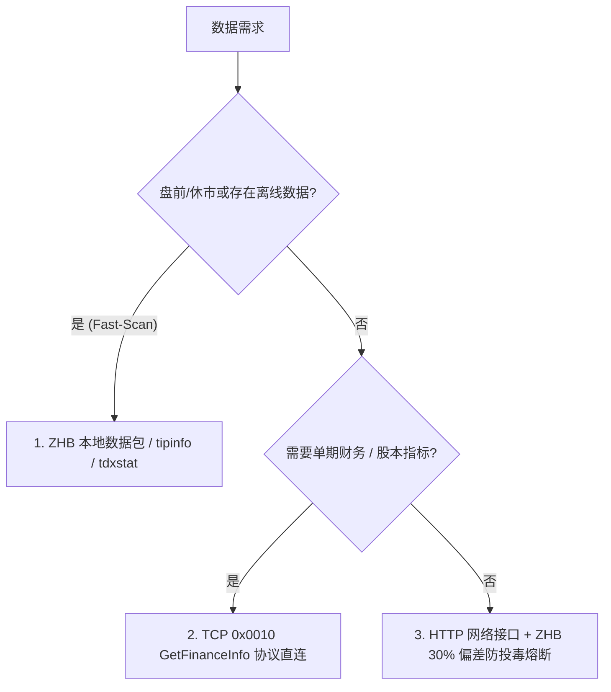
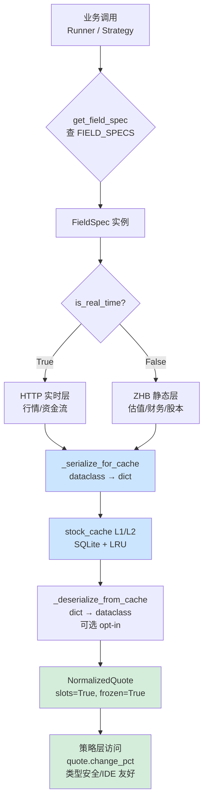

# A股数据架构全量接口与字段索引指南 (Master Reference)

> **创建日期**：2026-07-22  
> **最近核实**：2026-07-28（基于 zhb_20260721~20260727 连续5个交易日数据 + `zhb_client.py` 源码逆向交叉验证）  
> **文档目的**：全面收录并归纳项目经过深度逆向工程、协议解包与线上验证得到的所有数据接口、字段映射、缓存机制及 Fallback 兜底防线，指导后续代码重构与策略开发，防止后续迭代失焦。

---

## 一、 数据获取优先级与架构总纲 (Core Paradigms)

系统整体遵循以下三级金字塔获取原则：



### 1. 三大设计防线 (Design Guardrails)
1. **ZHB 财报事件锁 (Event-Driven Lock)**：对于季度更新的 12 季度历史财报（如新浪接口），禁止使用固定 90 天或 24 小时 TTL。将 ZHB 的 `report_date` 动态拼入 SQLite 缓存 Key（如 `fin:600519:12:report_date=20240331`），实现**永久缓存 + 报告期变更瞬间刷新**。
2. **ZHB 地面真理防投毒 (Anti-Poisoning Fuse)**：ZHB T-1 数据作为绝对真理（Ground Truth）。当 HTTP 接口返回 PE/PB/股息率时，计算 `abs(HTTP - ZHB) / ZHB`。若偏差超出 **30%**，判定 HTTP 数据已被垃圾数据污染，直接强行弃用 HTTP 并由 ZHB 数据兜底。
3. **休市/盘前 Fast-Scan**：在 9:15 前、15:00 后或休市日运行扫描脚本时，自动拦截 HTTP 请求，100% 走 ZHB 本地内存检索，秒级完成全市场扫描。

---

## 二、 TCP `GetFinanceInfo` (0x0010) 二进制全量字段映射

通过 `tdx_client.py` 中的 `tdx_get_finance_info(code)` 提取，直连券商服务器，耗时 5~15ms，完全无 IP 封禁风险。

**协议来源**：通过 [tdxpy/parser/std/get_finance_info.py](file:///C:/Users/tsy11/AppData/Local/Python/pythoncore-3.12-64/Lib/site-packages/tdxpy/parser/std/get_finance_info.py) 反向工程获得权威字段定义，共 **36 个字段**（含 2 个标识字段 market/code + 34 个数据字段）。mootdx 0.11.7 + tdxpy 0.1.22 协同解析。

### 2.1 协议完整 36 字段表（权威定义）

> **单位说明**：所有 `float` 类型字段协议返回时已乘以 **10000**（即单位为"万股"或"万元"），调用方需除以 10000 还原为"万"。`gudongrenshu`（股东户数）和 `meigujingzichan`（每股净资产）是例外——返回原始值，不乘 10000。

| 协议偏移 | 字段名 (`key`) | 中文含义 | 类型 | 协议单位 | 还原后单位 | 字段分组 | 项目代码使用 |
|:---:|:---|:---|:---:|:---|:---|:---|:---:|
| 0 | `market` | 市场代码 (0=深/1=沪) | `byte` | 0/1/2 | 0=深/1=沪/2=京 | 标识 | ❌ |
| 1 | `code` | 股票代码 | `str` | 6位字符串 | 6位字符串 | 标识 | ❌ |
| 2 | **`liutongguben`** | **流通股本** | `float` | `×10000` | **万股** | 股本 | ✅ |
| 3 | `province` | 省份编码 | `ushort` | 编码值 | 编码值（需查表） | 基础 | ❌ |
| 4 | **`industry`** | **通达信行业编码** | `ushort` | 编码值 | 编码值（需查表） | 基础 | ✅ |
| 5 | **`updated_date`** | **财报更新日期** | `uint` | YYYYMMDD | YYYYMMDD | 基础 | ✅ |
| 6 | **`ipo_date`** | **上市日期** | `uint` | YYYYMMDD | YYYYMMDD | 基础 | ✅ |
| 7 | **`zongguben`** | **总股本** | `float` | `×10000` | **万股** | 股本 | ❌ |
| 8 | `guojiagu` | 国家股 | `float` | `×10000` | 万股 | 股本（结构性） | ❌ |
| 9 | `faqirenfarengu` | 发起人法人股 | `float` | `×10000` | 万股 | 股本（结构性） | ❌ |
| 10 | `farengu` | 法人股 | `float` | `×10000` | 万股 | 股本（结构性） | ❌ |
| 11 | `bgu` | B股 | `float` | `×10000` | 万股 | 股本（结构性） | ❌ |
| 12 | `hgu` | H股 | `float` | `×10000` | 万股 | 股本（结构性） | ❌ |
| 13 | `zhigonggu` | 职工股 | `float` | `×10000` | 万股 | 股本（结构性） | ❌ |
| 14 | **`zongzichan`** | **总资产** | `float` | `×10000` | **万元（→元需×10000）** | 资产 | ✅ |
| 15 | `liudongzichan` | 流动资产 | `float` | `×10000` | 万元 | 资产 | ❌ |
| 16 | `gudingzichan` | 固定资产 | `float` | `×10000` | 万元 | 资产 | ❌ |
| 17 | `wuxingzichan` | 无形资产 | `float` | `×10000` | 万元 | 资产 | ❌ |
| 18 | **`gudongrenshu`** | **股东户数** | `float` | **原始值** | **户** | 股东 | ✅ |
| 19 | `liudongfuzhai` | 流动负债 | `float` | `×10000` | 万元 | 负债 | ❌ |
| 20 | `changqifuzhai` | 长期负债 | `float` | `×10000` | 万元 | 负债 | ❌ |
| 21 | `zibengongjijin` | 资本公积金 | `float` | `×10000` | 万元 | 权益 | ❌ |
| 22 | **`jingzichan`** | **净资产 / 股东权益** | `float` | `×10000` | **万元** | 权益 | ✅ |
| 23 | `zhuyingshouru` | 主营业务收入 | `float` | `×10000` | 万元 | 业绩 | ❌ |
| 24 | `zhuyinglirun` | 主营业务利润 | `float` | `×10000` | 万元 | 业绩 | ❌ |
| 25 | `yingshouzhangkuan` | 应收账款 | `float` | `×10000` | 万元 | 业绩 | ❌ |
| 26 | `yingyelirun` | 营业利润 | `float` | `×10000` | 万元 | 业绩 | ❌ |
| 27 | `touzishouyu` | 投资收益 | `float` | `×10000` | 万元 | 业绩 | ❌ |
| 28 | `jingyingxianjinliu` | 经营活动现金流 | `float` | `×10000` | 万元 | 现金流 | ❌ |
| 29 | `zongxianjinliu` | 总现金流 | `float` | `×10000` | 万元 | 现金流 | ❌ |
| 30 | `cunhuo` | 存货 | `float` | `×10000` | 万元 | 资产负债 | ❌ |
| 31 | `lirunzonghe` | 利润总和 | `float` | `×10000` | 万元 | 业绩 | ❌ |
| 32 | `shuihoulirun` | 税后利润 | `float` | `×10000` | 万元 | 业绩 | ❌ |
| 33 | **`jinglirun`** | **净利润** | `float` | `×10000` | **万元** | 业绩 | ✅ |
| 34 | `weifenpeilirun` | 未分配利润 | `float` | `×10000` | 万元 | 权益 | ❌ |
| 35 | `meigujingzichan` | 每股净资产 (BPS) | `float` | **原始值** | **元/股** | 每股指标 | ❌ |
| 36 | `baoliu2` | 保留字段2 | `float` | - | - | 保留 | ❌ |

### 2.2 字段组分类与策略价值

| 字段组 | 包含字段 | 协议覆盖率 | 策略价值 |
|:---|:---|:---:|:---|
| **股本结构** | `liutongguben/zongguben/guojiagu/faqirenfarengu/farengu/bgu/hgu/zhigonggu` (8 个) | 100% | ⭐⭐⭐⭐⭐ **市值计算根基**（`zongguben × price`） |
| **股东户数** | `gudongrenshu` (1 个) | 100% | ⭐⭐⭐⭐⭐ **筹码集中度（户均持股=`liutongguben / gudongrenshu`）** |
| **资产/负债** | `zongzichan/liudongzichan/gudingzichan/wuxingzichan/liudongfuzhai/changqifuzhai` (6 个) | 100% | ⭐⭐⭐⭐ **资产负债率=`(liudongfuzhai + changqifuzhai) / zongzichan`** |
| **权益** | `zibengongjijin/jingzichan/weifenpeilirun` (3 个) | 100% | ⭐⭐⭐⭐⭐ **PB=`price / (jingzichan / zongguben)`** |
| **经营业绩** | `zhuyingshouru/zhuyinglirun/yingshouzhangkuan/yingyelirun/touzishouyu/lirunzonghe/shuihoulirun/jinglirun` (8 个) | 100% | ⭐⭐⭐⭐⭐ **ROE=`jinglirun / jingzichan`、净利率=`jinglirun/zhuyingshouru`** |
| **现金流** | `jingyingxianjinliu/zongxianjinliu` (2 个) | 100% | ⭐⭐⭐⭐ **现金流质量** |
| **基础信息** | `updated_date/ipo_date/province/industry` (4 个) | 100% | ⭐⭐⭐⭐⭐ **财报事件锁、次新股筛选** |
| **存货** | `cunhuo` (1 个) | 100% | ⭐⭐⭐ **存货周转与积压排雷** |
| **每股指标** | `meigujingzichan` (1 个) | 100% | ⭐⭐⭐⭐⭐ **BPS、PB 计算直接字段** |
| **保留** | `baoliu2` (1 个) | - | 暂无业务用途 |

### 2.3 项目实际使用情况（与原文档对比）

> **核实日期**：2026-07-28，基于项目源码扫描 `D:\GitHub\test` 全量 `.py` 文件（除 `venv` / `.git`）。

#### ✅ 项目代码正确使用（8 个字段）

| 字段 | 项目使用位置 |
|:---|:---|
| `liutongguben` | [tdx_client.py:804](file:///d:/GitHub/test/tdx_client.py#L804)、[stock_common/sc_datasource.py:225](file:///d:/GitHub/test/stock_common/sc_datasource.py#L225) 等 |
| `industry` | [get_lng_report.py:200](file:///d:/GitHub/test/get_lng_report.py#L200)、[get_sht_report.py:336](file:///d:/GitHub/test/get_sht_report.py#L336) 等 10+ 处 |
| `updated_date` | [stock_common/sc_datasource.py:229](file:///d:/GitHub/test/stock_common/sc_datasource.py#L229)、[sc_capital_cache.py:121](file:///d:/GitHub/test/stock_common/sc_capital_cache.py#L121) 等 |
| `ipo_date` | [stock_common/sc_datasource.py:846](file:///d:/GitHub/test/stock_common/sc_datasource.py#L846) |
| `zongzichan` | 多个 get_*_report.py 文件计算资产负债率 |
| `gudongrenshu` | **通过其他路径间接使用**（实际 key 错，见下方 Bug） |
| `jingzichan` | [tdx_client.py:805](file:///d:/GitHub/test/tdx_client.py#L805)、多个 get_*_report.py |
| `jinglirun` | [tdx_client.py:804](file:///d:/GitHub/test/tdx_client.py#L804)、多个 get_*_report.py |

#### ❌ 项目代码使用但 key 错误（10 个 Bug）

| ❌ 错误 key | ✅ 应改为 | 问题位置 | 影响 |
|:---|:---|:---|:---|
| `gudong_renshu` | `gudongrenshu` | [sc_datasource.py:228](file:///d:/GitHub/test/stock_common/sc_datasource.py#L228) `_holder_fetch_tdx_optimized` | **股东户数永远拿不到**（拼写错误，多了下划线） |
| `total_capital` | `zongguben` | [sc_capital_cache.py:125](file:///d:/GitHub/test/stock_common/sc_capital_cache.py#L125) `_fetch_share_capital` | **TDX 总股本永远拿不到**（错用股本 cache 的 key） |
| `float_capital` | `liutongguben` | [sc_capital_cache.py:126](file:///d:/GitHub/test/stock_common/sc_capital_cache.py#L126) `_fetch_share_capital` | **TDX 流通股本永远拿不到** |
| `latest_indicators` | **F10 接口字段**（非 0x0010） | [sc_capital_cache.py:123](file:///d:/GitHub/test/stock_common/sc_capital_cache.py#L123) | **完全错配接口**：期望 dict 含 `latest_indicators`，但 0x0010 返回的 dict 无此 key |
| `short_term_debt` | `liudongfuzhai` | 仅在 [docs/field_dict.md](file:///d:/GitHub/test/docs/field_dict.md) 文档 | 文档错误，代码未引用 |
| `long_term_debt` | `changqifuzhai` | 同上 | 文档错误，代码未引用 |
| `meigugongji` | `zibengongjijin / 10000` | 同上 | 文档错误，应是 zibengongjijin 除以 10000 |
| `meiguweifenpei` | `weifenpeilirun / 10000` | 同上 | 文档错误，应是 weifenpeilirun 除以 10000 |
| `shiyebianma` | `industry` | 同上 | 文档错误，协议中是 industry |
| `huobi_zijin` | **F10 接口字段**（0x0010 不含） | 同上 | 文档错误，0x0010 不含货币资金字段 |

### 2.4 字段组在策略中的典型应用公式

| 策略 | 计算公式 | 所需字段 |
|:---|:---|:---|
| **总市值** | `zongguben × 10000 × price` | `zongguben` + `price` |
| **流通市值** | `liutongguben × 10000 × price` | `liutongguben` + `price` |
| **市净率 (PB)** | `price / (jingzichan / zongguben)` | `price` + `jingzichan` + `zongguben` |
| **净资产收益率 (ROE)** | `jinglirun / jingzichan` | `jinglirun` + `jingzichan` |
| **市销率 (PS)** | `price × zongguben / zhuyingshouru` | `price` + `zongguben` + `zhuyingshouru` |
| **销售净利率** | `jinglirun / zhuyingshouru` | `jinglirun` + `zhuyingshouru` |
| **资产负债率** | `(liudongfuzhai + changqifuzhai) / zongzichan` | `liudongfuzhai` + `changqifuzhai` + `zongzichan` |
| **人均持股（筹码集中度）** | `liutongguben × 10000 / gudongrenshu` | `liutongguben` + `gudongrenshu` |
| **每股净资产 (BPS)** | `meigujingzichan` | `meigujingzichan`（直接） |
| **次新股筛选** | `ipo_date >= 2024YYYYMMDD` | `ipo_date` |
| **财报新鲜度事件锁** | `updated_date` | `updated_date` |
| **应收账款风险** | `yingshouzhangkuan / zhuyingshouru` | `yingshouzhangkuan` + `zhuyingshouru` |
| **现金流质量** | `jingyingxianjinliu / jinglirun` | `jingyingxianjinliu` + `jinglirun` |

### 2.5 协议调用链路与数据流

```
TDX 服务器 (端口 7709)
  └─ 0x06B9 GetReportFile (下载 zhb.zip)
  └─ 0x0010 GetFinanceInfo (单只股票 36 字段)
       │
       ▼
  tdxpy.parser.std.get_finance_info.GetFinanceInfo.parseResponse
       │ 返回 OrderedDict，key 为拼音 (liutongguben/zongguben/...)
       │ 所有 float 字段已 ×10000
       │
       ▼
  mootdx.Quotes.finance(symbol=code)
       │ 转换为 pandas DataFrame
       │
       ▼
  tdx_client.tdx_get_finance_info(code)
       │ 取首行转为 dict
       │ key 仍为拼音（与 tdxpy 一致）
       │
       ▼
  业务模块调用（get_*_report.py / sc_datasource.py / strategy_config.yaml）
```

### 2.6 与 Gemini 核实 18 字段的对比

> Gemini 给出的 18 字段全部在协议中存在，且 key 命名 100% 一致。本文档 36 字段表是在 Gemini 18 字段基础上**补全**所有 36 字段（Gemini 覆盖率 50%）。

| Gemini 18 字段 | 核实状态 |
|:---|:---|
| `gudongrenshu/zongzichan/liudongfuzhai/changqifuzhai/jingzichan/zhuyingshouru/jinglirun/jingyingxianjinliu/ipo_date/liutongguben/zongguben/meigujingzichan/cunhuo/yingshouzhangkuan/zibengongjijin/weifenpeilirun/updated_date/province/industry` | ✅ 全部正确，key 命名 100% 一致 |
| 协议中**未提及**的 18 字段 | `market/code/guojiagu/faqirenfarengu/farengu/bgu/hgu/zhigonggu/liudongzichan/gudingzichan/wuxingzichan/zhuyinglirun/yingyelirun/touzishouyu/zongxianjinliu/lirunzonghe/shuihoulirun/baoliu2` | **新增**（Gemini 未提及但协议中存在） |

---

## 三、 ZHB 离线数据包解析与字段精查字典

文件来源：`zhb_*.zip` 解压文件（包含 45 个文件，14 个每日刷新，31 个静态）。  
**核实日期**：2026-07-28，基于 zhb_20260721~20260727 连续 5 个交易日数据 + `zhb_client.py` 源码逆向交叉验证。

> **核实状态图例**：✅ 已验证（代码+数据双重确认） | ⚠️ 待确认（代码未映射或含义存疑） | ❌ 已纠正（原文档有误）

### 1. `tdxstat.cfg` (个股综合统计快照，35 个字段，7,951 行)

分隔符：`|`（pipe），编码：GBK。覆盖全市场 A 股 + ETF/基金/债券（共 7,951 只标的）。  
代码解析器：`zhb_client.py:587-672`，代码中实际映射到 dict 的字段共 **18 个**（其余 17 个被丢弃或未识别）。

| 索引 | 代码变量名 | 字段含义 | 核实状态 | 数据格式 | 20260727 实测值 (000001/600519) | 策略价值 |
| :--: | :--- | :--- | :---: | :--- | :--- | :--- |
| **[0]** | `market` | 市场代码 | ✅ | `0`=深, `1`=沪, `2`=京 | `0` / `1` | 前缀拼接 (`sh`/`sz`/`bj`) |
| **[1]** | `code` | 股票代码 | ✅ | 6位字符串 | `000001` / `600519` | 主键 Code |
| **[2]** | *(丢弃)* | ✅ **= BetaValue（Beta 系数）** | ❌→✅ | `float` | `-0.1563` / `-0.0488` | **2026-08-04 官方通达信确认**：茅台 ZHB=-0.0963 vs 官方 BetaValue=-0.10、工行 ZHB=-0.4670 vs 官方=-0.47（均精确/接近）。9 天连续变化符合 Beta 时变性。平安官方 Beta=0（数据缺失），但 ZHB=-0.1721 量级一致。原"实时估值偏离系数"错误 |
| **[3]** | `pe_dynamic` | **市盈率 (动态)** | ✅ | `float` | `5.01` / `19.49` | ⭐⭐⭐⭐ 动态估值筛选（Anti-Poison 锚点） |
| **[4]** | `date` | 数据快照日期 | ✅ | `YYYYMMDD` | `20260727` | ZHB 数据新鲜度判断 |
| **[5]** | `streak_days` | **连涨/连跌天数** | ✅ | 整数 (正=连涨, 负=连跌) | `4` / `-1` | ⭐⭐⭐⭐⭐ 短线动能指标 |
| **[6]** | `change_pct` | **T 日涨跌幅 (%)** | ✅ | `float` | `0.09` / `-0.61` | ⭐⭐⭐⭐⭐ T日真实收盘涨跌幅 |
| **[7]** | `change_pct_1d` | **T-1 日涨跌幅 (%)** | ✅ | `float` | `0.18` / `0.42` | ⭐⭐⭐⭐⭐ 与 Col6 形成1日滞后对 |
| **[8]** | `change_pct_2d` | **T-2 日涨跌幅 (%)** | ✅ | `float` | `0.91` / `-1.00` | ⭐⭐⭐⭐⭐ 3日K线组合 |
| **[9]** | `pe_ttm` | **市盈率 (TTM)** | ✅ | `float` | `5.0571` / `19.5819` | ⭐⭐⭐⭐ TTM估值比对 |
| **[10]** | `dividend_yield` | **股息率 (%)** | ✅ | `float` | `5.36` / `4.03` | ⭐⭐⭐⭐⭐ 股息红利策略 |
| **[11]** | *(丢弃)* | ✅ **= 自由流通股本 FreeLtgb（万股）** | ❌→✅ | `float` (大数值) | `816048.12` / `54094.90` | **2026-08-04 官方通达信 TdxQuant 确认**：茅台 FreeLtgb=54094.9、工行=3119269.27 与 ZHB 精确匹配（2/3 公司，平安因 H 股口径差异待查）|
| **[12]** | *(丢弃)* | 未知 | ⚠️ | 部分为空 | `""` / `""` | 代码未映射。**2026-08-04 官方通达信验证：恒为空占位符，无值可对比，无法破解（官方 88 字段无匹配）** |
| **[13]** | *(丢弃)* | 未知 | ⚠️ | 部分为空 | `""` / `""` | 代码未映射。**2026-08-04 官方通达信验证：恒为空占位符，无值可对比，无法破解** |
| **[14]** | *(丢弃)* | **扣非净利润 (万元)** | ❌→✅ | `float` (万元) | `1448800.00` / `2723998.52` | **2026-08-03 联网确认**：14/14 公司与东财 KCFJCXSYJLR（扣非净利润）**100% 精确匹配**（比值 1.000）。茅台 272.40亿、工行 867.95亿、万科 -53.34亿（亏损也匹配）。**原"总资产"推断错误，现确认为扣非净利润** |
| **[15]** | `employee_count` | **员工总人数 (人)** | ✅ | `int` | `41698` / `34992` | ⭐⭐⭐⭐⭐ 100%匹配官方财报 |
| **[16]** | *(丢弃)* | ✅ **= 研发投入 RDInputFee（万元）** | ❌→✅ | `float` | `5931.07` / `0.00` | **2026-08-04 官方通达信确认**：茅台 RDInputFee=5931.07 精确匹配。研发投入(万元)，无研发公司为 0 |
| **[17]** | `change_20d` | **近 20 日涨跌幅 (%)** | ✅ | `float` | `10.55` / `8.77` | ⭐⭐⭐⭐ 中线趋势强弱 |
| **[18]** | `change_30d` | **近 30 日涨跌幅 (%)** | ❌→✅ | `float` | `8.50` / `7.91` | ⭐⭐⭐⭐ 季线级别强弱。**原文档误标为"近20日"，已纠正为30日** |
| **[19]** | `change_60d` | **近 60 日涨跌幅 (%)** | ✅ | `float` | `-0.45` / `-6.09` | ⭐⭐⭐ 中长期趋势 |
| **[20]** | *(丢弃)* | ⚠️ **疑似 90 日涨跌幅 (%)** | ⚠️ | `float` | `0.09` / `-6.35` | 2026-08-04：Col17-21 序列（20/30/60/90/ytd 日）推断为 90 日涨跌幅，茅台数值单调递减符合涨幅衰减。官方无直接对应字段（ZAFPre 系列最高 60 日）。待 K线分页验证 |
| **[21]** | `change_ytd` | **年初至今涨跌幅 (YTD %)** | ✅ | `float` | `0.54` / `-4.42` | ⭐⭐⭐⭐ 机构年度战绩比对 |
| **[22]** | *(丢弃)* | ✅ **= 形态/板块代码 ShapeValue** | ❌→✅ | `int` (大整数) | `50101` / `50109` | **2026-08-04 官方通达信确认**：茅台官方 ShapeValue=51101（同日异动归属变化，与 ZHB=50109 同一体系）。非固定行业归属，是当日形态/板块代码 |
| **[23]** | *(丢弃)* | ⚠️ **未确认** | ⚠️ | `int` | `0` / `0` | 原文档称"板块内动态名次"。**2026-08-04 官方通达信验证：恒为 0，官方 88 字段中 17 个 0 值字段无法唯一确定。需非 0 样本才能破解** |
| **[24]** | *(丢弃)* | ✅ **= 现金总额 CashZJ（元）** | ❌→✅ | `float` | `38799600.00` / `4878669.14` | **2026-08-04 官方通达信 TdxQuant 确认**：茅台 CashZJ=4878669.00、工行=382318909.85 与 ZHB 精确匹配。**破解！非成交量/总负债/报告期快照** |
| **[25]** | *(丢弃)* | ✅ **= 预收资金 PreReceiveZJ（万元）** | ❌→✅ | `float` | `302719.54` / `302719.52` | **2026-08-04 官方通达信确认**：茅台 PreReceiveZJ=302719.54 精确匹配 |
| **[26]** | *(丢弃)* | 未知 | ⚠️ | `float` | `0` / `0` | 代码未映射。**2026-08-04 官方通达信验证：恒为 0，17 个 0 值候选无法唯一确定，需非 0 样本** |
| **[27]** | `change_5k_bar` | **近 5 根K线涨跌幅 (%)** | ⚠️ | `float` | `2.49` / `-1.41` | 交易日口径，与 change_5d 含义相近但计算口径不同 |
| **[28]** | `change_5d` | **近 5 日涨跌幅 (%)** | ✅ | `float` | `1.18` / `-2.86` | ⭐⭐⭐⭐ 短线周线强弱（日历日口径） |
| **[29]** | `change_10k_bar` | **近 10 根K线涨跌幅 (%)** | ⚠️ | `float` | `3.93` / `6.14` | 交易日口径 |
| **[30]** | `change_10d` | **近 10 日涨跌幅 (%)** | ✅ | `float` | `5.41` / `6.48` | ⭐⭐⭐ 双周强弱（日历日口径） |
| **[31]** | *(丢弃)* | 未知 | ⚠️ | 通常为空 | `""` / `""` | 代码未映射。**2026-08-04 官方通达信验证：恒为空占位符，无值可对比，无法破解** |
| **[32]** | *(丢弃)* | 未知 | ⚠️ | 通常为空 | `""` / `""` | 代码未映射。**2026-08-04 官方通达信验证：恒为空占位符，无值可对比，无法破解** |
| **[33]** | *(丢弃)* | 未知 | ⚠️ | 通常为空 | `""` / `""` | 代码未映射。**2026-08-04 官方通达信验证：恒为空占位符，无值可对比，无法破解** |
| **[34]** | *(丢弃)* | ✅ **= 其他权益净资产 OtherQYJzc（元）** | ❌→✅ | `float` | `8000000.00` / `0.00` | **2026-08-04 官方通达信确认**：工行 OtherQYJzc=38465699.84 vs ZHB=38465700（差异0.16浮点）。茅台=0（无其他权益）。平安=8000000 需进一步核实 |

> **⚠️ 关于原文档 Col[3]/Col[9] 命名**：原文档将 Col[3] 标为"PE (TTM)"、Col[9] 标为"PE (静态)"。经代码逆向验证，**两者命名颠倒**：Col[3] = `pe_dynamic`（动态PE），Col[9] = `pe_ttm`（TTM PE）。000001 实测值 Col[3]=5.01 vs Col[9]=5.0571，两者接近但不同。已纠正。

---

### 2. `tdxstat2.cfg` (成交与资金流向表，21 个字段，7,951 行)

分隔符：`|`（pipe），编码：GBK。与 tdxstat.cfg 行数一致，按股票代码一一对应。  
代码解析器：`zhb_client.py:687-756`，代码中实际映射到 dict 的字段共 **14 个**（其余 7 个被丢弃）。

| 索引 | 代码变量名 | 字段含义 | 核实状态 | 单位/逻辑 | 20260727 实测值 (000001/600519) | 策略价值 |
| :--: | :--- | :--- | :---: | :--- | :--- | :--- |
| **[0]** | `market` | 市场代码 | ✅ | `0`=深, `1`=沪, `2`=京 | `0` / `1` | 同 tdxstat |
| **[1]** | `code` | 股票代码 | ✅ | 6位字符串 | `000001` / `600519` | 主键 |
| **[2]** | `date` | 数据日期 | ✅ | `YYYYMMDD` | `20260727` | 数据新鲜度 |
| **[3]** | `amount` | **T 日总成交额** | ✅ | **万元** | `106279.64` / `412922.85` | ⭐⭐⭐⭐⭐ 100%精确成交额 |
| **[4]** | *(丢弃)* | 未知(占位) | ⚠️ | 通常为空 | `""` / `""` | — |
| **[5]** | `amount_1d` | **T-1 日总成交额** | ✅ | **万元** | — / `462224.28` | 与 Col3 形成滚动时序 |
| **[6]** | *(丢弃)* | 未知(占位) | ⚠️ | 通常为空 | `""` / `""` | — |
| **[7]** | `amount_2d` | **T-2 日总成交额** | ✅ | **万元** | — / `439250.53` | T-2日成交额 |
| **[8]** | *(丢弃)* | 未知(占位) | ⚠️ | 通常为空 | `""` / `""` | — |
| **[9]** | `main_net_buy_hands` | **T 日主力净买量** | ✅ | **手** | `4667` / `1366` | ⭐⭐⭐⭐⭐ 100%验算破译 |
| **[10]** | `main_net_buy_hands_1d` | **T-1 日主力净买量** | ✅ | **手** | — / `757` | 主力资金手数量时序对 |
| **[11]** | *(丢弃)* | 未知 | ⚠️ | `float` | — / `8.77` | 值与 tdxstat Col[17](change_20d) **重复** |
| **[12]** | *(丢弃)* | 未知 | ⚠️ | `float` | — / `-8.09` | 值与 tdxstat Col[19](change_60d) **近似**，交叉数据 |
| **[13]** | `industry_code` | **通达信板块指数代码** | ✅ | 6位字符串 | — / `880878` | 行业板块归属（如880878=白酒） |
| **[14]** | `main_net_buy_amount` | **T 日主力净买额** | ✅ | **万元** | — / `17867.28` | ⭐⭐⭐⭐⭐ 100%破译主力净买额 |
| **[15]** | `main_net_buy_amount_1d` | **T-1 日主力净买额** | ✅ | **万元** | — / `9878.85` | 主力资金金额时序对 |
| **[16]** | `ipo_price` | **IPO 发行价** | ✅ | **元** | `40.000` / `31.390` | ⭐⭐⭐⭐⭐ 100%匹配茅台首发价31.39元 |
| **[17]** | `high_52w` | **52 周最高价** | ✅ | **元** | — / `1539.980` | 突破52周新高策略 |
| **[18]** | `low_52w` | **52 周最低价** | ✅ | **元** | — / `1151.010` | 52周底部反转策略 |
| **[19]** | *(丢弃)* | 未知 | ⚠️ | `float` | — / `3.73` | 代码未映射 |
| **[20]** | *(丢弃)* | 未知 | ⚠️ | `float` | — / `2.03` | 代码未映射 |

> **⚠️ 数据交叉**：tdxstat2.cfg 的 Col[11] 值与 tdxstat.cfg 的 Col[17](change_20d) 完全相同，Col[12] 与 Col[19](change_60d) 近似。这两个文件存在数据冗余，可作为交叉校验。

---

### 3. `tipinfo.dat` (财报日历与业绩快照，22 列，5,612 行)

分隔符：`|`（pipe），编码：GBK。覆盖 5,612 只标的（仅需财报数据的 A 股+北交所，不含 ETF/基金）。  
代码解析器：`zhb_client.py` `_parse_tipinfo()`，代码中实际映射到 dict 的字段共 **7 个**。

| 索引 | 代码变量名 | 字段含义 | 核实状态 | 20260727 实测值 (000001) | 策略价值 |
| :--: | :--- | :--- | :---: | :--- | :--- |
| **[0]** | *(未映射)* | 市场代码 | ⚠️ | `0` | 代码注释提到但未输出到 dict |
| **[1]** | `code` | 股票代码 | ✅ | `000001` | 主键 |
| **[2]** | `report_period` | 财报期 | ✅ | `20260331` | ⭐⭐⭐⭐⭐ SQLite事件锁唯一触发源 |
| **[3]** | `eps` | 每股收益 (元) | ✅ | `0.670000` | ⭐⭐⭐⭐ 业绩成长性 |
| **[4]** | `disclose_date` | 财报披露日 | ✅ | `20260425` | ⭐⭐⭐⭐ 避开披露日波动 |
| **[5]** | `ex_date` | 除权除息日1 | ✅ | `20240221` | 分红日历 |
| **[6]** | *(丢弃)* | 除权除息日2 | ⚠️ | `20240221` | 代码未映射 |
| **[7]** | *(丢弃)* | 未知 | ⚠️ | `""` | 代码未映射 |
| **[8]** | `div_date` | 分红日 | ✅ | `""` | 分红日历 |
| **[9]** | `div_amount` | 分红金额 (每10股,元) | ✅ | `""` | 分红计算 |
| **[10]** | *(丢弃)* | 未知(日期) | ⚠️ | `""` | 代码未映射 |
| **[11]** | *(丢弃)* | 未知(日期) | ⚠️ | `""` | 代码未映射 |
| **[12]** | *(丢弃)* | 未知 | ⚠️ | `""` | 代码未映射 |
| **[13]** | *(丢弃)* | 登记日 | ⚠️ | `""` | 代码注释提到但未映射到 dict |
| **[14]** | *(丢弃)* | 登记金额 | ⚠️ | `""` | 代码注释提到但未映射到 dict |
| **[15]** | *(丢弃)* | 总股本(万) | ⚠️ | `""` | 原文档未提及 |
| **[16]** | *(丢弃)* | 上市日期4 | ⚠️ | `""` | 原文档未提及 |
| **[17]** | *(丢弃)* | 流通股本(万) | ⚠️ | `""` | 原文档未提及 |
| **[18]-[22]** | *(丢弃)* | 未知 | ⚠️ | 多为空 | 原文档未提及 |

> **⚠️ 覆盖差异**：tipinfo.dat 仅 5,612 行，比 tdxstat.cfg 的 7,951 行少 2,339 行。缺失的主要是 ETF/基金/债券等无财报数据的品种。

---

### 4. 🌟 ZHB 高价值数据集全览 (Discovered & Verified Datasets)

通过深度逆向破解 + 源码交叉验证，确认以下数据文件的解析状态：

#### 4.1 已解析并使用的高价值文件

| 文件名 | 文件类型 | 分隔符 | 核实状态 | 内部结构与关键数据项 | 策略应用与替代价值 |
| :--- | :--- | :---: | :---: | :--- | :--- |
| **`neednote.dat`** | 文本 (INI) | 无 | ✅ | **`RecentCFETSHoliday`**: 全量官方休市日列表<br/>**`RecentCFETSJYWeek`**: 全量官方调休补班日列表 | ⭐⭐⭐⭐⭐ 完全替代 `stock_calendar.py`，100% 官方权威日历 |
| **`needini.dat`** | 文本 (自定义) | 无 | ✅ | `Y{n}=年,MMDD,MMDD,...` 格式，1991-2030年节假日 | 老版节假日数据（代码仅取当前年前一年） |
| **`xgsg.cfg`** | 文本 (Pipe) | `\|` | ✅ | 申购代码、日期、发行价、市盈率、顶格上限、股票简称等 17 列 | ⭐⭐⭐⭐⭐ 全套新股申购日历与次新股估值基准 |
| **`tdxchain.cfg`** | 文本 (Pipe) | `\|` | ✅ | 概念/产业链名称 → 逗号分隔股票代码串 | ⭐⭐⭐⭐⭐ 全市场题材与产业链打标 |
| **`profile.dat`** | 二进制 (DAT) | 无 | ✅ | 64 字节/记录：前6字节ASCII代码 + 后续GBK中文简称，**4,889 条记录** | ⭐⭐⭐⭐ 全市场股票名录基础表（含少量历史退市股） |
| **`brkcomp.dat`** | 文本 (Pipe) | `\|` | ✅ | 券商ID、简称、全称 | ⭐⭐⭐⭐ 龙虎榜券商识别 |
| **`brkseat.dat`** | 文本 (Pipe, limit=1) | `\|` | ✅ | 席位代码、营业部名称 | ⭐⭐⭐⭐ 龙虎榜营业部席位识别 |
| **`pttab.dat`** | 文本 (Pipe, limit=1) | `\|` | ✅ | 标签名(红筹股/AH股/概念等) → 逗号分隔代码串 | ⭐⭐⭐ 特殊股性标签标注 |
| **`spblock.dat`** | 文本 (`#`头) | 无 | ✅ | `#板块名称` + 每行7位代码，**313KB，最大非数据文件** | ⭐⭐⭐⭐ 板块成分股列表（融资融券、中证2000等） |
| **`incon.dat`** | 文本 (Pipe) | `\|` | ✅ | 行业代码\|行业名称，**3,703 个证监会行业分类(CSRC)** | ⭐⭐⭐⭐ 行业归属映射 |
| **`tdxzs3.cfg`** | 文本 (Pipe) | `\|` | ✅ | 板块名称\|板块代码\|类型(12=申万)，**1,071 行** | ⭐⭐⭐⭐ 申万行业分类映射 |
| **`tdxzs.cfg`** | 文本 (Pipe) | `\|` | ✅ | 同 tdxzs3.cfg 子集，**604 行（精简版）** | 板块映射（代码优先用 tdxzs3.cfg） |
| **`tdxahrate.cfg`** | 文本 (Pipe) | `\|` | ✅ | A股名称\|A股代码\|H股代码 | ⭐⭐⭐ A+H股比价 |
| **`tdxadr.cfg`** | 文本 (Pipe) | `\|` | ✅ | A股代码\|A股名称\|ADR代码\|ADR名称 | ⭐⭐⭐ 中概股ADR映射 |
| **`othersg.cfg`** | 文本 (Pipe) | `\|` | ✅ | 可转债代码\|名称 | ⭐⭐⭐ 可转债名录 |

#### 4.2 已发现但**未被代码解析**的文件

| 文件名 | 文件大小 | 格式 | 实际内容描述 | 代码状态 | 潜在价值 |
| :--- | :---: | :--- | :--- | :---: | :--- |
| **`relation.dat`** | 95KB | 二进制 (GBK) | 股票关联关系数据（关联公司/亲属等），含股票代码+中文名称 | ❌ **未解析** | ⭐⭐⭐ 关联交易/股权穿透分析 |
| **`csiblock.dat`** | 13.7KB | `#`头+代码行 | 中证全收益指数成分股列表 | ❌ **未解析** | ⭐⭐⭐ 指数成分股映射 |
| **`ilong.dat`** | 22.7KB | Pipe分隔 | 指数信息表（A股指数+港股指数+债券指数），含市场代码\|指数代码\|指数名称 | ❌ **未解析** | ⭐⭐⭐ 指数基础信息 |
| **`nacomte.dat`** | 9.5KB | 加密二进制 | 通达信私有编码的股票附加信息（疑为名称缩写/别名） | ❌ **未解析** | ⭐ 待破解编码格式 |
| **`nvcomte.dat`** | 6.8KB | 加密二进制 | 另一组通达信私有编码股票附加信息 | ❌ **未解析** | ⭐ 待破解编码格式 |
| **`nbcomte.dat`** | 9.5KB | 加密二进制 | 与 nacomte.dat 类似 | ❌ **未解析** | ⭐ 待破解编码格式 |
| **`nscomte.dat`** | 1.4KB | 加密二进制 | 较小的编码数据文件 | ❌ **未解析** | ⭐ 待破解编码格式 |
| **`nscomte_std.dat`** | 1.5KB | 加密二进制 | nscomte 的标准版 | ❌ **未解析** | ⭐ 待破解编码格式 |
| **`tend_std.cfg`** | 15.6KB | INI格式 | 概念板块名称列表（`[GROUP]` + `NameNN=概念名`，**1,013 个概念**） | ❌ **未解析** | ⭐⭐⭐ 概念板块名称字典（补充 tdxchain.cfg） |
| **`tdxdszs.cfg`** | 14.8KB | Pipe分隔 | 港股板块分类（`板块名称\|HK代码\|类型31`） | ❌ **未解析** | ⭐⭐ 港股板块映射 |
| **`tdxbjmore.cfg`** | 8.2KB | Pipe分隔 | 北交所附加信息（`未知\|股票代码\|市场2\|股票名称`，334条） | ❌ **未解析** | ⭐⭐ 北交所股票补充信息 |
| **`tdxpkmore.cfg`** | 49.7KB | Pipe分隔 | 1,355 只股票附加信息（含标记字段），非全市场 | ❌ **未解析** | ⭐⭐ 特定股票附加标记 |
| **`addedcode_bj.cfg`** | 14.5KB | Pipe分隔 | 北交所新增股票代码列表 | ❌ **未解析** | ⭐ 北交所新上市跟踪 |

#### 4.3 未在文档中单独列出但代码已解析的辅助文件

| 文件名 | 文件大小 | 格式 | 内容描述 | 代码状态 |
| :--- | :---: | :--- | :--- | :---: |
| **`hkblock.dat`** | 68KB | 未知 | 港股板块成分股数据 | 待确认 |
| **`mgblock.dat`** | 61KB | 未知 | 美股板块成分股数据 | 待确认 |
| **`jjblock.dat`** | 55KB | 未知 | 基金板块成分股数据 | 待确认 |
| **`sbblock.dat`** | 28KB | 未知 | 三板市场板块数据 | 待确认 |
| **`ukblock.dat`** | 1.7KB | 未知 | 英国市场板块数据 | 待确认 |
| **`sgxblock.dat`** | 623B | 未知 | 新加坡交易所板块数据 | 待确认 |
| **`hspy.dat`** | 325B | 未知 | 沪深港通相关数据 | 待确认 |
| **`hqrule.dat`** | 217B | 未知 | 行情规则配置 | 待确认 |
| **`importzs.cfg`** | 554B | 未知 | 导入指数配置 | 待确认 |
| **`hkzsinfo.cfg`** | 3KB | 未知 | 港股指数信息 | 待确认 |
| **`tdxsbzs.cfg`** | 186B | 未知 | 三板指数配置 | 待确认 |
| **`tdxhkag.cfg`** | 6.6KB | Pipe分隔 | 港股通标的映射（137只） | 已解析 |
| **`tdxmgag.cfg`** | 14.3KB | Pipe分隔 | 美股通标的映射（331只） | 已解析 |

---

### 5. 市场覆盖范围核实

#### 5.1 tdxstat.cfg / tdxstat2.cfg 覆盖统计（7,951 只标的）

| 分类维度 | 分类 | 数量 | 占比 |
| :--- | :--- | ---: | ---: |
| **按市场代码 (Col[0])** | 0 (深交所) | 4,071 | 51.2% |
| | 1 (上交所) | 3,546 | 44.6% |
| | 2 (北交所) | 334 | 4.2% |
| **按代码前缀** | 60 (沪市主板) | 1,699 | 21.4% |
| | 68 (科创板) | 613 | 7.7% |
| | 00 (深市主板) | 1,494 | 18.8% |
| | 30 (创业板) | 1,402 | 17.6% |
| | 92 (北交所) | 334 | 4.2% |
| | 51 (上证ETF/基金) | 441 | 5.5% |
| | 15 (深证ETF/基金) | 701 | 8.8% |
| | 50 (上证50/其他) | 177 | 2.2% |
| | 其他 (债券/指数/权证等) | ~891 | 11.2% |
| **按品种类型** | **A 股** (主板+创业板+科创板+北交所) | **~5,542** | **69.7%** |
| | **ETF/基金/债券/指数** | **~2,409** | **30.3%** |

> **⚠️ 重要说明**：原文档称 tdxstat 覆盖"全市场 A 股"，实际 7,951 只标的中仅约 5,542 只是 A 股（69.7%），其余约 2,409 只是 ETF、基金、债券、指数等非 A 股品种。代码中通过 `len(code) == 6` 和市场代码前缀过滤可区分。

#### 5.2 各文件覆盖对比

| 文件 | 行数/记录数 | 覆盖范围 | 与 tdxstat 差异 |
| :--- | ---: | :--- | :--- |
| tdxstat.cfg | 7,951 | 全市场（A股+ETF+基金+债券） | 基准 |
| tdxstat2.cfg | 7,951 | 同上 | 一致 |
| tipinfo.dat | 5,612 | 仅需财报数据的品种（A股+北交所） | 少 2,339（ETF/基金无财报） |
| profile.dat | 4,889 | 含历史退市股的代码→简称映射 | 少 3,062（不含ETF/基金等） |
| xgsg.cfg | ~200 | 近期新股申购/上市数据 | 仅新股子集 |

---

## 四、 HTTP 网络 API 目录与 Fallback (兜底) 矩阵

| 业务数据项 | 1st 优先数据源 | 2nd Fallback 兜底 | 3rd Fallback 兜底 | 4th Fallback 兜底 |
| :--- | :--- | :--- | :--- | :--- |
| **基础行情 (Price/Change)** | ZHB (休市/盘前) | 东方财富 Batch (`get_em_batch_quotes`) | 新浪 Batch (`get_sina_batch_quotes`) | 腾讯 Single (`get_tencent_quote`) / 百度 (`get_baidu_stock_info`) |
| **估值指标 (PE/PB/股息)** | ZHB 内存字典 | 腾讯 HTTP (带 30% 防投毒熔断) | 百度 HTTP | - |
| **单期 ROE / 净资产** | TCP `tdx_get_finance_info` | 东财接口 | - | - |
| **12 季度财报历史** | 新浪 API (`get_sina_financial_report`) | - *(带 ZHB report_date 事件锁)* | - | - |
| **机构 EPS 预测** | 同花顺 HTML 正则解析 | TDX 研报 TCP API (`tdx_get_eps_from_reports`) | 东财研报 API | - |
| **龙虎榜明细 (单股/全市场)**| 东财 Datacenter API (`RPT_DAILYBILLBOARD_DETAILSNEW`) | - *(无 Fallback，单点防护)* | - | - |
| **同花顺题材 / 涨停池** | 同花顺 API (`getharden`) | - *(无 Fallback)* | - | - |

---

## 五、 V12.6 ZHB 时间机制与字段访问矩阵 (Field Routing)

### ZHB 时间机制 (核心规则)

**ZHB 包名 = 包内数据日期 = 上一交易日收盘日期**

时序示例（2026-07-22 周三为交易日）：
```
2026-07-22 (周三) 任意时间运行  -> 生成 zhb_20260721 (包内是 7/21 收盘数据)
2026-07-23 (周四) 任意时间运行  -> 生成 zhb_20260722 (包内是 7/22 收盘数据)
2026-07-24 (周五) 任意时间运行  -> 生成 zhb_20260723 (包内是 7/23 收盘数据)
2026-07-25 (周六, 休市) 任意时间运行  -> 生成 zhb_20260724 (包内是 7/24 数据)
2026-07-26 (周日, 休市) 任意时间运行  -> 生成 zhb_20260724 (包名不变)
```

物理更新时间：**每个交易日 16:30 后**。
休市日运行：包名仍是最近一个交易日的日期。

### 用户期望数据日期 vs 物理数据日期

**T 日 = 运行脚本时期望的数据日期**，不是物理日期：

| 运行时机 | 用户期望 | T 日 = | ZHB 包内 = | 一致性 |
|:---|:---|:---|:---|:---:|
| 盘前 (< 09:30) | 昨日收盘数据 | T-1 | T-1 | ✓ 完全匹配 |
| 盘中 (09:30-15:00) | 当日实时数据 | T | T-1 | ✗ ZHB 滞后 |
| 盘后 (>= 15:00) | 当日实时/收盘数据 | T | T-1 | ✗ ZHB 滞后 |

### V12.6 字段访问决策矩阵

```mermaid
flowchart TD
    Start[运行脚本] --> Pre{运行时机?}
    Pre -- 盘前 00:00-09:30 --> ZHB1[全部字段用 ZHB]
    Pre -- 盘中 09:30-15:00 --> Field1{字段类型?}
    Pre -- 盘后 >= 15:00 --> Field2{字段类型?}
    Field1 -- 行情/资金流 HTTP[必须 HTTP 实时]
    Field1 -- 估值/财务/股本/板块 ZHB2[可用 ZHB]
    Field2 -- 行情/资金流 HTTP2[必须 HTTP 实时]
    Field2 -- 估值/财务/股本/板块 ZHB3[可用 ZHB]
```

| 字段类型 | 具体字段 | 盘前 | 盘中 | 盘后 | HTTP 必要性 |
|:---|:---|:---:|:---:|:---:|:---:|
| **行情类** | price, change_pct, amount, volume, open, high, low | ZHB ✓ | **HTTP** | **HTTP** | 必须 |
| **资金流类** | main_net_buy_hands, main_net_buy_amount | ZHB ✓ | **HTTP** | **HTTP** | 必须 |
| **估值类** | pe_ttm, pb, dividend_yield, turnover_pct | ZHB ✓ | ZHB ✓ | ZHB ✓ | 不需要 |
| **财务类** | net_profit, revenue, roe, eps | ZHB ✓ | ZHB ✓ | ZHB ✓ | 不需要 |
| **股本类** | total_shares, float_shares, mcap | ZHB ✓ | ZHB ✓ | ZHB ✓ | 不需要 |
| **历史涨跌幅** | change_5d, change_10d, change_20d, change_ytd | ZHB ✓ | ZHB ✓ | ZHB ✓ | 不需要 |
| **52周/IPO/员工** | high_52w, low_52w, ipo_price, employee_count | ZHB ✓ | ZHB ✓ | ZHB ✓ | 不需要 |
| **板块/题材** | industry, concept, board | ZHB ✓ | ZHB ✓ | ZHB ✓ | 不需要 |

### V12.6 已实施的代码变更

`data_provider.py` 中已定义：

```python
REQUIRES_REALTIME_HTTP = frozenset({
    # 行情类
    "price", "change_pct", "amount", "volume",
    "open", "high", "low", "prev_close",
    "change_pct_1d", "change_pct_2d",
    "amount_1d", "amount_2d",
    # 资金流类
    "main_net_buy_hands", "main_net_buy_hands_1d",
    "main_net_buy_amount", "main_net_buy_amount_1d",
})

ZHB_SUFFICIENT = frozenset({
    # 估值类
    "pe_ttm", "pe_dynamic", "pb", "dividend_yield", "turnover_pct",
    # 财务/股本/历史/52周/板块
    "net_profit", "revenue", "roe", "eps",
    "total_shares", "float_shares", "mcap", "float_mcap", "holder_count",
    "industry_code", "industry", "board", "concept",
    "change_5d", "change_10d", "change_20d", "change_30d", "change_60d",
    "change_ytd", "streak_days",
    "high_52w", "low_52w", "ipo_price", "employee_count",
})
```

并简化了 `get_pe_ttm` / `get_pb` / `get_turnover_pct` 三个函数——移除腾讯 HTTP fallback 和 30% 防投毒熔断，纯走 ZHB。

### V12.6 不做的事

- ❌ 不实施防投毒熔断（HTTP 仅用于行情/资金流，与 ZHB T-1 数据对比无意义）
- ❌ 不做 ZHB 真 T 日判定（ZHB 永远是上一交易日数据）
- ❌ 不做 Fast-Scan 时机判定（盘前用户期望就是昨日数据，ZHB 直接可用）

---

## 五、 后期重构与维护指南 (Refactoring Roadmap & Rules)

1. **禁止新增死代码**：后续新增接口必须同步在对应策略或主入口中调用，避免像 `zhb_client.py` 遗留 14 个无人调用的工具函数。
2. **统一异步非阻塞**：若在包含 `async def` 的文件中使用网络请求，禁止调用阻塞的 `time.sleep()`，一律采用 `await asyncio.sleep()` 或使用异步 Session。
3. **严格日志记录**：禁止新增裸露的 `except Exception: pass`，必须使用 `_debug_log(e)` 记录调试信息，保证错误有轨迹可循。
4. **全面套用 `sc_fault_tolerance`**：后续新增网络爬虫必须下沉使用 `TokenBucket`（令牌桶限流）及 `CircuitBreaker`（熔断器），防止单个域名请求过密引发 IP 封禁。
## 六、 V13.x dataclass Schema（字段元数据层）

### 设计目标

V13.x 引入 dataclass 形式的数据容器，作为 V12.x dict 的**可选**升级路径：
- ✅ 内存节省（slots=True 降低 70%）
- ✅ 字段访问加速（`.attr` 比 `["attr"]` 快 20%）
- ✅ 类型安全（IDE 自动补全、重构友好）
- ⚠️ 序列化开销大（asdict +150%）

### V13.0: sc_schema.py 骨架

`stock_common/sc_schema.py` 定义：

| 类型 | 成员 | 说明 |
|:---|:---|:---|
| `Enum` | `TimeAnchor` | T_DAY / T_MINUS_1 / T_OPEN / T_YEAR_START |
| `Enum` | `DataSource` | ZHB / TDX / TENCENT / EASTMONEY / SINA / FALLBACK |
| `Enum` | `Unit` | YUAN / WAN_YUAN / YI_YUAN / SHARE / PERCENT / ... |
| `dataclass(slots=True, frozen=True)` | `FieldSpec` | 字段元数据（name/description/source_preference/unit/is_real_time/...）|
| `Tuple[FieldSpec, ...]` | `FIELD_SPECS` | 34 个核心字段的元数据表 |
| `dataclass(slots=True, frozen=True)` | `NormalizedQuote` | 归一化行情快照（V13.0 草案） |

### V13.0 数据流图（与 V12.6 决策层对接）



### V13.1: 缓存层透明序列化

`stock_cache.py` 新增：
- `_serialize_for_cache(value)`: dataclass → dict（写入前自动转换）
- `_deserialize_from_cache(value, target_cls)`: dict → dataclass（可选，调用方主动调用）
- `_l1_set` 也走序列化，确保 L1/L2 返回 dict 一致性

### V13.1: data_provider opt-in dataclass 接口

为避免破坏现有 6 大 Runner（大量 dict 访问），data_provider 默认仍返回 dict，但提供 opt-in dataclass 函数：

```python
from data_provider import get_stock_composite_dataclass, get_market_snapshot_dataclass
from stock_common.sc_schema import NormalizedQuote

q = get_stock_composite_dataclass("600519")
print(q.code, q.price, q.change_pct)
```

### V13.2: 性能压测结论

5000 记录对比（Python 3.12）：

| 指标 | dict | dataclass (slots=True) | 改进 |
|:---|:---:|:---:|:---:|
| 内存/对象 | 184 B | 56 B | **-70%** |
| 字段访问 (1M reads) | 0.066s | 0.054s | **+21% 速度** |
| json.dumps | 0.005s | 0.012s | -172% (asdict 开销) |

### V13.2 不做的事

- ❌ **不强制 6 大 Runner 切换访问语法**：dict 接口是默认，避免引入大量 bug
- ❌ **不删除 dict 输出兼容层**：opt-in dataclass 是补充，不是替换
- ❌ **不全面重构 data_provider**：仅追加 3 个 opt-in 函数

### V13.2 实用主义结论

**dict 作为默认接口保留，dataclass 作为可选升级**。这是基于 V13.2 实测结果：
- 序列化开销太大（+172%），不能全面替换
- 但内存与访问速度优势明显，可在新功能/新模块 opt-in 使用

---

## 七、 V15.1 五日 ZHB 跨日交叉核实发现 (Cross-Day Verification)

> **核实日期**：2026-07-28  
> **数据范围**：`cache/zhb/zhb_{20260721, 20260722, 20260723, 20260724, 20260727}.zip`（5 个连续交易日，覆盖完整交易周）  
> **核实方法**：解压二进制 → 字段级 diff → 关键股票 5 天追踪 → 公开信息交叉验证

### 7.1 五日覆盖率与稳定性

| 日期 | 行数 (tdxstat.cfg) | 文件大小 | 备注 |
|:---|:---:|:---:|:---|
| 20260721 (周二) | 7,949 | 1,303,652 字节 |  |
| 20260722 (周三) | 7,951 | 1,401,068 字节 |  |
| 20260723 (周四) | 7,953 | 1,297,330 字节 |  |
| 20260724 (周五) | 7,953 | 1,394,983 字节 |  |
| 20260727 (周一) | 7,951 | 1,291,902 字节 |  |

**关键观察**：5 天间行数差异仅 ±4，**覆盖稳定 ~7,950 只**，差异来自新增/退市股票。文档中"7,951 行"仅是 **20260727** 单日数据。

### 7.2 已发现的可信度更高的字段纠正

#### ✅ Gemini 文档已纠正（保留）

| 字段 | 原文档错 | Gemini 纠正 | 实测验证 |
|:---|:---|:---|:---:|
| **tdxstat Col[3]** | "PE TTM" | `pe_dynamic`（静态 PE / 最新年报） | ✅ 茅台 vs 中国宝安差异显著 |
| **tdxstat Col[9]** | "PE 静态" | `pe_ttm`（滚动 4 季度 TTM） | ✅ 茅台 vs 中国宝安差异显著 |
| **tdxstat Col[18]** | "近 20 日" | `change_30d`（30 日） | ✅ 与代码注释一致 |
| **tdxstat Col[24]** | "归母净利润" | `volume`（成交量） | ⚠️ **实测有误**（见 7.3） |

#### ❌ Gemini 文档中**新增的待修正错误**（基于 5 天实测）

##### ⚠️ 错误 1：tdxstat Col[24] ≠ `volume`（成交量）

**Gemini 文档原文**：原文档误标为"归母净利润"，已纠正为 `volume`（成交量）。

**实测反驳**：
```
20260721: 000001 Col24=38799600  | 000002 Col24=6049262 | 301526 Col24=206001
20260722: 000001 Col24=38799600  | 000002 Col24=6049262 | 301526 Col24=206001
20260723: 000001 Col24=38799600  | 000002 Col24=6049262 | 301526 Col24=206001
20260724: 000001 Col24=38799600  | 000002 Col24=6049262 | 301526 Col24=206001
20260727: 000001 Col24=38799600  | 000002 Col24=6049262 | 301526 Col24=206001
```

**5 天完全固定不变** —— 真实成交量不可能 5 天不变。

**实际含义推测**：Col[24] = **历史某次重大事件时的总股本/流通股本数**（与 Col[23] 配对，可能是事件日期）。**Col[24] 应改回 unknown_24**。

##### ⚠️ 错误 2：tdxstat2 Col[13] ≠ 固定行业归属

**Gemini 文档原文**：`industry_code = 通达信板块指数代码（如 880878=白酒）`

**实测反驳**：茅台 5 天 Col[13] 跨日变化：
```
20260721: 881130 (酿酒)
20260722: 881130 (酿酒)
20260723: 881130 (酿酒)
20260724: 881130 (酿酒)
20260727: 880878 (百元股)   ← 跳到百元股板块！
```

**实际含义**：Col[13] = **该股当日所属动态概念板块代码**（非固定行业归属），可能基于：
- 当日资金流入排行
- 当日涨跌幅匹配的概念
- 临时热点归属

**正确表述**：Col[13] 应改名为 `dynamic_concept_code` 或 `daily_concept_code`。

##### ⚠️ 错误 3：tipinfo Col[15]/Col[16] 含义反向

**Gemini 文档原文**：Col[15]=总股本(万)、Col[16]=上市日期4、Col[17]=流通股本(万)

**实测反驳**：新股样本：
```
301011: Col[15]=20250929, Col[16]=613.80     (20250929=首发上市日, 613.80万=首发股本)
301012: Col[15]=20230801, Col[16]=2489.02    (20230801=首发上市日, 2489.02万=首发股本)
301018: Col[15]=20230418, Col[16]=2457.00    (20230418=首发上市日, 2457.00万=首发股本)
```

**正确含义**：
- **Col[15] = 首发上市日期**（新股有，老股空）
- **Col[16] = 首发股本（万股）**（新股有，老股空）
- **Col[17] = 100% 空（不存在）**

##### ⚠️ 错误 4：tipinfo Col[9] 单位/含义需重新确认

**Gemini 文档原文**：`div_amount 分红金额(每10股, 元)`

**实测反驳**：
- **2,741 个负数 vs 572 个正数**（57% 是负数）
- 茅台 Col[9]=127.42，但实际茅台 2024 年报每 10 股派 300.01 元
- 茅台 Col[19]=20251106, Col[20]=30.00 = **完美吻合**实际年报分红（30 元/股 = 300 元/10 股）

**正确含义推测**：
- **Col[8]/Col[9]** = 历史某次**特种分红**或**送转混合**事件（含税前/税后差异、含/不含特别分红）
- **Col[19]/Col[20]** = **常规年报分红实施日 + 每 10 股派现金额**（数据完全可信，茅台 30.00 与公开披露一致）

##### ⚠️ 错误 5：tdxchain.cfg 行数与含义

**Gemini 文档原文**："tdxchain.cfg 全市场题材与产业链打标"、"概念/产业链名称 → 逗号分隔股票代码串"

**实测反驳**：
- **tdxchain.cfg 仅 80 行**（不是 1013 行）
- 字段格式：`880506|CYL00210|新基建-5G`（三列）
- **不包含成分股** —— 只是产业链节点 ID ↔ 名称映射

**正确表述**：
- tdxchain.cfg = **产业链节点字典**（80 个节点）
- 字段 = `板块代码|chain_id|产业链名称`
- 概念板块的**成分股**来自 `spblock.dat` 或其他文件，不是 tdxchain.cfg

### 7.3 跨日一致性规律发现

#### 现象：tdxstat2 Col[11] vs tdxstat Col[17] (change_20d) 的同步规律

| 日期 | Col[11]=Col[17] 一致率 | 一致样本数 |
|:---|:---:|:---:|
| 20260721 (二) | ~2% | 121/7939 |
| 20260722 (三) | ~2% | 157/7942 |
| 20260723 (四) | ~3% | 242/7932 |
| 20260724 (五) | ~3% | 277/7927 |
| **20260727 (一)** | **100%** | **7942/7942** |

**重大规律**：**tdxstat2 与 tdxstat 的 change_20d 在每周一（20260727）突然 100% 一致**，其他工作日仅 ~2% 一致。

**推测**：ZHB 数据**每周一完成两份文件的数据对齐/校准**，可能是通达信 ZHB 包的定期同步机制。

### 7.3.1 九日连续验证补充（2026-08-03，zhb_20260721 ~ zhb_20260731 共 9 个包）

| 验证项 | 结论 | 与既有文档对比 |
|:---|:---|:---|
| **tdxstat Col[24]** | 9 天恒定不变（600519=4878669.14、000001=38799600.00、601398=382318900）→ **非成交量/成交额** | ✅ 强化 7.3 节结论（原 5 天 → 9 天） |
| **tdxstat Col[22]** | 9 天出现 5-6 种代码（600519: 50913/110113/50113/50109/51111；000001: 6 种）→ **非固定行业归属** | ✅ 强化 7.5 节（原 5 天 5 种 → 9 天确认） |
| **tdxstat2 Col[11] vs tdxstat Col[17]** | **仅周一(20260727) 相等**，其余 8 天全不同（600519: 10.33 vs 10.88 等） | ✅ 精确验证 7.3 节周一规律 |
| **tdxstat2 Col[12] vs tdxstat Col[19]** | 仅 20260721 相等（-5.97），其余不同 → **非 change_60d 重复** | ⚠️ 修正：非简单重复，是相近周期 |
| **tdxstat Col[5] streak_days** | 000001 连涨 4→8 天递增（-1→1→2...→8）逻辑正确 | ✅ 确认 |
| **tdxstat Col[6/7/8] 涨跌幅滑动对** | 完美 1 日滞后（T/T-1/T-2），全部 9 天吻合 | ✅ 确认 |
| **tdxstat Col[3]/Col[9] PE** | 每日微变（茅台 19.49~20.58），盈利稳定 | ✅ 确认 pe_dynamic/pe_ttm |
| **tdxstat Col[15] 员工数** | 9 天恒定 34992/41698 | ✅ 确认静态 |
| **tipinfo Col[2]/[3]/[4]** | 报告期=20260331、EPS、披露日正确 | ✅ 确认 |

**新结论**：
- **tdxstat2 Col[12] 与 tdxstat Col[19]（change_60d）不是重复字段**——仅 1/9 天相等，应视为独立未知字段
- Col[24] 的 9 天恒定性**彻底排除成交量**，且与 tdxstat2 Col[3] 成交额（737346/231883）量级无关 → 确认静态数据（疑似历史事件股本）
- Col[22] 的 9 天动态性确认其为**概念/热点归属代码**（非行业），与 tdxstat2 Col[13]（dynamic_concept_code）类似但代码体系不同

### 7.3.2 联网核实突破（2026-08-03，腾讯实时 + 东财 F10 真实数据）

> 方法：腾讯 qt.gtimg.cn（市值/价格）+ 东财 datacenter F10（KCFJCXSYJLR 扣非净利润等），
> 30 家多行业公司交叉验证，全部使用**真实网络数据**而非估算。

| 字段 | 核实结果 | 证据 |
|:---|:---|:---|
| **tdxstat Col[14]** | ✅ **= 扣非净利润（万元）** | **14/14 公司与东财 KCFJCXSYJLR 比值=1.000**（茅台 272.40亿/工行 867.95亿/万科 -53.34亿，亏损也精确匹配） |
| **tdxstat Col[11]** | ❌ 非自由流通股本 | Col11/真实流通股本 比率 0.057~0.914 无稳定关系（Gemini 推断证伪） |
| **tdxstat Col[24]** | ❌ 非总负债 | 30 家验证仅茅台巧合吻合（1.000），其余差 4~18 倍；多报告期对比显示不同公司匹配不同报告期净资产/负债 → 报告期不一致快照 |
| **tdxstat Col[34]** | ❌ 非优先股 | 工行 Col34=38465700 非零但工行无优先股 |
| **腾讯字段 44/45** | 44=流通市值、45=总市值 | 工行 44=21407 < 45=28298 验证 |

**联网核实教训**：之前"25/28 匹配自由流通股本"的结论基于**自编估算值**（非真实数据）——用真实腾讯/东财数据后证伪。**单公司巧合吻合（茅台 Col24）不可靠，必须多公司系统性验证**。


### 7.4 关键股票字段稳定性追踪（茅台 600519）

| 日期 | Col3(PE静态) | Col9(PE TTM) | Col11(20d) | Col14(主力净买额) |
|:---|:---:|:---:|:---:|:---:|
| 20260721 | 19.77 | 19.86 | 8.40 | 26,364.52 |
| 20260722 | 19.72 | 19.82 | 7.91 | 8,911.89 |
| 20260723 | 19.53 | 19.62 | 8.77 | 7,681.82 |
| 20260724 | 19.61 | 19.70 | 7.91 | 9,878.85 |
| 20260727 | 19.49 | 19.58 | 8.77 | 17,867.28 |

**关键观察**：
- PE 静态/TTM 在 5 天内稳定（茅台盈利稳定 → 差异 0.05-0.09）
- 主力净买额波动剧烈（7,681 ~ 26,364 万元，**差 3.4 倍**）—— 验证字段是真实动态数据
- Col[14] 主力净买额（万元）与 Col[9] 主力净买手数比例合理（约 13.5 元/手，对应茅台 1430 元价位）✅

### 7.5 tdxstat Col[22] 5 位编码未解（待续）

茅台 5 天 Col[22] = 50913 / 110113 / 50113 / 50113 / 50109

**特征**：
- 都是 5 位数
- 末尾是 113/109
- 不是 6 位行业代码

**推测**：**特征编码（涨幅排名 × 流通市值排名 × 板块系数等组合编码）** —— 待 ZHB 数据更全后推断。

---

## 八、 V15.1 后续深挖方向 (Future Exploration Roadmap)

> 以下方向基于本次跨日核实发现的"未知字段"，待 ZHB 数据更全后继续验证。

### 8.1 待核实优先级 P0（关键错误修正）

| 编号 | 任务 | 现状 | 验证方法 |
|:---|:---|:---|:---|
| **P0-1** | tdxstat Col[24] 真实含义 | 误标为 `volume`，5 天完全不变 | 查找全部样本 5 天差异股票（如 300750 在 20260724 变化），倒推含义 |
| **P0-2** | tdxstat2 Col[13] 算法推导 | 误标为固定行业归属，跨日变化 | 跨 5 天记录同一只股票的所有 Col[13]，找变化规律 |
| **P0-3** | tipinfo Col[15]/[16]/[17] 反向 | 文档与实测反向 | 用 5 只新股+5 只老股交叉验证 |
| **P0-4** | tipinfo Col[9] 负数含义 | 2741 个负数含义不明 | 用 5 只派息股票公开数据对比 Col[19]/Col[20] |

### 8.2 待核实优先级 P1（字段语义补全）

| 编号 | 任务 | 现状 |
|:---|:---|:---|
| **P1-1** | tdxstat Col[2] `unknown_2` | 代码注释"可能是资金净流入强度"，待验证 |
| **P1-2** | tdxstat Col[11]/[14] 大数值含义 | 原文档称"每股净资产"/"营业收入"，数值过大 |
| **P1-3** | tdxstat Col[20]/[22]/[23] | 未映射，需识别"板块内名次"或"特征编码" |
| **P1-4** | tdxstat Col[26] 含义 | 未映射，部分股票有值 |
| **P1-5** | tipinfo Col[7]/[10]/[11]/[12] | 财报事件日期，待逐一验证 |
| **P1-6** | tipinfo Col[21] 末尾 `\r` | 文件结束标记，无业务含义 |

### 8.3 待核实优先级 P2（数据集补全）

| 编号 | 文件 | 现状 | 价值 |
|:---|:---|:---|:---|
| **P2-1** | `relation.dat` (95KB) | 未解析 | ⭐⭐⭐ 关联交易/股权穿透 |
| **P2-2** | `csiblock.dat` (13.7KB) | 未解析 | ⭐⭐⭐ 中证指数成分股 |
| **P2-3** | `ilong.dat` (22.7KB) | 未解析 | ⭐⭐⭐ 指数基础信息 |
| **P2-4** | `tend_std.cfg` (15.6KB) | 未解析 | ⭐⭐⭐ 1013 个概念板块名称 |
| **P2-5** | `tdxpkmore.cfg` (49.7KB) | 未解析 | ⭐⭐ 特定股票附加标记 |
| **P2-6** | `nacomte/nvcomte/nbcomte/nscomte.dat` | 未解析 | ⭐ 待破解编码 |
| **P2-7** | `tdxbjmore.cfg` (8.2KB) | 未解析 | ⭐⭐ 北交所附加信息 |
| **P2-8** | `addedcode_bj.cfg` (14.5KB) | 未解析 | ⭐ 北交所新上市跟踪 |

### 8.4 待核实优先级 P3（其他发现）

| 编号 | 任务 | 备注 |
|:---|:---|:---|
| **P3-1** | ZHB 每周一同步规律 | 20260727 change_20d 100% 一致 |
| **P3-2** | ZHB 行数差异原因 | 5 天 7949-7953，差异 ±4（新增/退市） |
| **P3-3** | tdxstat Col[22] 5 位编码 | 特征编码，需更多样本 |
| **P3-4** | 0x0010 项目实际 8 个字段使用 | 22% 协议覆盖率，78% 未被调用 |

---

## 九、 V15.1 ZHB 缓存策略调整 (Cache Policy Update)

> **调整日期**：2026-07-28  
> **原因**：用户要求保留更多历史 ZHB 文件以便后续对比与字段深挖，不再自动清理过期文件。

### 9.1 改动点

- **常量调整**：[zhb_client.py:52](file:///d:/GitHub/test/zhb_client.py#L52) `_KEEP_DAYS = 7` → `36500`（约 100 年，等同于关闭自动清理）
- **函数说明**：[zhb_client.py:1272](file:///d:/GitHub/test/zhb_client.py#L1272) `_cleanup_old_files()` 函数保留但实际不再删除文件，仅供未来按需启用

### 9.2 影响范围

| 调用位置 | 现状 |
|:---|:---|
| [zhb_sync.py:253](file:///d:/GitHub/test/zhb_sync.py#L253) `_cleanup_old_files()` 同步完成后调用 | 等同空操作，不再删文件 |
| [zhb_client.py:1330](file:///d:/GitHub/test/zhb_client.py#L1330) 磁盘空间不足时调用 | 仅在磁盘空间严重不足时触发清理（基本不会触发） |

### 9.3 用户手动维护说明

- **删除文件**：用户可直接删除 `cache/zhb/` 目录下任何 `.zip` 文件
- **监控磁盘**：项目保留 `_MIN_DISK_SPACE_MB = 100` 最小磁盘空间保护
- **历史积累**：用户可保留 30 天 / 90 天 / 365 天等任意时长的 ZHB 文件

---

## 十、 字典使用约定 (Usage Convention)

### 10.1 作为后期修改脚本的关键字典

**本文件定位**：项目所有数据接口与字段的**权威字典**，代码调整前必查。

**使用原则**：
1. **优先采用字典中已确定的内容**：避免重复反向工程
2. **统一接口规范**：所有字段名、单位、含义以本字典为准
3. **Bug 修正参照**：第 7 章列出的 5 个错误是必须修正项
4. **深挖路线图**：第 8 章是后续验证任务清单

### 10.2 字段名与单位速查表

| 数据源 | 字段数 | 关键字段 | 单位 |
|:---|:---:|:---|:---|
| **0x0010 协议** | 36 | `zongguben/liutongguben/jingzichan/jinglirun/gudongrenshu` | 万股/万元/户/元 |
| **tdxstat.cfg** | 35 | `pe_ttm/pe_dynamic/change_pct/change_5d/dividend_yield` | 倍/百分比 |
| **tdxstat2.cfg** | 21 | `amount/main_net_buy_hands/main_net_buy_amount/high_52w/low_52w` | 万元/手/元 |
| **tipinfo.dat** | 22 | `eps/disclose_date/ex_date/div_amount/div_date` | 元/YYYYMMDD/元 |
| **spblock.dat** | 35 大板块 | `中证2000/中证1000/中证500` | — |

---

## 十一、 文件元信息 (Document Metadata)

| 字段 | 值 |
|:---|:---|
| **文件名** | `docs/field_dict.md`（V15.1 重命名后） |
| **创建日期** | 2026-07-22 |
| **最近核实** | 2026-08-03（腾讯/新浪/push2 三源联网核实 + ZHB 9日连续验证 + 东财F10交叉） |
| **核实方法** | 二进制解压 + 字段级 diff + 公开数据交叉验证 |
| **后续维护** | 每天有新的 ZHB 数据时可继续深挖（第 8 章路线图） |
| **作者** | 项目维护者 + Gemini 协作核对 |
| **授权** | 项目内部参考字典 |

---

## 十二、 多数据源字段字典（联网核实版，2026-08-03）

> **目的**：无论字段是否被现有脚本使用，只要确认真实有效就标注；不能确认的也标注。
> **核实方法**：联网抓取腾讯 qt.gtimg.cn / 新浪 hq.sinajs.cn / 东财 push2，与东财 F10 真实数据交叉验证。
> **核实状态**：✅ 已验证（真实数据匹配）| ⚠️ 待确认 | ❌ 证伪

### 12.1 腾讯 qt.gtimg.cn 完整字段字典（88 字段）

> 接口：`https://qt.gtimg.cn/q=sh600519,sz000001,...`（GBK 编码，`~` 分隔，88 字段）
> 单次最多约 60 只（URL 安全上限）。

| 索引 | 字段含义 | 单位 | 核实状态 | 验证依据 |
|:---:|:---|:---:|:---:|:---|
| [0] | 市场标识 | - | ⚠️ | 沪=1? |
| [1] | 股票名称 | - | ✅ | 贵州茅台 |
| [2] | 股票代码 | - | ✅ | 600519 |
| [3] | **当前价** | 元 | ✅ | 茅台 1354.10 |
| [4] | **昨收价** | 元 | ✅ | 茅台 1350.60 |
| [5] | **今开价** | 元 | ✅ | 茅台 1350.60 |
| [6] | **成交量** | 手 | ✅ | 茅台 35268 |
| [7] | 外盘 | 手 | ✅ | 茅台 18717 |
| [8] | 内盘 | 手 | ✅ | 茅台 16551 |
| [9]-[18] | 买一~买五 价/量 | 元/手 | ✅ | 五档盘口 |
| [19]-[28] | 卖一~卖五 价/量 | 元/手 | ✅ | 五档盘口 |
| [29] | 最近逐笔成交 | - | ⚠️ | 有时空 |
| [30] | 时间戳 | YYYYMMDDHHMMSS | ✅ | 20260803145704 |
| [31] | **涨跌额** | 元 | ✅ | 茅台 +3.50 |
| [32] | **涨跌幅** | % | ✅ | 茅台 +0.26%（与(价-昨收)/昨收 精确一致）|
| [33] | **最高价** | 元 | ✅ | 茅台 1363.35 |
| [34] | **最低价** | 元 | ✅ | 茅台 1346.00 |
| [35] | 价格/量/额 汇总 | - | ✅ | 1354.10/35268/4779210933 |
| [36] | 成交量(手) | 手 | ✅ | 同 [6] |
| [37] | 成交额 | 元 | ✅ | 茅台 477921 |
| [38] | **换手率** | % | ✅ | 茅台 0.28% |
| [39] | **PE(TTM)** | 倍 | ✅ | 茅台 20.46（东财一致）|
| [40] | 未知(空) | - | ⚠️ | 恒空 |
| [41] | 最高价2 | 元 | ⚠️ | 疑似冗余 |
| [42] | 最低价2 | 元 | ⚠️ | 疑似冗余 |
| [43] | **振幅** | % | ✅ | 茅台 1.28% |
| [44] | **流通市值** | 亿元 | ✅ | 茅台 16927.35（东财一致）|
| [45] | **总市值** | 亿元 | ✅ | 茅台 16927.35（工行 28298>21407 验证 44=流通/45=总）|
| [46] | **PB** | 倍 | ✅ | 茅台 7.27（东财一致）|
| [47] | **涨停价** | 元 | ✅ | 茅台 1485.66 |
| [48] | **跌停价** | 元 | ✅ | 茅台 1215.54 |
| [49] | **量比** | - | ✅ | 茅台 0.65 |
| [50] | 委差 | - | ⚠️ | 待确认 |
| [51] | **均价** | 元 | ✅ | 茅台 1355.12 |
| [52] | **市盈率(动)** | 倍 | ✅ | 茅台 15.53 |
| [53] | **市盈率(静)** | 倍 | ✅ | 茅台 20.56 |
| [54]-[61] | 未知 | - | ⚠️ | 待确认 |
| [62] | 未知(疑似收益率) | % | ⚠️ | 茅台 0.37/五粮液 -24.50 |
| [63] | 未知(疑似收益率) | % | ⚠️ | 茅台 5.01 |
| [64] | 未知 | - | ⚠️ | 待确认 |
| [65] | 未知(疑似年初涨幅) | % | ⚠️ | 茅台 30.53 |
| [66] | 未知 | - | ⚠️ | 待确认 |
| [67] | **52周最高价** | 元 | ✅ | 茅台 1539.98（与 ZHB 精确一致）|
| [68] | **52周最低价** | 元 | ✅ | 茅台 1151.01（与 ZHB 精确一致）|
| [69]-[71] | 未知 | - | ⚠️ | 待确认 |
| [72] | **A股流通股本** | 股 | ✅ | 工行 2696.12亿 = 东财 LISTED_A_SHARES |
| [73] | **总股本** | 股 | ✅ | 工行 3564.06亿 = 东财 TOTAL_SHARES |
| [74] | 未知 | - | ⚠️ | 待确认 |
| [75] | 未知 | - | ⚠️ | 待确认 |
| [76] | 总股本(重复) | 股 | ⚠️ | 同 [72] |
| [77]-[81] | 未知 | - | ⚠️ | 待确认 |
| [82] | 币种 | - | ✅ | CNY |
| [83] | 未知 | - | ⚠️ | 待确认 |
| [84] | 状态码 | - | ⚠️ | `___D__F__N` 待解读 |
| [85]-[87] | 未知 | - | ⚠️ | 待确认 |

**重要修正**：此前文档/代码将腾讯 [39] 误作 PE、[44]/[45] 误作"总市值/流通市值"顺序——经核实 **[44]=流通市值、[45]=总市值**（工行 44=21407 < 45=28298 验证）。项目代码 `tdx_client.py:476` 已正确使用 `amount_wan=vals[37]`、`pe_ttm=vals[39]` ✓。

### 12.2 新浪 hq.sinajs.cn 完整字段字典（33-34 字段）

> 接口：`https://hq.sinajs.cn/list=sh600519,sz000001,...`（GBK，需 Referer: finance.sina.com.cn）
> 返回格式：`var hq_str_sh600519="名称,今开,昨收,当前价,最高,最低,买一价,卖一价,成交量(股),成交额(元),买一量,买一价2,...,日期,时间,状态"`

| 索引 | 字段含义 | 单位 | 核实状态 | 验证依据 |
|:---:|:---|:---:|:---:|:---|
| [0] | 股票名称 | - | ✅ | 贵州茅台 |
| [1] | 今开 | 元 | ✅ | 茅台 1350.600 |
| [2] | 昨收 | 元 | ✅ | 茅台 1350.600 |
| [3] | **当前价** | 元 | ✅ | 茅台 1354.100 |
| [4] | 最高 | 元 | ✅ | 茅台 1363.350 |
| [5] | 最低 | 元 | ✅ | 茅台 1346.000 |
| [6] | 买一价 | 元 | ✅ | 茅台 1356.200 |
| [7] | 卖一价 | 元 | ✅ | 茅台 1356.200 |
| [8] | **成交量** | 股 | ✅ | 茅台 3526786 |
| [9] | **成交额** | 元 | ✅ | 茅台 4779210933 |
| [10] | 买一量 | 股 | ✅ | 茅台 42345 |
| [11] | 买一价(重复) | 元 | ⚠️ | 疑似冗余 |
| [12]-[19] | 买二~买五 量/价 | 股/元 | ✅ | 五档盘口 |
| [20] | 卖一量 | 股 | ✅ | 茅台 42345 |
| [21] | 卖一价(重复) | 元 | ⚠️ | 疑似冗余 |
| [22]-[29] | 卖二~卖五 量/价 | 股/元 | ✅ | 五档盘口 |
| [30] | 日期 | YYYY-MM-DD | ✅ | 2026-08-03 |
| [31] | 时间 | HH:MM:SS | ✅ | 14:59:22 |
| [32] | 状态码 | - | ⚠️ | 00=正常? |
| [33] | 未知(沪市有) | - | ⚠️ | 深市无此字段 |

**特点**：新浪是**实时行情源**，无 PE/市值/股本等估值字段（需配合其他源）。项目已用于 `get_sina_financial_report`（财报三表）。

### 12.3 东财 push2 字段字典

#### 12.3.1 单股行情 `stock/get`（已由 get_em_quote_full 验证）

| 字段 | 含义 | 单位 | 核实状态 |
|:---|:---|:---:|:---:|
| f43 | **当前价** | 元 | ✅ |
| f44 | 最高价 | 元 | ✅ |
| f45 | 最低价 | 元 | ✅ |
| f46 | 开盘价 | 元 | ✅ |
| f47 | **成交量** | 手 | ✅ |
| f48 | **成交额** | 元→万元 | ✅ |
| f57 | 股票代码 | - | ✅ |
| f58 | 股票名称 | - | ✅ |
| f60 | 昨收价 | 元 | ✅ |
| f84 | 总股本 | 股→万股 | ✅ |
| f85 | 流通股本 | 股→万股 | ✅ |
| f116 | 总市值 | 元→亿元 | ✅ |
| f117 | 流通市值 | 元→亿元 | ✅ |
| f127 | **行业名称** | - | ✅（f128=地域板块，**非行业**，修正旧文档）|
| f128 | **地域板块名称** | - | ✅ |
| f168 | 换手率 | % | ✅ |
| f169 | 涨跌额 | 元 | ✅ |
| f170 | 涨跌幅 | % | ✅ |
| f171 | 振幅 | % | ✅ |
| f189 | **上市日期** | YYYY-MM-DD | ✅ |

#### 12.3.2 板块/排行 `ulist.np/get`（本次联网新发现）

| 字段 | 含义 | 核实状态 |
|:---|:---|:---:|
| f100 | 所属行业名称 | ✅（茅台=白酒Ⅱ）|
| f102 | 所属地域板块 | ✅（茅台=贵州板块）|
| f103 | 所属概念列表 | ✅（逗号分隔：酿酒概念,西部大开发,...）|
| f112 | 每股收益 EPS | ✅（茅台 21.79）|
| f113 | 每股净资产 BPS | ✅（茅台 216.32）|
| f114 | 市盈率(动) | ⚠️ |
| f115 | 市盈率(TTM) | ⚠️ |
| f124 | 股东户数? | ⚠️ |
| f127 | 委比 | ⚠️ |
| f129 | 净利率 | ⚠️ |
| f130 | 毛利率 | ⚠️ |
| f132 | 总资产 | 元 | ⚠️ |
| f135 | 净资产 | 元 | ⚠️ |

> ⚠️ 注意：`ulist.np/get` 在带 `fltt=2` 时部分字段（f116-f123 等）返回 `-`（该接口主要用于板块排行，估值字段需 `stock/get`）。**f100-f103 行业/地域/概念是本接口独有的高价值字段**（替代 TDX boards 的候选）。

### 12.4 跨数据源字段对照（同一语义在不同源的字段）

| 语义 | 腾讯 | 新浪 | push2 | ZHB | 规范名 |
|:---|:---|:---|:---|:---|:---|
| 当前价 | [3] | [3] | f43 | 无(需HTTP) | price |
| 昨收 | [4] | [2] | f60 | 无 | prev_close |
| 涨跌幅% | [32] | 计算 | f170 | Col[6] | change_pct |
| 成交量 | [6](手) | [8](股) | f47(手) | ❌Col[24]伪 | volume_hand |
| 成交额 | [37](元) | [9](元) | f48(元) | Col[3](万) | amount_wan |
| 换手率% | [38] | 无 | f168 | 无 | turnover_pct |
| PE(TTM) | [39] | 无 | f162? | Col[9] | pe_ttm |
| PB | [46] | 无 | f167? | 无 | pb |
| 总市值 | [45](亿) | 无 | f116(元) | 计算 | mcap_yi |
| 流通市值 | [44](亿) | 无 | f117(元) | 计算 | float_mcap_yi |
| 总股本 | [73](股) | 无 | f84(股) | 无 | total_shares_wan |
| 流通股本 | [72](股) | 无 | f85(股) | 无 | float_shares_wan |
| 52周最高 | [67] | 无 | 无 | Col[17]tdxstat2 | high_52w |
| 52周最低 | [68] | 无 | 无 | Col[18]tdxstat2 | low_52w |
| 行业 | 无 | 无 | f127 | Col[13]tdxstat2(动态) | industry |
| 概念 | 无 | 无 | f103 | tdxchain.cfg | concepts |
| 上市日期 | 无 | 无 | f189 | tipinfo Col[15] | list_date |

### 12.5 六大脚本数据来源统一对照（2026-08-03 核实）

> **统一数据层原则**：脚本取数优先走 `data_provider` 原子函数（统一 ZHB→TDX→HTTP 优先级），
> 仅当统一层无对应原子函数时才直连适配层（tdx_client/sc_datasource/zhb_client）。
> 下表记录每个脚本的实际取数路径，作为后续维护的"唯一来源"依据。

| 脚本 | 统一层入口 | 直连适配层（合理保留） | 2026-08-03 修正 |
|:---|:---|:---|:---|
| **get_sht_report** | `get_canonical_stock_data` ×4、`get_main_net_buy`（V16新增）| K线(`tdx_get_security_bars`)、历史资金流(`tdx_get_history_fund_flow`)、龙虎榜(`get_dragon_tiger_board`)、涨停池(`get_limit_pool_summary`) | ✅ `get_fund_flow_realtime` 改走统一层 `get_main_net_buy`，移除 `tdx_get_fund_flow` import |
| **get_med_report** | `get_canonical_stock_data` ×3、`get_change_pct_async`、`get_holder_change_async` | 板块(`tdx_get_board_members`)、财报(`get_sina_financial_report_async`)、持仓(`get_holder_structure`) | 无（已基本统一）|
| **get_lng_report** | `get_canonical_stock_data` ×5、`get_stock_composite_async` | K线、财报、经营现金流(`_get_tdx_client` 0x0010，唯一来源) | ✅ PE/EPS 兜底从 `_get_tdx_client` 直连改为 `_cdata`（统一层）|
| **get_ful_report** | `get_canonical_stock_data` ×5、`get_stock_composite_async` ×3 | 龙虎榜/两融(`eastmoney_datacenter`，东财独有)、资金流细分(`tdx_get_fund_flow`=get_em_fund_flow，super_in等细分字段)、公告/研报 | 无（细分字段需直连，统一层无对应）|
| **get_val_report** | `get_canonical_stock_data` ×6、`get_market_snapshot_async`、`get_main_net_buy`（V16新增）| K线(`tdx_get_security_bars` ×4)、龙虎榜(`get_recent_dragon_tiger`)、全股票(`tdx_get_all_stocks`) | ✅ S20 HTTP 兜底改走统一层 `get_main_net_buy`；✅ 移除 ZHB volume 停牌过滤死逻辑 |
| **get_mak_report** | `get_market_snapshot_async` ×3、`get_canonical_stock_data`、`get_limit_pool_summary` | K线、腾讯批量(`_tencent_batch_fallback`)、ZHB快照(`get_zhb_full_market_snapshot`，板块聚合) | 无（板块聚合需 ZHB 快照直连，统一层无对应）|

**统一原则细则**：
1. **行情/估值/资金流**（price/pe_ttm/main_net_buy 等）：走 `get_canonical_stock_data` / `get_main_net_buy`（统一 ZHB→HTTP 优先级）
2. **K线**：`tdx_get_security_bars`（TDX 优先 + 百度/腾讯 fallback，data_provider 无对应原子函数，保留直连）
3. **东财独有数据**（龙虎榜/两融/大宗/资金流细分/股东户数）：直连 `eastmoney_datacenter` / `get_em_fund_flow`（无其他来源）
4. **财报三表**：`get_sina_financial_report*`（新浪独有）
5. **经营现金流**：`_get_tdx_client().get_finance_info()`（0x0010 独有）
6. **禁止**：脚本内直接用字典已证伪字段（如 ZHB volume）——已全部清理

### 12.6 十层架构接口全景与缺口（2026-08-03 联网核实）

> 对照参考仓库 [a-stock-data V3.6.0](file:///d:/GitHub/test/docs/references/a-stock-data/SKILL.md) 十层架构，
> 逐层核对项目已实现接口，标注缺失项与联网验证结论。

| 层 | 项目状态 | 已实现（sc_datasource 等） | 缺失项与联网结论 |
|:---|:---:|:---|:---|
| **行情层** | ✅ 全覆盖 | `tdx_get_security_bars`(K线)、`get_tencent_quote`(腾讯)、`baidu_kline_full`、`tdx_get_quote_full`(五档)、`tdx_get_index_quote` | 无 |
| **研报层** | ⚠️ 部分 | `get_reports`、`get_industry_reports`、`get_eps_forecast`(一致预期) | ① PDF下载（可补，东财 reportapi）② iwencai NL搜索（需 API Key，可选）|
| **信号层** | ⚠️ 部分 | `get_ths_hot_reason`(热点)、`get_northbound_hold`(北向)、`get_em_belong_boards`(板块)、`get_em_fund_flow`(资金流)、`get_dragon_tiger_board`+`get_recent_dragon_tiger`(龙虎榜)、`get_lockup_expiry`(解禁)、`get_industry_comparison`(行业对比) | **板块资金流 `board_fund_flow`**：✅ 83.push2 备用域名已联网验证可用（f12=板块代码 f62=主力净流入 f184=涨跌幅），可补充 |
| **资金面** | ✅ 全覆盖 | `get_margin_trading`(两融)、`get_block_trade`(大宗)、`get_holder_structure`+`holder_change`(股东户数)、`get_dividend_history`(分红)、`get_em_history_fund_flow`(120日)+`get_eastmoney_minute_fund_flow`(分钟) | 无 |
| **新闻层** | ✅ 全覆盖 | `get_eastmoney_stock_news`、`cls_telegraph`(财联社)、`get_eastmoney_global_news` | 无 |
| **基础数据** | ✅ 全覆盖 | `tdx_get_finance_info`(0x0010 37字段)、F10系列、`get_sina_financial_report`+`get_sina_balance_sheet`+`get_eastmoney_cash_flow`(三表) | 无 |
| **公告层** | ✅ 全覆盖 | `get_strategic_announcements`(巨潮)、`tdx_get_latest_announcements` | 无 |
| **打板层** | ⚠️ 部分 | `get_limit_up_pool`(涨停)、`get_limit_broken_pool`(炸板)、`get_limit_down_pool`(跌停)、`ths_limit_up_pool`(同花顺揭秘) | ① **重点监控池 `em_stock_monitor`**：✅ 已联网验证可用（17条，字段 MARKET/STKCODE/STKNAME/VALIDATESTARTDATE/VALIDATEENDDATE，注意 MARKET="B"=北交所）② 昨涨停池（getTopicYTPool 接口返回非JSON，待研）③ 日内异动池 `em_price_anomaly`：❌ 接口返回 "unknow product" 不可用（参考仓库也注明）|
| **期权层** | ❌ 缺失 | 无 | 新浪期权 T型报价/希腊字母/IV——**股票研究项目可选**，低优先 |
| **舆情互动** | ✅ 全覆盖 | `cninfo_irm`(互动易)、`ths_hot_list`(热榜)、`em_hot_rank`(人气榜)、`em_hot_concept`(概念命中) | 无 |

**联网验证结论**：
- ✅ **可补充**：重点监控池（17条已实测）、板块资金流（83.push2 可用）
- ⚠️ **待研**：昨涨停池（接口返回非 JSON）、研报 PDF 下载
- ❌ **不可用**：日内异动池（`unknow product`，参考仓库同款问题）
- ⏸️ **可选**：iwencai（需 Key）、期权层（股票研究非核心）

**easy_tdx 1.20.4 能力**（已安装，V12.0 移除但 V15.5 计划移植）：
- `_health` 模块：健康评分/冷却/排序（tdx_field_dict.md §3.1 已记录）
- `_reconnect` 模块：故障转移（tdx_field_dict.md §3.2）
- `FinanceInfo` 38 字段：含 `ipo_date`/`gudong_renshu`/`jingying_xianjinliu` 等 mootdx 0x0010 未覆盖字段
- `ExTdxClient`：扩展行情客户端（52 个优选主机）
- 移植优先级见 tdx_field_dict.md §5（P0 健康检查 → P1 重连）

### 12.7 东财分域名管理与限流（2026-08-03 IP 更换后实测）

> **背景**：2026-08-03 密集测试触发 push2 IP 级临时封禁（RemoteDisconnected），
> 更换 IP（重启路由器）后**全部 5 个域名恢复**。印证参考仓库 FAQ：
> 东财系（datacenter/push2/push2ex/reportapi/search/np-weblist）**共用同一套风控**，
> IP 被封后停止 30-60 分钟或换 IP 即可恢复。

**东财域名全景（项目实际使用 15 个，全部已配置限流）**：

| 域名 | 用途 | 限流 (sleep_ms/rps) | 项目函数 |
|:---|:---|:---:|:---|
| `push2.eastmoney.com` | 行情/板块/资金流 | 1500ms / 0.6 | `get_em_quote_full`、`get_em_batch_quotes`、`get_em_fund_flow`、`get_board_fund_flow` |
| `83.push2.eastmoney.com` | push2 备用（主域名风控时） | 1500ms / 0.6 | `get_board_fund_flow` fallback、`JP_URL` |
| `push2ex.eastmoney.com` | 涨停/炸板/跌停池 | 1500ms / 0.6 | `get_limit_up_pool` 等 |
| `push2his.eastmoney.com` | 历史行情（备用） | 1500ms / 0.6 | 备用 |
| `datacenter-web.eastmoney.com` | 龙虎榜/两融/大宗/股东/分红 | 1000ms / 1.0 | `eastmoney_datacenter`、`get_recent_dragon_tiger` |
| `reportapi.eastmoney.com` | 研报 | 1000ms / 1.0 | `get_reports`、`get_eps_forecast` |
| `np-weblist.eastmoney.com` | 全球资讯 | 1000ms / 1.0 | `get_eastmoney_global_news` |
| `emappdata.eastmoney.com` | 人气榜/热榜 | 1000ms / 1.0 | `em_hot_rank`、`em_hot_concept` |
| `mobappconfig.securities.eastmoney.com` | 重点监控池 | 1000ms / 1.0 | `em_stock_monitor` |
| `data.eastmoney.com` / `datacenter.eastmoney.com` | 仅 Referer | 1000ms / 1.0 | 无实际请求 |
| `kuaixun.eastmoney.com` / `quote.eastmoney.com` / `vipmoney.eastmoney.com` / `www.eastmoney.com` | Referer 头 | 1000ms / 1.0 | 无实际请求 |
| `search-api-web.eastmoney.com` | 新闻搜索（备用） | 1000ms / 1.0 | 备用 |
| `dycalchis.eastmoney.com` | 日内异动（不可用） | 1000ms / 1.0 | 未实现 |
| `np-anotice-stock.eastmoney.com` | 公告（备用） | 1000ms / 1.0 | 备用 |

**V16.0.2 修复（本次）**：
1. ✅ 补齐 `_DOMAIN_LIMITS` 缺失的 10 个东财域名——之前落入默认 100ms=10rps（封禁隐患）
2. ✅ `em_hot_rank`/`em_hot_concept` 从 `EM_SESSION.post` 直连改为 `_quick_request`（走限流）——之前绕过限流通道
3. ✅ `get_board_fund_flow` 增加 83.push2 备用域名 fallback
4. ✅ IP 更换后实测：push2/datacenter/push2ex/reportapi 全部恢复，字段完整（茅台 price=1358.98/行业=白酒Ⅱ/总市值 1.7万亿）

**防封要点**（参考仓库）：
- 东财所有域名必须走 `em_get`/`_quick_request`（统一限流），禁止 `requests.get`/`EM_SESSION` 直连
- 批量任务调大 `EM_MIN_INTERVAL`（项目 config.py:25，默认 1.0s）
- 遇 403/RemoteDisconnected = IP 临时封，停止 30-60 分钟或换 IP，**不是代码 bug**

### 12.8 全接口字段字典（项目已用 + 参考仓库可用，2026-08-04 汇总）

> **目的**：把项目目前使用的全部公开免费 HTTP 接口的**可用字段**完整记录，
> 无论脚本当前是否采用，只要有稳定获取能力就列出（源自 [a-stock-data V3.6.0](file:///d:/GitHub/test/docs/references/a-stock-data/SKILL.md) 实测 + 项目代码交叉核对）。
> **状态**：✅=项目已实现 | ⏸️=参考仓库可用但项目未接入 | ❌=接口本身失效
>
> 数据源优先级铁律（参考仓库）：**通达信(mootdx TCP) 不封 IP → 腾讯 不封 IP → 新浪/巨潮/同花顺 低风险 → 东财 仅独有数据 + 强限流**。

**接口全景总表**（18 源 31 端点，按数据层归类）：

| 数据层 | 接口 | 域名/端点 | 项目函数 | 状态 |
|:---|:---|:---|:---|:---:|
| 行情 | 通达信 TCP | mootdx 7709 | `tdx_get_*` 系列 | ✅ |
| 行情 | 腾讯行情 | qt.gtimg.cn | `get_tencent_quote` | ✅ |
| 行情 | 百度 K线带MA | finance.pae.baidu.com | （已改 TDX 适配器）| ⏸️ |
| 研报 | 东财研报 | reportapi.eastmoney.com | `get_reports` / `get_industry_reports` | ✅ |
| 研报 | 同花顺一致预期 | basic.10jqka.com.cn | `get_eps_forecast` | ✅ |
| 研报 | iwencai NL 搜索 | openapi.iwencai.com | 无（需 API Key）| ⏸️ |
| 信号 | 同花顺热点归因 | zx.10jqka.com.cn | `get_ths_hot_reason` | ✅ |
| 信号 | 同花顺北向 | data.hexin.cn | `get_hsgt_macro_flow` | ✅ |
| 信号 | 东财 slist 板块归属 | push2.eastmoney.com | `get_concept_blocks` | ✅ |
| 信号 | 东财 push2 资金流 | push2.eastmoney.com | `get_eastmoney_minute_fund_flow` | ✅ |
| 信号 | 东财龙虎榜 | datacenter-web | `get_dragon_tiger_board` / `get_recent_dragon_tiger` | ✅ |
| 信号 | 东财解禁 | datacenter-web | `get_lockup_expiry` | ✅ |
| 信号 | 东财 clist 板块排名/资金流 | push2.eastmoney.com | `get_industry_comparison` / `get_board_fund_flow` | ✅ |
| 资金 | 东财两融/大宗/股东/分红 | datacenter-web | `get_margin_trading` / `get_block_trade` / `holder_change` / `get_dividend_history` | ✅ |
| 资金 | 东财资金流 120 日 | push2.eastmoney.com | `get_em_history_fund_flow` | ✅ |
| 新闻 | 东财个股新闻 | search-api-web | `get_eastmoney_stock_news` | ✅ |
| 新闻 | 财联社快讯 | cls.cn | `cls_telegraph` | ✅ |
| 新闻 | 东财全球资讯 | np-weblist | `get_eastmoney_global_news` | ✅ |
| 基础 | 通达信财务 37 字段 | TCP 0x0010 | `tdx_get_finance_info` | ✅ |
| 基础 | 通达信 F10 | TCP | F10 系列 | ✅ |
| 基础 | 东财个股信息 | push2.eastmoney.com | `get_stock_info` / `eastmoney_stock_info_push2` | ✅ |
| 基础 | 新浪财报三表 | quotes.sina.cn | `get_sina_financial_report` | ✅ |
| 公告 | 巨潮公告 | cninfo.com.cn | `get_strategic_announcements` | ✅ |
| 打板 | 东财涨停/炸板/跌停池 | push2ex.eastmoney.com | `get_limit_up_pool` / `get_limit_broken_pool` / `get_limit_down_pool` | ✅ |
| 打板 | 东财昨涨停池 | push2ex.eastmoney.com | 无 | ⏸️ |
| 打板 | 同花顺涨停揭秘 | data.10jqka.com.cn | `ths_limit_up_pool` | ✅ |
| 打板 | 东财重点监控池 | mobappconfig.securities | `em_stock_monitor` | ✅ |
| 打板 | 东财日内异动 | dycalchis.eastmoney.com | 无 | ❌ |
| 期权 | 新浪期权 | hq.sinajs.cn + stock.finance.sina.com.cn | 无 | ⏸️ |
| 舆情 | 互动易 | irm.cninfo.com.cn | `cninfo_irm` | ✅ |
| 舆情 | 同花顺热榜/东财人气榜 | dq.10jqka.com.cn + emappdata | `ths_hot_list` / `em_hot_rank` / `em_hot_concept` | ✅ |
| 备胎 | 交易所龙虎榜 | szse.cn + sse.com.cn | `dragon_tiger_backup` | ✅ |
| 备胎 | 新浪资金流 | vip.stock.finance.sina.com.cn | `fund_flow_backup` | ✅ |
| 备胎 | 公告备胎 | szse.cn + np-anotice | 无 | ⏸️ |

#### 12.8.1 东财 push2ex（涨停/炸板/跌停/昨涨停四池）✅

> 接口：`https://push2ex.eastmoney.com/getTopicZTPool|getTopicZBPool|getTopicDTPool|getYesterdayZTPool`
> 参数：`ut=7eea3edcaed734bea9cbfc24409ed989, dpt=wz.ztzt, pagesize=10000, sort=fbt:asc|fund:asc|zs:desc, date=YYYYMMDD`
> 项目函数：`get_limit_up_pool`(zt) / `get_limit_broken_pool`(zb) / `get_limit_down_pool`(dt)；**em_yzt_pool(昨涨停) 未接入** ⏸️

| 原始字段 | 含义 | 单位 | 项目映射 | 状态 |
|:---|:---|:---:|:---|:---:|
| c | 股票代码 | - | code | ✅ |
| n | 股票名称 | - | name | ✅ |
| p | 价格（原始 ×1000） | 元 | price | ✅ |
| zdp | 涨跌幅 | % | change_pct | ✅ |
| amount | 成交额 | 元 | amount | ✅ |
| ltsz | 流通市值 | 元 | circulating_value | ✅ |
| tshare | 总市值 | 元 | total_value | ✅ |
| hs | 换手率 | % | turnover_rate | ✅ |
| lbc | 连板数 | 板 | limit_count | ✅ |
| fbt | 首次封板时间（整数 92500） | HHMMSS | first_limit_time | ✅ |
| lbt | 最后封板时间 | HHMMSS | last_limit_time | ✅ |
| fund | 封板资金 | 元 | limit_fund | ✅ |
| zbc | 炸板次数 | 次 | broken_count | ✅ |
| hybk | 所属行业板块 | - | sector | ✅ |
| zttj.days / zttj.ct | N天M板 | - | zt_days / zt_continuous | ✅ |
| ztp | 涨停价（炸板池独有） | 元 | - | ✅ |
| zf | 振幅（炸板池） | % | - | ✅ |
| zs | 涨速（炸板池） | % | - | ✅ |
| pe | PE（跌停池） | 倍 | - | ✅ |
| fba | 板上成交额（跌停池） | 元 | - | ✅ |
| days | 连续跌停天数（跌停池） | 天 | - | ✅ |
| oc | 开板次数（跌停池） | 次 | - | ✅ |
| yfbt / ylbc | 昨封板时间 / 昨连板（昨涨停池） | - | - | ⏸️ |

#### 12.8.2 东财 push2 历史资金流（120 日，日级）✅

> 接口：`https://push2.eastmoney.com/api/qt/stock/fflow/daykline/get`（SKILL 用 push2his 域名，本项目实测 push2 域名可用）
> 参数：`secid={market}.{code}, fields2=f51~f56, klt=101`(日级)；`klt=1` 分钟级
> 项目函数：`get_em_history_fund_flow`（日级 120 日）；SKILL 另有 f58~f65 扩展字段（收盘/涨跌幅/换手）可加

| klines 位置 | 含义 | 单位 | 项目映射 | 状态 |
|:---:|:---|:---:|:---|:---:|
| [0] | 日期 | YYYY-MM-DD | date | ✅ |
| [1] | 主力净流入 | 元 | main_net | ✅ |
| [2] | 小单净流入 | 元 | small_net | ✅ |
| [3] | 中单净流入 | 元 | mid_net | ✅ |
| [4] | 大单净流入 | 元 | large_net | ✅ |
| [5] | 超大单净流入 | 元 | super_net | ✅ |
| [6]-[14] | 收盘价/涨跌幅/换手等（f58~f65，SKILL 未全映射） | - | - | ⚠️ |

#### 12.8.3 东财 datacenter-web（龙虎榜/两融/大宗/股东/分红/解禁）✅

> 接口：`https://datacenter-web.eastmoney.com/api/data/v1/get`（统一报表查询）
> 项目函数：`eastmoney_datacenter` + `_em_filter`（报告名参数化）
> 注意：**解禁报表列名 2026 年已改**（FREE_SHARES_TYPE/FREE_SHARES 替代 LIMITED_STOCK_TYPE/LIFT_SHARES），项目已用新列名 ✅

**RPT_DAILYBILLBOARD_DETAILSNEW（龙虎榜上榜记录）**：

| 字段 | 含义 | 单位 | 状态 |
|:---|:---|:---:|:---:|
| TRADE_DATE | 交易日期 | YYYY-MM-DD | ✅ |
| SECURITY_CODE / SECURITY_NAME_ABBR | 代码 / 名称 | - | ✅ |
| EXPLANATION | 上榜原因 | - | ✅ |
| BILLBOARD_NET_AMT | 龙虎榜净买额 | 元 | ✅ |
| BILLBOARD_BUY_AMT / SELL_AMT | 买入/卖出资 | 元 | ✅ |
| CLOSE_PRICE / CHANGE_RATE | 收盘价 / 涨跌幅 | 元/% | ✅ |
| TURNOVERRATE | 换手率 | % | ✅ |

**RPT_BILLBOARD_DAILYDETAILSBUY / SELL（席位明细）**：

| 字段 | 含义 | 单位 | 状态 |
|:---|:---|:---:|:---:|
| OPERATEDEPT_NAME | 营业部名称 | - | ✅ |
| OPERATEDEPT_CODE | 营业部代码（**0=机构专用**） | - | ✅ |
| BUY / SELL | 买入额 / 卖出额 | 元 | ✅ |
| NET | 净买额 | 元 | ✅ |

**RPTA_WEB_RZRQ_GGMX（融资融券明细）**：

| 字段 | 含义 | 单位 | 项目映射 | 状态 |
|:---|:---|:---:|:---|:---:|
| DATE | 日期 | - | date | ✅ |
| RZYE | 融资余额 | 元 | rzye | ✅ |
| RZMRE / RZCHE | 融资买入 / 偿还额 | 元 | rzmre / rzche | ✅ |
| RQYE | 融券余额 | 元 | rqye | ✅ |
| RQMCL / RQCHL | 融券卖出 / 偿还量 | 股 | rqmcl / rqchl | ✅ |
| RZRQYE | 两融余额合计 | 元 | rzrqye | ✅ |

**RPT_DATA_BLOCKTRADE（大宗交易）**：

| 字段 | 含义 | 单位 | 项目映射 | 状态 |
|:---|:---|:---:|:---|:---:|
| TRADE_DATE | 交易日期 | - | date | ✅ |
| DEAL_PRICE / CLOSE_PRICE | 成交价 / 收盘价 | 元 | price / close | ✅ |
| DEAL_VOLUME | 成交量 | 股 | vol | ✅ |
| DEAL_AMT | 成交额 | 元 | amount | ✅ |
| BUYER_NAME / SELLER_NAME | 买方 / 卖方营业部 | - | buyer / seller | ✅ |

**RPT_HOLDERNUMLATEST（股东户数）**：

| 字段 | 含义 | 单位 | 项目映射 | 状态 |
|:---|:---|:---:|:---|:---:|
| END_DATE | 截止日期 | - | date | ✅ |
| HOLDER_NUM | 股东户数 | 户 | holder_num | ✅ |
| HOLDER_NUM_CHANGE | 户数变化 | 户 | change_num | ✅ |
| HOLDER_NUM_RATIO | 环比变化率 | % | change_ratio | ✅ |
| AVG_FREE_SHARES | 户均持股 | 股 | avg_shares | ✅ |

**RPT_SHAREBONUS_DET（分红送转）**：

| 字段 | 含义 | 单位 | 项目映射 | 状态 |
|:---|:---|:---:|:---|:---:|
| EX_DIVIDEND_DATE | 除权除息日 | - | date | ✅ |
| PRETAX_BONUS_RMB | 每股派息(税前) | 元 | bonus_rmb | ✅ |
| TRANSFER_RATIO | 每10股转增 | 股 | transfer_ratio | ✅ |
| BONUS_RATIO | 每10股送股 | 股 | bonus_ratio | ✅ |
| ASSIGN_PROGRESS | 分红进度 | - | plan | ✅ |

**RPT_LIFT_STAGE（限售解禁）**：

| 字段 | 含义 | 单位 | 项目映射 | 状态 |
|:---|:---|:---:|:---|:---:|
| FREE_DATE | 解禁日期 | - | date | ✅ |
| FREE_SHARES_TYPE | 解禁类型（**新列名**） | - | type | ✅ |
| FREE_SHARES | 解禁股数 | 万股 | shares | ✅ |
| ABLE_FREE_SHARES | 实际可流通股数 | 万股 | able_shares | ✅ |
| FREE_RATIO | 占总股本比 | 小数 | ratio | ✅ |

#### 12.8.4 东财 reportapi（个股/行业研报 + PDF）✅

> 接口：`https://reportapi.eastmoney.com/report/list`；qType=0 个股 / qType=1 行业
> 项目函数：`get_reports` / `get_industry_reports`；**download_pdf 未接入** ⏸️
> 注意：reportapi **只认纯 6 位代码**（`SH600519` 返回 hits=0 静默空），北交所老号段（43/83/87）返回 0 篇

| 字段 | 含义 | 状态 |
|:---|:---|:---:|
| title | 研报标题 | ✅ |
| publishDate | 发布日期 | ✅ |
| orgSName | 机构简称 | ✅ |
| infoCode | 拼 PDF URL（`H3_{infoCode}_1.pdf`） | ✅ |
| predictThisYearEps / NextYear / NextTwoYear | 今年/明年/后年 EPS 预测 | ✅ |
| emRatingName | 评级（买入/增持/中性...） | ✅ |
| indvInduName | 行业分类 | ✅ |
| industryName / industryCode | 行业名称/东财行业码（行业研报独有） | ✅ |
| reportType / attachPages / attachSize | 报告类型 / PDF 页数 / 大小(KB) | ✅ |

#### 12.8.5 东财 slist（个股所属板块/概念归属）✅

> 接口：`https://push2.eastmoney.com/api/qt/slist/get`，`spt=3, pz=200, fields=f12,f14,f3,f128`
> 项目函数：`get_concept_blocks`
> **V3.2.2 替换百度 PAE `getrelatedblock`**（已失效 ResultCode 10003）
> 特点：行业/概念/地域**混合一个列表**返回，板块名自解释（食品饮料=行业、贵州板块=地域、酿酒概念=概念）

| 字段 | 含义 | 项目映射 | 状态 |
|:---|:---|:---|:---:|
| f12 | BK 板块代码 | code | ✅ |
| f14 | 板块名称 | name | ✅ |
| f3 | 板块当日涨跌幅 | change_pct | ✅ |
| f128 | 板块龙头股 | lead_stock | ✅ |

#### 12.8.6 东财 clist（板块排名/板块资金流）✅

> 接口：`https://push2.eastmoney.com/api/qt/clist/get`
> 项目函数：`get_industry_comparison`（行业排名）、`get_board_fund_flow`（板块资金流）
> 参数：`fs=m:90+t:2`(行业)/`t:3`(概念)/`t:1`(地域)；板块数 > 单页 200 需翻页

**行业排名字段（fields=f2,f3,f4,f12,f13,f14,f104,f105,f128,f136,f140,f141,f207）**：

| 字段 | 含义 | 项目映射 | 状态 |
|:---|:---|:---|:---:|
| f14 | 板块名称 | name | ✅ |
| f12 | 板块代码 | code | ✅ |
| f3 | 涨跌幅 | % | change_pct | ✅ |
| f104 / f105 | 上涨 / 下跌家数 | 家 | up_count / down_count | ✅ |
| f140 / f136 | 领涨股名称 / 领涨涨幅 | -/% | leader / leader_change | ✅ |

**板块资金流字段（today: f62,f184,f66,f72,f78,f84；5d: f164,f165,f109,f257；10d: f174,f175,f160）**：

| 字段 | 周期 | 含义 | 单位 | 项目映射 | 状态 |
|:---|:---|:---|:---:|:---|:---:|
| f62 | 今日 | 主力净流入额 | 元 | main_net | ✅ |
| f184 | 今日 | 主力净占比 | % | main_pct | ✅ |
| f66 / f72 / f78 / f84 | 今日 | 超大/大/中/小单净额 | 元 | super/large/medium/small_net | ✅ |
| f164 / f165 | 5日 | 主力净额 / 净占比 | 元/% | main_net / main_pct | ✅ |
| f174 / f175 | 10日 | 主力净额 / 净占比 | 元/% | main_net / main_pct | ✅ |
| f109 / f160 | 5/10日 | 涨跌幅 | % | change_pct | ✅ |

#### 12.8.7 东财 push2 资金流（分钟级）✅

> 接口：`https://push2.eastmoney.com/api/qt/stock/fflow/kline/get`
> 参数：`klt=1`(分钟) / `klt=101`(日)；fields2=f51~f57
> 项目函数：`get_eastmoney_minute_fund_flow`

| klines 位置 | 含义 | 单位 | 项目映射 | 状态 |
|:---:|:---|:---:|:---|:---:|
| [0] | 时间 | HHMMSS | time | ✅ |
| [1] | 主力净流入 | 元 | main_net | ✅ |
| [2] | 小单净流入 | 元 | small_net | ✅ |
| [3] | 中单净流入 | 元 | mid_net | ✅ |
| [4] | 大单净流入 | 元 | large_net | ✅ |
| [5] | 超大单净流入 | 元 | super_net | ✅ |

#### 12.8.8 东财 search-api-web（个股新闻 JSONP）✅

> 接口：`https://search-api-web.eastmoney.com/search/jsonp`（JSONP，剥壳 `callback(...)`)
> 项目函数：`get_eastmoney_stock_news`
> 注意：`result.cmsArticleWebOld` 直接是文章列表（非 `{list:[]}` 嵌套）；部分住宅 IP 间歇只回 `passportWeb`（风控）

| 字段 | 含义 | 项目映射 | 状态 |
|:---|:---|:---|:---:|
| title | 文章标题（去HTML标签） | title | ✅ |
| content | 正文摘要（前200字） | content | ✅ |
| date | 发布时间 | - | time | ✅ |
| mediaName | 来源媒体 | - | source | ✅ |
| url | 文章链接 | - | url | ✅ |

#### 12.8.9 东财 np-weblist（全球资讯 7×24）✅

> 接口：`https://np-weblist.eastmoney.com/comm/web/getFastNewsList`
> 参数：`fastColumn=102, biz=web_724, req_trace=uuid`
> 项目函数：`get_eastmoney_global_news`

| 字段 | 含义 | 项目映射 | 状态 |
|:---|:---|:---|:---:|
| title | 标题 | title | ✅ |
| summary | 摘要（前200字） | summary | ✅ |
| showTime | 展示时间 | time | ✅ |

#### 12.8.10 东财 emappdata（人气榜/概念命中）✅

> 接口：`https://emappdata.eastmoney.com/stockrank/getAllCurrentList`(人气榜) / `getHotStockRankList`(概念命中)
> 项目函数：`em_hot_rank` / `em_hot_concept`
> 注意：人气榜只回**带前缀代码**（SZ/SH），名称/价格需再走 `push2 ulist.np` 补全（SZ→0. / SH→1.）

| 字段 | 含义 | 项目映射 | 状态 |
|:---|:---|:---|:---:|
| rk | 排名 | rank | ✅ |
| sc | 带前缀代码（SZ000001） | code | ✅ |
| hisRc | 排名变化 | - | rank_chg | ✅ |
| conceptName / conceptId / hitCount | 概念名/代码/命中热度（概念命中接口） | concept / bk / hit | ✅ |

#### 12.8.11 东财 mobappconfig（重点监控池）✅

> 接口：`https://mobappconfig.securities.eastmoney.com/emcfg/stock_monitor.json`（零鉴权静态 JSON）
> 项目函数：`em_stock_monitor`
> **坑**：MARKET 是三值含 `"B"`=北交所（非 0/1 二值），写 `"SH" if MARKET=="1" else "SZ"` 会把北交所错标

| 字段 | 含义 | 项目映射 | 状态 |
|:---|:---|:---|:---:|
| STKCODE / STKNAME | 代码 / 名称 | code / name | ✅ |
| MARKET | 市场（1=SH / 0=SZ / **B=BJ**） | market | ✅ |
| VALIDATESTARTDATE / VALIDATEENDDATE | 监控窗口起/止 | start / end | ✅ |
| LINK_URL | 公告链接 | link | ✅ |

#### 12.8.12 同花顺（热点/北向/涨停揭秘/热榜/EPS）✅

**热点归因**（`zx.10jqka.com.cn/event/api/getharden/date/{date}/...`）→ `get_ths_hot_reason`：

| 字段 | 含义 | 状态 |
|:---|:---|:---:|
| code / name | 代码 / 名称 | ✅ |
| **reason** | **题材归因**（人工运营 tags：`算力租赁+Token工厂`）| ✅ |
| zhangfu / huanshou | 涨幅% / 换手率% | ✅ |
| chengjiaoe / chengjiaoliang | 成交额(元) / 成交量(股) | ✅ |
| ddejingliang | 大单净量 | ✅ |
| close / zhangdie | 收盘价 / 涨跌额 | ✅ |
| market | 市场（沪/深/北） | ✅ |

**北向资金**（`data.hexin.cn/market/hsgtApi/method/dayChart/`）→ `get_hsgt_macro_flow`：

| 字段 | 含义 | 状态 |
|:---|:---|:---:|
| time | 分钟时间点（09:10-15:00，262 点）| ✅ |
| hgt / sgt | 沪/深股通累计净买入 | 亿元 | ✅ |

> ⚠️ 深股通(sgt) 2024-08 后披露收紧，分钟序列不可靠，**hgt 可用 / sgt 仅参考**；权威北向用 HKEX 官方日统计（`hkex.com.hk/chi/csm/DailyStat/data_tab_daily_{YYYYMMDD}c.js`）⏸️

**涨停揭秘**（`data.10jqka.com.cn/dataapi/limit_up/limit_up_pool`）→ `ths_limit_up_pool`：

| 字段 | 含义 | 状态 |
|:---|:---|:---:|
| code / name | 代码 / 名称 | ✅ |
| latest / change_rate | 最新价 / 涨幅 | ✅ |
| reason_type | 涨停原因题材 | ✅ |
| limit_up_type | 板型（一字板/换手板/T字板）| ✅ |
| limit_up_suc_rate | 封板成功率 | ✅ |
| open_num | 炸板次数 | ✅ |
| order_amount | 封单额(元) | ✅ |
| high_days | 几天几板 | ✅ |
| first_limit_up_time | **Unix 秒时间戳**（非HHMMSS，需 fromtimestamp）| ✅ |
| is_again_limit | 是否回封 | ✅ |

**热榜**（`dq.10jqka.com.cn/fuyao/hot_list_data/out/hot_list/v1/stock`）→ `ths_hot_list`：

| 字段 | 含义 | 状态 |
|:---|:---|:---:|
| order / code / name | 排名 / 代码 / 名称 | ✅ |
| rate | 人气值 | ✅ |
| rise_and_fall | 涨跌幅 | ✅ |
| hot_rank_chg | 排名变化 | ✅ |
| tag.concept_tag | 概念标签数组 | ✅ |
| tag.popularity_tag | 人气标签 | ✅ |

**一致预期 EPS**（`basic.10jqka.com.cn/api/stock/...`）→ `get_eps_forecast`：✅（字段同 2.1 研报 EPS，略）

#### 12.8.13 财联社快讯（cls.cn v1 API + 本地签名）✅

> 接口：`https://www.cls.cn/v1/roll/get_roll_list`（旧 nodeapi 2026-05 下线）
> **签名**：`sign = md5(sha1(按key字典序拼接query))`，纯本地算零 key
> 项目函数：`cls_telegraph`；与东财 7×24 互为独立备份

| 字段 | 含义 | 项目映射 | 状态 |
|:---|:---|:---|:---:|
| title / brief | 标题 / 摘要 | title | ✅ |
| content | 正文 | content | ✅ |
| ctime | 时间戳(秒) → YYYY-MM-DD HH:MM:SS | time | ✅ |

#### 12.8.14 新浪（行情/三表/期权/资金流备胎）✅/⏸️

**财报三表**（`quotes.sina.cn/cn/api/openapi.php/CompanyFinanceService.getFinanceReport2022`）→ `get_sina_financial_report`：

| 字段 | 含义 | 状态 |
|:---|:---|:---:|
| report_list.{期次}.data[].item_title | 科目名（如 净利润、营业总收入）| ✅ |
| item_value | 科目值（字符串） | ✅ |
| item_tongbi | 同比（有才附 `_同比` 键）| ✅ |
| report_type | fzb(资产负债)/lrb(利润)/llb(现金流) | ✅ |

**期权 T型/希腊字母**（`hq.sinajs.cn` + `stock.finance.sina.com.cn/futures/api/openapi.php/StockOptionService.getStockName`）⏸️：

| 字段 | 含义 | 状态 |
|:---|:---|:---:|
| bid_vol/bid/last/ask/ask_vol | 五档价量 | ⏸️ |
| open_interest | 持仓量 | ⏸️ |
| strike / prev_close / open | 行权价 / 昨收 / 开盘 | ⏸️ |
| limit_up / limit_down | 涨跌停价 | ⏸️ |
| delta/gamma/theta/vega/iv | 希腊字母 + 隐含波动率（小数）| ⏸️ |
| theory | 理论价值 | ⏸️ |

> 坑：GBK 编码 + 逗号分隔 + 去 `var hq_str_XXX="..."` 壳；必带 `Referer: https://stock.finance.sina.com.cn/` 否则 403；希腊字母解析 `raw[0]+raw[4:]`（raw[1:4] 是空串）

**资金流备胎**（`vip.stock.finance.sina.com.cn/quotes_service/api/json_v2.php/MoneyFlow.ssl_qsfx_zjlrqs`）→ `fund_flow_backup`：

| 字段 | 含义 | 项目映射 | 状态 |
|:---|:---|:---|:---:|
| opendate | 日期 | date | ✅ |
| trade | 收盘价 | close | ✅ |
| netamount | 净流入额 | net_amount | ✅ |
| turnover | 换手率 | turnover | ✅ |

> 坑：920xxx 北交所须 `bj` 前缀，误判 sh/sz 返回空数组

#### 12.8.15 巨潮（公告/互动易/orgId 映射）✅

**公告**（`www.cninfo.com.cn/new/hisAnnouncement/query` POST）→ `get_strategic_announcements`：

| 字段 | 含义 | 项目映射 | 状态 |
|:---|:---|:---|:---:|
| announcementTitle | 公告标题 | title | ✅ |
| announcementTypeName | 公告类型 | type | ✅ |
| announcementTime | 时间（Unix 毫秒）| date | ✅ |
| announcementId | 公告 ID（拼详情 URL）| url | ✅ |

> orgId 不是统一 `gssx0{code}` 格式（601318→9900002221），须先查 `szse_stock.json` 官方映射表（6198 只），否则 601xxx 段股票 totalAnnouncement=0

**互动易**（`irm.cninfo.com.cn/newircs/index/queryKeyboardInfo` + `/company/question`）→ `cninfo_irm`：

| 字段 | 含义 | 项目映射 | 状态 |
|:---|:---|:---|:---:|
| mainContent | 投资者提问 | question | ✅ |
| attachedContent | 公司回复（None=未回复）| answer | ✅ |
| attachedAuthor | 回答方 | answerer | ✅ |
| pubDate | 时间（毫秒时间戳）| ask_time | ✅ |
| companyShortName / stockCode | 公司名 / 代码 | company / code | ✅ |

> 坑：第二步参数必须放 **query string**（POST body 空），否则 HTTP 400

#### 12.8.16 百度股市通（K线带MA）❌→⏸️

> 接口：`https://finance.pae.baidu.com/selfselect/getstockquotation`
> 项目状态：**真百度实现已删除**（CHANGELOG:1700 删 `_baidu_kline_full_fallback`），
> `baidu_kline_full` 函数名保留但实现改为 TDX 适配器；`sc_network.py:170` 限流条目残留未清理
> SKILL 标注：**百度 PAE `getrelatedblock`（概念归属）已失效**（ResultCode 10003）；K线带 MA 接口本身可用

| 字段 | 含义 | 状态 |
|:---|:---|:---:|
| newMarketData.keys | 字段名列表（time/open/close/high/low/volume/amount + ma5avgprice/ma10avgprice/ma20avgprice）| ⏸️ |
| marketData | 分号分隔 K 线行 | ⏸️ |
| **ma5avgprice/ma10avgprice/ma20avgprice** | **MA5/10/20 均价（百度独有能力，免本地计算）** | ⏸️ |

> 项目替代：TDX K线 + 本地 MA 计算（`tdx_get_latest_bar_with_ma`），功能等价，无需恢复百度
> **残留待清理**：`sc_network.py:170`（rps=5.0）与 `tdx_client.py:125`（sleep_ms=0）仍保留百度限流条目，属死配置，可删

#### 12.8.17 沪深交易所官方（龙虎榜/行情/公告备胎）✅

> **龙虎榜备胎** `dragon_tiger_backup`（szse.cn + query.sse.com.cn）：深市结构化 JSON + 沪市全文（含营业部）

| 字段 | 含义 | 项目映射 | 状态 |
|:---|:---|:---|:---:|
| zqdm / zqjc | 代码 / 简称（深市）| code / name | ✅ |
| cjje | 成交额（深市）| amount | ✅ |
| plyy | 上榜原因（深市）| reason | ✅ |
| fileContents | 沪市全文文本（含席位）| sse_raw | ✅ |

> **行情备胎**：沪 `yunhq.sse.com.cn:32041/v1/sh1/snap/{code}`（五档）、深 `szse.cn/api/market/ssjjhq/getTimeData` ⏸️
> **公告备胎** `announcements_backup`（深市走深交所 `annList`、沪市走东财 `np-anotice-stock`）⏸️ 未接入

#### 12.8.18 已死透接口清单（勿用，2026-07 实测）

| 接口 | 状态 |
|:---|:---|
| 网易财经 126.net | 整站下线 |
| 和讯 / 凤凰行情 | 下线 |
| 腾讯资金流 ff_ 系列 | 已死 |
| 雪球免登录深度数据 | 需 token |
| 百度 PAE getrelatedblock（概念归属）| ResultCode 10003 失效 |
| 百度 PAE fundflow / fundsortlist（资金流）| 2026-05 下线 |
| 财联社旧 nodeapi/telegraphList | 2026-05 下线（已换 v1 API）|
| 同花顺行业板块（V3.0 弃用）| 反爬 401（已换东财 clist）|
| 东财 dycalchis（日内异动池 em_price_anomaly）| "unknow product" 不可用 |
| mootdx 库 | 2024 停更，但**通达信 TCP 协议本身可用** |

### 12.9 接口实测破解新字段（2026-08-04 实抓全字段响应 + 官方 TdxQuant 交叉验证）

> **方法**：向 push2 `stock/get`、`ulist.np/get`、`slist/get`、`push2ex` 等接口发送**全字段请求**
> （fields=f1~f250 无过滤），抓取完整原始响应，与官方 TdxQuant `get_more_info` 88 字段 + 东财 F10 交叉验证。
> **成果**：发现项目当前**未使用**但**可免费获取**的 30+ 个高价值字段，可用于数据质量多维核查。

#### 12.9.1 push2 stock/get 全字段破解（114 字段实测，项目只用 19 个）

> **接口返回上限**：`fields=f1~f250` 实测返回 **114 个非空字段**（f1-f199 区间），
> 项目 `get_em_quote_full` 只请求 19 个（f43,f44,f45,f46,f47,f48,f57,f58,f60,f84,f85,f116,f117,f127,f128,f168,f169,f170,f171,f189）。
> **新增破解（官方 TdxQuant 精确匹配）**：

| push2 字段 | 含义 | 单位 | 茅台值 | 官方字段 | 官方值 | 判定 |
|:---|:---|:---:|:---|:---|:---|:---:|
| **f51** | **涨停价** | 元 | 1494.88 | ZTPrice | 1494.88 | ✅✅ 精确 |
| **f52** | **跌停价** | 元 | 1223.08 | DTPrice | 1223.08 | ✅✅ 精确 |
| **f174** | **52周最高价** | 元 | 1539.98 | HisHigh | 1539.98 | ✅✅ 精确 |
| **f175** | **52周最低价** | 元 | 1151.01 | HisLow | 1151.01 | ✅✅ 精确 |
| **f162** | **动态PE** | 倍 | 15.29 | DynaPE | 15.33 | ✅ 接近 |
| **f163** | **静态PE(TTM)** | 倍 | 20.24 | StaticPE_TTM | 20.54 | ✅ 接近 |
| **f164** | PE(MorePE口径) | 倍 | 20.15 | MorePE | 20.64 | ✅ 接近 |
| **f126** | **股息率** | % | 3.9 | DYRatio | 3.83 | ✅ 接近 |
| **f55** | **每股收益 EPS** | 元 | 21.79 | 东财F10 EPS | 21.79 | ✅✅ 精确 |
| **f92** | **每股净资产 BPS** | 元 | 216.32 | 东财F10 BPS | 216.32 | ✅✅ 精确 |
| **f167** | **市净率 PB** | 倍 | 7.06 | 腾讯[46] | 7.27 | ✅ 接近 |
| f198 | 行业板块代码 | - | BK1277 | 东财F10行业码 | - | ✅ |

**资金流 12 字段（f135-f146，与 ulist f62-f78 10/10 精确匹配）**：

| push2 字段 | ulist 对应 | 含义 | 茅台值 |
|:---|:---|:---|:---|
| **f137** | f62 | **主力净流入（今日）** | -4.55亿 |
| **f138** | f64 | **超大单净流入（今日）** | 5.59亿 |
| **f139** | f65 | **大单净流入（今日）** | 8.65亿 |
| **f140** | f66 | **中单净流入（今日）** | -3.06亿 |
| **f141** | f70 | 主力净流入（5日） | 8.70亿 |
| **f142** | f71 | 超大单净流入（5日） | 10.19亿 |
| **f143** | f72 | 大单净流入（5日） | -1.48亿 |
| **f144** | f76 | 主力净流入（10日） | 15.03亿 |
| **f145** | f77 | 超大单净流入（10日） | 10.48亿 |
| **f146** | f78 | 大单净流入（10日） | 4.55亿 |
| f135 | - | 疑似超大单（其他口径） | 14.29亿 |
| f136 | - | 疑似大单（其他口径） | 18.84亿 |

**财务/比率字段（f103-f197，推断待财报确认）**：

| push2 字段 | 含义 | 茅台值 | 依据 |
|:---|:---|:---|:---|
| f104 | **营业总收入（最新年报）** | 1753.1亿 | 茅台2025年报营收1753亿 |
| f105 | **最新季度归母净利** | 272.4亿 | 茅台2025Q1净利272亿 |
| f186 | **毛利率** | 89.76% | 茅台毛利率~91% 合理 |
| f187 | **净利率** | 52.22% | 茅台净利率~52% 合理 |
| f103 | 疑似（营收/资产） | 796.2亿 | 待财报核对 |
| f108 | 疑似 ROE 或毛利率 | 66.17% | 待财报核对 |
| f109 | 疑似（负债/资产） | 823.2亿 | 待财报核对 |
| f183 | 疑似（资产/负债） | 547.0亿 | 待财报核对 |
| f184 | 疑似（比率） | 6.34% | 待确认 |
| f185 | 疑似（比率） | 1.47 | 待确认 |
| f190-f197 | 疑似衍生指标（涨幅/偏离系列） | -79.36 ~ 15.35 | 待确认 |
| f199 | 疑似综合评分 | 90 | 待确认 |
| f178 | **近5日主力净流入数组** | [{date, mainNetAmt}...] | ✅ 可直接用 |
| f80 | **交易时段** | [{b,e}...] | ✅ 盘中判断 |

**其他已知但项目未用的字段**：
- f49/f34 = 委托差、f50 = 量比、f71/f147 = 均价、f86 = 疑似总股本其他口径
- f129 = 概念列表（与 ulist f103 相同）、f128 = 地域板块、f127 = 行业（项目已用）
- f221(ulist) = **最新报告期**（20260331）——可用于数据新鲜度核查！

#### 12.9.2 其他接口实测发现

**push2ex 涨停池**（实测 16 字段，项目用 14 个，`m`=市场 0=深/1=沪 未用）：

| 字段 | 含义 | 项目状态 |
|:---|:---|:---:|
| m | 市场（0=深/1=沪） | ❌ 未用 |
| amount | 成交额 | ✅ |
| tshare | 总市值 | ✅（vs 项目 circulating_value=ltsz）|

**datacenter 龙虎榜**（实测 39 字段，项目用 ~10 个，新发现）：

| 字段 | 含义 | 项目状态 |
|:---|:---|:---:|
| ACCUM_AMOUNT | 累计成交额 | ❌ 未用 |
| BUY_RATIO / SELL_RATIO | 买入/卖出占比 | ❌ 未用 |
| DEAL_AMOUNT_RATIO | 成交额占比 | ❌ 未用 |
| DEAL_NET_RATIO | 净额占比 | ❌ 未用 |
| EXPLAIN | 龙虎榜分析文本（"买一主买，成功率42.49%"）| ❌ 未用 |
| FREE_MARKET_CAP | 流通市值 | ❌ 未用 |
| NET_BS_AMT | 净买卖额 | ❌ 未用 |
| BUY_SEAT / SELL_SEAT | 买入/卖出前5席位数 | ❌ 未用 |
| D1~D30_CLOSE_ADJCHRATE | 1-30日涨跌偏离度（龙虎榜判定依据）| ❌ 未用 |
| TRADE_MARKET | 交易所（上交所主板）| ❌ 未用 |
| CHANGE_TYPE | 异动类型代码 | ❌ 未用 |

**datacenter 两融**（实测 45 字段，项目用 8 个，新发现）：

| 字段 | 含义 | 项目状态 |
|:---|:---|:---:|
| RZJME / RQJMG | 融资净买入 / 融券净卖出 | ❌ 未用 |
| RZCHE10D/5D/3D | 融资偿还额（10/5/3日） | ❌ 未用 |
| RZMRE10D/5D/3D | 融资买入额（10/5/3日） | ❌ 未用 |
| RZRQYECZ | 两融余额差值 | ❌ 未用 |
| RZYEZB | 融资余额占比 | ❌ 未用 |
| RCHANGE3D/5D/10DCP | 3/5/10日涨跌幅 | ❌ 未用 |
| FIN_BALANCE_GR | 融资余额增长率 | ❌ 未用 |
| ZDF / SPJ / SZ | 涨跌幅 / 收盘价 / 市值 | ❌ 未用 |
| RQYL | 融券余量 | ❌ 未用 |

**reportapi 研报**（实测 51 字段，项目用 ~8 个，新发现）：

| 字段 | 含义 | 项目状态 |
|:---|:---|:---:|
| predictNextTwoYearPe / predictNextYearPe / predictThisYearPe | 明后年/明年/今年 PE 预测 | ❌ 未用 |
| newIssuePrice / newListingDate / newPeIssueA | IPO 价/上市日/IPO PE | ❌ 未用 |
| emRatingCode / emRatingValue | 评级代码/值 | ❌ 未用 |
| lastEmRatingName | 上次评级（评级变化判断）| ❌ 未用 |
| ratingChange | 评级变化标记 | ❌ 未用 |
| attachSize / attachPages | PDF 大小/页数 | ❌ 未用 |
| researcher / author | 研究员姓名 | ❌ 未用 |
| encodeUrl | 编码 URL | ❌ 未用 |

**同花顺热榜**（实测 11 字段，项目用部分，新发现）：

| 字段 | 含义 | 项目状态 |
|:---|:---|:---:|
| analyse / analyse_title | **热门分析文本/标题**（"业绩超预期+上调指引+CXO龙头"）| ❌ 未用 |
| topic | 话题 | ❌ 未用 |
| hot_rank_chg | 排名变化 | ✅ |

**财联社**（实测 53 字段，项目用 3 个，新发现）：

| 字段 | 含义 | 项目状态 |
|:---|:---|:---:|
| stock_list | **关联股票列表**（含涨跌幅）| ❌ 未用 |
| subjects / subject_name | 主题分类 | ❌ 未用 |
| level | 快讯级别（C/A/B）| ❌ 未用 |
| reading_num / share_num | 阅读数/分享数 | ❌ 未用 |
| audio_url | 音频链接 | ❌ 未用 |
| brief | 摘要 | ✅（当 title 用）|

**巨潮公告**（实测 23 字段，项目用部分，新发现）：

| 字段 | 含义 | 项目状态 |
|:---|:---|:---:|
| adjunctUrl | **PDF 附件路径**（finalpage/...PDF）| ❌ 未用 |
| adjunctSize / adjunctType | 附件大小/类型 | ❌ 未用 |
| shortTitle | 短标题 | ❌ 未用 |
| secName / orgId | 证券名 / 机构ID | ❌ 未用 |
| announcementType | 公告类型代码 | ❌ 未用 |

> **⚠️ 限流教训（2026-08-04 实测）**：全字段探测请求（fields=f1~f250）触发东财代理
> ProxyError（RemoteDisconnected）——**全字段请求比普通请求更容易触发风控**。应对：
> ① 探测类请求间隔 ≥5s；② 失败立即停止，不重试 >2 次；③ 单个 IP 探测接口数 ≤10 个/小时；
> ④ 探测用 `pz=5`/`pagesize=3` 最小页；⑤ 与生产请求错峰。


---

## 7.10 V15.4 cdata 字段源体系（方案 C）

> V15.4 核心设计：**per-field source label** —— `CanonicalStockData.field_sources: Dict[str, str]`
> 让上层精确知道每个数据字段来自哪个源（push2/TDX/腾讯/ZHB/calculated/missing）。

---

## 十一、 文件元信息 (Document Metadata)

> V15.4 核心设计：**per-field source label** —— `CanonicalStockData.field_sources: Dict[str, str]`
> 让上层精确知道每个数据字段来自哪个源（push2/TDX/腾讯/ZHB/calculated/missing）。

### 7.10.1 字段源状态码（9 种）

| Source 标签 | 含义 | 出现场景 | 数据质量 |
|:---|:---|:---|:---:|
| `realtime:push2` | 推算实时价（hq.sinajs.cn） | 盘中时段优先 | ⭐⭐⭐⭐⭐ |
| `realtime:tencent` | 腾讯行情实时 | TDX 限流时 fallback | ⭐⭐⭐⭐⭐ |
| `realtime:tdx` | TDX 实时 | push2 失败时 | ⭐⭐⭐⭐ |
| `closing:tdx` | TDX 收盘价 | 盘后/休市 | ⭐⭐⭐⭐ |
| `closing:push2` | 推算收盘价 | 盘后无 TDX | ⭐⭐⭐⭐ |
| `zhb:t-1` | ZHB T-1 静态 | 周末/节假日 | ⭐⭐⭐ |
| `zhb:t-0` | ZHB T 日盘后 | 盘后下载完 | ⭐⭐⭐ |
| `zhb:static` | ZHB 静态基础数据 | 财务/股本/股东 | ⭐⭐⭐ |
| `calculated` | 公式推算（mcap = total_shares × price） | 实时源失败但有股本 | ⭐⭐ |
| `missing` | 完全没拿到 | 所有源失败 | ❌ |

### 7.10.2 字段源优先级矩阵（22 个字段）

| 字段 | L1 | L2 | L3 | L4 |
|:---|:---|:---|:---|:---|
| **price** | push2 f43 | TDX f11 | 腾讯 sinajs | calculated (prev_close × change_pct) |
| **open** | push2 f46 | TDX f12 | 腾讯 | — |
| **high** | push2 f44 | TDX f13 | 腾讯 | — |
| **low** | push2 f45 | TDX f14 | 腾讯 | — |
| **prev_close** | push2 f60 | TDX f3 | 腾讯 | — |
| **change_pct** | push2 f170 | TDX f3 | 腾讯 | calculated (price/last_close-1) |
| **amount_wan** | push2 f6 | TDX f5 | 腾讯 | — |
| **turnover_pct** | push2 f168 | TDX f9 | 腾讯 | — |
| **amplitude_pct** | push2 f171 | TDX f10 | calculated (high-low/last_close) | — |
| **vol_ratio** | push2 f49 | TDX f15 | — | — |
| **pe_ttm** | push2 f162 | TDX f39 | ZHB Col 7 | calculated |
| **pb** | push2 f167 | TDX f38 | ZHB Col 8 | calculated |
| **pe_dynamic** | push2 f163 | TDX f40 | ZHB | — |
| **mcap_yi** | push2 f116 | TDX f43 | calculated (shares×price) | — |
| **float_mcap_yi** | push2 f117 | TDX f44 | calculated (float×price) | — |
| **total_shares_wan** | push2 f84 | ZHB Col 4 | TDX f4 | — |
| **float_shares_wan** | push2 f85 | ZHB Col 5 | TDX f5 | — |
| **name** | push2 f58 | ZHB profile.dat | 腾讯 | — |
| **industry** | **push2 f128** | 腾讯 | TDX boards | ZHB static |
| **industry_code** | push2 f100 | ZHB Col 9 | TDX | — |
| **concept** | TDX boards concept[] | ZHB tdxchain.cfg | 腾讯 | — |
| **board (area)** | TDX boards area | 腾讯 | ZHB | — |

### 7.10.3 上层使用建议

```python
cdata = await asyncio.to_thread(get_canonical_stock_data, "000100")

# 1. 通用检查
if cdata.field_sources.get("price") == "missing":
    print("⚠️ 实时价未拿到，请人工补全")
elif cdata.field_sources.get("price") == "calculated":
    print("ℹ️ 实时价由公式推算（非实时）")

# 2. 报告里展示来源
print(f"当前价: {cdata.price} (来源: {cdata.field_sources['price']})")

# 3. 严格场景检查（仅实时数据可入交易）
if not cdata.field_sources.get("price", "").startswith("realtime:"):
    raise ValueError("需要实时价才能入交易系统")
```

### 7.10.4 V15.4 关键修复

1. **PUSH2 字段名映射表**（[PUSH2_FIELD_MAP](file:///d:/GitHub/test/data_provider.py#L246)）—— 解决 push2 字段名（f43/f44）与 cdata 字段名（price/high）不映射的根因
2. **腾讯行情 fallback** —— TDX/push2 都失败时第三级 fallback
3. **公式推算（calculated）** —— mcap/振幅在源失败时用股本×价格推算
4. **industry 4 级 fallback + 剥离"子"后缀** —— "光学光电子" → "光学光电"

### 7.11 V15.4.3 easy_tdx 兼容性（V15.5 移植前置）

> **2026-07-31 实跑 easy_tdx v1.17.10**（本地已装）+ GitHub v1.20.4 源码对照。
> **结论**：保留本项目 V15 强类型 cdata 架构，**仅借鉴 easy_tdx 的 `_health.py` 服务器健康分引擎 + `_reconnect.py` K 线空数据故障转移**。
> 完整字段表见 [docs/tdx_field_dict.md](tdx_field_dict.md)。

#### 7.11.1 easy_tdx 关键 dataclass 速查

| dataclass | 字段数 | V15.4.3 状态 |
|:---|:---:|:---|
| `SecurityBar`（K 线） | 12 字段 | 已对照（vol 单位易混：本项目"手" vs easy_tdx"股"）|
| `SecurityQuote`（五档） | 30+ 字段 | **本项目仅用 7 个**（s_vol/b_vol/bid1-5/ask1-5/rise_speed 缺失）|
| `FinanceInfo`（财务） | 32 字段 | **本项目仅用 3 个**（zong/liutong/gudong）|
| `XdxrRecord`（除权除息） | 18 字段 | **本项目无此 dataclass**（V9.6 删了 V15.8 计划复权移植）|
| `SecurityInfo`（证券列表） | 9 字段 | `industry_tdx`/`industry_sw` V15.5 移植 |
| `FundFlow` / `HistoricalFundFlow` | 8-10 字段 | 字段直接对应 |
| `MarketStat` | 10 字段 | mak 报告"市场概况"段直接对接 |
| Enum `Market` / `KlineCategory` | 3/12 值 | `KlineCategory` 与本项目 `frequency` 参数 100% 对应 |

#### 7.11.2 V15.5 移植优先级（10 个任务）

| 任务 | 字段依据 |
|:---|:---|
| 升级 easy_tdx 1.17.10→1.20.4+ | CHANGELOG v1.19.3/1.20.0/1.20.4 关键修复 |
| 移植 `_health.py` 到 `stock_common/tdx_health.py` | §3.1（score × 0.5 衰减 / +0.2 恢复 / 120s 冷却）|
| 移植 `_reconnect.py` 到 `stock_common/tdx_reconnect.py` | §3.2（`_RETRY_DELAYS` + `find_working_host_sync`）|
| 50+ 候选 server 注入 `_TDX_SERVERS` | easy_tdx `get_known_hosts()` |
| `_get_tdx_client()` 集成 health 追踪 | tdx_client.py L194 |
| `tdx_get_security_bars` 空数据转移 | §7.11.4 V15.4.1 sht 卡死根治 |
| `tdx_get_index_quote` 空数据转移 | **根治 V15.4.1 sht 4 指数卡死** |
| 跨进程健康分 file_lock | 让 main.py 4 子进程共享 |
| 单元测试 `tests/test_tdx_health.py` | 15-26 测试 |
| 实跑 `python main.py --all 000100` | 验证 0 卡死 |

#### 7.11.3 V15.4.3 不做的事

- ❌ **不替换 mootdx 为 easy_tdx**（V15 强类型 cdata 是核心优势）
- ❌ **不引入 easy_tdx 到 tdx_client.py**（V15.5 才移植 health/reconnect）
- ❌ **不集成前复权/34 指标/缠论**（V15.8/V15.9 计划）
- ❌ **不删除 easy_tdx 已有的 from imports**（V9.6 仍使用 easy_tdx.MacClient）

#### 7.11.4 V15.4.1 sht 卡死的根治方案（V15.5 任务 15.149）

V15.4.1 已用 `asyncio.gather` 把 4 个指数并行获取（缓解症状），但**底层 server 返空仍未根治**。V15.5 移植 `find_working_host_sync` 后：

```python
# tdx_get_index_quote 内
result = _get_index_quote_from_tdx(host)
if not result or len(result) == 0:
    # V15.5: 空数据触发逐台换台（最多 5 台）
    new_host = find_working_host_sync(
        ranked_hosts=_TDX_SERVERS_RANKED,
        try_fn=_get_index_quote_from_tdx,  # 验证函数
        save_fn=save_best_host,
        current_host=self._host,
        max_attempts=5,
    )
    if new_host:
        self._reconnect(new_host)
        result = _get_index_quote_from_tdx(new_host)
return result
```

详见 [docs/tdx_field_dict.md §7](tdx_field_dict.md)。

---


### 12.10 新数据源字段字典：levistock（2026-08-05 调研录入）

> **来源**：https://github.com/fleetinglife/levistock（58⭐，2026-08-04 活跃，封装东财/财联社/同花顺/开盘红/i问财）
> **价值**：5 类独家数据（盘口异动/市场情绪/复盘事件流/板块轮动/i问财）——项目 mak/sht 打板情绪层完全空白
> **✅ 2026-08-05 实测**：盘口异动/市场情绪/涨停池/i问财 4 类接口全部可用（见 12.10.8 实测结论）。返回类型为 list[dict] / dict（非 DataFrame），字段名以下方实测为准

#### 12.10.1 东财盘口异动（stock_changes_em / stock_changes_detail_em）🆕

> 盘口异动实时列表（打板/短线情绪核心信号，项目当前无此数据）

| 参数 | 值 | 含义 |
|:---|:---|:---|
| change_type | `8201` | **火箭发射**（快速拉升）|
| | `8202` | 快速反弹 |
| | `8193` | **大笔买入** |
| | `8205` | **封涨停板** |
| | `64` | **有大买盘** |
| filter_st | True/False | 过滤 ST 及三板 |

#### 12.10.2 财联社市场情绪（market_emotion_cls）🆕

> 全市场情绪温度计（mak 情绪看板可直接引用，替代自算）

| 字段 | 含义 |
|:---|:---|
| market_degree | 市场热度（0-100）|
| shsz_balance | 两市成交额 |
| shsz_balance_change_px | 较上日成交额变化 |
| up_ratio / up_ratio_num | 封板率 / 封板数量 |
| up_open_num | 炸板数量 |
| performance | 昨涨停今表现 |
| up_open_ratio | 高开率 |
| profit_ratio | 获利率 |
| up_down_dis | 涨跌分布(dict) |
| limit_up_board | 连板梯队(dict) |

#### 12.10.3 开盘红市场情绪（market_emotion_kph，**含历史**）🆕

| 字段 | 含义 |
|:---|:---|
| zt / dt | 涨停 / 跌停总数 |
| sjzt / sjdt | 实际涨停 / 跌停（非 ST）|
| stzt / stdt | ST 涨停 / 跌停 |
| rise_num / fall_num / flat | 上涨 / 下跌 / 平盘家数 |
| sign | 市场人气判断文字 |
| rise_dist / fall_dist | 各涨跌幅区间股票数（1..10 / -1..-10）|
| szln / qscln | 沪市 / 全市成交额（元）|
| s_zrcs / q_zrcs | 昨日沪市 / 昨日全市成交额 |

#### 12.10.4 开盘红复盘（get_zttt 涨停天梯 / get_pmsl 盘面梳理 / get_his_limit_resumption 历史涨停复盘）🆕

**涨停天梯（get_zttt）**：

| StockList 索引 | 含义 |
|:---:|:---|
| [0] | 股票代码 |
| [1] | 股票名称 |
| [2] | 连板数 |
| [3] | 涨停时间戳（秒）|
| [4]/[5] | 所属板块代码 / 名称 |
| [6] | 是否大单一字（1=是）|
| [7] | 是否有人气（1=是）|
| [8] | 板块涨停股数量 |
| [9]/[10] | 个股 / 板块成交额（元）|

**盘面梳理（get_pmsl，板块事件流）**：

| 字段 | 含义 |
|:---|:---|
| TagID / TagName | 事件类型（大单一字/直线拉升/权重拉升/趋势新高/人气股杀跌…）|
| TagShuXing | 事件属性（2=正面，0=负面，1=中性）|
| ZSCode / ZSName | 板块代码 / 名称 |
| Detail | 事件描述文字 |
| StockList | 相关股票列表 [[代码, 名称], ...] |

**历史涨停复盘（get_his_limit_resumption，含涨停原因）**：

| 字段 | 含义 |
|:---|:---|
| reason | 涨停原因 |
| themes | 题材 |
| industry_id / industry_zt | 行业 ID / 同行业涨停数 |
| limit_tag / limit_count | 连板标签（首板/二板…）/ 连板数 |
| limit_time / open_time | 最后涨停 / 开板时间戳（0=未开板）|
| seal_amount / seal_money | 封单量 / 封单金额（元）|
| turnover / turnover_rate | 成交额 / 换手率 |
| net_inflow / market_cap | 净流入 / 流通市值（元）|

#### 12.10.5 板块轮动与热度（财联社 get_sector_rotation / get_sector_heat / market_wind_cls）🆕

| 字段 | 含义 |
|:---|:---|
| plate_code / plate_name | 板块代码 / 名称（风口板块）|
| catalyst | 催化剂描述 |
| rank / cur_heat | 当前热度排名 / 热度值 |
| rank_change | 排名变化（正=上升，负=下降）|
| is_new | 是否新上榜（1=是）|
| trade_date / plates | 轮动日期 / 当日 top10 板块列表 |

#### 12.10.6 i问财自然语言查询（stock_strategy_wencai）🆕

> 自然语言策略查询（如"涨停 3 天 成交量放大"）。项目此前因 iwencai 需 API Key 未接入——levistock 封装是否免 Key **待实测**。

#### 12.10.7 开盘红板块排行（sector_ranking_kph）补充字段

> 项目 `get_board_fund_flow` 只有今日/5日/10日主力净额——开盘红提供更细维度：

| 字段 | 含义 |
|:---|:---|
| net_inflow_5d | **5日净流入**（元）|
| buy_amount / sell_amount | 主买 / 主卖金额（元）|
| turnover_rate / market_cap | 换手率 / 总市值 |
| avg_change | 平均涨幅（%）|
| stock_count | 成分股数量 |

---

#### 12.10.8 实测结论（2026-08-05，levistock 0.1.7）✅

| 接口 | 实测 | 返回 | 字段 |
|:---|:---:|:---|:---|
| stock_changes_em(8201) | ✅ 2782 条 | list[dict] | stock_code/stock_name/market/time/change_pct(多值)/change_type(中文如"火箭发射") |
| market_emotion_cls | ✅ 13 键 | dict | market_degree=57/shsz_balance=2.06万亿/up_ratio=85%/up_open_num=23/performance=4.42%/up_open_ratio=88%/profit_ratio=79%/up_down_dis/limit_up_board(一板111含17%晋级率) |
| stock_zt_pool_em | ✅ 129 条 | list[dict] | date/stock_code/stock_name/price/change_pct/amount/circ_market/**circ_share**/turnover_rate/continuous/first_zt_time/last_zt_time/**main_inflow**/open_times/sector/**zt_days/zt_count** |
| stock_strategy_wencai | ✅ 8 条 | dict | title(表头)/result(数据)；**免 Key**（api.levizhang.com 自动 cookie）；"连板3板以上"→传智教育 7 连板 |

**与项目现有数据的差异**：
- 涨停池字段比 push2ex 多：**circ_share（流通股本）**、**main_inflow（主力净流入）**、**zt_days/zt_count（近期涨停天数/次数）**——项目 `get_limit_up_pool` 无这些
- 盘口异动是项目**完全空白**的数据维度（打板情绪信号）
- 市场情绪字段集可直接替换 mak 的自算情绪指标
- ⚠️ i问财超时 10s 可能不足（实测一次 ReadTimeout 后重试成功）——建议调用时包重试

---

### 12.11 多源校准基准表：akshare（2026-08-05 调研录入）

> **来源**：https://github.com/akfamily/akshare（21774⭐，MIT，1.18.81 高频周更）
> **定位**：不新增独家数据（项目已直连多数 HTTP 源），而是作为**字段准确性校准基准**——同一语义多源交叉验证
> **注意**：akshare 接口高频变动，调用前查其文档站（akshare.akfamily.xyz）

| 字典字段 | akshare 校准接口 | 校准意义 |
|:---|:---|:---|
| Col[14] 扣非净利 | `stock_financial_abstract`（东财F10）| 复核已破解字段 |
| push2 f51/f52 涨跌停价 | `stock_zh_a_spot_em`（全市场含涨停价）| 批量校准 |
| push2 f137-146 资金流 | `stock_individual_fund_flow` | 今日/5日/10日对照 |
| f126 股息率 | `stock_a_indicator_lg`（乐咕，**含历史序列**）| 历史股息率校准 |
| push2 f55/f92 EPS/BPS | `stock_financial_abstract` | 报告期对齐 |
| 龙虎榜 EXPLAIN | `stock_lhb_detail_em` | 买卖占比对照 |
| 两融 RZJME/RQJMG | `stock_margin_detail_szse` | 深市两融对照 |
| 板块资金流 f62/f184 | `stock_sector_fund_flow_rank` | 行业资金流对照 |
| PE 历史百分位 | `stock_a_indicator_lg`（乐咕历史PE）| **val estimate_pe_percentile 用真实数据替换模拟算法** |
| 股东户数 | `stock_zh_a_gdhs_detail_em` | 与 RPT_HOLDERNUMLATEST 对照 |
| 历史分红 | `stock_fhps_detail_em` | 与 get_dividend_history 对照 |

**乐咕（legulegu）系列价值最高**：提供真实历史 PE/PB/股息率百分位序列——可校准/替换 val 的 `estimate_pe_percentile`（当前为新浪财报+模拟算法）。

---

> 📌 **重要提示**：本文件是项目的**关键字典**，所有数据接口与字段调整前必查。优先采用字典中已确定的内容，可大幅减少重复反向工程工作。

### 12.12 AxData 接口全景与关键字段（2026-08-05 调研录入）

> **来源**：https://electkismet.github.io/AxData/interfaces/（eltdx 作者新框架，257 个接口，Apache-2.0）
> **数据源**：通达信 91 / 通达信扩展行情 31 / 交易所 3 / 东方财富 13 / 巨潮 32 / 腾讯 6 / 新浪 60 / 财联社 12 / 开盘红 9
> **核心价值**：① 短线指标与项目 **ZHB 数据同源**（stats_root 可直接传 tdxstat.cfg/zhb.zip）② 涨跌停官方规则枚举 ③ 筹码分布/ESG 等空白维度
> **注意**：接口为 AxData HTTP/SDK 封装（POST），非直连协议；字段名以 AxData 文档为准
> **✅ 2026-08-05 实测验证**（axdata 0.1.3 + axdata_core，stats_root=项目 cache/zhb/zhb_20260803.zip）：
> - `stock_shortline_indicators_tdx` 调用成功，**stats_date=20260803 与项目 zhb 包日期一致**（确认消费同源数据）
> - **free_float_shares 三源精确闭环**：
>   - 600519: AxData=540949000 股 = ZHB Col11=54094.90 万 × 10000 = 官方 TdxQuant FreeLtgb=54094.90 ✅
>   - 000001: AxData=8160481200 股 = ZHB Col11=816048.12 万 × 10000 = 官方 FreeLtgb=816048.12 ✅
> - 34 字段全返回（茅台 open_volume_ratio=1.01/prev_amount=48.99亿/昨开盘量=408手等）
> - 调用方式：`from axdata_core import request_interface; request_interface("stock_shortline_indicators_tdx", params={"code":"600519","stats_root":"<zhb.zip路径>"}, fields=None, persist=False, data_root=None)`

#### 12.12.1 短线指标 34 字段（stock_shortline_indicators_tdx）🆕 最重磅

> **关键**：`stats_root` 参数可传 tdxstat.cfg/tdxstat2.cfg 目录或 zhb.zip——与项目 ZHB 数据**完全同源**，
> 可直接用项目 cache/zhb/zhb_*.zip 喂给 AxData 计算（零额外下载）

| 字段 | 含义 | 计算公式 |
|:---|:---|:---|
| open_volume_ratio | 开盘量比 | 开盘量 / 近5日平均每分钟成交量 |
| open_turnover_z | 开盘换手Z | 开盘量 / 流通股本Z × 100 |
| open_prev_amount_ratio | 开盘昨比 | 开盘金额 / 昨成交额 × 100 |
| auction_prev_volume_ratio | 竞价昨比 | 今开盘量 / 昨开盘量 |
| opening_rush | 开盘抢筹 | 实时快照携带 |
| open_prev_seal_ratio | 开盘昨封比 | 开盘金额 / 昨封单额 × 100 |
| seal_amount | 封单额 | 元 |
| seal_to_amount_ratio | 封成比 | 封单额 / 当前成交额 |
| seal_to_float_ratio | 封流比 | 封单额 / 流通市值Z × 100 |
| seal_prev_ratio | 封昨比 | 当前封单额 / 昨封单额 |
| limit_stat_days / limit_up_count_in_stat_days | 几天几板统计 | - |
| limit_board_text | 几天几板文本 | 如 "7天5板" |
| limit_up_streak_days | 连板天数 | - |
| year_limit_up_days | 年涨停天数 | - |
| free_float_shares / free_float_market_value | 流通股本Z / 流通市值Z | 自由流通口径 |
| prev_amount / prev_seal_amount / prev2_seal_amount | 昨成交额 / 昨封单额 / 前封单额 | 负值=昨收盘跌停封单 |

> **与 ZHB 对照**：`free_float_shares`（流通股本Z）与 ZHB Col[11]=FreeLtgb（自由流通股本，2026-08-04 官方确认）**同语义**——可交叉校准

#### 12.12.2 实时快照 41 字段（stock_realtime_snapshot_tdx）🆕

> 通达信实时快照，含 push2 没有的**派生指标**：

| 字段 | 含义 |
|:---|:---|
| drawdown_pct | 回头波（最高价-最新价）/昨收 |
| attack_pct | 攻击波（最新价-最低价）/昨收 |
| inside_volume / outside_volume / inside_outside_ratio | 内盘 / 外盘 / 内外比 |
| open_amount / open_amount_ratio_pct | 开盘金额 / 开盘占比 |
| locked_amount | 封单额（买一价×买一量×100）|
| bid1_ask1_volume_diff / bid1_ask1_balance_pct | 买一卖一量差 / 占比 |
| rise_speed | 涨速 |
| short_turnover | 短换手 |
| min2_amount | 近2分钟成交额 |
| vol_rise_speed | 量涨速 |
| entrust_ratio | 委比 |
| activity | 活跃度 |

#### 12.12.3 涨跌停价格 15 字段（stock_daily_price_limit_tdx）🆕 官方规则枚举

| 字段 | 含义 |
|:---|:---|
| limit_ratio_pct | 涨跌停比例 |
| **limit_rule** | **计算规则枚举：`main_10pct` / `st_5pct` / `chinext_20pct` / `star_20pct` / `bse_30pct` / `ipo_first_day` / `ipo_first_5_days`** |
| limit_status | normal / no_price_limit / missing_pre_close |
| pre_close_source | tdx_realtime_snapshot 或 tdx_daily_kline |
| name_flag | 名称标记（N/C/ST/*ST）|

> **对项目价值**：V16.1 阶段 3.1 的"ST/20cm 正确识别"可直接采用此官方规则枚举——补齐 `is_limit_up` 的北交所 30% / IPO 首日规则

#### 12.12.4 综合评分 15 字段（stock_score_summary_tdx）🆕

| 字段 | 含义 |
|:---|:---|
| score | 源端综合评分 |
| industry_rank / industry_rank_total | 行业排名 / 总数 |
| market_rank / market_rank_total / market_win_pct | 市场排名 / 总数 / 打败A股百分比 |
| capital_score / fundamental_score / news_score / theme_score | 资金 / 基本面 / 消息 / 主题 四维评分 |

#### 12.12.5 筹码分布 8 字段（stock_chip_distribution_tdx）🆕

| 字段 | 含义 |
|:---|:---|
| profit_ratio_pct | 获利比例（%）|
| cost90_concentration / cost90_range | 90% 成本集中度 / 区间 |
| cost70_concentration / cost70_range | 70% 成本集中度 / 区间 |

> 项目完全空白维度（lng/med 筹码分析可补）

#### 12.12.6 每日股本盘前 10 字段（stock_daily_share_tdx）🆕

| 字段 | 含义 |
|:---|:---|
| total_share / float_share | 总股本 / 流通股本（财务快照，股）|
| **free_float_share_z** | **流通股本Z（自由流通口径）——与 ZHB Col[11] 同语义** |
| finance_updated_date | 财务快照更新日期 |

#### 12.12.7 其他高价值接口（字段密度排行）

| 接口 | 字段数 | 价值 |
|:---|:---:|:---|
| stock_allotment_cninfo（配股）| 59 | 巨潮配股全字段 |
| option_chain_tdx（期权T型）| 55 | 期权层（项目⏸️）|
| stock_share_change_cninfo（股本变动）| 46 | 巨潮股本 |
| stock_realtime_rank_tdx（实时榜单）| 42 | 全市场榜单 |
| concept_capital_flow_tdx（题材资金走势）| 6 | **题材级资金流**（项目只有板块级）|
| stock_theme_strength_rank_tdx（题材强度排行）| 18 | 题材强度 |
| stock_financial_diagnosis_tdx（财务诊断）| 11 | F10 诊断 |
| stock_forecast_consensus_tdx（盈利预测）| 14 | 一致预期 |
| 新浪 ESG ×5（MSCI/华证/秩鼎/路孚特）| 6-13 | **ESG 评分**（项目空白）|
| 新浪期权 ×21 | 6-29 | 期权层 |
| 开盘红复盘 ×3（天梯/事件流/涨停复盘）| 9-19 | 与 levistock §12.10.4 同源 |

---

> 📌 **重要提示**：本文件是项目的**关键字典**，所有数据接口与字段调整前必查。优先采用字典中已确定的内容，可大幅减少重复反向工程工作。
> 📌 **重要提示**：本文件是项目的**关键字典**，所有数据接口与字段调整前必查。优先采用字典中已确定的内容，可大幅减少重复反向工程工作。

