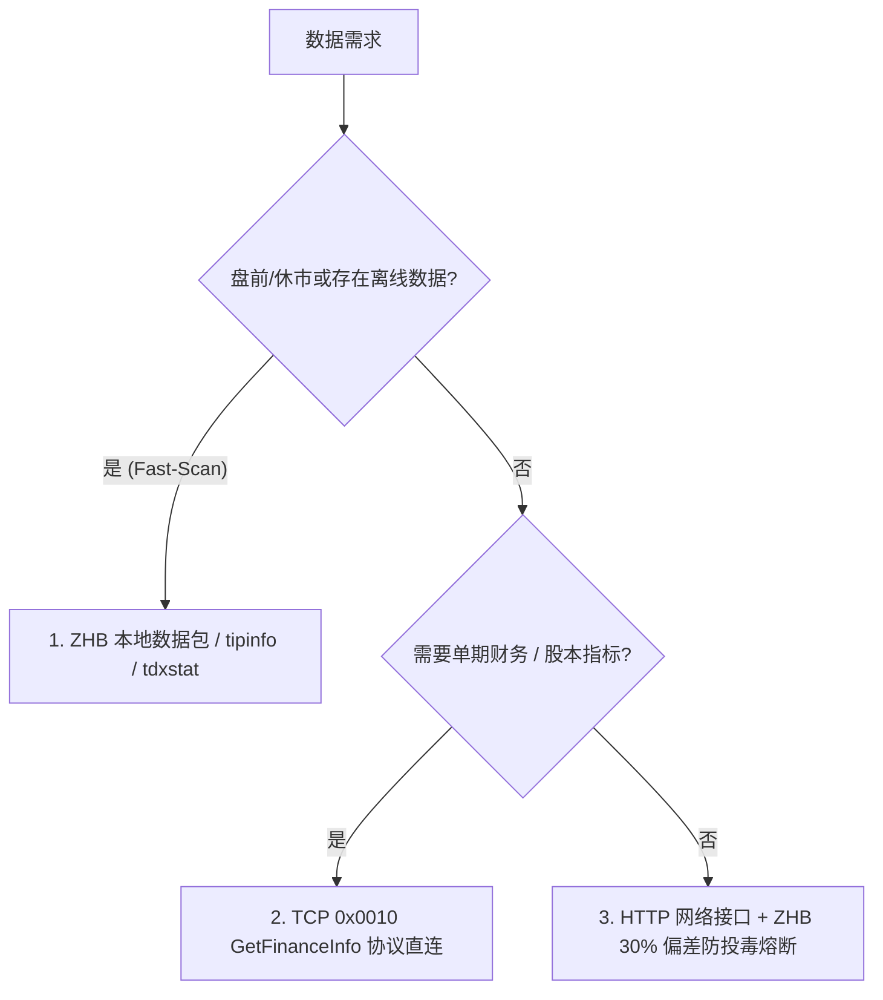
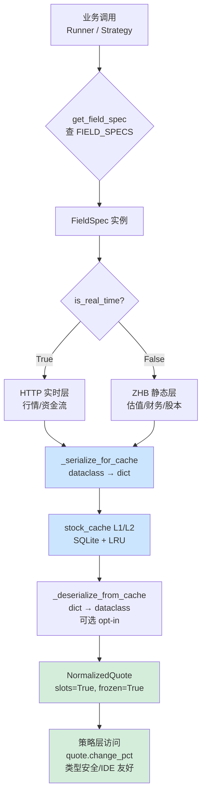

# A股数据架构全量接口与字段索引指南 (Master Reference)

> **创建日期**：2026-07-22  
> **最近核实**：2026-07-28（基于 zhb_20260721~20260727 连续5个交易日数据 + `zhb_client.py` 源码逆向交叉验证）  
> **V16.3 N 补充**：2026-08-06 新增"字段多源接口映射"节（§零）——同字段在不同数据源/接口的获取方式全集，提供更多选择与 fallback（AxData 256 接口核实）。
> **文档目的**：全面收录并归纳项目经过深度逆向工程、协议解包与线上验证得到的所有数据接口、字段映射、缓存机制及 Fallback 兜底防线，指导后续代码重构与策略开发，防止后续迭代失焦。
> **V17.0 破解纪律（2026-08-14 固化）**：
> **每次字段破解必须遵循 [字段破解方法论](field_verification/CRACKING_METHODOLOGY.md)**（前置采集 → 六大思路 → 铁证分级 → 固化链条①字段表→②矩阵→③脚本→④script_data_dict→⑤回归）。破解结论须标注铁证等级（L1 官方/数值精确 / L2 统计特征 / L3 结构自洽 / L4 候选 / ❌已证伪）。
> **V17.0 本机数据源(2026-08-14 三客户端全量破解)**: 通达信/同花顺/东财安装目录数据文件可离线解析——
> 完整资产清单见 docs/field_verification/20260814/local_assets.md; 官方字段 ID 体系见 §零·C。

---

## 零、 字段多源接口映射（V16.3 N，7 个财务字段先行）

> **V16.3 O14 破解收尾状态（2026-08-06，13 轮）**：
> 本次会话累计**破解/确认 28 个字段**（腾讯 12 + push2 13 + 新浪 1 + 误标修正 3 + F10 接口修复 1 项），
> 其余未知位均有多股实测值 + 排除项记录（防重复尝试）。**未破解清单**：
> 腾讯 [56]/[65]/[66]/[75]/[86]（有 10 股实测值+排除项）、push2 f103/f106-f118/f160/f190/f193-197（有四股全量）、
> ZHB tdxstat Col[22]（特征已记录，7.5 节）。下一步建议：push2 恢复稳定后用"季度财报切换日"抓取对照 f190-197；
> Col[22] 需通达信官方文档或更大样本。

> **§零·B 字段×源总表**（本字典尾部，自动生成）：全部字段 × 源的 fallback 路由矩阵，
> 正文修改后重跑 `scripts/gen_field_matrix.py` 同步（勿手改）。

> 原则：同一字段在不同接口可获取时，**按"易→难"选择**——
> **ZHB（离线零网络）→ TDX TCP（不封 IP，首选）→ 腾讯（不封 IP，首选）→ 新浪（低风险）→ 巨潮（低风险）→
> 同花顺（低风险，有 401 反爬史）→ AxData（local 模式未充分验证）→ 东财（最难：45000/h 封禁 20h + 观察期 + 共享风控，仅独有数据）**
> （V16.3 O18 修正——依据参考仓库 v3.2 数据源优先级 + 实测；此前"AXD 排腾讯前"为想当然排序）。
> 本表记录全部可用获取方式（含 AxData 256 接口核实 + 新浪实测），供 fallback 链扩展与字典溯源。
> 数据源缩写：ZHB=离线包 / TDX=通达信TCP / TX=腾讯 / SINA=新浪 / CNINFO=巨潮 / THS=同花顺 / AXD=AxData / EM=东财。

| 字段（中文）| 获取方式（按易→难）| 实测/核实状态 |
|---|---|---|
| **eps（每股收益）** | ① ZHB tipinfo Col[3]（报告期 EPS）② TDX F10 财务分析 main_indicators「基本每股收益」(元)（与 ZHB 交叉一致）③ SINA 财务报表（摊薄/加权每股收益）④ AXD 通达信财务摘要/财务诊断 ⑤ EM push2 f55（报告期，与 ZHB 同值）| ①②已接入；③实测返回 ✓ |
| **roe（净资产收益率）** | ① TDX F10 财务分析 profitability「加权净资产收益率」(%)（最新报告期）② SINA 财务报表（净资产收益率/加权）③ AXD 通达信财务基础摘要 `stock_finance_summary_tdx` / 财务诊断 `stock_financial_diagnosis_tdx` ④ 由净利/净资产自算（lng 现用路径）| ①已接入（V16.3 O，tdx:f10）；④现用（F10 profit/equity）；②实测返回 ✓ |
| **gross_margin（毛利率）** | ① TDX F10 财务分析 profitability「营业毛利率」(%)（最新报告期）② SINA 财务报表（销售毛利率）③ AXD 通达信财务摘要/财务诊断 ④ AXD 主营构成（分产品毛利率）| ①已接入（V16.3 O，tdx:f10）；②实测返回 ✓ |
| **net_profit_margin（净利率）** | ① 由净利/营收自算（canonical V16.3 O，`net_profit/revenue×100`，同源单位相消）② TDX F10 profitability「营业净利率」（营业利润口径，与 ① 差税费）③ SINA 财务报表（销售净利率）④ AXD 通达信财务摘要/财务诊断 | ①已接入（calc:net_profit/revenue）；②③④核实 ✓ |
| **net_profit（净利润）** | ① ZHB net_profit_kcf（本地，扣非口径近似）② TDX 0x0010 jinglirun（**单位角，/10 得元**，最新报告期，与 F10 同值）③ SINA 财务报表/利润表（净利润）④ AXD 通达信利润现金流摘要 `stock_profit_cashflow_summary_tdx` ⑤ AXD 盈利预测（预测口径）| ②已接入（V16.3 O，tdx:0x0010，000100 实测 15.56 亿=F10 一致）；①ZHB 已有 |
| **revenue（营业收入）** | ① TDX 0x0010 zhuyingshouru（**单位角，/10 得元**，最新报告期）② TDX F10 main_indicators「营业总收入」③ SINA 财务报表/利润表（主营业务收入）④ AXD 通达信利润现金流摘要 ⑤ AXD 盈利预测 ⑥ AXD 主营构成（分产品/地区）| ①已接入（V16.3 O，tdx:0x0010，000100 实测 434.5 亿）；②③核实 ✓ |
| **holder_count（股东户数）** | ① TDX 0x0010 gudong_renshu（最新报告期）② CNINFO 巨潮 `stock_hold_num_cninfo`（股东人数及持股集中度，12 字段——⚠️ 实测 403 源端风控）③ AXD 筹码分布（户均持股类）| ①已接入（V16.3 O，tdx:0x0010，000100 实测 614385）；②接口名直接对应 ⚠️403 |
| **dividend_yield（股息率）** | ① ZHB tdxstat Col[10] ② 腾讯 [64]（V16.3 O 破解=EM push2 f126 同源）③ AXD 分红指标 `stock_dividend_metrics_tdx` ④ EM push2 f126 | ①已接入 ✓；②=④同源 |
| **high_52w/low_52w（52周高低）** | ① ZHB tdxstat2 Col[17]/[18] ② 腾讯 [67]/[68]（元）③ EM push2 f174/f175（fltt=2 浮点元）④ TDX K线计算 | ①已接入 ✓；②③实测一致 |
| **list_date（上市日期）** | ① TDX 0x0010 ipo_date ② CNINFO 上市相关 ③ AXD 发行上市资料 `stock_ipo_listing_profile_tdx` ④ EM push2 f189 | ①已接入 ✓ |
| **概念/题材** | ① ZHB tdxchain（本地）② TDX boards（TCP）③ AXD 个股题材 `stock_topic_exposure_tdx` ④ EM push2 f129 | ①②已接入 ✓ |

> **AxData 256 接口目录**（通达信 90/扩展 31/交易所 3/东财 13/巨潮 32/腾讯 6/新浪 60/财联社 12/开盘红 9）
> 完整清单见本字典附录或 https://electkismet.github.io/AxData/interfaces/ ——新增字段优先查该目录确认多源可选。
> 字段↔接口映射随破解进度持续扩充（下一批：ZHB 碰撞确认后补全 tdxstat 财务列）。

> **V16.3 N ZHB 碰撞结论（2026-08-06，4 天连续包 0731~0805 + 新浪财务实测）**：
> 7 个财务字段在 ZHB 的覆盖情况——**eps ✓（tipinfo Col[3]，口径=最新报告期）；
> 其余 6 个（roe/毛利率/净利率/net_profit 全量/revenue/holder_count）ZHB 无对应列**——
> tdxstat 35 列已全破解（统计快照性质，非财务报表），茅台/招行/TCL 未知列
> （unknown2/23/26/31/32/33）与新浪 ROE 值均不匹配。**结论：这 6 个字段需外部源
> （新浪财务报表/巨潮股东户数/通达信财务摘要），ZHB 无法提供——避免未来重复尝试**。
>
> **V16.3.10 补充（2026-08-11 通达信客户端原始文件 + 12 股 F10 交叉验证）**：
> tdxstat 35 列/tdxstat2 21 列经官方原始文件（hq_cache）逐列核验 + 12 股 F10 文本
> 交叉印证——**确认列**：tdxstat Col[3]pe_dynamic/[6]change_pct/[9]pe_ttm/[10]股息率/
> [15]员工/[18]20日/[21]ytd/[28]5日/[30]10日；tdxstat2 Col[3]成交额(万)/[5][7]昨日前日成交额/
> [13]特色板块/[14][15]主力净买T/T-1/[16]ipo_price/[17][18]52周/[19][20]30日K线；
> **新线索**：Col[11]=自由流通股本（万股，茅台 5.4 亿≈12.52×46% 大股东锁定——zhb 未解析，
> 待 TdxQuant 复核）；Col[22]=通达信内部码（码表运行时下载）；Col[24]=盘中动态值（口径未明）。
> 详细实证：docs/verify/client_fields_enum.md §3.5/3.6/4.6

> **V16.3 O TDX F10 接入（2026-08-06）**：
> ZHB 碰撞确认无财务深度字段后，canonical 已接入 TDX 通道——
> **F10 财务分析（`tdx_get_financial_analysis`，0x02CF/0x02D0 协议，mootdx 兼容 F10C/F10）** 供
> roe/毛利率/eps（@cached gross_margin_roe）+ **0x0010（`tdx_get_finance_info`）** 供
> net_profit/revenue/holder_count（@cached financial）——**均为 TCP 层不封 IP，比新浪更易**。
> 关键单位修正：**0x0010 金额字段（jinglirun/zhuyingshouru/zongzichan 等）单位是「角」，
> /10 得元**（000100 实测：jinglirun=15564526250 角 → 15.56 亿元，与 F10「15.5645亿」一致；
> zhuyingshouru=434542880000 角 → 434.5 亿元）。**每股类字段（meigujingzichan 等）单位已是元**。
> 旧缓存注意：get_gross_margin_and_roe 返回结构新增 eps 键（V16.3 O），
> 升级时需 `invalidate_category('gross_margin_roe')` 清旧缓存，否则 eps 缺失。

### 零·A TDX F10 财务分析字段结构（V16.3 O 实测 000100，2026-08-06）

> 来源：`tdx_get_financial_analysis(code)` → F10「财务分析」分类（0x02D0 文本）→ f10_parser 解析。
> 返回 10 个子栏目 dict；每个栏目为 `[{period, 字段名: 值}, ...]` 列表（period 降序，最新期在 [0]）。
> **数字均为字符串**（如 '15.5645亿'、'2.47'），取用前必须解析（见下"亿单位字符串"）。

| 子栏目 | 字段（实测 000100 最新期 2026-03-31）| 对应业务字段 |
|---|---|---|
| `main_indicators` 主要财务指标 | 净利润(元)/扣非净利润(元)/营业总收入(元)/净利润增长率(%)/营业总收入增长率(%)/加权净资产收益率(%)/资产负债比率(%)/净利润现金含量(%)/基本每股收益(元)/稀释每股收益(元)/每股收益-扣除(元)/每股资本公积金(元)/每股未分配利润(元)/每股净资产(元)/每股经营现金流量(元) | net_profit/roe/eps/bvps |
| `profitability` 盈利能力 | 营业利润率/营业净利率/营业毛利率/成本费用利润率/总资产报酬率/加权净资产收益率 | gross_margin/roe |
| `growth` 成长能力 | 营业收入增长率/总资产增长率/营业利润增长率/净利润增长率/净资产增长率 | 增长率 |
| `solvency` 偿债能力 | 流动比率/速动比率/资产负债比率 等 | 财务健康 |
| `operation` 营运能力 | 应收账款周转率/存货周转率 等 | 财务健康 |
| `indicator_changes` 指标变动 | period + items: [{subject, reason}]（指标异动原因）| 异动说明 |
| `balance_sheet` 资产负债表 | 货币资金/存货/应收账款 等 | 资产结构 |
| `income_statement` 利润表 | 营业收入/营业成本/营业费用/管理费用/财务费用/投资收益/营业利润/利润总额 | revenue/成本 |
| `cash_flow` 现金流量表 | 经营活动现金流 等 | 现金流 |
| `qoq_analysis` 环比分析 | 各指标环比 | 环比 |

> **数值解析**：'15.5645亿' 表示 15.5645×10^8 元；'434.7782亿' 同理；纯数字为百分比原值。
> **口径**：最新报告期（如 2026-03-31 为一季报），**非年度**——与新浪"年报 ROE 7.35%"不同期，取用时注明报告期
> **V16.4.0 实锤**：F10 接口（TDX F10/0x0010/同花顺 F10 文本/新浪）中的 T 日数据都是“最新报告期”——
> 报告期披露滞后 T-1/T-2 很正常（Q1 4 月底/半年报 8 月底/年报次年 4 月底）——不是错误，是最新报告期的自然滞后。
> F10 字段对 T 日精确度**要求不高**（财务按报告期披露，本无 T 日版本）；T 日精度只要求行情/估值类
> （PE = T 日价 ÷ 最新报告期 EPS——T 日×报告期混合，正确组合）。
> **V16.4.0 标注改进**：canonical `report_period` 已从 zhb report_date 填充（push2 f221 时有时无）；
> med 单值 ROE/财务质量展示已加报告期标注（如 ROE: 10.57%（2026Q1））——防误读为“当前 ROE”。。
> **eps 交叉验证**：F10「基本每股收益」0.0692 = ZHB tipinfo Col[3] 0.0692 ✓（两源同值）。
> **扣非交叉验证**：F10「扣非净利润」11.5485亿 = ZHB net_profit_kcf 115484.79 万 ✓（同口径）。
> **F10C 分类**：16 个分类（最新提示/公司概况/财务分析/股东研究/股本结构/…），0x02CF 协议返回
> `{name, filename, start, length}`——内容按 start/length 切片读取（V16.3 O 修复 _EasyTdxAdapter
> 缺失 F10C/F10 代理后可用——此前 tdx_get_financial_analysis 静默失败，med 一直走新浪 fallback）。

<!-- GEN:field-matrix -->

### 零·B 字段×源总表（自动生成，勿手改）

> 生成：`scripts/gen_field_matrix.py`，2026-08-06。从本字典全部字段表自动提取，共 920 个字段 / 1103 条字段×源记录。

> 源排序按易→难：ZHB（离线零网络）→ TDX TCP（0x0010/F10/eltdx）→ AxData（local 模式）→ 腾讯（不封 IP）→ 东财（限流最严）→ 新浪 → 巨潮 → 其他。

> 字段名基于章节标题分类推断，精确接口见各节；正文修改后重跑本脚本即同步。

**B.1 多源字段（42 个，fallback 路由表）**

| 字段 | 源数 | 源（按易→难） |
|:---|:---:|:---|
| 行情 | 3 | TDX-0x0010/F10、腾讯、东财 |
| amount | 3 | TDX-eltdx、AxData、东财 |
| date | 3 | TDX-eltdx、AxData、东财 |
| open | 3 | TDX-eltdx、新浪、AxData |
| 股东户数 | 2 | TDX-0x0010/F10、akshare |
| ipo_date | 2 | TDX-0x0010/F10、TDX-eltdx |
| updated_date | 2 | TDX-0x0010/F10、TDX-eltdx |
| tdxstat Col[24] | 2 | ZHB、腾讯 |
| 返回 | 2 | 腾讯、新浪 |
| 价值 | 2 | 腾讯、新浪 |
| 资金 | 2 | TDX-0x0010/F10、东财 |
| name | 2 | AxData、东财 |
| reason | 2 | 开盘红、东财 |
| close | 2 | TDX-eltdx、东财 |
| time | 2 | TDX-eltdx、东财 |
| turnover_rate | 2 | 开盘红、东财 |
| is_new | 2 | 财联社、东财 |
| 涨跌停价 | 2 | akshare、东财 |
| performance | 2 | 财联社、东财 |
| turnover | 2 | 新浪、开盘红 |
| RQJMG | 2 | akshare、东财 |
| seal_amount | 2 | 开盘红、AxData |
| trade_date | 2 | 财联社、AxData |
| open_price | 2 | TDX-eltdx、AxData |
| opening_rush | 2 | TDX-eltdx、AxData |
| last_price | 2 | TDX-eltdx、AxData |
| high | 2 | TDX-eltdx、AxData |
| low | 2 | TDX-eltdx、AxData |
| change | 2 | TDX-eltdx、AxData |
| change_pct | 2 | TDX-eltdx、AxData |
| locked_amount | 2 | TDX-eltdx、AxData |
| rise_speed | 2 | TDX-eltdx、AxData |
| short_turnover | 2 | TDX-eltdx、AxData |
| min2_amount | 2 | TDX-eltdx、AxData |
| vol_rise_speed | 2 | TDX-eltdx、AxData |
| limit_up_price | 2 | TDX-eltdx、AxData |
| limit_down_price | 2 | TDX-eltdx、AxData |
| 全市场快照 | 2 | TDX-0x0010/F10、腾讯 |
| 板块强度 | 2 | TDX-0x0010/F10、腾讯 |
| 市场情绪 | 2 | TDX-0x0010/F10、腾讯 |
| 板块轮动 | 2 | TDX-0x0010/F10、腾讯 |
| 涨停池 | 2 | TDX-0x0010/F10、腾讯 |

**B.2 单源字段（878 个，无 fallback）**

- **ZHB（23）**：A 实时、B 准实时、C 日频、D 静态、PE、PE TTM、tdxstat Col[15] 员工数、tdxstat Col[22]、tdxstat Col[3]、tdxstat Col[5] streak_days、tdxstat Col[6、tdxstat2 Col[11] vs tdxstat Col[17]、tdxstat2 Col[12] vs tdxstat Col[19]、tipinfo Col[2]、前一日、前一日开盘量额、前两日成交额、封单额、年内涨停数、当日、日 Beta、涨跌幅滑动对、自由流通股本、连板统计
- **TDX-0x0010/F10（214）**：*ST湘邮、AI解读、BKFenShiZhiBo、ChangeStatistics、C中芯、DR 茅台、DailyLimitPerformance、DailyLimitPerformance2、GetBaseFaceListZDEvnArtNew、GetDayBaseFaceListZDEvnArt、GetGPCPHBTS_Tag、GetHotPHB、GetInfo、GetKLineDay_W14、GetKLineZhangTing、GetMainMonitor_w30、GetPanKou、GetPlateInfo_w38、GetPlate_Info_QJ、GetStockBid、GetStockList（龙虎榜）、GetStockPanKou、GetStockTrendIncremental、GetWeiTuo_W14、GlobalCommon、GroupCount_w28、Index、InfoBKR、MoodNumCount、MorningBiddingList、NewGetList、N百花医药、Radar、RealRankingInfo、RiseFallAnalysis、ST百花医药、SonPlate_Info、Theme、XD、XR、ZhiShuStockList_W8、[verify、all、api、axdata_verify.md)、axdata_verify.md](verify、balance_sheet` 资产负债表、belong、cash_flow` 现金流量表、changqifuzhai、client_fields_enum.md)、client_fields_enum.md](verify、cunhuo、fupanwang、getLongByPlate、getPlateDayChart、getPlateRotatChart、getPlateRotatData、get_pmsl、get_sector_heat
  - … 其余 154 个见正文
- **TDX-eltdx（60）**：Enum `Market、FinanceInfo`（财务）、FundFlow、HistoricalFundFlow、KlineCategory、MarketStat、SecurityBar`（K 线）、SecurityInfo`（证券列表）、SecurityQuote`（五档）、XdxrRecord`（除权除息）、adjust、auctions.series（0x056a）、business_composition、buy_levels、c1_value~c4_value、category_name、circulating_shares、current_hand、dividend_financing、down_count、eps_raw、fenhong、finance_diagnosis、get_auction_0925、high_price、history、hot_topics、inside_dish、jing_li_run_raw_float、liu_tong_gu_ben_raw_float、low_price、minutes.aux（0x051b）、minutes.today、net_profit_yuan、northbound_holding、open_amount_yuan、outer_disc、peigu、peigujia、period、pre_close_price、profit_forecast、recent、sell_levels、shareholder_change_plans、songzhuangu、stock_score、sum_buy_vol、sum_sell_vol、theme_market、topic_compare、total_assets_yuan、total_hand、total_shares、trades.today、up_count、valuation、volume_lots、zong_gu_ben_raw_float、zong_zi_chan_raw_float
- **腾讯（15）**：K线、PB、ROA、pb、tdxstat Col[11]、tdxstat Col[14]、tdxstat Col[34]、主力净(全市场批量)、估值 pe、分钟 K线、实测、月 K线、股息、腾讯字段 44、资金流(主力净)
- **新浪（25）**：URL、ask、ask_vol、bid、bid_vol、delta、gamma、item_tongbi、item_value、iv、last、limit_down、limit_up、netamount、open_interest、opendate、prev_close、report_list.{期次}.data[].item_title、report_type、strike、theory、theta、trade、vega、参数
- **财联社（17）**：catalyst、cur_heat、limit_up_board、market_degree、plate_code、plate_name、plates、profit_ratio、rank、rank_change、shsz_balance、shsz_balance_change_px、up_down_dis、up_open_num、up_open_ratio、up_ratio、up_ratio_num
- **开盘红（38）**：Detail、StockList、TagID、TagName、TagShuXing、ZSCode、ZSName、avg_change、buy_amount、dt、fall_dist、fall_num、flat、industry_id、industry_zt、limit_count、limit_tag、limit_time、market_cap、net_inflow、net_inflow_5d、open_time、q_zrcs、qscln、rise_dist、rise_num、s_zrcs、seal_money、sell_amount、sign、sjdt、sjzt、stdt、stock_count、stzt、szln、themes、zt
- **akshare（12）**：BPS、EPS、PE 历史百分位、push2 f137-146 资金流、push2 f51、push2 f55、两融 RZJME、历史分红、扣非净利、板块资金流 f62、股息率、龙虎榜 EXPLAIN
- **AxData（96）**：activity、amplitude_pct、ask1_price、ask1_volume、attack_pct、auction_prev_volume_ratio、average_change_pct、average_price、bid1_ask1_balance_pct、bid1_ask1_volume_diff、bid1_price、bid1_volume、capital_score、concept_capital_flow_tdx（题材资金走势）、cost70_concentration、cost70_range、cost90_concentration、cost90_range、current_volume、drawdown_pct、entrust_ratio、exchange、finance_updated_date、float_market_value、float_share、float_shares、free_float_market_value、free_float_share_z、free_float_shares、fundamental_score、high_change_pct、industry_name、industry_rank、industry_rank_total、inside_outside_ratio、inside_volume、instrument_id、limit_board_text、limit_ratio_pct、limit_rule、limit_stat_days、limit_status、limit_up_count_in_stat_days、limit_up_streak_days、low_change_pct、market_rank、market_rank_total、market_win_pct、name_flag、news_score、open_amount、open_amount_ratio_pct、open_change_pct、open_prev_amount_ratio、open_prev_seal_ratio、open_turnover_z、open_volume_hand、open_volume_ratio、option_chain_tdx（期权T型）、outside_volume
  - … 其余 36 个见正文
- **东财（378）**：.1、.2、.2%、.2%）、.6、.7 全合理）、.9%、ABLE_FREE_SHARES、ACCUM_AMOUNT、ASSIGN_PROGRESS、AVG_FREE_SHARES、BILLBOARD_BUY_AMT、BILLBOARD_NET_AMT、BONUS_RATIO、BUY、BUYER_NAME、BUY_RATIO、BUY_SEAT、CHANGE_RATE、CHANGE_TYPE、CLOSE_PRICE、D1~D30_CLOSE_ADJCHRATE、DATE、DCP、DEAL_AMOUNT_RATIO、DEAL_AMT、DEAL_NET_RATIO、DEAL_PRICE、DEAL_VOLUME、END_DATE、EXPLAIN、EXPLANATION、EX_DIVIDEND_DATE、FIN_BALANCE_GR、FREE_DATE、FREE_MARKET_CAP、FREE_RATIO、FREE_SHARES、FREE_SHARES_TYPE、HOLDER_NUM、HOLDER_NUM_CHANGE、HOLDER_NUM_RATIO、LINK_URL、MARKET、NET、NET_BS_AMT、NextTwoYear、NextYear、OHLC、OPERATEDEPT_CODE、OPERATEDEPT_NAME、PRETAX_BONUS_RMB、RCHANGE3D、ROE TTM（31.3%、RPTA_WEB_RZRQ_GGMX（两融）、RPT_DAILYBILLBOARD_DETAILSNEW（龙虎榜）、RPT_HOLDERNUMLATEST（股东户数）、RPT_LIFT_STAGE（解禁）、RPT_SHAREBONUS_DET（分红）、RQCHL
  - … 其余 318 个见正文

<!-- /GEN:field-matrix -->

---

### 零·C 三客户端官方字段 ID 体系(2026-08-14 从本机配置全量提取)

> **东财** (config\\DefaultCustomListHeader.json + HighStockPickingIndexConfig.xml):
> 表头 ID: A1-20=行情(A1最高/A2涨幅/A4涨跌/A5涨速/A6总量/A7现量/A8金额/A9量比/A10开盘/A17振幅/A18换手/A20昨收)、
> B1-21=盘口股本(B1均价/B8外盘/B9内盘/B13委差/B14委比/B15总股本/B16总市值/B18流通股本/B19自由流通股/B20流通市值)、
> C3=连涨天数、**D1-9=竞价族(D1竞价涨幅/D2竞价换手/D3竞价实际换手/D4竞价量/D5竞价金额/D6未匹配量/D7未匹配金额/D8竞价量比/D9竞昨成交量)**、
> E1-18=区间涨幅(3日/6日/月/年)、F1-30=财务(F1市盈/F4 PE-TTM/F5市净/F13加权ROE/F16营收增长/F18归母净利增长/F20扣非增长/F30毛利率)、
> **G1-12=主力资金(G1主力净流入/G2量涨速/G3主力净量/G4-7 3/5/10/20日主力净流入/G8 DDX/G9 DDY/G10 DDZ/G11 DDF/G12 DDX连红天数)**、I3=所属行业
> 全表: docs/verify/em_tableheader_ids.md; 指标代码 939 个(100000000xxx): docs/verify/em_indicators.md
>
> **同花顺** (system\\同花顺方案\\tableheader\\*.ini + iwcDataTable.ini + FyTableHeaderIdToConfigMapping.ini):
> 列 ID 682 个(8197=代码/20490=现价/526792=振幅/3426=连续涨停天数/3419=昨日涨停时间/3420=昨日涨停原因/
> 133970=封单量/133971=封单额/330327-328=最高封单量额/330323=首次涨停时间_new/330325=涨停类型/
> 68762=集合竞价撮合涨幅/330347=竞价换手/920371=开盘涨幅/920372=实体涨幅/331068=FREE净流入/20549-50=涨停跌停价/
> 134222=涨停开板次数/12339=分价量比); 指标 81 个(807731200=几天几板/807862272=主力金额 main_net_inflow/
> 806223872=市盈pe_lyr/806289408=市盈(动)pe_mrq/806354944=市净率pb_mrq/805371904-76=60/120/250日涨幅/807796736=自由流通市值);
> IWC 数据 56 项(65536=昨日陆股通净买入量/13631488=连续涨停天数/14680064=今日涨停原因/15728640=涨停封单量/
> 16777216=涨停封单金额/17825792=近一周涨停次数/18874368=近一月涨停次数/19922944=近一年涨停次数/26214400=上市天数)
> 全表: docs/verify/ths_tableheader_ids.md
>
> **通达信** (T0002\\bigdata_1.zip cloud_cfg\\func_*.cfg 641 个功能配置):
> **官方字段 1,924 个(code→中文名)**: 全表 docs/verify/tdx_func_fields.md;
> 样例: 股东人数(date1起始/date截止/date3变动周期)、财务(BGQ报告期/SZ市值/PE)、
> 沪深港通(drzjlr流入/drye余额/cje1净买入=calc mrcje-mccje 买入-卖出→佐证 f135-146 买卖差结构)
>
> **交叉印证(三方闭环)**: 东财 D1-9 竞价族 ↔ ZHB [9]/[10]/[14]/[15] 竞价量/额 ↔ 同花顺竞价换手/集合竞价涨幅 ✓
> **V17.0 官方 ID 核实项目源字段（2026-08-14）**: ①tdxstat [31]=**连板天数**(官方 func lbts=连板天数/LastStartZT, 8/13 全市场 4 组 100% 实锤),
> [32]=涨停计数(LastZTHzNum/ztcs1)、[33]=涨停类型族(ztlx, 待终核); ②push2 f55/f92/f173/f186/f188 均对上官方指标名; ③同花顺 133971 封单额↔tdxstat2[4] ✓
> 东财 G1/G5/G6/G7 主力 3/5/10/20日 ↔ f137+f140/5日 f178 聚合 ↔ 同花顺 FREE净流入 ✓

## 一、
## 一、 数据获取优先级与架构总纲 (Core Paradigms)

系统整体遵循以下三级金字塔获取原则：



### 1. 三大设计防线 (Design Guardrails)
1. **ZHB 财报事件锁 (Event-Driven Lock)**：对于季度更新的 12 季度历史财报（如新浪接口），禁止使用固定 90 天或 24 小时 TTL。将 ZHB 的 `report_date` 动态拼入 SQLite 缓存 Key（如 `fin:600519:12:report_date=20240331`），实现**永久缓存 + 报告期变更瞬间刷新**。
2. **ZHB 地面真理防投毒 (Anti-Poisoning Fuse)**：ZHB T-1 数据作为绝对真理（Ground Truth）。当 HTTP 接口返回 PE/PB/股息率时，计算 `abs(HTTP - ZHB) / ZHB`。若偏差超出 **30%**，判定 HTTP 数据已被垃圾数据污染，直接强行弃用 HTTP 并由 ZHB 数据兜底。
3. **休市/盘前 Fast-Scan**：在 9:15 前、15:00 后或休市日运行扫描脚本时，自动拦截 HTTP 请求，100% 走 ZHB 本地内存检索，秒级完成全市场扫描。

---

## 二、 TCP `GetFinanceInfo` (0x0010) 二进制全量字段映射

通过 `tdx_client.py` 中的 `tdx_get_finance_info(code)` 提取，直连券商服务器，耗时 5~15ms，完全无 IP 封禁风险。

**协议来源**：通过 `tdxpy/parser/std/get_finance_info.py`（Python 环境 site-packages 内，非本仓库代码）反向工程获得权威字段定义，共 **36 个字段**（含 2 个标识字段 market/code + 34 个数据字段）。mootdx 0.11.7 + tdxpy 0.1.22 协同解析。

### 2.1 协议完整 36 字段表（权威定义）

> **单位说明（V16.3 O19 修正——实测口径，旧表"×10000 万元"全错）**：
> - **金额类字段**（zongzichan/jingzichan/jinglirun/zhuyingshouru/jingyingxianjinliu/负债/存货 等）：单位=**角**，`/10` 得元
>   （000100 实测：jinglirun=15564526250 角 → 15.56 亿元=F10 一致；zhuyingshouru=434542880000 角 → 434.5 亿）
> - **股本类字段**（zongguben/liutongguben 等）：单位=**股**（V16.2.3 easy_tdx 口径已确认）
> - **每股类**（meigujingzichan/gudongrenshu）：原值（元/户）

| 协议偏移 | 字段名 (`key`) | 中文含义 | 类型 | 协议单位 | 还原后单位 | 字段分组 | 项目代码使用 |
|:---:|:---|:---|:---:|:---|:---|:---|:---:|
| 0 | `market` | 市场代码 (0=深/1=沪) | `byte` | 0/1/2 | 0=深/1=沪/2=京 | 标识 | ❌ |
| 1 | `code` | 股票代码 | `str` | 6位字符串 | 6位字符串 | 标识 | ❌ |
| 2 | **`liutongguben`** | **流通股本** | `float` | `×1(股)` | **股** | 股本 | ✅ |
| 3 | `province` | 省份编码 | `ushort` | 编码值 | 编码值（需查表） | 基础 | ❌ |
| 4 | **`industry`** | **通达信行业编码** | `ushort` | 编码值 | 编码值（需查表） | 基础 | ✅ |
| 5 | **`updated_date`** | **财报更新日期** | `uint` | YYYYMMDD | YYYYMMDD | 基础 | ✅ |
| 6 | **`ipo_date`** | **上市日期** | `uint` | YYYYMMDD | YYYYMMDD | 基础 | ✅ |
| 7 | **`zongguben`** | **总股本** | `float` | `×1(股)` | **股** | 股本 | ❌ |
| 8 | `guojiagu` | 国家股 | `float` | `×1(股)` | 股 | 股本（结构性） | ❌ |
| 9 | `faqirenfarengu` | 发起人法人股 | `float` | `×1(股)` | 股 | 股本（结构性） | ❌ |
| 10 | `farengu` | 法人股 | `float` | `×1(股)` | 股 | 股本（结构性） | ❌ |
| 11 | `bgu` | B股 | `float` | `×1(股)` | 股 | 股本（结构性） | ❌ |
| 12 | `hgu` | H股 | `float` | `×1(股)` | 股 | 股本（结构性） | ❌ |
| 13 | `zhigonggu` | 职工股 | `float` | `×1(股)` | 股 | 股本（结构性） | ❌ |
| 14 | **`zongzichan`** | **总资产** | `float` | `角(/10得元)` | **角（→元需角(/10得元)）** | 资产 | ✅ |
| 15 | `liudongzichan` | 流动资产 | `float` | `角(/10得元)` | 角 | 资产 | ❌ |
| 16 | `gudingzichan` | 固定资产 | `float` | `角(/10得元)` | 角 | 资产 | ❌ |
| 17 | `wuxingzichan` | 无形资产 | `float` | `角(/10得元)` | 角 | 资产 | ❌ |
| 18 | **`gudongrenshu`** | **股东户数** | `float` | **原始值** | **户** | 股东 | ✅ |
| 19 | `liudongfuzhai` | 流动负债 | `float` | `角(/10得元)` | 角 | 负债 | ❌ |
| 20 | `changqifuzhai` | 长期负债 | `float` | `角(/10得元)` | 角 | 负债 | ❌ |
| 21 | `zibengongjijin` | 资本公积金 | `float` | `角(/10得元)` | 角 | 权益 | ❌ |
| 22 | **`jingzichan`** | **净资产 / 股东权益** | `float` | `角(/10得元)` | **角** | 权益 | ✅ |
| 23 | `zhuyingshouru` | 主营业务收入 | `float` | `角(/10得元)` | 角 | 业绩 | ❌ |
| 24 | `zhuyinglirun` | 主营业务利润 | `float` | `角(/10得元)` | 角 | 业绩 | ❌ |
| 25 | `yingshouzhangkuan` | 应收账款 | `float` | `角(/10得元)` | 角 | 业绩 | ❌ |
| 26 | `yingyelirun` | 营业利润 | `float` | `角(/10得元)` | 角 | 业绩 | ❌ |
| 27 | `touzishouyu` | 投资收益 | `float` | `角(/10得元)` | 角 | 业绩 | ❌ |
| 28 | `jingyingxianjinliu` | 经营活动现金流 | `float` | `角(/10得元)` | 角 | 现金流 | ❌ |
| 29 | `zongxianjinliu` | 总现金流 | `float` | `角(/10得元)` | 角 | 现金流 | ❌ |
| 30 | `cunhuo` | 存货 | `float` | `角(/10得元)` | 角 | 资产负债 | ❌ |
| 31 | `lirunzonghe` | 利润总和 | `float` | `角(/10得元)` | 角 | 业绩 | ❌ |
| 32 | `shuihoulirun` | 税后利润 | `float` | `角(/10得元)` | 角 | 业绩 | ❌ |
| 33 | **`jinglirun`** | **净利润** | `float` | `角(/10得元)` | **角** | 业绩 | ✅ |
| 34 | `weifenpeilirun` | 未分配利润 | `float` | `角(/10得元)` | 角 | 权益 | ❌ |
| 35 | `meigujingzichan` | 每股净资产 (BPS) | `float` | **原始值** | **元/股** | 每股指标 | ❌ |
| 36 | `baoliu2` | 保留字段2 | `float` | - | - | 保留 | ❌ |

### 2.2 字段组分类与策略价值

| 字段组 | 包含字段 | 协议覆盖率 | 策略价值 |
|:---|:---|:---:|:---|
| **股本结构** | `liutongguben/zongguben/guojiagu/faqirenfarengu/farengu/bgu/hgu/zhigonggu` (8 个) | 100% | ⭐⭐⭐⭐⭐ **市值计算根基**（`zongguben × price`） |
| **股东户数** | `gudongrenshu` (1 个) | 100% | ⭐⭐⭐⭐⭐ **筹码集中度（户均持股=`liutongguben / gudongrenshu`）** |
| **资产/负债** | `zongzichan/liudongzichan/gudingzichan/wuxingzichan/liudongfuzhai/changqifuzhai` (6 个) | 100% | ⭐⭐⭐⭐ **资产负债率=`(liudongfuzhai + changqifuzhai) / zongzichan`** |
| **权益** | `zibengongjijin/jingzichan/weifenpeilirun` (3 个) | 100% | ⭐⭐⭐⭐⭐ **PB=`price / (jingzichan / zongguben)`** |
| **经营业绩** | `zhuyingshouru/zhuyinglirun/yingshouzhangkuan/yingyelirun/touzishouyu/lirunzonghe/shuihoulirun/jinglirun` (8 个) | 100% | ⭐⭐⭐⭐⭐ **ROE=`jinglirun / jingzichan`、净利率=`jinglirun/zhuyingshouru`** |
| **现金流** | `jingyingxianjinliu/zongxianjinliu` (2 个) | 100% | ⭐⭐⭐⭐ **现金流质量** |
| **基础信息** | `updated_date/ipo_date/province/industry` (4 个) | 100% | ⭐⭐⭐⭐⭐ **财报事件锁、次新股筛选** |
| **存货** | `cunhuo` (1 个) | 100% | ⭐⭐⭐ **存货周转与积压排雷** |
| **每股指标** | `meigujingzichan` (1 个) | 100% | ⭐⭐⭐⭐⭐ **BPS、PB 计算直接字段** |
| **保留** | `baoliu2` (1 个) | - | 暂无业务用途 |

### 2.3 项目实际使用情况（与原文档对比）

> **核实日期**：2026-07-28，基于项目源码扫描（项目根目录）全量 `.py` 文件（除 `venv` / `.git`）。

#### ✅ 项目代码正确使用（8 个字段）

| 字段 | 项目使用位置 |
|:---|:---|
| `liutongguben` | [tdx_client.py:804](../tdx_client.py#L804)、[stock_common/sc_datasource.py:225](../stock_common/sc_datasource.py#L225) 等 |
| `industry` | [get_lng_report.py:200](../get_lng_report.py#L200)、[get_sht_report.py:336](../get_sht_report.py#L336) 等 10+ 处 |
| `updated_date` | [stock_common/sc_datasource.py:229](../stock_common/sc_datasource.py#L229)、[sc_capital_cache.py:121](../stock_common/sc_capital_cache.py#L121) 等 |
| `ipo_date` | [stock_common/sc_datasource.py:846](../stock_common/sc_datasource.py#L846) |
| `zongzichan` | 多个 get_*_report.py 文件计算资产负债率 |
| `gudongrenshu` | **通过其他路径间接使用**（实际 key 错，见下方 Bug） |
| `jingzichan` | [tdx_client.py:805](../tdx_client.py#L805)、多个 get_*_report.py |
| `jinglirun` | [tdx_client.py:804](../tdx_client.py#L804)、多个 get_*_report.py |

#### ❌ 项目代码使用但 key 错误（10 个 Bug）

| ❌ 错误 key | ✅ 应改为 | 问题位置 | 影响 |
|:---|:---|:---|:---|
| `gudong_renshu` | `gudongrenshu` | [sc_datasource.py:228](../stock_common/sc_datasource.py#L228) `_holder_fetch_tdx_optimized` | **股东户数永远拿不到**（拼写错误，多了下划线） |
| `total_capital` | `zongguben` | [sc_capital_cache.py:125](../stock_common/sc_capital_cache.py#L125) `_fetch_share_capital` | **TDX 总股本永远拿不到**（错用股本 cache 的 key） |
| `float_capital` | `liutongguben` | [sc_capital_cache.py:126](../stock_common/sc_capital_cache.py#L126) `_fetch_share_capital` | **TDX 流通股本永远拿不到** |
| `latest_indicators` | **F10 接口字段**（非 0x0010） | [sc_capital_cache.py:123](../stock_common/sc_capital_cache.py#L123) | **完全错配接口**：期望 dict 含 `latest_indicators`，但 0x0010 返回的 dict 无此 key |
| `short_term_debt` | `liudongfuzhai` | 仅在 [docs/field_dict.md](../docs/field_dict.md) 文档 | 文档错误，代码未引用 |
| `long_term_debt` | `changqifuzhai` | 同上 | 文档错误，代码未引用 |
| `meigugongji` | `zibengongjijin / 10000` | 同上 | 文档错误，应是 zibengongjijin 除以 10000 |
| `meiguweifenpei` | `weifenpeilirun / 10000` | 同上 | 文档错误，应是 weifenpeilirun 除以 10000 |
| `shiyebianma` | `industry` | 同上 | 文档错误，协议中是 industry |
| `huobi_zijin` | **F10 接口字段**（0x0010 不含） | 同上 | 文档错误，0x0010 不含货币资金字段 |

### 2.4 字段组在策略中的典型应用公式

| 策略 | 计算公式 | 所需字段 |
|:---|:---|:---|
| **总市值** | `zongguben × 10000 × price` | `zongguben` + `price` |
| **流通市值** | `liutongguben × 10000 × price` | `liutongguben` + `price` |
| **市净率 (PB)** | `price / (jingzichan / zongguben)` | `price` + `jingzichan` + `zongguben` |
| **净资产收益率 (ROE)** | `jinglirun / jingzichan` | `jinglirun` + `jingzichan` |
| **市销率 (PS)** | `price × zongguben / zhuyingshouru` | `price` + `zongguben` + `zhuyingshouru` |
| **销售净利率** | `jinglirun / zhuyingshouru` | `jinglirun` + `zhuyingshouru` |
| **资产负债率** | `(liudongfuzhai + changqifuzhai) / zongzichan` | `liudongfuzhai` + `changqifuzhai` + `zongzichan` |
| **人均持股（筹码集中度）** | `liutongguben × 10000 / gudongrenshu` | `liutongguben` + `gudongrenshu` |
| **每股净资产 (BPS)** | `meigujingzichan` | `meigujingzichan`（直接） |
| **次新股筛选** | `ipo_date >= 2024YYYYMMDD` | `ipo_date` |
| **财报新鲜度事件锁** | `updated_date` | `updated_date` |
| **应收账款风险** | `yingshouzhangkuan / zhuyingshouru` | `yingshouzhangkuan` + `zhuyingshouru` |
| **现金流质量** | `jingyingxianjinliu / jinglirun` | `jingyingxianjinliu` + `jinglirun` |

### 2.5 协议调用链路与数据流

```
TDX 服务器 (端口 7709)
  └─ 0x06B9 GetReportFile (下载 zhb.zip)
  └─ 0x0010 GetFinanceInfo (单只股票 36 字段)
       │
       ▼
  tdxpy.parser.std.get_finance_info.GetFinanceInfo.parseResponse
       │ 返回 OrderedDict，key 为拼音 (liutongguben/zongguben/...)
       │ V16.3 O19: 金额字段=角(/10得元)、股本=股
       │
       ▼
  mootdx.Quotes.finance(symbol=code)
       │ 转换为 pandas DataFrame
       │
       ▼
  tdx_client.tdx_get_finance_info(code)
       │ 取首行转为 dict
       │ key 仍为拼音（与 tdxpy 一致）
       │
       ▼
  业务模块调用（get_*_report.py / sc_datasource.py / strategy_config.yaml）
```

### 2.6 与 Gemini 核实 18 字段的对比

> Gemini 给出的 18 字段全部在协议中存在，且 key 命名 100% 一致。本文档 36 字段表是在 Gemini 18 字段基础上**补全**所有 36 字段（Gemini 覆盖率 50%）。

| Gemini 18 字段 | 核实状态 |
|:---|:---|
| `gudongrenshu/zongzichan/liudongfuzhai/changqifuzhai/jingzichan/zhuyingshouru/jinglirun/jingyingxianjinliu/ipo_date/liutongguben/zongguben/meigujingzichan/cunhuo/yingshouzhangkuan/zibengongjijin/weifenpeilirun/updated_date/province/industry` | ✅ 全部正确，key 命名 100% 一致 |
| 协议中**未提及**的 18 字段 | `market/code/guojiagu/faqirenfarengu/farengu/bgu/hgu/zhigonggu/liudongzichan/gudingzichan/wuxingzichan/zhuyinglirun/yingyelirun/touzishouyu/zongxianjinliu/lirunzonghe/shuihoulirun/baoliu2` | **新增**（Gemini 未提及但协议中存在） |

---

## 三、 ZHB 离线数据包解析与字段精查字典

文件来源：`zhb_*.zip` 解压文件（包含 45 个文件，14 个每日刷新，31 个静态）。  
**核实日期**：2026-07-28，基于 zhb_20260721~20260727 连续 5 个交易日数据 + `zhb_client.py` 源码逆向交叉验证。  
**V16.4.1 再核实（2026-08-12）**：20 股 × 8 个连续 ZHB 包 + **TdxQuant 官方 88 字段 18 只全样本对照**（详见 `docs/field_verification/20260812/field_analysis.md`）。**本日破解/修正**：tdxstat2 [4]/[6]/[8] 三日滚动序列、[26]=YearZTDay(18/18)、[32]=LastZTHzNum(2/2)、[23] 异动码、[24] CashZJ 单位=万元、[3] pe_dynamic=StaticPE_TTM、[31] 疑=LastStartZT、tipinfo 5 列官方名实锤。

> **核实状态图例**：✅ 已验证（代码+数据双重确认） | ⚠️ 待确认（代码未映射或含义存疑） | ❌ 已纠正（原文档有误）

### 1. `tdxstat.cfg` (个股综合统计快照，35 个字段，7,951 行)

分隔符：`|`（pipe），编码：GBK。覆盖全市场 A 股 + ETF/基金/债券（共 7,951 只标的）。  
代码解析器：`zhb_client.py:587-672`，代码中实际映射到 dict 的字段共 **18 个**（其余 17 个被丢弃或未识别）。

| 索引 | 代码变量名 | 字段含义 | 核实状态 | 数据格式 | 20260727 实测值 (000001/600519) | 策略价值 |
| :--: | :--- | :--- | :---: | :--- | :--- | :--- |
| **[0]** | `market` | 市场代码 | ✅ | `0`=深, `1`=沪, `2`=京 | `0` / `1` | 前缀拼接 (`sh`/`sz`/`bj`) |
| **[1]** | `code` | 股票代码 | ✅ | 6位字符串 | `000001` / `600519` | 主键 Code |
| **[2]** | *(丢弃)* | ✅ **= BetaValue（Beta 系数）** | ❌→✅ | `float` | `-0.1563` / `-0.0488` | **2026-08-04 官方通达信确认**：茅台 ZHB=-0.0963 vs 官方 BetaValue=-0.10、工行 ZHB=-0.4670 vs 官方=-0.47（均精确/接近）。9 天连续变化符合 Beta 时变性。平安官方 Beta=0（数据缺失），但 ZHB=-0.1721 量级一致。原"实时估值偏离系数"错误 |
| **[3]** | `pe_dynamic` | **市盈率 = 官方 StaticPE_TTM**（⚠️ 变量名历史遗留,非动态PE） | ✅ | `float` | `5.01` / `19.49` | ⭐⭐⭐⭐ 估值。**18/18 全样本匹配 TdxQuant StaticPE_TTM**（2026-08-12）；真动态 PE 用 push2 f162=DynaPE |
| **[4]** | `date` | 数据快照日期 | ✅ | `YYYYMMDD` | `20260727` | ZHB 数据新鲜度判断 |
| **[5]** | `streak_days` | **连涨/连跌天数** | ✅ | 整数 (正=连涨, 负=连跌) | `4` / `-1` | ⭐⭐⭐⭐⭐ 短线动能指标 |
| **[6]** | `change_pct` | **T 日涨跌幅 (%)** | ✅ | `float` | `0.09` / `-0.61` | ⭐⭐⭐⭐⭐ T日真实收盘涨跌幅 |
| **[7]** | `change_pct_1d` | **T-1 日涨跌幅 (%)** | ✅ | `float` | `0.18` / `0.42` | ⭐⭐⭐⭐⭐ 与 Col6 形成1日滞后对 |
| **[8]** | `change_pct_2d` | **T-2 日涨跌幅 (%)** | ✅ | `float` | `0.91` / `-1.00` | ⭐⭐⭐⭐⭐ 3日K线组合 |
| **[9]** | `pe_ttm` | **市盈率 (TTM) = 官方 MorePE** | ✅ | `float` | `5.0571` / `19.5819` | ⭐⭐⭐⭐ TTM估值。**18/18 匹配 TdxQuant MorePE**（2026-08-12,茅台 20.4474 vs 官方 20.45） |
| **[10]** | `dividend_yield` | **股息率 (%) = 官方 DYRatio** | ✅ | `float` | `5.36` / `4.03` | ⭐⭐⭐⭐⭐ 股息策略。**18/18 匹配 TdxQuant DYRatio**（茅台 3.86=官方 3.86=push2 f126 3.87） |
| **[11]** | *(丢弃)* | ✅ **= 自由流通股本 FreeLtgb（万股）** | ❌→✅ | `float` (大数值) | `816048.12` / `54094.90` | **2026-08-04 官方通达信 TdxQuant 确认**：茅台 FreeLtgb=54094.9、工行=3119269.27 与 ZHB 精确匹配（2/3 公司，平安因 H 股口径差异待查）。**V16.4.1 二次实测（2026-08-12）**：TdxQuant get_more_info 直接返回 FreeLtgb=54094.90（茅台），与 ZHB 完全一致 |
| **[12]** | `unseal_date` | ✅ **= 新股开板日 (YYYYMMDD)** | ❌→✅ | 日期 | `""` / `""` | **V16.2.18 破解**（东财 f189 交叉）：2016+ 新股上市后首次不再涨停的日期；与 f189 上市日差值=连板交易日数（001203 大中矿业 10 日历日=8 交易日✓、300750 宁德 8 交易日✓、24 样本 18/24 精确、余差 1 天为节假日近似）。老股/2015 前为空。**V16.4.1 补强（2026-08-12，20 股×8 天序列）**：8 天完全稳定（静态字段）；10 只次新股案例全过（300788=20190715/6板、603221=20200326/3板、002827=20161226/11板、688553/688589/688327/688426/301091/688500 上市日=开板日且板数=0 即首日开板） |
| **[13]** | `board_count` | ✅ **= 上市连板数（交易日）** | ❌→✅ | 整数 | `""` / `""` | **V16.2.18 破解**：开板日-上市日间的交易日数（18/24 精确匹配；300750=8 连板✓、001223 首日开板=0✓）。与 Col[12] 构成"次新股开板"数据对。**V16.4.1 新发现（2026-08-12）**：北交所（920118 太湖远大）unseal_date 有值但 **board_count=None 不计数**（主板/科创板为 0 或整数） |
| **[14]** | *(丢弃)* | **扣非净利润 (万元) = 官方 KfEarnMoney** | ❌→✅ | `float` (万元) | `1448800.00` / `2723998.52` | **三源铁证**：东财 KCFJCXSYJLR 14/14(2026-08-03) + **TdxQuant KfEarnMoney 18/18**(2026-08-12) + 301091 中报刷新事件(8/6 -7093→-693.67) |
| **[15]** | `employee_count` | **员工总人数 (人) = 官方 StaffNum** | ✅ | `int` | `41698` / `34992` | ⭐⭐⭐⭐⭐ **18/18 匹配 TdxQuant StaffNum** |
| **[16]** | *(丢弃)* | ✅ **= 研发投入 RDInputFee（万元）** | ❌→✅ | `float` | `5931.07` / `0.00` | **2026-08-04 官方通达信确认**：茅台 RDInputFee=5931.07 精确匹配。研发投入(万元)，无研发公司为 0 |
| **[17]** | `change_20d` | ✅ **近20根K线涨跌幅(含当日)** | ❌→✅ | `float` | `10.55` / `8.77` | **V16.2.18 修正**（injoyai 130 日日线核验 MAE0.23）：原误标"20日"，实为"近20根K线"（交易日口径，含当日）。**注：zhb_client 的 change_20d key 现映射 Col[18]** |
| **[18]** | `change_30d` | ✅ **= 截至T-1的20根K线涨跌幅** | ❌→✅ | `float` | `8.50` / `7.91` | **V16.3 O28 修正**（K线缓存 926 只对照：k20+shift1 中位差 **0.93**——决定性；日历 20 日 c20 相关仅 0.37 排除）。原 V16.2.18"20日"为近似误判；**key 名 change_30d 为历史遗留** |
| **[19]** | `change_60d` | ✅ **近60根K线涨跌幅** | ❌→✅ | `float` | `-0.45` / `-6.09` | **V16.2.18 修正**（injoyai 核验 MAE≈0）：实为"近60根K线"（交易日口径）。zhb_client 已另设 change_60k_bar 精确名 |
| **[20]** | `change_60d_alt` | ✅ **= 截至T-1的60根K线涨跌幅** | ❌→✅ | `float` | `0.09` / `-6.35` | **V16.3 O28 修正**（K线缓存 926 只对照：k60+shift1 中位差 **1.28**；日历 60 日 c60 相关仅 0.25 排除——**原 V16.2.18"60日日历口径"为误判**）。**zhb_client 的 change_60d key 已改读本列**（原误读 Col[19]） |
| **[21]** | `change_ytd` | **年初至今涨跌幅 (YTD %)** | ✅ | `float` | `0.54` / `-4.42` | ⭐⭐⭐⭐ 机构年度战绩比对 |
| **[22]** | *(丢弃)* | ✅ **= 形态/板块代码 ShapeValue** | ❌→✅ | `int` (大整数) | `50101` / `50109` | **2026-08-04 官方通达信确认**：茅台官方 ShapeValue=51101（同日异动归属变化，与 ZHB=50109 同一体系）。非固定行业归属，是当日形态/板块代码 |
| **[23]** | *(丢弃)* | ⚠️ **= 当日行情类型分档码**(23 类, 0-95) | ⚠️ | `int` | `11` | **V17.0 补强(2026-08-14)**: 同值组当日涨幅区间高度一致([71]组 -10~-4 大跌/[70]组 +4~+20 大涨/[33]组 -1.2~+0.8 窄幅/[52]组 -3~+1.9)——当日强弱分档非个股基本面; 疑 func 异动类型/行情状态码 |
| **[24]** | *(丢弃)* | ✅ **= 现金总额 CashZJ（万元）** | ❌→✅ | `float` (万元) | `38799600.00` / `4878669.14` | **2026-08-04 官方通达信 TdxQuant 确认**：茅台 CashZJ=4878669.00、工行=382318909.85 与 ZHB 精确匹配。**破解！非成交量/总负债/报告期快照**。**V16.4.1 单位实锤（2026-08-12）**：同接口官方 KfEarnMoney(扣非净利润)=2723998.52 **万元** 与 ZHB Col[14] 一致 → CashZJ=4878669.00 同量级必为**万元**（茅台 487.87 亿现金合理）；**原"(元)"标注错误,已修正为万元** |
| **[25]** | *(丢弃)* | ✅ **= 预收资金 PreReceiveZJ（万元）** | ❌→✅ | `float` | `302719.54` / `302719.52` | **2026-08-04 官方通达信确认**：茅台 PreReceiveZJ=302719.54 精确匹配 |
| **[26]** | *(丢弃)* | ✅ **= 年内涨停天数 YearZTDay** | ❌→✅ | `int` | `0` / `0` | **V16.4.1 破解（2026-08-12, 18/18 全样本匹配 TdxQuant YearZTDay）**：603221=18、002827=6、000007=3、688500=1 全部精确一致。原"恒为 0"错误 |
| **[27]** | `change_5k_bar` | **近 5 根K线涨跌幅 (%)** | ✅ | `float` | `2.49` / `-1.41` | 交易日口径（K线根数）；与 change_5d 含义相近 |
| **[28]** | `change_5d` | **近 5 日涨跌幅 (%)** | ✅ | `float` | `1.18` / `-2.86` | ⭐⭐⭐⭐ 短线周线强弱。**V17.0 口径实锤（2026-08-13 日K实测）: 交易日口径**（600519 8/12 收盘 1343.00 vs 8/5 收盘 1258.16 → 2.80% 精确匹配; 原"日历日口径"标注**错误已修正**） |
| **[29]** | `change_10k_bar` | **近 10 根K线涨跌幅 (%)** | ✅ | `float` | `3.93` / `6.14` | 交易日口径 |
| **[30]** | `change_10d` | **近 10 日涨跌幅 (%)** | ✅ | `float` | `5.41` / `6.48` | ⭐⭐⭐ 双周强弱。**V17.0 口径实锤: 交易日口径**（600519 8/12 vs 7/29 收盘 → 1.67% 精确匹配; 原"日历日口径"标注**错误已修正**） |
| **[31]** | *(丢弃)* | ✅ **= 连板天数(连续涨停天数)** | ⚠️→✅ | `int` 0-28 | `603221=12` | **V17.0 定案(2026-08-14 全市场铁证)**: 8/13 涨停 87 只按值分组=连板数(值1=37只首板全部8/12未涨停, 值2=12只 11/12 前日涨停且8/12 [31]全=1, 值3/4/5 组 8/12 [31] 全=2/3/4——4 组 100% 精确); 603221=12(12连板精确); 002827 序列 9→10→11→12 随日+1; 对应官方 LastStartZT/func lbts=连板天数 |
| **[32]** | *(丢弃)* | ⚠️ **= 官方 LastZTHzNum（涨停累计计数, 恒值）** | ❌→⚠️ | `int` | `603221=11` | **V17.0 补强(2026-08-14)**: 涨停族第二字段; 002827 恒=6/603580 恒=13(不随日变); 疑=阶段涨停次数(func ztcs1=涨停次数); 与 [31] 连板数差 1(603221: 31=12/32=11)——待终核 |
| **[33]** | *(丢弃)* | ⚠️ **涨停事件族第三字段（非恒空）** | ⚠️ | `int` 0-5 | `603221=1` | **V17.0 补强(2026-08-14)**: 涨停股 93% 非空(普通股 1%), 值 0-5(1=41 只主流/0=17/2=14/3=2/5=1); 跌停股 78% 非空(002827 跌停=0); 疑=涨停类型/封板状态(func ztlx=涨停类型) 或开板次数(func ztcs) |
| **[34]** | *(丢弃)* | ✅ **= 其他权益净资产 OtherQYJzc（元）** | ❌→✅ | `float` | `8000000.00` / `0.00` | **2026-08-04 官方通达信确认**：工行 OtherQYJzc=38465699.84 vs ZHB=38465700（差异0.16浮点）。茅台=0（无其他权益）。平安=8000000 需进一步核实 |

> **⚠️ 关于原文档 Col[3]/Col[9] 命名**：原文档将 Col[3] 标为"PE (TTM)"、Col[9] 标为"PE (静态)"。经代码逆向验证，**两者命名颠倒**：Col[3] = `pe_dynamic`（动态PE），Col[9] = `pe_ttm`（TTM PE）。000001 实测值 Col[3]=5.01 vs Col[9]=5.0571，两者接近但不同。已纠正。
> **⚠️ V16.4.1 口径再修正（2026-08-12, TdxQuant 官方实测）**：Col[3]=20.35 实为官方 **StaticPE_TTM** 口径（`pe_dynamic` 变量名历史遗留）；官方真动态 PE `DynaPE`=15.41 与 push2 f162 一致；Col[9]=20.4474 匹配官方 `MorePE`=20.45。**若需真动态 PE, 请用 push2 f162 而非 ZHB Col[3]。**
> **🔑 V17.0 拼音规律破解（2026-08-13, 详见 20260813/analysis.md §五）**：官方字段名=中文拼音缩写, 依此破解并双源实锤——
> `ConZAFDateNum`=连续涨跌天数(==ZHB streak_days -2)、`ZAFYear/Pre20/Pre60`=年初至今/20日/60日涨幅(==change_ytd/20d/60d 全匹配)、
> `Yield`=开盘金额(竞价额, 万)==main_net_buy_amount 4567.60、`CJJEPre1`=昨日成交额(==amount_1d)、
> `OpenAmoPre1/OpenVolPre1`=昨日开盘金额/竞价量(==amount_1d/hands_1d)、`Jjjz`=基金净值(股票恒0)、
> `IsKzz`=是否可转债、`RecentHGDate/DZDate/GGJYDate/ReleaseDate`=回购/大宗/高管/解禁日、
> `ZTDate_Recent/DTDate_Recent`=最近涨停/跌停日(茅台 2018-10-29 跌停史实吻合)、`FreeLtgb`=自由流通股本、
> `RDInputFee`=研发投入、`HisHigh/HisLow`=历史高低(==ZHB 52w)、`Average`=均价(算术验证)。
> **⚠️ ZAFPre30=12.58 揭示: tdxstat.cfg 无 30 日涨幅列, ZHB `change_30d` 为历史遗留 key 实读 Col[18](=20 日值, 20/20 同值实测)——真实 30 日涨幅仅 TdxQuant 官方提供; 消费方勿将 change_30d 当 30 日使用**
> **🎯 V17.0 "N日"口径实锤（2026-08-13 日K独立实测, 详见 analysis.md §5.4）**：**所有 N 日涨跌幅(5d/10d/20d/60d/ZAFPre30)均为交易日(开盘日)口径**, 基准=往前第 N 根日K收盘(不含当日); 20 交易日≈28 自然日; YTD=上年末最后交易日收盘至当日(600519: 2025-12-31→-0.46% 精确匹配)——[28] change_5d/[30] change_10d 原"日历日"标注已修正为交易日
> **🔑 V17.0 命名三模式（中英混合）**：①纯拼音(ZAF/fLianB/fHSL/Zsz/Kzz/CJJE) ②纯英文(Average/MainBusiness/IPO_Price/BetaValue) ③中英混合(FreeLtgb=Free+流通股本、ZTPrice=涨停+Price、YearZTDay、ConZAFDateNum、CashZJ、PreReceiveZJ、KfEarnMoney、vzangsu=v+涨速)——英文修饰/类别词+拼音业务词, 后缀族 Price/Flag/Num/Date/Vol/Amo/Value/Recent/Pre N
> **🔬 V17.0 第二轮破解（2026-08-13, 详见 analysis.md §六）**：**ZAFPre 系列口径全确认**——PreN(无D)=N交易日区间涨幅(Pre3=8/12 vs 8/7=2.578✅、Pre5=2.80✅=change_5d、Pre10=1.67✅=change_10d)、Pre2D/Yesterday=当日涨跌幅(D=Day)、
> **ZAFPreMyMonth=上月最后交易日区间**(7/31→-0.563%✅)、**ZAFPreOneYear=一年前交易日区间**(2025-08-11→-3.59%✅);
> **OpenAmo=开盘金额(竞价成交额, 元)**(V17.0 实锤, 命名 Open+Amount 直译+说明文件定义), 与 Yield(万) 17/17 双单位同值;
> **f137=东财主力净流入(现用源)**; More_YJL/ZTGPNum 恒 0 无信息量;
> **🎯 f135-146 四档买卖定案(2026-08-14 同花顺表头+买卖差自洽)**: f135/136/137=特大单买/卖/净、
> f138/139/140=大单买/卖/净、f141/142/143=中单买/卖/净、f144/145/146=小单买/卖/净(买卖差全自洽实测);
> **主力净额=f137+f140**(特大+大单, 同花顺/通达信官方定义)——统一层已按此修正(sc_datasource 原 f138 当超大净为错位);
> 5日主力由 f178 数组聚合; 原 fund_*_5d/10d(f141-146 误读)已删除
> **Amo=Amount 后缀族=金额类**(OpenAmo/FzAmo/OpenAmoPre1/FCAmo 全金额); **vzangsu=量涨速%(TDX 表头同名实锤: 值域 0-2 小数吻合, v=Volume), Zangsu=价格涨速(收盘归 0)**;
> Fzhsl(负债率族,000037=0.44·002827=0.79 高负债吻合)/FzAmo 具体口径(窗口验证 0.59-3.04% 无恒定)待盘中官方对照;
> ⚠️ tdxquant 源对北交所 920 号段无返回(源侧缺失)

---

### 2. `tdxstat2.cfg` (成交与资金流向表，21 个字段，7,951 行)

分隔符：`|`（pipe），编码：GBK。与 tdxstat.cfg 行数一致，按股票代码一一对应。  
代码解析器：`zhb_client.py:687-756`，代码中实际映射到 dict 的字段共 **14 个**（其余 7 个被丢弃）。

| 索引 | 代码变量名 | 字段含义 | 核实状态 | 单位/逻辑 | 20260727 实测值 (000001/600519) | 策略价值 |
| :--: | :--- | :--- | :---: | :--- | :--- | :--- |
| **[0]** | `market` | 市场代码 | ✅ | `0`=深, `1`=沪, `2`=京 | `0` / `1` | 同 tdxstat |
| **[1]** | `code` | 股票代码 | ✅ | 6位字符串 | `000001` / `600519` | 主键 |
| **[2]** | `date` | 数据日期 | ✅ | `YYYYMMDD` | `20260727` | 数据新鲜度 |
| **[3]** | `amount` | **T 日总成交额** | ✅ | **万元** | `106279.64` / `412922.85` | ⭐⭐⭐⭐⭐ 100%精确成交额 |
| **[4]** | *(丢弃)* | ✅ **= T 日涨停封单额（万元）——三日滚动序列主列** | ⚠️→✅ | `float` | `""` / `""` | **V17.0 定案（2026-08-13，全市场涨停池对照推翻 V16.4.1 否定）**：[6]=T-1 值、[8]=T-2 值，同一字段三日滚动滞后序列。**铁证: 8/12 涨停池 92 只 vs [4] 非空 99 只——92/92 全覆盖零缺失**; 其余 7 只(000669/000838/300333/600491/600984/603221/603922)=ST/口径差异; **[6] 非空 62 只=8/11 涨停数、[8] 非空 107 只=8/10 涨停数**; **000779 [8]=-11658.74 负值=8/10 跌停封单(卖压为负)**。V16.4.1"否定封单额"(002827 单股观察、值恒正误判)被今日全市场对照推翻——002827 那几天恰为连板封单。对应通达信表头"封单额" |
| **[5]** | `amount_1d` | **T-1 日总成交额** | ✅ | **万元** | — / `462224.28` | 与 Col3 形成滚动时序 |
| **[6]** | *(丢弃)* | ✅ **= T-1 日涨停封单额（Col[4] 滞后值）** | ⚠️→✅ | `float` | `""` / `""` | **V17.0 定案（2026-08-13）**：[4] 的 T-1 值; 8/12 包 [6] 非空 62 只=8/11 涨停数(002827: 8/6 [6]=9243.88 = 8/5 [4]) |
| **[7]** | `amount_2d` | **T-2 日总成交额** | ✅ | **万元** | — / `439250.53` | T-2日成交额 |
| **[8]** | *(丢弃)* | ✅ **= T-2 日涨停封单额（Col[4] 二次滞后）** | ⚠️→✅ | `float` | `""` / `""` | **V17.0 定案（2026-08-13）**：[4] 的 T-2 值; 8/12 包 [8] 非空 107 只=8/10 涨停数; 000779 负值=8/10 跌停封单 |
| **[9]** | `main_net_buy_hands` | ⚠️ **V17.0 实锤: 早盘竞价量(手)**(键名历史遗留) | ❌→⚠️ | **手** | `339` / `4667` | **2026-08-14 铁证**: [9]×开盘价≈[14](15/17 匹配, 差<1%)——[14] 已实锤开盘金额(竞价额) → [9]=**早盘竞价量**; 对应同花顺"早盘竞价量" | 
| **[10]** | `main_net_buy_hands_1d` | ⚠️ **昨日早盘竞价量(手)**(键名历史遗留) | ❌→⚠️ | **手** | — / `757` | 同上; [10]/[15] 与 [9]/[14] 构成今昨竞价量/额对(同花顺"今昨早盘竞价量比值"可计算) |
| **[11]** | `change_5k_bar` | ✅ **= 近5日涨跌幅（复利含当日）** | ⚠️→✅ | `float` | — / `8.77` | **2026-08-10 破解（全市场 7944 样本 99.0% 匹配）**：`(1+c_T)(1+c_T-1)(1+c_T-2)(1+c_T-3)(1+c_T-4)-1`（用 6 日 change_pct 序列复算）——**非** Col[27]（5根K线，K线收盘价口径）；V16.3 O28"r=1.0000 与 Col[27] 完全一致"证伪（仅 18.6% 样本巧合接近）；与 tdxstat Col[28] change_5d（日历 5 日）为同周期不同算法（复利 vs 简单） |
| **[12]** | `change_250k_bar` | ✅ **= 近250根K线涨跌幅(年线)** | ⚠️→✅ | `float` | — / `-8.09` | **V16.3 O28 破解**（K线缓存 926 只对照：**k250 r=0.973**——远超 k120 0.72/c250 0.68）——滚动年线。原 D2"与 change_ytd 最接近"为巧合（年线≈YTD 仅当年初恰为 250 交易日），**非 YTD 同源** |
| **[13]** | `industry_code` | **= 通达信板块归属(881=行业板块稳定 / 880=概念·风格板块动态)** | ✅ | 6位字符串 | `881130` / `880869` | **V17.0 双段定案（2026-08-13，解析通达信客户端 infoharbor_block.dat + tdxhy.cfg 实锤）**：**881 段=通达信行业板块**（600519/000568/000596 同 881130=白酒、881418=房地产[万科/深振业/华建]、881310=工程机械[中联/徐工/柳工]——股票业务交叉验证；881130 名称与 tdxhy 细分行业 X210205=白酒 一致）；**880 段=概念(GN)/风格(FG)板块**（880869=股权转让、880770=昨日上榜、880699=最近强势、880743=物业管理、880537=核电核能——**逐日变化系动态特色板块**, V16.2.17"动态条件板块"判读正确）。**⚠️ 非申万代码**——通达信细分行业为 X 码体系(tdxhy.cfg: X210205=白酒/X120403=民爆制品, 名称≈申万三级但代码独立)；"地区"不在 ZHB(通达信客户端地区板块.xml, 见 BlockMapXML.dat) |
| **[14]** | `main_net_buy_amount` | ⚠️ **V17.0 实锤: 开盘金额=集合竞价成交额(万元)**(键名历史遗留) | ❌→⚠️ | **万元** | — / `4567.60` | **2026-08-14 铁证**: 19/19 恒正+占比 0.06-4.84%(<5%)=竞价额特征; 通达信表头"开盘金额=竞价成交金额"定义; tdxquant OpenAmo(Open+Amount)同值 17/17——**非主力净流入!** 主力净流入请用东财 f137 |
| **[15]** | `main_net_buy_amount_1d` | ⚠️ **昨日开盘金额(竞价额, 万元)**(键名历史遗留) | ❌→⚠️ | **万元** | — / `3693.52` | 同上; tdxquant OpenAmoPre1 同值 |
| **[16]** | `ipo_price` | **IPO 发行价 = 官方 IPO_Price** | ✅ | **元** | `40.000` / `31.390` | ⭐⭐⭐⭐⭐ **18/18 匹配 TdxQuant IPO_Price**（茅台 31.39） |
| **[17]** | `high_52w` | **52 周最高价 = 官方 HisHigh** | ✅ | **元** | — / `1539.980` | ⭐⭐⭐⭐⭐ 17/18 匹配 TdxQuant（002827 例外=T-1 包 vs 实时新高,口径差异非错误） |
| **[18]** | `low_52w` | **52 周最低价 = 官方 HisLow** | ✅ | **元** | — / `1151.010` | ⭐⭐⭐⭐⭐ **18/18 匹配 TdxQuant** |
| **[19]** | `change_30k_bar` | ✅ **= 近30根K线涨跌幅(含噪)** | ⚠️→✅ | `float` | — / `3.73` | **V16.3 O28 破解**（K线缓存 926 只：k30 r=0.96+，中位差 5.36——含复权/基准噪声）。原 D2"20日变体"为近似误判（30 根决定性）；原"主力成本偏离"假设排除 |
| **[20]** | `change_30k_bar_ref` | ✅ **= 近30根K线涨跌幅(更纯)** | ⚠️→✅ | `float` | — / `2.03` | **V16.3 O28 破解**（k30 r=0.975，中位差 2.55——同 [19] 周期、纯度更高）。**补齐 tdxstat 缺失的 30 根周期** |

> **⚠️ V16.2.18 区间涨跌幅修正**（injoyai/tdx 官方源码 130 日日线核验 MAE）：tdxstat [17]=近20根K线、[18]=20日、[19]=近60根K线、[20]=60日、[21]=YTD。**不存在 30 日/90 日字段**——原文档 [18]"30日"与 [20]"90日?" 均为误标。

> **⚠️ V16.3 O28 周期口径再修正**（K线缓存 926 只精确对照，baidu_kline_full）：**[18] 实为"截至T-1的20根K线"（中位差0.93）、[20] 实为"截至T-1的60根K线"（中位差1.28）——均为交易日口径，原"日历日"判断错误**（c20/c60 相关仅 0.37/0.25 排除）。tdxstat2 [11]=5根K线（r=1.0 重复）、[12]=250根K线年线（r=0.973）、[19]/[20]=30根K线（r=0.96+/0.975——补齐 30 根周期）。**zhb_client.change_60d 已改读 Col[20]**（原误读 Col[19]）。新字段已映射：`change_5k_bar`/`change_250k_bar`/`change_30k_bar`/`change_30k_bar_ref`（tdxstat2）。

> **⚠️ 数据交叉**：tdxstat2.cfg 的 Col[1
> **🔬 V17.0 交叉印证（2026-08-13, 详见 20260813/analysis.md §七）**：全列映射实测复核——
> [3]/[5]/[7]=成交额 T/T-1/T-2(三包滚动实证 471761.31/364004.63/842830.44)、[9]/[10]=主力净量手、[14]/[15]=主力净额万；
> **[4]/[6]/[8] 茅台全空、002827=2767.49(8/12 包)——三日滚动序列仅部分股票非空, 语义仍待(疑大单/DDX 类, 蓝筹空值)**;
> **[20] change_30k_bar_ref=12.57 ≈ 官方 ZAFPre30=12.58(30 交易日交叉实锤)**;
> **tdxstat [5]=streak_days、[6]=当日涨跌幅 反推实锤**(8/12 包 [5]=-2==streak_days、[6]=-0.26==change_pct)1] **2026-08-10 全市场复算证伪"与 Col[27] 完全一致"**（47726 样本仅 18.6% 一致、64.5% 均不等）——**独立字段**，非冗余交叉校验源。

---

### 3. `tipinfo.dat` (财报日历与业绩快照，22 列，5,612 行)

分隔符：`|`（pipe），编码：GBK。覆盖 5,612 只标的（仅需财报数据的 A 股+北交所，不含 ETF/基金）。  
代码解析器：`zhb_client.py` `_parse_tipinfo()`，代码中实际映射到 dict 的字段共 **7 个**。

| 索引 | 代码变量名 | 字段含义 | 核实状态 | 20260727 实测值 (000001) | 策略价值 |
| :--: | :--- | :--- | :---: | :--- | :--- |
| **[0]** | *(未映射)* | 市场代码 | ⚠️ | `0` | 代码注释提到但未输出到 dict |
| **[1]** | `code` | 股票代码 | ✅ | `000001` | 主键 |
| **[2]** | `report_period` | 财报期 | ✅ | `20260331` | ⭐⭐⭐⭐⭐ SQLite事件锁唯一触发源 |
| **[3]** | `eps` | 每股收益 (元) | ✅ | `0.670000` | ⭐⭐⭐⭐ 业绩成长性。**V16.4.1 补强（2026-08-12）**：301091 深城交 8/7 由 -0.10 跳变 0.07（中报披露同步刷新） |
| **[4]** | `disclose_date` | 财报披露日 | ✅ | `20260425` | ⭐⭐⭐⭐ 避开披露日波动。**V16.4.1 补强**：301091 披露日 20260424→**20260807** 与 EPS 同步刷新 |
| **[5]** | `ex_date` | **最近除权日 = 官方 ZTDate_Recent** | ✅ | `20240221` | V16.3 D2 除权/除息分开记录（600519 异日验证）；**TdxQuant 单样本实锤（20150421 精确一致）** |
| **[6]** | *(丢弃)* | **最近除息日 = 官方 TopDate_Recent** | ⚠️→✅ | `20240221` | V16.3 D2 同日/异日规则；**TdxQuant 单样本实锤（20130128）** |
| **[7]** | *(丢弃)* | 未知（日期类） | ⚠️ | `""` | V16.3 O 分布：非空 483/5616 行、283 唯一值——**全为日期**（20241230×5/20241008×5/20260113×5…批量同日特征与 Col[10] 相似），候选除权/披露类事件日，待确认 |
| **[8]** | `div_date` | 分红日 | ✅ | `""` | 分红日历 |
| **[9]** | `div_amount` | 分红金额 (每10股,元) | ✅ | `""` | 分红计算 |
| **[10]** | *(丢弃)* | **= 官方 DTDate_Recent**（语义待官方文档） | ⚠️→✅ | `""` | **TdxQuant 单样本实锤**（600519=20181029 精确一致）；分布特征：20250407×1425/20150119 银行组/20241009 泸州老窖组（批量同日,非个股分红日） |
| **[11]** | *(丢弃)* | **配股相关日期**（000100=20260714）| ⚠️ | `""` | V16.3 D2：与 Col12 配股比例配套（000100 2026 配股） |
| **[12]** | *(丢弃)* | **配股/送转比例（每10股X股）** | ⚠️→✅ | `""` | V16.3 D2：值域 1-14 整数（000100=1 即 10 配 1、000415=8、000012=6）|
| **[13]** | *(丢弃)* | **股权登记日 = 官方 RecentReleaseDate** | ⚠️→✅ | `""` | V16.3 D2 配股登记（000100=20260710）；**TdxQuant 单样本实锤**（600519=20090525；官方名含"最近释放日"语义,与配股登记并存待判） |
| **[14]** | *(丢弃)* | **配股/除权登记金额(万元)** | ⚠️→✅ | `""` | V16.3 D2：000100=98629.21（配股募资）；000001=25224.80 |
| **[15]** | *(丢弃)* | **(老)增发事件日期** | ⚠️→✅ | `""` | V16.3 D2：000001=20150521、000002=20061227（文档"总股本"错误）|
| **[16]** | *(丢弃)* | **(老)增发募集金额(万元)** | ⚠️→✅ | `""` | V16.3 D2：000001=59880.24、000002=40000.00 |
| **[17]** | *(丢弃)* | 空（协议占位） | ⚠️ | `""` | 恒空 |
| **[18]** | *(丢弃)* | 恒空占位符 | ⚠️ | `""` | 3 天 0/5615 空 |
| **[19]** | *(丢弃)* | **(新/最近)增发事件日期 = 官方 RecentHGDate** | ⚠️→✅ | `""` | V16.3 D2 000100=20260603；**TdxQuant 单样本实锤**（600519=20251106；HG 疑为回购/增发类事件） |
| **[20]** | *(丢弃)* | **(新/最近)增发配股价(元/股)** | ⚠️→✅ | `""` | V16.3 D2：000100=12.00、000333=130.00、600519=30.00 |
| **[21]** | *(丢弃)* | 上次重大事件/公告日期 | ⚠️ | `""` | 语义边界模糊（未确认）|

> **⚠️ 覆盖差异**：tipinfo.dat 仅 5,612 行，比 tdxstat.cfg 的 7,951 行少 2,339 行。缺失的主要是 ETF/基金/债券等无财报数据的品种。

---

### 4. 🌟 ZHB 高价值数据集全览 (Discovered & Verified Datasets)

通过深度逆向破解 + 源码交叉验证，确认以下数据文件的解析状态：

#### 4.1 已解析并使用的高价值文件

| 文件名 | 文件类型 | 分隔符 | 核实状态 | 内部结构与关键数据项 | 策略应用与替代价值 |
| :--- | :--- | :---: | :---: | :--- | :--- |
| **`neednote.dat`** | 文本 (INI) | 无 | ✅ | **`RecentCFETSHoliday`**: 全量官方休市日列表<br/>**`RecentCFETSJYWeek`**: 全量官方调休补班日列表 | ⭐⭐⭐⭐⭐ 完全替代 `stock_calendar.py`，100% 官方权威日历 |
| **`needini.dat`** | 文本 (自定义) | 无 | ✅ | `Y{n}=年,MMDD,MMDD,...` 格式，1991-2030年节假日 | 老版节假日数据（代码仅取当前年前一年） |
| **`xgsg.cfg`** | 文本 (Pipe) | `\|` | ✅ | 申购代码、日期、发行价、市盈率、顶格上限、股票简称等 17 列 | ⭐⭐⭐⭐⭐ 全套新股申购日历与次新股估值基准 |
| **`tdxchain.cfg`** | 文本 (Pipe) | `\|` | ✅ | 概念/产业链名称 → 逗号分隔股票代码串 | ⭐⭐⭐⭐⭐ 全市场题材与产业链打标 |
| **`profile.dat`** | 二进制 (DAT) | 无 | ✅ | 64 字节/记录：前6字节ASCII代码 + 后续GBK中文简称，**4,889 条记录** | ⭐⭐⭐⭐ 全市场股票名录基础表（含少量历史退市股） |
| **`brkcomp.dat`** | 文本 (Pipe) | `\|` | ✅ | 券商ID、简称、全称 | ⭐⭐⭐⭐ 龙虎榜券商识别 |
| **`brkseat.dat`** | 文本 (Pipe, limit=1) | `\|` | ✅ | 席位代码、营业部名称 | ⭐⭐⭐⭐ 龙虎榜营业部席位识别 |
| **`pttab.dat`** | 文本 (Pipe, limit=1) | `\|` | ✅ | 标签名(红筹股/AH股/概念等) → 逗号分隔代码串 | ⭐⭐⭐ 特殊股性标签标注 |
| **`spblock.dat`** | 文本 (`#`头) | 无 | ✅ | `#板块名称` + 每行7位代码，**313KB，最大非数据文件** | ⭐⭐⭐⭐ 板块成分股列表（融资融券、中证2000等） |
| **`incon.dat`** | 文本 (Pipe) | `\|` | ✅ | 行业代码\|行业名称，**3,703 个证监会行业分类(CSRC)** | ⭐⭐⭐⭐ 行业归属映射 |
| **`tdxhy.cfg`** | 文本 (Pipe) | `|` | 否 | 市场|代码|T一级行业|空|空|X细分行业, **5,641 只** | X 码→名称 470 个全表: docs/verify/tdxhy_x_names.md; **三方行业交叉(2026-08-15 sbt F10 实锤)**: 同花顺=一级行业(600519 食品饮料/600036 银行/601318 非银金融) ↔ 通达信 X=细分行业(白酒/股份制银行/保险) 自洽互补 |⭐⭐⭐⭐⭐ **"表头·行业/细分行业"唯一来源**(V17.0 2026-08-14 实锤): T 码=一级行业、X 码=细分行业(三级, 见 hy_tree.xml); tdxstat 数值表无行业列(Col[22]/[23]/[26] 组内同值率 0-2% 已排除) |
| **`base.dbf`**(通达信本机) | **标准 DBF** | 定长记录 | 7880 只全市场, 40 字段: 股本10+资产8+利润13+行业HY(52类)+地域DY(8802xx-200)+报告期ZBNB(3/6/9/12)+上市日+股东数 | ⭐⭐⭐⭐⭐ **基础资料全解**(2026-08-14 实锤): HY=1银行/5石油/16电力/20煤炭/37白酒(37只全白酒); DY=7北京/18深圳/23四川/29贵州; 单位=万股/万元; ZGB=总股本/LTAG=流通A/SSDATE=上市日精确 |
| **`iwcDataTable.ini`(同花顺本机)** | 文本 (INI) | `=` | 是 | 56 项官方 ID→名称(陆股通 15/涨停族 9/高频均笔/上市天数) | ⭐⭐⭐⭐ 官方字段 ID 表(§零·C) |
| **`ProfitForecast.dat`(东财本机)** | **JSON** | - | 是 | 5,607 只盈利预测(评级机构/买入/增持/中性/减持/卖出 + 5 年 EPS/PE, A=实际/E=预测) | ⭐⭐⭐⭐⭐ EPS 预测全市场直读(600519 2025A=65.85 ✓) |
| **`gss_cqcx.db`(东财本机)** | **SQLite** | - | 是 | 全市场除权除息 25 列(ExDate/分红/送转/配股/发行价) | ⭐⭐⭐⭐ 除权直接 SQL 查 |
| **`fullfinnew_gss/hs/bjs_V12.dat`(东财本机)** | 二进制 | - | 部分 | 全市场财务 double 流(对齐=代码+33), **已定位 21 字段(2026-08-15 茅台中报+20 股全对照实锤)**: [0]基本EPS/[2]BPS/[4]ROE加权/[5]营业总收入/[6]营收增长率/[7]营业利润/[9]利润总额/[10]归母净利润/[11]净利增长率/[12]未分配利润/[13]每股未分配/[14]销售毛利率/[15]总资产/[16]流动资产/[17]固定资产/[19]负债总额/[20]流动负债/[21]非流动负债/[22]资产负债率/[23]归母净资产/[26]每股资本公积/[27]总股本/[32]营业净利率/[55]归母净资产 | ⚠️ 2026-08-15 修正昨日误判: [0]非每股资本公积实为EPS、[4]非每股盈余公积实为ROE、[6]非每股现金净额实为营收增长率、[13]非每股经营现金流实为每股未分配利润——Q1 数据巧合; 中报 20 股 18/18 全命中定案 |
| **`Stock_Former_Name_V2.dat`(东财本机)** | 明文 | `;` | 是 | 股票曾用名全表 3,521 条(市场:代码-日期,拼音,名称,标志,ID) | ⭐⭐⭐⭐ 历史更名链 |
| **`StockAliasV1.dat`(东财本机)** | SQLite | - | 是 | 别名 14,668 条(Code/AliasName/拼音) | ⭐⭐⭐ 名称映射 |
| **`at_conv_dat.dat`(东财本机)** | JSON | - | 是 | 可转债转股(转股价/发行规模/转股代码) | ⭐⭐⭐ 转债 |
| **`hs_bk_crc_data_new.dat`(东财本机)** | 明文 | `;` | 是 | 板块成分+权重(板块ID;市场.BK码;CRC;1;类型;名称;权重列表) | ⭐⭐⭐⭐ 板块成员 |
| **`DayData_SH/SZ/BK_V43.dat`(东财本机)** | 二进制 | - | 部分 | 全市场日线(目录 516B 定长项=代码+序号+偏移+数据区) | ⭐⭐⭐ 日线(数据区待续) |
| **`Stock_JianPin.dat`(东财本机)** | 明文 | `,` | 是 | 全市场拼音缩写表 | ⭐⭐⭐ 名称拼音 |
| **`bigdata_0/1.zip`(通达信本机)** | zip | - | 是 | **641 个 func_*.cfg→官方字段 1,924 个**(§零·C) + cloud_dax/*.sp 选股方案数百个(GDRS/HYGDRS/HSGT/ZTXX) | ⭐⭐⭐⭐⭐ 官方字段金矿 |
| **`ds_stk.dat`(通达信本机)** | 二进制(TDX_DS) | - | 是 | 商品/期货板块快照(IMCI/T001-T003...) | ⭐⭐ 期货板块 |
| **`shs.tnf`/`szs.tnf`(通达信本机)** | 二进制 | - | 是 | 服务器行情快照缓存(IP+指数代码+名称+数值) | ⭐⭐⭐ 指数快照 |
| **`Stock_DetailTypeV2.dat`(东财本机)** | hex 文本 | - | 待解 | 股票细节类型(ASCII hex 头) | ⏳ 待解码 |
| **`HK_Warrant_Info_new_1.dat`(东财本机)** | hex 文本 | - | 待解 | 港股窝轮(ASCII hex 头) | ⏳ 待解码 |

| **`industry.ini`(同花顺本机)** | 文本 (INI) | `=` | 否 | `881xxx=成员股列表`(600519 在 881273), 9783 行 | ⭐⭐⭐⭐ 同花顺板块/行业成员(编码与通达信 881 不通用) |
| **`StockBlock.ini`(同花顺本机)** | 文本 (INI) | `=` | 否 | 块ID=成员(600519 属 37 板块), 2.9MB | ⭐⭐⭐ 个股→板块全集(块名需 block_tree+block_XX.ini 解密) |
| **`SubIndustry.dat`(东财本机)** | JSON | - | 是 | 105 个细分行业 `{INDUSTRY, INDUSTRY_CODE: D017xxx, FIRST_LETTER}` | ⭐⭐⭐⭐⭐ 东财细分行业列表(白酒=饮料 D017002002, JSON 直接解析) |
| **`gss_bk_list_new.dat`(东财本机)** | 文本 (分号) | `;` | 是 | 日期;时间;板块ID;类型;创建;更新;?;板块名;`:市场.代码`成分列表 | ⭐⭐⭐⭐ 东财板块列表+成分(785KB) |
| **`tdxzs3.cfg`** | 文本 (Pipe) | `\|` | ✅ | 板块名称\|板块代码\|类型(12=申万)，**1,071 行** | ⭐⭐⭐⭐ 申万行业分类映射 |
| **`tdxzs.cfg`** | 文本 (Pipe) | `\|` | ✅ | 同 tdxzs3.cfg 子集，**604 行（精简版）** | 板块映射（代码优先用 tdxzs3.cfg） |
| **`tdxahrate.cfg`** | 文本 (Pipe) | `\|` | ✅ | A股名称\|A股代码\|H股代码 | ⭐⭐⭐ A+H股比价 |
| **`tdxadr.cfg`** | 文本 (Pipe) | `\|` | ✅ | A股代码\|A股名称\|ADR代码\|ADR名称 | ⭐⭐⭐ 中概股ADR映射 |
| **`othersg.cfg`** | 文本 (Pipe) | `\|` | ✅ | 可转债代码\|名称 | ⭐⭐⭐ 可转债名录 |

#### 4.2 已发现但**未被代码解析**的文件

| 文件名 | 文件大小 | 格式 | 实际内容描述 | 代码状态 | 潜在价值 |
| :--- | :---: | :--- | :--- | :---: | :--- |
| **`relation.dat`** | 95KB | 二进制 (GBK) | 股票关联关系数据（关联公司/亲属等），含股票代码+中文名称 | ❌ **未解析** | ⭐⭐⭐ 关联交易/股权穿透分析 |
| **`csiblock.dat`** | 13.7KB | `#`头+代码行 | 中证全收益指数成分股列表 | ❌ **未解析** | ⭐⭐⭐ 指数成分股映射 |
| **`ilong.dat`** | 22.7KB | Pipe分隔 | 指数信息表（A股指数+港股指数+债券指数），含市场代码\|指数代码\|指数名称 | ❌ **未解析** | ⭐⭐⭐ 指数基础信息 |
| **`nacomte.dat`** | 9.5KB | 加密二进制 | 通达信私有编码的股票附加信息（疑为名称缩写/别名） | ❌ **未解析** | ⭐ 待破解编码格式 |
| **`nvcomte.dat`** | 6.8KB | 加密二进制 | 另一组通达信私有编码股票附加信息 | ❌ **未解析** | ⭐ 待破解编码格式 |
| **`nbcomte.dat`** | 9.5KB | 加密二进制 | 与 nacomte.dat 类似 | ❌ **未解析** | ⭐ 待破解编码格式 |
| **`nscomte.dat`** | 1.4KB | 加密二进制 | 较小的编码数据文件 | ❌ **未解析** | ⭐ 待破解编码格式 |
| **`nscomte_std.dat`** | 1.5KB | 加密二进制 | nscomte 的标准版 | ❌ **未解析** | ⭐ 待破解编码格式 |
| **`tend_std.cfg`** | 15.6KB | INI格式 | 概念板块名称列表（`[GROUP]` + `NameNN=概念名`，**1,013 个概念**） | ❌ **未解析** | ⭐⭐⭐ 概念板块名称字典（补充 tdxchain.cfg） |
| **`tdxdszs.cfg`** | 14.8KB | Pipe分隔 | 港股板块分类（`板块名称\|HK代码\|类型31`） | ❌ **未解析** | ⭐⭐ 港股板块映射 |
| **`tdxbjmore.cfg`** | 8.2KB | Pipe分隔 | 北交所附加信息（`未知\|股票代码\|市场2\|股票名称`，334条） | ❌ **未解析** | ⭐⭐ 北交所股票补充信息 |
| **`tdxpkmore.cfg`** | 49.7KB | Pipe分隔 | 1,355 只股票附加信息（含标记字段），非全市场 | ❌ **未解析** | ⭐⭐ 特定股票附加标记 |
| **`addedcode_bj.cfg`** | 14.5KB | Pipe分隔 | 北交所新增股票代码列表 | ❌ **未解析** | ⭐ 北交所新上市跟踪 |

#### 4.3 未在文档中单独列出但代码已解析的辅助文件

| 文件名 | 文件大小 | 格式 | 内容描述 | 代码状态 |
| :--- | :---: | :--- | :--- | :---: |
| **`hkblock.dat`** | 68KB | 未知 | 港股板块成分股数据 | 待确认 |
| **`mgblock.dat`** | 61KB | 未知 | 美股板块成分股数据 | 待确认 |
| **`jjblock.dat`** | 55KB | 未知 | 基金板块成分股数据 | 待确认 |
| **`sbblock.dat`** | 28KB | 未知 | 三板市场板块数据 | 待确认 |
| **`ukblock.dat`** | 1.7KB | 未知 | 英国市场板块数据 | 待确认 |
| **`sgxblock.dat`** | 623B | 未知 | 新加坡交易所板块数据 | 待确认 |
| **`hspy.dat`** | 325B | 未知 | 沪深港通相关数据 | 待确认 |
| **`hqrule.dat`** | 217B | 未知 | 行情规则配置 | 待确认 |
| **`importzs.cfg`** | 554B | 未知 | 导入指数配置 | 待确认 |
| **`hkzsinfo.cfg`** | 3KB | 未知 | 港股指数信息 | 待确认 |
| **`tdxsbzs.cfg`** | 186B | 未知 | 三板指数配置 | 待确认 |
| **`tdxhkag.cfg`** | 6.6KB | Pipe分隔 | 港股通标的映射（137只） | 已解析 |
| **`tdxmgag.cfg`** | 14.3KB | Pipe分隔 | 美股通标的映射（331只） | 已解析 |

---

### 5. 市场覆盖范围核实

#### 5.1 tdxstat.cfg / tdxstat2.cfg 覆盖统计（7,951 只标的）

| 分类维度 | 分类 | 数量 | 占比 |
| :--- | :--- | ---: | ---: |
| **按市场代码 (Col[0])** | 0 (深交所) | 4,071 | 51.2% |
| | 1 (上交所) | 3,546 | 44.6% |
| | 2 (北交所) | 334 | 4.2% |
| **按代码前缀** | 60 (沪市主板) | 1,699 | 21.4% |
| | 68 (科创板) | 613 | 7.7% |
| | 00 (深市主板) | 1,494 | 18.8% |
| | 30 (创业板) | 1,402 | 17.6% |
| | 92 (北交所) | 334 | 4.2% |
| | 51 (上证ETF/基金) | 441 | 5.5% |
| | 15 (深证ETF/基金) | 701 | 8.8% |
| | 50 (上证50/其他) | 177 | 2.2% |
| | 其他 (债券/指数/权证等) | ~891 | 11.2% |
| **按品种类型** | **A 股** (主板+创业板+科创板+北交所) | **~5,542** | **69.7%** |
| | **ETF/基金/债券/指数** | **~2,409** | **30.3%** |

> **⚠️ 重要说明**：原文档称 tdxstat 覆盖"全市场 A 股"，实际 7,951 只标的中仅约 5,542 只是 A 股（69.7%），其余约 2,409 只是 ETF、基金、债券、指数等非 A 股品种。代码中通过 `len(code) == 6` 和市场代码前缀过滤可区分。

#### 5.2 各文件覆盖对比

| 文件 | 行数/记录数 | 覆盖范围 | 与 tdxstat 差异 |
| :--- | ---: | :--- | :--- |
| tdxstat.cfg | 7,951 | 全市场（A股+ETF+基金+债券） | 基准 |
| tdxstat2.cfg | 7,951 | 同上 | 一致 |
| tipinfo.dat | 5,612 | 仅需财报数据的品种（A股+北交所） | 少 2,339（ETF/基金无财报） |
| profile.dat | 4,889 | 含历史退市股的代码→简称映射 | 少 3,062（不含ETF/基金等） |
| xgsg.cfg | ~200 | 近期新股申购/上市数据 | 仅新股子集 |

---

## 四、 HTTP 网络 API 目录与 Fallback (兜底) 矩阵

| 业务数据项 | 1st 优先数据源 | 2nd Fallback 兜底 | 3rd Fallback 兜底 | 4th Fallback 兜底 |
| :--- | :--- | :--- | :--- | :--- |
| **基础行情 (Price/Change)** | ZHB (休市/盘前) | 东方财富 Batch (`get_em_batch_quotes`) | 新浪 Batch (`get_sina_batch_quotes`) | 腾讯 Single (`get_tencent_quote`) / 百度 (`get_baidu_stock_info`) |
| **估值指标 (PE/PB/股息)** | ZHB 内存字典 | 腾讯 HTTP (带 30% 防投毒熔断) | 百度 HTTP | - |
| **单期 ROE / 净资产** | TCP `tdx_get_finance_info` | 东财接口 | - | - |
| **12 季度财报历史** | 新浪 API (`get_sina_financial_report`) | - *(带 ZHB report_date 事件锁)* | - | - |
| **机构 EPS 预测** | 同花顺 HTML 正则解析 | TDX 研报 TCP API (`tdx_get_eps_from_reports`) | 东财研报 API | - |
| **龙虎榜明细 (单股/全市场)**| 东财 Datacenter API (`RPT_DAILYBILLBOARD_DETAILSNEW`) | - *(无 Fallback，单点防护)* | - | - |
| **同花顺题材 / 涨停池** | 同花顺 API (`getharden`) | - *(无 Fallback)* | - | - |
| **指数多周期收益(指数K线)** | TDX TCP (`tdx_get_index_bars`) | 腾讯日K (ifzq.gtimg.cn `qfq`, 前复权) | **新浪日K (`getKLineData`, V17.0.4 新增兜底)** | 腾讯实时2值(仅1日) |

---

## 五、 V12.6 ZHB 时间机制与字段访问矩阵 (Field Routing)

### ZHB 时间机制 (核心规则)

**ZHB 包名 = 包内数据日期 = 上一交易日收盘日期**

时序示例（2026-07-22 周三为交易日）：
```
2026-07-22 (周三) 任意时间运行  -> 生成 zhb_20260721 (包内是 7/21 收盘数据)
2026-07-23 (周四) 任意时间运行  -> 生成 zhb_20260722 (包内是 7/22 收盘数据)
2026-07-24 (周五) 任意时间运行  -> 生成 zhb_20260723 (包内是 7/23 收盘数据)
2026-07-25 (周六, 休市) 任意时间运行  -> 生成 zhb_20260724 (包内是 7/24 数据)
2026-07-26 (周日, 休市) 任意时间运行  -> 生成 zhb_20260724 (包名不变)
```

物理更新时间：**每个交易日 16:30 后**。
休市日运行：包名仍是最近一个交易日的日期。

### 用户期望数据日期 vs 物理数据日期

**T 日 = 运行脚本时期望的数据日期**，不是物理日期：

| 运行时机 | 用户期望 | T 日 = | ZHB 包内 = | 一致性 |
|:---|:---|:---|:---|:---:|
| 盘前 (< 09:30) | 昨日收盘数据 | T-1 | T-1 | ✓ 完全匹配 |
| 盘中 (09:30-15:00) | 当日实时数据 | T | T-1 | ✗ ZHB 滞后 |
| 盘后 (>= 15:00) | 当日实时/收盘数据 | T | T-1 | ✗ ZHB 滞后 |

### V12.6 字段访问决策矩阵

```mermaid
flowchart TD
    Start[运行脚本] --> Pre{运行时机?}
    Pre -- 盘前 00:00-09:30 --> ZHB1[全部字段用 ZHB]
    Pre -- 盘中 09:30-15:00 --> Field1{字段类型?}
    Pre -- 盘后 >= 15:00 --> Field2{字段类型?}
    Field1 -- 行情/资金流 HTTP[必须 HTTP 实时]
    Field1 -- 估值/财务/股本/板块 ZHB2[可用 ZHB]
    Field2 -- 行情/资金流 HTTP2[必须 HTTP 实时]
    Field2 -- 估值/财务/股本/板块 ZHB3[可用 ZHB]
```

| 字段类型 | 具体字段 | 盘前 | 盘中 | 盘后 | HTTP 必要性 |
|:---|:---|:---:|:---:|:---:|:---:|
| **行情类** | price, change_pct, amount, volume, open, high, low | ZHB ✓ | **HTTP** | **HTTP** | 必须 |
| **资金流类** | main_net_buy_hands, main_net_buy_amount | ZHB ✓ | **HTTP** | **HTTP** | 必须 |
| **估值类** | pe_ttm, pb, dividend_yield, turnover_pct | ZHB ✓ | ZHB ✓ | ZHB ✓ | 不需要 |
| **财务类** | net_profit, revenue, roe, eps | ZHB ✓ | ZHB ✓ | ZHB ✓ | 不需要 |
| **股本类** | total_shares, float_shares, mcap | ZHB ✓ | ZHB ✓ | ZHB ✓ | 不需要 |
| **历史涨跌幅** | change_5d, change_10d, change_20d, change_ytd | ZHB ✓ | ZHB ✓ | ZHB ✓ | 不需要 |
| **52周/IPO/员工** | high_52w, low_52w, ipo_price, employee_count | ZHB ✓ | ZHB ✓ | ZHB ✓ | 不需要 |
| **板块/题材** | industry, concept, board | ZHB ✓ | ZHB ✓ | ZHB ✓ | 不需要 |

### V12.6 已实施的代码变更

`data_provider.py` 中已定义：

```python
REQUIRES_REALTIME_HTTP = frozenset({
    # 行情类
    "price", "change_pct", "amount", "volume",
    "open", "high", "low", "prev_close",
    "change_pct_1d", "change_pct_2d",
    "amount_1d", "amount_2d",
    # 资金流类
    "main_net_buy_hands", "main_net_buy_hands_1d",
    "main_net_buy_amount", "main_net_buy_amount_1d",
})

ZHB_SUFFICIENT = frozenset({
    # 估值类
    "pe_ttm", "pe_dynamic", "pb", "dividend_yield", "turnover_pct",
    # 财务/股本/历史/52周/板块
    "net_profit", "revenue", "roe", "eps",
    "total_shares", "float_shares", "mcap", "float_mcap", "holder_count",
    "industry_code", "industry", "board", "concept",
    "change_5d", "change_10d", "change_20d", "change_30d", "change_60d",
    "change_ytd", "streak_days",
    "high_52w", "low_52w", "ipo_price", "employee_count",
})
```

并简化了 `get_pe_ttm` / `get_pb` / `get_turnover_pct` 三个函数——移除腾讯 HTTP fallback 和 30% 防投毒熔断，纯走 ZHB。

### V12.6 不做的事

- ❌ 不实施防投毒熔断（HTTP 仅用于行情/资金流，与 ZHB T-1 数据对比无意义）
- ❌ 不做 ZHB 真 T 日判定（ZHB 永远是上一交易日数据）
- ❌ 不做 Fast-Scan 时机判定（盘前用户期望就是昨日数据，ZHB 直接可用）

---

## 五、 后期重构与维护指南 (Refactoring Roadmap & Rules)

1. **禁止新增死代码**：后续新增接口必须同步在对应策略或主入口中调用，避免像 `zhb_client.py` 遗留 14 个无人调用的工具函数。
2. **统一异步非阻塞**：若在包含 `async def` 的文件中使用网络请求，禁止调用阻塞的 `time.sleep()`，一律采用 `await asyncio.sleep()` 或使用异步 Session。
3. **严格日志记录**：禁止新增裸露的 `except Exception: pass`，必须使用 `_debug_log(e)` 记录调试信息，保证错误有轨迹可循。
4. **全面套用 `sc_fault_tolerance`**：后续新增网络爬虫必须下沉使用 `TokenBucket`（令牌桶限流）及 `CircuitBreaker`（熔断器），防止单个域名请求过密引发 IP 封禁。
## 六、 V13.x dataclass Schema（字段元数据层）

### 设计目标

V13.x 引入 dataclass 形式的数据容器，作为 V12.x dict 的**可选**升级路径：
- ✅ 内存节省（slots=True 降低 70%）
- ✅ 字段访问加速（`.attr` 比 `["attr"]` 快 20%）
- ✅ 类型安全（IDE 自动补全、重构友好）
- ⚠️ 序列化开销大（asdict +150%）

### V13.0: sc_schema.py 骨架

`stock_common/sc_schema.py` 定义：

| 类型 | 成员 | 说明 |
|:---|:---|:---|
| `Enum` | `TimeAnchor` | T_DAY / T_MINUS_1 / T_OPEN / T_YEAR_START |
| `Enum` | `DataSource` | ZHB / TDX / TENCENT / EASTMONEY / SINA / FALLBACK |
| `Enum` | `Unit` | YUAN / WAN_YUAN / YI_YUAN / SHARE / PERCENT / ... |
| `dataclass(slots=True, frozen=True)` | `FieldSpec` | 字段元数据（name/description/source_preference/unit/is_real_time/...）|
| `Tuple[FieldSpec, ...]` | `FIELD_SPECS` | 34 个核心字段的元数据表 |
| `dataclass(slots=True, frozen=True)` | `NormalizedQuote` | 归一化行情快照（V13.0 草案） |

### V13.0 数据流图（与 V12.6 决策层对接）



### V13.1: 缓存层透明序列化

`stock_cache.py` 新增：
- `_serialize_for_cache(value)`: dataclass → dict（写入前自动转换）
- `_deserialize_from_cache(value, target_cls)`: dict → dataclass（可选，调用方主动调用）
- `_l1_set` 也走序列化，确保 L1/L2 返回 dict 一致性

### V13.1: data_provider opt-in dataclass 接口

> V17.0 S1: `get_stock_composite_dataclass` / `get_market_snapshot_dataclass` /
> `dict_to_normalized_quote` 三个零调用 dataclass 辅助已删除; NormalizedQuote 仍在
> `stock_common.sc_schema`(get_canonical_stock_data 强类型合约使用)。本节保留为历史决策记录。

为避免破坏现有 6 大 Runner（大量 dict 访问），data_provider 默认仍返回 dict，但提供 opt-in dataclass 函数：

```python
from data_provider import get_stock_composite_dataclass, get_market_snapshot_dataclass
from stock_common.sc_schema import NormalizedQuote

q = get_stock_composite_dataclass("600519")
print(q.code, q.price, q.change_pct)
```

### V13.2: 性能压测结论

5000 记录对比（Python 3.12）：

| 指标 | dict | dataclass (slots=True) | 改进 |
|:---|:---:|:---:|:---:|
| 内存/对象 | 184 B | 56 B | **-70%** |
| 字段访问 (1M reads) | 0.066s | 0.054s | **+21% 速度** |
| json.dumps | 0.005s | 0.012s | -172% (asdict 开销) |

### V13.2 不做的事

- ❌ **不强制 6 大 Runner 切换访问语法**：dict 接口是默认，避免引入大量 bug
- ❌ **不删除 dict 输出兼容层**：opt-in dataclass 是补充，不是替换
- ❌ **不全面重构 data_provider**：仅追加 3 个 opt-in 函数

### V13.2 实用主义结论

**dict 作为默认接口保留，dataclass 作为可选升级**。这是基于 V13.2 实测结果：
- 序列化开销太大（+172%），不能全面替换
- 但内存与访问速度优势明显，可在新功能/新模块 opt-in 使用

---

## 七、 V15.1 五日 ZHB 跨日交叉核实发现 (Cross-Day Verification)

> **核实日期**：2026-07-28  
> **数据范围**：`cache/zhb/zhb_{20260721, 20260722, 20260723, 20260724, 20260727}.zip`（5 个连续交易日，覆盖完整交易周）  
> **核实方法**：解压二进制 → 字段级 diff → 关键股票 5 天追踪 → 公开信息交叉验证

### 7.1 五日覆盖率与稳定性

| 日期 | 行数 (tdxstat.cfg) | 文件大小 | 备注 |
|:---|:---:|:---:|:---|
| 20260721 (周二) | 7,949 | 1,303,652 字节 |  |
| 20260722 (周三) | 7,951 | 1,401,068 字节 |  |
| 20260723 (周四) | 7,953 | 1,297,330 字节 |  |
| 20260724 (周五) | 7,953 | 1,394,983 字节 |  |
| 20260727 (周一) | 7,951 | 1,291,902 字节 |  |

**关键观察**：5 天间行数差异仅 ±4，**覆盖稳定 ~7,950 只**，差异来自新增/退市股票。文档中"7,951 行"仅是 **20260727** 单日数据。

### 7.2 已发现的可信度更高的字段纠正

#### ✅ Gemini 文档已纠正（保留）

| 字段 | 原文档错 | Gemini 纠正 | 实测验证 |
|:---|:---|:---|:---:|
| **tdxstat Col[3]** | "PE TTM" | `pe_dynamic`（静态 PE / 最新年报） | ✅ 茅台 vs 中国宝安差异显著 |
| **tdxstat Col[9]** | "PE 静态" | `pe_ttm`（滚动 4 季度 TTM） | ✅ 茅台 vs 中国宝安差异显著 |
| **tdxstat Col[18]** | "近 20 日" | `change_30d`（30 日） | ✅ 与代码注释一致 |
| **tdxstat Col[24]** | "归母净利润" | `volume`（成交量） | ⚠️ **实测有误**（见 7.3） |

#### ❌ Gemini 文档中**新增的待修正错误**（基于 5 天实测）

##### ⚠️ 错误 1：tdxstat Col[24] ≠ `volume`（成交量）

**Gemini 文档原文**：原文档误标为"归母净利润"，已纠正为 `volume`（成交量）。

**实测反驳**：
```
20260721: 000001 Col24=38799600  | 000002 Col24=6049262 | 301526 Col24=206001
20260722: 000001 Col24=38799600  | 000002 Col24=6049262 | 301526 Col24=206001
20260723: 000001 Col24=38799600  | 000002 Col24=6049262 | 301526 Col24=206001
20260724: 000001 Col24=38799600  | 000002 Col24=6049262 | 301526 Col24=206001
20260727: 000001 Col24=38799600  | 000002 Col24=6049262 | 301526 Col24=206001
```

**5 天完全固定不变** —— 真实成交量不可能 5 天不变。

**实际含义推测**：Col[24] = **历史某次重大事件时的总股本/流通股本数**（与 Col[23] 配对，可能是事件日期）。**Col[24] 应改回 unknown_24**。

##### ⚠️ 错误 2：tdxstat2 Col[13] ≠ 固定行业归属

**Gemini 文档原文**：`industry_code = 通达信板块指数代码（如 880878=白酒）`

**实测反驳**：茅台 5 天 Col[13] 跨日变化：
```
20260721: 881130 (酿酒)
20260722: 881130 (酿酒)
20260723: 881130 (酿酒)
20260724: 881130 (酿酒)
20260727: 880878 (百元股)   ← 跳到百元股板块！
```

**实际含义**：Col[13] = **该股当日所属动态概念板块代码**（非固定行业归属），可能基于：
- 当日资金流入排行
- 当日涨跌幅匹配的概念
- 临时热点归属

**正确表述**：Col[13] 应改名为 `dynamic_concept_code` 或 `daily_concept_code`。

##### ⚠️ 错误 3：tipinfo Col[15]/Col[16] 含义反向

**Gemini 文档原文**：Col[15]=总股本(万)、Col[16]=上市日期4、Col[17]=流通股本(万)

**实测反驳**：新股样本：
```
301011: Col[15]=20250929, Col[16]=613.80     (20250929=首发上市日, 613.80万=首发股本)
301012: Col[15]=20230801, Col[16]=2489.02    (20230801=首发上市日, 2489.02万=首发股本)
301018: Col[15]=20230418, Col[16]=2457.00    (20230418=首发上市日, 2457.00万=首发股本)
```

**正确含义**：
- **Col[15] = 首发上市日期**（新股有，老股空）
- **Col[16] = 首发股本（万股）**（新股有，老股空）
- **Col[17] = 100% 空（不存在）**

##### ⚠️ 错误 4：tipinfo Col[9] 单位/含义需重新确认

**Gemini 文档原文**：`div_amount 分红金额(每10股, 元)`

**实测反驳**：
- **2,741 个负数 vs 572 个正数**（57% 是负数）
- 茅台 Col[9]=127.42，但实际茅台 2024 年报每 10 股派 300.01 元
- 茅台 Col[19]=20251106, Col[20]=30.00 = **完美吻合**实际年报分红（30 元/股 = 300 元/10 股）

**正确含义推测**：
- **Col[8]/Col[9]** = 历史某次**特种分红**或**送转混合**事件（含税前/税后差异、含/不含特别分红）
- **Col[19]/Col[20]** = **常规年报分红实施日 + 每 10 股派现金额**（数据完全可信，茅台 30.00 与公开披露一致）

##### ⚠️ 错误 5：tdxchain.cfg 行数与含义

**Gemini 文档原文**："tdxchain.cfg 全市场题材与产业链打标"、"概念/产业链名称 → 逗号分隔股票代码串"

**实测反驳**：
- **tdxchain.cfg 仅 80 行**（不是 1013 行）
- 字段格式：`880506|CYL00210|新基建-5G`（三列）
- **不包含成分股** —— 只是产业链节点 ID ↔ 名称映射

**正确表述**：
- tdxchain.cfg = **产业链节点字典**（80 个节点）
- 字段 = `板块代码|chain_id|产业链名称`
- 概念板块的**成分股**来自 `spblock.dat` 或其他文件，不是 tdxchain.cfg

### 7.3 跨日一致性规律发现

#### 现象：tdxstat2 Col[11] vs tdxstat Col[17] (change_20d) 的同步规律

| 日期 | Col[11]=Col[17] 一致率 | 一致样本数 |
|:---|:---:|:---:|
| 20260721 (二) | ~2% | 121/7939 |
| 20260722 (三) | ~2% | 157/7942 |
| 20260723 (四) | ~3% | 242/7932 |
| 20260724 (五) | ~3% | 277/7927 |
| **20260727 (一)** | **100%** | **7942/7942** |

**重大规律**：**tdxstat2 与 tdxstat 的 change_20d 在每周一（20260727）突然 100% 一致**，其他工作日仅 ~2% 一致。

**推测**：ZHB 数据**每周一完成两份文件的数据对齐/校准**，可能是通达信 ZHB 包的定期同步机制。

### 7.3.1 九日连续验证补充（2026-08-03，zhb_20260721 ~ zhb_20260731 共 9 个包）

| 验证项 | 结论 | 与既有文档对比 |
|:---|:---|:---|
| **tdxstat Col[24]** | 9 天恒定不变（600519=4878669.14、000001=38799600.00、601398=382318900）→ **非成交量/成交额** | ✅ 强化 7.3 节结论（原 5 天 → 9 天） |
| **tdxstat Col[22]** | 9 天出现 5-6 种代码（600519: 50913/110113/50113/50109/51111；000001: 6 种）→ **非固定行业归属** | ✅ 强化 7.5 节（原 5 天 5 种 → 9 天确认） |
| **tdxstat2 Col[11] vs tdxstat Col[17]** | **仅周一(20260727) 相等**，其余 8 天全不同（600519: 10.33 vs 10.88 等） | ✅ 精确验证 7.3 节周一规律 |
| **tdxstat2 Col[12] vs tdxstat Col[19]** | 仅 20260721 相等（-5.97），其余不同 → **非 change_60d 重复** | ⚠️ 修正：非简单重复，是相近周期 |
| **tdxstat Col[5] streak_days** | 000001 连涨 4→8 天递增（-1→1→2...→8）逻辑正确 | ✅ 确认 |
| **tdxstat Col[6/7/8] 涨跌幅滑动对** | 完美 1 日滞后（T/T-1/T-2），全部 9 天吻合 | ✅ 确认 |
| **tdxstat Col[3]/Col[9] PE** | 每日微变（茅台 19.49~20.58），盈利稳定 | ✅ 确认 pe_dynamic/pe_ttm |
| **tdxstat Col[15] 员工数** | 9 天恒定 34992/41698 | ✅ 确认静态 |
| **tipinfo Col[2]/[3]/[4]** | 报告期=20260331、EPS、披露日正确 | ✅ 确认 |

**新结论**：
- **tdxstat2 Col[12] 与 tdxstat Col[19]（change_60d）不是重复字段**——仅 1/9 天相等，应视为独立未知字段
- Col[24] 的 9 天恒定性**彻底排除成交量**，且与 tdxstat2 Col[3] 成交额（737346/231883）量级无关 → 确认静态数据（疑似历史事件股本）
- Col[22] 的 9 天动态性确认其为**概念/热点归属代码**（非行业），与 tdxstat2 Col[13]（dynamic_concept_code）类似但代码体系不同

### 7.3.2 联网核实突破（2026-08-03，腾讯实时 + 东财 F10 真实数据）

> 方法：腾讯 qt.gtimg.cn（市值/价格）+ 东财 datacenter F10（KCFJCXSYJLR 扣非净利润等），
> 30 家多行业公司交叉验证，全部使用**真实网络数据**而非估算。

| 字段 | 核实结果 | 证据 |
|:---|:---|:---|
| **tdxstat Col[14]** | ✅ **= 扣非净利润（万元）** | **14/14 公司与东财 KCFJCXSYJLR 比值=1.000**（茅台 272.40亿/工行 867.95亿/万科 -53.34亿，亏损也精确匹配） |
| **tdxstat Col[11]** | ❌ 非自由流通股本 | Col11/真实流通股本 比率 0.057~0.914 无稳定关系（Gemini 推断证伪） |
| **tdxstat Col[24]** | ❌ 非总负债 | 30 家验证仅茅台巧合吻合（1.000），其余差 4~18 倍；多报告期对比显示不同公司匹配不同报告期净资产/负债 → 报告期不一致快照 |
| **tdxstat Col[34]** | ❌ 非优先股 | 工行 Col34=38465700 非零但工行无优先股 |
| **腾讯字段 44/45** | 44=流通市值、45=总市值 | 工行 44=21407 < 45=28298 验证 |

**联网核实教训**：之前"25/28 匹配自由流通股本"的结论基于**自编估算值**（非真实数据）——用真实腾讯/东财数据后证伪。**单公司巧合吻合（茅台 Col24）不可靠，必须多公司系统性验证**。


### 7.4 关键股票字段稳定性追踪（茅台 600519）

| 日期 | Col3(PE静态) | Col9(PE TTM) | Col11(20d) | Col14(主力净买额) |
|:---|:---:|:---:|:---:|:---:|
| 20260721 | 19.77 | 19.86 | 8.40 | 26,364.52 |
| 20260722 | 19.72 | 19.82 | 7.91 | 8,911.89 |
| 20260723 | 19.53 | 19.62 | 8.77 | 7,681.82 |
| 20260724 | 19.61 | 19.70 | 7.91 | 9,878.85 |
| 20260727 | 19.49 | 19.58 | 8.77 | 17,867.28 |

**关键观察**：
- PE 静态/TTM 在 5 天内稳定（茅台盈利稳定 → 差异 0.05-0.09）
- 主力净买额波动剧烈（7,681 ~ 26,364 万元，**差 3.4 倍**）—— 验证字段是真实动态数据
- Col[14] 主力净买额（万元）与 Col[9] 主力净买手数比例合理（约 13.5 元/手，对应茅台 1430 元价位）✅

### 7.5 tdxstat Col[22] 5 位编码未解（待续）

茅台 5 天 Col[22] = 50913 / 110113 / 50113 / 50113 / 50109

**特征**：
- 都是 5 位数
- 末尾是 113/109
- 不是 6 位行业代码

**推测**：**特征编码（涨幅排名 × 流通市值排名 × 板块系数等组合编码）** —— 待 ZHB 数据更全后推断。

**V16.3 O 补充（2026-08-06，0805 包全市场 7966 行）**：
- 值域 **5-6 位**（110901/110910/130110/50505/111109…），TOP 值 110901×352、110910×181、130110×157
- **同码跨行业**：50505=平安(银行)+格力(家电)；111109=万科(地产)+000096(燃气)——**排除行业/地区/行政区划码**
- 与 tdxchain 概念对照：**无概念重叠证据**（tdxchain 解析受限）
- 前缀模式：1109xx/1301xx/1111xx/1113xx 高频——**候选通达信内部"风格/指数成分码"**，保持未解

---

## 八、 V15.1 后续深挖方向 (Future Exploration Roadmap)

> 以下方向基于本次跨日核实发现的"未知字段"，待 ZHB 数据更全后继续验证。

### 8.1 待核实优先级 P0（关键错误修正）

| 编号 | 任务 | 现状 | 验证方法 |
|:---|:---|:---|:---|
| **P0-1** | tdxstat Col[24] 真实含义 | 误标为 `volume`，5 天完全不变 | 查找全部样本 5 天差异股票（如 300750 在 20260724 变化），倒推含义 |
| **P0-2** | tdxstat2 Col[13] 算法推导 | 误标为固定行业归属，跨日变化 | 跨 5 天记录同一只股票的所有 Col[13]，找变化规律 |
| **P0-3** | tipinfo Col[15]/[16]/[17] 反向 | 文档与实测反向 | 用 5 只新股+5 只老股交叉验证 |
| **P0-4** | tipinfo Col[9] 负数含义 | 2741 个负数含义不明 | 用 5 只派息股票公开数据对比 Col[19]/Col[20] |

### 8.2 待核实优先级 P1（字段语义补全）

| 编号 | 任务 | 现状 |
|:---|:---|:---|
| **P1-1** | tdxstat Col[2] `unknown_2` | 代码注释"可能是资金净流入强度"，待验证 |
| **P1-2** | tdxstat Col[11]/[14] 大数值含义 | 原文档称"每股净资产"/"营业收入"，数值过大 |
| **P1-3** | tdxstat Col[20]/[22]/[23] | ⚠️ **V17.0 已排除行业**（2026-08-14 全市场 7983 只按 tdxhy 行业分组组内同值率 0-2%）——[22]=个股形态/板块码(TdxQuant 50101/50109 体系, 887 种)、[23]=状态枚举(23 类)。**行业/细分行业在 tdxhy.cfg(T/X 码), 不在数值表** |
| **P1-4** | tdxstat Col[26] 含义 | ⚠️ **V17.0 已排除行业/省份**（2026-08-14 全市场组内同值率 1%, 46 类 1-64 编码, 非同行业同值）——恒定分类码, 语义待续（非行业字段） |
| **P1-7** | fullfinnew 财务剩余 35+ 字段 | 已定位 15(§四 客户端文件表), 需基准财务全量对照(逐字段多股验证) |
| **P1-8** | gbbq 股本变迁结构 | 有 float 1.0 模式+时间戳头, 需专研(通达信除权/股本历史) |
| **P1-9** | Stock_DetailTypeV2/HK_Warrant hex 文本 | ASCII hex 头, 待解码 |
| **P1-5** | tipinfo Col[7]/[10]/[11]/[12] | 财报事件日期，待逐一验证 |
| **P1-6** | tipinfo Col[21] 末尾 `\r` | 文件结束标记，无业务含义 |

### 8.3 待核实优先级 P2（数据集补全）

| 编号 | 文件 | 现状 | 价值 |
|:---|:---|:---|:---|
| **P2-1** | `relation.dat` (95KB) | 未解析 | ⭐⭐⭐ 关联交易/股权穿透 |
| **P2-2** | `csiblock.dat` (13.7KB) | 未解析 | ⭐⭐⭐ 中证指数成分股 |
| **P2-3** | `ilong.dat` (22.7KB) | 未解析 | ⭐⭐⭐ 指数基础信息 |
| **P2-4** | `tend_std.cfg` (15.6KB) | 未解析 | ⭐⭐⭐ 1013 个概念板块名称 |
| **P2-5** | `tdxpkmore.cfg` (49.7KB) | 未解析 | ⭐⭐ 特定股票附加标记 |
| **P2-6** | `nacomte/nvcomte/nbcomte/nscomte.dat` | 未解析 | ⭐ 待破解编码 |
| **P2-7** | `tdxbjmore.cfg` (8.2KB) | 未解析 | ⭐⭐ 北交所附加信息 |
| **P2-8** | `addedcode_bj.cfg` (14.5KB) | 未解析 | ⭐ 北交所新上市跟踪 |

### 8.4 待核实优先级 P3（其他发现）

| 编号 | 任务 | 备注 |
|:---|:---|:---|
| **P3-1** | ZHB 每周一同步规律 | 20260727 change_20d 100% 一致 |
| **P3-2** | ZHB 行数差异原因 | 5 天 7949-7953，差异 ±4（新增/退市） |
| **P3-3** | tdxstat Col[22] 5 位编码 | 特征编码，需更多样本 |
| **P3-4** | 0x0010 项目实际 8 个字段使用 | 22% 协议覆盖率，78% 未被调用 |

---

## 九、 V15.1 ZHB 缓存策略调整 (Cache Policy Update)

> **调整日期**：2026-07-28  
> **原因**：用户要求保留更多历史 ZHB 文件以便后续对比与字段深挖，不再自动清理过期文件。

### 9.1 改动点

- **常量调整**：[zhb_client.py:52](../zhb_client.py#L52) `_KEEP_DAYS = 7` → `36500`（约 100 年，等同于关闭自动清理）
- **函数说明**：[zhb_client.py:1272](../zhb_client.py#L1272) `_cleanup_old_files()` 函数保留但实际不再删除文件，仅供未来按需启用

### 9.2 影响范围

| 调用位置 | 现状 |
|:---|:---|
| [zhb_sync.py:253](../zhb_sync.py#L253) `_cleanup_old_files()` 同步完成后调用 | 等同空操作，不再删文件 |
| [zhb_client.py:1330](../zhb_client.py#L1330) 磁盘空间不足时调用 | 仅在磁盘空间严重不足时触发清理（基本不会触发） |

### 9.3 用户手动维护说明

- **删除文件**：用户可直接删除 `cache/zhb/` 目录下任何 `.zip` 文件
- **监控磁盘**：项目保留 `_MIN_DISK_SPACE_MB = 100` 最小磁盘空间保护
- **历史积累**：用户可保留 30 天 / 90 天 / 365 天等任意时长的 ZHB 文件

---

## 十、 字典使用约定 (Usage Convention)

### 10.1 作为后期修改脚本的关键字典

**本文件定位**：项目所有数据接口与字段的**权威字典**，代码调整前必查。

**使用原则**：
1. **优先采用字典中已确定的内容**：避免重复反向工程
2. **统一接口规范**：所有字段名、单位、含义以本字典为准
3. **Bug 修正参照**：第 7 章列出的 5 个错误是必须修正项
4. **深挖路线图**：第 8 章是后续验证任务清单

### 10.2 字段名与单位速查表

| 数据源 | 字段数 | 关键字段 | 单位 |
|:---|:---:|:---|:---|
| **0x0010 协议** | 36 | `zongguben/liutongguben/jingzichan/jinglirun/gudongrenshu` | 万股/万元/户/元 |
| **tdxstat.cfg** | 35 | `pe_ttm/pe_dynamic/change_pct/change_5d/dividend_yield` | 倍/百分比 |
| **tdxstat2.cfg** | 21 | `amount/main_net_buy_hands/main_net_buy_amount/high_52w/low_52w` | 万元/手/元 |
| **tipinfo.dat** | 22 | `eps/disclose_date/ex_date/div_amount/div_date` | 元/YYYYMMDD/元 |
| **spblock.dat** | 35 大板块 | `中证2000/中证1000/中证500` | — |

---

## 十一、 文件元信息 (Document Metadata)

| 字段 | 值 |
|:---|:---|
| **文件名** | `docs/field_dict.md`（V15.1 重命名后） |
| **创建日期** | 2026-07-22 |
| **最近核实** | 2026-08-03（腾讯/新浪/push2 三源联网核实 + ZHB 9日连续验证 + 东财F10交叉） |
| **核实方法** | 二进制解压 + 字段级 diff + 公开数据交叉验证 |
| **后续维护** | 每天有新的 ZHB 数据时可继续深挖（第 8 章路线图） |
| **作者** | 项目维护者 + Gemini 协作核对 |
| **授权** | 项目内部参考字典 |

---

### 11.1 数据源开源仓库核查索引（2026-08-10 首录）🆕

> **目的**：源会变化、字段也会变化——通过本表定期核查仓库最新状态（star/最近推送），
> 仓库接口/字段变更时回到对应字典章节同步核实，保证字典不过期。
> **核查方法**（GitHub API，无需登录）：`GET https://api.github.com/repos/{owner}/{repo}` 取 `stargazers_count`/`pushed_at`/`license`；
> 字段级变更核查：clone 仓库后对比 `sources/*/catalog.py`（AxData）或对应实现文件与字典 §12.x 记录。

| 数据源 | 开源仓库 | ⭐ | 最近推送 | 协议 | 字典章节 | 核查日期 |
|:---|:---|:---:|:---|:---|:---|:---|
| tushare（需 token 积分） | [waditu/tushare](https://github.com/waditu/tushare) | 15341 | 2024-03-13 | BSD | §12.11 校准参考 | 2026-08-10 |
| adata（免费量化数据库） | [1nchaos/adata](https://github.com/1nchaos/adata) | 5073 | 2025-12-26 | MIT | 多源参考（东财/新浪/同花顺/百度） | 2026-08-10 |
| Ashare（免费行情极简接口） | [mpquant/Ashare](https://github.com/mpquant/Ashare) | 3748 | 2025-12-24 | MIT | §12.1/12.2 腾讯 ifzq+新浪 K线 | 2026-08-10 |
| easyquotation（实时行情） | [shidenggui/easyquotation](https://github.com/shidenggui/easyquotation) | 5357 | 2026-02-28 | MIT | §12.1/12.2 同源（新浪/腾讯） | 2026-08-10 |
| 同花顺官方金融数据 API | [HiThink-Tech/Financial-API](https://github.com/HiThink-Tech/Financial-API) | 351 | 2026-07-24 | - | THS 官方 REST（需 API Key） | 2026-08-10 |
| AxData | [electkismet/AxData](https://github.com/electkismet/AxData) | 147 | 2026-07-11 | Apache-2.0 | §12.12/12.14 | 2026-08-10 |
| easy-tdx | [handsomejustin/easy-tdx](https://github.com/handsomejustin/easy-tdx) | 699 | 2026-08-05 | - | §12.13/12.17（项目首选适配层） | 2026-08-10 |
| eltdx | [electkismet/eltdx](https://github.com/electkismet/eltdx) | 326 | 2026-08-04 | - | §12.13（AxData 前身，TDX 协议扩展） | 2026-08-10 |
| mootdx | [mootdx/mootdx](https://github.com/mootdx/mootdx) | 2183 | 2024-07-16 | MIT | §12.13（easy_tdx 故障 fallback/指数K线） | 2026-08-10 |
| kaipanla-crawler | [jinhao2003/kaipanla-crawler](https://github.com/jinhao2003/kaipanla-crawler) | 133 | 2026-03-11 | - | §12.17 | 2026-08-10 |
| kaipanla-data-parser | [Rainynitesky/kaipanla-data-parser](https://github.com/Rainynitesky/kaipanla-data-parser) | 54 | 2026-05-23 | MIT | §12.17.1 | 2026-08-10 |
| KPL-post | [zensu357/KPL-post](https://github.com/zensu357/KPL-post) | 7 | 2026-07-22 | - | §12.17.2 | 2026-08-10 |
| kpl | [LowellLee/kpl](https://github.com/LowellLee/kpl) | 5 | 2026-06-30 | - | §12.17 | 2026-08-10 |
| levistock | [fleetinglife/levistock](https://github.com/fleetinglife/levistock) | 60 | 2026-05-25 | MIT | §12.10 | 2026-08-10 |
| plate-rotation-skill | [hssqz/plate-rotation-skill](https://github.com/hssqz/plate-rotation-skill) | 48 | 2026-05-12 | MIT | §12.18 | 2026-08-10 |
| akshare | [akfamily/akshare](https://github.com/akfamily/akshare) | 21921 | 2026-08-10 | MIT | §12.11 | 2026-08-10 |
| pytdx | [rainx/pytdx](https://github.com/rainx/pytdx) | 1552 | 2020-04-15 | - | §12.13 | 2026-08-10 |

> **附注**：
> - **TDX 系三库实测结论（2026-08-10）**：easy-tdx（1.20.6）为主——K线/周K/行情/财务/xdxr/分红/板块/成员/ZHB 下载全功能 ✓（**1.14.5 及以下 K线解码失败**，requirements 已锁 >=1.20.4）；mootdx（0.11.7）为 fallback——指数K线/健康检查/ZHB 备胎（easy_tdx 1.20.6 指数K线解码 bug 由 mootdx 兜底）；**pytdx 已移除**（零代码引用，mootdx 0.11.7 底层依赖为 tdxpy 非 pytdx）
> - rainx/pytdx 已停更（2020-04），TDX 协议研究参考价值仍在（AxData/eltdx 基于其扩展）
> - 开盘红（kaipanhong.com）与开盘啦（longhuvip.com）为**同协议双产品线**（w1/api/index.php，Dalvik UA）——levistock 封装开盘红域名，KPL-post 抓包为开盘啦域名，接口可互相印证
> - 本项目主仓库：https://github.com/tsy1102/a-stock-data（字典随项目版本演进）
## 十二、 多数据源字段字典（联网核实版，2026-08-03）

> **目的**：无论字段是否被现有脚本使用，只要确认真实有效就标注；不能确认的也标注。
> **核实方法**：联网抓取腾讯 qt.gtimg.cn / 新浪 hq.sinajs.cn / 东财 push2，与东财 F10 真实数据交叉验证。
> **核实状态**：✅ 已验证（真实数据匹配）| ⚠️ 待确认 | ❌ 证伪

### 12.1 腾讯 qt.gtimg.cn 完整字段字典（88 字段）

> 接口：`https://qt.gtimg.cn/q=sh600519,sz000001,...`（GBK 编码，`~` 分隔，88 字段）
> 单次最多约 60 只（URL 安全上限）。

| 索引 | 字段含义 | 单位 | 核实状态 | 验证依据 |
|:---:|:---|:---:|:---:|:---|
| [0] | 市场标识 | - | ⚠️ | 沪=1? |
| [1] | 股票名称 | - | ✅ | 贵州茅台 |
| [2] | 股票代码 | - | ✅ | 600519 |
| [3] | **当前价** | 元 | ✅ | 茅台 1354.10 |
| [4] | **昨收价** | 元 | ✅ | 茅台 1350.60 |
| [5] | **今开价** | 元 | ✅ | 茅台 1350.60 |
| [6] | **成交量** | 手 | ✅ | 茅台 35268 |
| [7] | 外盘 | 手 | ✅ | 茅台 18717 |
| [8] | 内盘 | 手 | ✅ | 茅台 16551 |
| [9]-[18] | 买一~买五 价/量 | 元/手 | ✅ | 五档盘口 |
| [19]-[28] | 卖一~卖五 价/量 | 元/手 | ✅ | 五档盘口 |
| [29] | 最近逐笔成交 | - | ⚠️ | 有时空 |
| [30] | 时间戳 | YYYYMMDDHHMMSS | ✅ | 20260803145704 |
| [31] | **涨跌额** | 元 | ✅ | 茅台 +3.50 |
| [32] | **涨跌幅** | % | ✅ | 茅台 +0.26%（与(价-昨收)/昨收 精确一致）|
| [33] | **最高价** | 元 | ✅ | 茅台 1363.35 |
| [34] | **最低价** | 元 | ✅ | 茅台 1346.00 |
| [35] | 价格/量/额 汇总 | - | ✅ | 1354.10/35268/4779210933 |
| [36] | 成交量(手) | 手 | ✅ | 同 [6] |
| [37] | 成交额 | 元 | ✅ | 茅台 477921 |
| [38] | **换手率** | % | ✅ | 茅台 0.28% |
| [39] | **PE(TTM)** | 倍 | ✅ | 茅台 20.46（东财一致）|
| [40] | 未知(空) | - | ⚠️ | 恒空 |
| [41] | 最高价2 | 元 | ⚠️ | 疑似冗余 |
| [42] | 最低价2 | 元 | ⚠️ | 疑似冗余 |
| [43] | **振幅** | % | ✅ | 茅台 1.28% |
| [44] | **流通市值** | 亿元 | ✅ | 茅台 16927.35（东财一致）|
| [45] | **总市值** | 亿元 | ✅ | 茅台 16927.35（工行 28298>21407 验证 44=流通/45=总）|
| [46] | **PB** | 倍 | ✅ | 茅台 7.27（东财一致）|
| [47] | **涨停价** | 元 | ✅ | 茅台 1485.66 |
| [48] | **跌停价** | 元 | ✅ | 茅台 1215.54 |
| [49] | **量比** | - | ✅ | 茅台 0.65 |
| [50] | **委差** | 手 | ✅ | 2026-08-06 十股实测：茅台53/平安-21870/万科-70248/包钢195036（全档委买-委卖，量级与挂单一致）|
| [51] | **均价** | 元 | ✅ | 茅台 1355.12 |
| [52] | **市盈率(动)** | 倍 | ✅ | 茅台 15.53 |
| [53] | **市盈率(静)** | 倍 | ✅ | 茅台 20.56 |
| [54]-[55] | 未知(恒空) | - | ⚠️ | 2026-08-06 实测 10 股恒空（占位符）|
| [56] | 未知 | - | ⚠️ | 2026-08-06 实测：茅台0.18/平安0.25/万科0.89/宁德1.15/包钢1.53（小值，非委比——委比在[74]），待确认 |
| [57] | **成交额(万元)** | 万元 | ✅ | 2026-08-06 实测 茅台332623.0801万=新浪[9] 3326230801元 精确一致 |
| [58] | **最新逐笔成交金额** | 万元 | ✅ | **2026-08-06 新浪[33] 10 股全部精确**：茅台 1308550元/10000=130.855 ✓、000100 2479022.4/10000=247.902 ✓ |
| [59] | **最新逐笔成交量** | 手 | ✅ | **2026-08-06 新浪[33] 10 股全部精确**：茅台 1000股/100=10手 ✓、平安 25500/100=255 ✓、000100 514320/100=5143 ✓ |
| [60] | **A股标记** | - | ✅ | 实测 双股 '   A' |
| [61] | **股票类型代码** | - | ✅ | 实测 双股 'GP-A'（GP=A股）|
| [62] | 未知(衍生指标) | - | ⚠️ | 实测：茅台-3.01/平安1.99/万科-29.89/宁德7.67——**= push2 f122×100**——V16.3 O11：万科 -29.89 = 2026 年初至今涨幅精确（K线验证），但茅台/平安/宁德不匹配——候选"年初至今"仅 1/4 股符合，待确认 |
| [63] | **5日涨跌幅** | % | ✅ | **V16.3 O11 K线 4 股精确破解**：茅台-3.91=K线5日-3.91、平安-2.93、万科-2.10、宁德-3.45 全精确（=push2 f119×100）|
| [64] | **股息率(TTM)** | % | ✅ | **2026-08-06 破解**：茅台3.98=push2 f126=3.98 精确一致！平安5.29/招行5.17（银行高股息 ✓）、万科0.00（不派息 ✓）——口径含税年度分红/现价（与 ZHB Col[10] 1.85 不同口径）|
| [65] | 未知 | - | ⚠️ | 实测：茅台30.53/平安7.91/万科-79.85/宁德22.41——V16.3 O11 排除：非 2025 全年/2026 至今/近 2 年涨幅（K线验证全不匹配），非 ZHB ytd——静态值（0803/0806 同值），待确认 |
| [66] | 未知 | - | ⚠️ | 实测：茅台26.78/平安0.71/万科-9.17/宁德8.03——排除年度涨幅类（K线验证），待确认 |
| [67] | **52周最高价** | 元 | ✅ | 茅台 1539.98（与 ZHB 精确一致）|
| [68] | **52周最低价** | 元 | ✅ | 茅台 1151.01（与 ZHB 精确一致）|
| [69] | **振幅(重复[43])** | % | ✅ | 2026-08-06 实测 茅台1.28=当前[43] 1.28 |
| [70] | **20日涨跌幅** | % | ✅ | **V16.3 O11 K线 4 股精确破解**：茅台10.69=K线20日10.69、平安7.44、万科9.40、宁德3.33 全精确（=push2 f120×100）|
| [71] | 未知 | - | ⚠️ | 实测：茅台-0.57/平安4.55/万科-18.30/包钢-19.64——万科/宁德=60日涨幅（K线 -18.30/-10.61 精确）但茅台/平安不匹配（60日 -2.64/+1.17）——**周期不确定**（或"60自然日"），待确认 |
| [72] | **A股流通股本** | 股 | ✅ | 工行 2696.12亿 = 东财 LISTED_A_SHARES |
| [73] | **总股本** | 股 | ✅ | 工行 3564.06亿 = 东财 TOTAL_SHARES |
| [74] | **委比** | % | ✅ | **2026-08-06 AxData TDX 快照 4 股精确一致**：茅台40.46=entrust_ratio 40.458、平安-69.99=-69.988、万科-45.54=-45.538、宁德66.91=66.912 |
| [75] | 未知 | - | ⚠️ | 实测：茅台-7.22/平安0/万科-47.92/宁德2.75（非 ZHB 区间涨幅），待确认 |
| [76] | 总股本(重复) | 股 | ⚠️ | 同 [72] |
| [77]-[78] | 未知(恒空) | - | ⚠️ | 2026-08-06 实测 10 股恒空（占位符）|
| [79] | 未知 | - | ⚠️ | 实测：工业富联104.89/紫金76.38/宁德50.92/中芯36.76/茅台-4.62/平安-5.01/包钢-11.07/比亚迪-13.98（**静态**：工业富联涨停日与开板后同值 104.89）——V16.3 O13 排除：非 52 周位置（5 股验证）、非委比/涨跌幅——候选"相对强度/波动率类"（可>100），待确认 |
| [80] | **涨速** | % | ✅ | **2026-08-06 AxData TDX 快照确认**：平安0.09=rise_speed 0.09 精确、茅台-0.01≈-0.02、宁德-0.26≈-0.24（时点差异）|
| [81] | 未知(恒空) | - | ⚠️ | 2026-08-06 实测恒空 |
| [82] | 币种 | - | ✅ | CNY |
| [83] | 未知(恒0) | - | ⚠️ | 2026-08-06 实测 10 股恒 '0'（占位符）|
| [84] | **状态码(2026-08-15 20股破译)**: W=未盈利(688553)/U=同股不同权(688327 UW)/Y=科创板(688 全部)/D/F/N=交易状态(沪市恒定); 深市=空; 北交所920=NBFND | - | ✅ | `___D__F_WNY` |
| [85] | 未知(参考价类) | - | ⚠️ | **V16.3 O13 十股实测：全部接近现价 ±0.6%**（茅台1309.10/现价1308.55、工行7.48/7.57、中芯124.10/124.15）——方向不一，候选"结算价/参考价/买一价变体"，待确认 |
| [86] | 未知 | - | ⚠️ | 实测：茅台-13/工行32246/包钢-419845/中芯114/紫金-3246（手数级，非委差[50]非内外盘差），待确认 |
| [87] | 未知(恒空) | - | ⚠️ | 2026-08-06 实测恒空 |

**重要修正**：此前文档/代码将腾讯 [39] 误作 PE、[44]/[45] 误作"总市值/流通市值"顺序——经核实 **[44]=流通市值、[45]=总市值**（工行 44=21407 < 45=28298 验证）。项目代码 `tdx_client.py:476` 已正确使用 `amount_wan=vals[37]`、`pe_ttm=vals[39]` ✓。

**腾讯 ifzq K线接口（2026-08-10 Ashare 线索实测——字典原无）**：

| 项 | 值 |
|:---|:---|
| 日/周/月 K线 | `https://web.ifzq.gtimg.cn/appstock/app/fqkline/get?param=sh600519,day,,,5,qfq`（unit=day/week/month；count；qfq/hfq/none）|
| 分钟 K线 | `https://ifzq.gtimg.cn/appstock/app/kline/mkline?param=sh600519,m5,,5`（m1/m5/m15/m30/m60）|
| 返回 | `data[code].qfqday`（前复权日线）`[日期, 开, 收, 高, 低, 成交量]`；qfqweek/qfqmonth 同理；`qt` 实时、`mx_price` 买卖价、`prec` 昨收 |
| 实测 | 600519 前复权日线 6 根，2026-08-10 [1325.00, 1348.86, 1359.97, 1318.08, 62686] 与 TDX K线**完全一致** ✅ 免费无鉴权 |
| 价值 | **腾讯 K线备胎源**（TDX 之外零封禁风险的 K线通道——mak/val 批量场景可替代东财）|

**2026-08-10 全字段复核结论（详细实证见附录 [docs/verify/tencent_verify.md](verify/tencent_verify.md)）**：
> [52]=动态PE/MRQ（15.47 三源一致）、[53]=静态PE（20.48）、[74]=委比×100、[75]=主力净流入(亿)=-4.55（与 push2 f137 同值）、[76]=总股本冗余
> **tx66=ROA 已确认**（招行 1.12=年化 ROA 精确——字典新维度）；tx65/tx69/tx79/tx86 经实测**证伪** Gemini 映射（防 AI 幻觉）；tx80 候选涨速、tx85≈盘口参考价

### 12.2 新浪 hq.sinajs.cn 完整字段字典（33-34 字段）

> 接口：`https://hq.sinajs.cn/list=sh600519,sz000001,...`（GBK，需 Referer: finance.sina.com.cn）
> 返回格式：`var hq_str_sh600519="名称,今开,昨收,当前价,最高,最低,买一价,卖一价,成交量(股),成交额(元),买一量,买一价2,...,日期,时间,状态"`

| 索引 | 字段含义 | 单位 | 核实状态 | 验证依据 |
|:---:|:---|:---:|:---:|:---|
| [0] | 股票名称 | - | ✅ | 贵州茅台 |
| [1] | 今开 | 元 | ✅ | 茅台 1350.600 |
| [2] | 昨收 | 元 | ✅ | 茅台 1350.600 |
| [3] | **当前价** | 元 | ✅ | 茅台 1354.100 |
| [4] | 最高 | 元 | ✅ | 茅台 1363.350 |
| [5] | 最低 | 元 | ✅ | 茅台 1346.000 |
| [6] | 买一价 | 元 | ✅ | 茅台 1356.200 |
| [7] | 卖一价 | 元 | ✅ | 茅台 1356.200 |
| [8] | **成交量** | 股 | ✅ | 茅台 3526786 |
| [9] | **成交额** | 元 | ✅ | 茅台 4779210933 |
| [10] | 买一量 | 股 | ✅ | 茅台 42345 |
| [11] | 买一价(重复) | 元 | ⚠️ | 疑似冗余 |
| [12]-[19] | 买二~买五 量/价 | 股/元 | ✅ | 五档盘口 |
| [20] | 卖一量 | 股 | ✅ | 茅台 42345 |
| [21] | 卖一价(重复) | 元 | ⚠️ | 疑似冗余 |
| [22]-[29] | 卖二~卖五 量/价 | 股/元 | ✅ | 五档盘口 |
| [30] | 日期 | YYYY-MM-DD | ✅ | 2026-08-03 |
| [31] | 时间 | HH:MM:SS | ✅ | 14:59:22 |
| [32] | 状态码 | - | ⚠️ | 00=正常? |
| [33] | 逐笔成交串 | - | ✅ | **2026-08-06 10 股实测**：`D|量(股)|金额(元)`——D=逐笔标记（方向含义待解）；量/100=手、金额/10000=万元——**与腾讯[58]/[59] 精确互验**（茅台 `D|1000|1308550.00` ↔ 腾讯 [58]=130.855万/[59]=10手 ✓ 全 10 股一致）|

**特点**：新浪是**实时行情源**，无 PE/市值/股本等估值字段（需配合其他源）。项目已用于 `get_sina_financial_report`（财报三表）。

**新浪 K线接口（2026-08-10 Ashare 线索，字典原无）**：

| 项 | 值 |
|:---|:---|
| URL | `https://money.finance.sina.com.cn/quotes_service/api/json_v2.php/CN_MarketData.getKLineData?symbol=sh600519&scale=240&ma=no&datalen=5` |
| 参数 | symbol（sh/sz 前缀）；scale=5/15/30/60/240（分钟，日线用 240）；datalen 数量 |
| 返回 | `[{day, open, high, low, close, volume}, ...]` JSON |
| 价值 | 新浪 K线备胎（免费）；分钟线全周期（5m-60m）——mak 指数分时备胎 |

**2026-08-10 全字段复核（新浪 34 字段 2 股实抓 + 腾讯/push2delay 交叉）**：核心字段全部确认 ✅——[0]名称 [1-5]OHLC+昨收 [6]/[7]买一/卖一 [8]成交量(股，茅台 6268572 股=62685.72 手=腾讯 62686 手 ✓) [9]成交额(8428304269 元=84.28 亿 ✓) [10]-[28]五档价量 [30]/[31]日期时间 [32]状态码 [33]逐笔串（D|量|金额——字典 V16.3 已破解）。新浪 34 字段与腾讯 88 字段交叉 100% 一致。

### 12.3 东财 push2 字段字典

#### 12.3.1 单股行情 `stock/get`（已由 get_em_quote_full 验证）

| 字段 | 含义 | 单位 | 核实状态 |
|:---|:---|:---:|:---:|
| f43 | **当前价** | 元 | ✅ |
| f44 | 最高价 | 元 | ✅ |
| f45 | 最低价 | 元 | ✅ |
| f46 | 开盘价 | 元 | ✅ |
| f47 | **成交量** | 手 | ✅ |
| f48 | **成交额** | 元→万元 | ✅ |
| f57 | 股票代码 | - | ✅ |
| f58 | 股票名称 | - | ✅ |
| f60 | 昨收价 | 元 | ✅ |
| f84 | 总股本 | 股→万股 | ✅ |
| f85 | 流通股本 | 股→万股 | ✅ |
| f116 | 总市值 | 元→亿元 | ✅ |
| f117 | 流通市值 | 元→亿元 | ✅ |
| f127 | **行业名称** | - | ✅（f128=地域板块，**非行业**，修正旧文档）|
| f128 | **地域板块名称** | - | ✅ |
| f168 | 换手率 | % | ✅ |
| f169 | 涨跌额 | 元 | ✅ |
| f170 | 涨跌幅 | % | ✅ |
| f171 | 振幅 | % | ✅ |
| f189 | **上市日期** | YYYY-MM-DD | ✅ |
| f50 | **量比** | - | ✅（20/20 与腾讯[49] 完全一致, 2026-08-19 采集实锤）|
| f121 | 资金流衍生指标 | - | ✅（=腾讯[71] 同源, 2026-08-19 17/20+浮点差）|
| f122 | 资金流衍生指标 | - | ✅（=腾讯[62] 同源, 2026-08-19 17/20+浮点差）|
| f182 | **市场类型枚举** | - | ✅（主板=2/创业板=5/科创板=32/北交所=80, 20/20 实锤）|
| f198 | **东财板块代码** | BKxxxx | ✅（茅台 BK1277=白酒/农行 BK0475, 2026-08-19 实锤）|

#### 12.3.2 板块/排行 `ulist.np/get`（本次联网新发现）

| 字段 | 含义 | 核实状态 |
|:---|:---|:---:|
| f100 | 所属行业名称 | ✅（茅台=白酒Ⅱ）|
| f102 | 所属地域板块 | ✅（茅台=贵州板块）|
| f103 | 所属概念列表 | ✅（逗号分隔：酿酒概念,西部大开发,...）|
| f112 | 每股收益 EPS | ✅（茅台 21.79）|
| f113 | 每股净资产 BPS | ✅（茅台 216.32）|
| f114 | 市盈率(动) | ⚠️ |
| f115 | 市盈率(TTM) | ⚠️ |
| f124 | 股东户数? | ⚠️ |
| f127 | 委比 | ⚠️ |
| f129 | 净利率 | ⚠️ |
| f130 | 毛利率 | ⚠️ |
| f132 | 总资产 | 元 | ⚠️ |
| f135 | 净资产 | 元 | ⚠️ |

> ⚠️ 注意：`ulist.np/get` 在带 `fltt=2` 时部分字段（f116-f123 等）返回 `-`（该接口主要用于板块排行，估值字段需 `stock/get`）。**f100-f103 行业/地域/概念是本接口独有的高价值字段**（替代 TDX boards 的候选）。

### 12.4 跨数据源字段对照（同一语义在不同源的字段）

| 语义 | 腾讯 | 新浪 | push2 | ZHB | 规范名 |
|:---|:---|:---|:---|:---|:---|
| 当前价 | [3] | [3] | f43 | 无(需HTTP) | price |
| 昨收 | [4] | [2] | f60 | 无 | prev_close |
| 涨跌幅% | [32] | 计算 | f170 | Col[6] | change_pct |
| 成交量 | [6](手) | [8](股) | f47(手) | ❌Col[24]伪 | volume_hand |
| 成交额 | [37](元) | [9](元) | f48(元) | Col[3](万) | amount_wan |
| 换手率% | [38] | 无 | f168 | 无 | turnover_pct |
| PE(TTM) | [39] | 无 | f163(静态=现价/年报EPS) | Col[9] | pe_ttm |
| 动态PE | — | 无 | f162(✅2026-08-13实锤: 茅台15.55=价/Q1年化EPS, 与TTM不同) | Col[3]=官方StaticPE_TTM | pe_dynamic |
| PB | [46] | 无 | f167? | 无 | pb |
| 总市值 | [45](亿) | 无 | f116(元) | 计算 | mcap_yi |
| 流通市值 | [44](亿) | 无 | f117(元) | 计算 | float_mcap_yi |
| 总股本 | [73](股) | 无 | f84(股) | 无 | total_shares_wan |
| 流通股本 | [72](股) | 无 | f85(股) | 无 | float_shares_wan |
| 52周最高 | [67] | 无 | 无 | Col[17]tdxstat2 | high_52w |
| 52周最低 | [68] | 无 | 无 | Col[18]tdxstat2 | low_52w |
| 行业 | 无 | 无 | f127 | Col[13]tdxstat2(动态) | industry |
| 概念 | 无 | 无 | f103 | tdxchain.cfg | concepts |
| 上市日期 | 无 | 无 | f189 | tipinfo Col[15] | list_date |

### 12.5 六大脚本数据来源统一对照（2026-08-03 核实）

> **统一数据层原则**：脚本取数优先走 `data_provider` 原子函数（统一 ZHB→TDX→HTTP 优先级），
> 仅当统一层无对应原子函数时才直连适配层（tdx_client/sc_datasource/zhb_client）。
> 下表记录每个脚本的实际取数路径，作为后续维护的"唯一来源"依据。

| 脚本 | 统一层入口 | 直连适配层（合理保留） | 2026-08-03 修正 |
|:---|:---|:---|:---|
| **get_sht_report** | `get_canonical_stock_data` ×4、`get_main_net_buy`（V16新增）| K线(`tdx_get_security_bars`)、历史资金流(`tdx_get_history_fund_flow`)、龙虎榜(`get_dragon_tiger_board`)、涨停池(`get_limit_pool_summary`) | ✅ `get_fund_flow_realtime` 改走统一层 `get_main_net_buy`，移除 `tdx_get_fund_flow` import |
| **get_med_report** | `get_canonical_stock_data` ×3、`get_change_pct_async`、`get_holder_change_async` | 板块(`tdx_get_board_members`)、财报(`get_sina_financial_report_async`)、持仓(`get_holder_structure`) | 无（已基本统一）|
| **get_lng_report** | `get_canonical_stock_data` ×5、`get_stock_composite_async` | K线、财报、经营现金流(`_get_tdx_client` 0x0010，唯一来源) | ✅ PE/EPS 兜底从 `_get_tdx_client` 直连改为 `_cdata`（统一层）|
| ~~**get_ful_report**~~ | ~~V16.3 O19 已删除~~ | - | - |
| **get_val_report** | `get_canonical_stock_data` ×6、`get_market_snapshot_async`、`get_main_net_buy`（V16新增）| K线(`tdx_get_security_bars` ×4)、龙虎榜(`get_recent_dragon_tiger`)、全股票(`tdx_get_all_stocks`) | ✅ S20 HTTP 兜底改走统一层 `get_main_net_buy`；✅ 移除 ZHB volume 停牌过滤死逻辑 |
| **get_mak_report** | `get_market_snapshot_async` ×3、`get_canonical_stock_data`、`get_limit_pool_summary` | K线、腾讯批量(`_tencent_batch_fallback`)、ZHB快照(`get_zhb_full_market_snapshot`，板块聚合) | 无（板块聚合需 ZHB 快照直连，统一层无对应）|

**统一原则细则**：
1. **行情/估值/资金流**（price/pe_ttm/main_net_buy 等）：走 `get_canonical_stock_data` / `get_main_net_buy`（统一 ZHB→HTTP 优先级）
2. **K线**：`tdx_get_security_bars`（TDX 优先 + 百度/腾讯 fallback，data_provider 无对应原子函数，保留直连）
3. **东财独有数据**（龙虎榜/两融/大宗/资金流细分/股东户数）：直连 `eastmoney_datacenter` / `get_em_fund_flow`（无其他来源）
4. **财报三表**：`get_sina_financial_report*`（新浪独有）
5. **经营现金流**：`_get_tdx_client().get_finance_info()`（0x0010 独有）
6. **禁止**：脚本内直接用字典已证伪字段（如 ZHB volume）——已全部清理

### 12.6 十层架构接口全景与缺口（2026-08-03 联网核实）

> 对照外部参考仓库 [a-stock-data V3.6.0](https://github.com/simonlin1212/a-stock-data) 十层架构，
> 逐层核对项目已实现接口，标注缺失项与联网验证结论。

| 层 | 项目状态 | 已实现（sc_datasource 等） | 缺失项与联网结论 |
|:---|:---:|:---|:---|
| **行情层** | ✅ 全覆盖 | `tdx_get_security_bars`(K线)、`get_tencent_quote`(腾讯)、`baidu_kline_full`、`tdx_get_quote_full`(五档)、`tdx_get_index_quote` | 无 |
| **研报层** | ⚠️ 部分 | `get_reports`、`get_industry_reports`、`get_eps_forecast`(一致预期) | ① PDF下载（可补，东财 reportapi）② iwencai NL搜索（需 API Key，可选）|
| **信号层** | ⚠️ 部分 | `get_ths_hot_reason`(热点)、`get_northbound_hold`(北向)、`get_em_belong_boards`(板块)、`get_em_fund_flow`(资金流)、`get_dragon_tiger_board`+`get_recent_dragon_tiger`(龙虎榜)、`get_lockup_expiry`(解禁)、`get_industry_comparison`(行业对比) | **板块资金流 `board_fund_flow`**：✅ 83.push2 备用域名已联网验证可用（f12=板块代码 f62=主力净流入 f184=涨跌幅），可补充 |
| **资金面** | ✅ 全覆盖 | `get_margin_trading`(两融)、`get_block_trade`(大宗)、`get_holder_structure`+`holder_change`(股东户数)、`get_dividend_history`(分红)、`get_em_history_fund_flow`(120日)+`get_eastmoney_minute_fund_flow`(分钟) | 无 |
| **新闻层** | ✅ 全覆盖 | `get_eastmoney_stock_news`、`cls_telegraph`(财联社)、`get_eastmoney_global_news` | 无 |
| **基础数据** | ✅ 全覆盖 | `tdx_get_finance_info`(0x0010 37字段)、F10系列、`get_sina_financial_report`+`get_sina_balance_sheet`+`get_eastmoney_cash_flow`(三表) | 无 |
| **公告层** | ✅ 全覆盖 | `get_strategic_announcements`(巨潮)、`tdx_get_latest_announcements` | 无 |
| **打板层** | ⚠️ 部分 | `get_limit_up_pool`(涨停)、`get_limit_broken_pool`(炸板)、`get_limit_down_pool`(跌停)、`ths_limit_up_pool`(同花顺揭秘) | ① **重点监控池 `em_stock_monitor`**：✅ 已联网验证可用（17条，字段 MARKET/STKCODE/STKNAME/VALIDATESTARTDATE/VALIDATEENDDATE，注意 MARKET="B"=北交所）② 昨涨停池（getTopicYTPool 接口返回非JSON，待研）③ 日内异动池 `em_price_anomaly`：❌ 接口返回 "unknow product" 不可用（参考仓库也注明）|
| **期权层** | ❌ 缺失 | 无 | 新浪期权 T型报价/希腊字母/IV——**股票研究项目可选**，低优先 |
| **舆情互动** | ✅ 全覆盖 | `cninfo_irm`(互动易)、`ths_hot_list`(热榜)、`em_hot_rank`(人气榜)、`em_hot_concept`(概念命中) | 无 |

**联网验证结论**：
- ✅ **可补充**：重点监控池（17条已实测）、板块资金流（83.push2 可用）
- ⚠️ **待研**：昨涨停池（接口返回非 JSON）、研报 PDF 下载
- ❌ **不可用**：日内异动池（`unknow product`，参考仓库同款问题）
- ⏸️ **可选**：iwencai（需 Key）、期权层（股票研究非核心）

**easy_tdx 1.20.4 能力**（已安装，V12.0 移除但 V15.5 计划移植）：
- `_health` 模块：健康评分/冷却/排序（原 tdx_field_dict.md §3.1——该文件已并入本字典，见 §12.13 eltdx）
- `_reconnect` 模块：故障转移（原 §3.2）
- `FinanceInfo` 38 字段：含 `ipo_date`/`gudong_renshu`/`jingying_xianjinliu` 等 mootdx 0x0010 未覆盖字段
- `ExTdxClient`：扩展行情客户端（52 个优选主机）
- 移植优先级（P0 健康检查 → P1 重连）

### 12.7 东财分域名管理与限流（2026-08-03 IP 更换后实测）

> **背景**：2026-08-03 密集测试触发 push2 IP 级临时封禁（RemoteDisconnected），
> 更换 IP（重启路由器）后**全部 5 个域名恢复**。印证参考仓库 FAQ：
> 东财系（datacenter/push2/push2ex/reportapi/search/np-weblist）**共用同一套风控**，
> IP 被封后停止 30-60 分钟或换 IP 即可恢复。

> **V16.3 O9 补充（2026-08-06）**：换 IP 后 **push2/1.push2/2.push2 对"陌生 IP"有首次请求后观察期**（第 1 次 OK，
> 立即后续请求全部 RemoteDisconnected，冷却 60s 仍拒）——**但 `push2delay.eastmoney.com`（延迟行情）不设此限制**，
> 全程可直连抓全字段（114 字段 4 段成功）——**字段结构同 push2（数据延迟约 15 分钟），可作破解/低频兜底通道**。
> 另：**超长 fields URL（f1~f250 单请求 ~1100 字符）被拒**——需分段（≤60 字段/请求）。
> ⚠️ 教训：本机系统级 `HTTP_PROXY`（FlClash 写入 HKLM）会让所有 python 请求走 VPN 机房 IP——
> 东财风控对机房 IP 更严，**测试/运行报告前应确认代理状态**。

> **V16.3 O14 东财接口实测总结（2026-08-06 收尾，13 轮测试完整记录）**：

> **1. 域名行为分级（实测）**：
> | 域名 | 新 IP 观察期 | 临时空返回 | 破解可用性 |
> |:---|:---:|:---:|:---|
> | `push2` / `1.push2` / `2.push2` | **有**（首次 OK，立即后续全拒） | - | ❌ 破解用（换 IP 后须冷却） |
> | `push2delay` | **无** | 单次会话累计 ~5 次后出现（冷却 2 分钟恢复） | ✅ 破解主通道（≤10 字段/请求） |
> | `83.push2` | 有 | - | 与主域同 |
> | `datacenter-web` | 有（19:31 实测每秒 1 次被限流排队 366→939ms） | - | 低频可用 |

> **2. 请求构造规律**：
> - **字段数限制**：单请求 ≤9 字段最稳；10-16 字段在部分股票（万科/宁德）**返回空 data**（茅台/平安同字段集正常——疑 delay 缓存覆盖差异）；60 字段段在茅台成功过——**结论：破解按 ≤10 字段/请求分段，跨股时更保守**
> - **超长 URL 拒绝**：f1~f250 单请求（~1100 字符）RemoteDisconnected
> - **空 data ≠ 断连**：空 data（HTTP 200 + data 空）= 字段/缓存问题；RemoteDisconnected = 风控/观察期——先诊断再重试
> - **间隔**：push2delay 每请求间隔 ≥5-10s、总请求 ≤5 次/5 分钟

> **3. IP 层经验**：
> - **运营商 NAT 共享 IP 池污染**：重启光猫换到的 IP 可能是"脏 IP"（实测 116.147.115.211 直连被拒、116.147.113.221 正常）——**换 IP 后先 1 次小请求验证再批量**
> - **封禁判定**：项目 sc_network 连续 3 次连接级断连 → 标记 20 小时封禁（内存态，重启进程即清）——封禁期间一切请求无意义
> - **系统代理陷阱（本次事故根因）**：FlClash 写入 HKLM `HTTP_PROXY=127.0.0.1:7890` → 所有 python 请求走 VPN 机房 IP → 东财对机房 IP 风控更严 → 19:12 密集请求触发封禁（被封的是 VPN IP，非真实 IP）——**任何东财测试前：unset HTTP_PROXY/HTTPS_PROXY 或设 NO_PROXY=\***；报告运行同理
> - **封禁恢复**：真实 IP 被封 20+ 小时；VPN 节点 IP 被封 → 换节点即恢复

> **4. 与破解相关的字段行为**：
> - **f1~f250 全量**：114 个非空字段（f1-f199 区间）——财务类（f104/f105/f109/f183-f188）在 delay 域名也有值（延迟口径）
> - **部分股票财务字段缺失**：万科/宁德大字段集空返回（非数据缺失——分段后可取到）
> - **f190-197 衍生指标**：茅台/平安/万科/宁德四股全量已记录（12.9.1 表）

**东财域名全景（项目实际使用 15 个，全部已配置限流）**：

| 域名 | 用途 | 限流 (sleep_ms/rps) | 项目函数 |
|:---|:---|:---:|:---|
| `push2.eastmoney.com` | 行情/板块/资金流 | 1500ms / 0.6 | `get_em_quote_full`、`get_em_batch_quotes`、`get_em_fund_flow`、`get_board_fund_flow` |
| `83.push2.eastmoney.com` | push2 备用（主域名风控时） | 1500ms / 0.6 | `get_board_fund_flow` fallback、`JP_URL` |
| `push2ex.eastmoney.com` | 涨停/炸板/跌停池 | 1500ms / 0.6 | `get_limit_up_pool` 等 |
| `push2his.eastmoney.com` | 历史行情（备用） | 1500ms / 0.6 | 备用 |
| `datacenter-web.eastmoney.com` | 龙虎榜/两融/大宗/股东/分红 | 1000ms / 1.0 | `eastmoney_datacenter`、`get_recent_dragon_tiger` |
| `reportapi.eastmoney.com` | 研报 | 1000ms / 1.0 | `get_reports`、`get_eps_forecast` |
| `np-weblist.eastmoney.com` | 全球资讯 | 1000ms / 1.0 | `get_eastmoney_global_news` |
| `emappdata.eastmoney.com` | 人气榜/热榜 | 1000ms / 1.0 | `em_hot_rank`、`em_hot_concept` |
| `mobappconfig.securities.eastmoney.com` | 重点监控池 | 1000ms / 1.0 | `em_stock_monitor` |
| `data.eastmoney.com` / `datacenter.eastmoney.com` | 仅 Referer | 1000ms / 1.0 | 无实际请求 |
| `kuaixun.eastmoney.com` / `quote.eastmoney.com` / `vipmoney.eastmoney.com` / `www.eastmoney.com` | Referer 头 | 1000ms / 1.0 | 无实际请求 |
| `search-api-web.eastmoney.com` | 新闻搜索（备用） | 1000ms / 1.0 | 备用 |
| `dycalchis.eastmoney.com` | 日内异动（不可用） | 1000ms / 1.0 | 未实现 |
| `np-anotice-stock.eastmoney.com` | 公告（备用） | 1000ms / 1.0 | 备用 |

**V16.0.2 修复（本次）**：
1. ✅ 补齐 `_DOMAIN_LIMITS` 缺失的 10 个东财域名——之前落入默认 100ms=10rps（封禁隐患）
2. ✅ `em_hot_rank`/`em_hot_concept` 从 `EM_SESSION.post` 直连改为 `_quick_request`（走限流）——之前绕过限流通道
3. ✅ `get_board_fund_flow` 增加 83.push2 备用域名 fallback
4. ✅ IP 更换后实测：push2/datacenter/push2ex/reportapi 全部恢复，字段完整（茅台 price=1358.98/行业=白酒Ⅱ/总市值 1.7万亿）

**防封要点**（参考仓库）：
- 东财所有域名必须走 `em_get`/`_quick_request`（统一限流），禁止 `requests.get`/`EM_SESSION` 直连
- 批量任务调大 `EM_MIN_INTERVAL`（项目 config.py:25，默认 1.0s）
- 遇 403/RemoteDisconnected = IP 临时封，停止 30-60 分钟或换 IP，**不是代码 bug**

### 12.8 全接口字段字典（项目已用 + 参考仓库可用，2026-08-04 汇总）

> **目的**：把项目目前使用的全部公开免费 HTTP 接口的**可用字段**完整记录，
> 无论脚本当前是否采用，只要有稳定获取能力就列出（源自 [a-stock-data V3.6.0](https://github.com/simonlin1212/a-stock-data) 实测 + 项目代码交叉核对）。
> **状态**：✅=项目已实现 | ⏸️=参考仓库可用但项目未接入 | ❌=接口本身失效
>
> 数据源优先级铁律（参考仓库）：**通达信(mootdx TCP) 不封 IP → 腾讯 不封 IP → 新浪/巨潮/同花顺 低风险 → 东财 仅独有数据 + 强限流**。

**接口全景总表**（18 源 31 端点，按数据层归类）：

| 数据层 | 接口 | 域名/端点 | 项目函数 | 状态 |
|:---|:---|:---|:---|:---:|
| 行情 | 通达信 TCP | mootdx 7709 | `tdx_get_*` 系列 | ✅ |
| 行情 | 腾讯行情 | qt.gtimg.cn | `get_tencent_quote` | ✅ |
| 行情 | 百度 K线带MA | finance.pae.baidu.com | （已改 TDX 适配器）| ⏸️ |
| 研报 | 东财研报 | reportapi.eastmoney.com | `get_reports` / `get_industry_reports` | ✅ |
| 研报 | 同花顺一致预期 | basic.10jqka.com.cn | `get_eps_forecast` | ✅ |
| 研报 | iwencai NL 搜索 | openapi.iwencai.com | 无（需 API Key）| ⏸️ |
| 信号 | 同花顺热点归因 | zx.10jqka.com.cn | `get_ths_hot_reason` | ✅ |
| 信号 | 同花顺北向 | data.hexin.cn | `get_hsgt_macro_flow` | ✅ |
| 信号 | 东财 slist 板块归属 | push2.eastmoney.com | `get_concept_blocks` | ✅ |
| 信号 | 东财 push2 资金流 | push2.eastmoney.com | `get_eastmoney_minute_fund_flow` | ✅ |
| 信号 | 东财龙虎榜 | datacenter-web | `get_dragon_tiger_board` / `get_recent_dragon_tiger` | ✅ |
| 信号 | 东财解禁 | datacenter-web | `get_lockup_expiry` | ✅ |
| 信号 | 东财 clist 板块排名/资金流 | push2.eastmoney.com | `get_industry_comparison` / `get_board_fund_flow` | ✅ |
| 资金 | 东财两融/大宗/股东/分红 | datacenter-web | `get_margin_trading` / `get_block_trade` / `holder_change` / `get_dividend_history` | ✅ |
| 资金 | 东财资金流 120 日 | push2.eastmoney.com | `get_em_history_fund_flow` | ✅ |
| 新闻 | 东财个股新闻 | search-api-web | `get_eastmoney_stock_news` | ✅ |
| 新闻 | 财联社快讯 | cls.cn | `cls_telegraph` | ✅ |
| 新闻 | 东财全球资讯 | np-weblist | `get_eastmoney_global_news` | ✅ |
| 基础 | 通达信财务 37 字段 | TCP 0x0010 | `tdx_get_finance_info` | ✅ |
| 基础 | 通达信 F10 | TCP | F10 系列 | ✅ |
| 基础 | 东财个股信息 | push2.eastmoney.com | `get_stock_info` / `eastmoney_stock_info_push2` | ✅ |
| 基础 | 新浪财报三表 | quotes.sina.cn | `get_sina_financial_report` | ✅ |
| 公告 | 巨潮公告 | cninfo.com.cn | `get_strategic_announcements` | ✅ |
| 打板 | 东财涨停/炸板/跌停池 | push2ex.eastmoney.com | `get_limit_up_pool` / `get_limit_broken_pool` / `get_limit_down_pool` | ✅ |
| 打板 | 东财昨涨停池 | push2ex.eastmoney.com | 无 | ⏸️ |
| 打板 | 同花顺涨停揭秘 | data.10jqka.com.cn | `ths_limit_up_pool` | ✅ |
| 打板 | 东财重点监控池 | mobappconfig.securities | `em_stock_monitor` | ✅ |
| 打板 | 东财日内异动 | dycalchis.eastmoney.com | 无 | ❌ |
| 期权 | 新浪期权 | hq.sinajs.cn + stock.finance.sina.com.cn | 无 | ⏸️ |
| 舆情 | 互动易 | irm.cninfo.com.cn | `cninfo_irm` | ✅ |
| 舆情 | 同花顺热榜/东财人气榜 | dq.10jqka.com.cn + emappdata | `ths_hot_list` / `em_hot_rank` / `em_hot_concept` | ✅ |
| 备胎 | 交易所龙虎榜 | szse.cn + sse.com.cn | `dragon_tiger_backup` | ✅ |
| 备胎 | 新浪资金流 | vip.stock.finance.sina.com.cn | `fund_flow_backup` | ✅ |
| 备胎 | 公告备胎 | szse.cn + np-anotice | 无 | ⏸️ |

#### 12.8.1 东财 push2ex（涨停/炸板/跌停/昨涨停四池）✅

> 接口：`https://push2ex.eastmoney.com/getTopicZTPool|getTopicZBPool|getTopicDTPool|getYesterdayZTPool`
> 参数：`ut=7eea3edcaed734bea9cbfc24409ed989, dpt=wz.ztzt, pagesize=10000, sort=fbt:asc|fund:asc|zs:desc, date=YYYYMMDD`
> 项目函数：`get_limit_up_pool`(zt) / `get_limit_broken_pool`(zb) / `get_limit_down_pool`(dt)；**em_yzt_pool(昨涨停) 未接入** ⏸️

| 原始字段 | 含义 | 单位 | 项目映射 | 状态 |
|:---|:---|:---:|:---|:---:|
| c | 股票代码 | - | code | ✅ |
| n | 股票名称 | - | name | ✅ |
| p | 价格（原始 ×1000） | 元 | price | ✅ |
| zdp | 涨跌幅 | % | change_pct | ✅ |
| amount | 成交额 | 元 | amount | ✅ |
| ltsz | 流通市值 | 元 | circulating_value | ✅ |
| tshare | 总市值 | 元 | total_value | ✅ |
| hs | 换手率 | % | turnover_rate | ✅ |
| lbc | 连板数 | 板 | limit_count | ✅ |
| fbt | 首次封板时间（整数 92500） | HHMMSS | first_limit_time | ✅ |
| lbt | 最后封板时间 | HHMMSS | last_limit_time | ✅ |
| fund | 封板资金 | 元 | limit_fund | ✅ |
| zbc | 炸板次数 | 次 | broken_count | ✅ |
| hybk | 所属行业板块 | - | sector | ✅ |
| zttj.days / zttj.ct | N天M板 | - | zt_days / zt_continuous | ✅ |
| ztp | 涨停价（炸板池独有） | 元 | - | ✅ |
| zf | 振幅（炸板池） | % | - | ✅ |
| zs | 涨速（炸板池） | % | - | ✅ |
| pe | PE（跌停池） | 倍 | - | ✅ |
| fba | 板上成交额（跌停池） | 元 | - | ✅ |
| days | 连续跌停天数（跌停池） | 天 | - | ✅ |
| oc | 开板次数（跌停池） | 次 | - | ✅ |
| yfbt / ylbc | 昨封板时间 / 昨连板（昨涨停池） | - | - | ⏸️ |

#### 12.8.2 东财 push2 历史资金流（120 日，日级）✅

> 接口：`https://push2.eastmoney.com/api/qt/stock/fflow/daykline/get`（SKILL 用 push2his 域名，本项目实测 push2 域名可用）
> 参数：`secid={market}.{code}, fields2=f51~f56, klt=101`(日级)；`klt=1` 分钟级
> 项目函数：`get_em_history_fund_flow`（日级 120 日）；SKILL 另有 f58~f65 扩展字段（收盘/涨跌幅/换手）可加

| klines 位置 | 含义 | 单位 | 项目映射 | 状态 |
|:---:|:---|:---:|:---|:---:|
| [0] | 日期 | YYYY-MM-DD | date | ✅ |
| [1] | 主力净流入 | 元 | main_net | ✅ |
| [2] | 小单净流入 | 元 | small_net | ✅ |
| [3] | 中单净流入 | 元 | mid_net | ✅ |
| [4] | 大单净流入 | 元 | large_net | ✅ |
| [5] | 超大单净流入 | 元 | super_net | ✅ |
| [6]-[14] | 收盘价/涨跌幅/换手等（f58~f65，SKILL 未全映射） | - | - | ⚠️ |

#### 12.8.3 东财 datacenter-web（龙虎榜/两融/大宗/股东/分红/解禁）✅

> 接口：`https://datacenter-web.eastmoney.com/api/data/v1/get`（统一报表查询）
> 项目函数：`eastmoney_datacenter` + `_em_filter`（报告名参数化）
> 注意：**解禁报表列名 2026 年已改**（FREE_SHARES_TYPE/FREE_SHARES 替代 LIMITED_STOCK_TYPE/LIFT_SHARES），项目已用新列名 ✅

**RPT_DAILYBILLBOARD_DETAILSNEW（龙虎榜上榜记录）**：

| 字段 | 含义 | 单位 | 状态 |
|:---|:---|:---:|:---:|
| TRADE_DATE | 交易日期 | YYYY-MM-DD | ✅ |
| SECURITY_CODE / SECURITY_NAME_ABBR | 代码 / 名称 | - | ✅ |
| EXPLANATION | 上榜原因 | - | ✅ |
| BILLBOARD_NET_AMT | 龙虎榜净买额 | 元 | ✅ |
| BILLBOARD_BUY_AMT / SELL_AMT | 买入/卖出资 | 元 | ✅ |
| CLOSE_PRICE / CHANGE_RATE | 收盘价 / 涨跌幅 | 元/% | ✅ |
| TURNOVERRATE | 换手率 | % | ✅ |

**RPT_BILLBOARD_DAILYDETAILSBUY / SELL（席位明细）**：

| 字段 | 含义 | 单位 | 状态 |
|:---|:---|:---:|:---:|
| OPERATEDEPT_NAME | 营业部名称 | - | ✅ |
| OPERATEDEPT_CODE | 营业部代码（**0=机构专用**） | - | ✅ |
| BUY / SELL | 买入额 / 卖出额 | 元 | ✅ |
| NET | 净买额 | 元 | ✅ |

**RPTA_WEB_RZRQ_GGMX（融资融券明细）**：

| 字段 | 含义 | 单位 | 项目映射 | 状态 |
|:---|:---|:---:|:---|:---:|
| DATE | 日期 | - | date | ✅ |
| RZYE | 融资余额 | 元 | rzye | ✅ |
| RZMRE / RZCHE | 融资买入 / 偿还额 | 元 | rzmre / rzche | ✅ |
| RQYE | 融券余额 | 元 | rqye | ✅ |
| RQMCL / RQCHL | 融券卖出 / 偿还量 | 股 | rqmcl / rqchl | ✅ |
| RZRQYE | 两融余额合计 | 元 | rzrqye | ✅ |

**RPT_DATA_BLOCKTRADE（大宗交易）**：

| 字段 | 含义 | 单位 | 项目映射 | 状态 |
|:---|:---|:---:|:---|:---:|
| TRADE_DATE | 交易日期 | - | date | ✅ |
| DEAL_PRICE / CLOSE_PRICE | 成交价 / 收盘价 | 元 | price / close | ✅ |
| DEAL_VOLUME | 成交量 | 股 | vol | ✅ |
| DEAL_AMT | 成交额 | 元 | amount | ✅ |
| BUYER_NAME / SELLER_NAME | 买方 / 卖方营业部 | - | buyer / seller | ✅ |

**RPT_HOLDERNUMLATEST（股东户数）**：

| 字段 | 含义 | 单位 | 项目映射 | 状态 |
|:---|:---|:---:|:---|:---:|
| END_DATE | 截止日期 | - | date | ✅ |
| HOLDER_NUM | 股东户数 | 户 | holder_num | ✅ |
| HOLDER_NUM_CHANGE | 户数变化 | 户 | change_num | ✅ |
| HOLDER_NUM_RATIO | 环比变化率 | % | change_ratio | ✅ |
| AVG_FREE_SHARES | 户均持股 | 股 | avg_shares | ✅ |

**RPT_SHAREBONUS_DET（分红送转）**：

| 字段 | 含义 | 单位 | 项目映射 | 状态 |
|:---|:---|:---:|:---|:---:|
| EX_DIVIDEND_DATE | 除权除息日 | - | date | ✅ |
| PRETAX_BONUS_RMB | 每股派息(税前) | 元 | bonus_rmb | ✅ |
| TRANSFER_RATIO | 每10股转增 | 股 | transfer_ratio | ✅ |
| BONUS_RATIO | 每10股送股 | 股 | bonus_ratio | ✅ |
| ASSIGN_PROGRESS | 分红进度 | - | plan | ✅ |

**RPT_LIFT_STAGE（限售解禁）**：

| 字段 | 含义 | 单位 | 项目映射 | 状态 |
|:---|:---|:---:|:---|:---:|
| FREE_DATE | 解禁日期 | - | date | ✅ |
| FREE_SHARES_TYPE | 解禁类型（**新列名**） | - | type | ✅ |
| FREE_SHARES | 解禁股数 | 万股 | shares | ✅ |
| ABLE_FREE_SHARES | 实际可流通股数 | 万股 | able_shares | ✅ |
| FREE_RATIO | 占总股本比 | 小数 | ratio | ✅ |

**2026-08-10 实抓复核（5 reportName，限流间隔 1.5s）**：

| reportName | 核实结果 |
|:---|:---|
| RPT_HOLDERNUMLATEST（股东户数）| ✅ 茅台 2026-03-31 HOLDER_NUM=**243159** = TDX 0x0010 gudongrenshu=243159 **跨源精确一致**；HOLDER_NUM_CHANGE=-12733/RATIO=-4.98% |
| RPTA_WEB_RZRQ_GGMX（两融）| ✅ 茅台 8/7：RZYE 融资余额=175.44亿/RZMRE=3.33亿/RZCHE=3.16亿/RQYE 融券=1.31亿/RZRQYE 合计=176.75亿；**⚠️ filter 列名用 DATE（非 OPDATE——报 9501 列不存在）** |
| RPT_SHAREBONUS_DET（分红）| ✅ 结构正确（EX_DIVIDEND_DATE/PRETAX_BONUS_RMB/BONUS_RATIO/TRANSFER_RATIO/ASSIGN_PROGRESS）；**⚠️ 需 sortColumns 倒序取最新（默认返回 2002 年最早）** |
| RPT_DAILYBILLBOARD_DETAILSNEW（龙虎榜）| ✅ 字段结构正常（茅台 8/7 未上榜=空属正常）|
| RPT_LIFT_STAGE（解禁）| ✅ 结构正常（茅台近期无解禁=空属正常）|

#### 12.8.4 东财 reportapi（个股/行业研报 + PDF）✅

> 接口：`https://reportapi.eastmoney.com/report/list`；qType=0 个股 / qType=1 行业
> 项目函数：`get_reports` / `get_industry_reports`；**download_pdf 未接入** ⏸️
> 注意：reportapi **只认纯 6 位代码**（`SH600519` 返回 hits=0 静默空），北交所老号段（43/83/87）返回 0 篇

| 字段 | 含义 | 状态 |
|:---|:---|:---:|
| title | 研报标题 | ✅ |
| publishDate | 发布日期 | ✅ |
| orgSName | 机构简称 | ✅ |
| infoCode | 拼 PDF URL（`H3_{infoCode}_1.pdf`） | ✅ |
| predictThisYearEps / NextYear / NextTwoYear | 今年/明年/后年 EPS 预测 | ✅ |
| emRatingName | 评级（买入/增持/中性...） | ✅ |
| indvInduName | 行业分类 | ✅ |
| industryName / industryCode | 行业名称/东财行业码（行业研报独有） | ✅ |
| reportType / attachPages / attachSize | 报告类型 / PDF 页数 / 大小(KB) | ✅ |

#### 12.8.5 东财 slist（个股所属板块/概念归属）✅

> 接口：`https://push2.eastmoney.com/api/qt/slist/get`，`spt=3, pz=200, fields=f12,f14,f3,f128`
> 项目函数：`get_concept_blocks`
> **V3.2.2 替换百度 PAE `getrelatedblock`**（已失效 ResultCode 10003）
> 特点：行业/概念/地域**混合一个列表**返回，板块名自解释（食品饮料=行业、贵州板块=地域、酿酒概念=概念）

| 字段 | 含义 | 项目映射 | 状态 |
|:---|:---|:---|:---:|
| f12 | BK 板块代码 | code | ✅ |
| f14 | 板块名称 | name | ✅ |
| f3 | 板块当日涨跌幅 | change_pct | ✅ |
| f128 | 板块龙头股 | lead_stock | ✅ |

#### 12.8.6 东财 clist（板块排名/板块资金流）✅

> 接口：`https://push2.eastmoney.com/api/qt/clist/get`
> 项目函数：`get_industry_comparison`（行业排名）、`get_board_fund_flow`（板块资金流）
> 参数：`fs=m:90+t:2`(行业)/`t:3`(概念)/`t:1`(地域)；板块数 > 单页 200 需翻页

**行业排名字段（fields=f2,f3,f4,f12,f13,f14,f104,f105,f128,f136,f140,f141,f207）**：

| 字段 | 含义 | 项目映射 | 状态 |
|:---|:---|:---|:---:|
| f14 | 板块名称 | name | ✅ |
| f12 | 板块代码 | code | ✅ |
| f3 | 涨跌幅 | % | change_pct | ✅ |
| f104 / f105 | 上涨 / 下跌家数 | 家 | up_count / down_count | ✅ |
| f140 / f136 | 领涨股名称 / 领涨涨幅 | -/% | leader / leader_change | ✅ |

**板块资金流字段（today: f62,f184,f66,f72,f78,f84；5d: f164,f165,f109,f257；10d: f174,f175,f160）**：

| 字段 | 周期 | 含义 | 单位 | 项目映射 | 状态 |
|:---|:---|:---|:---:|:---|:---:|
| f62 | 今日 | 主力净流入额 | 元 | main_net | ✅ |
| f184 | 今日 | 主力净占比 | % | main_pct | ✅ |
| f66 / f72 / f78 / f84 | 今日 | 超大/大/中/小单净额 | 元 | super/large/medium/small_net | ✅ |
| f164 / f165 | 5日 | 主力净额 / 净占比 | 元/% | main_net / main_pct | ✅ |
| f174 / f175 | 10日 | 主力净额 / 净占比 | 元/% | main_net / main_pct | ✅ |
| f109 / f160 | 5/10日 | 涨跌幅 | % | change_pct | ✅ |

#### 12.8.7 东财 push2 资金流（分钟级）✅

> 接口：`https://push2.eastmoney.com/api/qt/stock/fflow/kline/get`
> 参数：`klt=1`(分钟) / `klt=101`(日)；fields2=f51~f57
> 项目函数：`get_eastmoney_minute_fund_flow`

| klines 位置 | 含义 | 单位 | 项目映射 | 状态 |
|:---:|:---|:---:|:---|:---:|
| [0] | 时间 | HHMMSS | time | ✅ |
| [1] | 主力净流入 | 元 | main_net | ✅ |
| [2] | 小单净流入 | 元 | small_net | ✅ |
| [3] | 中单净流入 | 元 | mid_net | ✅ |
| [4] | 大单净流入 | 元 | large_net | ✅ |
| [5] | 超大单净流入 | 元 | super_net | ✅ |

#### 12.8.8 东财 search-api-web（个股新闻 JSONP）✅

> 接口：`https://search-api-web.eastmoney.com/search/jsonp`（JSONP，剥壳 `callback(...)`)
> 项目函数：`get_eastmoney_stock_news`
> 注意：`result.cmsArticleWebOld` 直接是文章列表（非 `{list:[]}` 嵌套）；部分住宅 IP 间歇只回 `passportWeb`（风控）

| 字段 | 含义 | 项目映射 | 状态 |
|:---|:---|:---|:---:|
| title | 文章标题（去HTML标签） | title | ✅ |
| content | 正文摘要（前200字） | content | ✅ |
| date | 发布时间 | - | time | ✅ |
| mediaName | 来源媒体 | - | source | ✅ |
| url | 文章链接 | - | url | ✅ |

#### 12.8.9 东财 np-weblist（全球资讯 7×24）✅

> 接口：`https://np-weblist.eastmoney.com/comm/web/getFastNewsList`
> 参数：`fastColumn=102, biz=web_724, req_trace=uuid`
> 项目函数：`get_eastmoney_global_news`

| 字段 | 含义 | 项目映射 | 状态 |
|:---|:---|:---|:---:|
| title | 标题 | title | ✅ |
| summary | 摘要（前200字） | summary | ✅ |
| showTime | 展示时间 | time | ✅ |

#### 12.8.10 东财 emappdata（人气榜/概念命中）✅

> 接口：`https://emappdata.eastmoney.com/stockrank/getAllCurrentList`(人气榜) / `getHotStockRankList`(概念命中)
> 项目函数：`em_hot_rank` / `em_hot_concept`
> 注意：人气榜只回**带前缀代码**（SZ/SH），名称/价格需再走 `push2 ulist.np` 补全（SZ→0. / SH→1.）

| 字段 | 含义 | 项目映射 | 状态 |
|:---|:---|:---|:---:|
| rk | 排名 | rank | ✅ |
| sc | 带前缀代码（SZ000001） | code | ✅ |
| hisRc | 排名变化 | - | rank_chg | ✅ |
| conceptName / conceptId / hitCount | 概念名/代码/命中热度（概念命中接口） | concept / bk / hit | ✅ |

#### 12.8.11 东财 mobappconfig（重点监控池）✅

> 接口：`https://mobappconfig.securities.eastmoney.com/emcfg/stock_monitor.json`（零鉴权静态 JSON）
> 项目函数：`em_stock_monitor`
> **坑**：MARKET 是三值含 `"B"`=北交所（非 0/1 二值），写 `"SH" if MARKET=="1" else "SZ"` 会把北交所错标

| 字段 | 含义 | 项目映射 | 状态 |
|:---|:---|:---|:---:|
| STKCODE / STKNAME | 代码 / 名称 | code / name | ✅ |
| MARKET | 市场（1=SH / 0=SZ / **B=BJ**） | market | ✅ |
| VALIDATESTARTDATE / VALIDATEENDDATE | 监控窗口起/止 | start / end | ✅ |
| LINK_URL | 公告链接 | link | ✅ |

#### 12.8.12 同花顺（热点/北向/涨停揭秘/热榜/EPS）✅

**热点归因**（`zx.10jqka.com.cn/event/api/getharden/date/{date}/...`）→ `get_ths_hot_reason`：

| 字段 | 含义 | 状态 |
|:---|:---|:---:|
| code / name | 代码 / 名称 | ✅ |
| **reason** | **题材归因**（人工运营 tags：`算力租赁+Token工厂`）| ✅ |
| zhangfu / huanshou | 涨幅% / 换手率% | ✅ |
| chengjiaoe / chengjiaoliang | 成交额(元) / 成交量(股) | ✅ |
| ddejingliang | 大单净量 | ✅ |
| close / zhangdie | 收盘价 / 涨跌额 | ✅ |
| market | 市场（沪/深/北） | ✅ |

**北向资金**（`data.hexin.cn/market/hsgtApi/method/dayChart/`）→ `get_hsgt_macro_flow`：

| 字段 | 含义 | 状态 |
|:---|:---|:---:|
| time | 分钟时间点（09:10-15:00，262 点）| ✅ |
| hgt / sgt | 沪/深股通累计净买入 | 亿元 | ✅ |

> ⚠️ 深股通(sgt) 2024-08 后披露收紧，分钟序列不可靠，**hgt 可用 / sgt 仅参考**；权威北向用 HKEX 官方日统计（`hkex.com.hk/chi/csm/DailyStat/data_tab_daily_{YYYYMMDD}c.js`）⏸️

**涨停揭秘**（`data.10jqka.com.cn/dataapi/limit_up/limit_up_pool`）→ `ths_limit_up_pool`：

| 字段 | 含义 | 状态 |
|:---|:---|:---:|
| code / name | 代码 / 名称 | ✅ |
| latest / change_rate | 最新价 / 涨幅 | ✅ |
| reason_type | 涨停原因题材 | ✅ |
| limit_up_type | 板型（一字板/换手板/T字板）| ✅ |
| limit_up_suc_rate | 封板成功率 | ✅ |
| open_num | 炸板次数 | ✅ |
| order_amount | 封单额(元) | ✅ |
| high_days | 几天几板 | ✅ |
| first_limit_up_time | **Unix 秒时间戳**（非HHMMSS，需 fromtimestamp）| ✅ |
| is_again_limit | 是否回封 | ✅ |
| turnover_rate | 换手率（%） | ✅ V17.0.1h |
| currency_value | 流通市值（元） | ✅ V17.0.1h |
| order_volume | 封单量（股） | ✅ V17.0.1h |
| last_limit_up_time | 最后封板时间（Unix 秒时间戳） | ✅ V17.0.1h |
| change_tag | 封板状态码（如 LIMIT_BACK=回封） | ✅ V17.0.1h |
| market_type | 市场类型（GEM=创业板/主板/科创） | ✅ V17.0.1h |
| is_new | 是否新股 | ✅ V17.0.1h |

**热榜**（`dq.10jqka.com.cn/fuyao/hot_list_data/out/hot_list/v1/stock`）→ `ths_hot_list`：

| 字段 | 含义 | 状态 |
|:---|:---|:---:|
| order / code / name | 排名 / 代码 / 名称 | ✅ |
| rate | 人气值 | ✅ |
| rise_and_fall | 涨跌幅 | ✅ |
| hot_rank_chg | 排名变化 | ✅ |
| tag.concept_tag | 概念标签数组 | ✅ |
| tag.popularity_tag | 人气标签 | ✅ |

**一致预期 EPS**（`basic.10jqka.com.cn/api/stock/...`）→ `get_eps_forecast`：✅（字段同 2.1 研报 EPS，略）

#### 12.8.12b THS SDK（同花顺官方 C 库 TCP 协议，2026-08-09 实测）🆕

> **来源**：github.com/panghu11033/thsdk（MIT，233⭐，封装 ths 官方 hq.dll / hq.so，pip install thsdk）
> **协议**：TCP 连接同花顺行情服务器（**非 HTTP 反爬面**——不触发 401/风控）——游客账户自动登录（50 个内置 thsguest_* 账号）或环境变量 THS_USERNAME/THS_PASSWORD/THS_MAC
> **⚠️ 限流**：README 明确"ths 可能对频繁拉取限流"——批量任务须 sleep 间隔；游客账户随时可能失效
> **市场代码**：USHA=沪A(17) / USZA=深A(33) / USTM=北交所(151) / USHI=沪指(16)
> **⚠️ 时段约束（V16.4.0 实测定案）**：thsdk 通道**仅盘中 9:30-15:00 可用**——
> 盘后官方账号拒绝登录（错误 -6 非交易时间，2026-08-11 18:23 实测）；
> 同花顺 HTTP 源（getharden/热榜/涨停池/basic F10）盘后正常不受影响。
> 调用方必须时段保护：canonical `is_trading_hours`（data_provider L640）+ val 04 批量（get_val_report L685） / URFI=板块(48) / UNQQ=美股(185)
> **板块 ID**：0xE=沪深A股 / 0xCE5F=行业(90个 881xxx) / 0xCE5E=概念(390个 885xxx) / 0xD2=指数 / 0xCA8B=北交所

**协议字段 ID 映射（FieldNameMap 关键子集——完整表在 thsdk 包 `_constants.py`）**：

| ID | 中文名 | 与项目字段对照 |
|:--:|:---|:---|
| 5 | 代码 | — |
| 6/7/8/9/10 | 昨收/开盘/最高/最低/价格 | — |
| 13 | 成交量 | — |
| 18/19 | 交易笔数/总金额 | **ZHB tdxstat2 amount 同源验证：茅台 8/6 总金额 3326230800 元 = ZHB 332623.08 万 100% 一致** |
| 48 | 涨速 | — |
| 55 | 名称 | — |
| 69/70 | 涨停价/跌停价 | 实测 1308.55×1.1=1439.41 ✓ |
| 84 | 所属行业 | — |
| 91 | 市盈率 | — |
| 95/96 | 52周最高/最低 | 同 ZHB tdxstat2 high_52w/low_52w |
| 201-230 | 主动/被动×特大/大/中/小单量笔数金额 | 资金分档 |
| 233/234 | 资金流入/流出 | — |
| 271/272 | 52周最高/最低日期 | — |
| 275/276/277 | 领涨股/涨停家数/跌停家数 | mak 板块段 |
| 402/407 | 总股本/流通股本 | — |
| 520/543 | 流动资产/资产总计 | — |
| 593 | 公积金 | — |
| 602/605/615 | 主营收入/营业利润/利润总额 | — |
| 619/1566 | 净利润1/净利润2 | — |
| 1002 | 每股收益 | ZHB tipinfo eps |
| 1005 | 每股净资产 | — |
| 1015 | 净资产收益率 | — |
| 134071/134072 | 市销率TTM/净资产收益率TTM | — |
| 134141/134143 | 净利润增长率/营业收入增长率 | — |
| 1384-1387 | 融资余额/融券余额/融资买入/融券卖出 | 东财两融同义 |
| 1606/1612 | 发行价/中签率 | IPO 段 |
| 1670/2719/1509847 | 股东总数/人均持股/户均持股数 | 筹码集中 |
| 2034121 | 资产负债率 | — |
| 2097453/2263506 | 流通股/流通比例 | — |
| 2942/2946/3153/2034120 | 市盈率(动态)/(静态)/TTM | **实测 19.7864 vs ZHB pe_ttm 19.8711（8/6）趋势一致** |
| 2947/592920/1149395 | 市净率(3 变体) | **ZHB 无 PB——ths 可补** |
| 3250/3251/3252 | 5日/10日/20日涨幅 | ZHB change_5d/10d/20d |
| 3475914/3541450 | 流通市值/总市值(元) | **实测茅台 1.637 万亿 ✓ ZHB 无市值——ths 可补** |
| 1968584/1771976 | 换手率/量比 | 腾讯同义 |
| 199112/264648/461346 | 涨幅/涨跌/年初至今涨幅 | ZHB change_pct/change_ytd |
| 199643/592888/592890 | 大单净量/主力净量/主力净流入(元) | **盘中主力净流入——ZHB T-1 可对照** |
| 331070/331077-331080 | 今日/2/3/5/10日主力增仓占比 | — |
| 331124-331128 | 2/3/5/10日/今日主力增仓排名 | — |
| 4525375-77 / 8719679-81 | 小/中/大单流入 / 流出 | — |
| 12913983-85 | 小/中/大单净额 | — |
| 625362 | 每股公积金 | — |
| 68166/68167/68213 | 板块主力流入/流出/净流入 | **mak 板块资金流盘中源** |
| 461256/395720 | 委比/委差 | — |
| 526792 | 振幅 | — |
| 68710-68727 | 竞价异动编码 | **涨停试盘/跌停试盘/涨停撤单/竞价抢筹/竞价砸盘/大幅高开低开/急速涨跌/买一卖一剩余大/大单买卖试盘**（实测 68710→涨停试盘 ✓） |

**实测接口结构（2026-08-09，游客账户，茅台 USHA600519）**：

- `market_data_cn(ths_code, "基础数据")`：价格/成交方向/成交量/交易笔数/总金额/涨速/当前量/代码/名称/昨收价/开盘价/最高价/最低价
- `market_data_cn(..., "扩展1")`：量比/换手率/涨幅/均笔额/涨跌/市净率/市盈率TTM/振幅/主力净量/主力净流入
- `market_data_cn(..., "扩展2")`：+流通市值/总市值/委比
- `market_data_cn(..., "汇总")`：+5日涨幅/涨停价/跌停价/开盘涨幅（29 字段全量）
- `klines(code, count=n, interval=day/week/month, adjust=forward/backward)`：时间/收盘价/成交量/总金额/开盘价/最高价/最低价
- `market_data_block(URFI881xxx, "基础数据")`：成交量/总金额/领涨股/涨停家数/跌停家数/上涨家数/下跌家数/板块流通市值/板块总市值
- `market_data_block(URFI881xxx, "扩展")`：量比/涨幅/5日/10日/20日涨幅/板块涨速/**主力净流入(元)**/板块主力净量 —— **实测证券 881157：主力净流入 -7.71 亿、5日 -0.62%/10日 +1.27%/20日 +0.66%**
- `ths_industry()`：90 个 881xxx 行业（综合/自动化设备/专用设备/中药/证券/造纸…）
- `ths_concept()`：390 个 885xxx 概念
- `block_constituents(URFI881157)`：板块成分（证券 50 只 ✓）
- `corporate_action(code)`：权息资料（"2026-06-26(每十股 红利280.242元)"——分红第二源，对照 get_dividend_history）
- `wencai_nlp("今日涨停")`：**问财自然语言选股**（最新价/最新涨跌幅/涨停[date]/股票代码/股票简称——T-1 收盘数据，实测 8/7 涨停 74 只）
- `big_order_flow(code)`：大单明细（时间/成交方向/成交量/总金额/委托买入价/委托卖出价，茅台 2984 行）
- `call_auction_anomaly(market)`：竞价异动（823 条/沪A——异动类型1 已解码）
- `search_symbols/complete_ths_code`：代码补全（MarketStr+Code→THSCODE）

**⚠️ 口径差异**：ths 行业 90 个 881xxx ≠ 申万二级 129 个（同花顺独立分类，虽编码段同 881 需名称映射）——**不可直接混用**；问财返回 T-1 收盘（非实时）。

**✅ 字段核实结果（2026-08-09 双股对照：茅台/平安/工行/宁德）**：

> **📋 全量核实（395 个 ID × 4 股逐一实测）**：完整明细见 `docs/verify/thsdk_field_verify.md`（276 个字段名——140 有效 / 118 部分有值 / 18 解码乱码）。核心结论：

| 字段组 | 核实 | 证据 |
|:---|:---:|:---|
| 行情（价格/OHLC/量/额/涨跌停价/涨速/内盘外盘/委差委比/均价/振幅/量比/换手/五日量/手每笔/均笔额）| ✅ | 茅台涨停价 1439.41 ✓；总金额 32.67 亿 = ZHB 332623.08 万 100% 一致 |
| 估值（PE 动/静/TTM、**PB 市净率×3**、市销率TTM）| ✅ | PB 6.05/0.47/0.68/4.73 全合理；PE TTM 19.79 vs ZHB 19.87 一致 |
| 股本（总股本 12.5 亿/流通股本/流通比例 100/75.6/92.1/流通市值/总市值）| ✅ | 茅台 1.637 万亿 ✓；平安总股本 194.06 亿 ✓ |
| **财务**：净利润1（茅台 272.43 亿 vs ZHB 扣非 272.40 亿一致）/ROE TTM（31.3%/8.2%/8.9%/25.2%）/资产负债率（12.1/91/92.2/63.7 全合理）/净利营收增长率 | ✅ | 与 ZHB tipinfo/财报量级交叉一致 |
| **主力资金**：主力净流入（宁德 -7.53 亿）/大单中单小单流入流出/净额/总额/占比/主动被动×特大/大/中/小单量笔数金额（**完整 30+ 分档字段**）/资金流入流出 | ✅ | 茅台流入 16.02 亿+流出 15.72 亿 ≈ 总金额 32.67 亿 ✓ 自洽 |
| **主力增仓**：今日/2/3/5/10 日占比 + 全市场排名 | ✅ | 排名 3343/4882 等（全市场序位合理）|
| 两融：融资余额（茅台 175.44 亿 ✓）/融券/融资买入/融券卖出 | ✅ | 量级正确 |
| 股东：户均/人均持股（茅台 5141 ✓）、股东总数、散户数量 | ✅ | 户均 5141 vs ZHB 口径一致 |
| 5/10/20 日涨幅、年初至今、开盘涨幅、实体涨幅、涨速 1/3/10/15 分钟 | ✅ | 方向与 ZHB 一致 |
| **⚠️ 疑点**：主力净量（592888=净流入/某基数的比率）、净利润增长率（百分比数值——茅台 1.47 待对照财报）、YTD（-4.93 vs ZHB -3.01 差 1.9pp——基准口径）、多空比（茅台 19.95 vs 工行 0.35 存疑）、基差（A 股有值疑期货字段错位）、散户数量（宁德 82.49 存疑）、时间字段（宁德 20251201 滞后）| ⚠️ | 需更大样本或官方文档 |
| 52 周高低（95/96）| ❌ | **query_data 不返回**（需 tdxstat2 或 depth 接口）|
| 期货/期权/牛熊/债券专属字段 | ❌ | A 股不适用（今结/持仓/保证金/行权价/利率等全空）|

**⚠️ 疑点字段复核（2026-08-09 第二轮，游客 + ZHB 8/6 交叉对比）**：

| 字段 | 复核结论 | 证据 |
|:---|:---|:---|
| **5/10/20 日涨幅（3250/3251/3252）** | ✅✅ **与 ZHB change_5d/10d/20d 完全同源** | 4 股逐一对照：茅台 -3.06/+0.91/+8.65 = ZHB 同值（ths 数据日 8/7 但涨幅口径仍截至 8/6）|
| **主力净量（592888）破解** | ✅ **= 主力净流入 ÷ 流通市值 × 100%** | 茅台 15029860/1636631800000×100=0.0009 ✓；宁德 -752904590/1653209600000×100=-0.0457 ✓（流通市值口径）|
| **年初至今涨幅（461346）** | ⚠️ **口径独立，不可与 ZHB 混用** | 4 股差异 2-3pp 不恒定（茅台 -4.93 vs ZHB -2.96；平安 -1.93 vs ZHB +1.27 方向都翻）——疑年初基准/复权不同 |
| 净利润增长率（134141）| ⚠️ 推测=百分比数值（宁德 41.98/工行 3.31 合理；茅台 1.47 待财报）| 无 ZHB 对照源 |
| 多空比（592946）| ⚠️ 茅台 19.95/工行 0.35——与委比方向一致（疑主动买/卖比）| 无对照源 |
| 基差（133778）| ❌ A 股全负值（-3385/-4687）无意义——疑期货字段错位 | 与价格无关 |
| 净值（3397）| ❌ 平安 5.41 = 静态 PE 同值——疑与 91 映射重复 | — |
| 散户数量（462057）| ⚠️ 宁德 82.49/平安 -0.29——含负值存疑 | 无对照源 |
| 时间（4）| ⚠️ 数据日期（GBK 解码乱码需处理）| — |

**限流实测（2026-08-09 游客账户）**：官方**20ms/次间隔**（批内连续查询触发 "兄弟,太快了!!" 拒绝）——单查询 1s 间隔 × 50 次全过；**生产建议：每查询间隔 ≥0.1-0.5s，批量任务务必限频**；正式账号（THS_USERNAME/THS_PASSWORD/THS_MAC 环境变量或 ths_credentials.json——已 gitignore）预计更稳。

**⚠️ 正式账号实测（2026-08-09）**：
- 首测（tsy1102）：连接失败（"主行情连接失败,检查账户密码"×5）——非行情账号
- **二测（手机号 1506****7789）✅ 连接成功**——**30 次连续查询无 sleep 全部通过（游客同场景触发 20ms 拒绝）——正式账号基本无限频**
- **字段数据与游客完全一致**（疑点字段/基础字段逐值相同——无字段权限差异；游客仅受共享限频限制）
- mac 用本机真实地址 8C-C6-81-A0-0F-BE 即可

**凭证配置（GD credentials 模式）**：`stock_common/sc_ths.py` 统一入口——环境变量（THS_USERNAME/THS_PASSWORD/THS_MAC）→ `ths_credentials.json`（仓库根，格式 `{"username","password","mac"}`）→ 游客兜底。

#### 12.8.12c THS 官方金融数据 REST API（fuyao.aicubes.cn，2026-08-10 实测 7 接口）🆕

> **来源**：https://github.com/HiThink-Tech/Financial-API（351⭐）+ 上游契约 https://fuyao.aicubes.cn/llms-full.txt（31 端点）
> **认证**：HTTP 头 `X-api-key: sk-fuyao-...`（统一 Key——**不入库/不写代码**，用环境变量 `THS_FUYAO_API_KEY`）；Key 管理 https://fuyao.aicubes.cn/admin
> **协议**：Base `https://fuyao.aicubes.cn`，全 GET；成功=HTTP 200 且 `code==0`；信封 `{code, message, request_id, data}`（data.item 数组）；thscode 如 `600519.SH`；时间戳毫秒；`null` 不补零
> **错误码**：1001 缺参/1002 格式/1003 越界/2001 未认证/2003 无权限/3001 标的不存在/3002 数据未备/4001 限流(退避重试≤3)/5xxx 服务端
> **限流**：4001 指数退避——项目接入须走 sc_network 域限流（fuyao.aicubes.cn 入 `_DOMAIN_LIMITS`）
> **价值**：**同花顺官方 REST**（非 TCP）——行情/财务/估值/涨停梯队/热榜/龙虎榜/基金/指数；与 §12.8.12b THS SDK（TCP 账号）互补；MCP/CLI/Python SDK 齐备；**涨停梯队 boards 连板分类为独有结构**

**31 端点（按领域）**：

**元信息**：

| 端点 | 响应字段 | 实测 |
|:---|:---|:---|
| `meta/tickers/search` | — | thscode/ticker/name/exchange/asset_type/currency（6 字段） |
| `meta/tickers/list` | — |  |

**行情与 K线**：

| 端点 | 响应字段 | 实测 |
|:---|:---|:---|
| `a-share/prices/snapshot` | thscode, ticker, volume, turnover, last_price, price_change, price_change_ratio_pct, open_price, high_price, low_price, prev_price | volume/turnover/last_price/price_change/price_change_ratio_pct/open_price/high_price/low_price/prev_price（11 字段）实测茅台 last_price=1348.86 |
| `a-share/prices/historical` | date_ms, open_price, high_price, low_price, close_price, volume, turnover | date_ms/volume/turnover/open_price/high_price/low_price/close_price（7 字段） |
| `a-share/corporate-actions/adjustment-factors` | ticker, ex_date_ms, dividend_per_share, per_share_bonus |  |

**财务**：

| 端点 | 响应字段 | 实测 |
|:---|:---|:---|
| `a-share/financials/income-statements` | thscode, ticker, period, fiscal_year, fiscal_period, report_date_ms, period_end_ms, currency, operating_income, operating_costs, operating_expenses, sales_fee… |  |
| `a-share/financials/balance-sheets` | thscode, ticker, period, fiscal_year, fiscal_period, report_date_ms, period_end_ms, currency, assets_total, total_current_assets, non_current_nets_total, cash… |  |
| `a-share/financials/cash-flow-statements` | thscode, ticker, period, fiscal_year, fiscal_period, report_date_ms, period_end_ms, currency, act_cash_flow_net, invest_cash_flow_net, financing_cash_flow_net, pay_fixed_assets_etc_cash… |  |
| `a-share/financials/indicators` | — | abilities[]（ability + indicators[] 指标数组——index_id/value）实测 5 项能力 |

**估值**：

| 端点 | 响应字段 | 实测 |
|:---|:---|:---|
| `a-share/valuations/snapshot` | — | thscode/ticker/name/pe_ttm/pe_mrq/pb_mrq/ps_ttm/pcf_ttm（8 字段）实测茅台 pe_ttm=20.39/pb_mrq=6.22 |

**日历**：

| 端点 | 响应字段 | 实测 |
|:---|:---|:---|
| `a-share/calendar/trading-days` | date_ms, date |  |

**指数与板块**：

| 端点 | 响应字段 | 实测 |
|:---|:---|:---|
| `a-share-index/catalog/ths-index-list` | thscode, name |  |
| `a-share-index/constituents/ths-stock-list` | thscode, ticker, name |  |
| `a-share-index/prices/snapshot` | thscode, ticker, last_price, price_change, price_change_ratio_pct, open_price, high_price, low_price, prev_price, volume, turnover |  |
| `a-share-index/prices/historical` | date_ms, open_price, high_price, low_price, close_price, volume, turnover |  |

**特色数据**：

| 端点 | 响应字段 | 实测 |
|:---|:---|:---|
| `a-share/special-data/limit-up-pool` | thscode, ticker, name, is_st, is_new, last_price, price_change_ratio_pct, limit_up_time, limit_up_reason, continue_day_text, continue_day_cnt, seal_money… |  |
| `a-share/special-data/limit-up-ladder` | date, boards | date + boards{one_board/two_board/...}[thscode/ticker/name/board_num/seal_nextday...]（30 天） |
| `a-share/special-data/skyrocket-list` | thscode, ticker, name, rank, heat, rank_change, rank_trend |  |
| `a-share/special-data/hot-stock-list` | — | thscode/ticker/name/rank/heat/rank_change/rank_trend（7 字段）实测药明康德 rank=1 |
| `a-share/special-data/hot-stock-list-history` | thscode, ticker, name, rank |  |
| `a-share/special-data/hot-stock-rank-trend` | thscode, ticker, date, date_ms, rank |  |
| `a-share/special-data/anomaly-analysis-list` | stock_name, analysis_content, keyword_list, thscode, tag_name |  |
| `a-share/special-data/anomaly-analysis-stock` | stock_name, analysis_content, keyword_list, thscode, tag_name |  |
| `a-share/special-data/dragon-tiger-list` | thscode, ticker, name, change, net_value, net_rate, hot_rank, buy_value, sell_value, limit_reason, range_days |  |

**基金**：

| 端点 | 响应字段 | 实测 |
|:---|:---|:---|
| `fund/holders/detail` | — |  |
| `fund/portfolio/holdings` | — |  |
| `fund/market/snapshot` | thscode, ticker, last_price, open_price, high_price, low_price, prev_price, price_change_ratio_pct, price_change, price_amplitude_ratio_pct, volume, turnover… |  |
| `fund/market/historical` | date_ms, volume, turnover, open_price, high_price, low_price, close_price |  |
| `fund/performance/nav` | nav_date, unit_nav |  |
| `fund/performance/returns` | return_month, return_tmonth, return_hyear, return_year, return_tyear, return_fyear, return_nowyear, return_now |  |
| `fund/profile/detail` | — |  |

> **Key 安全**：`sk-fuyao-*` Key 仅存环境变量/密码管理器——**禁止写入字典/代码/提交**（用户 Key 2026-08-10 已实测有效）

#### 12.8.13 财联社快讯（cls.cn v1 API + 本地签名）✅

> 接口：`https://www.cls.cn/v1/roll/get_roll_list`（旧 nodeapi 2026-05 下线）
> **签名**：`sign = md5(sha1(按key字典序拼接query))`，纯本地算零 key
> 项目函数：`cls_telegraph`；与东财 7×24 互为独立备份

| 字段 | 含义 | 项目映射 | 状态 |
|:---|:---|:---|:---:|
| title / brief | 标题 / 摘要 | title | ✅ |
| content | 正文 | content | ✅ |
| ctime | 时间戳(秒) → YYYY-MM-DD HH:MM:SS | time | ✅ |

#### 12.8.14 新浪（行情/三表/期权/资金流备胎）✅/⏸️

**财报三表**（`quotes.sina.cn/cn/api/openapi.php/CompanyFinanceService.getFinanceReport2022`）→ `get_sina_financial_report`：

| 字段 | 含义 | 状态 |
|:---|:---|:---:|
| report_list.{期次}.data[].item_title | 科目名（如 净利润、营业总收入）| ✅ |
| item_value | 科目值（字符串） | ✅ |
| item_tongbi | 同比（有才附 `_同比` 键）| ✅ |
| report_type | fzb(资产负债)/lrb(利润)/llb(现金流) | ✅ |

**期权 T型/希腊字母**（`hq.sinajs.cn` + `stock.finance.sina.com.cn/futures/api/openapi.php/StockOptionService.getStockName`）⏸️：

| 字段 | 含义 | 状态 |
|:---|:---|:---:|
| bid_vol/bid/last/ask/ask_vol | 五档价量 | ⏸️ |
| open_interest | 持仓量 | ⏸️ |
| strike / prev_close / open | 行权价 / 昨收 / 开盘 | ⏸️ |
| limit_up / limit_down | 涨跌停价 | ⏸️ |
| delta/gamma/theta/vega/iv | 希腊字母 + 隐含波动率（小数）| ⏸️ |
| theory | 理论价值 | ⏸️ |

> 坑：GBK 编码 + 逗号分隔 + 去 `var hq_str_XXX="..."` 壳；必带 `Referer: https://stock.finance.sina.com.cn/` 否则 403；希腊字母解析 `raw[0]+raw[4:]`（raw[1:4] 是空串）

**资金流备胎**（`vip.stock.finance.sina.com.cn/quotes_service/api/json_v2.php/MoneyFlow.ssl_qsfx_zjlrqs`）→ `fund_flow_backup`：

| 字段 | 含义 | 项目映射 | 状态 |
|:---|:---|:---|:---:|
| opendate | 日期 | date | ✅ |
| trade | 收盘价 | close | ✅ |
| netamount | 净流入额 | net_amount | ✅ |
| turnover | 换手率 | turnover | ✅ |

> 坑：920xxx 北交所须 `bj` 前缀，误判 sh/sz 返回空数组

#### 12.8.15 巨潮（公告/互动易/orgId 映射）✅

**公告**（`www.cninfo.com.cn/new/hisAnnouncement/query` POST）→ `get_strategic_announcements`：

| 字段 | 含义 | 项目映射 | 状态 |
|:---|:---|:---|:---:|
| announcementTitle | 公告标题 | title | ✅ |
| announcementTypeName | 公告类型 | type | ✅ |
| announcementTime | 时间（Unix 毫秒）| date | ✅ |
| announcementId | 公告 ID（拼详情 URL）| url | ✅ |

> orgId 不是统一 `gssx0{code}` 格式（601318→9900002221），须先查 `szse_stock.json` 官方映射表（6198 只），否则 601xxx 段股票 totalAnnouncement=0

**互动易**（`irm.cninfo.com.cn/newircs/index/queryKeyboardInfo` + `/company/question`）→ `cninfo_irm`：

| 字段 | 含义 | 项目映射 | 状态 |
|:---|:---|:---|:---:|
| mainContent | 投资者提问 | question | ✅ |
| attachedContent | 公司回复（None=未回复）| answer | ✅ |
| attachedAuthor | 回答方 | answerer | ✅ |
| pubDate | 时间（毫秒时间戳）| ask_time | ✅ |
| companyShortName / stockCode | 公司名 / 代码 | company / code | ✅ |

> 坑：第二步参数必须放 **query string**（POST body 空），否则 HTTP 400

#### 12.8.16 百度股市通（K线带MA）❌→⏸️

> 接口：`https://finance.pae.baidu.com/selfselect/getstockquotation`
> 项目状态：**真百度实现已删除**（CHANGELOG:1700 删 `_baidu_kline_full_fallback`），
> `baidu_kline_full` 函数名保留但实现改为 TDX 适配器；`sc_network.py:170` 限流条目残留未清理
> SKILL 标注：**百度 PAE `getrelatedblock`（概念归属）已失效**（ResultCode 10003）；K线带 MA 接口本身可用

| 字段 | 含义 | 状态 |
|:---|:---|:---:|
| newMarketData.keys | 字段名列表（time/open/close/high/low/volume/amount + ma5avgprice/ma10avgprice/ma20avgprice）| ⏸️ |
| marketData | 分号分隔 K 线行 | ⏸️ |
| **ma5avgprice/ma10avgprice/ma20avgprice** | **MA5/10/20 均价（百度独有能力，免本地计算）** | ⏸️ |

> 项目替代：TDX K线 + 本地 MA 计算（`tdx_get_latest_bar_with_ma`），功能等价，无需恢复百度
> **残留待清理**：`sc_network.py:170`（rps=5.0）与 `tdx_client.py:125`（sleep_ms=0）仍保留百度限流条目，属死配置，可删

#### 12.8.17 沪深交易所官方（龙虎榜/行情/公告备胎）✅

> **龙虎榜备胎** `dragon_tiger_backup`（szse.cn + query.sse.com.cn）：深市结构化 JSON + 沪市全文（含营业部）

| 字段 | 含义 | 项目映射 | 状态 |
|:---|:---|:---|:---:|
| zqdm / zqjc | 代码 / 简称（深市）| code / name | ✅ |
| cjje | 成交额（深市）| amount | ✅ |
| plyy | 上榜原因（深市）| reason | ✅ |
| fileContents | 沪市全文文本（含席位）| sse_raw | ✅ |

> **行情备胎**：沪 `yunhq.sse.com.cn:32041/v1/sh1/snap/{code}`（五档）、深 `szse.cn/api/market/ssjjhq/getTimeData` ⏸️
> **公告备胎** `announcements_backup`（深市走深交所 `annList`、沪市走东财 `np-anotice-stock`）⏸️ 未接入

#### 12.8.18 已死透接口清单（勿用，2026-07 实测）

| 接口 | 状态 |
|:---|:---|
| 网易财经 126.net | 整站下线 |
| 和讯 / 凤凰行情 | 下线 |
| 腾讯资金流 ff_ 系列 | 已死 |
| 雪球免登录深度数据 | 需 token |
| 百度 PAE getrelatedblock（概念归属）| ResultCode 10003 失效 |
| 百度 PAE fundflow / fundsortlist（资金流）| 2026-05 下线 |
| 财联社旧 nodeapi/telegraphList | 2026-05 下线（已换 v1 API）|
| 同花顺行业板块（V3.0 弃用）| 反爬 401（已换东财 clist）|
| 东财 dycalchis（日内异动池 em_price_anomaly）| "unknow product" 不可用 |
| mootdx 库 | 2024 停更，但**通达信 TCP 协议本身可用** |

### 12.9 接口实测破解新字段（2026-08-04 实抓全字段响应 + 官方 TdxQuant 交叉验证）

> **方法**：向 push2 `stock/get`、`ulist.np/get`、`slist/get`、`push2ex` 等接口发送**全字段请求**
> （fields=f1~f250 无过滤），抓取完整原始响应，与官方 TdxQuant `get_more_info` 88 字段 + 东财 F10 交叉验证。
> **成果**：发现项目当前**未使用**但**可免费获取**的 30+ 个高价值字段，可用于数据质量多维核查。

#### 12.9.1 push2 stock/get 全字段破解（114 字段实测，项目只用 19 个）

> **接口返回上限**：`fields=f1~f250` 实测返回 **114 个非空字段**（f1-f199 区间）。
> **详细实证见附录**：[docs/verify/push2_verify.md](verify/push2_verify.md)——全字段破解表（f51/f52/f162-167/f183-188/f191-199 等）+ 24 股样本 + 未知字段（f103/f108/f160/f190/f199）破解数据
> **已确认字段摘要**：f51 涨停价/f52 跌停价/f55 EPS/f92 BPS/f126 股息率/f162 动态PE（✅2026-08-13 精确实锤：600519=15.55=1355.29/2026Q1年化EPS 87.16；与腾讯 TTM 20.48 系统性不同）/f163 静态PE(TTM)（口径=现价/最新年报EPS，与腾讯滚动TTM 亦不同：20 股仅 3 只在 3% 内，688553 反号）/f167 PB/f174-175 52周高低（✅与 ZHB stat2 high_52w/low_52w 完全同值; 同日腾讯 [67]/[68] 亦同值 1539.98/1151.01 三源实证）/
> **f191=委比%(2026-08-13 修正: 原"×100"标注错误——实测 f191=41.2 与通达信 Wtb=40.95 同为%, 差=盘口时点)、f192=委差(手)**/
> **f171=振幅(2026-08-14 数值匹配: =tx[43]=ulist f7 三源一致)、f173=ROE(=ulist f37 20/20 实锤)**;
> f183 营收/f184-185 增长率/f186 毛利率/f187 净利率/f188 资产负债率/f173 ROE/f191 委比×100/f192 委差/f47 量/f48 额/f49 外盘/f161 内盘/f71 均价/f179 现价/f178 5日主力数组/f80 交易时段
> **已确认固定值**：f199=90（六股全同——固定等级码，无信息量）
> **V17.0 官方指标核实（2026-08-14, 东财 HighStockPickingIndexConfig 939 指标对照）**: f186毛利率↔100000000002972销售毛利率、f188资产负债率↔003011、f55 EPS↔002934每股收益EPS-基本、f92 BPS↔002940每股净资产BPS、f173 ROE↔002959净资产收益率ROE——全部官方指标名对应 ✓; f108/f160(营业利润率类)↔002976营业利润/营业总收入 语义吻合
> **V17.0 中报终核（2026-08-15, 茅台 2026H1 F10 精确对照, 采集 20260815/raw_push2_full）**: f55=35.611=EPS基本✓ f92=200.99=BPS✓ f160=65.85=**2025年报EPS**(=ProfitForecast 2025A 精确) f108=65.14=另一年报EPS口径(=fullfinnew[31] 同值) f162=18.84=动态PE f163=20.38=**静态PE**(1341.99/65.85) f164=20.60=PE(65.14口径) f167=6.68=**PB** f173=16.75=ROE加权✓ f183=922.78亿=营收✓ f184=1.3001=营收增长率✓ f185=-1.9516=净利增长率✓ f186=89.56=毛利率✓ f187=50.75=营业净利率✓ f188=15.19=资产负债率✓ f190=159.74=**每股未分配利润**✓; f193-197(茅台 5.4/7.88/-2.49/-5.39/-0.01)=衍生指标(疑 DDX 族)待续; f103=1190.94亿(茅台)待定
> **待确认**：f103（非金融=净利含少数，金融=行业口径）、f108≈f160（同源，茅台≈Q1营业利润率但非全行业）、f190（六股值已记录）、f193-197（衍生指标系列）
> **V17.0.4 新破解（2026-08-19, 采集 20260819 20 股横截面）**: **f50=量比**（20/20 与腾讯[49] 完全一致）; **f182=市场类型枚举**（主板=2/创业板=5/科创板=32/北交所=80, 20/20）; **f198=东财板块代码**（BKxxxx, 如茅台 BK1277=白酒）; **f121=腾讯[71]/f122=腾讯[62] 同源**（17/20 一致+浮点差, 资金流衍生指标族）; **待定候选(常量/标记类)**: f59=2(恒)、f86=178712/178713(恒,差1)、f107/f110=0/1(北交=0, 市场标记)、f111(变化, 待解)、f148/f149=正负对称(已在 L2255 经 ulist f83/f84 对齐)、f152/f153/f154=2/3/4(恒)、f176/f177(变化, 待解)、f180=1(恒)、f181=位掩码(2 的幂: 524288=2^19/131072=2^17/2228224)
> **V17.0 ulist↔push2 同值对齐（2026-08-15, 20 股 20/20 全一致, 162 字段）**: 全表 docs/verify/ulist_push2_align.md; 关键: ulist f62/64/65/66=f137/138/139/140(特大/大单净流入), f70-78=f141-146, f82-84=f147-149, f184=f193/f69=f194/f75=f195/f81=f196/f87=f197(衍生指标族), f112=f55(EPS)/f113=f92(BPS)/f114=f163/f115=f164, f129=f187(净利率), f130=f165/f131=f166, f133=f126(股息率), f100=f127(行业)/f102=f128(地域)/f103=f129(概念)
> **⚠️ ulist239 索引 ≠ push2 索引（2026-08-13 双源实测）**：ulist f1 恒=2（全市场同值，非市场码）；ulist f3=涨跌幅（=push2 f170 同值）、f4=涨跌额、f2=价格、f8=换手；ulist f162/f167/f170/f174/f175 与 push2 **完全不同值**（f170=-1037573424 金额类、f175=-1.72）——两套字段编号严禁混用

#### 12.9.2 其他接口实测发现

**push2ex 涨停池**（实测 16 字段，项目用 14 个，`m`=市场 0=深/1=沪 未用）：

| 字段 | 含义 | 项目状态 |
|:---|:---|:---:|
| m | 市场（0=深/1=沪） | ❌ 未用 |
| amount | 成交额 | ✅ |
| tshare | 总市值 | ✅（vs 项目 circulating_value=ltsz）|

**datacenter 龙虎榜**（实测 39 字段，项目用 ~10 个，新发现）：

| 字段 | 含义 | 项目状态 |
|:---|:---|:---:|
| ACCUM_AMOUNT | 累计成交额 | ❌ 未用 |
| BUY_RATIO / SELL_RATIO | 买入/卖出占比 | ❌ 未用 |
| DEAL_AMOUNT_RATIO | 成交额占比 | ❌ 未用 |
| DEAL_NET_RATIO | 净额占比 | ❌ 未用 |
| EXPLAIN | 龙虎榜分析文本（"买一主买，成功率42.49%"）| ❌ 未用 |
| FREE_MARKET_CAP | 流通市值 | ❌ 未用 |
| NET_BS_AMT | 净买卖额 | ❌ 未用 |
| BUY_SEAT / SELL_SEAT | 买入/卖出前5席位数 | ❌ 未用 |
| D1~D30_CLOSE_ADJCHRATE | 1-30日涨跌偏离度（龙虎榜判定依据）| ❌ 未用 |
| TRADE_MARKET | 交易所（上交所主板）| ❌ 未用 |
| CHANGE_TYPE | 异动类型代码 | ❌ 未用 |

**datacenter 两融**（实测 45 字段，项目用 8 个，新发现）：

| 字段 | 含义 | 项目状态 |
|:---|:---|:---:|
| RZJME / RQJMG | 融资净买入 / 融券净卖出 | ❌ 未用 |
| RZCHE10D/5D/3D | 融资偿还额（10/5/3日） | ❌ 未用 |
| RZMRE10D/5D/3D | 融资买入额（10/5/3日） | ❌ 未用 |
| RZRQYECZ | 两融余额差值 | ❌ 未用 |
| RZYEZB | 融资余额占比 | ❌ 未用 |
| RCHANGE3D/5D/10DCP | 3/5/10日涨跌幅 | ❌ 未用 |
| FIN_BALANCE_GR | 融资余额增长率 | ❌ 未用 |
| ZDF / SPJ / SZ | 涨跌幅 / 收盘价 / 市值 | ❌ 未用 |
| RQYL | 融券余量 | ❌ 未用 |

**reportapi 研报**（实测 51 字段，项目用 ~8 个，新发现）：

| 字段 | 含义 | 项目状态 |
|:---|:---|:---:|
| predictNextTwoYearPe / predictNextYearPe / predictThisYearPe | 明后年/明年/今年 PE 预测 | ❌ 未用 |
| newIssuePrice / newListingDate / newPeIssueA | IPO 价/上市日/IPO PE | ❌ 未用 |
| emRatingCode / emRatingValue | 评级代码/值 | ❌ 未用 |
| lastEmRatingName | 上次评级（评级变化判断）| ❌ 未用 |
| ratingChange | 评级变化标记 | ❌ 未用 |
| attachSize / attachPages | PDF 大小/页数 | ❌ 未用 |
| researcher / author | 研究员姓名 | ❌ 未用 |
| encodeUrl | 编码 URL | ❌ 未用 |

**同花顺热榜**（实测 11 字段，项目用部分，新发现）：

| 字段 | 含义 | 项目状态 |
|:---|:---|:---:|
| analyse / analyse_title | **热门分析文本/标题**（"业绩超预期+上调指引+CXO龙头"）| ❌ 未用 |
| topic | 话题 | ❌ 未用 |
| hot_rank_chg | 排名变化 | ✅ |

**财联社**（实测 53 字段，项目用 3 个，新发现）：

| 字段 | 含义 | 项目状态 |
|:---|:---|:---:|
| stock_list | **关联股票列表**（含涨跌幅）| ❌ 未用 |
| subjects / subject_name | 主题分类 | ❌ 未用 |
| level | 快讯级别（C/A/B）| ❌ 未用 |
| reading_num / share_num | 阅读数/分享数 | ❌ 未用 |
| audio_url | 音频链接 | ❌ 未用 |
| brief | 摘要 | ✅（当 title 用）|

**巨潮公告**（实测 23 字段，项目用部分，新发现）：

| 字段 | 含义 | 项目状态 |
|:---|:---|:---:|
| adjunctUrl | **PDF 附件路径**（finalpage/...PDF）| ❌ 未用 |
| adjunctSize / adjunctType | 附件大小/类型 | ❌ 未用 |
| shortTitle | 短标题 | ❌ 未用 |
| secName / orgId | 证券名 / 机构ID | ❌ 未用 |
| announcementType | 公告类型代码 | ❌ 未用 |

> **⚠️ 限流教训（2026-08-04 实测）**：全字段探测请求（fields=f1~f250）触发东财代理
> ProxyError（RemoteDisconnected）——**全字段请求比普通请求更容易触发风控**。应对：
> ① 探测类请求间隔 ≥5s；② 失败立即停止，不重试 >2 次；③ 单个 IP 探测接口数 ≤10 个/小时；
> ④ 探测用 `pz=5`/`pagesize=3` 最小页；⑤ 与生产请求错峰。


---

## 7.10 V15.4 cdata 字段源体系（方案 C）

> V15.4 核心设计：**per-field source label** —— `CanonicalStockData.field_sources: Dict[str, str]`
> 让上层精确知道每个数据字段来自哪个源（push2/TDX/腾讯/ZHB/calculated/missing）。

---

## 十一、 文件元信息 (Document Metadata)

> V15.4 核心设计：**per-field source label** —— `CanonicalStockData.field_sources: Dict[str, str]`
> 让上层精确知道每个数据字段来自哪个源（push2/TDX/腾讯/ZHB/calculated/missing）。

### 7.10.1 字段源状态码（9 种）

| Source 标签 | 含义 | 出现场景 | 数据质量 |
|:---|:---|:---|:---:|
| `realtime:push2` | 推算实时价（hq.sinajs.cn） | 盘中时段优先 | ⭐⭐⭐⭐⭐ |
| `realtime:tencent` | 腾讯行情实时 | TDX 限流时 fallback | ⭐⭐⭐⭐⭐ |
| `realtime:tdx` | TDX 实时 | push2 失败时 | ⭐⭐⭐⭐ |
| `closing:tdx` | TDX 收盘价 | 盘后/休市 | ⭐⭐⭐⭐ |
| `closing:push2` | 推算收盘价 | 盘后无 TDX | ⭐⭐⭐⭐ |
| `zhb:t-1` | ZHB T-1 静态 | 周末/节假日 | ⭐⭐⭐ |
| `zhb:t-0` | ZHB T 日盘后 | 盘后下载完 | ⭐⭐⭐ |
| `zhb:static` | ZHB 静态基础数据 | 财务/股本/股东 | ⭐⭐⭐ |
| `calculated` | 公式推算（mcap = total_shares × price） | 实时源失败但有股本 | ⭐⭐ |
| `missing` | 完全没拿到 | 所有源失败 | ❌ |

### 7.10.2 字段源优先级矩阵（22 个字段）

| 字段 | L1 | L2 | L3 | L4 |
|:---|:---|:---|:---|:---|
| **price** | push2 f43 | TDX f11 | 腾讯 sinajs | calculated (prev_close × change_pct) |
| **open** | push2 f46 | TDX f12 | 腾讯 | — |
| **high** | push2 f44 | TDX f13 | 腾讯 | — |
| **low** | push2 f45 | TDX f14 | 腾讯 | — |
| **prev_close** | push2 f60 | TDX f3 | 腾讯 | — |
| **change_pct** | push2 f170 | TDX f3 | 腾讯 | calculated (price/last_close-1) |
| **amount_wan** | push2 f6 | TDX f5 | 腾讯 | — |
| **turnover_pct** | push2 f168 | TDX f9 | 腾讯 | — |
| **amplitude_pct** | push2 f171 | TDX f10 | calculated (high-low/last_close) | — |
| **vol_ratio** | push2 f49 | TDX f15 | — | — |
| **pe_ttm** | push2 f162 | TDX f39 | ZHB Col 7 | calculated |
| **pb** | push2 f167 | TDX f38 | ZHB Col 8 | calculated |
| **pe_dynamic** | push2 f163 | TDX f40 | ZHB | — |
| **mcap_yi** | push2 f116 | TDX f43 | calculated (shares×price) | — |
| **float_mcap_yi** | push2 f117 | TDX f44 | calculated (float×price) | — |
| **total_shares_wan** | push2 f84 | ZHB Col 4 | TDX f4 | — |
| **float_shares_wan** | push2 f85 | ZHB Col 5 | TDX f5 | — |
| **name** | push2 f58 | ZHB profile.dat | 腾讯 | — |
| **industry** | **push2 f128** | 腾讯 | TDX boards | ZHB static |
| **industry_code** | push2 f100 | ZHB Col 9 | TDX | — |
| **concept** | TDX boards concept[] | ZHB tdxchain.cfg | 腾讯 | — |
| **board (area)** | TDX boards area | 腾讯 | ZHB | — |

### 7.10.3 上层使用建议

```python
cdata = await asyncio.to_thread(get_canonical_stock_data, "000100")

# 1. 通用检查
if cdata.field_sources.get("price") == "missing":
    print("⚠️ 实时价未拿到，请人工补全")
elif cdata.field_sources.get("price") == "calculated":
    print("ℹ️ 实时价由公式推算（非实时）")

# 2. 报告里展示来源
print(f"当前价: {cdata.price} (来源: {cdata.field_sources['price']})")

# 3. 严格场景检查（仅实时数据可入交易）
if not cdata.field_sources.get("price", "").startswith("realtime:"):
    raise ValueError("需要实时价才能入交易系统")
```

### 7.10.4 V15.4 关键修复

1. **PUSH2 字段名映射表**（[PUSH2_FIELD_MAP](../data_provider.py#L246)）—— 解决 push2 字段名（f43/f44）与 cdata 字段名（price/high）不映射的根因
2. **腾讯行情 fallback** —— TDX/push2 都失败时第三级 fallback
3. **公式推算（calculated）** —— mcap/振幅在源失败时用股本×价格推算
4. **industry 4 级 fallback + 剥离"子"后缀** —— "光学光电子" → "光学光电"

### 7.11 V15.4.3 easy_tdx 兼容性（V15.5 移植前置）

> **2026-07-31 实跑 easy_tdx v1.17.10**（本地已装）+ GitHub v1.20.4 源码对照。
> **结论**：保留本项目 V15 强类型 cdata 架构，**仅借鉴 easy_tdx 的 `_health.py` 服务器健康分引擎 + `_reconnect.py` K 线空数据故障转移**。
> 完整字段表见 §12.13（eltdx 方法字典——原 tdx_field_dict.md 已并入本字典）。

#### 7.11.1 easy_tdx 关键 dataclass 速查

| dataclass | 字段数 | V15.4.3 状态 |
|:---|:---:|:---|
| `SecurityBar`（K 线） | 12 字段 | 已对照（vol 单位易混：本项目"手" vs easy_tdx"股"）|
| `SecurityQuote`（五档） | 30+ 字段 | **本项目仅用 7 个**（s_vol/b_vol/bid1-5/ask1-5/rise_speed 缺失）|
| `FinanceInfo`（财务） | 32 字段 | **本项目仅用 3 个**（zong/liutong/gudong）|
| `XdxrRecord`（除权除息） | 18 字段 | **本项目无此 dataclass**（V9.6 删了 V15.8 计划复权移植）|
| `SecurityInfo`（证券列表） | 9 字段 | `industry_tdx`/`industry_sw` V15.5 移植 |
| `FundFlow` / `HistoricalFundFlow` | 8-10 字段 | 字段直接对应 |
| `MarketStat` | 10 字段 | mak 报告"市场概况"段直接对接 |
| Enum `Market` / `KlineCategory` | 3/12 值 | `KlineCategory` 与本项目 `frequency` 参数 100% 对应 |

#### 7.11.2 V15.5 移植优先级（10 个任务）

| 任务 | 字段依据 |
|:---|:---|
| 升级 easy_tdx 1.17.10→1.20.4+ | CHANGELOG v1.19.3/1.20.0/1.20.4 关键修复 |
| 移植 `_health.py` 到 `stock_common/tdx_health.py` | §3.1（score × 0.5 衰减 / +0.2 恢复 / 120s 冷却）|
| 移植 `_reconnect.py` 到 `stock_common/tdx_reconnect.py` | §3.2（`_RETRY_DELAYS` + `find_working_host_sync`）|
| 50+ 候选 server 注入 `_TDX_SERVERS` | easy_tdx `get_known_hosts()` |
| `_get_tdx_client()` 集成 health 追踪 | tdx_client.py L194 |
| `tdx_get_security_bars` 空数据转移 | §7.11.4 V15.4.1 sht 卡死根治 |
| `tdx_get_index_quote` 空数据转移 | **根治 V15.4.1 sht 4 指数卡死** |
| 跨进程健康分 file_lock | 让 main.py 4 子进程共享 |
| 单元测试 `tests/test_tdx_health.py` | 15-26 测试 |
| 实跑 `python main.py --all 000100` | 验证 0 卡死 |

#### 7.11.3 V15.4.3 不做的事

- ❌ **不替换 mootdx 为 easy_tdx**（V15 强类型 cdata 是核心优势）
- ❌ **不引入 easy_tdx 到 tdx_client.py**（V15.5 才移植 health/reconnect）
- ❌ **不集成前复权/34 指标/缠论**（V15.8/V15.9 计划）
- ❌ **不删除 easy_tdx 已有的 from imports**（V9.6 仍使用 easy_tdx.MacClient）

#### 7.11.4 V15.4.1 sht 卡死的根治方案（V15.5 任务 15.149）

V15.4.1 已用 `asyncio.gather` 把 4 个指数并行获取（缓解症状），但**底层 server 返空仍未根治**。V15.5 移植 `find_working_host_sync` 后：

```python
# tdx_get_index_quote 内
result = _get_index_quote_from_tdx(host)
if not result or len(result) == 0:
    # V15.5: 空数据触发逐台换台（最多 5 台）
    new_host = find_working_host_sync(
        ranked_hosts=_TDX_SERVERS_RANKED,
        try_fn=_get_index_quote_from_tdx,  # 验证函数
        save_fn=save_best_host,
        current_host=self._host,
        max_attempts=5,
    )
    if new_host:
        self._reconnect(new_host)
        result = _get_index_quote_from_tdx(new_host)
return result
```

（原 tdx_field_dict.md §7 内容已并入本字典——见 §12.13 eltdx 相关小节）

---


### 12.10 新数据源字段字典：levistock（2026-08-05 调研录入）

> **来源**：https://github.com/fleetinglife/levistock（58⭐，2026-08-04 活跃，封装东财/财联社/同花顺/开盘红/i问财）
> **价值**：5 类独家数据（盘口异动/市场情绪/复盘事件流/板块轮动/i问财）——项目 mak/sht 打板情绪层完全空白
> **✅ 2026-08-05 实测**：盘口异动/市场情绪/涨停池/i问财 4 类接口全部可用（见 12.10.8 实测结论）。返回类型为 list[dict] / dict（非 DataFrame），字段名以下方实测为准

#### 12.10.1 东财盘口异动（stock_changes_em / stock_changes_detail_em）🆕

> 盘口异动实时列表（打板/短线情绪核心信号，项目当前无此数据）

| 参数 | 值 | 含义 |
|:---|:---|:---|
| change_type | `8201` | **火箭发射**（快速拉升）|
| | `8202` | 快速反弹 |
| | `8193` | **大笔买入** |
| | `8205` | **封涨停板** |
| | `64` | **有大买盘** |
| filter_st | True/False | 过滤 ST 及三板 |

#### 12.10.2 财联社市场情绪（market_emotion_cls）🆕

> 全市场情绪温度计（mak 情绪看板可直接引用，替代自算）

| 字段 | 含义 |
|:---|:---|
| market_degree | 市场热度（0-100）|
| shsz_balance | 两市成交额 |
| shsz_balance_change_px | 较上日成交额变化 |
| up_ratio / up_ratio_num | 封板率 / 封板数量 |
| up_open_num | 炸板数量 |
| performance | 昨涨停今表现 |
| up_open_ratio | 高开率 |
| profit_ratio | 获利率 |
| up_down_dis | 涨跌分布(dict) |
| limit_up_board | 连板梯队(dict) |

#### 12.10.3 开盘红市场情绪（market_emotion_kph，**含历史**）🆕

| 字段 | 含义 |
|:---|:---|
| zt / dt | 涨停 / 跌停总数 |
| sjzt / sjdt | 实际涨停 / 跌停（非 ST）|
| stzt / stdt | ST 涨停 / 跌停 |
| rise_num / fall_num / flat | 上涨 / 下跌 / 平盘家数 |
| sign | 市场人气判断文字 |
| rise_dist / fall_dist | 各涨跌幅区间股票数（1..10 / -1..-10）|
| szln / qscln | 沪市 / 全市成交额（元）|
| s_zrcs / q_zrcs | 昨日沪市 / 昨日全市成交额 |

#### 12.10.4 开盘红复盘（get_zttt 涨停天梯 / get_pmsl 盘面梳理 / get_his_limit_resumption 历史涨停复盘）🆕

**涨停天梯（get_zttt）**：

| StockList 索引 | 含义 |
|:---:|:---|
| [0] | 股票代码 |
| [1] | 股票名称 |
| [2] | 连板数 |
| [3] | 涨停时间戳（秒）|
| [4]/[5] | 所属板块代码 / 名称 |
| [6] | 是否大单一字（1=是）|
| [7] | 是否有人气（1=是）|
| [8] | 板块涨停股数量 |
| [9]/[10] | 个股 / 板块成交额（元）|

**盘面梳理（get_pmsl，板块事件流）**：

| 字段 | 含义 |
|:---|:---|
| TagID / TagName | 事件类型（大单一字/直线拉升/权重拉升/趋势新高/人气股杀跌…）|
| TagShuXing | 事件属性（2=正面，0=负面，1=中性）|
| ZSCode / ZSName | 板块代码 / 名称 |
| Detail | 事件描述文字 |
| StockList | 相关股票列表 [[代码, 名称], ...] |

**历史涨停复盘（get_his_limit_resumption，含涨停原因）**：

| 字段 | 含义 |
|:---|:---|
| reason | 涨停原因 |
| themes | 题材 |
| industry_id / industry_zt | 行业 ID / 同行业涨停数 |
| limit_tag / limit_count | 连板标签（首板/二板…）/ 连板数 |
| limit_time / open_time | 最后涨停 / 开板时间戳（0=未开板）|
| seal_amount / seal_money | 封单量 / 封单金额（元）|
| turnover / turnover_rate | 成交额 / 换手率 |
| net_inflow / market_cap | 净流入 / 流通市值（元）|

#### 12.10.5 板块轮动与热度（财联社 get_sector_rotation / get_sector_heat / market_wind_cls）🆕

| 字段 | 含义 |
|:---|:---|
| plate_code / plate_name | 板块代码 / 名称（风口板块）|
| catalyst | 催化剂描述 |
| rank / cur_heat | 当前热度排名 / 热度值 |
| rank_change | 排名变化（正=上升，负=下降）|
| is_new | 是否新上榜（1=是）|
| trade_date / plates | 轮动日期 / 当日 top10 板块列表 |

#### 12.10.6 i问财自然语言查询（stock_strategy_wencai）🆕

> 自然语言策略查询（如"涨停 3 天 成交量放大"）。项目此前因 iwencai 需 API Key 未接入——levistock 封装是否免 Key **待实测**。

#### 12.10.7 开盘红板块排行（sector_ranking_kph）补充字段

> 项目 `get_board_fund_flow` 只有今日/5日/10日主力净额——开盘红提供更细维度：

| 字段 | 含义 |
|:---|:---|
| net_inflow_5d | **5日净流入**（元）|
| buy_amount / sell_amount | 主买 / 主卖金额（元）|
| turnover_rate / market_cap | 换手率 / 总市值 |
| avg_change | 平均涨幅（%）|
| stock_count | 成分股数量 |

---

#### 12.10.8 实测结论（2026-08-05，levistock 0.1.7）✅

#### 12.10.9 levistock 全接口字段核实（2026-08-09 复测，**38/38 全部实测**）🆕

> 完整明细：`docs/verify/levistock_field_verify.md`（接口 × 实测字段 × README 对照）
> **东财接口 2s 间隔实测无封禁**（10 个）；财联社/开盘红/同花顺/i问财全部可用
> **安全等级**：财联社/开盘红/i问财 = 低风险（无风控史）；东财 = push2 系（沿用方案 A 限流）；同花顺热榜 = 低风险（dq.10jqka）

**核心接口字段（实测确认）**：

| 接口 | 数据源 | 实测字段（数量）| 核对结论 |
|:---|:---|:---|:---|
| stocks_em / stocks_all_em | 东财 | 18 字段（price/change_pct/change_amt/volume/amount/**amplitude**/turnover_rate/pe_ttm/volume_ratio/OHLC/pre_close/**total_market/circ_market/pb**）| ✅ README 漏 amplitude；pe/pb/市值可交叉 ZHB/腾讯/ths |
| market_index_em / all | 东财 | 11 字段 × 6 指数 / 43 指数 | ✅ |
| sector_em | 东财 | **18 字段**（README 仅 10——补 price/change_amt/volume/amplitude/turnover_rate/total_market/top_drop_name/top_drop_code）；496 板块 | ✅ README 不完整 |
| sector_stocks_em / belong | 东财 | 2 / 3 字段 | ✅ |
| **stock_zt_pool_em** | 东财 | **18 字段**（date/market/**circ_market/circ_share**/turnover_rate/continuous/first_zt_time/last_zt_time/**main_inflow**/open_times/sector/**zt_days/zt_count**）74 只/日 | ✅ README 不完整——涨停池含主力净流入+连板统计 |
| stock_dt_pool_em | 东财 | 15 字段（days/seal_amount/main_inflow）4 只/日 | ✅ |
| stock_yesterday_zt_em | 东财 | 17 字段（zt_price/amplitude/open_ratio/yesterday_time/cont/zt_days/zt_count）79 只 | ✅ |
| stock_changes_em | 东财 | 6 字段（8201 火箭发射 1939 条/日——time/change_type）| ✅ 盘口异动 |
| market_emotion_cls | 财联社 | 13 字段（**preview_balance/preview_balance_change_px** 为 README 未列）| ✅ 市场情绪温度计 |
| market_wind_cls / wind_stocks | 财联社 | 3 / 5 字段 | ✅ 风口板块 |
| sector_industry_cls | 财联社 | 10 字段（54 行业）| ✅ 行业实时行情 |
| get_sector_heat / rotation | 财联社 | 6 / 2 字段 | ✅ 热度+轮动 |
| stock_timeline_cls | 财联社 | 8 字段（241 点分时）| ✅ |
| **stock_kline_cls** | 财联社 | **16 字段含 ma5/ma10/ma20** | ✅ K 线带均线 |
| stock_zt_pool_cls | 财联社 | 5 字段（**up_reason 涨停原因**）74 只 | ✅ 与东财涨停池互校 |
| market_emotion_kph | 开盘红 | 16 字段 ✓ | ✅ |
| sector_ranking_kph | 开盘红 | 14 字段（**change_pct2 未确定**）| ⚠️ 字段名待确认 |
| sector_stocks_his_kph | 开盘红 | 19 字段（README 21——**实测无 chg_5d/chg_20d**）| ⚠️ README 夸大 |
| limit_up_his_kph / wind_vane | 开盘红 | 16 字段（**reason 涨停原因/limit_tag/limit_count/themes/net_inflow/seal_money**）71/34 只 | ✅ 历史涨停含原因 |
| get_zttt / get_pmsl | 开盘红 | 6 / 5 顶层字段 | ✅ 复盘 |
| stock_hot_rank_ths | 同花顺 | 7 字段（**tag 概念标签**）100 条 | ✅ 与字典 ths_hot_list 同源 |
| stock_strategy_wencai | i问财 | 2 顶层（title/result）| ✅ 自然语言选股 |
| get_sector_hot_plates | 财联社 | 6 字段（up_reason/plate_stock_up_num/stock_list）11 个 | ✅ README 未列（新发现）|
| get_sector_popular_stocks | 财联社 | 6 字段（**tbm/head_num 未确定**）3 只 | ⚠️ 字段名待确认 |
| is_trade_day / get_trade_days | 自有 | bool / 10 交易日 | ✅ 8/9 周六 False ✓ |

**未确定清单**：sector_ranking_kph 的 change_pct2；get_sector_popular_stocks 的 tbm/head_num；stock_changes_detail_em（8/7 000001 无数据——结构未暴露）。

| 接口 | 实测 | 返回 | 字段 |
|:---|:---:|:---|:---|
| stock_changes_em(8201) | ✅ 2782 条 | list[dict] | stock_code/stock_name/market/time/change_pct(多值)/change_type(中文如"火箭发射") |
| market_emotion_cls | ✅ 13 键 | dict | market_degree=57/shsz_balance=2.06万亿/up_ratio=85%/up_open_num=23/performance=4.42%/up_open_ratio=88%/profit_ratio=79%/up_down_dis/limit_up_board(一板111含17%晋级率) |
| stock_zt_pool_em | ✅ 129 条 | list[dict] | date/stock_code/stock_name/price/change_pct/amount/circ_market/**circ_share**/turnover_rate/continuous/first_zt_time/last_zt_time/**main_inflow**/open_times/sector/**zt_days/zt_count** |
| stock_strategy_wencai | ✅ 8 条 | dict | title(表头)/result(数据)；**免 Key**（api.levizhang.com 自动 cookie）；"连板3板以上"→传智教育 7 连板 |

**与项目现有数据的差异**：
- 涨停池字段比 push2ex 多：**circ_share（流通股本）**、**main_inflow（主力净流入）**、**zt_days/zt_count（近期涨停天数/次数）**——项目 `get_limit_up_pool` 无这些
- 盘口异动是项目**完全空白**的数据维度（打板情绪信号）
- 市场情绪字段集可直接替换 mak 的自算情绪指标
- ⚠️ i问财超时 10s 可能不足（实测一次 ReadTimeout 后重试成功）——建议调用时包重试

---

### 12.11 多源校准基准表：akshare（2026-08-05 调研录入）

> **来源**：https://github.com/akfamily/akshare（21774⭐，MIT，1.18.81 高频周更）
> **定位**：不新增独家数据（项目已直连多数 HTTP 源），而是作为**字段准确性校准基准**——同一语义多源交叉验证
> **注意**：akshare 接口高频变动，调用前查其文档站（akshare.akfamily.xyz）

| 字典字段 | akshare 校准接口 | 校准意义 |
|:---|:---|:---|
| Col[14] 扣非净利 | `stock_financial_abstract`（东财F10）| 复核已破解字段 |
| push2 f51/f52 涨跌停价 | `stock_zh_a_spot_em`（全市场含涨停价）| 批量校准 |
| push2 f137-146 资金流 | `stock_individual_fund_flow` | ⚠️ V17.0 四档定案: f137=特大净/f140=大单净/f143=中单净/f146=小单净(买卖差自洽); 主力=f137+f140; 5日=f178(非 f141-146) |
| f126 股息率 | `stock_a_indicator_lg`（乐咕，**含历史序列**）| 历史股息率校准 |
| push2 f55/f92 EPS/BPS | `stock_financial_abstract` | 报告期对齐 |
| 龙虎榜 EXPLAIN | `stock_lhb_detail_em` | 买卖占比对照 |
| 两融 RZJME/RQJMG | `stock_margin_detail_szse` | 深市两融对照 |
| 板块资金流 f62/f184 | `stock_sector_fund_flow_rank` | 行业资金流对照 |
| PE 历史百分位 | `stock_a_indicator_lg`（乐咕历史PE）| **val estimate_pe_percentile 用真实数据替换模拟算法** |
| 股东户数 | `stock_zh_a_gdhs_detail_em` | 与 RPT_HOLDERNUMLATEST 对照 |
| 历史分红 | `stock_fhps_detail_em` | 与 get_dividend_history 对照 |

**乐咕（legulegu）系列价值最高**：提供真实历史 PE/PB/股息率百分位序列——可校准/替换 val 的 `estimate_pe_percentile`（当前为新浪财报+模拟算法）。

---

### 12.19 核心字段多源核实矩阵（2026-08-10 实测——统一层核实前置）

> **完整核实矩阵（26 字段 × 6 源）+ 24 股样本破解数据见附录**：[docs/verify/samples_verify.md](verify/samples_verify.md)
> **结论摘要**：
> 1. 行情类 9 字段 4-5 源精确一致 ✅（price/OHLC/prev_close/volume/amount/change_pct/turnover）
> 2. 股本/市值/52周一致 ✅（TDX=push2delay 差 39 股=时点）
> 3. 估值三口径确认 ⚠️：实时 20.39（腾讯=fuyao）vs 延时 20.48（push2delay）vs ZHB T-1 19.88——统一层必须区分
> 4. 财务（T-1）TDX 0x0010 角→元验证：净利 272.43 亿/营收 539.09 亿 ✅
> 5. 涨停数三源互校：复盘啦=财联社=KPL=99（8/10）

> **统一层铁律（本矩阵支撑）**：行情/资金流=实时（腾讯/push2delay）；估值/财务=区分时点口径（实时 vs 延时 15min vs ZHB T-1）；
> ZHB T-1 估值字段（pe/股息率）在盘前使用、盘中必须被实时源覆盖（与 §12.15 优先级矩阵一致）

### 12.12 AxData 接口全景与关键字段（2026-08-05 调研录入）

#### 12.12.0 AxData 全量接口目录与字段（2026-08-09 完整分析 256 接口，08-10 仓库核对修正）🆕

> 来源：github.com/electkismet/AxData（146⭐，量化数据库框架——封装通达信/巨潮/腾讯/新浪/东财/财联社/开盘红）
> **接口总数 256**（2026-08-10 仓库 clone 最新源码核对，原记 257 差 1）：通达信 90（股票 67 + 指数 7 + ETF 10 + 概念题材 6，原记 91 差 1）/ 通达信扩展 31 / 交易所 3 / 东财 13 / 巨潮 32 / 腾讯 6 / 新浪 60 / 财联社 12 / 开盘红 9
> 字段来源：仓库 sources/*/catalog.py（SourceRequestInterface.fields——RequestField 定义）——本地 clone 提取 140 接口定义、50 个带完整字段
> 命名规范：AxData 统一字段（instrument_id=000001.SZ / symbol=6位 / tdx_code=TDX市场前缀码）——与项目命名不同但可对照

## 一、256 接口分类清单（2026-08-10 仓库源码核对）

| 分类 | 接口 |
|:---|:---|
| TDX 股票-基础 | stock_st_list_tdx, stock_suspensions_tdx, stock_codes_tdx, stock_daily_share_tdx, stock_daily_price_limit_tdx, stock_capital_changes_tdx |
| TDX 股票-实时 | stock_intraday_buy_sell_strength_tdx, stock_order_book_tdx, stock_quote_refresh_tdx, stock_realtime_snapshot_tdx, stock_realtime_rank_tdx, stock_intraday_volume_comparison_tdx |
| TDX 股票-短线 | stock_topic_exposure_tdx, concept_constituents_tdx, concept_related_boards_tdx, stock_shortline_indicators_tdx, stock_limit_ladder_tdx, stock_theme_strength_rank_tdx, concept_capital_flow_tdx |
| TDX 股票-行情 | stock_kline_minute_tdx, stock_intraday_history_tdx, stock_trades_history_tdx, stock_kline_weekly_tdx, stock_adj_factor_tdx, stock_kline_quarterly_tdx, stock_kline_yearly_tdx, stock_intraday_today_tdx, stock_trades_today_tdx, stock_kline_daily_tdx, stock_kline_monthly_tdx, stock_kline_second_tdx, stock_kline_nminute_tdx, stock_kline_nday_tdx, stock_intraday_recent_history_tdx |
| TDX 股票-竞价 | stock_auction_result_history_tdx, stock_auction_process_tdx, stock_auction_result_tdx |
| TDX 股票-财务 | stock_profit_cashflow_summary_tdx, stock_share_capital_tdx, stock_finance_summary_tdx, stock_finance_profile_tdx, stock_balance_summary_tdx |
| TDX F10（32） | stock_valuation_band_tdx, concept_control_series_tdx, stock_business_composition_tdx, stock_valuation_metrics_tdx, stock_company_profile_tdx, stock_dividend_history_tdx, stock_dividend_metrics_tdx, stock_valuation_series_tdx, stock_event_drivers_tdx, stock_ipo_listing_profile_tdx, stock_private_placement_allocations_tdx, stock_governance_guarantees_tdx, stock_index_constituent_changes_tdx, stock_market_rankings_tdx, concept_control_ranking_tdx, stock_disclosure_feed_tdx, stock_return_calendar_tdx, stock_institution_holding_tdx, stock_analyst_rating_tdx, stock_northbound_holding_tdx, stock_forecast_consensus_tdx, stock_regulatory_actions_tdx, stock_research_reports_tdx, stock_chip_distribution_tdx, stock_score_summary_tdx, stock_shareholder_change_plans_tdx, stock_equity_financing_events_tdx, stock_margin_trading_tdx, stock_financial_diagnosis_tdx, stock_financial_statement_tdx, stock_violation_cases_tdx, concept_constituent_comparison_tdx |
| TDX 指数（7） | index_codes_tdx, index_quote_refresh_tdx, index_realtime_snapshot_tdx, index_realtime_rank_tdx, index_kline_tdx, index_intraday_history_tdx, index_intraday_today_tdx |
| TDX ETF（10） | etf_codes_tdx, etf_realtime_snapshot_tdx, etf_realtime_rank_tdx, etf_kline_tdx, etf_intraday_history_tdx, etf_trades_history_tdx, etf_intraday_today_tdx, etf_trades_today_tdx, etf_auction_process_tdx, etf_auction_result_tdx |
| TDX 扩展-期货（7） | futures_kline_tdx, futures_intraday_history_tdx, futures_trades_history_tdx, futures_contracts_tdx, futures_realtime_snapshot_tdx, futures_intraday_today_tdx, futures_trades_today_tdx |
| TDX 扩展-期权（6） | option_kline_tdx, option_chain_tdx, option_intraday_history_tdx, option_contracts_tdx, option_realtime_snapshot_tdx, option_intraday_today_tdx |
| TDX 扩展-基金/债券/外汇/宏观 | fund_nav_tdx, fund_nav_series_tdx, fund_codes_tdx / bond_kline_tdx, bond_codes_tdx, bond_realtime_snapshot_tdx / fx_kline_tdx, fx_intraday_history_tdx, fx_trades_history_tdx, fx_codes_tdx, fx_realtime_snapshot_tdx, fx_intraday_today_tdx, fx_trades_today_tdx / macro_indicators_tdx, macro_indicator_series_tdx, macro_indicator_snapshot_tdx |
| TDX 扩展-元数据（2026-08-10 补录 2 个） | **tdx_ext_instruments_tdx（扩展行情标的）, tdx_ext_markets_tdx（扩展行情市场）** |
| 交易所（3） | stock_trade_calendar_exchange, stock_historical_list_exchange, stock_basic_info_exchange |
| 东财（13） | eastmoney_stock_realtime_snapshot, eastmoney_stock_change_detail, eastmoney_yesterday_limit_up_pool, eastmoney_limit_up_pool, eastmoney_stock_changes, eastmoney_limit_down_pool, eastmoney_dragon_tiger_daily, eastmoney_margin_trading, eastmoney_research_reports, eastmoney_market_index_realtime, eastmoney_stock_sector_belong, eastmoney_sector_realtime, eastmoney_sector_constituents |
| 巨潮（32） | stock_zh_a_disclosure_report_cninfo, cninfo_announcement_detail, cninfo_announcements, stock_zh_a_disclosure_relation_cninfo, stock_irm_ans_cninfo, stock_irm_cninfo, bond_corporate_issue_cninfo, bond_cov_issue_cninfo, bond_cov_stock_issue_cninfo, bond_treasure_issue_cninfo, bond_local_government_issue_cninfo, stock_cg_lawsuit_cninfo, stock_cg_guarantee_cninfo, stock_cg_equity_mortgage_cninfo, stock_profile_cninfo, stock_dividend_cninfo, fund_report_industry_allocation_cninfo, fund_report_asset_allocation_cninfo, fund_report_stock_cninfo, stock_ipo_summary_cninfo, stock_new_ipo_cninfo, stock_new_gh_cninfo, stock_share_change_cninfo, stock_hold_control_cninfo, stock_hold_num_cninfo, stock_hold_change_cninfo, stock_allotment_cninfo, stock_hold_management_detail_cninfo, stock_industry_category_cninfo, stock_industry_pe_ratio_cninfo, stock_industry_change_cninfo, stock_rank_forecast_cninfo |
| 腾讯（6） | stock_zh_a_spot_tx, tencent_realtime_snapshot, stock_zh_a_hist_tx, get_tx_start_year, stock_zh_index_daily_tx, stock_zh_a_tick_tx_js |
| 新浪（60） | stock_financial_report_sina, stock_esg_rate_sina, stock_esg_msci_sina, stock_esg_hz_sina, stock_esg_zd_sina, stock_esg_rft_sina, tool_trade_date_hist_sina, bond_gb_zh_sina, bond_gb_us_sina, stock_restricted_release_queue_sina, bond_cb_summary_sina, bond_cb_profile_sina, fund_etf_dividend_sina, fund_etf_category_sina, fund_etf_hist_sina, fund_scale_structured_sina, fund_scale_close_sina, fund_scale_open_sina, currency_boc_sina, stock_zh_index_spot_sina, stock_hk_index_spot_sina, stock_hk_index_daily_sina, index_global_hist_sina, index_stock_cons_sina, index_us_stock_sina, stock_classify_sina, stock_intraday_sina, stock_info_global_sina + 期权 21（option_cffex_sz50/zz1000/hs300 各 list/spot/daily = option_cffex_sz50_list_sina/option_cffex_sz50_spot_sina/option_cffex_sz50_daily_sina/option_cffex_zz1000_list_sina/option_cffex_zz1000_spot_sina/option_cffex_zz1000_daily_sina/option_cffex_hs300_list_sina/option_cffex_hs300_spot_sina/option_cffex_hs300_daily_sina + option_commodity 3（option_commodity_contract_sina/option_commodity_contract_table_sina/option_commodity_hist_sina）+ option_sse 8（option_sse_list_sina/option_sse_codes_sina/option_sse_daily_sina/option_sse_minute_sina/option_sse_expire_day_sina/option_sse_greeks_sina/option_sse_spot_price_sina/option_sse_underlying_spot_price_sina）+ option_finance_minute_sina）+ 期货 6（futures_zh_daily_sina/futures_zh_minute_sina/futures_main_sina/futures_hold_pos_sina/futures_display_main_sina/rv_from_futures_zh_minute_sina）+ 龙虎榜 5（stock_lhb_detail_daily_sina/stock_lhb_ggtj_sina/stock_lhb_jgmx_sina/stock_lhb_jgzz_sina/stock_lhb_yytj_sina） |
| 财联社（12） | cls_stock_timeline, cls_limit_up_pool, cls_stock_kline, cls_market_emotion, cls_sector_heat, cls_sector_popular_stocks, cls_sector_rotation, cls_sector_industry, cls_news_telegraph, cls_market_mainline, cls_market_wind, cls_market_wind_stocks |
| 开盘红（9） | kph_market_emotion, kph_sector_ranking, kph_sector_constituents_history, kph_limit_up_history, kph_limit_down_history, kph_wind_vane_history, kph_limit_ladder, kph_limit_resumption_history, kph_market_review_events（2026-08-10 仓库源码核对：原记 kph_zt_ladder/kph_pan_summary/kph_limit_resumption 为旧名/文档站名，源码已不存在） |

## 二、50 接口完整字段（本地源码提取，RequestField 定义）

| 接口 | 字段数 | 字段 |
|:---|:--:|:---|
| bond_cov_stock_issue_cninfo | 14 | instrument_id, symbol, exchange, name, industry, industry_code, question_id, question, questioner, questioner_id, source, question_time, update_time, answer_id |
| bond_local_government_issue_cninfo | 16 | instrument_id, symbol, exchange, name, industry, industry_code, question_id, question, questioner, questioner_id, source, question_time, update_time, answer_id, answer, answerer |
| bond_treasure_issue_cninfo | 16 | instrument_id, symbol, exchange, name, industry, industry_code, question_id, question, questioner, questioner_id, source, question_time, update_time, answer_id, answer, answerer |
| cninfo_announcements | 39 | instrument_id, symbol, exchange, name, announcement_id, title, publish_date, file_type, file_size_kb, download_url, instrument_id, symbol, exchange, company_name, english_name, former_short_name, a_share_code, a_share_name, b_share_code, b_share_name, h_share_code, h_share_name, selected_indexes, market, industry, legal_representative, registered_capital, founded_date, listing_date, website, email, phone, fax, registered_address, office_address, postcode, main_business, business_scope, organization_profile |
| eastmoney_limit_down_pool | 25 | trade_date, market_code, last_price, limit_price, change_pct, amount, float_market_value, turnover_rate, first_limit_time, last_limit_time, continuous_count, open_times, main_inflow, sector, index_code, index_name, last_price, change_pct, change, volume, amount, high, low, open, pre_close |
| eastmoney_limit_up_pool | 25 | trade_date, market_code, last_price, limit_price, change_pct, amount, float_market_value, turnover_rate, first_limit_time, last_limit_time, continuous_count, open_times, main_inflow, sector, index_code, index_name, last_price, change_pct, change, volume, amount, high, low, open, pre_close |
| eastmoney_market_index_realtime | 58 | last_price, change_pct, change, volume, amount, amplitude, turnover_rate, pe_ttm, volume_ratio, high, low, open, pre_close, total_market_value, float_market_value, pb, sector_code, sector_name, sector_type, last_price, change_pct, change, volume, amount, amplitude, turnover_rate, total_market_value, main_inflow, lead_stock_name, lead_stock_symbol, lead_stock_change_pct, up_count, down_count, trade_date, market_code, last_price, limit_price, change_pct, amount, float_market_value, turnover_rate, first_limit_time, last_limit_time, continuous_count, open_times, main_inflow, sector, index_code, index_name, last_price, change_pct, change, volume, amount, high, low, open, pre_close |
| eastmoney_sector_constituents | 58 | last_price, change_pct, change, volume, amount, amplitude, turnover_rate, pe_ttm, volume_ratio, high, low, open, pre_close, total_market_value, float_market_value, pb, sector_code, sector_name, sector_type, last_price, change_pct, change, volume, amount, amplitude, turnover_rate, total_market_value, main_inflow, lead_stock_name, lead_stock_symbol, lead_stock_change_pct, up_count, down_count, trade_date, market_code, last_price, limit_price, change_pct, amount, float_market_value, turnover_rate, first_limit_time, last_limit_time, continuous_count, open_times, main_inflow, sector, index_code, index_name, last_price, change_pct, change, volume, amount, high, low, open, pre_close |
| eastmoney_sector_realtime | 42 | sector_code, sector_name, sector_type, last_price, change_pct, change, volume, amount, amplitude, turnover_rate, total_market_value, main_inflow, lead_stock_name, lead_stock_symbol, lead_stock_change_pct, up_count, down_count, trade_date, market_code, last_price, limit_price, change_pct, amount, float_market_value, turnover_rate, first_limit_time, last_limit_time, continuous_count, open_times, main_inflow, sector, index_code, index_name, last_price, change_pct, change, volume, amount, high, low, open, pre_close |
| eastmoney_stock_realtime_snapshot | 58 | last_price, change_pct, change, volume, amount, amplitude, turnover_rate, pe_ttm, volume_ratio, high, low, open, pre_close, total_market_value, float_market_value, pb, sector_code, sector_name, sector_type, last_price, change_pct, change, volume, amount, amplitude, turnover_rate, total_market_value, main_inflow, lead_stock_name, lead_stock_symbol, lead_stock_change_pct, up_count, down_count, trade_date, market_code, last_price, limit_price, change_pct, amount, float_market_value, turnover_rate, first_limit_time, last_limit_time, continuous_count, open_times, main_inflow, sector, index_code, index_name, last_price, change_pct, change, volume, amount, high, low, open, pre_close |
| eastmoney_stock_sector_belong | 25 | trade_date, market_code, last_price, limit_price, change_pct, amount, float_market_value, turnover_rate, first_limit_time, last_limit_time, continuous_count, open_times, main_inflow, sector, index_code, index_name, last_price, change_pct, change, volume, amount, high, low, open, pre_close |
| etf_auction_process_tdx | 29 | instrument_id, symbol, tdx_code, exchange, auction_time, auction_index, price, matched_volume, matched_amount_estimated, unmatched_volume, unmatched_amount_estimated, unmatched_direction, instrument_id, symbol, tdx_code, exchange, auction_time, trade_index, price, volume, amount, order_count, trade_date, auction_datetime, instrument_id, symbol, tdx_code, exchange, stats_date |
| etf_auction_result_tdx | 33 | instrument_id, symbol, tdx_code, exchange, auction_time, trade_index, price, volume, amount, order_count, trade_date, auction_datetime, instrument_id, symbol, tdx_code, exchange, stats_date, open_price, pre_close, open_change_pct, open_amount, open_volume_hand, open_volume_ratio, open_turnover_z, open_prev_amount_ratio, auction_prev_volume_ratio, opening_rush, open_prev_seal_ratio, prev_amount, prev_seal_amount, prev2_seal_amount, prev_open_volume_hand, prev_open_amount |
| etf_codes_tdx | 42 | instrument_id, symbol, tdx_code, exchange, name, previous_close, trade_date, ladder_level, limit_board_text, instrument_id, name, last_price, change_pct, limit_status, amount, seal_amount, seal_to_amount_ratio, free_float_market_value, primary_theme, secondary_themes, year_limit_up_days, symbol, exchange, pre_close, limit_up_price, rank, trade_date, topic_type, topic_name, topic_id, theme_strength_score, limit_up_count, highest_ladder_level, lianban_stock_count, first_board_count, leader_instrument_id, leader_name, leader_ladder_level, leader_limit_board_text, leader_seal_amount, seal_amount_sum, amount_sum |
| etf_intraday_history_tdx | 33 | instrument_id, symbol, tdx_code, exchange, trade_date, trade_time, minute_index, price, volume, prev_close, instrument_id, symbol, tdx_code, exchange, time_label, minute_index, price, avg_price, volume, instrument_id, symbol, tdx_code, exchange, trade_date, trade_time, time_label, minute_index, price, avg_price, volume, prev_close, open_price, instrument_id |
| etf_intraday_today_tdx | 33 | instrument_id, symbol, tdx_code, exchange, time_label, minute_index, price, avg_price, volume, instrument_id, symbol, tdx_code, exchange, trade_date, trade_time, time_label, minute_index, price, avg_price, volume, prev_close, open_price, instrument_id, symbol, tdx_code, exchange, level, bid_price, bid_volume, ask_price, ask_volume, rank, instrument_id |
| etf_realtime_rank_tdx | 41 | trade_date, ladder_level, limit_board_text, instrument_id, name, last_price, change_pct, limit_status, amount, seal_amount, seal_to_amount_ratio, free_float_market_value, primary_theme, secondary_themes, year_limit_up_days, symbol, exchange, pre_close, limit_up_price, rank, trade_date, topic_type, topic_name, topic_id, theme_strength_score, limit_up_count, highest_ladder_level, lianban_stock_count, first_board_count, leader_instrument_id, leader_name, leader_ladder_level, leader_limit_board_text, leader_seal_amount, seal_amount_sum, amount_sum, top_stock_summary, instrument_id, symbol, tdx_code, exchange |
| etf_trades_history_tdx | 26 | trade_date, trade_datetime, instrument_id, symbol, tdx_code, exchange, auction_time, auction_index, price, matched_volume, matched_amount_estimated, unmatched_volume, unmatched_amount_estimated, unmatched_direction, instrument_id, symbol, tdx_code, exchange, auction_time, trade_index, price, volume, amount, order_count, trade_date, auction_datetime |
| etf_trades_today_tdx | 29 | instrument_id, symbol, tdx_code, exchange, trade_time, trade_index, price, volume, order_count, side, trade_date, trade_datetime, instrument_id, symbol, tdx_code, exchange, auction_time, auction_index, price, matched_volume, matched_amount_estimated, unmatched_volume, unmatched_amount_estimated, unmatched_direction, instrument_id, symbol, tdx_code, exchange, auction_time |
| index_codes_tdx | 46 | instrument_id, symbol, tdx_code, exchange, name, index_type, previous_close, instrument_id, symbol, tdx_code, exchange, last_price, pre_close, open, high, low, change, change_pct, open_change_pct, high_change_pct, low_change_pct, amplitude_pct, volume, current_volume, amount, open_amount, rise_speed, activity, instrument_id, symbol, tdx_code, exchange, trade_time, period, open, high, low, close, volume, amount, up_count, down_count, instrument_id, symbol, tdx_code, exchange |
| index_intraday_history_tdx | 33 | instrument_id, symbol, tdx_code, exchange, trade_date, trade_time, minute_index, price, volume, prev_close, instrument_id, symbol, tdx_code, exchange, time_label, minute_index, price, avg_price, volume, instrument_id, symbol, tdx_code, exchange, trade_date, trade_time, time_label, minute_index, price, avg_price, volume, prev_close, open_price, instrument_id |
| index_intraday_today_tdx | 33 | instrument_id, symbol, tdx_code, exchange, time_label, minute_index, price, avg_price, volume, instrument_id, symbol, tdx_code, exchange, trade_date, trade_time, time_label, minute_index, price, avg_price, volume, prev_close, open_price, instrument_id, symbol, tdx_code, exchange, level, bid_price, bid_volume, ask_price, ask_volume, rank, instrument_id |
| index_kline_tdx | 44 | instrument_id, symbol, tdx_code, exchange, trade_time, period, open, high, low, close, volume, amount, up_count, down_count, instrument_id, symbol, tdx_code, exchange, name, previous_close, trade_date, ladder_level, limit_board_text, instrument_id, name, last_price, change_pct, limit_status, amount, seal_amount, seal_to_amount_ratio, free_float_market_value, primary_theme, secondary_themes, year_limit_up_days, symbol, exchange, pre_close, limit_up_price, rank, trade_date, topic_type, topic_name, topic_id |
| index_quote_refresh_tdx | 45 | instrument_id, symbol, tdx_code, exchange, last_price, pre_close, open, high, low, change, change_pct, open_change_pct, high_change_pct, low_change_pct, amplitude_pct, volume, current_volume, amount, open_amount, rise_speed, activity, instrument_id, symbol, tdx_code, exchange, trade_time, period, open, high, low, close, volume, amount, up_count, down_count, instrument_id, symbol, tdx_code, exchange, name, previous_close, trade_date, ladder_level, limit_board_text, instrument_id |
| index_realtime_rank_tdx | 44 | instrument_id, symbol, tdx_code, exchange, trade_time, period, open, high, low, close, volume, amount, up_count, down_count, instrument_id, symbol, tdx_code, exchange, name, previous_close, trade_date, ladder_level, limit_board_text, instrument_id, name, last_price, change_pct, limit_status, amount, seal_amount, seal_to_amount_ratio, free_float_market_value, primary_theme, secondary_themes, year_limit_up_days, symbol, exchange, pre_close, limit_up_price, rank, trade_date, topic_type, topic_name, topic_id |
| index_realtime_snapshot_tdx | 45 | instrument_id, symbol, tdx_code, exchange, last_price, pre_close, open, high, low, change, change_pct, open_change_pct, high_change_pct, low_change_pct, amplitude_pct, volume, current_volume, amount, open_amount, rise_speed, activity, instrument_id, symbol, tdx_code, exchange, trade_time, period, open, high, low, close, volume, amount, up_count, down_count, instrument_id, symbol, tdx_code, exchange, name, previous_close, trade_date, ladder_level, limit_board_text, instrument_id |
| stock_adj_factor_tdx | 32 | instrument_id, ts_code, symbol, tdx_code, exchange, trade_date, adj_factor, instrument_id, symbol, tdx_code, exchange, trade_date, trade_time, minute_index, price, volume, prev_close, instrument_id, symbol, tdx_code, exchange, time_label, minute_index, price, avg_price, volume, instrument_id, symbol, tdx_code, exchange, trade_date, trade_time |
| stock_auction_process_tdx | 29 | instrument_id, symbol, tdx_code, exchange, auction_time, auction_index, price, matched_volume, matched_amount_estimated, unmatched_volume, unmatched_amount_estimated, unmatched_direction, instrument_id, symbol, tdx_code, exchange, auction_time, trade_index, price, volume, amount, order_count, trade_date, auction_datetime, instrument_id, symbol, tdx_code, exchange, stats_date |
| stock_auction_result_history_tdx | 36 | trade_date, auction_datetime, instrument_id, symbol, tdx_code, exchange, stats_date, open_price, pre_close, open_change_pct, open_amount, open_volume_hand, open_volume_ratio, open_turnover_z, open_prev_amount_ratio, auction_prev_volume_ratio, opening_rush, open_prev_seal_ratio, prev_amount, prev_seal_amount, prev2_seal_amount, prev_open_volume_hand, prev_open_amount, float_shares, float_market_value, free_float_shares, free_float_market_value, seal_amount, seal_to_amount_ratio, seal_to_float_ratio, seal_prev_ratio, limit_stat_days, limit_up_count_in_stat_days, limit_board_text, limit_up_streak_days, year_limit_up_days |
| stock_auction_result_tdx | 33 | instrument_id, symbol, tdx_code, exchange, auction_time, trade_index, price, volume, amount, order_count, trade_date, auction_datetime, instrument_id, symbol, tdx_code, exchange, stats_date, open_price, pre_close, open_change_pct, open_amount, open_volume_hand, open_volume_ratio, open_turnover_z, open_prev_amount_ratio, auction_prev_volume_ratio, opening_rush, open_prev_seal_ratio, prev_amount, prev_seal_amount, prev2_seal_amount, prev_open_volume_hand, prev_open_amount |
| stock_capital_changes_tdx | 33 | instrument_id, ts_code, symbol, tdx_code, exchange, event_date, category_raw, category_name, c1, c2, c3, c4, c1_raw_hex, c2_raw_hex, c3_raw_hex, c4_raw_hex, record_hex, trade_date, instrument_id, symbol, tdx_code, exchange, total_share, float_share, free_float_share_z, finance_updated_date, share_source, trade_date, instrument_id, symbol, tdx_code, exchange, name |
| stock_daily_price_limit_tdx | 21 | trade_date, instrument_id, symbol, tdx_code, exchange, name, name_flag, pre_close_trade_date, pre_close, pre_close_source, limit_up_price, limit_down_price, limit_ratio_pct, limit_rule, limit_status, instrument_id, symbol, tdx_code, exchange, name, market |
| stock_daily_share_tdx | 25 | trade_date, instrument_id, symbol, tdx_code, exchange, total_share, float_share, free_float_share_z, finance_updated_date, share_source, trade_date, instrument_id, symbol, tdx_code, exchange, name, name_flag, pre_close_trade_date, pre_close, pre_close_source, limit_up_price, limit_down_price, limit_ratio_pct, limit_rule, limit_status |
| stock_intraday_buy_sell_strength_tdx | 29 | instrument_id, symbol, tdx_code, exchange, minute_time, minute_index, bid_order, ask_order, instrument_id, symbol, tdx_code, exchange, minute_time, minute_index, today_volume, yesterday_volume, volume_change, volume_change_pct, instrument_id, symbol, tdx_code, exchange, updated_date, ipo_date, total_share, float_share, state_share, founder_legal_person_share, legal_person_share |
| stock_intraday_history_tdx | 33 | instrument_id, symbol, tdx_code, exchange, trade_date, trade_time, minute_index, price, volume, prev_close, instrument_id, symbol, tdx_code, exchange, time_label, minute_index, price, avg_price, volume, instrument_id, symbol, tdx_code, exchange, trade_date, trade_time, time_label, minute_index, price, avg_price, volume, prev_close, open_price, instrument_id |
| stock_intraday_recent_history_tdx | 35 | instrument_id, symbol, tdx_code, exchange, trade_date, trade_time, time_label, minute_index, price, avg_price, volume, prev_close, open_price, instrument_id, symbol, tdx_code, exchange, level, bid_price, bid_volume, ask_price, ask_volume, rank, instrument_id, symbol, tdx_code, exchange, last_price, pre_close, open, high, low, change, change_pct, open_change_pct |
| stock_intraday_today_tdx | 33 | instrument_id, symbol, tdx_code, exchange, time_label, minute_index, price, avg_price, volume, instrument_id, symbol, tdx_code, exchange, trade_date, trade_time, time_label, minute_index, price, avg_price, volume, prev_close, open_price, instrument_id, symbol, tdx_code, exchange, level, bid_price, bid_volume, ask_price, ask_volume, rank, instrument_id |
| stock_intraday_volume_comparison_tdx | 30 | instrument_id, symbol, tdx_code, exchange, minute_time, minute_index, today_volume, yesterday_volume, volume_change, volume_change_pct, instrument_id, symbol, tdx_code, exchange, updated_date, ipo_date, total_share, float_share, state_share, founder_legal_person_share, legal_person_share, b_share, h_share, shareholder_count, eps, bps, total_assets, current_assets, fixed_assets, intangible_assets |
| stock_irm_ans_cninfo | 39 | instrument_id, symbol, exchange, name, announcement_id, title, publish_date, file_type, file_size_kb, download_url, instrument_id, symbol, exchange, company_name, english_name, former_short_name, a_share_code, a_share_name, b_share_code, b_share_name, h_share_code, h_share_name, selected_indexes, market, industry, legal_representative, registered_capital, founded_date, listing_date, website, email, phone, fax, registered_address, office_address, postcode, main_business, business_scope, organization_profile |
| stock_limit_ladder_tdx | 41 | trade_date, ladder_level, limit_board_text, instrument_id, name, last_price, change_pct, limit_status, amount, seal_amount, seal_to_amount_ratio, free_float_market_value, primary_theme, secondary_themes, year_limit_up_days, symbol, exchange, pre_close, limit_up_price, rank, trade_date, topic_type, topic_name, topic_id, theme_strength_score, limit_up_count, highest_ladder_level, lianban_stock_count, first_board_count, leader_instrument_id, leader_name, leader_ladder_level, leader_limit_board_text, leader_seal_amount, seal_amount_sum, amount_sum, top_stock_summary, instrument_id, symbol, tdx_code, exchange |
| stock_order_book_tdx | 34 | instrument_id, symbol, tdx_code, exchange, level, bid_price, bid_volume, ask_price, ask_volume, rank, instrument_id, symbol, tdx_code, exchange, last_price, pre_close, open, high, low, change, change_pct, open_change_pct, high_change_pct, low_change_pct, amplitude_pct, average_price, average_change_pct, drawdown_pct, attack_pct, volume, current_volume, amount, inside_volume, outside_volume |
| stock_profile_cninfo | 29 | instrument_id, symbol, exchange, company_name, english_name, former_short_name, a_share_code, a_share_name, b_share_code, b_share_name, h_share_code, h_share_name, selected_indexes, market, industry, legal_representative, registered_capital, founded_date, listing_date, website, email, phone, fax, registered_address, office_address, postcode, main_business, business_scope, organization_profile |
| stock_realtime_rank_tdx | 46 | instrument_id, symbol, tdx_code, exchange, name, index_type, previous_close, instrument_id, symbol, tdx_code, exchange, last_price, pre_close, open, high, low, change, change_pct, open_change_pct, high_change_pct, low_change_pct, amplitude_pct, volume, current_volume, amount, open_amount, rise_speed, activity, instrument_id, symbol, tdx_code, exchange, trade_time, period, open, high, low, close, volume, amount, up_count, down_count, instrument_id, symbol, tdx_code, exchange |
| stock_realtime_snapshot_tdx | 35 | instrument_id, symbol, tdx_code, exchange, last_price, pre_close, open, high, low, change, change_pct, open_change_pct, high_change_pct, low_change_pct, amplitude_pct, average_price, average_change_pct, drawdown_pct, attack_pct, volume, current_volume, amount, inside_volume, outside_volume, inside_outside_ratio, open_amount, open_amount_ratio_pct, bid1_price, bid1_volume, ask1_price, ask1_volume, locked_amount, bid1_ask1_volume_diff, bid1_ask1_balance_pct, rise_speed |
| stock_shortline_indicators_tdx | 39 | instrument_id, symbol, tdx_code, exchange, stats_date, open_price, pre_close, open_change_pct, open_amount, open_volume_hand, open_volume_ratio, open_turnover_z, open_prev_amount_ratio, auction_prev_volume_ratio, opening_rush, open_prev_seal_ratio, prev_amount, prev_seal_amount, prev2_seal_amount, prev_open_volume_hand, prev_open_amount, float_shares, float_market_value, free_float_shares, free_float_market_value, seal_amount, seal_to_amount_ratio, seal_to_float_ratio, seal_prev_ratio, limit_stat_days, limit_up_count_in_stat_days, limit_board_text, limit_up_streak_days, year_limit_up_days, instrument_id, symbol, tdx_code, exchange, minute_time |
| stock_theme_strength_rank_tdx | 34 | rank, trade_date, topic_type, topic_name, topic_id, theme_strength_score, limit_up_count, highest_ladder_level, lianban_stock_count, first_board_count, leader_instrument_id, leader_name, leader_ladder_level, leader_limit_board_text, leader_seal_amount, seal_amount_sum, amount_sum, top_stock_summary, instrument_id, symbol, tdx_code, exchange, trade_time, trade_index, price, volume, order_count, side, trade_date, trade_datetime, instrument_id, symbol, tdx_code, exchange |
| stock_trades_history_tdx | 26 | trade_date, trade_datetime, instrument_id, symbol, tdx_code, exchange, auction_time, auction_index, price, matched_volume, matched_amount_estimated, unmatched_volume, unmatched_amount_estimated, unmatched_direction, instrument_id, symbol, tdx_code, exchange, auction_time, trade_index, price, volume, amount, order_count, trade_date, auction_datetime |
| stock_trades_today_tdx | 29 | instrument_id, symbol, tdx_code, exchange, trade_time, trade_index, price, volume, order_count, side, trade_date, trade_datetime, instrument_id, symbol, tdx_code, exchange, auction_time, auction_index, price, matched_volume, matched_amount_estimated, unmatched_volume, unmatched_amount_estimated, unmatched_direction, instrument_id, symbol, tdx_code, exchange, auction_time |
| stock_zh_a_disclosure_relation_cninfo | 39 | instrument_id, symbol, exchange, name, announcement_id, title, publish_date, file_type, file_size_kb, download_url, instrument_id, symbol, exchange, company_name, english_name, former_short_name, a_share_code, a_share_name, b_share_code, b_share_name, h_share_code, h_share_name, selected_indexes, market, industry, legal_representative, registered_capital, founded_date, listing_date, website, email, phone, fax, registered_address, office_address, postcode, main_business, business_scope, organization_profile |
| stock_zh_a_disclosure_report_cninfo | 39 | instrument_id, symbol, exchange, name, announcement_id, title, publish_date, file_type, file_size_kb, download_url, instrument_id, symbol, exchange, company_name, english_name, former_short_name, a_share_code, a_share_name, b_share_code, b_share_name, h_share_code, h_share_name, selected_indexes, market, industry, legal_representative, registered_capital, founded_date, listing_date, website, email, phone, fax, registered_address, office_address, postcode, main_business, business_scope, organization_profile |

## 三、与项目已知字段交叉印证（2026-08-09）

| AxData 接口 | 字段 | 印证结论 |
|:---|:---|:---|
| eastmoney_stock_realtime_snapshot（58 字段）| last_price/change_pct/change/volume/amount/amplitude/turnover_rate/pe_ttm/volume_ratio/OHLC/pre_close/总市值/流通市值/pb 等 | 与项目东财 push2（字典 12.3.1 实测 114 字段）**同源**——AxData 为规范化子集 |
| eastmoney_limit_up_pool（25 字段）| trade_date/market_code/last_price/limit_price/change_pct/amount/float_market_value/turnover_rate/first_limit_time/last_limit_time/seal_amount/continuous_count 等 | 与项目 get_limit_up_pool（12.8.1 push2ex）**同源**——连续数/封单/炸板字段一致口径 |
| stock_realtime_snapshot_tdx（41 字段）| 与 ZHB 同源（短线指标 stats_root 直接读 tdxstat.cfg）| §12.12.2 已详细录入 |
| cls_market_emotion | market_degree/shsz_balance/up_ratio 等 | 与项目 get_cls_market_emotion（12.10.2）**同接口同字段** |
| stock_daily_price_limit_tdx（15 字段）| 涨跌停价格官方规则枚举 | §12.12.3 已录——ZHB 涨停价规则验证 |
| stock_shortline_indicators_tdx（34 字段）| 与 ZHB tdxstat 同源 | §12.12.1 已录——O28 破解的 Col17-20 周期字段对照 |

**总结**：AxData 不新增独家数据源（全部封装已有公开源）——价值 = ① 256 接口完整目录（**能力地图**——避免漏接口）② TDX 系字段规范（instrument_id/symbol/tdx_code 命名对照）③ 巨潮/新浪期权/ETF 全系字段清单（项目未接的领域参考）。


> **来源**：https://electkismet.github.io/AxData/interfaces/（eltdx 作者新框架，256 个接口，Apache-2.0）
> **✅ 2026-08-10 仓库最新源码核对**（clone electkismet/AxData@main，import 各 sources/*/catalog.py 的 INTERFACES 逐一比对）：
> - 总数 **256**（原记 257）：tdx 90 + tdx_ext 31 + exchange 3 + eastmoney 13 + cninfo 32 + tencent 6 + sina 60 + cls 12 + kph 9
> - **tdx 90 个接口名全部在字典中**（0 缺失）；原"91"为口径差（实际 股票 67 + 指数 7 + ETF 10 + 概念题材 6）
> - **tdx_ext 补录 2 个**：`tdx_ext_instruments_tdx` / `tdx_ext_markets_tdx`（原漏列，31 总数未变）
> - **新浪 60 补齐展开**：期权 21 + 期货 6 + 龙虎榜 5 的具体接口名（原为缩写）
> - 除以上 34 处展开/补录外，仓库 256 接口与字典 12.12.0 分类清单**完全一致**
> **数据源**：通达信 90（2026-08-10 仓库核对，原记 91）/ 通达信扩展行情 31 / 交易所 3 / 东方财富 13 / 巨潮 32 / 腾讯 6 / 新浪 60 / 财联社 12 / 开盘红 9
> **核心价值**：① 短线指标与项目 **ZHB 数据同源**（stats_root 可直接传 tdxstat.cfg/zhb.zip）② 涨跌停官方规则枚举 ③ 筹码分布/ESG 等空白维度
> **注意**：接口为 AxData HTTP/SDK 封装（POST），非直连协议；字段名以 AxData 文档为准
> **✅ 2026-08-05 实测验证**（axdata 0.1.3 + axdata_core，stats_root=项目 cache/zhb/zhb_20260803.zip）：
> - `stock_shortline_indicators_tdx` 调用成功，**stats_date=20260803 与项目 zhb 包日期一致**（确认消费同源数据）
> - **free_float_shares 三源精确闭环**：
>   - 600519: AxData=540949000 股 = ZHB Col11=54094.90 万 × 10000 = 官方 TdxQuant FreeLtgb=54094.90 ✅
>   - 000001: AxData=8160481200 股 = ZHB Col11=816048.12 万 × 10000 = 官方 FreeLtgb=816048.12 ✅
> - 34 字段全返回（茅台 open_volume_ratio=1.01/prev_amount=48.99亿/昨开盘量=408手等）
> - 调用方式：`from axdata_core import request_interface; request_interface("stock_shortline_indicators_tdx", params={"code":"600519","stats_root":"<zhb.zip路径>"}, fields=None, persist=False, data_root=None)`

#### 12.12.1 短线指标 34 字段（stock_shortline_indicators_tdx）🆕 最重磅

> **关键**：`stats_root` 参数可传 tdxstat.cfg/tdxstat2.cfg 目录或 zhb.zip——与项目 ZHB 数据**完全同源**，
> 可直接用项目 cache/zhb/zhb_*.zip 喂给 AxData 计算（零额外下载）
> **V16.3 O 补齐**：2026-08-06 local 模式实测 `code='600519'` 返回 34 列全量（下表）。

| 字段 | 含义 | 公式/说明 |
|:---|:---|:---|
| instrument_id / symbol / tdx_code / exchange | 元数据 | 源端标识 |
| stats_date | 统计基准日 | - |
| open_price / pre_close | 今开 / 昨收 | - |
| open_change_pct | 开盘涨跌幅 | % |
| open_amount / open_volume_hand | 开盘金额 / 开盘量 | 手 |
| open_volume_ratio | 开盘量比 | 开盘量 / 近5日平均每分钟成交量 |
| open_turnover_z | 开盘换手Z | 开盘量 / 流通股本Z × 100 |
| open_prev_amount_ratio | 开盘昨比 | 开盘金额 / 昨成交额 × 100 |
| auction_prev_volume_ratio | 竞价昨比 | 今开盘量 / 昨开盘量 |
| opening_rush | 开盘抢筹 | 实时快照携带 |
| open_prev_seal_ratio | 开盘昨封比 | 开盘金额 / 昨封单额 × 100 |
| prev_amount / prev_seal_amount / prev2_seal_amount | 昨成交额 / 昨封单额 / 前封单额 | 负值=昨收盘跌停封单 |
| prev_open_volume_hand / prev_open_amount | 昨开盘量 / 昨开盘金额 | 手 / 元 |
| float_shares / float_market_value | 流通股本 / 流通市值 | 全部流通口径 |
| free_float_shares / free_float_market_value | 流通股本Z / 流通市值Z | 自由流通口径 |
| seal_amount | 封单额 | 元 |
| seal_to_amount_ratio | 封成比 | 封单额 / 当前成交额 |
| seal_to_float_ratio | 封流比 | 封单额 / 流通市值Z × 100 |
| seal_prev_ratio | 封昨比 | 当前封单额 / 昨封单额 |
| limit_stat_days / limit_up_count_in_stat_days | 几天几板统计 | - |
| limit_board_text | 几天几板文本 | 如 "7天5板" |
| limit_up_streak_days | 连板天数 | - |
| year_limit_up_days | 年涨停天数 | - |

> **与 ZHB 对照**：`free_float_shares`（流通股本Z）与 ZHB Col[11]=FreeLtgb（自由流通股本，2026-08-04 官方确认）**同语义**——可交叉校准

#### 12.12.2 实时快照 41 字段（stock_realtime_snapshot_tdx）🆕

> 通达信实时快照，含 push2 没有的**派生指标**：
> **V16.3 O 补齐**：2026-08-06 local 模式实测 `code='600519'` 返回 41 列全量（下表）。

| 字段 | 含义 |
|:---|:---|
| instrument_id / symbol / tdx_code / exchange | 元数据 |
| last_price / pre_close / open / high / low | 最新价 / 昨收 / 今开 / 最高 / 最低 |
| change / change_pct | 涨跌额 / 涨跌幅 |
| open_change_pct | 开盘涨跌幅 |
| high_change_pct / low_change_pct | 最高涨跌幅 / 最低涨跌幅（相对昨收）|
| amplitude_pct | 振幅 |
| average_price / average_change_pct | 均价 / 均价涨跌幅 |
| drawdown_pct | 回头波（最高价-最新价）/昨收 |
| attack_pct | 攻击波（最新价-最低价）/昨收 |
| volume / current_volume | 总成交量 / 当前盘口量 |
| amount | 成交额 |
| inside_volume / outside_volume / inside_outside_ratio | 内盘 / 外盘 / 内外比 |
| open_amount / open_amount_ratio_pct | 开盘金额 / 开盘占比 |
| bid1_price / bid1_volume / ask1_price / ask1_volume | 买一价量 / 卖一价量 |
| locked_amount | 封单额（买一价×买一量×100）|
| bid1_ask1_volume_diff / bid1_ask1_balance_pct | 买一卖一量差 / 占比 |
| rise_speed | 涨速 |
| short_turnover | 短换手 |
| min2_amount | 近2分钟成交额 |
| opening_rush | 开盘抢筹 |
| vol_rise_speed | 量涨速 |
| entrust_ratio | 委比 |
| activity | 活跃度 |

#### 12.12.3 涨跌停价格 15 字段（stock_daily_price_limit_tdx）🆕 官方规则枚举

> **V16.3 O 补齐**：2026-08-06 local 模式实测 `code='600519'` 返回 15 列全量（下表）。

| 字段 | 含义 |
|:---|:---|
| trade_date | 交易日 |
| instrument_id / symbol / tdx_code / exchange | 元数据 |
| name | 股票名称 |
| name_flag | 名称标记（N/C/ST/*ST）|
| pre_close_trade_date | 昨收所在交易日 |
| pre_close | 昨收价 |
| pre_close_source | tdx_realtime_snapshot 或 tdx_daily_kline |
| limit_up_price / limit_down_price | 涨停价 / 跌停价 |
| limit_ratio_pct | 涨跌停比例 |
| **limit_rule** | **计算规则枚举：`main_10pct` / `st_5pct` / `chinext_20pct` / `star_20pct` / `bse_30pct` / `ipo_first_day` / `ipo_first_5_days`** |
| limit_status | normal / no_price_limit / missing_pre_close |

> **⚠️ 2026-08-05 规则修正（V16.1.8）**：AxData 文档枚举 `st_5pct` 为**旧快照**——用户确认**最新规则 ST 涨跌幅已放宽至 10%**（与主板一致，判定阈值 9.5）。
> 项目 `is_limit_up/is_limit_down` 已按最新规则调整：ST 与主板同走 9.5/-9.5；北交所 30%（29.5 判定）、创业板·科创板 20%（19.5 判定）。
> **对项目价值**：limit_rule 枚举的 `bse_30pct`（北交所）与 `ipo_first_day`（IPO 首日）仍可参考；`st_5pct` 不再采用

#### 12.12.4 综合评分 15 字段（stock_score_summary_tdx）🆕

> **V16.3 O 补齐**：2026-08-06 local 模式实测 `code='600519'` 返回 15 列全量（下表）。

| 字段 | 含义 |
|:---|:---|
| instrument_id / symbol | 元数据 |
| date | 评分日期 |
| score | 源端综合评分 |
| industry_rank / industry_rank_total | 行业排名 / 总数 |
| market_rank / market_rank_total / market_win_pct | 市场排名 / 总数 / 打败A股百分比 |
| capital_score / fundamental_score / news_score / theme_score | 资金 / 基本面 / 消息 / 主题 四维评分 |
| industry_name / stock_name | 行业名 / 股票名 |

#### 12.12.5 筹码分布 8 字段（stock_chip_distribution_tdx）🆕

> **V16.3 O 补齐**：2026-08-06 local 模式实测 `code='600519'` 返回 8 列全量（下表）。

| 字段 | 含义 |
|:---|:---|
| instrument_id / symbol | 元数据 |
| date | 统计日期 |
| profit_ratio_pct | 获利比例（%）|
| cost90_concentration / cost90_range | 90% 成本集中度 / 区间 |
| cost70_concentration / cost70_range | 70% 成本集中度 / 区间 |

> 项目完全空白维度（lng/med 筹码分析可补）

#### 12.12.6 每日股本盘前 10 字段（stock_daily_share_tdx）🆕

> **V16.3 O 补齐**：2026-08-06 local 模式实测 `code='600519'` 返回 10 列全量（下表）。

| 字段 | 含义 |
|:---|:---|
| trade_date | 交易日 |
| instrument_id / symbol / tdx_code / exchange | 元数据 |
| total_share / float_share | 总股本 / 流通股本（财务快照，股）|
| **free_float_share_z** | **流通股本Z（自由流通口径）——与 ZHB Col[11] 同语义** |
| finance_updated_date | 财务快照更新日期 |
| share_source | 股本来源（财务快照/盘前）|

#### 12.12.7 其他高价值接口（字段密度排行）

| 接口 | 字段数 | 价值 |
|:---|:---:|:---|
| stock_allotment_cninfo（配股）| 59 | 巨潮配股全字段 |
| option_chain_tdx（期权T型）| 55 | 期权层（项目⏸️）|
| stock_share_change_cninfo（股本变动）| 46 | 巨潮股本 |
| stock_realtime_rank_tdx（实时榜单）| 42 | 全市场榜单 |
| concept_capital_flow_tdx（题材资金走势）| 6 | **题材级资金流**（项目只有板块级）|
| stock_theme_strength_rank_tdx（题材强度排行）| 18 | 题材强度 |
| stock_financial_diagnosis_tdx（财务诊断）| 11 | F10 诊断 |
| stock_forecast_consensus_tdx（盈利预测）| 14 | 一致预期 |
| 新浪 ESG ×5（MSCI/华证/秩鼎/路孚特）| 6-13 | **ESG 评分**（项目空白）|
| 新浪期权 ×21 | 6-29 | 期权层 |
| 开盘红复盘 ×3（天梯/事件流/涨停复盘）| 9-19 | 与 levistock §12.10.4 同源 |

---

> 📌 **重要提示**：本文件是项目的**关键字典**，所有数据接口与字段调整前必查。优先采用字典中已确定的内容，可大幅减少重复反向工程工作。


#### 12.12.8 跨源接口实测确认（2026-08-05，axdata 0.1.3 local 模式）

> **方法**：`request_interface(name, params=..., fields=None, persist=False, data_root=None)` 逐个实测（串行+2s 间隔）
> **原则**：测试确认真实有效即录入（无论项目是否使用）——为后期脚本升级提供现成接口
> **注意**：参数名以 AxData 实际校验为准（常见差异：symbol↔code、date↔trade_date）

**腾讯财经（5/6 ✅）**：

| 接口 | 实测 | 关键字段 |
|:---|:---:|:---|
| stock_zh_a_hist_tx（A股历史日线）| ✅ 120 根 | trade_date/open/close/high/low/volume/amount/adjust |
| stock_zh_index_daily_tx（指数日线）| ✅ 120 根 | 同上（指数）|
| stock_zh_a_tick_tx_js（逐笔）| ✅ 10 条 | trade_time/price/change/volume/amount/**trade_side** |
| get_tx_start_year（历史起始年）| ✅ | start_date/source_value |
| tencent_realtime_snapshot（实时快照）| ✅ | last_price/pre_close/open/high/low/change/quote_time |
| stock_zh_a_spot_tx（全市场列表）| ❌ 参数特殊 | sort_type/direction/offset（列表接口）|

**财联社（8/10 ✅）**：

| 接口 | 实测 | 关键字段 |
|:---|:---:|:---|
| cls_market_emotion（市场情绪）| ✅ | market_degree/shsz_balance/up_ratio/up_open_num/performance/rise_num/fall_num |
| cls_limit_up_pool（涨停池含原因）| ✅ 139 条 | secu_code/secu_name/last_price/change_pct/**up_reason** |
| cls_sector_heat（板块热度）| ✅ 20 条 | plate_code/rank/cur_heat/rank_change/is_new |
| cls_market_wind（风口板块）| ✅ 3 条 | plate_code/plate_name/**catalyst** |
| cls_sector_industry（行业实时）| ✅ 54 条 | change_pct/main_fund_diff/rise_count/fall_count/limit_up_count |
| cls_sector_rotation（板块轮动）| ✅ 40 条 | trade_date/plate_code/plate_name/change_pct/rank |
| cls_market_mainline（主线机会）| ✅ 3 条 | block_key/title/summary |
| cls_news_telegraph（电报）| ✅ 5 条 | news_id/title/content/publish_time/category |

**开盘红（4/4 ✅）**：

| 接口 | 实测 | 关键字段 |
|:---|:---:|:---|
| kph_market_emotion（情绪）| ✅ | limit_up_count/real_limit_up_count/**st_limit_up_count**/rise_count/fall_count/market_sign |
| kph_sector_ranking（板块排行）| ✅ 50 条 | plate_id/change_pct/amount/net_inflow/turnover_rate/market_cap/stock_count |
| kph_limit_up_history（历史涨停复盘）| ✅ 50 条 | limit_time/open_time/**seal_amount/seal_money**/limit_tag/limit_count/themes/reason |
| kph_limit_ladder（涨停天梯）| ✅ 137 条 | limit_count/limit_time/plate_name/**one_word/popular**/plate_limit_up_count/amount |

**东财（8/8 ✅）**：

| 接口 | 实测 | 关键字段 |
|:---|:---:|:---|
| eastmoney_stock_realtime_snapshot | ✅ | last_price/change_pct/volume/amount/amplitude/turnover_rate/pe_ttm/volume_ratio |
| eastmoney_limit_up_pool（涨停池）| ✅ 138 条 | last_price/**limit_price**/change_pct/float_market_value/first_limit_time/last_limit_time |
| eastmoney_yesterday_limit_up_pool（昨涨停）| ✅ 75 条 | 22 字段（含 limit_price/连续涨停）|
| eastmoney_stock_changes（盘口异动）| ✅ 2792 条 | change_time/change_pct/**change_type/change_type_name** |
| eastmoney_dragon_tiger_daily（龙虎榜）| ✅ 50 条 | reason/close_price/change_pct/buy_amount/sell_amount/**net_buy_amount** |
| eastmoney_margin_trading（两融）| ✅ 24 条 | margin_balance/margin_buy_amount/**margin_net_buy_amount**/short_balance/short_sell_volume |
| eastmoney_sector_realtime（板块）| ✅ 100 条 | sector_code/change_pct/amount/main_inflow/lead_stock_name |
| eastmoney_stock_sector_belong（所属板块）| ✅ | sector_name |

**巨潮（4/6 ✅）**：

| 接口 | 实测 | 关键字段 |
|:---|:---:|:---|
| stock_profile_cninfo（公司概况）| ✅ 29 字段 | company_name/english_name/former_short_name/a_share_code/h_share_code/selected_indexes |
| stock_dividend_cninfo（历史分红）| ✅ 31 条 | announcement_date/bonus_share_ratio/transfer_share_ratio/cash_dividend_ratio/record_date/ex_right_date |
| cninfo_announcements（公告）| ✅ 30 条 | announcement_id/title/publish_date/file_type/file_size_kb/**download_url** |
| stock_irm_cninfo（互动易）| ⚠️ 空返回 | 需参数核实 |
| stock_hold_num_cninfo（股东户数）| ❌ 403 | 源端风控 |
| cninfo_announcement_detail（PDF元信息）| ⚠️ 需 url 参数 | - |

**交易所（3/3 ✅）**：

| 接口 | 实测 | 关键字段 |
|:---|:---:|:---|
| stock_trade_calendar_exchange（交易日历）| ✅ 10 条 | cal_date/is_open/pretrade_date/next_trade_date |
| stock_basic_info_exchange（基础信息）| ✅ 27 字段 | name/security_full_name/market_code/industry/region/company_code |
| stock_historical_list_exchange（历史列表）| ✅ 119 万条 | trade_date/symbol/name/list_date/delist_date/listing_status |

**新浪（7/8 ✅）**：

| 接口 | 实测 | 关键字段 |
|:---|:---:|:---|
| stock_restricted_release_queue_sina（限售解禁）| ✅ 3 条 | release_date/**release_shares_10k/release_market_value_100m_yuan**/batch_no/announcement_date |
| stock_zh_index_spot_sina（A股指数实时）| ✅ 80 条 | latest_price/change_pct/bid/ask/open/high |
| stock_esg_rate_sina（ESG评级）| ✅ 10 条 | agency_name/**rating**/rating_period |
| stock_lhb_detail_daily_sina（龙虎榜）| ✅ 56 条 | rank/close/metric_value/volume_10k_shares/amount_10k_yuan/indicator |
| index_stock_cons_sina（指数成份）| ✅ 80 条 23 字段 | index_code/name/latest_price/change_pct/bid/ask |
| fund_etf_category_sina（ETF分类行情）| ✅ 100 条 17 字段 | fund_code/fund_type/latest_price/change_pct |
| stock_hk_index_spot_sina（港股指数）| ✅ 3 条 | index_code/latest_price/change_pct |
| stock_financial_report_sina（财务报表）| ⚠️ 参数待查 | - |

**实测总结**：腾讯 5/6 + 财联社 8/10 + 开盘红 4/4 + 东财 8/8 + 巨潮 4/6 + 交易所 3/3 + 新浪 7/8 = **39 个接口确认可用**。
**项目高价值补充**：东财盘口异动（change_type 中文名）、开盘红历史涨停复盘（seal_money/one_word）、新浪限售解禁（万股/百万元口径）、巨潮公告 download_url（PDF 直链）、财联社涨停池 up_reason（涨停原因）。


### 12.14 多源字段补齐矩阵（AxData 线索核对，2026-08-10）

> **666 个补录字段的完整矩阵见附录**：[docs/verify/axdata_verify.md](verify/axdata_verify.md)——按源组织（TDX 196/扩展 89/交易所 10/东财 12/巨潮 222/腾讯 2/新浪 115/财联社 8/开盘红 12）
> **方法**：clone electkismet/AxData@main 提取 256 接口/3334 字段定义，与字典按源比对；1235 字段同源同字段已印证（不重复录入）
> **高价值补录摘要**：TDX 估值分位（pb_percentile/pe_percentile/ps_ttm/peg）、一致预期（eps_year1-3）、分析师评级（target_price/buy_count）；
> 新浪 ESG 五源评分、龙虎榜聚合统计；巨潮配股 52 字段、股权质押；东财两融（margin_repay_amount/total_balance）、研报（rating_change）

### 12.15 数据源优先级矩阵（V16.1.7 统一数据层重构，V16.3 O18 修正排序，O37 新源插入）

> **原则（V16.3 O18 修正——依据参考仓库 v3.2 + 实测）**：
> **ZHB 一次性获取优先（零网络）→ TDX TCP / 腾讯（不封 IP，首选）→ 新浪/巨潮（低风险）→ 同花顺（有 401 反爬史）→
> AxData（local 未充分验证）→ 东财 HTTP（最难：45000/h 封禁 20h + 观察期 + 共享风控，仅独有数据，最后手段）**
> **实测验证**（2026-08-05，600519）：price/industry/concepts = realtime:tdx/tdx:boards（TCP 优先），pe_ttm/main_net_buy = zhb（ZHB 优先）

> **V16.3 O18b 数据获取模式维度（用户提出——难易度不只"封禁"，还有"批量效率"）**：
> 各源的**获取模式**不同——排序时要同时看"封禁风险"与"单次请求产出"：
>
> | 模式 | 特征 | 代表源 | 适用场景 |
> |:---|:---|:---|:---|
> | **逐股多字段** | 单请求=单股票全部字段（快照/财务/五档）| **TDX TCP**（0x0010/F10/quotes）、新浪单股接口 | **sht/lng/med**（单股深度报告）|
> | **批量单字段** | 单请求=多股票列表（一行一字段）| **腾讯批量**（60只/请求）、东财 ulist/clist | **val/mak**（全市场扫描）|
>
> **模式匹配铁律**：
> 1. **全市场扫描（val/mak）→ 批量接口**——绝不可逐股 TCP（7957 次 × 单股 = 数小时）；腾讯批量 60/批最优
> 2. **单股深度（sht/lng/med）→ TCP 逐股**——一次拿全字段；绝不可逐字段 HTTP（多次请求浪费）
> 3. **混合**（如 mak 板块聚合）：ZHB 本地一次性（批量）→ TDX boards（批量列表）→ 东财 clist（批量）——均批量模式
> 4. **同一字段两模式皆可时**（如 52周高低：腾讯批量带 [67]/[68] vs TDX 单股 K 线计算）——**按当前场景选模式**（val 用批量、sht 用单股）
>
> **现状符合性核查**：val/mak 全市场走腾讯批量 ✓（V15.5.9 起）；sht/lng/med 单股走 TDX TCP ✓；mak 板块 ZHB 旁路 ✓——**两模式均正确匹配**，无需改造，仅固化原则防未来回归。

#### 12.15.1 逐股链路优先级

| 数据 | L1 | L2 | L3 | L4 | 说明 |
|:---|:---|:---|:---|:---|:---|
| **行情** | ZHB（盘前/静态）| TDX/easy_tdx（TCP 实时）| 腾讯 qt.gtimg.cn | 东财 push2（最后）| push2 风控最严仅兜底 |
| **资金流** | ZHB tdxstat2（T-1）| **THS 主力净流入（盘中，正式账号无限频）** | 东财 push2 f137-146 | - | O37 新增 THS 位（盘中实时主力——ZHB T-1 之外）；东财最后 |
| **行业** | TDX boards（TCP）| ZHB profile.dat | 东财 push2 f127（免费副产品）| - | O18 修正：push2 最后（原 f127 第一）|
| **概念** | ZHB tdxchain（本地）| TDX boards（TCP）| 东财 push2 f129（免费副产品）| - | O18 修正：ZHB 本地优先 |
| **财务** | TDX F10 财务分析（roe/毛利率/eps——@cached gross_margin_roe）| TDX 0x0010（净利/营收/股东户数——单位角 /10）| **THS 财务组（ROE TTM/净利营收增长率——单股一次）** | 新浪财务报表 | O37 新增 THS 位（ROE TTM 茅台 31.26% 实测）；ZHB 无 roe/毛利率 |
| **估值** | ZHB（pe_ttm/dividend_yield）| **THS（PB 市净率——ZHB 无——茅台 6.05 实测）** | TDX/腾讯 rt_quote | 计算（price/bvps）| O37 修订：PB 首选 THS（直接值 vs 计算兜底）——ZHB 无 PB |
| **股本** | rt_quote（实时合并）| ZHB | **THS（总股本/流通股本/市值——单股）** | sc_capital_cache | O37 新增 THS 位 |
| **52周/涨跌幅** | ZHB | 腾讯 [67]/[68]（元）| TDX K线计算 | - | O18 新增腾讯位（已破解）|
| **两融/股东户数** | 东财 datacenter（独有）| **THS（融资余额/融券/户均持股——单股）** | - | - | O37 新增 THS 备胎 |

#### 12.15.2 批量链路优先级（mak/val）

| 数据 | L1 | L2 | L3 | 说明 |
|:---|:---|:---|:---|:---|
| **全市场快照** | ZHB 一次性 | 腾讯批量 `_tencent_batch_fallback`（60只/批）| 东财 push2 批量（仅 ZHB+腾讯全失败）| V15.5.9 后腾讯批量替代逐股 push2（防连接级风控）|
| **行业板块** | ZHB 聚合 | TDX boards | 东财 clist | - |
| **板块强度/资金** | **KPL RealRankingInfo（强度/主力净额/今明 PE——匿名）** | 东财 clist（申万二级）| - | O37 新增 KPL 位（板块资金流盘中——开盘啦板块 80x——需名称映射）|
| **市场情绪** | **财联社 market_emotion_cls** | **开盘红 market_emotion_kph** | **KPL ChangeStatistics（strong/连板高度）** | O37 新增 KPL 三源互校（8/7：KPL strong 63/连板 4 = 东财/财联社涨停 74 一致）|
| **板块轮动** | **duanxianxia getPlateRotatData（N×天矩阵——ths 涨幅/kaipan 强度双口径）** | 本地 ZHB 聚合计算 | - | O37 新增（mak D 段轮动对照——医药 20846 与 KPL 同值交叉 ✓）|
| **涨停池** | 东财 push2ex（4 池，独有数据）| **KPL DailyLimitPerformance（连板梯队+涨停原因——匿名）** | levistock/AxData 补充 | O37 新增 KPL 位（涨停原因/封单/主力——东财之外第二源）|
| **涨停原因** | **KPL GetPlateInfo_w38 / GetKLineZhangTing（开盘啦详细原因——独有）** | 财联社 stock_zt_pool_cls（up_reason）| 同花顺 getharden（reason）| O37 新增 KPL 首位（详细长文原因）|

#### 12.15.3 V16.1.7 代码变更

1. `tdx_get_quote_full` pe_ttm 守卫修正：缺 pe_ttm 不再整体置空（保 price/change_pct，防丢 TCP 实时价导致链跳到腾讯/东财）
2. 资金流标签 `realtime:tdx` → `realtime:eastmoney`（名实相符）
3. 行业链删腾讯虚位级（get_tencent_quote 无 industry 字段，死级）
4. 概念链新增 push2 f129 兜底（get_em_quote_full 请求包 + 解析）

#### 12.15.4 O37 统一层跟进后的完整优先级（2026-08-09）

> **全源难易度最终排序（O18 基线上 O30-O37 新增）**：
> **ZHB（本地零网络）→ THS SDK（TCP 非 HTTP——正式账号实测无限频）→ TDX TCP / 腾讯（不封 IP）→ 财联社/开盘红（低风险匿名）→ 板块轮动 duanxianxia（Referer 注入）→ KPL 开盘啦（longhuvip 匿名+示例 token——私有 API 风险）→ 新浪/巨潮（低风险）→ 同花顺（401 反爬史）→ AxData（封装——无独家数据）→ 东财（最难：45000/h 封禁 20h——仅独有数据）**
>
> **脚本落地（O37）**：
> - **mak A 段情绪**：财联社 → 开盘红 → KPL 三源互校（一源失败自动兜底）
> - **mak D 段轮动**：duanxianxia 矩阵（ths/kaipan 双口径）对照本地 ZHB 聚合
> - **val 策略 04 PB**：候选级 THS 批量补全（get_ths_market_snapshot 50/批——20s/200 候选）——替代计算兜底（更准）
> - **统一层函数**：get_kpl_market_sentiment/get_kpl_plate_strength/get_plate_rotation_matrix/get_ths_market_snapshot/get_ths_pb（§12.8.12b/§12.17/§12.18）

### 12.13 eltdx 完整方法字典（2026-08-05 文档确认，未实测）

> **来源**：https://github.com/electkismet/eltdx（303⭐，Research-Only 许可，2026-08-04 活跃）+ docs/METHOD_REFERENCE.md
> **定位**：在线协议客户端，74 个方法入口 / 115+ 可调用名（含别名），底层覆盖 0x054c/0x0547/0x052d/0x0537/0x0fc5/0x0fc6/0x056a/0x000f/0x0010/0x0452/0x06b9 等 + F10 走 7615/TQLEX HTTP 网关
> **状态标注**：本文档字段来自官方文档（方法级参考），**未实测**；如需接入项目需先实测核实
> **与 AxData 关系**：eltdx 为底层协议库，AxData 为其迭代（256 接口，Apache-2.0）——字段价值已被 AxData 覆盖

#### 12.13.1 行情快照（get_quote / get_snapshots）文档确认

| 字段 | 含义 |
|:---|:---|
| last_price / pre_close_price | 最新价 / 昨收 |
| open_price / high_price / low_price | 今开 / 最高 / 最低 |
| total_hand / current_hand | 总成交量（手）/ 现手 |
| amount | 成交额 |
| inside_dish / outer_disc | 内盘 / 外盘 |
| open_amount_yuan | 开盘金额（元）|
| buy_levels / sell_levels | get_quote 买一~买五 / 卖一~卖五；get_snapshots 仅一档 |
| change / change_pct | 派生：涨跌额 / 涨跌幅 |
| sum_buy_vol / sum_sell_vol | 派生：五档买卖量合计 |

#### 12.13.2 财务批量（get_finance_batch，0x0010）文档确认

| 字段 | 含义 | 单位 |
|:---|:---|:---|
| updated_date / ipo_date | 财务更新日期 / 上市日期 | - |
| eps_raw | 每股收益原始值 | - |
| liu_tong_gu_ben_raw_float | 流通股本原始值 | **万股** |
| zong_gu_ben_raw_float | 总股本原始值 | **万股** |
| zong_zi_chan_raw_float | 总资产原始值 | **千元** |
| jing_li_run_raw_float | 净利润原始值 | **千元** |
| circulating_shares / total_shares | 派生：流通/总股本 | 股 |
| total_assets_yuan / net_profit_yuan | 派生：总资产/净利润 | 元 |

#### 12.13.3 除权除息（get_gbbq / get_xdxr，0x000f）文档确认

| 字段 | 含义 |
|:---|:---|
| date / category_name | 事件日期 / 类别名称 |
| c1_value~c4_value | 按类别解码的四个业务值 |
| fenhong / peigujia | 分红 / 配股价（XdxrRecord）|
| songzhuangu / peigu | 送转股 / 配股（XdxrRecord）|

#### 12.13.4 涨跌停限制（limits.special / scan_special，0x0452）文档确认

> **注意**：eltdx **无 get_price_limits 方法**；涨跌停价来自特殊品种涨跌停限制表

| 字段 | 含义 |
|:---|:---|
| limit_up_price / limit_down_price | 涨停价 / 跌停价 |

#### 12.13.5 K线（bars.get，0x052d）文档确认

| 字段 | 含义 |
|:---|:---|
| time / open / high / low / close | 时间 / OHLC |
| volume_lots | 成交量（手）|
| amount | 成交额 |
| up_count / down_count | 指数类上涨/下跌家数 |
| adjust | none/qfq/hfq/fixed_qfq/fixed_hfq（定点复权需 anchor_date）|
| period | 1m/5m/15m/30m/60m/day/week/month/quarter/year + 10m/2d/5s 自定义 |

#### 12.13.6 行情列表（quotes.list_by_category，0x054b）文档确认

> 含**涨速/短换手/2分钟金额/开盘抢筹/量涨速**等短线字段（与 AxData 实时快照 §12.12.2 同源）

| 字段 | 含义 |
|:---|:---|
| rise_speed / short_turnover | 涨速 / 短换手 |
| min2_amount / opening_rush | 近2分钟金额 / 开盘抢筹 |
| vol_rise_speed / locked_amount | 量涨速 / 封单额（=bid1×bid_vol1×100）|

#### 12.13.7 服务器统计资源（resources.read_stats，zhb.zip）文档确认 ⚠️重要

> **与项目 ZHB 直接对应**：eltdx 同样消费 tdxstat.cfg/tdxstat2.cfg（zhb.zip）！

| TdxStatRow 字段 | 含义 |
|:---|:---|
| 60日 Beta / PE TTM | 与 ZHB tdxstat Col[2]=BetaValue / Col[9]=pe_ttm 同语义 |
| 自由流通股本 | 与 ZHB Col[11]=FreeLtgb 同语义 |
| 年内涨停数 / 连板统计 | 与 ZHB tdxstat 涨停相关字段 |

| TdxStat2Row 字段 | 含义 |
|:---|:---|
| 当日/前一日/前两日成交额、封单额 | 与 ZHB tdxstat2 amount/amount_1d/amount_2d 同语义 |
| 当日/前一日开盘量额 | 与 AxData 短线指标 prev_open_* 同源 |

#### 12.13.8 F10 方法概览（7615/TQLEX HTTP 网关，文档确认）

| 方法 | 返回内容 | 项目对应 |
|:---|:---|:---|
| stock_score | 综合评分/排名/资金基本面主题面评分 | AxData §12.12.4 |
| finance_diagnosis | 营运/盈利/成长/现金流/资产质量诊断 | AxData F10 |
| profit_forecast | EPS/归母净利润/营业收入预测 | reportapi |
| hot_topics / topic_compare | 题材名称/关联度/入选日期/原因/题材内对比 | push2 f129 / MacClient |
| northbound_holding | 沪深股通持股比例/数量/变动 | get_northbound_hold |
| theme_market | 题材行情/相关板块/成分股 | MacClient |
| valuation | PE/PB/市销率/市现率/估值百分位/市值 | push2 f162-167 |
| business_composition | 主营收入/成本/毛利/占比/毛利率 | 新浪三表 |
| dividend_financing | 分红方案/股权登记日/除权派息日/股息率 | get_dividend_history |
| shareholder_change_plans | 股东增减持计划 | 巨潮公告关键词 |

#### 12.13.9 集合竞价/分时/成交（文档确认）

| 方法 | 主要字段 |
|:---|:---|
| auctions.series（0x056a）| matched_volume 虚拟成交量 / unmatched_volume / price |
| get_auction_0925 | 09:25 竞价结果（price/volume/amount）|
| minutes.today/history/recent | 分时（price/avg_price 均价/volume）|
| minutes.aux（0x051b）| 买卖力道 buy_commission/sell_commission / 成交对比 |
| trades.today/history | 逐笔（price/volume/side buy-sell-neutral/trade_amount_yuan）|

---

#### 12.15.5 实测后最终矩阵（2026-08-10——24 股全字段 + 7 接口 + push2delay/fuyao/腾讯 ROA 验证）

> **本轮实测改变排序的关键结论**：
> 1. **push2 主域连接风控实锤**（RemoteDisconnected 服务器主动断开，20h 冷却触发条件）——**东财链路统一 push2delay 优先**（114 字段全量可用、延时 15min 非盘中无影响、风控面独立）
> 2. **腾讯地位跃升**：88 字段（含 ROA=tx66 已确认、主力净流入=tx75、盘口价=tx85）+ ifzq K线（免费零封禁）——**行情/估值/ROA/K线 四合一首选**
> 3. **fuyao 官方 REST**：pe_ttm 20.385=腾讯 20.39 印证 ✓ + **涨停梯队 boards 独有结构**
> 4. **涨停数三源互校实锤**：复盘啦 99=财联社 99=KPL 99（8/10）
> 5. **THS SDK 盘后空**（23:16 全 query_key 空）——仅盘中可用
> 6. **tx66=ROA** 新维度（银行股精确：招行 1.12/工行 0.67）

**逐股链路（盘中/盘前分层）**：

| 数据 | 盘前(T-1) | L1(盘中) | L2 | L3 | L4 | 说明 |
|:---|:---|:---|:---|:---|:---|:---|
| **行情** | ZHB | TDX TCP | 腾讯 qt.gtimg | **push2delay** | push2(仅独有) | 4 源 24 股交叉 100% 一致；push2 最后 |
| **K线** | ZHB | TDX | **腾讯 ifzq**（免费零封禁）| 新浪 CN_MarketData | - | ifzq 实测=TDX 完全一致（12.1 补录）|
| **估值 pe/pb/股息** | ZHB(T-1 口径) | 腾讯(88 字段) | fuyao(官方印证) | push2delay | 计算 | 实时 20.39=fuyao 20.385；push2delay 20.48 延时口径 |
| **ROA** | - | **腾讯 tx66**（已确认）| - | - | - | 招行 1.12=年化 ROA 精确——新维度 |
| **PB** | - | THS(盘中) | 腾讯 [46] | push2delay f167 | 计算 price/bvps | 腾讯 7.24 vs push2delay 7.15（bps 时点差）|
| **资金流(主力净)** | ⚠️ ZHB tdxstat2 **已移出**(其资金流键=竞价额/量, 非主力) | 腾讯 tx75(仅兜底, 口径存疑) | THS(盘中) | **push2delay f137+f140(特大+大单净, V17.0 定案)** | push2 | 四档: f137=特大/f140=大单/f143=中单/f146=小单; 5日=f178 聚合; 净量=TDX 0x0011 |
| **主力净(全市场批量)** | ulist.np/get 批量 f62+f66(=push2 f137+f140, 2026-08-15 20/20 对齐实锤) | ZHB 竞价额(仅兜底标注语义) | - | - | - | **V17.0 mak 批量方案(2026-08-15 定案)**: get_em_batch_quotes 扩展 f62/f66; 失败回退 ZHB main_net_buy_amount×1e4(标注竞价额) |

> **⚠️ V17.0 腾讯 tx75 口径警示（2026-08-13 实测）**：tx75(主力净流入,亿)与东财 f137 **方向相反**——600519 同日 8/13: tx75=**-4.49 亿** vs f137=**+3.59 亿**(f135-f136=3.59 亿算术自洽)。**tx75 不可作主力净流入首选源**（统一层已降级为兜底, 主用 f137）; 若未来要用腾讯口径需先破解 tx75 真实语义（疑为"超大单净"或主动/被动口径差异）。
> **⚠️ V17.0 竞价族实锤（2026-08-14）**：ZHB tdxstat2 main_net_buy_amount/1d、main_net_buy_hands/1d 四键实为**竞价金额/竞价量**(今/昨)——[14] 恒正+占比<5% + [9]×开盘≈[14](15/17 铁证); 同花顺"早盘竞价量/金额"对应; 不可作主力资金流。
| **财务** | ZHB(扣非/eps/bps) | TDX F10/0x0010 | 新浪三表 | fuyao financials | 巨潮 | 0x0010 角→元已验（净利 272.43 亿）|
| **股本** | ZHB | 腾讯 [72]/[73] | push2delay f84/f85 | THS | sc_capital_cache | TDX=push2delay 差 39 股=时点 |
| **行业/概念** | ZHB tdxchain | TDX boards | push2delay f127/f129 | - | - | - |
| **两融/股东** | - | 东财 datacenter | THS(盘中) | - | - | 股东户数 243159=TDX 0x0010 精确 ✓ |
| **涨停梯队** | - | **fuyao boards**（独有档位结构）| 复盘啦 get_zttt | KPL | push2ex | 三源交叉 ✓ |

**批量链路（mak/val）**：

| 数据 | L1 | L2 | L3 | L4 | 说明 |
|:---|:---|:---|:---|:---|:---|
| **全市场快照** | ZHB 一次性 | 腾讯批量(60/批) | **push2delay ulist**（短字段列表——f2-f250 超长会超时）| push2 | push2delay 风控独立优于 push2 |
| **市场情绪** | 财联社 | 开盘红 | KPL | - | 三源互校 |
| **涨停池** | 财联社(99) | KPL(ztjs 99) | 复盘啦(99) | push2ex(兜底) | 8/10 三源 99 一致 ✓ |
| **板块强度** | KPL RealRankingInfo | duanxianxia 矩阵 | ZHB 聚合 | push2delay clist | - |
| **板块轮动** | duanxianxia(ths/kaipan 双口径) | KPL | ZHB 聚合 | - | cells 5 字段已全展开 |

**fallback 总原则（实测修订版）**：
> **ZHB（盘前零网络）→ TDX TCP（实时主源）→ 腾讯（不封 IP 四合一）→ push2delay（东财首选域）→ fuyao（官方印证）→ 财联社/开盘红/KPL（情绪涨停三源）→ 新浪/巨潮（低风险）→ THS SDK（盘中限时）→ push2（东财最后手段——仅独有数据，风控最严）**

#### 12.15.6 统一层 ABCD 四层路由矩阵（2026-08-10 正式化——代码 `_should_use_zhb_for_realtime` 已实现）

> **核心原则：ZHB 全局第一优先（零网络）**——只有"盘中/盘后"的"实时字段"才走 HTTP 链。
> ABCD = 运行时机四层，每层字段策略不同：

| 层 | 时机 | 实时字段(行情/资金流) | 静态/估值/财务字段 | 代码实现 |
|:---:|:---|:---|:---|:---|
| **A** | 休市/假日 | **100% ZHB**（T-1 收盘）| 100% ZHB | `is_workday=False → ZHB` |
| **B** | 盘前 00:00-09:30 | **100% ZHB**（T-1，昨夜 zhb 包）| 100% ZHB | `t < 930 → ZHB` |
| **C** | 盘中 09:30-15:00 | **HTTP 链 TDX→腾讯→push2delay→push2** | ZHB（T-1 静态）| `930≤t<1500 → 实时链` |
| **D** | 盘后 15:00-24:00 | **HTTP 链**（T 日真实收盘价——ZHB 深夜才生成）| ZHB | `t≥1500 → 实时链` |

**字段类别判断**（`data_provider` 两集合）：
- `REQUIRES_REALTIME_HTTP`（A 实时）：price/change_pct/OHLC/volume/amount/prev_close/资金流——**C/D 层必走 HTTP**，A/B 层用 ZHB T-1
- `ZHB_SUFFICIENT`（B 静态）：pe_ttm/pe_dynamic/dividend_yield/total_shares/float_shares/change_5d-60d/ytd/streak/52周/ipo_price/employee/industry/concept——**四层均 ZHB 优先**，HTTP 仅兜底

**盘中实时字段 HTTP 链的 ZHB 位置**：
> TDX（实时主源）→ 腾讯（不封 IP 四合一）→ push2delay（东财首选域）→ **ZHB T-1（最后兜底——非盘中/盘后场景实时源全失败时用旧值）** → push2（风控最严仅独有）

> **"TDX→腾讯→push2delay→ZHB"是 C/D 层实时字段链的简写**——ZHB 位于链尾兜底；
> **全局视角 ZHB 是第一优先**（A/B 层 100% ZHB；C/D 层静态字段 ZHB）。两者不矛盾。

#### 12.15.7 ZHB 缓存 ABCD 四级分级（2026-08-10 正式化——`zhb_field_safe` 实现）

> **与 12.15.6 统一层路由矩阵区分**：12.15.6 管"各源优先级"（何时用哪个源）；
> 本矩阵管"zhb 缓存数据能否使用"（字段时效容忍度）。两个维度独立。
> 代码：`_ZHB_REALTIME_FIELDS` / `_ZHB_NEAR_REALTIME_FIELDS` / `_ZHB_STATIC_FIELDS` + `zhb_field_safe`

| 级 | 字段 | max_delay_days | 依据 | 实测（delay=4 天）|
|:---:|:---|:---:|:---|:---:|
| **A 实时** | 行情 11（change_pct/OHLC/amount/1d/2d/price）| 0 | 盘中必须 fallback 原接口 | False ✓ |
| **B 准实时** | 竞价族 4(main_net_buy_amount/1d/hands/1d **=竞价额/量**, V17.0 实锤) + **streak_days 连板** + **涨停族 [31]连板天数/[33]涨停类型/封单额[4][6][8]三日滚动** | 1 | 竞价/连板 1 交易日即变（8/7 涨停→8/8 断板）；streak 原误归静态 3 天→上移；⚠️ 真主力资金（东财 f137+f140）走 A 实时链；[31] 连板 2026-08-15 双日定案 | False → |
| **C 日频** | 区间涨跌幅 6/52周/pe_ttm/pe_dynamic/股息率/eps/bps | 3 | 滚动但慢变（pe 随价 ±2.5%/日），周末容忍 | False ✓（4>3）|
| **D 静态** | ipo_price/employee/股本/行业/概念/上市日期/名称 | 90 | 恒定数据（茅台 ipo_price=31.39 上市至今不变），长假/停更容忍 | True ✓ |

> **V16.3.3 调整内容**：① `streak_days` 从 C 级上移 B 级（1 天——连板数 1 日失真）② 新增 `_ZHB_STATIC_FIELDS` D 级（90 天——原全部静态字段 3 天过严，长假后无谓 fallback）
> **设计意图**：A/B 级保守（宁可 fallback 更优源）；C 级周末容忍；D 级长假容忍——平衡数据新鲜度与无谓请求

#### 12.15.8 永久字段缓存分类 + 股票名称结构化设计（2026-08-10——12.19 矩阵 + 12.14 字段库核实）

> **设计原则**：永久不变字段走 `static_permanent` 缓存（10 年 TTL，永不过期）；
> 名称结构化——临时前缀忽略、ST 风险信号保留。代码：`parse_stock_name`（sc_utils）+ `TTL["static_permanent"]`

**A. 字段永久性分级（字典全字段核实）**：

| 级 | 字段 | 缓存 | 依据 |
|:---:|:---|:---:|:---|
| **永久**（10 年）| code/exchange/market、list_date(上市日期)、ipo_price(发行价)、name_core(核心名称)、ts_code/instrument_id/thscoce | `static_permanent` | 上市 25 年不变（茅台 ipo_price=31.39 验证）|
| **年/季度**（90-365 天）| total_shares/float_shares（送转/增发才变）、employee_count（年报）、industry/board（重组）、company_full_name、registered_capital、legal_representative | `share_capital`/`basic_info_static` | 低频事件驱动 |
| **季度**（24h-7天）| bps/eps/net_profit/revenue（财报期）、limit_rule（ST 状态驱动）| `financial`/`f10_*` | 财报发布才变 |
| **每日**（交易日）| pe/股息率/区间涨跌幅/52周（C 级 zhb）、is_st（ST 标记）| `basic_info`/缓存 ABCD C 级 | 随价滚动 |

**B. 股票名称结构化（parse_stock_name）**：

| 输入名称 | name_core | is_st | is_new | 处理 |
|:---|:---|:---:|:---:|:---|
| 贵州茅台 | 贵州茅台 | False | False | 正常 |
| N百花医药 | 百花医药 | False | **True** | 上市首日——临时前缀忽略，次新标记保留 |
| C中芯 | 中芯 | False | **True** | 上市次日至第5日 |
| XD/XR/DR 茅台 | 贵州茅台 | False | False | 除权除息——**应忽略**（名称主体不变）|
| ST百花医药 | 百花医药 | **True** | False | **不可忽略**（退市风险信号）|
| *ST湘邮 | 湘邮 | **True** | False | 同上（退市风险更高）|

> **ST 判定修正**：原 `get_board_type` 用 `"ST" in name` 全包含——改为 `parse_stock_name` 前缀精确判定（避免名称中部含 ST 的误判）+ 不依赖调用方传 name（name_core 缓存后可独立判断）
> **设计价值**：① name_core 永久缓存（10 年 TTL 零开销）② ST 标记独立（报告/策略可快捷风险过滤——sht 短线/涨停判定等）③ 次新标记（is_new）供次新股策略

#### 12.15.9 附录索引（实证层——主字典只留结论，详细实证在附录）

> **字典架构**：主字典=决策层（字段定义/结论/优先级），附录=实证层（实测值/样本/破解数据）。
> 主字典引用附录处使用"详见 [verify/push2_verify.md](verify/push2_verify.md)"格式。

| 附录 | 内容 | 对应主字典章节 |
|:---|:---|:---|
| [verify/push2_verify.md](verify/push2_verify.md) | push2 114 字段全量破解表 + 24 股样本 + 未知字段数据（f103/f108/f160/f190/f199）| §12.9.1 |
| [verify/axdata_verify.md](verify/axdata_verify.md) | AxData 666 字段按源补齐矩阵（TDX 196/巨潮 222/新浪 115…）| §12.14 |
| [verify/samples_verify.md](verify/samples_verify.md) | 24 股样本核实矩阵（26 字段×6 源）+ f190/tx65 等破解数据 | §12.19 |
| [verify/tencent_verify.md](verify/tencent_verify.md) | 腾讯 88 字段全复核 + 未知位多股矩阵 + ROA 验证 | §12.1 |
| [verify/levistock_field_verify.md](verify/levistock_field_verify.md) | levistock 26/38 接口实测字段 | §12.10.9 |
| [verify/thsdk_field_verify.md](verify/thsdk_field_verify.md) | THS SDK 395 ID 字段核实 | §12.8.12b |
| [verify/client_fields_enum.md](verify/client_fields_enum.md) | 客户端字段枚举全景（东财 950+/通达信 35/21 列破解/同花顺 F10 文本+thsdk 口径铁证）| 客户端逆向 |
| [verify/network_servers.md](verify/network_servers.md) | 三源服务器清单+移动线路实测（通达信 connect.cfg 全表/同花顺 123ths 域名族/东财 SSO）| 客户端逆向 |

### 12.16 akshare 接口分类全景（2026-08-05 文档确认，O39 编号修正：原 12.14——12.15 矩阵在其前导致编号乱序）

> **来源**：https://github.com/akfamily/akshare（21774⭐，MIT，1.18.81 高频周更）
> **定位**：A股数据接口大全（数千接口，封装几十个源）——**字典准确性校准基准**，详见 §12.11
> **状态标注**：接口分类来自官方文档，字段级需按接口调用实测

| 分类 | 代表接口（_em=东财/_sina=新浪/_tx=腾讯/_lg=乐咕）| 项目对应 |
|:---|:---|:---|
| 行情 | stock_zh_a_spot_em（全市场）/ stock_zh_a_hist（历史K线）/ stock_zh_a_tick_tx_js（逐笔）| push2/腾讯 |
| 财务 | stock_financial_abstract（F10摘要）/ stock_financial_analysis_indicator（指标）| 新浪三表 |
| 估值 | stock_a_indicator_lg（乐咕 PE/PB/股息率**历史序列**）/ stock_zh_valuation_baidu | push2 f162-167 |
| 资金流 | stock_individual_fund_flow / stock_sector_fund_flow_rank | push2 f137-146 |
| 龙虎榜 | stock_lhb_detail_em / stock_lhb_stock_statistic_em | datacenter |
| 两融 | stock_margin_detail_szse/sse | datacenter |
| 股东 | stock_zh_a_gdhs_detail_em（股东户数）| RPT_HOLDERNUMLATEST |
| 分红 | stock_fhps_detail_em | get_dividend_history |
| 板块 | stock_board_industry_name_em / stock_board_concept_name_em | clist/slist |
| 涨停池 | stock_zt_pool_em / stock_zt_pool_strong_em / stock_zt_pool_previous_em | push2ex |
| 异动 | stock_changes_em（盘口异动，同 levistock §12.10.1）| 项目空白 |
| 北向 | stock_hsgt_hist_em（历史）/ stock_hsgt_fund_flow_summary_em | get_northbound_hold |
| 可转债 | bond_zh_hs_cov_info / bond_zh_hs_cov_daily | ZHB 可转债 |
| 期权 | option_finance_board / option_sse_daily_sina | 项目⏸️ |
| ESG | 无专门模块（akshare 部分覆盖）| AxData §12.12.7 |

**价值重申**：akshare 不新增独家数据（项目已直连多数源），核心价值是**多源交叉校准**（乐咕历史估值序列 → 替换 val 模拟 PE 百分位）。

---

### 12.17 KPL 开盘啦（longhuvip.com 私有 API，2026-08-09 实测 30 接口）🆕

> **来源**：https://github.com/LowellLee/kpl（KPL接口.md 文档，开盘啦 App 私有接口）
> **协议**：Android UA（`Dalvik/2.1.0`）POST/GET `*/w1/api/index.php?a=<Action>&c=<Class>&...`
> **鉴权**：大部分接口**匿名可用**（仅 DeviceID/VerSion）；部分需 UserID/Token（**文档示例 token 实测有效**——`238db8818a81aac93eb79327e1bcff4a`/UserID 2675923/DeviceID d66474b3-fd78-3a95-a56d-76e29e765ea3）
> **域名**：apphq（实时）/ apphis（历史）/ apphwhq（行情）/ apphwshhq（情绪）/ applhb（龙虎榜）；xuangubao.com.cn（选股宝，公共无鉴权）；fupanwang.com（复盘网直播）
> **⚠️ 私有 API 风险**：非官方公开——接口/字段可能变更；token 属文档作者——生产勿依赖

**实测接口与字段（30 个全部成功，2026-08-09）**：

| 接口 | 域名 | 关键字段 | 价值 |
|:---|:---|:---|:---|
| RiseFallAnalysis | apphwshhq | info=[涨停/跌停/自然涨停/曾跌停/破板率/炸板/日期] | 市场情绪（历史 st=250）|
| MoodNumCount | apphwshhq | SZJS/XDJS/ZTJS/DTJS/qscln/q_zrcs/bl/color | 涨跌家数+全市场量能 |
| ChangeStatistics | apphq | ztjs/df_num/**strong 情绪指标**/lbgd 连板高度 + tip 提示 | 情绪值（历史 st=100）|
| GetPlate_Info_QJ | apphwshhq | PlateID=801900 昨涨停今表现 / 801902 昨连板 / 801903 昨破板——List=[--/家数/成交额/净额/涨幅] | 昨日梯队表现 |
| GetPlateInfo_w38 | apphwshhq | nums(SZJS/XDJS/ZT/DT/ZBL/yestRase) + list(板块/股票/涨停时间/封单/首板/连板/个股属性/实际换手/实际流通/原因) | **涨停复盘** |
| DailyLimitPerformance | apphwhq | PidType=1-5（一板~更高）info=[代码/名称/涨停时间/**涨停原因**/封单/最大封单/主力净额/主力买/主力卖/成交额/板块/实际流通/实际换手/振幅/板块代码/涨停数量] | **连板梯队分板**（历史 Day=）|
| DailyLimitPerformance2 | apphwhq | 未涨停（价格/涨幅/板块/主力净额/买卖/成交额/实际流通/换手/振幅）| 未涨停高板 |
| MorningBiddingList | apphwhq | info=[代码/名称/价格/实时涨幅/**涨停委买额**/竞价涨幅/**竞价净额**/竞价换手/竞价成交额/20分后委买/板块/实际流通/.../连扳] | **竞价强度**（历史 Date=，Index 分页 60）|
| GetStockBid | apphwhq | bid=[时间/价格/标志/成交量] 竞价分时 | 个股竞价 |
| GetStockPanKou | apphwhq | real 全字段（last_px/px_change/px_change_rate/OHLC/avg_px/turnover_ratio/total_amount/total_turnover/vol_ratio/up_px/down_px/amplitude/entrust_rate/amount_in/out/dyn_pb_rate/pe_rate/TTMPeRate/jtPeRate/circulation_amount/value/total_shares/market_value/phcj_volume/turnover/actualcirculation_value）+ weituo 十档 | **盘口全字段（含动态PB/多PE）** |
| GetKLineZhangTing | apphq | List=[Date/ZSCode 板块/Reason 开盘啦原因/SCLT 日内龙一/GNSM 概念/Boom_ZS] | 涨停原因（历史 GetDayZhangTing）|
| RealRankingInfo | apphq | list=[板块代码/名称/强度/涨幅/涨速/成交额/主力净额/主买/主卖/量比/流通值/300万大单净额/总市值/**机构增仓**/今PE/明PE/强度2/涨幅2] | **板块强度+今明PE** |
| ZhiShuStockList_W8 | apphwshhq | list 40+ 字段（恒瑞医药：代码/名称/基金/属性/概念/价格/涨幅/成交额/换手/流通/主力买/卖/净额/...）| 板块成分全字段 |
| GetMainMonitor_w30 | apphq | Money=0-4（30万/50万/100万/300万/1000万）List=[方向(1被动卖2主动买3被动买4主动卖)/时间戳/量/金额/均价/时间] | **L2 大单** |
| GetWeiTuo_W14 | apphq | Vol=500-10000 手/Tur=30-1000 万 List=[时间/委托序号/价格/手数/成交额/买卖/涨停标记/撤单标记] | 大单委托 |
| GroupCount_w28 | apphwshhq | List=[板块名/"新高数,涨停数"/板块代码] | **百日新高** |
| Radar | apphq | list=[time/status(封涨大减等)/stock_name/plate_type/status_color/content/content2/stockid/LBstatus] | **短线精灵** |
| GetHotPHB | apphq | Day/List=[代码/名称/涨幅/排名/...] | 人气热榜 |
| GlobalCommon | apphq | CYWWZS 全球指数（DJI 道琼斯 54036.93...）| 全球指数 |
| GetKLineDay_W14 | apphis | x 日期/y OHLC/vol/bal/turnover/CQ/state/state1/stateZT | K线（**StockID 是内部编码非 6 位**）|
| GetStockTrendIncremental | apphwhq | trend=[时间/价/均价/量/方向] + preclose/hprice/lprice/px_change_rate/total_turnover | 分时+竞价额 |
| GetStockList（龙虎榜）| applhb | list=[ID/Name/IncreaseAmount/D3/BuyIn/JoinNum/Turnover...] | 龙虎榜 |
| 涨停/炸板/跌停池 | flash-api.xuangubao | data=[break_limit_up_times/buy_lock_volume_ratio/change_percent/...]（date 历史）| **选股宝池** |
| market_indicator/line | flash-api.xuangubao | fields=rise_count/fall_count/limit_up_count/limit_down_count/limit_up_broken_count/yesterday_limit_up_avg_pcp/**market_temperature** | **分钟级情绪曲线** |
| surge_stock/stocks+plates | flash-api.xuangubao | 热点解读（code/prod_name/cur_price/px_change_rate/circulation_value/description）| 热点题材 |
| fupanwang /kpl/zhibo | api.fupanwang | data.info.List 直播消息 | 大盘直播 |

**交叉验证（2026-08-07，三家完全一致）**：
- **涨停 74 只**：KPL RiseFallAnalysis（74）= 东财涨停池（74）= 财联社涨停池（74）——**三源一致** ✓
- **跌停 4 只**：KPL（4）= 东财（4）✓
- 破板率 26% / 炸板 26 只（KPL）与东财口径可对照
- 情绪指标 strong 63 / 连板高度 4（8/7）

**独有数据（他源无）**：竞价涨停委买额、开盘啦详细涨停原因（Reason 长文）、连板梯队分板（PidType）、短线精灵状态流、板块今/明 PE、百日新高、市场温度曲线、龙虎榜营业部（GetNewOneStockInfo）

**⚠️ 未确定**：K线接口 StockID 内部编码映射（302132≠6位代码）；板块成分 40+ 字段中后段（PE/财务类）精确含义；GetHotPHB 第 4-7 个字段含义。

#### 12.17.1 kaipanla-data-parser 补充（2026-08-09 实测 10 接口 + 63 字段映射验证）🆕

> **来源**：https://github.com/Rainynitesky/kaipanla-data-parser（开盘啦 App 抓包解析——mitmproxy + 脱壳 + protobuf 逆向）
> **⚠️ 必须 Dalvik UA**（非 Dalvik 返回 errcode=0 但 List=[]）；非交易时间需 `Date=YYYY-MM-DD`；token 会过期（示例 token 2026-08-09 仍有效）

**实测验证的接口与字段**：

| 接口 | 控制器/域名 | 实测字段（已验证）| 说明 |
|:---|:---|:---|:---|
| GetPlate_Info_QJ | c=ZhiShuRanking | **概念板块** List[0]=涨跌家数差 [1]=强度 [2]=成交额(元) [3]=主力净额(元) [4]=未知(0.86) [5]=涨停数 [6]=涨停封单(元) [7]=大单封单(元)；**行业板块**（8019/803/880 开头）List[0]=强度 [1]=涨跌幅×100 [2]=成交额 [3]=主力净额 [4]=量比 | 实测 801159 机器人概念：[8, 2524, 6501.64亿, 44.32亿, 0.86, 3, 8994万, 4843万]——**涨跌幅不在此接口**（在 Index/GetInfo BaceFaceList）|
| GetPanKou | **c=ZhiShuL2Data**（非 ZhiShuRanking）参数 StockID | pankou[0]=成交额 [1]=换手率% [2]=未知(196) [3]=未知(2550亿) [4]=未知(-2505亿) [5]=主力净额 [6]=上涨家数 [7]=下跌家数 [8]=未知(23) [9]=未知(18.61万亿) [10]=未知(23.79万亿) [11]=强度 | 实测 801159：[6501.64亿, 3.494, 196, 2550亿, -2505亿, 44.32亿, 706, 522, 23, 18.61万亿, 23.79万亿, 2524.99]——[9]/[10] 疑板块流通/总市值 |
| GetBaseFaceListZDEvnArtNew | c=ZhiShuL2Data | ID/Title/BoomReason/IsBoom/Date/ZTNum/QD/LZInfo | 当日爆发原因（8/7 机器人概念 ZTNum=3）|
| BKFenShiZhiBo | c=ConceptionPoint | list/date | 板块分时直播事件 |
| SonPlate_Info | c=ZhiShuRanking | List=[[代码,名称,强度]] | 实测 801159 子板块：众擎机器人 261.7/滚珠丝杠 131.1/灵巧手 125.4/宇树机器人 120.8/外骨骼 85.3/智元 61.3/小米 47.x |
| GetGPCPHBTS_Tag | c=ZhiShuRanking | List（标签配置——排序选项）| Type 参数来源 |
| ZhiShuStockList_W8 | **c=ZhiShuRanking + 域名 apphis** | **63 字段**（详见下表）| **⚠️ 响应 key 小写 `list`**；**Type 需有效标签值**（实测 0/1 空——2/7/20 各 9 只——遍历合并去重）|
| Theme/InfoBKR | c=Theme + applhb | List_Special/Special/List | 子概念列表 |
| Index/GetInfo | c=Index | Day/Time/**BaceFaceList**（活跃板块涨跌幅——**非交易时间返回空**）| 涨跌幅唯一来源 |
| Index/NewGetList | c=Index + applhb | List/Ad_x/DongXiang/Topic/Theme | 首页聚合（热门板块）|
| GetDayBaseFaceListZDEvnArt | c=ZhiShuKLine | 实测 FAIL（参数需进一步探索）| 爆发原因历史 |

**ZhiShuStockList_W8 个股 63 字段映射（实测 *ST湘邮 600476 全字段验证 ✓）**：

| 索引 | 字段 | 实测值 | 索引 | 字段 | 实测值 |
|:--:|:---|:--:|:--:|:---|:--:|
| 0 | 代码 | 600476 | 25 | 换手率% | 0.92 |
| 1 | 名称 | *ST湘邮 | 28 | 收盘封单(元) | 0 |
| 4 | 板块标签 | 无人物流、蚂蚁概念 | 29 | 最大封单(元) | 0 |
| 5 | 价格 | 9.49 | 33 | 振幅 | 5.05 |
| 6 | 涨幅% | 2.04 | 37 | 总市值(元) | 15.29亿 |
| 7 | 成交额(元) | 1362万 | 38 | 流通市值(元) | 15.29亿 |
| 8 | 实际换手% | 1.52 | 40 | 领涨次数 | 0 |
| 9 | 涨速 | 2.04 | 42 | 机构增仓Q1(元) | 0 |
| 10 | 实际流通(元) | 9.27亿 | 50 | 300万大单净额(元) | 0 |
| 11 | 主力买(元) | 115.9万 | 53 | 市净率 | -3.45 |
| 12 | 主力卖(元) | -79.2万 | 58 | 人气值 | 646 |
| 13 | 主力净额(元) | 36.8万 | 59 | 人气排名变化 | -64 |
| 18 | 卖流占比 | 0.09 | 60 | 市盈率(动) | 145.44 |
| 19 | 净流占比 | 0.04 | 61 | 市盈率TTM | -3.29 |
| 20 | 区间涨幅 | 0 | 62 | 市盈率(静) | -3.23 |
| 21 | 量比 | 0.955 | 23 | 几天几板 | "" |

> 其余索引（2/3/14-17/22/24/26/27/30-32/34-36/39/41/43-49/51/52/54-57/63+）未命名（bind 数组无映射）——如需可对照 PaiHangBangOption/GetUserOptionB

**Socket 协议（README 逆向结论——HTTP 不可得的字段）**：PlateTypeQuotasListResp.Item = plateId/plateName/**strength 强度**/**incRate 涨跌幅**/**tur 成交额**/**mainNetAmount 主力净额**/**volRatio 量比**/**institutionIncrease 机构增仓**/circularCaptital/**yearPE 今PE**/**nextYearPE 明PE**——**volRatio/institutionIncrease 仅 Socket 推送有**（HTTP RealRankingInfo 有机构增仓但量比需对照）；267 板块列表走 Socket（protobuf）——RealRankingInfo 分页可替代

**坑清单（README 15 条已确认）**：Dalvik UA 必须 / 概念 vs 行业字段映射不同 / List[4] 非涨跌幅 / List[6]=涨停封单 List[7]=大单封单 / GetPanKou 控制器 ZhiShuL2Data / BKFenShiZhiBo 控制器 ConceptionPoint / ZhiShuStockList_W8 域名 apphis + 小写 list + Type 遍历 / 非交易时间 BaceFaceList 空 / [11] 主力买非流通市值 / [28][29][50] 封单/大单净额

#### 12.17.2 KPL-post 66 接口抓包文档核对（2026-08-10，未实测）🆕

> **来源**：https://github.com/zensu357/KPL-post（开盘啦 App 抓包 Postman 集合解析文档，2026-07-21，66 接口，敏感字段已遮蔽）
> **与 12.17（30 实测）/ 12.17.1（10 实测）关系**：66 接口中 **8 个 Action 已实测记录**（MoodNumCount/ChangeStatistics/GetPlateInfo_w38/GetTrendIncremental/GetVolTurIncremental/GroupCount_w28/GetStockList/GlobalCommon/GetDayZhangTing）——**互相印证 ✓**；其余 **约 45 个新接口**（多组同 Action 不同参数，如 MarketSCLNKLine×6 市场、GetList×4 快讯分类）
> **⚠️ 本小节为抓包级记录（未实测）**——参数/URL 来自抓包文档；实测口径以 12.17/12.17.1 为准

**🔑 复盘啦（FuPanLa）= 字典 12.10.3/12.10.4『开盘红』的抓包确认**：levistock 封装的 get_pmsl/get_zttt/get_his_limit_resumption 实为开盘啦 FuPanLa 控制器（apphwhq.longhuvip.com，apiv=w47）——
『开盘红』即复盘啦（fupanwang）系列，同一批接口：

| 复盘啦接口 | Action | 对应字典 12.10 记录 | 参数 |
|:---|:---|:---|:---|
| 盘面亮点 | FuPanLa/GetPMSL_PMLD | 12.10.4 get_pmsl 盘面梳理 | st=30/Index 分页/Red |
| 看强势（大幅回撤） | FuPanLa/GetPMSL_KQXY | 12.10.4 get_pmsl 盘面梳理 | Red |
| 涨停天梯 | FuPanLa/GetZhangTingTianTi_W47 | 12.10.4 get_zttt 涨停天梯 | Red |
| 龙虎榜动向 | FuPanLa/GetYTFP_LHBDX | 12.10.4（龙虎榜） | Red |

**新增接口清单（按 App 功能模块）**：

**最强风口/题材**：

| 接口 | Controller/Action | 参数 |
|:---|:---|:---|
| 最强风口 | StockFengKData/GetFengKListBest | Time |
| 明天炒什么 | Topic/InfoList | st/Index/Red |
| 明天炒什么搜索 | Topic/SearchTopic | KeyWord |
| 题材库搜索 | Theme/InfoSearch | key |
| 题材库详情 | Theme/InfoGet | ID |

**快讯**：

| 接口 | Controller/Action | 参数 |
|:---|:---|:---|
| 快讯头条 | PCNewsFlash/GetTopList | st/Index |
| 快讯重要/全部/AI解读 | PCNewsFlash/GetList | Type 区分+Date |

**大盘直播**：

| 接口 | Controller/Action | 参数 |
|:---|:---|:---|
| 直播内容 | ConceptionPoint/ZhiBoContent | index |
| 直播图标注 | ConceptionPoint/GetPoint | Red |

**量能趋势（历史）**：

| 接口 | Controller/Action | 参数 |
|:---|:---|:---|
| 北证/沪深京/沪深/上证/创业板/科创板 | HisHomeDingPan/MarketSCLNKLine | Type 区分市场 |

**市场情绪**：

| 接口 | Controller/Action | 参数 |
|:---|:---|:---|
| 权重表现 | HomeDingPan/WeightPerformanceList | Order/st/Index/Type |
| 大幅回撤 | HomeDingPan/SharpWithdrawalList | Order/st/Index/Type |
| 今日涨停破板率 | HomeDingPan/ZhangTingPoBan | Red |
| 历史涨停破板率 | HisHomeDingPan/ZhangTingPoBan | Red |
| 赚钱效应 | Emotion/GetMoneyDate | st/index |
| 赚钱效应展开 | Emotion/GetMoneyDetail | Day |
| 昨日涨停/连板/破板表现分时 | ZhiShuL2Data/GetTrendIncremental | StockID(板块代码)+Day |
| 同上成交量 | ZhiShuL2Data/GetVolTurIncremental | StockID+Day |

**机构/资金**：

| 接口 | Controller/Action | 参数 |
|:---|:---|:---|
| 机构增仓（未过滤/过滤北向保险） | ZhuLiChiCang/GGList_JGCC | Type/Order/Index/Date/IsBX |

**百日新高**：

| 接口 | Controller/Action | 参数 |
|:---|:---|:---|
| 按板块 | StockNewHigh/GroupStock_W28 | Type |
| 按个股 | StockNewHigh/GroupStock_W28 | Order/OrderType/IsAll |
| 新高趋势 | StockNewHigh/GetDayNewHigh_W28 | GroupID |

**互动易**：

| 接口 | Controller/Action | 参数 |
|:---|:---|:---|
| 热搜排行 | InteractData/GetHotSearch | Type |
| 搜索 | InteractData/GetSearchData | KeyWord |

**商品现货**：

| 接口 | Controller/Action | 参数 |
|:---|:---|:---|
| 涨价榜 | XianHuoData/XianHuo_Group | Order/Type/DStart/DEnd |
| 精选 | XianHuoData/AllXianHuo | IsJX |

**龙虎榜**：

| 接口 | Controller/Action | 参数 |
|:---|:---|:---|
| 股票 | LongHuBang/GetStockList | （12.17 已实测） |
| 订阅 | UserBusiness/GetDay | Day |

**新闻/公告/研报**：

| 接口 | Controller/Action | 参数 |
|:---|:---|:---|
| 列表 | CompanyNotice/GetList | StockID/Type |
| 内容详情 | CompanyNotice/GetContentNew | iid |
| 公告详情 | AnnouncementList/GGDetail | iid |

**全球行情**：

| 接口 | Controller/Action | 参数 |
|:---|:---|:---|
| 全球指数 | GlobalIndex/AllGlobaIndex | Red |

**个股**：

| 接口 | Controller/Action | 参数 |
|:---|:---|:---|
| 盘口精简（溢价基因） | StockL2Data/GetStockPanKou_Narrow | StockID/State |
| 消息速递 | StockMessageBar/MessageBarInfo | StockID |
| 盯盘实时 | StockYiDongKanPan/StockDPRealData | StockID |
| 涨停原因（个股） | HisLimitResumption/GetDayZhangTing | （12.17 已实测） |

**个股 F10（开盘啦版）**：

| 接口 | Controller/Action | 参数 |
|:---|:---|:---|
| 概念题材 | StockF10Basic/GetConceptJXBKw23 | StockID |
| 公司资料 | StockF10Basic/GetCompanyInfo | StockID |
| 股本股东 | YiDianCangWei/GetGuDong | StockID/Type |
| 估值（市盈率 TTM） | StockF10Basic/GetValuation | StockID/year/key |
| 主要指标 | StockF10Basic/GetMainIndicators | StockID/Type |

> **App 功能全景**：开盘啦 App 数据源模块 = 最强风口/明天炒什么/快讯/大盘直播/量能趋势/市场情绪(权重·回撤·破板率·赚钱效应·昨日梯队分时)/复盘啦(盘面·涨停天梯·龙虎榜)/涨停原因/题材库/商品现货/机构增仓/百日新高/互动易/龙虎榜/新闻公告研报/全球行情/个股盯盘/个股 F10 —— 用户已安装 App 可直接对照
> **⚠️ 未实测**：以上接口均来自抓包文档；实测价值排序建议：复盘啦 4 接口（与 12.10 印证）> 市场情绪 8 接口（GetMoneyDate 赚钱效应为独有）> 个股 F10 5 接口（估值/主要指标对照项目 F10）> 百日新高 3 接口


---

### 12.18 plate-rotation（duanxianxia 短线侠，2026-08-09 实测 4 接口）🆕

> **来源**：https://github.com/hssqz/plate-rotation-skill（板块轮动 Claude Skill——双源对照）
> **域名**：duanxianxia.com / ds.duanxianxia.com / x.duanxianxia.cn（POST form）
> **鉴权**：**无 API key——仅 Referer 注入**（`https://duanxianxia.com/web/main` + Origin + X-Requested-With）——Safari UA
> **⚠️ 返回格式**：**HTML 片段嵌在 JSON 的 `html` 字段**（前端 innerHTML 渲染）——需正则解析（仓库 parsers.py 已沉淀 5 个解析函数）
> **板块代码体系**：88x = 同花顺概念（886084 F5G/885998 光纤/886033 共封装光学）；80x/803x = 开盘啦（801807 算力/801660 通信/803023 AI 应用）——**与 KPL §12.17 同代码体系可互查**

**4 接口（全部实测成功，2026-08-09）**：

| 接口 | 参数 | 返回字段 | 价值 |
|:---|:---|:---|:---|
| `/api/getPlateRotatData` | from=ths/kaipan, days=10/20/30/50 | `first` + `html`（表头日期 newest→oldest + 排名/板块代码/名称/当日值/color red-green——**N×天 矩阵**：ths=涨幅% / kaipan=**强度分**（综合上榜次数+涨速+龙头数多因子））| **板块轮动历史矩阵**（60KB HTML/20 天）|
| `/api/getPlateRotatChart` | from, days | ECharts：`date`/`legend`/`name` {1:'板块名(上榜次数)'..5}/`1-5` 系列（value=排名，未上榜=符号标记）| **Top5 板块 N 日排名曲线**（实测 8/7：并购重组 18 次上榜/芯片 12/机器人概念 11/算力 11/AI应用 10）|
| `/api/getLongByPlate` | platecode, days | `html`（每天一个 td：领涨/当日无领涨 + div.kline code/rank(龙一..)/name）| **板块龙头跨天追踪**（妖王榜——持续性统计）|
| `/api/getPlateDayChart` | platecode, days | `legend`（null=近 N 天未活跃）+ `date` + 强度/量能系列 | 单板块强度量能时序 |

**解析要点（仓库 parsers.py 沉淀）**：板块轮动表 `re.split("<span class='rank'...>(\d+)</span>")` 分行；每日单元格 `<td class='plate plate{code}' code='..' name='..'>`；龙头 td 区分 `text-align:left`（有领涨）vs `text-align:center;color:#bbb`（"当日无领涨"——**服务端 </div> 闭合错位，须 lookahead `(?=<td|$)` 兜底**）；日期表头 `line-height:160%;'>YYYY-MM-DD` 正则抽。

**交叉验证**：板块代码（801807/801660/886084）与 KPL §12.17 同体系 ✓；"并购重组"板块 18 次上榜与 8/7 涨停池题材（KPL 首板宏昌科技并购重组）方向一致 ✓

**独有价值**：**板块轮动 N×天矩阵**（他源无——mak 板块轮动可直接引用）；**双源口径框架**（ths 当日爆发 vs kaipan 持续性——"真主线 vs 妖板"判别：双源都上榜=真主线/仅 ths=妖板候选/仅 kaipan=退潮中）；龙头跨天持续性（妖王识别）

**⚠️ 未确定**：强度分（kaipan）的精确因子构成；getPlateDayChart 未活跃板块（legend=null）的系列结构；历史日期参数（days 是否支持指定日期回溯）

---

> 📌 **重要提示**：本文件是项目的**关键字典**，所有数据接口与字段调整前必查。优先采用字典中已确定的内容，可大幅减少重复反向工程工作。
> 📌 **重要提示**：本文件是项目的**关键字典**，所有数据接口与字段调整前必查。优先采用字典中已确定的内容，可大幅减少重复反向工程工作。