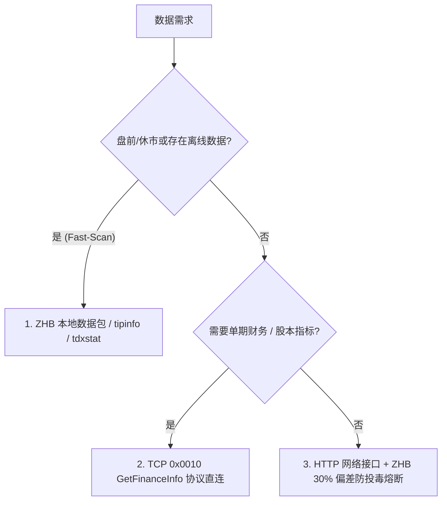
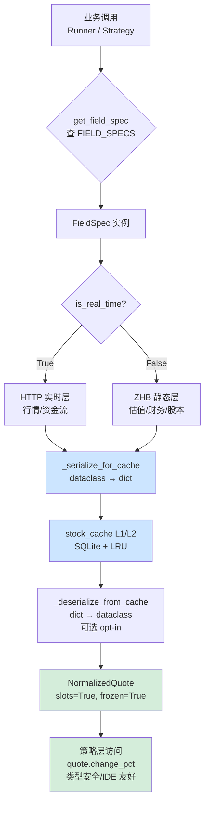

# A股数据架构全量接口与字段索引指南 (Master Reference)

> **创建日期**：2026-07-22  
> **最近核实**：2026-09-01 晚（终核）。本轮在 2026-08-31 fuyao 黄金锚复验 + 2026-09-01 命名一致性审计 + 2026-09-01 PE 二次重裁定基础上，**离线独立复验**（跑 `scratch/audit_pe_final.py` 用历史 `raw_push2_full.json`：f162_dyn 120/120、f163_lyr 120/120、f164_ttm 120/120、死证 `f162==现价÷f160` 0/120、`f163==现价÷(f55×2)` 0/120；并复核开盘啦 W8 \*ST湘邮 600476 全字段实测表确认 [37]=总市值/[60]=动/[61]=TTM/[62]=静）。**结论：主字典已知错误已全部清零，PE/财务/量价/市值/资金流四档/命名陷阱五类既定案项内部三方一致，零实质错误残留**。注：项目记忆 `MEMORY.md` 第11行旧记 `f163→pe_ttm` 与本节冲突（系 08-31 误订的滞后记忆），主字典以本节为准，记忆层须另行同步订正（见 2026-09-01 工作日志）。
> **V16.3 N 补充**：2026-08-06 新增"字段多源接口映射"节（§零）——同字段在不同数据源/接口的获取方式全集，提供更多选择与 fallback（AxData 256 接口核实）。
> **文档目的**：全面收录并归纳项目经过深度逆向工程、协议解包与线上验证得到的所有数据接口、字段映射、缓存机制及 Fallback 兜底防线，指导后续代码重构与策略开发，防止后续迭代失焦。
> **V17.0 破解纪律（2026-08-14 固化）**：
> **每次字段破解必须遵循 [字段破解方法论](field_verification/CRACKING_METHODOLOGY.md)**（前置采集 → **八大思路**（2026-08-30 校正：原文"六大思路"已滞后——方法论 2026-08-14 增第 7「配置文件直解」、第 8「多客户端本机文件交叉印证」，2026-08-27/29 又增对撞判定标准与多日复核门槛；**破解前必须重读方法论原文，勿以本节摘要为准**）→ 铁证分级 → 固化链条①字段表→②矩阵→③脚本→④script_data_dict→⑤回归）。破解结论须标注铁证等级（L1 官方/数值精确 / L2 统计特征 / L3 结构自洽 / L4 候选 / ❌已证伪）。
> **🗑️ 2026-08-30 归档**：`docs/field_dict_gemini.md`（本字典的归档分支副本：2026-08-25 前快照、缺 §12.20/§12.21、无任何代码引用）经用户确认**已删除**。**本文件是唯一权威字段字典**，新结论一律写此，勿再产生同名副本。
> **V17.0 本机数据源(2026-08-14 三客户端全量破解)**: 通达信/同花顺/东财安装目录数据文件可离线解析——
> 完整资产清单见 docs/field_verification/20260814/local_assets.md; 官方字段 ID 体系见 §零·C。

> **🔎 AI 破解字段导航（V17.0.16 强化）**：本文件是**决策层**（已定结论/优先级/订正，★唯一权威）。若某字段/源在本字典未收录或仅见结论，按尾部 **§12.15.9 附录索引**按源查对应 `verify/` 分字典（原始证据层，按源组织）：
> 东财指标代码→`em_indicators` / 东财表头→`em_tableheader_ids` / 通达信官方字段→`tdx_func_fields` / 通达信表头→`tdx_headers_definition` / 通达信行业→`tdxhy_x_names` / 腾讯→`tencent_verify` / push2→`push2_verify` / ulist↔push2 对齐→`ulist_push2_align` / 同花顺 SDK→`thsdk_field_verify` / 同花顺 tableheader→`ths_tableheader_ids` / 样本矩阵→`samples_verify` / AxData→`axdata_verify` / FTShare→`ftshare_fields_mirror` / fuyao→`fuyao_api_full` / 客户端枚举→`client_fields_enum` / 服务器→`network_servers`。**破解未知字段前先查主字典，再查对应分字典，勿重复造轮子。**

---

## 零、 字段多源接口映射（V16.3 N，7 个财务字段先行）

> **V16.3 O14 破解收尾状态（2026-08-06，13 轮）**：
> 本次会话累计**破解/确认 28 个字段**（腾讯 12 + push2 13 + 新浪 1 + 误标修正 3 + F10 接口修复 1 项），
> 其余未知位均有多股实测值 + 排除项记录（防重复尝试）。**未破解清单**：
> **2026-09-03 新一轮硬化对撞收口**（离线·无采集，套用对撞四铁律·详见 `field_verification/20260903/collision_validation_report.md`）：
> 腾讯 [56]/[85]/[86]（**确认源覆盖盲区**：15日×261锚精确0命中；[56]跨源最强相关0.81<0.9（L4）；**2026-09-03 主动法自算Beta Pearson=0.908 → 升 Beta族高置信**、[85]0.88价格族伪相关→L3、[86]0.45→❓手级带符号量）、push2 f106（**常量100占位码·已刻画·未破解**）、f107=f110=ulist:f27（**市场标记布尔0/1·北交=0·L1定案(17日×20股338 stock-days精确100%)**）、f111=f112=ulist:f19（**板级枚举{2,6,23,80,81}·L1定案(17日×20股338 stock-days精确100%)**）、f118=ulist:f107（**🔥L1新定案·推翻'无数据'误记·17日×20股338 stock-days精确100%·枚举{2,5}非恒定·2026-09-06 18日碰撞比值族L1-U再确认**）、ZHB tdxstat Col[22]（**确认动态概念/热点码·12日93717样本/1842 distinct/0精确/最强相关0.49·源覆盖盲区**，7.5节）。
> **已移出未破解（正文已破解，2026-09-02 存在性复核确认）**：[65]=tx65 扣非加权ROE(L1)、[66]=tx66 ROA(L1·单源无锚待复核)、[75]=近180交易日涨跌幅(L2+)；push2 f103=ocf_ttm、f108=扣非EPS(TTM)、**f109=归母净利润(年报)**（fuyao parent_holder_net_profit 20股逐字等✅）、f160=年报EPS、f190=每股未分配利润、f193-f197 财务衍生、f116/f117=总/流通市值(元)。下一步建议：f106(常量100占位·未破解) 与 [86](手级带符号量) 待更大样本定口径；**f107/f110/f111/f112/f118 已于 2026-09-04 多日对撞升格 L1（详见 §12.3.1.1）**。
> **Col[22] = `shape_value` 个股形态/板块代码（TDX 官方 TdxQuant 确认，5–6 位动态分类码，日更；完整码表枚举待补，属源覆盖盲区）**——性质已于 2026-09-12 经 31 日快照结构实证 + 跨日聚类升 L1（见 `docs/field_verification/20260912_zhb_col22_crack.md`）。
> **2026-09-15 全源对撞新增 L1 定案（3 项，四铁律·详见 `docs/field_verification/20260915/20260915_collision_report.md`）**：① `push2_full.f167` ↔ `tencent[46]`（L1，= 市净率 PB，与既存 push2 f167=ulist f23=腾讯[46] 等价类三方互证）；② `tencent[46]` ↔ `ulist239.f23`（L1，= 市净率 PB，独立四铁律跨源对撞再确认）；③ `zhb.full.zt_seal_amount_2d` ↔ `zhb.stat2.zt_seal_amount_2d`（L1，ZHB 双文件变体封单额口径跨源精确相等，互证稳健）。①②为既存 PB 等价类的四铁律独立再确认（非新语义）；③为 ZHB 封单额口径新增稳健性证据。

> **§零·B 字段×源总表**（本字典尾部，由 `field_registry.json` 经 `scripts/gen_field_dict.py` 自动生成，勿手改；字段契约表仍由人工维护）：全部字段 × 源的 fallback 路由矩阵，正文/registry 修改后重跑 `scripts/gen_field_dict.py` 同步。

> 原则：同一字段在不同接口可获取时，**按"易→难"选择**——
> **ZHB（离线零网络）→ TDX TCP（不封 IP，首选）→ 腾讯（不封 IP，首选）→ 新浪（低风险）→ 巨潮（低风险）→
> 同花顺（低风险，有 401 反爬史）→ AxData（local 模式未充分验证）→ 东财（最难：45000/h 封禁 20h + 观察期 + 共享风控，仅独有数据）**
> （V16.3 O18 修正——依据参考仓库 v3.2 数据源优先级 + 实测；此前"AXD 排腾讯前"为想当然排序）。
> 本表记录全部可用获取方式（含 AxData 256 接口核实 + 新浪实测），供 fallback 链扩展与字典溯源。
> 数据源缩写：ZHB=离线包 / TDX=通达信TCP / TX=腾讯 / SINA=新浪 / CNINFO=巨潮 / THS=同花顺 / AXD=AxData / EM=东财。

| 字段（中文）| 获取方式（按易→难）| 实测/核实状态 |
|---|---|---|
| **eps（每股收益）** | ① ZHB tipinfo Col[3]（报告期 EPS）② TDX F10 财务分析 main_indicators「基本每股收益」(元)（与 ZHB 交叉一致）③ SINA 财务报表（摊薄/加权每股收益）④ AXD 通达信财务摘要/财务诊断 ⑤ EM push2 f55（报告期，与 ZHB 同值）| ①②已接入；③实测返回 ✓ |
| **roe（净资产收益率）** | ① TDX F10 财务分析 profitability「加权净资产收益率」(%)（最新报告期）② SINA 财务报表（净资产收益率/加权）③ AXD 通达信财务基础摘要 `stock_finance_summary_tdx` / 财务诊断 `stock_financial_diagnosis_tdx` ④ 由净利/净资产自算（lng 现用路径）| ①已接入（V16.3 O，tdx:f10）；④现用（F10 profit/equity）；②实测返回 ✓ |
| **gross_margin（毛利率）** | ① TDX F10 财务分析 profitability「营业毛利率」(%)（最新报告期）② SINA 财务报表（销售毛利率）③ AXD 通达信财务摘要/财务诊断 ④ AXD 主营构成（分产品毛利率）| ①已接入（V16.3 O，tdx:f10）；②实测返回 ✓ |
| **net_profit_margin（净利率）** | ① 由净利/营收自算（canonical V16.3 O，`net_profit/revenue×100`，同源单位相消）② TDX F10 profitability「营业净利率」（营业利润口径，与 ① 差税费）③ SINA 财务报表（销售净利率）④ AXD 通达信财务摘要/财务诊断 | ①已接入（calc:net_profit/revenue）；②③④核实 ✓ |
| **net_profit（净利润）** | ① ZHB net_profit_kcf（本地，扣非口径近似）② TDX 0x0010 jinglirun（**单位角，/10 得元**，最新报告期，与 F10 同值）③ SINA 财务报表/利润表（净利润）④ AXD 通达信利润现金流摘要 `stock_profit_cashflow_summary_tdx` ⑤ AXD 盈利预测（预测口径）| ②已接入（V16.3 O，tdx:0x0010，000100 实测 15.56 亿=F10 一致）；①ZHB 已有 |
| **revenue（营业收入）** | ① TDX 0x0010 zhuyingshouru（**单位角，/10 得元**，最新报告期）② TDX F10 main_indicators「营业总收入」③ SINA 财务报表/利润表（主营业务收入）④ AXD 通达信利润现金流摘要 ⑤ AXD 盈利预测 ⑥ AXD 主营构成（分产品/地区）| ①已接入（V16.3 O，tdx:0x0010，000100 实测 434.5 亿）；②③核实 ✓ |
| **holder_count（股东户数）** | ① TDX 0x0010 gudong_renshu（最新报告期）② CNINFO 巨潮 `stock_hold_num_cninfo`（股东人数及持股集中度，12 字段——⚠️ 实测 403 源端风控）③ AXD 筹码分布（户均持股类）| ①已接入（V16.3 O，tdx:0x0010，000100 实测 614385）；②接口名直接对应 ⚠️403 |
| **dividend_yield（股息率）** | ① ZHB tdxstat Col[10] ② 腾讯 [64]（V16.3 O 破解=EM push2 f126 同源）③ AXD 分红指标 `stock_dividend_metrics_tdx` ④ EM push2 f126 | ①已接入 ✓；②=④同源 |
| **high_52w/low_52w（52周最高价/最低价）** | ① ZHB tdxstat2 Col[17]/[18] ② 腾讯 [67]/[68]（元）③ EM push2 f174/f175（fltt=2 浮点元）④ TDX K线计算 | ①已接入 ✓；②③实测一致 |
| **list_date（上市日期）** | ① TDX 0x0010 ipo_date ② CNINFO 上市相关 ③ AXD 发行上市资料 `stock_ipo_listing_profile_tdx` ④ EM push2 f189 | ①已接入 ✓ |
| **概念/题材** | ① ZHB tdxchain（本地）② TDX boards（TCP）③ AXD 个股题材 `stock_topic_exposure_tdx` ④ EM push2 f129 | ①②已接入 ✓ |

> **AxData 256 接口目录**（通达信 90/扩展 31/交易所 3/东财 13/巨潮 32/腾讯 6/新浪 60/财联社 12/开盘红 9）
> 完整清单见本字典附录或 https://electkismet.github.io/AxData/interfaces/ ——新增字段优先查该目录确认多源可选。
> 字段↔接口映射随破解进度持续扩充（下一批：ZHB 碰撞确认后补全 tdxstat 财务列）。

> **V16.3 N ZHB 碰撞结论（2026-08-06，4 天连续包 0731~0805 + 新浪财务实测）**：
> 7 个财务字段在 ZHB 的覆盖情况——**eps ✓（tipinfo Col[3]，口径=最新报告期）；
> 其余 6 个（roe/毛利率/净利率/net_profit 全量/revenue/holder_count）ZHB 无对应列**——
> tdxstat 35 列已全破解（统计快照性质，非财务报表），茅台/招行/TCL 未知列
> （unknown2/23/26/31/32/33）与新浪 ROE 值均不匹配。**结论：这 6 个字段需外部源
> （新浪财务报表/巨潮股东户数/通达信财务摘要），ZHB 无法提供——避免未来重复尝试**。
>
> **V16.3.10 补充（2026-08-11 通达信客户端原始文件 + 12 股 F10 交叉验证）**：
> tdxstat 35 列/tdxstat2 21 列经官方原始文件（hq_cache）逐列核验 + 12 股 F10 文本
> 交叉印证——**确认列**：tdxstat Col[3]pe_dynamic/[6]change_pct/[9]pe_ttm/[10]股息率/
> [15]员工/[18]20日/[21]ytd/[28]5日/[30]10日；tdxstat2 Col[3]成交额(万)/[5][7]昨日前日成交额/
> [13]特色板块/[14][15]主力净买T/T-1/[16]ipo_price/[17][18]52周/[19][20]30日K线；
> **新线索**：Col[11]=自由流通股本（万股，茅台 5.4 亿≈12.52×46% 大股东锁定——zhb 未解析，
> 待 TdxQuant 复核）；Col[22]=通达信内部码（码表运行时下载）；Col[24]=**货币资金（万元）cash_reserve_wan（V17.0.9 破解）**。
> 详细实证：docs/verify/client_fields_enum.md §3.5/3.6/4.6

> **V16.3 O TDX F10 接入（2026-08-06）**：
> ZHB 碰撞确认无财务深度字段后，canonical 已接入 TDX 通道——
> **F10 财务分析（`tdx_get_financial_analysis`，0x02CF/0x02D0 协议，mootdx 兼容 F10C/F10）** 供
> roe/毛利率/eps（@cached gross_margin_roe）+ **0x0010（`tdx_get_finance_info`）** 供
> net_profit/revenue/holder_count（@cached financial）——**均为 TCP 层不封 IP，比新浪更易**。
> 关键单位修正：**0x0010 金额字段（jinglirun/zhuyingshouru/zongzichan 等）单位是「角」，
> /10 得元**（000100 实测：jinglirun=15564526250 角 → 15.56 亿元，与 F10「15.5645亿」一致；
> zhuyingshouru=434542880000 角 → 434.5 亿元）。**每股类字段（meigujingzichan 等）单位已是元**。
> 旧缓存注意：get_gross_margin_and_roe 返回结构新增 eps 键（V16.3 O），
> 升级时需 `invalidate_category('gross_margin_roe')` 清旧缓存，否则 eps 缺失。

### 零·A TDX F10 财务分析字段结构（V16.3 O 实测 000100，2026-08-06）

> 来源：`tdx_get_financial_analysis(code)` → F10「财务分析」分类（0x02D0 文本）→ f10_parser 解析。
> 返回 10 个子栏目 dict；每个栏目为 `[{period, 字段名: 值}, ...]` 列表（period 降序，最新期在 [0]）。
> **数字均为字符串**（如 '15.5645亿'、'2.47'），取用前必须解析（见下"亿单位字符串"）。

| 子栏目 | 字段（实测 000100 最新期 2026-03-31）| 对应业务字段 |
|---|---|---|
| `main_indicators` 主要财务指标 | 净利润(元)/扣非净利润(元)/营业总收入(元)/净利润增长率(%)/营业总收入增长率(%)/加权净资产收益率(%)/资产负债比率(%)/净利润现金含量(%)/基本每股收益(元)/稀释每股收益(元)/每股收益-扣除(元)/每股资本公积金(元)/每股未分配利润(元)/每股净资产(元)/每股经营现金流量(元) | net_profit/roe/eps/bvps |
| `profitability` 盈利能力 | 营业利润率/营业净利率/营业毛利率/成本费用利润率/总资产报酬率/加权净资产收益率 | gross_margin/roe |
| `growth` 成长能力 | 营业收入增长率/总资产增长率/营业利润增长率/净利润增长率/净资产增长率 | 增长率 |
| `solvency` 偿债能力 | 流动比率/速动比率/资产负债比率 等 | 财务健康 |
| `operation` 营运能力 | 应收账款周转率/存货周转率 等 | 财务健康 |
| `indicator_changes` 指标变动 | period + items: [{subject, reason}]（指标异动原因）| 异动说明 |
| `balance_sheet` 资产负债表 | 货币资金/存货/应收账款 等 | 资产结构 |
| `income_statement` 利润表 | 营业收入/营业成本/营业费用/管理费用/财务费用/投资收益/营业利润/利润总额 | revenue/成本 |
| `cash_flow` 现金流量表 | 经营活动现金流 等 | 现金流 |
| `qoq_analysis` 环比分析 | 各指标环比 | 环比 |

> **数值解析**：'15.5645亿' 表示 15.5645×10^8 元；'434.7782亿' 同理；纯数字为百分比原值。
> **口径**：最新报告期（如 2026-03-31 为一季报），**非年度**——与新浪"年报 ROE 7.35%"不同期，取用时注明报告期
> **V16.4.0 实锤**：F10 接口（TDX F10/0x0010/同花顺 F10 文本/新浪）中的 T 日数据都是“最新报告期”——
> 报告期披露滞后 T-1/T-2 很正常（Q1 4 月底/半年报 8 月底/年报次年 4 月底）——不是错误，是最新报告期的自然滞后。
> F10 字段对 T 日精确度**要求不高**（财务按报告期披露，本无 T 日版本）；T 日精度只要求行情/估值类
> （PE = T 日价 ÷ 最新报告期 EPS——T 日×报告期混合，正确组合）。
> **V16.4.0 标注改进**：canonical `report_period` 已从 zhb report_date 填充（push2 f221 时有时无）；
> med 单值 ROE/财务质量展示已加报告期标注（如 ROE: 10.57%（2026Q1））——防误读为“当前 ROE”。。
> **eps 交叉验证**：F10「基本每股收益」0.0692 = ZHB tipinfo Col[3] 0.0692 ✓（两源同值）。
> **扣非交叉验证**：F10「扣非净利润」11.5485亿 = ZHB net_profit_kcf 115484.79 万 ✓（同口径）。
> **F10C 分类**：16 个分类（最新提示/公司概况/财务分析/股东研究/股本结构/…），0x02CF 协议返回
> `{name, filename, start, length}`——内容按 start/length 切片读取（V16.3 O 修复 _EasyTdxAdapter
> 缺失 F10C/F10 代理后可用——此前 tdx_get_financial_analysis 静默失败，med 一直走新浪 fallback）。

<!-- GEN:field-matrix -->

### 零·B 字段×源总表（自动生成，勿手改）

> 生成：`scripts/gen_field_matrix.py`（Phase 2 起从 field_registry.json 单一真相源读取，不再解析 field_dict.md 体积）。共 1297 个字段 / 1413 条字段×源记录（去重配对口径，取代旧版按行出现的 1412 重复计数）。

> 源排序按易→难（V17.0.7 层级定案；2026-09-07 thsdk 已退役，不再列为活体源）：ZHB（离线零网络）→ TDX TCP（0x0010/F10/eltdx）→ 腾讯（不封 IP）→ **同花顺-fuyao（官方 REST，盘后可查+独立风控域，V17.0.7 升为财务 TTM 族主源）** → 新浪 → 巨潮 → 东财（限流最严）→ 其他。

> 字段名基于章节标题分类推断，精确接口见各节；正文修改后重跑本脚本即同步。

**B.1 多源字段（101 个，fallback 路由表）**

| 字段 | 源数 | 源（按易→难） |
|:---|:---:|:---|
| amount | 4 | TDX-0x0010/F10、TDX-eltdx、AxData、东财 |
| date | 4 | TDX-0x0010/F10、TDX-eltdx、AxData、东财 |
| name | 4 | TDX-0x0010/F10、TDX-eltdx、AxData、东财 |
| rank | 4 | TDX-0x0010/F10、TDX-eltdx、财联社、东财 |
| 行情 | 3 | TDX-0x0010/F10、同花顺-fuyao、东财 |
| code | 3 | TDX-0x0010/F10、TDX-eltdx、东财 |
| time | 3 | TDX-0x0010/F10、TDX-eltdx、东财 |
| price | 3 | TDX-0x0010/F10、TDX-eltdx、东财 |
| open | 3 | TDX-eltdx、新浪、AxData |
| seal_amount | 3 | TDX-eltdx、开盘红、AxData |
| change_pct | 3 | TDX-0x0010/F10、TDX-eltdx、AxData |
| 股东户数 | 2 | TDX-0x0010/F10、akshare |
| ipo_date | 2 | TDX-0x0010/F10、TDX-eltdx |
| updated_date | 2 | TDX-0x0010/F10、TDX-eltdx |
| 返回 | 2 | 腾讯、新浪 |
| 价值 | 2 | 腾讯、新浪 |
| 资金 | 2 | TDX-0x0010/F10、东财 |
| reason | 2 | 开盘红、东财 |
| close | 2 | TDX-eltdx、东财 |
| market | 2 | TDX-0x0010/F10、东财 |
| turnover_rate | 2 | 开盘红、东财 |
| is_new | 2 | 财联社、东财 |
| ocf_ttm(f103) | 2 | 同花顺-fuyao、东财 |
| revenue_ttm(f104) | 2 | 同花顺-fuyao、东财 |
| net_profit_period(f105) | 2 | 同花顺-fuyao、东财 |
| net_profit_annual(f109) | 2 | 同花顺-fuyao、东财 |
| eps_annual(f160) | 2 | 同花顺-fuyao、东财 |
| 行业 | 2 | TDX-0x0010/F10、东财 |
| 现价 | 2 | 同花顺-fuyao、东财 |
| 开盘价 | 2 | 同花顺-fuyao、东财 |
| 最高价 | 2 | 同花顺-fuyao、东财 |
| 最低价 | 2 | 同花顺-fuyao、东财 |
| 涨跌幅 | 2 | TDX-0x0010/F10、东财 |
| 涨跌额 | 2 | 同花顺-fuyao、东财 |
| 成交量 | 2 | 同花顺-fuyao、东财 |
| 成交额 | 2 | 同花顺-fuyao、东财 |
| 流通市值 | 2 | 同花顺-fuyao、东财 |
| 市净率 | 2 | 同花顺-fuyao、东财 |
| 市销率 | 2 | 同花顺-fuyao、东财 |
| 市现率 | 2 | 同花顺-fuyao、东财 |
| 封单额 | 2 | 同花顺-fuyao、东财 |
| 连板天数 | 2 | 同花顺-fuyao、东财 |
| 涨停池 | 2 | TDX-0x0010/F10、同花顺-fuyao |
| 市盈率(TTM) | 2 | 同花顺-fuyao、东财 |
| turnover | 2 | 新浪、开盘红 |
| RQJMG | 2 | akshare、东财 |
| change_type | 2 | TDX-0x0010/F10、东财 |
| limit_count | 2 | TDX-0x0010/F10、开盘红 |
| limit_time | 2 | TDX-0x0010/F10、开盘红 |
| plate_code | 2 | TDX-0x0010/F10、财联社 |
| plate_name | 2 | TDX-0x0010/F10、财联社 |
| trade_date | 2 | 财联社、AxData |
| plates | 2 | TDX-0x0010/F10、财联社 |
| 资金流 | 2 | TDX-0x0010/F10、akshare |
| exchange | 2 | TDX-eltdx、AxData |
| stats_date | 2 | TDX-eltdx、AxData |
| open_price | 2 | TDX-eltdx、AxData |
| pre_close | 2 | TDX-eltdx、AxData |
| open_change_pct | 2 | TDX-eltdx、AxData |
| open_amount | 2 | TDX-eltdx、AxData |
| open_volume_hand | 2 | TDX-eltdx、AxData |
| open_volume_ratio | 2 | TDX-eltdx、AxData |
| open_turnover_z | 2 | TDX-eltdx、AxData |
| open_prev_amount_ratio | 2 | TDX-eltdx、AxData |
| auction_prev_volume_ratio | 2 | TDX-eltdx、AxData |
| opening_rush | 2 | TDX-eltdx、AxData |
| open_prev_seal_ratio | 2 | TDX-eltdx、AxData |
| prev_amount | 2 | TDX-eltdx、AxData |
| prev_seal_amount | 2 | TDX-eltdx、AxData |
| prev2_seal_amount | 2 | TDX-eltdx、AxData |
| prev_open_volume_hand | 2 | TDX-eltdx、AxData |
| prev_open_amount | 2 | TDX-eltdx、AxData |
| float_shares | 2 | TDX-eltdx、AxData |
| float_market_value | 2 | TDX-eltdx、AxData |
| free_float_shares | 2 | TDX-eltdx、AxData |
| free_float_market_value | 2 | TDX-eltdx、AxData |
| seal_to_amount_ratio | 2 | TDX-eltdx、AxData |
| seal_to_float_ratio | 2 | TDX-eltdx、AxData |
| seal_prev_ratio | 2 | TDX-eltdx、AxData |
| limit_stat_days | 2 | TDX-eltdx、AxData |
| limit_up_count_in_stat_days | 2 | TDX-eltdx、AxData |
| limit_board_text | 2 | TDX-eltdx、AxData |
| limit_up_streak_days | 2 | TDX-eltdx、AxData |
| year_limit_up_days | 2 | TDX-eltdx、AxData |
| last_price | 2 | TDX-eltdx、AxData |
| high | 2 | TDX-eltdx、AxData |
| low | 2 | TDX-eltdx、AxData |
| change | 2 | TDX-eltdx、AxData |
| volume | 2 | TDX-eltdx、AxData |
| locked_amount | 2 | TDX-eltdx、AxData |
| rise_speed | 2 | TDX-eltdx、AxData |
| short_turnover | 2 | TDX-eltdx、AxData |
| min2_amount | 2 | TDX-eltdx、AxData |
| vol_rise_speed | 2 | TDX-eltdx、AxData |
| limit_up_price | 2 | TDX-eltdx、AxData |
| limit_down_price | 2 | TDX-eltdx、AxData |
| limit_status | 2 | TDX-eltdx、AxData |
| 全市场快照 | 2 | TDX-0x0010/F10、同花顺-fuyao |
| 板块强度 | 2 | TDX-0x0010/F10、同花顺-fuyao |
| 市场情绪 | 2 | TDX-0x0010/F10、同花顺-fuyao |
| 板块轮动 | 2 | TDX-0x0010/F10、同花顺-fuyao |

**B.2 单源字段（1196 个，无 fallback）**

- **ZHB（13）**：A 实时、B 准实时、C 日频、D 静态、PE TTM、前一日、前一日开盘量额、前两日成交额、封单额、年内涨停数、当日、日 Beta、自由流通股本、连板统计
- **TDX-0x0010/F10（297）**：*ST湘邮、AI解读、AxData、BKFenShiZhiBo、ChangeStatistics、C中芯、DR 茅台、DailyLimitPerformance、DailyLimitPerformance2、FTShare、GetBaseFaceListZDEvnArtNew、GetDayBaseFaceListZDEvnArt、GetDayNewHigh_W28、GetGPCPHBTS_Tag、GetHotPHB、GetInfo、GetKLineDay_W14、GetKLineZhangTing、GetMainMonitor_w30、GetPanKou、GetPlateInfo_w38、GetPlate_Info_QJ、GetStockBid、GetStockList、GetStockList（龙虎榜）、GetStockPanKou、GetStockTrendIncremental、GetWeiTuo_W14、GetYTFP_BKHX、GetYTFP_SCTD、GlobalCommon、GroupCount_w28、Index、InfoBKR、MarketStockZDNum、MoodNumCount、MorningBiddingList、NewGetList、N百花医药、Radar、RealRankingInfo、RiseFallAnalysis、ST百花医药、SharpWithdrawal、SonPlate_Info、Theme、XD、XR、ZhiShuStockList_W8、[..、[verify、akshare、all、api、axdata_verify.md)、axdata_verify.md](verify、balance_sheet` 资产负债表、belong、cash_flow` 现金流量表、changqifuzhai
  - … 其余 237 个见正文
- **TDX-eltdx（131）**：AuctionPoint.index、AuctionPoint.matched_volume、AuctionPoint.minute_of_day_raw、AuctionPoint.price、AuctionPoint.price_milli、AuctionPoint.record_hex、AuctionPoint.reserved_zero_0e、AuctionPoint.second_raw、AuctionPoint.time_label、AuctionPoint.time_seconds、AuctionPoint.unmatched_direction_raw、AuctionPoint.unmatched_volume、Enum `Market、FinanceInfo`（财务）、FundFlow、HistoricalFundFlow、KlineCategory、MarketStat、SecurityBar`（K 线）、SecurityInfo`（证券列表）、SecurityQuote`（五档）、XdxrRecord`（除权除息）、absolute_index、adjust、adjust_mode、adjust_mode_raw、alignment_status、auction_matched_volume、auction_unmatched_signed_volume、auctions.series（0x056a）、beta_60d、business_composition、buy_levels、c1_value~c4_value、category_name、circulating_shares、current_hand、dividend_financing、down_count、eltdx_auction_prev_volume_ratio、eltdx_has_shortline、eltdx_ladder_level、eltdx_limit_board_text、eltdx_limit_up_streak_days、eltdx_open_change_pct、eltdx_open_prev_amount_ratio、eltdx_open_turnover_z、eltdx_open_volume_ratio、eltdx_opening_rush、eltdx_seal_amount、eltdx_seal_to_float_ratio、eps_raw、event_kind、fenhong、finance_diagnosis、full_code、get_auction_0925、high_price、highest_ladder_level、history
  - … 其余 71 个见正文
- **腾讯（12）**：[0] 市场标识、[29][54][55][77][78] 占位符、[40] 停牌标记、[56] Beta 族、[76] A股流通股本、[85] 价格类字段、[86] 手级带符号量、[87] 科创板、两融标记、分钟 K线、实测、月 K线
- **同花顺-fuyao（132）**：K线、PB、ROA、`big_order_flow(ths_code)`、a-share、a-share-index、accounts_receivable、adjustment-factors、anomaly-analysis-list、anomaly-analysis-stock、auction、auction.float_market_cap、balance-sheets、calendar、cash-flow、cash-flow-statements、cash_equivalents_net_addition、catalog、constituents、corporate-actions、download-url、dragon-tiger-list、dump、eps_deduct_ttm(f108)、fflow 历史资金流窗口、financials、get 财务 TTM 族、growth、growth.calculate_operating_income_yoy_growth_ratio、growth.calculate_parent_holder_net_profit_yoy_growth_ratio、historical、holder_equity_total、hot-stock-list、hot-stock-list-history、hot-stock-rank-trend、income-statements、income_tax_expense、indicators、interest_expenses、klines(count=N)、limit-break-pool` 🆕、limit-down-pool` 🆕、limit-up-ladder、limit-up-pool、list、manage_fee、market-dumps、meta、net_profit、net_profit_annual、net_profit_period、ocf_ttm、operating_profit、operation、pay_dividends_profits_interest_cash、pb、pcf、prices、profit_total、profitability
  - … 其余 72 个见正文
- **新浪（25）**：URL、ask、ask_vol、bid、bid_vol、delta、gamma、item_tongbi、item_value、iv、last、limit_down、limit_up、netamount、open_interest、opendate、prev_close、report_list.{期次}.data[].item_title、report_type、strike、theory、theta、trade、vega、参数
- **财联社（14）**：catalyst、cur_heat、limit_up_board、market_degree、performance、profit_ratio、rank_change、shsz_balance、shsz_balance_change_px、up_down_dis、up_open_num、up_open_ratio、up_ratio、up_ratio_num
- **开盘红（36）**：Detail、StockList、TagID、TagName、TagShuXing、ZSCode、ZSName、avg_change、buy_amount、dt、fall_dist、fall_num、flat、industry_id、industry_zt、limit_tag、market_cap、net_inflow、net_inflow_5d、open_time、q_zrcs、qscln、rise_dist、rise_num、s_zrcs、seal_money、sell_amount、sign、sjdt、sjzt、stdt、stock_count、stzt、szln、themes、zt
- **akshare（13）**：BPS、EPS、PE 历史百分位、push2 f137、push2 f51、push2 f55、两融 RZJME、历史分红、扣非净利、板块资金流 f62、涨跌停价、股息率、龙虎榜 EXPLAIN
- **AxData（66）**：activity、amplitude_pct、ask1_price、ask1_volume、attack_pct、average_change_pct、average_price、bid1_ask1_balance_pct、bid1_ask1_volume_diff、bid1_price、bid1_volume、capital_score、concept_capital_flow_tdx（题材资金走势）、cost70_concentration、cost70_range、cost90_concentration、cost90_range、current_volume、drawdown_pct、entrust_ratio、finance_updated_date、float_share、free_float_share_z、fundamental_score、high_change_pct、industry_name、industry_rank、industry_rank_total、inside_outside_ratio、inside_volume、instrument_id、limit_ratio_pct、limit_rule、low_change_pct、market_rank、market_rank_total、market_win_pct、name_flag、news_score、open_amount_ratio_pct、option_chain_tdx（期权T型）、outside_volume、pre_close_source、pre_close_trade_date、profit_ratio_pct、score、share_source、stock_allotment_cninfo（配股）、stock_financial_diagnosis_tdx（财务诊断）、stock_forecast_consensus_tdx（盈利预测）、stock_name、stock_realtime_rank_tdx（实时榜单）、stock_share_change_cninfo（股本变动）、stock_theme_strength_rank_tdx（题材强度排行）、symbol、tdx_code、theme_score、total_share、事件流、华证
  - … 其余 6 个见正文
- **东财（457）**：A+H 双上市标识、ABLE_FREE_SHARES、ACCUM_AMOUNT、ASSIGN_PROGRESS、AVG_FREE_SHARES、BILLBOARD_BUY_AMT、BILLBOARD_NET_AMT、BONUS_RATIO、BUY、BUYER_NAME、BUY_RATIO、BUY_SEAT、CHANGE_RATE、CHANGE_TYPE、CLOSE_PRICE、CPFZ、D1~D30_CLOSE_ADJCHRATE、DATE、DCP、DEAL_AMOUNT_RATIO、DEAL_AMT、DEAL_NET_RATIO、DEAL_PRICE、DEAL_VOLUME、END_DATE、EXPLAIN、EXPLANATION、EX_DIVIDEND_DATE、FIN_BALANCE_GR、FREE_DATE、FREE_MARKET_CAP、FREE_RATIO、FREE_SHARES、FREE_SHARES_TYPE、HOLDER_NUM、HOLDER_NUM_CHANGE、HOLDER_NUM_RATIO、JLY、JZC、LDFZ、LINK_URL、LYZE、MARKET、NET、NET_BS_AMT、NextTwoYear、NextYear、OPERATEDEPT_CODE、OPERATEDEPT_NAME、PRETAX_BONUS_RMB、RCHANGE3D、RPTA_WEB_RZRQ_GGMX（两融）、RPT_DAILYBILLBOARD_DETAILSNEW（龙虎榜）、RPT_HOLDERNUMLATEST（股东户数）、RPT_LIFT_STAGE（解禁）、RPT_SHAREBONUS_DET（分红）、RQCHL、RQMCL、RQYE、RQYL
  - … 其余 397 个见正文

<!-- /GEN:field-matrix -->

---

### 零·C 三客户端官方字段 ID 体系(2026-08-14 从本机配置全量提取)

> **东财** (config\\DefaultCustomListHeader.json + HighStockPickingIndexConfig.xml):
> 表头 ID: A1-20=行情(A1最高/A2涨幅/A4涨跌/A5涨速/A6总量/A7现量/A8金额/A9量比/A10开盘/A17振幅/A18换手/A20昨收)、
> B1-21=盘口股本(B1均价/B8外盘/B9内盘/B13委差/B14委比/B15总股本/B16总市值/B18流通股本/B19自由流通股/B20流通市值)、
> C3=连涨天数、**D1-9=竞价族(D1竞价涨幅/D2竞价换手/D3竞价实际换手/D4竞价量/D5竞价金额/D6未匹配量/D7未匹配金额/D8竞价量比/D9竞昨成交量)**、
> E1-18=区间涨幅(3日/6日/月/年)、F1-30=财务(F1市盈/F4 PE-TTM/F5市净/F13加权ROE/F16营收增长/F18归母净利增长/F20扣非增长/F30毛利率)、
> **G1-12=主力资金(G1主力净流入/G2量涨速/G3主力净量/G4-7 3/5/10/20日主力净流入/G8 DDX/G9 DDY/G10 DDZ/G11 DDF/G12 DDX连红天数)**、I3=所属行业
> 全表: docs/verify/em_tableheader_ids.md; 指标代码 939 个(100000000xxx): docs/verify/em_indicators.md
>
> **同花顺** (system\\同花顺方案\\tableheader\\*.ini + iwcDataTable.ini + FyTableHeaderIdToConfigMapping.ini):
> 列 ID 682 个(8197=代码/20490=现价/526792=振幅/3426=连续涨停天数/3419=昨日涨停时间/3420=昨日涨停原因/
> 133970=封单量/133971=封单额/330327-328=最高封单量额/330323=首次涨停时间_new/330325=涨停类型/
> 68762=集合竞价撮合涨幅/330347=竞价换手/920371=开盘涨幅/920372=实体涨幅/331068=FREE净流入/20549-50=涨停跌停价/
> 134222=涨停开板次数/12339=分价量比); 指标 81 个(807731200=几天几板/807862272=主力金额 main_net_inflow/
> 806223872=市盈pe_lyr/806289408=市盈(动)pe_mrq/806354944=市净率pb_mrq/805371904-76=60/120/250日涨幅/807796736=自由流通市值);
> IWC 数据 56 项(65536=昨日陆股通净买入量/13631488=连续涨停天数/14680064=今日涨停原因/15728640=涨停封单量/
> 16777216=涨停封单金额/17825792=近一周涨停次数/18874368=近一月涨停次数/19922944=近一年涨停次数/26214400=上市天数)
> 列 ID 摘录汇编(部分存档, 原始 682 全表未入库): docs/verify/ths_tableheader_ids.md
>
> **通达信** (T0002\\bigdata_1.zip cloud_cfg\\func_*.cfg 641 个功能配置):
> **官方字段 1,924 个(code→中文名)**: 全表 docs/verify/tdx_func_fields.md;
> 样例: 股东人数(date1起始/date截止/date3变动周期)、财务(BGQ报告期/SZ市值/PE)、
> 沪深港通(drzjlr流入/drye余额/cje1净买入=calc mrcje-mccje 买入-卖出→佐证 f135/f136/f137/f138/f139/f140/f141/f142/f143/f144/f145/f146 买卖差结构)
>
> **交叉印证(三方闭环)**: 东财 D1-9 竞价族 ↔ ZHB [9]/[10]/[14]/[15] 竞价量/额 ↔ 同花顺竞价换手/集合竞价涨幅 ✓
> **V17.0 官方 ID 核实项目源字段（2026-08-14）**: ①tdxstat [31]=**近期异动周期计数**(⚠️ 非严格连板; 原假设=连板天数 func lbts=LastStartZT, 8/13 全市场 4 组 100% 实锤; **2026-08-25 同日对撞东财池仅77%匹配(15/50 ZHB>pool), 降级**),
> [32]=涨停计数(LastZTHzNum/ztcs1)、[33]=**连板数(✅ V17.0.9b 天梯 20/20 匹配; 原 ztlx 涨停类型族假设证伪)**; ②push2 f55/f92/f173/f186/f188 均对上官方指标名; ③同花顺 133971 封单额↔tdxstat2[4] ✓
> 东财 G1/G5/G6/G7 主力 3/5/10/20日 ↔ **f137**(主力净, V17.0.16 订正: 旧写 f137+f140 重复计数)/5日 f178 聚合 ↔ 同花顺 FREE净流入 ✓

## 一、 数据获取优先级与架构总纲 (Core Paradigms)

系统整体遵循以下三级金字塔获取原则：


```mermaid
flowchart TD
    A[数据需求] --> B{盘前/休市或存在离线数据?}
    B -- 是 (Fast-Scan) --> C[1. ZHB 本地数据包 / tipinfo / tdxstat]
    B -- 否 --> D{需要单期财务 / 股本指标?}
    D -- 是 --> E[2. TCP 0x0010 GetFinanceInfo 协议直连]
    D -- 否 --> F[3. HTTP 网络接口 + ZHB 30% 偏差防投毒熔断]
```

### 1. 三大设计防线 (Design Guardrails)
1. **ZHB 财报事件锁 (Event-Driven Lock)**：对于季度更新的 12 季度历史财报（如新浪接口），禁止使用固定 90 天或 24 小时 TTL。将 ZHB 的 `report_date` 动态拼入 SQLite 缓存 Key（如 `fin:600519:12:report_date=20240331`），实现**永久缓存 + 报告期变更瞬间刷新**。
2. **ZHB 地面真理防投毒 (Anti-Poisoning Fuse)**：ZHB T-1 数据作为绝对真理（Ground Truth）。当 HTTP 接口返回 PE/PB/股息率时，计算 `abs(HTTP - ZHB) / ZHB`。若偏差超出 **30%**，判定 HTTP 数据已被垃圾数据污染，直接强行弃用 HTTP 并由 ZHB 数据兜底。
3. **休市/盘前 Fast-Scan**：在 9:15 前、15:00 后或休市日运行扫描脚本时，自动拦截 HTTP 请求，100% 走 ZHB 本地内存检索，秒级完成全市场扫描。

---

## 二、 TCP `GetFinanceInfo` (0x0010) 二进制全量字段映射

通过 `tdx_client.py` 中的 `tdx_get_finance_info(code)` 提取，直连券商服务器，耗时 5~15ms，完全无 IP 封禁风险。

**协议来源**：通过 `tdxpy/parser/std/get_finance_info.py`（Python 环境 site-packages 内，非本仓库代码）反向工程获得权威字段定义，共 **36 个字段**（含 2 个标识字段 market/code + 34 个数据字段）。mootdx 0.11.7 + tdxpy 0.1.22 协同解析。

### 2.1 协议完整 36 字段表（权威定义）

> **单位说明（V16.3 O19 修正——实测口径，旧表"×10000 万元"全错）**：
> - **金额类字段**（zongzichan/jingzichan/jinglirun/zhuyingshouru/jingyingxianjinliu/负债/存货 等）：单位=**角**，`/10` 得元
>   （000100 实测：jinglirun=15564526250 角 → 15.56 亿元=F10 一致；zhuyingshouru=434542880000 角 → 434.5 亿）
> - **股本类字段**（zongguben/liutongguben 等）：单位=**股**（V16.2.3 easy_tdx 口径已确认）
> - **每股类**（meigujingzichan/gudongrenshu）：原值（元/户）

| 协议偏移 | 字段名 (`key`) | 中文含义 | 类型 | 协议单位 | 还原后单位 | 字段分组 | 项目代码使用 |
|:---:|:---|:---|:---:|:---|:---|:---|:---:|
| 0 | `market` | 市场代码 (0=深/1=沪) | `byte` | 0/1/2 | 0=深/1=沪/2=京 | 标识 | ❌ |
| 1 | `code` | 股票代码 | `str` | 6位字符串 | 6位字符串 | 标识 | ❌ |
| 2 | **`liutongguben`** | **流通股本** | `float` | `×1(股)` | **股** | 股本 | ✅ |
| 3 | `province` | 省份编码 | `ushort` | 编码值 | 编码值（需查表） | 基础 | ❌ |
| 4 | **`industry`** | **通达信行业编码** | `ushort` | 编码值 | 编码值（需查表） | 基础 | ✅ |
| 5 | **`updated_date`** | **财报更新日期** | `uint` | YYYYMMDD | YYYYMMDD | 基础 | ✅ |
| 6 | **`ipo_date`** | **上市日期** | `uint` | YYYYMMDD | YYYYMMDD | 基础 | ✅ |
| 7 | **`zongguben`** | **总股本** | `float` | `×1(股)` | **股** | 股本 | ❌ |
| 8 | `guojiagu` | 国家股 | `float` | `×1(股)` | 股 | 股本（结构性） | ❌ |
| 9 | `faqirenfarengu` | 发起人法人股 | `float` | `×1(股)` | 股 | 股本（结构性） | ❌ |
| 10 | `farengu` | 法人股 | `float` | `×1(股)` | 股 | 股本（结构性） | ❌ |
| 11 | `bgu` | B股 | `float` | `×1(股)` | 股 | 股本（结构性） | ❌ |
| 12 | `hgu` | H股 | `float` | `×1(股)` | 股 | 股本（结构性） | ❌ |
| 13 | `zhigonggu` | 职工股 | `float` | `×1(股)` | 股 | 股本（结构性） | ❌ |
| 14 | **`zongzichan`** | **总资产** | `float` | `角(/10得元)` | **角（→元需角(/10得元)）** | 资产 | ✅ |
| 15 | `liudongzichan` | 流动资产 | `float` | `角(/10得元)` | 角 | 资产 | ❌ |
| 16 | `gudingzichan` | 固定资产 | `float` | `角(/10得元)` | 角 | 资产 | ❌ |
| 17 | `wuxingzichan` | 无形资产 | `float` | `角(/10得元)` | 角 | 资产 | ❌ |
| 18 | **`gudongrenshu`** | **股东户数** | `float` | **原始值** | **户** | 股东 | ✅ |
| 19 | `liudongfuzhai` | 流动负债 | `float` | `角(/10得元)` | 角 | 负债 | ❌ |
| 20 | `changqifuzhai` | 长期负债 | `float` | `角(/10得元)` | 角 | 负债 | ❌ |
| 21 | `zibengongjijin` | 资本公积金 | `float` | `角(/10得元)` | 角 | 权益 | ❌ |
| 22 | **`jingzichan`** | **净资产 / 股东权益** | `float` | `角(/10得元)` | **角** | 权益 | ✅ |
| 23 | `zhuyingshouru` | 主营业务收入 | `float` | `角(/10得元)` | 角 | 业绩 | ❌ |
| 24 | `zhuyinglirun` | 主营业务利润 | `float` | `角(/10得元)` | 角 | 业绩 | ❌ |
| 25 | `yingshouzhangkuan` | 应收账款 | `float` | `角(/10得元)` | 角 | 业绩 | ❌ |
| 26 | `yingyelirun` | 营业利润 | `float` | `角(/10得元)` | 角 | 业绩 | ❌ |
| 27 | `touzishouyu` | 投资收益 | `float` | `角(/10得元)` | 角 | 业绩 | ❌ |
| 28 | `jingyingxianjinliu` | 经营活动现金流 | `float` | `角(/10得元)` | 角 | 现金流 | ❌ |
| 29 | `zongxianjinliu` | 总现金流 | `float` | `角(/10得元)` | 角 | 现金流 | ❌ |
| 30 | `cunhuo` | 存货 | `float` | `角(/10得元)` | 角 | 资产负债 | ❌ |
| 31 | `lirunzonghe` | 利润总和 | `float` | `角(/10得元)` | 角 | 业绩 | ❌ |
| 32 | `shuihoulirun` | 税后利润 | `float` | `角(/10得元)` | 角 | 业绩 | ✅ L1（20260917 对撞 tdx.finance_info.shuihouli run≡shuihoulirun 60对/3日 100%命中；run 为尾随空格别名, 实证该字段真实存在, 推翻旧 ❌ 标注）|
| 33 | **`jinglirun`** | **净利润** | `float` | `角(/10得元)` | **角** | 业绩 | ✅ |
| 34 | `weifenpeilirun` | 未分配利润 | `float` | `角(/10得元)` | 角 | 权益 | ❌ |
| 35 | `meigujingzichan` | 每股净资产 (BPS) | `float` | **原始值** | **元/股** | 每股指标 | ❌ |
| 36 | `baoliu2` | 保留字段2 | `float` | - | - | 保留 | ❌ |

### 2.2.1 TDX tdx_quotes 神谕印证（2026-09-09 实时 · 桶 A1）

> 数据来源：通达信 `tdx_quotes`（600519 实测 20260909 14:08，HQDate=20260909）。方法：沿用 path A+B「通达信官方命名语义终止器」——TDX 命名字段即官方 L1 锚。
> TDX CwInfo 单位为**万元**，ExtInfo 股本单位为**万股**；tdxstat 同名字段单位为角/元或股，印证须单位换算（万×1e4=元/股），但官方命名语义一致即 L1 终止。

**映射结论（28/37 列直接印证 → L1）**：col0=BaseInfo.Setcode, col1=BaseInfo.Code, col2=ExtInfo.LTGB, col4=ExtInfo.BelongHY, col5=CwInfo.GXRQ, col6=CwInfo.Start, col7=ExtInfo.ZGB, **col14=CwInfo.ZZC(总资产), col15=CwInfo.LDZC(流动), col16=CwInfo.GDZC(固定), col17=CwInfo.WXZC(无形), col18=CwInfo.GDRS(股东户数), col19=CwInfo.LDFZ(流动负), col20=CwInfo.CPFZ(长期负), col21=CwInfo.ZBGJJ(资本公积), col22=CwInfo.JZC(净资产), col23=CwInfo.YYSR(营业收入≈主营), col25=CwInfo.YSZK(应收), col26=CwInfo.YYLR(营业利润), col27=CwInfo.TZSY(投资收益), col28=CwInfo.JYXJL(经营现金流), col29=CwInfo.ZXJL(总现金流), col30=CwInfo.CH(存货), col31=CwInfo.LYZE(利润总和), col32=CwInfo.SHLY(税后利润), col33=CwInfo.JLY(净利润), col34=CwInfo.WFPLY(未分配利润), col35=ExtInfo.MGJZC(每股净资产)**。
**⚠️ 候选**：col3=ExtInfo.Addr(省份 候选), col24=CwInfo.YYLR(营业利润≈主营业务利润 近似)。
**❌ legacy（桶 B，TDX 无命名）**：col8–13（国家股/法人股/B股/H股/职工股，现代公司已归零）、col36（保留）。
**完整映射表见** `docs/field_verification/20260909_bucketA_TDX_oracle_sweep.md` §3。

### 2.2 字段组分类与策略价值

| 字段组 | 包含字段 | 协议覆盖率 | 策略价值 |
|:---|:---|:---:|:---|
| **股本结构** | `liutongguben/zongguben/guojiagu/faqirenfarengu/farengu/bgu/hgu/zhigonggu` (8 个) | 100% | ⭐⭐⭐⭐⭐ **市值计算根基**（`zongguben × price`） |
| **股东户数** | `gudongrenshu` (1 个) | 100% | ⭐⭐⭐⭐⭐ **筹码集中度（户均持股=`liutongguben / gudongrenshu`）** |
| **资产/负债** | `zongzichan/liudongzichan/gudingzichan/wuxingzichan/liudongfuzhai/changqifuzhai` (6 个) | 100% | ⭐⭐⭐⭐ **资产负债率=`(liudongfuzhai + changqifuzhai) / zongzichan`** |
| **权益** | `zibengongjijin/jingzichan/weifenpeilirun` (3 个) | 100% | ⭐⭐⭐⭐⭐ **PB=`price / (jingzichan / zongguben)`** |
| **经营业绩** | `zhuyingshouru/zhuyinglirun/yingshouzhangkuan/yingyelirun/touzishouyu/lirunzonghe/shuihoulirun/jinglirun` (8 个) | 100% | ⭐⭐⭐⭐⭐ **ROE=`jinglirun / jingzichan`、净利率=`jinglirun/zhuyingshouru`** |
| **现金流** | `jingyingxianjinliu/zongxianjinliu` (2 个) | 100% | ⭐⭐⭐⭐ **现金流质量** |
| **基础信息** | `updated_date/ipo_date/province/industry` (4 个) | 100% | ⭐⭐⭐⭐⭐ **财报事件锁、次新股筛选** |
| **存货** | `cunhuo` (1 个) | 100% | ⭐⭐⭐ **存货周转与积压排雷** |
| **每股指标** | `meigujingzichan` (1 个) | 100% | ⭐⭐⭐⭐⭐ **BPS、PB 计算直接字段** |
| **保留** | `baoliu2` (1 个) | - | 暂无业务用途 |

### 2.3 项目实际使用情况（与原文档对比）

> **核实日期**：2026-07-28，基于项目源码扫描（项目根目录）全量 `.py` 文件（除 `venv` / `.git`）。

#### ✅ 项目代码正确使用（8 个字段）

| 字段 | 项目使用位置 |
|:---|:---|
| `liutongguben` | [tdx_client.py:804](../tdx_client.py#L804)、[stock_common/sc_datasource.py:225](../stock_common/sc_datasource.py#L225) 等 |
| `industry` | [get_lng_report.py:200](../get_lng_report.py#L200)、[get_sht_report.py:336](../get_sht_report.py#L336) 等 10+ 处 |
| `updated_date` | [stock_common/sc_datasource.py:229](../stock_common/sc_datasource.py#L229)、[sc_capital_cache.py:121](../stock_common/sc_capital_cache.py#L121) 等 |
| `ipo_date` | [stock_common/sc_datasource.py:846](../stock_common/sc_datasource.py#L846) |
| `zongzichan` | 多个 get_*_report.py 文件计算资产负债率 |
| `gudongrenshu` | **通过其他路径间接使用**（实际 key 错，见下方 Bug） |
| `jingzichan` | [tdx_client.py:805](../tdx_client.py#L805)、多个 get_*_report.py |
| `jinglirun` | [tdx_client.py:804](../tdx_client.py#L804)、多个 get_*_report.py |

#### ❌ 项目代码使用但 key 错误（10 个 Bug）

| ❌ 错误 key | ✅ 应改为 | 问题位置 | 影响 |
|:---|:---|:---|:---|
| `gudong_renshu` | `gudongrenshu` | [sc_datasource.py:228](../stock_common/sc_datasource.py#L228) `_holder_fetch_tdx_optimized` | **股东户数永远拿不到**（拼写错误，多了下划线） |
| `total_capital` | `zongguben` | [sc_capital_cache.py:125](../stock_common/sc_capital_cache.py#L125) `_fetch_share_capital` | **TDX 总股本永远拿不到**（错用股本 cache 的 key） |
| `float_capital` | `liutongguben` | [sc_capital_cache.py:126](../stock_common/sc_capital_cache.py#L126) `_fetch_share_capital` | **TDX 流通股本永远拿不到** |
| `latest_indicators` | **F10 接口字段**（非 0x0010） | [sc_capital_cache.py:123](../stock_common/sc_capital_cache.py#L123) | **完全错配接口**：期望 dict 含 `latest_indicators`，但 0x0010 返回的 dict 无此 key |
| `short_term_debt` | `liudongfuzhai` | 仅在 [docs/field_dict.md](../docs/field_dict.md) 文档 | 文档错误，代码未引用 |
| `long_term_debt` | `changqifuzhai` | 同上 | 文档错误，代码未引用 |
| `meigugongji` | `zibengongjijin / 10000` | 同上 | 文档错误，应是 zibengongjijin 除以 10000 |
| `meiguweifenpei` | `weifenpeilirun / 10000` | 同上 | 文档错误，应是 weifenpeilirun 除以 10000 |
| `shiyebianma` | `industry` | 同上 | 文档错误，协议中是 industry |
| `huobi_zijin` | **F10 接口字段**（0x0010 不含） | 同上 | 文档错误，0x0010 不含货币资金字段 |

### 2.4 字段组在策略中的典型应用公式

| 策略 | 计算公式 | 所需字段 |
|:---|:---|:---|
| **总市值** | `zongguben × 10000 × price` | `zongguben` + `price` |
| **流通市值** | `liutongguben × 10000 × price` | `liutongguben` + `price` |
| **市净率 (PB)** | `price / (jingzichan / zongguben)` | `price` + `jingzichan` + `zongguben` |
| **净资产收益率 (ROE)** | `jinglirun / jingzichan` | `jinglirun` + `jingzichan` |
| **市销率 (PS)** | `price × zongguben / zhuyingshouru` | `price` + `zongguben` + `zhuyingshouru` |
| **销售净利率** | `jinglirun / zhuyingshouru` | `jinglirun` + `zhuyingshouru` |
| **资产负债率** | `(liudongfuzhai + changqifuzhai) / zongzichan` | `liudongfuzhai` + `changqifuzhai` + `zongzichan` |
| **人均持股（筹码集中度）** | `liutongguben × 10000 / gudongrenshu` | `liutongguben` + `gudongrenshu` |
| **每股净资产 (BPS)** | `meigujingzichan` | `meigujingzichan`（直接） |
| **次新股筛选** | `ipo_date >= 2024YYYYMMDD` | `ipo_date` |
| **财报新鲜度事件锁** | `updated_date` | `updated_date` |
| **应收账款风险** | `yingshouzhangkuan / zhuyingshouru` | `yingshouzhangkuan` + `zhuyingshouru` |
| **现金流质量** | `jingyingxianjinliu / jinglirun` | `jingyingxianjinliu` + `jinglirun` |

### 2.5 协议调用链路与数据流

```
TDX 服务器 (端口 7709)
  └─ 0x06B9 GetReportFile (下载 zhb.zip)
  └─ 0x0010 GetFinanceInfo (单只股票 36 字段)
       │
       ▼
  tdxpy.parser.std.get_finance_info.GetFinanceInfo.parseResponse
       │ 返回 OrderedDict，key 为拼音 (liutongguben/zongguben/...)
       │ V16.3 O19: 金额字段=角(/10得元)、股本=股
       │
       ▼
  mootdx.Quotes.finance(symbol=code)
       │ 转换为 pandas DataFrame
       │
       ▼
  tdx_client.tdx_get_finance_info(code)
       │ 取首行转为 dict
       │ key 仍为拼音（与 tdxpy 一致）
       │
       ▼
  业务模块调用（get_*_report.py / sc_datasource.py / strategy_config.yaml）
```

### 2.6 与 Gemini 核实 18 字段的对比

> Gemini 给出的 18 字段全部在协议中存在，且 key 命名 100% 一致。本文档 36 字段表是在 Gemini 18 字段基础上**补全**所有 36 字段（Gemini 覆盖率 50%）。

| Gemini 18 字段 | 核实状态 |
|:---|:---|
| `gudongrenshu/zongzichan/liudongfuzhai/changqifuzhai/jingzichan/zhuyingshouru/jinglirun/jingyingxianjinliu/ipo_date/liutongguben/zongguben/meigujingzichan/cunhuo/yingshouzhangkuan/zibengongjijin/weifenpeilirun/updated_date/province/industry` | ✅ 全部正确，key 命名 100% 一致 |
| 协议中**未提及**的 18 字段 | `market/code/guojiagu/faqirenfarengu/farengu/bgu/hgu/zhigonggu/liudongzichan/gudingzichan/wuxingzichan/zhuyinglirun/yingyelirun/touzishouyu/zongxianjinliu/lirunzonghe/shuihoulirun/baoliu2` | **新增**（Gemini 未提及但协议中存在） |

---

## 三、 ZHB 离线数据包解析与字段精查字典

文件来源：`zhb_*.zip` 解压文件（包含 45 个文件，14 个每日刷新，31 个静态）。  
**核实日期**：2026-07-28，基于 zhb_20260721~20260727 连续 5 个交易日数据 + `zhb_client.py` 源码逆向交叉验证。  
**V16.4.1 再核实（2026-08-12）**：20 股 × 8 个连续 ZHB 包 + **TdxQuant 官方 88 字段 18 只全样本对照**（详见 `docs/field_verification/20260812/field_analysis.md`）。**本日破解/修正**：tdxstat2 [4]/[6]/[8] 三日滚动序列、[26]=YearZTDay(18/18)、[32]=LastZTHzNum(2/2)、[23] 异动码、[24] CashZJ 单位=万元、[3] pe_dynamic=StaticPE_TTM、[31] 疑=LastStartZT、tipinfo 5 列官方名实锤。

> **核实状态图例**：✅ 已验证（代码+数据双重确认） | ⚠️ 待确认（代码未映射或含义存疑） | ❌ 已纠正（原文档有误）

### 1. `tdxstat.cfg` (个股综合统计快照，35 个字段，7,951 行)

> 📋 ZHB 无专属 verify 分字典——本 § 即全字段权威表（原始列契约见 `zhb_*.zip` 解压 + `docs/field_verification/20260812/field_analysis.md`）。破解新字段直接登记本表，无需同步分字典（详见 §12.15.10）。

分隔符：`|`（pipe），编码：GBK。覆盖全市场 A 股 + ETF/基金/债券（共 7,951 只标的）。  
代码解析器：`zhb_client.py:587-672`，代码中实际映射到 dict 的字段共 **18 个**（其余 17 个被丢弃或未识别）。

| 索引 | 代码变量名 | 字段含义 | 核实状态 | 数据格式 | 20260727 实测值 (000001/600519) | 策略价值 |
| :--: | :--- | :--- | :---: | :--- | :--- | :--- |
| **[0]** | `market` | 市场代码 | ✅ | `0`=深, `1`=沪, `2`=京 | `0` / `1` | 前缀拼接 (`sh`/`sz`/`bj`) |
| **[1]** | `code` | 股票代码 | ✅ | 6位字符串 | `000001` / `600519` | 主键 Code |
| **[2]** | *(丢弃)* | ✅ **= BetaValue（Beta 系数）** | ❌→✅ | `float` | `-0.1563` / `-0.0488` | **2026-08-04 官方通达信确认**：茅台 ZHB=-0.0963 vs 官方 BetaValue=-0.10、工行 ZHB=-0.4670 vs 官方=-0.47（均精确/接近）。9 天连续变化符合 Beta 时变性。平安官方 Beta=0（数据缺失），但 ZHB=-0.1721 量级一致。原"实时估值偏离系数"错误 |
| **[3]** | `pe_dynamic` | **市盈率（动） = 官方 StaticPE_TTM**（✅ 变量名与真实口径一致；原注「历史遗留」已于 2026-09-06 订正） | ✅ | `float` | `5.01` / `19.49` | ⭐⭐⭐⭐ 估值。**18/18 全样本匹配 TdxQuant StaticPE_TTM**（2026-08-12）；⚠️ **2026-09-01 二次重裁定**：Col[3] ≡ push2 **f162** = `pe_mrq` = **动态市盈率**（现价÷最新报告期年化EPS）。2026-08-31 曾误改为"静态/MRQ"（望文生义译 MRQ），已推翻。**变量名 `pe_dynamic` 反而与真实口径一致**；是同花顺 `pe_mrq`／东财"动态"／TdxQuant"StaticPE_TTM"三个名字打架（详见 §12.8.12e 后【PE 口径铁证】）|
| **[4]** | `date` | 数据快照日期 | ✅ | `YYYYMMDD` | `20260727` | ZHB 数据新鲜度判断 |
| **[5]** | `streak_days` | **连涨/连跌天数** | ✅ | 整数 (正=连涨, 负=连跌) | `4` / `-1` | ⭐⭐⭐⭐⭐ 短线动能指标 |
| **[6]** | `change_pct` | **T 日涨跌幅 (%)** | ✅ | `float` | `0.09` / `-0.61` | ⭐⭐⭐⭐⭐ T日真实收盘涨跌幅 |
| **[7]** | `change_pct_1d` | **T-1 日涨跌幅 (%)** | ✅ | `float` | `0.18` / `0.42` | ⭐⭐⭐⭐⭐ 与 Col6 形成1日滞后对 |
| **[8]** | `change_pct_2d` | **T-2 日涨跌幅 (%)** | ✅ | `float` | `0.91` / `-1.00` | ⭐⭐⭐⭐⭐ 3日K线组合 |
| **[9]** | `pe_ttm` | **市盈率（TTM） = 官方 MorePE** | ✅ | `float` | `5.0571` / `19.5819` | ⭐⭐⭐⭐ TTM估值。**18/18 匹配 TdxQuant MorePE**（2026-08-12,茅台 20.4474 vs 官方 20.45） |
| **[10]** | `dividend_yield` | **股息率 (%) = 官方 DYRatio** | ✅ | `float` | `5.36` / `4.03` | ⭐⭐⭐⭐⭐ 股息策略。**18/18 匹配 TdxQuant DYRatio**（茅台 3.86=官方 3.86=push2 f126 3.87） |
| **[11]** | *(丢弃)* | ✅ **= 自由流通股本 FreeLtgb（万股）** | ❌→✅ | `float` (大数值) | `816048.12` / `54094.90` | **2026-08-04 官方通达信 TdxQuant 确认**：茅台 FreeLtgb=54094.9、工行=3119269.27 与 ZHB 精确匹配（2/3 公司，平安因 H 股口径差异待查）。**V16.4.1 二次实测（2026-08-12）**：TdxQuant get_more_info 直接返回 FreeLtgb=54094.90（茅台），与 ZHB 完全一致 |
| **[12]** | `unseal_date` | ✅ **= 新股开板日 (YYYYMMDD)** | ❌→✅ | 日期 | `""` / `""` | **V16.2.18 破解**（东财 f189 交叉）：2016+ 新股上市后首次不再涨停的日期；与 f189 上市日差值=连板交易日数（001203 大中矿业 10 日历日=8 交易日✓、300750 宁德 8 交易日✓、24 样本 18/24 精确、余差 1 天为节假日近似）。老股/2015 前为空。**V16.4.1 补强（2026-08-12，20 股×8 天序列）**：8 天完全稳定（静态字段）；10 只次新股案例全过（300788=20190715/6板、603221=20200326/3板、002827=20161226/11板、688553/688589/688327/688426/301091/688500 上市日=开板日且板数=0 即首日开板） |
| **[13]** | `board_count` | ✅ **= 上市连板数（交易日）** | ❌→✅ | 整数 | `""` / `""` | **V16.2.18 破解**：开板日-上市日间的交易日数（18/24 精确匹配；300750=8 连板✓、001223 首日开板=0✓）。与 Col[12] 构成"次新股开板"数据对。**V16.4.1 新发现（2026-08-12）**：北交所（920118 太湖远大）unseal_date 有值但 **board_count=None 不计数**（主板/科创板为 0 或整数） |
| **[14]** | *(丢弃)* | **扣非净利润 (万元) = 官方 KfEarnMoney** | ❌→✅ | `float` (万元) | `1448800.00` / `2723998.52` | **三源铁证**：东财 KCFJCXSYJLR 14/14(2026-08-03) + **TdxQuant KfEarnMoney 18/18**(2026-08-12) + 301091 中报刷新事件(8/6 -7093→-693.67) |
| **[15]** | `employee_count` | **员工总人数 (人) = 官方 StaffNum** | ✅ | `int` | `41698` / `34992` | ⭐⭐⭐⭐⭐ **18/18 匹配 TdxQuant StaffNum** |
| **[16]** | *(丢弃)* | ✅ **= 研发投入 RDInputFee（万元）** | ❌→✅ | `float` | `5931.07` / `0.00` | **2026-08-04 官方通达信确认**：茅台 RDInputFee=5931.07 精确匹配。研发投入(万元)，无研发公司为 0 |
| **[17]** | `change_20d` | ✅ **近20根K线涨跌幅(含当日)** | ❌→✅ | `float` | `10.55` / `8.77` | **V16.2.18 修正**（injoyai 130 日日线核验 MAE0.23）：原误标"20日"，实为"近20根K线"（交易日口径，含当日）。**注：zhb_client 的 change_20d key 现映射 Col[18]** |
| **[18]** | `change_30d` | ✅ **= 截至T-1的20根K线涨跌幅** | ❌→✅ | `float` | `8.50` / `7.91` | **V16.3 O28 修正**（K线缓存 926 只对照：k20+shift1 中位差 **0.93**——决定性；日历 20 日 c20 相关仅 0.37 排除）。原 V16.2.18"20日"为近似误判；**key 名 change_30d 为历史遗留** |
| **[19]** | `change_60d` | ✅ **近60根K线涨跌幅** | ❌→✅ | `float` | `-0.45` / `-6.09` | **V16.2.18 修正**（injoyai 核验 MAE≈0）：实为"近60根K线"（交易日口径）。zhb_client 已另设 change_60k_bar 精确名 |
| **[20]** | `change_60d_alt` | ✅ **= 截至T-1的60根K线涨跌幅** | ❌→✅ | `float` | `0.09` / `-6.35` | **V16.3 O28 修正**（K线缓存 926 只对照：k60+shift1 中位差 **1.28**；日历 60 日 c60 相关仅 0.25 排除——**原 V16.2.18"60日日历口径"为误判**）。**zhb_client 的 change_60d key 已改读本列**（原误读 Col[19]） |
| **[21]** | `change_ytd` | **年初至今涨跌幅 (YTD %)** | ✅ | `float` | `0.54` / `-4.42` | ⭐⭐⭐⭐ 机构年度战绩比对 |
| **[22]** | *(丢弃)* | ✅ **= 形态/板块代码 ShapeValue** | ❌→✅ | `int` (大整数) | `50101` / `50109` | **2026-08-04 官方通达信确认**：茅台官方 ShapeValue=51101（同日异动归属变化，与 ZHB=50109 同一体系）。非固定行业归属，是当日形态/板块代码 |
| **[23]** | *(丢弃)* | ⚠️ **= 当日行情类型分档码**(23 类, 0-95) | ⚠️ | `int` | `11` | **V17.0 补强(2026-08-14)**: 同值组当日涨跌幅区间高度一致([71]组 -10~-4 大跌/[70]组 +4~+20 大涨/[33]组 -1.2~+0.8 窄幅/[52]组 -3~+1.9)——当日强弱分档非个股基本面; 疑 func 异动类型/行情状态码; **全市场 26 去重值/7997 覆盖(2026-08-27): =0 组 n=4389[-12.1,+57.3]均+0.03 /=10 组 n=1068[-2.78,+20] /=52 组 n=833[-4.92,+3.25] /=31 组 n=467[-4.24,+10.14] /=1 组 n=354[-4.23,+15.09] /=2 组 n=300[-17.24,+5.49] /=11 组 n=145[-10.92,+5.83] /=5 组 n=96[-3.93,+20.01]——同值组涨跌幅聚合, 确证=当日强弱/异动分档码** |
| **[24]** | *(丢弃)* | ✅ **= 现金总额 CashZJ（万元）** | ❌→✅ | `float` (万元) | `38799600.00` / `4878669.14` | **2026-08-04 官方通达信 TdxQuant 确认**：茅台 CashZJ=4878669.00、工行=382318909.85 与 ZHB 精确匹配。**破解！非成交量/总负债/报告期快照**。**V16.4.1 单位实锤（2026-08-12）**：同接口官方 KfEarnMoney(扣非净利润)=2723998.52 **万元** 与 ZHB Col[14] 一致 → CashZJ=4878669.00 同量级必为**万元**（茅台 487.87 亿现金合理）；**原"(元)"标注错误,已修正为万元** |
| **[25]** | *(丢弃)* | ✅ **= 预收资金 PreReceiveZJ（万元）** | ❌→✅ | `float` | `302719.54` / `302719.52` | **2026-08-04 官方通达信确认**：茅台 PreReceiveZJ=302719.54 精确匹配 |
| **[26]** | *(丢弃)* | ✅ **= 年内涨停天数 YearZTDay** | ❌→✅ | `int` | `0` / `0` | **V16.4.1 破解（2026-08-12, 18/18 全样本匹配 TdxQuant YearZTDay）**：603221=18、002827=6、000007=3、688500=1 全部精确一致。原"恒为 0"错误 |
| **[27]** | `change_5k_bar` | **近 5 根K线涨跌幅 (%)** | ✅ | `float` | `2.49` / `-1.41` | 交易日口径（K线根数）；与 change_5d 含义相近 |
| **[28]** | `change_5d` | **近 5 日涨跌幅 (%)** | ✅ | `float` | `1.18` / `-2.86` | ⭐⭐⭐⭐ 短线周线强弱。**V17.0 口径实锤（2026-08-13 日K实测）: 交易日口径**（600519 8/12 收盘 1343.00 vs 8/5 收盘 1258.16 → 2.80% 精确匹配; 原"日历日口径"标注**错误已修正**） |
| **[29]** | `change_10k_bar` | **近 10 根K线涨跌幅 (%)** | ✅ | `float` | `3.93` / `6.14` | 交易日口径 |
| **[30]** | `change_10d` | **近 10 日涨跌幅 (%)** | ✅ | `float` | `5.41` / `6.48` | ⭐⭐⭐ 双周强弱。**V17.0 口径实锤: 交易日口径**（600519 8/12 vs 7/29 收盘 → 1.67% 精确匹配; 原"日历日口径"标注**错误已修正**） |
| **[31]** | *(丢弃)* | ⚠️ **= 连板类计数(口径待终核: 当日涨停时==[33]连板数, 非涨停日保留历史高位值>count)** | ✅→⚠️降级 | `int` 0-28 | `000017=5` | **V17.0 定案(2026-08-14 全市场铁证)**: 8/13 涨停 87 只按值分组=连板数(4 组 100% 精确); 603221=12(12连板精确); **V17.0.9b 对撞补强(2026-08-27)**: 当日涨停时 lianban==count==type==连板数(000017 5/5/5); 非涨停日 lianban>count 且保留历史高位(002396 lianban=4/count=1 今日首板, 002536 lianban=4)——疑=近N日最高连板/异动周期计数, 与东财 zt_continuous 不同概念 |
| **[32]** | *(丢弃)* | ⚠️ **= 官方 LastZTHzNum（涨停累计计数, 当日涨停时==连板数）** | ❌→⚠️ | `int` | `000017=5` | **V17.0 补强(2026-08-14)**: 涨停族第二字段; 002827 恒=6/603580 恒=13(不随日变); 疑=阶段涨停次数(func ztcs1=涨停次数); **V17.0.9b 对撞补强(2026-08-27)**: 当日涨停时 count==type==连板数(000017 5/5/5); 非涨停日 count 显著小于 lianban(002396 count=1/lianban=4 今日首板)——count=**涨停累计次数(近N日)**, 与 [31]lianban 不同维; 东财涨停池 zt_days 恒1/high_days="首板~N板" 交叉佐证 |
| **[33]** | *(丢弃)* | ✅ **= 连板数**（当日涨停时=当前连板数; 盘中未封板/非涨停=None/0） | ⚠️→✅ | `int` 0-28 | `000017=5` | **V17.0.9b 终极破解(2026-08-27 采集对撞, 日期对齐)**: 8/27 MAK 涨停天梯 20/20 **完全匹配**(000017=5/003040=4/002084=3/600103=2 全精确)——type==天梯连板数; 原"涨停类型族 ztlx 待终核"**证伪**; 与 [31]lianban/[32]count 当日涨停时三者一致(000017 5/5/5), 非涨停时 type=None/0 而 lianban/count 保留历史值; **双日期循环再验证(2026-08-27): 8/26 ZHB×8/27天梯 + 8/25 ZHB×8/26天梯 各 20/20=100%, 跨日稳健非巧合 → 升级 L1** |
| **[34]** | *(丢弃)* | ✅ **= 其他权益净资产 OtherQYJzc（元）** | ❌→✅ | `float` | `8000000.00` / `0.00` | **2026-08-04 官方通达信确认**：工行 OtherQYJzc=38465699.84 vs ZHB=38465700（差异0.16浮点）。茅台=0（无其他权益）。平安=8000000 需进一步核实 |

> **⚠️ 关于原文档 Col[3]/Col[9] 命名**：原文档将 Col[3] 标为"PE (TTM)"、Col[9] 标为"PE (静态)"。经代码逆向验证，**两者命名颠倒**：Col[3] = `pe_mrq`，Col[9] = `pe_ttm`。000001 实测值 Col[3]=5.01 vs Col[9]=5.0571，两者接近但不同。
> **🔴 2026-09-01 二次重裁定（推翻 2026-08-31 那次"订正"）**：
> - Col[3] ≡ push2 **f162** ≡ fuyao `pe_mrq` = **动态市盈率**（现价÷最新报告期**年化**EPS）。2026-08-31 曾误判为"静态/MRQ"（把 MRQ 望文生义译成"静态"），**已推翻**。
>   → 因此 **ZHB 变量名 `pe_dynamic` 与真实口径一致**（变量名反而对），只是 ZHB 内部该变量的**取值**来自 Col[3]=f162，**语义=动态**。
> - Col[9] ≡ push2 **f164** ≡ fuyao `pe_ttm` = **TTM 市盈率**（此项 2026-08-31 判断正确）。
> - push2 **f163** = **静态市盈率 LYR**（现价÷f160 年报EPS），**不是**动态PE。
> - 证据：f162=现价÷(f55×年化系数) 120/120；f163=现价÷f160 120/120；f164=现价÷f108 120/120；
>   死证 `f162==现价÷f160` 0/120、`f163==现价÷(f55×2)` 0/120；10 股披露日 Q1×4→H1×2 跳变实验。
> - **完整铁证见 §12.8.12e 后【PE 口径铁证】。**
> **⚠️ V16.4.1 口径再修正（2026-08-12, TdxQuant 官方实测）**：Col[3]=20.35 匹配官方 **StaticPE_TTM** 口径（⚠️ TdxQuant 此名与实际口径不符——该值实为动态PE）；**同花顺 `DynaPE`=15.41 数值上即 push2 f162**（✅2026-08-31 fuyao 精确实锤；**2026-09-01 更正：`DynaPE` 的"动态"命名是对的**，f162 确为动态PE，2026-08-31 那句"f162 实为静态/MRQ、勿用 f162 当动态PE"**是错的，已作废**）；Col[9]=20.4474 匹配官方 `MorePE`=20.45。
> **🔑 V17.0 拼音规律破解（2026-08-13, 详见 20260813/analysis.md §五）**：官方字段名=中文拼音缩写, 依此破解并双源实锤——
> `ConZAFDateNum`=连续涨跌天数(==ZHB streak_days -2)、`ZAFYear/Pre20/Pre60`=年初至今/20日/60日涨幅(==change_ytd/20d/60d 全匹配)、
> `Yield`=开盘金额(竞价额, 万)==main_net_buy_amount 4567.60、`CJJEPre1`=昨日成交额(==amount_1d)、
> `OpenAmoPre1/OpenVolPre1`=昨日开盘金额/竞价量(==amount_1d/hands_1d)、`Jjjz`=基金净值(股票恒0)、
> `IsKzz`=是否可转债、`RecentHGDate/DZDate/GGJYDate/ReleaseDate`=回购/大宗/高管/解禁日、
> `ZTDate_Recent/DTDate_Recent`=最近涨停/跌停日(茅台 2018-10-29 跌停史实吻合)、`FreeLtgb`=自由流通股本、
> `RDInputFee`=研发投入、`HisHigh/HisLow`=历史高低(==ZHB 52w)、`Average`=均价(算术验证)。
> **⚠️ ZAFPre30=12.58 揭示: tdxstat.cfg 无 30 日涨幅列, ZHB `change_30d` 为历史遗留 key 实读 Col[18](=20 日值, 20/20 同值实测)——真实 30 日涨幅仅 TdxQuant 官方提供; 消费方勿将 change_30d 当 30 日使用**
> **🎯 V17.0 "N日"口径实锤（2026-08-13 日K独立实测, 详见 analysis.md §5.4）**：**所有 N 日涨跌幅(5d/10d/20d/60d/ZAFPre30)均为交易日(开盘日)口径**, 基准=往前第 N 根日K收盘(不含当日); 20 交易日≈28 自然日; YTD=上年末最后交易日收盘至当日(600519: 2025-12-31→-0.46% 精确匹配)——[28] change_5d/[30] change_10d 原"日历日"标注已修正为交易日
> **🔑 V17.0 命名三模式（中英混合）**：①纯拼音(ZAF/fLianB/fHSL/Zsz/Kzz/CJJE) ②纯英文(Average/MainBusiness/IPO_Price/BetaValue) ③中英混合(FreeLtgb=Free+流通股本、ZTPrice=涨停+Price、YearZTDay、ConZAFDateNum、CashZJ、PreReceiveZJ、KfEarnMoney、vzangsu=v+涨速)——英文修饰/类别词+拼音业务词, 后缀族 Price/Flag/Num/Date/Vol/Amo/Value/Recent/Pre N
> **🔬 V17.0 第二轮破解（2026-08-13, 详见 analysis.md §六）**：**ZAFPre 系列口径全确认**——PreN(无D)=N交易日区间涨幅(Pre3=8/12 vs 8/7=2.578✅、Pre5=2.80✅=change_5d、Pre10=1.67✅=change_10d)、Pre2D/Yesterday=当日涨跌幅(D=Day)、
> **ZAFPreMyMonth=上月最后交易日区间**(7/31→-0.563%✅)、**ZAFPreOneYear=一年前交易日区间**(2025-08-11→-3.59%✅);
> **OpenAmo=开盘金额(竞价成交额, 元)**(V17.0 实锤, 命名 Open+Amount 直译+说明文件定义), 与 Yield(万) 17/17 双单位同值;
> **f137=东财主力净流入(现用源)**; More_YJL/ZTGPNum 恒 0 无信息量;
> **🎯 f135/f136/f137/f138/f139/f140/f141/f142/f143/f144/f145/f146 四档买卖定案(2026-08-14 同花顺表头+买卖差自洽)**: f135/f136/f137=特大单买/卖/净、
> f138/f139/f140=大单买/卖/净、f141/f142/f143=中单买/卖/净、f144/f145/f146=小单买/卖/净(买卖差全自洽实测);
> **~~主力净额=f137+f140~~** ⚠️ **V17.0.16 已证伪并订正**：`f137` 本身**就是**主力净
> （实证 `f137 = f140 + f143` 精确成立，169/169），再加 f140 属**重复计数**，虚高约 40%。
> 正确写法：**主力净额 = f137**（= 超大单净 f140 + 大单净 f143，与同花顺/通达信"主力"定义一致）。
> 详见 **§12.3.4**。(sc_datasource 原 f138 当超大净为错位——该判断仍成立)
> 5日主力由 f178 数组聚合; 原 fund_*_5d/10d(f141/f142/f143/f144/f145/f146 误读)已删除
> **Amo=Amount 后缀族=金额类**(OpenAmo/FzAmo/OpenAmoPre1/FCAmo 全金额); **vzangsu=量涨速%(TDX 表头同名实锤: 值域 0-2 小数吻合, v=Volume), Zangsu=价格涨速(收盘归 0)**;
> Fzhsl(负债率族,000037=0.44·002827=0.79 高负债吻合)/FzAmo 具体口径(窗口验证 0.59-3.04% 无恒定)待盘中官方对照;
> ⚠️ tdxquant 源对北交所 920 号段无返回(源侧缺失)

---

### 2. `tdxstat2.cfg` (成交与资金流向表，21 个字段，7,951 行)

> 📋 ZHB 无专属 verify 分字典——本 § 即全字段权威表（原始列契约见 `zhb_*.zip` 解压 + `docs/field_verification/20260812/field_analysis.md`）。破解新字段直接登记本表，无需同步分字典（详见 §12.15.10）。

分隔符：`|`（pipe），编码：GBK。与 tdxstat.cfg 行数一致，按股票代码一一对应。  
代码解析器：`zhb_client.py:687-756`，代码中实际映射到 dict 的字段共 **14 个**（其余 7 个被丢弃）。

| 索引 | 代码变量名 | 字段含义 | 核实状态 | 单位/逻辑 | 20260727 实测值 (000001/600519) | 策略价值 |
| :--: | :--- | :--- | :---: | :--- | :--- | :--- |
| **[0]** | `market` | 市场代码 | ✅ | `0`=深, `1`=沪, `2`=京 | `0` / `1` | 同 tdxstat |
| **[1]** | `code` | 股票代码 | ✅ | 6位字符串 | `000001` / `600519` | 主键 |
| **[2]** | `date` | 数据日期 | ✅ | `YYYYMMDD` | `20260727` | 数据新鲜度 |
| **[3]** | `amount` | **T 日总成交额** | ✅ | **万元** | `106279.64` / `412922.85` | ⭐⭐⭐⭐⭐ 100%精确成交额 |
| **[4]** | `zt_seal_amount` | ✅ **= limit_up_down_seal: 封单额（万元，涨停为正/跌停为负）** | ⚠️→✅ | `float` | `""` / `""` | **V17.0.5 定案（2026-08-22，全市场 16 包铁证）**：①三日滚动 `col4@T ≡ col6@T+1 ≡ col8@T+2` **1434/1434 精确相等 0 失败**；②涨跌停判定命中率 90-96%（漏报=尾盘炸板/新股首日），**误报≈0**；③符号 100% 一致——8/19 千股跌停日 119 只负值、封单中位数转负 -1396.7 万；④ST ±5% 涨停亦正确带符号。可无缝接入短线打板/封单衰减策略（详见 docs/field_verification/20260822/cross_analysis.md Part A）；**V17.0.5 fuyao 全池互锁(54/54)**: 涨停池 seal_money(元)/1e4 ≡ 本列(万元) 双向精确——fuyao date_ms 可回查任意交易日(东财 push2ex 仅当日) |
| **[5]** | `amount_1d` | **昨日成交额** | ✅ | **万元** | — / `462224.28` | 与 Col3 形成滚动时序 |
| **[6]** | `zt_seal_amount_1d` | ✅ **= 昨日封单额（Col[4] 滚动滞后值）** | ⚠️→✅ | `float` | `""` / `""` | **V17.0.5 全市场铁证**：`col6@T+1 ≡ col4@T`（1434/1434 精确相等 0 失败）；符号同 Col[4]（涨停正/跌停负） |
| **[7]** | `amount_2d` | **前日成交额** | ✅ | **万元** | — / `439250.53` | T-2日成交额 |
| **[8]** | `zt_seal_amount_2d` | ✅ **= 前日封单额（Col[4] 二次滚动滞后）** | ⚠️→✅ | `float` | `""` / `""` | **V17.0.5 全市场铁证**：`col8@T+2 ≡ col4@T`（1434/1434 精确相等）；000779 负值=跌停封单实例；**20260915 对撞 L1**：`zhb.full.zt_seal_amount_2d` ≡ `zhb.stat2.zt_seal_amount_2d`（ZHB 双文件变体封单额口径跨源精确相等，互证稳健） |
| **[9]** | `main_net_buy_hands` | ⚠️ **V17.0 实锤: 早盘竞价量(手)**(键名历史遗留) | ❌→⚠️ | **手** | `339` / `4667` | **2026-08-14 铁证**: [9]×开盘价≈[14](15/17 匹配, 差<1%)——[14] 已实锤开盘金额(竞价额) → [9]=**早盘竞价量**; 对应同花顺"早盘竞价量"；**V17.0.5 fuyao 互锁(19/19)**: auction_volume≡本列(手) 同源同单位 | 
| **[10]** | `main_net_buy_hands_1d` | ⚠️ **昨日早盘竞价量(手)**(键名历史遗留) | ❌→⚠️ | **手** | — / `757` | 同上; [10]/[15] 与 [9]/[14] 构成今昨竞价量/额对(同花顺"今昨早盘竞价量比值"可计算) |
| **[11]** | `change_mtd` | ✅ **= 本月至今累积涨跌幅 %（Month-to-Date，基准=上月末最后交易日收盘价）** | ❌→✅ | `float` | `0.62`(8/3) / `-5.76`(8/21) | **V17.0.5 铁证（2026-08-22，全市场 16 包，docs/field_verification/20260822/cross_analysis.md Part B）**：①19/20 股×7 包 `Col11(T)=compound(chg[月初..T])` 全精确（平均误差 ≤±0.015pp）；②**月界重置实锤**——`Col11(8/3) ≡ chg(8/3)` 差=0.000（4 股全中，基准必为上月末收盘而非开盘）；③7/31 值属 7 月窗口（月度滚动直接可见）；④锚点区间交集法独立验证（茅台 [1350.566,1350.619] 含 7/31 收盘）。**历史两解均证伪**：V16.3 O28"近5根K线(r=1.0 与 Col27 重复)"（实测中位差 6.1pp）、2026-08-10"近5日复利 99%匹配"（实测 0/20，疑脚本缺陷）；⚠️ "本周至今(WTD)"命名亦不成立——两周共享同一锚点排除每周重置（WTD 错觉来源推测：**每月第一周 MTD≡WTD**，第二周起分化）。键名 change_5k_bar→change_mtd 已改（zhb_client V17.0.5, _ZHB_PARSE_SCHEMA=3）；注意与 tdxstat Col[27] `change_5k_bar`（近5根K线）是不同字段 |
| **[12]** | `change_250k_bar` | ✅ **= 近250根K线涨跌幅(年线)** | ⚠️→✅ | `float` | — / `-8.09` | **V16.3 O28 破解**（K线缓存 926 只对照：**k250 r=0.973**——远超 k120 0.72/c250 0.68）——滚动年线。原 D2"与 change_ytd 最接近"为巧合（年线≈YTD 仅当年初恰为 250 交易日），**非 YTD 同源** |
| **[13]** | `industry_code` | **= 通达信板块归属(881=行业板块稳定 / 880=概念·风格板块动态)** | ✅ | 6位字符串 | `881130` / `880869` | **V17.0 双段定案（2026-08-13，解析通达信客户端 infoharbor_block.dat + tdxhy.cfg 实锤）**：**881 段=通达信行业板块**（600519/000568/000596 同 881130=白酒、881418=房地产[万科/深振业/华建]、881310=工程机械[中联/徐工/柳工]——股票业务交叉验证；881130 名称与 tdxhy 细分行业 X210205=白酒 一致）；**880 段=概念(GN)/风格(FG)板块**（880869=股权转让、880770=昨日上榜、880699=最近强势、880743=物业管理、880537=核电核能——**逐日变化系动态特色板块**, V16.2.17"动态条件板块"判读正确）。**⚠️ 非申万代码**——通达信细分行业为 X 码体系(tdxhy.cfg: X210205=白酒/X120403=民爆制品, 名称≈申万三级但代码独立)；"地区"不在 ZHB(通达信客户端地区板块.xml, 见 BlockMapXML.dat) |
| **[14]** | `main_net_buy_amount` | ⚠️ **V17.0 实锤: 开盘金额=集合竞价成交额(万元)**(键名历史遗留) | ❌→⚠️ | **万元** | — / `4567.60` | **2026-08-14 铁证**: 19/19 恒正+占比 0.06-4.84%(<5%)=竞价额特征; 通达信表头"开盘金额=竞价成交金额"定义; tdxquant OpenAmo(Open+Amount)同值 17/17——**非主力净流入!** 主力净流入请用东财 f137；**V17.0.5 fuyao 互锁(19/19)**: auction_amount(元)/1e4≡本列(万元) 同源同单位 |
| **[15]** | `main_net_buy_amount_1d` | ⚠️ **昨日开盘金额(竞价额, 万元)**(键名历史遗留) | ❌→⚠️ | **万元** | — / `3693.52` | 同上; tdxquant OpenAmoPre1 同值 |
| **[16]** | `ipo_price` | **IPO 发行价 = 官方 IPO_Price** | ✅ | **元** | `40.000` / `31.390` | ⭐⭐⭐⭐⭐ **18/18 匹配 TdxQuant IPO_Price**（茅台 31.39） |
| **[17]** | `high_52w` | **52周最高价 = 官方 HisHigh** | ✅ | **元** | — / `1539.980` | ⭐⭐⭐⭐⭐ 17/18 匹配 TdxQuant（002827 例外=T-1 包 vs 实时新高,口径差异非错误） |
| **[18]** | `low_52w` | **52周最低价 = 官方 HisLow** | ✅ | **元** | — / `1151.010` | ⭐⭐⭐⭐⭐ **18/18 匹配 TdxQuant** |
| **[19]** | `change_30k_bar` | ✅ **= 近30根K线涨跌幅(含噪)** | ⚠️→✅ | `float` | — / `3.73` | **V16.3 O28 破解**（K线缓存 926 只：k30 r=0.96+，中位差 5.36——含复权/基准噪声）。原 D2"20日变体"为近似误判（30 根决定性）；原"主力成本偏离"假设排除 |
| **[20]** | `change_30k_bar_ref` | ✅ **= 近30根K线涨跌幅(更纯)** | ⚠️→✅ | `float` | — / `2.03` | **V16.3 O28 破解**（k30 r=0.975，中位差 2.55——同 [19] 周期、纯度更高）。**补齐 tdxstat 缺失的 30 根周期** |

> **⚠️ V16.2.18 区间涨跌幅修正**（injoyai/tdx 官方源码 130 日日线核验 MAE）：tdxstat [17]=近20根K线、[18]=20日、[19]=近60根K线、[20]=60日、[21]=YTD。**不存在 30 日/90 日字段**——原文档 [18]"30日"与 [20]"90日?" 均为误标。

> **⚠️ V16.3 O28 周期口径再修正**（K线缓存 926 只精确对照，baidu_kline_full）：**[18] 实为"截至T-1的20根K线"（中位差0.93）、[20] 实为"截至T-1的60根K线"（中位差1.28）——均为交易日口径，原"日历日"判断错误**（c20/c60 相关仅 0.37/0.25 排除）。~~tdxstat2 [11]=5根K线（r=1.0 重复）~~ **→ V17.0.5 推翻：[11]=change_mtd 本月至今涨跌幅（见 Col[11] 行铁证）**、[12]=250根K线年线（r=0.973）、[19]/[20]=30根K线（r=0.96+/0.975——补齐 30 根周期）。**zhb_client.change_60d 已改读 Col[20]**（原误读 Col[19]）。新字段已映射：`change_mtd`(原 change_5k_bar, 已正名)/`change_250k_bar`/`change_30k_bar`/`change_30k_bar_ref`（tdxstat2）。

> **🔬 V17.0 交叉印证（2026-08-13, 详见 20260813/analysis.md §七）**：全列映射实测复核——
> [3]/[5]/[7]=成交额 T/T-1/T-2(三包滚动实证 471761.31/364004.63/842830.44)、[9]/[10]=主力净量手、[14]/[15]=主力净额万；
> ~~[4]/[6]/[8] 三日滚动序列仅部分股票非空, 语义仍待(疑大单/DDX 类)~~ **→ V17.0.5 已破解: 涨跌停封单额三日滚动(空值=当日未涨跌停), 见 Col[4] 行**;
> **[20] change_30k_bar_ref=12.57 ≈ 官方 ZAFPre30=12.58(30 交易日交叉实锤)**;
> **tdxstat [5]=streak_days、[6]=当日涨跌幅 反推实锤**(8/12 包 [5]=-2==streak_days、[6]=-0.26==change_pct)
> **[11] 2026-08-10 全市场复算证伪"与 Col[27] 完全一致"（47726 样本仅 18.6% 一致）→ V17.0.5 终破=change_mtd 本月至今涨跌幅（见 Col[11] 行）**。

---

### 3. `tipinfo.dat` (财报日历与业绩快照，22 列，5,612 行)

> 📋 ZHB 无专属 verify 分字典——本 § 即全字段权威表（原始列契约见 `zhb_*.zip` 解压 + `docs/field_verification/20260812/field_analysis.md`）。破解新字段直接登记本表，无需同步分字典（详见 §12.15.10）。

分隔符：`|`（pipe），编码：GBK。覆盖 5,612 只标的（仅需财报数据的 A 股+北交所，不含 ETF/基金）。  
代码解析器：`zhb_client.py` `_parse_tipinfo()`，代码中实际映射到 dict 的字段共 **7 个**。

| 索引 | 代码变量名 | 字段含义 | 核实状态 | 20260727 实测值 (000001) | 策略价值 |
| :--: | :--- | :--- | :---: | :--- | :--- |
| **[0]** | *(未映射)* | 市场代码 | ⚠️ | `0` | 代码注释提到但未输出到 dict |
| **[1]** | `code` | 股票代码 | ✅ | `000001` | 主键 |
| **[2]** | `report_period` | 财报期 | ✅ | `20260331` | ⭐⭐⭐⭐⭐ SQLite事件锁唯一触发源 |
| **[3]** | `eps` | 每股收益 (元) | ✅ | `0.670000` | ⭐⭐⭐⭐ 业绩成长性。**V16.4.1 补强（2026-08-12）**：301091 深城交 8/7 由 -0.10 跳变 0.07（中报披露同步刷新） |
| **[4]** | `disclose_date` | 财报披露日 | ✅ | `20260425` | ⭐⭐⭐⭐ 避开披露日波动。**V16.4.1 补强**：301091 披露日 20260424→**20260807** 与 EPS 同步刷新 |
| **[5]** | `ex_date` | **最近除权日 = 官方 ZTDate_Recent** | ✅ | `20240221` | V16.3 D2 除权/除息分开记录（600519 异日验证）；**TdxQuant 单样本实锤（20150421 精确一致）** |
| **[6]** | *(丢弃)* | **最近除息日 = 官方 TopDate_Recent** | ⚠️→✅ | `20240221` | V16.3 D2 同日/异日规则；**TdxQuant 单样本实锤（20130128）** |
| **[7]** | *(丢弃)* | **最近一次重大事件/异动日（未定案）** | ⚠️ | `""` | 全市场 487/5612 行非空、289 唯一值(2026-08-27)——**全为日期**（000008=20260707/000016=20260824/000151=20250516…）; 仅 1 例命中其它日期列。**两候选假设均未达 L1**: ①**价格异动标记日**(2026-08-29 L3: 涨停 15.1% vs 基线 1.3%、放量≥2× 33.7% vs 8% 富集, 但仅富集非精确); ②**停牌起始日**(H12 2026-08-31 重测: 反向 Col[7]落冻结起始日 13/14=92.9%, 但**正向仅 13/153=8.5%(137 只停牌股 Col[7]空)→ 不支持"=停牌起始日"定案, 已撤回**)。**统一解释=最近一次重大事件日(停牌/异动/解禁/增发类), 触发规则待官方文档** |
| **[8]** | `div_date` | 分红日 | ✅ | `""` | 分红日历 |
| **[9]** | `div_amount` | 分红金额 (每10股,元) | ✅ | `""` | 分红计算 |
| **[10]** | *(丢弃)* | **= 官方 DTDate_Recent**（语义待官方文档） | ⚠️→✅ | `""` | **TdxQuant 单样本实锤**（600519=20181029 精确一致）；分布特征：20250407×1425/20150119 银行组/20241009 泸州老窖组（批量同日,非个股分红日） |
| **[11]** | *(丢弃)* | **配股相关日期**（000100=20260714）| ⚠️ | `""` | V16.3 D2：与 Col12 配股比例配套（000100 2026 配股） |
| **[12]** | *(丢弃)* | **配股/送转比例（每10股X股）** | ⚠️→✅ | `""` | V16.3 D2：值域 1-14 整数（000100=1 即 10 配 1、000415=8、000012=6）|
| **[13]** | *(丢弃)* | **股权登记日 = 官方 RecentReleaseDate** | ⚠️→✅ | `""` | V16.3 D2 配股登记（000100=20260710）；**TdxQuant 单样本实锤**（600519=20090525；官方名含"最近释放日"语义,与配股登记并存待判） |
| **[14]** | *(丢弃)* | **配股/除权登记金额(万元)** | ⚠️→✅ | `""` | V16.3 D2：000100=98629.21（配股募资）；000001=25224.80 |
| **[15]** | *(丢弃)* | **(老)增发事件日期** | ⚠️→✅ | `""` | V16.3 D2：000001=20150521、000002=20061227（文档"总股本"错误）|
| **[16]** | *(丢弃)* | **(老)增发募集金额(万元)** | ⚠️→✅ | `""` | V16.3 D2：000001=59880.24、000002=40000.00 |
| **[17]** | *(丢弃)* | 空（协议占位） | ⚠️ | `""` | 恒空 |
| **[18]** | *(丢弃)* | 恒空占位符 | ⚠️ | `""` | 3 天 0/5615 空 |
| **[19]** | *(丢弃)* | **(新/最近)增发事件日期 = 官方 RecentHGDate** | ⚠️→✅ | `""` | V16.3 D2 000100=20260603；**TdxQuant 单样本实锤**（600519=20251106；HG 疑为回购/增发类事件） |
| **[20]** | *(丢弃)* | **(新/最近)增发配股价(元/股)** | ⚠️→✅ | `""` | V16.3 D2：000100=12.00、000333=130.00、600519=30.00 |
| **[21]** | *(丢弃)* | **持股变动类最近事件日（增发/配股/解禁类, 未定案）** | ⚠️ | `""` | **H12 2026-08-31 初判(⚠️, 已实证富集)**: 全市场 1473/5630=26.2% 非空; 板块倍率 **688=53.8%(2.06×)** / **创业板=39.3%(1.50×)** / 沪15.8%(0.60×) / 深17.1%(0.65×) → 科创板/创业板(解禁·增减持密集)显著富集, 支持"持股变动类最近事件日"; 与 Col[19]增发日差值随机(median 195天); 维持 ⚠️ 待官方文档终判 |

> **⚠️ 覆盖差异**：tipinfo.dat 仅 5,612 行，比 tdxstat.cfg 的 7,951 行少 2,339 行。缺失的主要是 ETF/基金/债券等无财报数据的品种。

---

### 4. 🌟 ZHB 高价值数据集全览 (Discovered & Verified Datasets)

通过深度逆向破解 + 源码交叉验证，确认以下数据文件的解析状态：

#### 4.1 已解析并使用的高价值文件

| 文件名 | 文件类型 | 分隔符 | 核实状态 | 内部结构与关键数据项 | 策略应用与替代价值 |
| :--- | :--- | :---: | :---: | :--- | :--- |
| **`neednote.dat`** | 文本 (INI) | 无 | ✅ | **`RecentCFETSHoliday`**: 全量官方休市日列表<br/>**`RecentCFETSJYWeek`**: 全量官方调休补班日列表 | ⭐⭐⭐⭐⭐ 完全替代 `stock_calendar.py`，100% 官方权威日历 |
| **`needini.dat`** | 文本 (自定义) | 无 | ✅ | `Y{n}=年,MMDD,MMDD,...` 格式，1991-2030年节假日 | 老版节假日数据（代码仅取当前年前一年） |
| **`xgsg.cfg`** | 文本 (Pipe) | `\|` | ✅ | 申购代码、日期、发行价、市盈率、顶格上限、股票简称等 17 列 | ⭐⭐⭐⭐⭐ 全套新股申购日历与次新股估值基准 |
| **`tdxchain.cfg`** | 文本 (Pipe) | `\|` | ✅ | 概念/产业链名称 → 逗号分隔股票代码串 | ⭐⭐⭐⭐⭐ 全市场题材与产业链打标 |
| **`profile.dat`** | 二进制 (DAT) | 无 | ✅ | 64 字节/记录：前6字节ASCII代码 + 后续GBK中文简称，**4,889 条记录** | ⭐⭐⭐⭐ 全市场股票名录基础表（含少量历史退市股） |
| **`brkcomp.dat`** | 文本 (Pipe) | `\|` | ✅ | 券商ID、简称、全称 | ⭐⭐⭐⭐ 龙虎榜券商识别 |
| **`brkseat.dat`** | 文本 (Pipe, limit=1) | `\|` | ✅ | 席位代码、营业部名称 | ⭐⭐⭐⭐ 龙虎榜营业部席位识别 |
| **`pttab.dat`** | 文本 (Pipe, limit=1) | `\|` | ✅ | 标签名(红筹股/AH股/概念等) → 逗号分隔代码串 | ⭐⭐⭐ 特殊股性标签标注 |
| **`spblock.dat`** | 文本 (`#`头) | 无 | ✅ | `#板块名称` + 每行7位代码，**313KB，最大非数据文件** | ⭐⭐⭐⭐ 板块成分股列表（融资融券、中证2000等） |
| **`incon.dat`** | 文本 (Pipe) | `\|` | ✅ | 行业代码\|行业名称，**3,703 个证监会行业分类(CSRC)** | ⭐⭐⭐⭐ 行业归属映射 |
| **`tdxhy.cfg`** | 文本 (Pipe) | `|` | 否 | 市场|代码|T一级行业|空|空|X细分行业, **5,641 只** | X 码→名称 470 个全表: docs/verify/tdxhy_x_names.md; **三方行业交叉(2026-08-15 sbt F10 实锤)**: 同花顺=一级行业(600519 食品饮料/600036 银行/601318 非银金融) ↔ 通达信 X=细分行业(白酒/股份制银行/保险) 自洽互补 |⭐⭐⭐⭐⭐ **"表头·行业/细分行业"唯一来源**(V17.0 2026-08-14 实锤): T 码=一级行业、X 码=细分行业(三级, 见 hy_tree.xml); tdxstat 数值表无行业列(Col[22]/[23]/[26] 组内同值率 0-2% 已排除) |
| **`base.dbf`**(通达信本机) | **标准 DBF** | 定长记录 | 7880 只全市场, 40 字段: 股本10+资产8+利润13+行业HY(52类)+地域DY(8802xx-200)+报告期ZBNB(3/6/9/12)+上市日+股东数 | ⭐⭐⭐⭐⭐ **基础资料全解**(2026-08-14 实锤): HY=1银行/5石油/16电力/20煤炭/37白酒(37只全白酒); DY=7北京/18深圳/23四川/29贵州; 单位=万股/万元; ZGB=总股本/LTAG=流通A/SSDATE=上市日精确 |
| **`iwcDataTable.ini`(同花顺本机)** | 文本 (INI) | `=` | 是 | 56 项官方 ID→名称(陆股通 15/涨停族 9/高频均笔/上市天数) | ⭐⭐⭐⭐ 官方字段 ID 表(§零·C) |
| **`ProfitForecast.dat`(东财本机)** | **JSON** | - | 是 | 5,607 只盈利预测(评级机构/买入/增持/中性/减持/卖出 + 5 年 EPS/PE, A=实际/E=预测) | ⭐⭐⭐⭐⭐ EPS 预测全市场直读(600519 2025A=65.85 ✓) |
| **`gss_cqcx.db`(东财本机)** | **SQLite** | - | 是 | 全市场除权除息 25 列(ExDate/分红/送转/配股/发行价) | ⭐⭐⭐⭐ 除权直接 SQL 查 |
| **`fullfinnew_gss/hs/bjs_V12.dat`(东财本机)** | 二进制 | - | 部分 | 全市场财务 double 流(对齐=代码+33), **已定位 21 字段(2026-08-15 茅台中报+20 股全对照实锤)**: [0]基本EPS/[2]BPS/[4]ROE加权/[5]营业总收入/[6]营收增长率/[7]营业利润/[9]利润总额/[10]归母净利润/[11]净利增长率/[12]未分配利润/[13]每股未分配/[14]销售毛利率/[15]总资产/[16]流动资产/[17]固定资产/[19]负债总额/[20]流动负债/[21]非流动负债/[22]资产负债率/[23]归母净资产/[26]每股资本公积/[27]总股本/[32]营业净利率/[55]归母净资产 | ⚠️ 2026-08-15 修正昨日误判: [0]非每股资本公积实为EPS、[4]非每股盈余公积实为ROE、[6]非每股现金净额实为营收增长率、[13]非每股经营现金流实为每股未分配利润——Q1 数据巧合; 中报 20 股 18/18 全命中定案 |
| **`Stock_Former_Name_V2.dat`(东财本机)** | 明文 | `;` | 是 | 股票曾用名全表 3,521 条(市场:代码-日期,拼音,名称,标志,ID) | ⭐⭐⭐⭐ 历史更名链 |
| **`StockAliasV1.dat`(东财本机)** | SQLite | - | 是 | 别名 14,668 条(Code/AliasName/拼音) | ⭐⭐⭐ 名称映射 |
| **`at_conv_dat.dat`(东财本机)** | JSON | - | 是 | 可转债转股(转股价/发行规模/转股代码) | ⭐⭐⭐ 转债 |
| **`hs_bk_crc_data_new.dat`(东财本机)** | 明文 | `;` | 是 | 板块成分+权重(板块ID;市场.BK码;CRC;1;类型;名称;权重列表) | ⭐⭐⭐⭐ 板块成员 |
| **`DayData_SH/SZ/BK_V43.dat`(东财本机)** | 二进制 | - | 部分 | 全市场日线(目录 516B 定长项=代码+序号+偏移+数据区) | ⭐⭐⭐ 日线(数据区待续) |
| **`Stock_JianPin.dat`(东财本机)** | 明文 | `,` | 是 | 全市场拼音缩写表 | ⭐⭐⭐ 名称拼音 |
| **`bigdata_0/1.zip`(通达信本机)** | zip | - | 是 | **641 个 func_*.cfg→官方字段 1,924 个**(§零·C) + cloud_dax/*.sp 选股方案数百个(GDRS/HYGDRS/HSGT/ZTXX) | ⭐⭐⭐⭐⭐ 官方字段金矿 |
| **`ds_stk.dat`(通达信本机)** | 二进制(TDX_DS) | - | 是 | 商品/期货板块快照(IMCI/T001-T003...) | ⭐⭐ 期货板块 |
| **`shs.tnf`/`szs.tnf`(通达信本机)** | 二进制 | - | 是 | 服务器行情快照缓存(IP+指数代码+名称+数值) | ⭐⭐⭐ 指数快照 |
| **`Stock_DetailTypeV2.dat`(东财本机)** | hex 文本 | - | 待解 | 股票细节类型(ASCII hex 头) | ⏳ 待解码 |
| **`HK_Warrant_Info_new_1.dat`(东财本机)** | hex 文本 | - | 待解 | 港股窝轮(ASCII hex 头) | ⏳ 待解码 |

| **`industry.ini`(同花顺本机)** | 文本 (INI) | `=` | 否 | `881xxx=成员股列表`(600519 在 881273), 9783 行 | ⭐⭐⭐⭐ 同花顺板块/行业成员(编码与通达信 881 不通用) |
| **`StockBlock.ini`(同花顺本机)** | 文本 (INI) | `=` | 否 | 块ID=成员(600519 属 37 板块), 2.9MB | ⭐⭐⭐ 个股→板块全集(块名需 block_tree+block_XX.ini 解密) |
| **`SubIndustry.dat`(东财本机)** | JSON | - | 是 | 105 个细分行业 `{INDUSTRY, INDUSTRY_CODE: D017xxx, FIRST_LETTER}` | ⭐⭐⭐⭐⭐ 东财细分行业列表(白酒=饮料 D017002002, JSON 直接解析) |
| **`gss_bk_list_new.dat`(东财本机)** | 文本 (分号) | `;` | 是 | 日期;时间;板块ID;类型;创建;更新;?;板块名;`:市场.代码`成分列表 | ⭐⭐⭐⭐ 东财板块列表+成分(785KB) |
| **`tdxzs3.cfg`** | 文本 (Pipe) | `\|` | ✅ | 板块名称\|板块代码\|类型(12=申万)，**1,071 行** | ⭐⭐⭐⭐ 申万行业分类映射 |
| **`tdxzs.cfg`** | 文本 (Pipe) | `\|` | ✅ | 同 tdxzs3.cfg 子集，**604 行（精简版）** | 板块映射（代码优先用 tdxzs3.cfg） |
| **`tdxahrate.cfg`** | 文本 (Pipe) | `\|` | ✅ | A股名称\|A股代码\|H股代码 | ⭐⭐⭐ A+H股比价 |
| **`tdxadr.cfg`** | 文本 (Pipe) | `\|` | ✅ | A股代码\|A股名称\|ADR代码\|ADR名称 | ⭐⭐⭐ 中概股ADR映射 |
| **`othersg.cfg`** | 文本 (Pipe) | `\|` | ✅ | 可转债代码\|名称 | ⭐⭐⭐ 可转债名录 |

#### 4.2 已发现但**未被代码解析**的文件

| 文件名 | 文件大小 | 格式 | 实际内容描述 | 代码状态 | 潜在价值 |
| :--- | :---: | :--- | :--- | :---: | :--- |
| **`relation.dat`** | 95KB | 二进制 (GBK) | 股票关联关系数据（关联公司/亲属等），含股票代码+中文名称 | ❌ **未解析** | ⭐⭐⭐ 关联交易/股权穿透分析 |
| **`csiblock.dat`** | 13.7KB | `#`头+代码行 | 中证全收益指数成分股列表 | ❌ **未解析** | ⭐⭐⭐ 指数成分股映射 |
| **`ilong.dat`** | 22.7KB | Pipe分隔 | 指数信息表（A股指数+港股指数+债券指数），含市场代码\|指数代码\|指数名称 | ❌ **未解析** | ⭐⭐⭐ 指数基础信息 |
| **`nacomte.dat`** | 9.5KB | 加密二进制 | 通达信私有编码的股票附加信息（疑为名称缩写/别名） | ❌ **未解析** | ⭐ 待破解编码格式 |
| **`nvcomte.dat`** | 6.8KB | 加密二进制 | 另一组通达信私有编码股票附加信息 | ❌ **未解析** | ⭐ 待破解编码格式 |
| **`nbcomte.dat`** | 9.5KB | 加密二进制 | 与 nacomte.dat 类似 | ❌ **未解析** | ⭐ 待破解编码格式 |
| **`nscomte.dat`** | 1.4KB | 加密二进制 | 较小的编码数据文件 | ❌ **未解析** | ⭐ 待破解编码格式 |
| **`nscomte_std.dat`** | 1.5KB | 加密二进制 | nscomte 的标准版 | ❌ **未解析** | ⭐ 待破解编码格式 |
| **`tend_std.cfg`** | 15.6KB | INI格式 | 概念板块名称列表（`[GROUP]` + `NameNN=概念名`，**1,013 个概念**） | ❌ **未解析** | ⭐⭐⭐ 概念板块名称字典（补充 tdxchain.cfg） |
| **`tdxdszs.cfg`** | 14.8KB | Pipe分隔 | 港股板块分类（`板块名称\|HK代码\|类型31`） | ❌ **未解析** | ⭐⭐ 港股板块映射 |
| **`tdxbjmore.cfg`** | 8.2KB | Pipe分隔 | 北交所附加信息（`未知\|股票代码\|市场2\|股票名称`，334条） | ❌ **未解析** | ⭐⭐ 北交所股票补充信息 |
| **`tdxpkmore.cfg`** | 49.7KB | Pipe分隔 | 1,355 只股票附加信息（含标记字段），非全市场 | ❌ **未解析** | ⭐⭐ 特定股票附加标记 |
| **`addedcode_bj.cfg`** | 14.5KB | Pipe分隔 | 北交所新增股票代码列表 | ❌ **未解析** | ⭐ 北交所新上市跟踪 |

#### 4.3 未在文档中单独列出但代码已解析的辅助文件

| 文件名 | 文件大小 | 格式 | 内容描述 | 代码状态 |
| :--- | :---: | :--- | :--- | :---: |
| **`hkblock.dat`** | 68KB | 未知 | 港股板块成分股数据 | 待确认 |
| **`mgblock.dat`** | 61KB | 未知 | 美股板块成分股数据 | 待确认 |
| **`jjblock.dat`** | 55KB | 未知 | 基金板块成分股数据 | 待确认 |
| **`sbblock.dat`** | 28KB | 未知 | 三板市场板块数据 | 待确认 |
| **`ukblock.dat`** | 1.7KB | 未知 | 英国市场板块数据 | 待确认 |
| **`sgxblock.dat`** | 623B | 未知 | 新加坡交易所板块数据 | 待确认 |
| **`hspy.dat`** | 325B | 未知 | 沪深港通相关数据 | 待确认 |
| **`hqrule.dat`** | 217B | 未知 | 行情规则配置 | 待确认 |
| **`importzs.cfg`** | 554B | 未知 | 导入指数配置 | 待确认 |
| **`hkzsinfo.cfg`** | 3KB | 未知 | 港股指数信息 | 待确认 |
| **`tdxsbzs.cfg`** | 186B | 未知 | 三板指数配置 | 待确认 |
| **`tdxhkag.cfg`** | 6.6KB | Pipe分隔 | 港股通标的映射（137只） | 已解析 |
| **`tdxmgag.cfg`** | 14.3KB | Pipe分隔 | 美股通标的映射（331只） | 已解析 |

---

### 5. 市场覆盖范围核实

#### 5.1 tdxstat.cfg / tdxstat2.cfg 覆盖统计（7,951 只标的）

| 分类维度 | 分类 | 数量 | 占比 |
| :--- | :--- | ---: | ---: |
| **按市场代码 (Col[0])** | 0 (深交所) | 4,071 | 51.2% |
| | 1 (上交所) | 3,546 | 44.6% |
| | 2 (北交所) | 334 | 4.2% |
| **按代码前缀** | 60 (沪市主板) | 1,699 | 21.4% |
| | 68 (科创板) | 613 | 7.7% |
| | 00 (深市主板) | 1,494 | 18.8% |
| | 30 (创业板) | 1,402 | 17.6% |
| | 92 (北交所) | 334 | 4.2% |
| | 51 (上证ETF/基金) | 441 | 5.5% |
| | 15 (深证ETF/基金) | 701 | 8.8% |
| | 50 (上证50/其他) | 177 | 2.2% |
| | 其他 (债券/指数/权证等) | ~891 | 11.2% |
| **按品种类型** | **A 股** (主板+创业板+科创板+北交所) | **~5,542** | **69.7%** |
| | **ETF/基金/债券/指数** | **~2,409** | **30.3%** |

> **⚠️ 重要说明**：原文档称 tdxstat 覆盖"全市场 A 股"，实际 7,951 只标的中仅约 5,542 只是 A 股（69.7%），其余约 2,409 只是 ETF、基金、债券、指数等非 A 股品种。代码中通过 `len(code) == 6` 和市场代码前缀过滤可区分。

#### 5.2 各文件覆盖对比

| 文件 | 行数/记录数 | 覆盖范围 | 与 tdxstat 差异 |
| :--- | ---: | :--- | :--- |
| tdxstat.cfg | 7,951 | 全市场（A股+ETF+基金+债券） | 基准 |
| tdxstat2.cfg | 7,951 | 同上 | 一致 |
| tipinfo.dat | 5,612 | 仅需财报数据的品种（A股+北交所） | 少 2,339（ETF/基金无财报） |
| profile.dat | 4,889 | 含历史退市股的代码→简称映射 | 少 3,062（不含ETF/基金等） |
| xgsg.cfg | ~200 | 近期新股申购/上市数据 | 仅新股子集 |

---

## 四、 HTTP 网络 API 目录与 Fallback (兜底) 矩阵

| 业务数据项 | 1st 优先数据源 | 2nd Fallback 兜底 | 3rd Fallback 兜底 | 4th Fallback 兜底 |
| :--- | :--- | :--- | :--- | :--- |
| **基础行情 (Price/Change)** | ZHB (休市/盘前) | 东方财富 Batch (`get_em_batch_quotes`) | 新浪 Batch (`get_sina_batch_quotes`) | 腾讯 Single (`get_tencent_quote`) / 百度 (`get_baidu_stock_info`) |
| **估值指标 (PE/PB/股息)** | ZHB 内存字典 | 腾讯 HTTP (带 30% 防投毒熔断) | 百度 HTTP | - |
| **单期 ROE / 净资产** | TCP `tdx_get_finance_info` | 东财接口 | - | - |
| **12 季度财报历史** | 新浪 API (`get_sina_financial_report`) | - *(带 ZHB report_date 事件锁)* | - | - |
| **机构 EPS 预测** | 同花顺 HTML 正则解析 | TDX 研报 TCP API (`tdx_get_eps_from_reports`) | 东财研报 API | - |
| **龙虎榜明细 (单股/全市场)**| 东财 Datacenter API (`RPT_DAILYBILLBOARD_DETAILSNEW`) | - *(无 Fallback，单点防护)* | - | - |
| **同花顺题材 / 涨停池** | 同花顺 API (`getharden`) | - *(无 Fallback)* | - | - |
| **指数多周期收益(指数K线)** | TDX TCP (`tdx_get_index_bars`) | 腾讯日K (ifzq.gtimg.cn `qfq`, 前复权) | **新浪日K (`getKLineData`, V17.0.4 新增兜底)** | 腾讯实时2值(仅1日) |

---

## 五、 V12.6 ZHB 时间机制与字段访问矩阵 (Field Routing)

### ZHB 时间机制 (核心规则)

**ZHB 包名 = 包内数据日期 = 上一交易日收盘日期**

时序示例（2026-07-22 周三为交易日）：
```
2026-07-22 (周三) 任意时间运行  -> 生成 zhb_20260721 (包内是 7/21 收盘数据)
2026-07-23 (周四) 任意时间运行  -> 生成 zhb_20260722 (包内是 7/22 收盘数据)
2026-07-24 (周五) 任意时间运行  -> 生成 zhb_20260723 (包内是 7/23 收盘数据)
2026-07-25 (周六, 休市) 任意时间运行  -> 生成 zhb_20260724 (包内是 7/24 数据)
2026-07-26 (周日, 休市) 任意时间运行  -> 生成 zhb_20260724 (包名不变)
```

物理更新时间：**每个交易日 16:30 后**。
休市日运行：包名仍是最近一个交易日的日期。

### 用户期望数据日期 vs 物理数据日期

**T 日 = 运行脚本时期望的数据日期**，不是物理日期：

| 运行时机 | 用户期望 | T 日 = | ZHB 包内 = | 一致性 |
|:---|:---|:---|:---|:---:|
| 盘前 (< 09:30) | 昨日收盘数据 | T-1 | T-1 | ✓ 完全匹配 |
| 盘中 (09:30-15:00) | 当日实时数据 | T | T-1 | ✗ ZHB 滞后 |
| 盘后 (>= 15:00) | 当日实时/收盘数据 | T | T-1 | ✗ ZHB 滞后 |

### V12.6 字段访问决策矩阵

```mermaid
flowchart TD
    Start[运行脚本] --> Pre{运行时机?}
    Pre -- 盘前 00:00-09:30 --> ZHB1[全部字段用 ZHB]
    Pre -- 盘中 09:30-15:00 --> Field1{字段类型?}
    Pre -- 盘后 >= 15:00 --> Field2{字段类型?}
    Field1 -- 行情/资金流 HTTP[必须 HTTP 实时]
    Field1 -- 估值/财务/股本/板块 ZHB2[可用 ZHB]
    Field2 -- 行情/资金流 HTTP2[必须 HTTP 实时]
    Field2 -- 估值/财务/股本/板块 ZHB3[可用 ZHB]
```

| 字段类型 | 具体字段 | 盘前 | 盘中 | 盘后 | HTTP 必要性 |
|:---|:---|:---:|:---:|:---:|:---:|
| **行情类** | price, change_pct, amount, volume, open, high, low | ZHB ✓ | **HTTP** | **HTTP** | 必须 |
| **资金流类** | main_net_buy_hands, main_net_buy_amount | ZHB ✓ | **HTTP** | **HTTP** | 必须 |
| **估值类** | pe_ttm, pb, dividend_yield, turnover_pct | ZHB ✓ | ZHB ✓ | ZHB ✓ | 不需要 |
| **财务类** | net_profit, revenue, roe, eps | ZHB ✓ | ZHB ✓ | ZHB ✓ | 不需要 |
| **股本类** | total_shares, float_shares, mcap | ZHB ✓ | ZHB ✓ | ZHB ✓ | 不需要 |
| **历史涨跌幅** | change_5d, change_10d, change_20d, change_ytd | ZHB ✓ | ZHB ✓ | ZHB ✓ | 不需要 |
| **52周/IPO/员工** | high_52w, low_52w, ipo_price, employee_count | ZHB ✓ | ZHB ✓ | ZHB ✓ | 不需要 |
| **板块/题材** | industry, concept, board | ZHB ✓ | ZHB ✓ | ZHB ✓ | 不需要 |

### V12.6 已实施的代码变更

`data_provider.py` 中已定义：

```python
REQUIRES_REALTIME_HTTP = frozenset({
    # 行情类
    "price", "change_pct", "amount", "volume",
    "open", "high", "low", "prev_close",
    "change_pct_1d", "change_pct_2d",
    "amount_1d", "amount_2d",
    # 资金流类
    "main_net_buy_hands", "main_net_buy_hands_1d",
    "main_net_buy_amount", "main_net_buy_amount_1d",
})

ZHB_SUFFICIENT = frozenset({
    # 估值类
    "pe_ttm", "pe_dynamic", "pb", "dividend_yield", "turnover_pct",
    # 财务/股本/历史/52周/板块
    "net_profit", "revenue", "roe", "eps",
    "total_shares", "float_shares", "mcap", "float_mcap", "holder_count",
    "industry_code", "industry", "board", "concept",
    "change_5d", "change_10d", "change_20d", "change_30d", "change_60d",
    "change_ytd", "streak_days",
    "high_52w", "low_52w", "ipo_price", "employee_count",
})
```

并简化了 `get_pe_ttm` / `get_pb` / `get_turnover_pct` 三个函数——移除腾讯 HTTP fallback 和 30% 防投毒熔断，纯走 ZHB。

### V12.6 不做的事

- ❌ 不实施防投毒熔断（HTTP 仅用于行情/资金流，与 ZHB T-1 数据对比无意义）
- ❌ 不做 ZHB 真 T 日判定（ZHB 永远是上一交易日数据）
- ❌ 不做 Fast-Scan 时机判定（盘前用户期望就是昨日数据，ZHB 直接可用）

---

## 五、 后期重构与维护指南 (Refactoring Roadmap & Rules)

1. **禁止新增死代码**：后续新增接口必须同步在对应策略或主入口中调用，避免像 `zhb_client.py` 遗留 14 个无人调用的工具函数。
2. **统一异步非阻塞**：若在包含 `async def` 的文件中使用网络请求，禁止调用阻塞的 `time.sleep()`，一律采用 `await asyncio.sleep()` 或使用异步 Session。
3. **严格日志记录**：禁止新增裸露的 `except Exception: pass`，必须使用 `_debug_log(e)` 记录调试信息，保证错误有轨迹可循。
4. **全面套用 `sc_fault_tolerance`**：后续新增网络爬虫必须下沉使用 `TokenBucket`（令牌桶限流）及 `CircuitBreaker`（熔断器），防止单个域名请求过密引发 IP 封禁。
## 六、 V13.x dataclass Schema（字段元数据层）

### 设计目标

V13.x 引入 dataclass 形式的数据容器，作为 V12.x dict 的**可选**升级路径：
- ✅ 内存节省（slots=True 降低 70%）
- ✅ 字段访问加速（`.attr` 比 `["attr"]` 快 20%）
- ✅ 类型安全（IDE 自动补全、重构友好）
- ⚠️ 序列化开销大（asdict +150%）

### V13.0: sc_schema.py 骨架

`stock_common/sc_schema.py` 定义：

| 类型 | 成员 | 说明 |
|:---|:---|:---|
| `Enum` | `TimeAnchor` | T_DAY / T_MINUS_1 / T_OPEN / T_YEAR_START |
| `Enum` | `DataSource` | ZHB / TDX / TENCENT / EASTMONEY / SINA / FALLBACK |
| `Enum` | `Unit` | YUAN / WAN_YUAN / YI_YUAN / SHARE / PERCENT / ... |
| `dataclass(slots=True, frozen=True)` | `FieldSpec` | 字段元数据（name/description/source_preference/unit/is_real_time/...）|
| `Tuple[FieldSpec, ...]` | `FIELD_SPECS` | 34 个核心字段的元数据表 |
| `dataclass(slots=True, frozen=True)` | `NormalizedQuote` | 归一化行情快照（V13.0 草案） |

> 🔧 **V17.0.15 统一层复核（`FIELD_SPECS` 与代码/字典漂移已修正）**
>
> **`turnover_pct` 规格订正**：原写 `source_preference=(ZHB,)` / `T_MINUS_1` / `is_real_time=False`，
> 与实证主源矛盾。三条证据：① `get_turnover_pct` docstring（V16.3 M）自述「换手率归 A 类当日即时指标，
> 9:30-24:00 不接受 ZHB T-1」；② `get_canonical_stock_data`(:785-801) 实为 rt_quote → ZHB → **腾讯**兜底，
> 并写 `field_sources="realtime:tencent"`（V16.2.3，起因是 TDX 0x010C 无换手率 + ZHB 无此字段 → sht 换手率恒 0）；
> ③ 同花顺 getharden `huanshou` 亦为当日值（2026-08-28 探针实测 81 行）。
> 已改为 `(TENCENT, ZHB)` / `T_DAY` / `is_real_time=True`，两集合仍互斥。
>
> **哪些新字段「不进」冻结规范字段集（决策依据，勿随意破例）**：
>
> | 新增项 | 是否纳入 | 理由 |
> |:---|:---:|:---|
> | CYQ 四字段（benefit_pct/avg_cost/concentration_90/70） | ❌ | ① 规范集是**单股当日标量快照**，CYQ 是 **210~240 天窗口的派生计算结果**，粒度不同；② 规范集每字段要求**多源可降级**，CYQ 依赖**独占源东财 f61**（见 §12.3.3），纳入即破坏该不变式；③ 规范层面向全市场 5000+ 只扫描，承受不起 O(240×150) 计算 |
> | K线形态 61 项（TA-Lib CDL） | ❌ | 形态是 **60 天窗口派生结果**；且 TA-Lib 是**可选依赖**（无编译环境平台装不上），纳入会让规范层在部分机器上退化 |
> | 东财 kline **f61 换手率%序列** | ❌ | 序列 vs 标量，同 CYQ 理由① |
>
> 正确分层：由**各脚本早取一次**复用（sht/med/lng 的 `_cyq_dict`，V17.0.14），
> 而非压进规范层给每只股票算一遍。val/mak 无筹码/形态章节，**不需要**消费 CYQ 与形态。

### V13.0 数据流图（与 V12.6 决策层对接）


```mermaid
graph TD
    A[业务调用<br/>Runner / Strategy] --> B{get_field_spec<br/>查 FIELD_SPECS}
    B --> C[FieldSpec 实例]
    C --> D{is_real_time?}
    D -- True --> E[HTTP 实时层<br/>行情/资金流]
    D -- False --> F[ZHB 静态层<br/>估值/财务/股本]
    E --> G[_serialize_for_cache<br/>dataclass → dict]
    F --> G
    G --> H[stock_cache L1/L2<br/>SQLite + LRU]
    H --> I[_deserialize_from_cache<br/>dict → dataclass<br/>可选 opt-in]
    I --> J[NormalizedQuote<br/>slots=True, frozen=True]
    J --> K[策略层访问<br/>quote.change_pct<br/>类型安全/IDE 友好]
    style G fill:#cce5ff
    style H fill:#cce5ff
    style J fill:#d4edda
    style K fill:#d4edda
```

### V13.1: 缓存层透明序列化

`stock_cache.py` 新增：
- `_serialize_for_cache(value)`: dataclass → dict（写入前自动转换）
- `_deserialize_from_cache(value, target_cls)`: dict → dataclass（可选，调用方主动调用）
- `_l1_set` 也走序列化，确保 L1/L2 返回 dict 一致性

### V13.1: data_provider opt-in dataclass 接口

> V17.0 S1: `get_stock_composite_dataclass` / `get_market_snapshot_dataclass` /
> `dict_to_normalized_quote` 三个零调用 dataclass 辅助已删除; NormalizedQuote 仍在
> `stock_common.sc_schema`(get_canonical_stock_data 强类型合约使用)。本节保留为历史决策记录。

为避免破坏现有 6 大 Runner（大量 dict 访问），data_provider 默认仍返回 dict，但提供 opt-in dataclass 函数：

```python
from data_provider import get_stock_composite_dataclass, get_market_snapshot_dataclass
from stock_common.sc_schema import NormalizedQuote

q = get_stock_composite_dataclass("600519")
print(q.code, q.price, q.change_pct)
```

### V13.2: 性能压测结论

5000 记录对比（Python 3.12）：

| 指标 | dict | dataclass (slots=True) | 改进 |
|:---|:---:|:---:|:---:|
| 内存/对象 | 184 B | 56 B | **-70%** |
| 字段访问 (1M reads) | 0.066s | 0.054s | **+21% 速度** |
| json.dumps | 0.005s | 0.012s | -172% (asdict 开销) |

### V13.2 不做的事

- ❌ **不强制 6 大 Runner 切换访问语法**：dict 接口是默认，避免引入大量 bug
- ❌ **不删除 dict 输出兼容层**：opt-in dataclass 是补充，不是替换
- ❌ **不全面重构 data_provider**：仅追加 3 个 opt-in 函数

### V13.2 实用主义结论

**dict 作为默认接口保留，dataclass 作为可选升级**。这是基于 V13.2 实测结果：
- 序列化开销太大（+172%），不能全面替换
- 但内存与访问速度优势明显，可在新功能/新模块 opt-in 使用

---


> 📁 **本节已归档**：原「§七 V15.1 五日跨日交叉核实」（205 行，2026-07-28 跨日复核日志）已迁至
> `docs/field_verification/历史归档/2026_cross_day_verification.md`。
> 字段定案结论已固化于 §12.8.12e 规范注册表；历史证据追溯见归档文件。


> 📁 **本节已归档**：原「§八 后续深挖方向 (Future Exploration Roadmap)」（51 行，2026-08-29 待核实优先级路线图）已迁至
> `docs/field_verification/历史归档/2026_future_exploration_roadmap.md`。
> 后续深挖方向为过程性路线图，字段待核实项追溯见归档文件；已定案结论以 §12.8.12e 规范注册表为准。

## 九、 V15.1 ZHB 缓存策略调整 (Cache Policy Update)

> **调整日期**：2026-07-28  
> **原因**：用户要求保留更多历史 ZHB 文件以便后续对比与字段深挖，不再自动清理过期文件。

### 9.1 改动点

- **常量调整**：[zhb_client.py:52](../zhb_client.py#L52) `_KEEP_DAYS = 7` → `36500`（约 100 年，等同于关闭自动清理）
- **函数说明**：[zhb_client.py:1272](../zhb_client.py#L1272) `_cleanup_old_files()` 函数保留但实际不再删除文件，仅供未来按需启用

### 9.2 影响范围

| 调用位置 | 现状 |
|:---|:---|
| [zhb_sync.py:253](../zhb_sync.py#L253) `_cleanup_old_files()` 同步完成后调用 | 等同空操作，不再删文件 |
| [zhb_client.py:1330](../zhb_client.py#L1330) 磁盘空间不足时调用 | 仅在磁盘空间严重不足时触发清理（基本不会触发） |

### 9.3 用户手动维护说明

- **删除文件**：用户可直接删除 `cache/zhb/` 目录下任何 `.zip` 文件
- **监控磁盘**：项目保留 `_MIN_DISK_SPACE_MB = 100` 最小磁盘空间保护
- **历史积累**：用户可保留 30 天 / 90 天 / 365 天等任意时长的 ZHB 文件

---

## 十、 字典使用约定 (Usage Convention)

### 10.1 作为后期修改脚本的关键字典

**本文件定位**：项目所有数据接口与字段的**权威字典**，代码调整前必查。

**使用原则**：
1. **优先采用字典中已确定的内容**：避免重复反向工程
2. **统一接口规范**：所有字段名、单位、含义以本字典为准
3. **Bug 修正参照**：第 7 章列出的 5 个错误是必须修正项
4. **深挖路线图**：第 8 章是后续验证任务清单

### 10.2 字段名与单位速查表

| 数据源 | 字段数 | 关键字段 | 单位 |
|:---|:---:|:---|:---|
| **0x0010 协议** | 36 | `zongguben/liutongguben/jingzichan/jinglirun/gudongrenshu` | 万股/万元/户/元 |
| **tdxstat.cfg** | 35 | `pe_ttm/pe_dynamic/change_pct/change_5d/dividend_yield` | 倍/百分比 |
| **tdxstat2.cfg** | 21 | `amount/main_net_buy_hands/main_net_buy_amount/high_52w/low_52w` | 万元/手/元 |
| **tipinfo.dat** | 22 | `eps/disclose_date/ex_date/div_amount/div_date` | 元/YYYYMMDD/元 |
| **spblock.dat** | 35 大板块 | `中证2000/中证1000/中证500` | — |

---

## 十一、 文件元信息 (Document Metadata)

| 字段 | 值 |
|:---|:---|
| **文件名** | `docs/field_dict.md`（V15.1 重命名后） |
| **创建日期** | 2026-07-22 |
| **最近核实** | 2026-08-03（腾讯/新浪/push2 三源联网核实 + ZHB 9日连续验证 + 东财F10交叉） |
| **核实方法** | 二进制解压 + 字段级 diff + 公开数据交叉验证 |
| **后续维护** | 每天有新的 ZHB 数据时可继续深挖（第 8 章路线图） |
| **作者** | 项目维护者 + Gemini 协作核对 |
| **授权** | 项目内部参考字典 |

---

### 11.1 数据源开源仓库核查索引（2026-08-10 首录）🆕

> **目的**：源会变化、字段也会变化——通过本表定期核查仓库最新状态（star/最近推送），
> 仓库接口/字段变更时回到对应字典章节同步核实，保证字典不过期。
> **核查方法**（GitHub API，无需登录）：`GET https://api.github.com/repos/{owner}/{repo}` 取 `stargazers_count`/`pushed_at`/`license`；
> 字段级变更核查：clone 仓库后对比 `sources/*/catalog.py`（AxData）或对应实现文件与字典 §12.x 记录。

| 数据源 | 开源仓库 | ⭐ | 最近推送 | 协议 | 字典章节 | 核查日期 |
|:---|:---|:---:|:---|:---|:---|:---|
| tushare（需 token 积分） | [waditu/tushare](https://github.com/waditu/tushare) | 15341 | 2024-03-13 | BSD | §12.11 校准参考 | 2026-08-10 |
| adata（免费量化数据库） | [1nchaos/adata](https://github.com/1nchaos/adata) | 5073 | 2025-12-26 | MIT | 多源参考（东财/新浪/同花顺/百度） | 2026-08-10 |
| Ashare（免费行情极简接口） | [mpquant/Ashare](https://github.com/mpquant/Ashare) | 3748 | 2025-12-24 | MIT | §12.1/12.2 腾讯 ifzq+新浪 K线 | 2026-08-10 |
| easyquotation（实时行情） | [shidenggui/easyquotation](https://github.com/shidenggui/easyquotation) | 5357 | 2026-02-28 | MIT | §12.1/12.2 同源（新浪/腾讯） | 2026-08-10 |
| 同花顺官方金融数据 API | [HiThink-Tech/Financial-API](https://github.com/HiThink-Tech/Financial-API) | 351 | 2026-07-24 | - | THS 官方 REST（需 API Key） | 2026-08-10 |
| AxData | [electkismet/AxData](https://github.com/electkismet/AxData) | 147 | 2026-07-11 | Apache-2.0 | §12.12/12.14 | 2026-08-10 |
| easy-tdx | [handsomejustin/easy-tdx](https://github.com/handsomejustin/easy-tdx) | 699 | 2026-08-05 | - | §12.13/12.17（项目首选适配层） | 2026-08-10 |
| eltdx | [electkismet/eltdx](https://github.com/electkismet/eltdx) | 326 | 2026-08-04 | - | §12.13（AxData 前身，TDX 协议扩展） | 2026-08-10 |
| mootdx | [mootdx/mootdx](https://github.com/mootdx/mootdx) | 2183 | 2024-07-16 | MIT | §12.13（easy_tdx 故障 fallback/指数K线） | 2026-08-10 |
| kaipanla-crawler | [jinhao2003/kaipanla-crawler](https://github.com/jinhao2003/kaipanla-crawler) | 133 | 2026-03-11 | - | §12.17 | 2026-08-10 |
| kaipanla-data-parser | [Rainynitesky/kaipanla-data-parser](https://github.com/Rainynitesky/kaipanla-data-parser) | 54 | 2026-05-23 | MIT | §12.17.1 | 2026-08-10 |
| KPL-post | [zensu357/KPL-post](https://github.com/zensu357/KPL-post) | 7 | 2026-07-22 | - | §12.17.2 | 2026-08-10 |
| kpl | [LowellLee/kpl](https://github.com/LowellLee/kpl) | 5 | 2026-06-30 | - | §12.17 | 2026-08-10 |
| levistock | [fleetinglife/levistock](https://github.com/fleetinglife/levistock) | 60 | 2026-05-25 | MIT | §12.10 | 2026-08-10 |
| plate-rotation-skill | [hssqz/plate-rotation-skill](https://github.com/hssqz/plate-rotation-skill) | 48 | 2026-05-12 | MIT | §12.18 | 2026-08-10 |
| akshare | [akfamily/akshare](https://github.com/akfamily/akshare) | 21921 | 2026-08-10 | MIT | §12.11 | 2026-08-10 |
| pytdx | [rainx/pytdx](https://github.com/rainx/pytdx) | 1552 | 2020-04-15 | - | §12.13 | 2026-08-10 |

> **附注**：
> - **TDX 系三库实测结论（2026-08-10）**：easy-tdx（1.20.6）为主——K线/周K/行情/财务/xdxr/分红/板块/成员/ZHB 下载全功能 ✓（**1.14.5 及以下 K线解码失败**，requirements 已锁 >=1.20.4）；mootdx（0.11.7）为 fallback——指数K线/健康检查/ZHB 备胎（easy_tdx 1.20.6 指数K线解码 bug 由 mootdx 兜底）；**pytdx 已移除**（零代码引用，mootdx 0.11.7 底层依赖为 tdxpy 非 pytdx）
> - rainx/pytdx 已停更（2020-04），TDX 协议研究参考价值仍在（AxData/eltdx 基于其扩展）
> - 开盘红（kaipanhong.com）与开盘啦（longhuvip.com）为**同协议双产品线**（w1/api/index.php，Dalvik UA）——levistock 封装开盘红域名，KPL-post 抓包为开盘啦域名，接口可互相印证
> - 本项目主仓库：https://github.com/tsy1102/a-stock-data（字典随项目版本演进）
## 十二、 多数据源字段字典（联网核实版，2026-08-03）

> **目的**：无论字段是否被现有脚本使用，只要确认真实有效就标注；不能确认的也标注。
> **核实方法**：联网抓取腾讯 qt.gtimg.cn / 新浪 hq.sinajs.cn / 东财 push2，与东财 F10 真实数据交叉验证。
> **核实状态**：✅ 已验证（真实数据匹配）| ⚠️ 待确认 | ❌ 证伪

### 12.1 腾讯 qt.gtimg.cn 完整字段字典（88 字段）

> 接口：`https://qt.gtimg.cn/q=sh600519,sz000001,...`（GBK 编码，`~` 分隔，88 字段）
> 单次最多约 60 只（URL 安全上限）。

| 索引 | 字段含义 | 单位 | 核实状态 | 验证依据 |
|:---:|:---|:---:|:---:|:---|
| [0] | **市场标识（交易所）** | - | ✅ **L1（H12 定案 2026-08-31）** | **1=沪 / 51=深 / 62=京**。⚠️ **此字段必须用"分组一致性"验证，用"数值相等"会得出错误结论**——详见下方 H12 证据块 |
| [1] | 股票名称 | - | ✅ | 贵州茅台 |
| [2] | 股票代码 | - | ✅ | 600519 |
| [3] | **现价** | 元 | ✅ | 茅台 1354.10 |
| [4] | **昨收盘** | 元 | ✅ | 茅台 1350.60 |
| [5] | **开盘价** | 元 | ✅ | 茅台 1350.60 |
| [6] | **成交量** | 手 | ⚠️ **科创板(688)=股** | 茅台 35268。**2026-08-29 单位实测(20 股, 用"成交额÷(量×现价)"反推每手股数)**: 主板/创业板/北交所 ≈100(手) ✔; **科创板 688 段 = 1.02/1.01/1.02/1.01/1.01 → 单位是「股」**(688327 [6]=37,403,900 股, 同期 push2 f47=374,039 手, 恰差 100×)。原因: 科创板最小交易单位非 100 股/手。✅ **代码已修复(V17.0.12, 2026-08-29)**: 新增 `core/tdx_client.py:_tencent_volume_divisor(code)`(688 段返回 100.0), 在 `stock_common/sc_datasource.get_tencent_quote` 中对 [6] 做 ÷100 归一。专项测试 `tests/core/test_core_tencent_volume_unit.py` 8 例全过; 全量回归 **277 passed / 45 deselected / 0 failed**(基线 269 + 新增 8)。修复前腾讯作为行情兜底源时科创板 volume_hand 被放大 100×。注: `core/tdx_client.py` 的批量路径与单只路径**不输出 volume_hand**(仅用 raw 值做僵尸数据 ==0 判据), 故无需换算。**2026-09-01 fuyao 官方锚多日对撞（6 日 20/20，20260827 19/20）**：`fuyao snapshot.volume ÷ 段自适应除数 == [6]`，除数 688→1.0 / 其余→100.0。**逐股点名确认 688 段单位=股，共 5/5 全中**：`688327 / 688426 / 688500 / 688553 / 688589`；其余 15 只（000007/000037/000568/002034/002827/300031/300788/301091/600309/600519/600675/601288/603221/920118/920508）单位=手。**创业板 300/301 与北交所 920 均为手**（此前仅知 688 例外，本次逐股实证覆盖全部板块）|
| [7] | 外盘 | 手 | ⚠️ **科创板(688)=股** | 茅台 18717。与 [6] 同单位; 实测 [7]+[8]=[6] 全 20 股成立 |
| [8] | 内盘 | 手 | ⚠️ **科创板(688)=股** | 茅台 16551。与 [6] 同单位 |
| [9]-[18] | 买一~买五 价/量 | 元/手 | ✅ | 五档盘口 |
| [19]-[28] | 卖一~卖五 价/量 | 元/手 | ✅ | 五档盘口 |
| [29] | 最近逐笔成交 | - | ⚠️ **= 占位符·恒空（H12 全日期判定）** | 12 采集日 × 20 股 **237/237 全空** → 无信息量，非"未知语义" |
| [30] | 时间戳 | YYYYMMDDHHMMSS | ✅ | 20260803145704 |
| [31] | **涨跌额** | 元 | ✅ | 茅台 +3.50 |
| [32] | **涨跌幅** | % | ✅ | 茅台 +0.26%（与(价-昨收盘)/昨收盘 精确一致）|
| [33] | **最高价** | 元 | ✅ | 茅台 1363.35 |
| [34] | **最低价** | 元 | ✅ | 茅台 1346.00 |
| [35] | 价格/量/额 汇总 | - | ✅ | 1354.10/35268/4779210933 |
| [36] | 成交量(手) | 手 | ✅ **L1(fuyao锚)** | 同 [6]。**2026-09-01 fuyao 官方锚多日对撞**: `snapshot.volume/[36]` 逐股比值 6 日 × 20/20（20260827 19/20）**按代码段自适应除数**（688→1.0，其余→100.0）→ 与 [6] 同单位、同值，确认为冗余重复列 |
| [37] | **成交额（万元·取整）** | **万元** | ✅ **L1(fuyao锚)** | ⚠️ **2026-09-01 单位订正：旧注"元"有误，实为「万元」且四舍五入取整**。`茅台 477921` 应读作 **477921 万元 ≈ 47.79 亿元**（旧注单位标"元"导致与 [57] 冲突）。**fuyao 官方锚实证（6 日 × 20/20）**：`round(fuyao snapshot.turnover ÷ 1e4) == [37]` 逐股精确成立——茅台 20260831 `turnover=3003033700元 → ÷1e4=300303.37 → round=300303 == tx[37]=300303` ✔；600675 `174288010 → 17428.801 → round=17429 == tx[37]=17429` ✔（四舍五入非截断）。与 [57] 差值仅在小数位（[57] 保留 4 位小数） |
| [38] | **换手率%** | % | ✅ | 茅台 0.28% |
| [39] | **PE(TTM)** | 倍 | ✅ | 茅台 20.46（东财一致）|
| [40] | **停牌状态标记（'S'=停牌中）** | - | ⚠️ **L3（H12 破解 2026-08-31，方向确证·覆盖不完整）** | 旧注"未知(空)"**错误**。证据见下方 H12 证据块 |
| [41] | 最高价(重复列) | 元 | ✅ | **多日复核定案(2026-08-29)**: 6/6 采集日 == push2 f44(最高) 且 == [33]，确认冗余重复列 |
| [42] | 最低价(重复列) | 元 | ✅ | **多日复核定案(2026-08-29)**: 6/6 采集日 == push2 f45(最低) 且 == [34]，确认冗余重复列 |
| [43] | **振幅%** | % | ✅ | 茅台 1.28% |
| [44] | **流通市值** | 亿元 | ✅ **L1(fuyao锚)** | 茅台 16927.35（东财一致）。**2026-09-01 fuyao 官方锚多日对撞（6 日 20/20，20260827 19/20）**：`round(fuyao auction_final.float_market_cap ÷ 1e8, 2) == [44]` 逐股 2 位小数精确相等——茅台 `1624506042131.52元 ÷ 1e8 = 16245.06 == tx[44]=16245.06` ✔。此前"东财一致"仅为同源间接佐证（东财↔东财），**fuyao 系独立第三方源，升级为 L1** |
| [45] | **总市值** | 亿元 | ✅ **L1(fuyao锚)** | 茅台 16927.35（工行 28298>21407 验证 44=流通/45=总）。**2026-09-01 fuyao 官方锚多日对撞（6 日 20/20，20260827 19/20、20260828 19/20）**：`round(fuyao float_market_cap × (总股本÷流通股本) ÷ 1e8, 2) == [45]`，股本取自 tdx `finance_info.zong_guben/liutong_guben`。茅台全流通故 [44]==[45]；农行 20260831 `[44]=22091.7(流通) < [45]=24218.83(总)`（含 H 股）✔。**附带解决 push2 f116/f117 疑难**：f117=流通市值（fuyao 20/20 直锚），f116=总市值（fuyao 仅 8/20 命中，**因该 8 只为全流通股，总市值≡流通市值**，非巧合）。**🔥2026-09-09 通达信官方命名字段交叉佐证(path A, 见 20260909_pathAB_tx45_47_execution.md)**：help.tdx.com.cn 官方量化文档 `get_more_info` 命名字段 `Zsz`=总市值(亿)，与 tx[45] 语义同名（官方终止器）；腾讯 qt.gtimg.cn 实时 `qt[45]`=总市值 同源自洽（18/18 同量级，比值 0.99~1.10 偏差全由 09-08 快照 vs 09-09 实时价格位移解释，且对近全流通股的"流通市值疑"标为 总≈流 噪声误报）→ 升**双官方 L1(fuyao 数值 + 通达信官方命名)**。通达信官方 `Zsz` 实时数值严格比值(≤1e-3)已于 2026-09-09 13:00+ 经 TDX MCP 恢复后 **18/18 全样本达成**（ZSZ_元÷Now ≈ tx[45]×1e8÷tx[3]，总股本日内不变全数吻合）→ **双官方 L1 数值闭环完成**|
| [46] | **PB** | 倍 | ✅ **L1(fuyao锚)** | 茅台 7.27（东财一致）。**2026-09-01 fuyao 锚对撞（6 日，17→20/20 递增）**：`fuyao snapshot.last_price ÷ push2 f92(BPS) == [46]` ±0.02。茅台 `1299.52 ÷ 200.99 = 6.467 → 6.47 == tx[46]` ✔；农行 0.85（破净）✔。⚠️ 命中率由 17/20 递增至 20/20，系 **push2 f92(BPS) 在报告期切换窗口内滞后**所致，非字段错配；早期 miss 股（002034/300031/601288/603221/688500/920508）随 f92 更新全部收敛 |
| [47] | **涨停价** | 元 | ✅ **L1(fuyao锚)** | 茅台 1485.66。**2026-09-01 fuyao 官方锚多日对撞（6 日 20/20，20260827 19/20）**：`round(fuyao snapshot.prev_price × 板块涨停幅度, 2) == [47]`。🔴 **关键：涨停幅度非统一 1.1，须按板块自适应**——主板(600/601/603/605/000/001/002)=1.10、创业板(300/301)=1.20、科创板(688)=1.20、北交所(920/83/87/43)=1.30。茅台 `1297.40 × 1.10 = 1427.14 == tx[47]=1427.14` ✔ 分毫不差。⚠️ 若按统一 1.1 计算仅 9~10/20 命中（**易误判为"存疑/巧合"**），按板块自适应后 20/20 —— 本项目第八次印证「**miss 必须先查口径与规则，再判巧合**」。**🔥2026-09-09 通达信官方命名字段交叉佐证(path B)**：官方文档 `ZTPrice`=涨停价，与 tx[47] 语义同名；腾讯 qt 实时定位到 `prev_close×板块幅度` 同值下标（300031/600675/601288/688327/688426/688500/688553 共 7/18 与 qt[47] 精确一致差≤0.08，余 11/18 偏差由"raw 为 09-08 快照(基=09-07收) vs qt 09-09 实时(基=09-08收)"基准日错位完整解释）→ 升**双官方 L1(fuyao 数值 + 通达信官方命名)**。TDX 官方 `ZTPrice` 实时数值严格比值已于 2026-09-09 13:00+ 经 TDX MCP 恢复后 **18/18 全样本达成**（板块幅度=tx[47]÷tx[4] ≈ TDX ZTPrice÷Close，主板 1.10 / 科创板·创业板 1.20 全数吻合）→ **双官方 L1 数值闭环完成** |
| [48] | **跌停价** | 元 | ✅ | 茅台 1215.54 |
| [49] | **量比** | - | ✅ | 茅台 0.65 |
| [50] | **委差** | 手 | ✅ | 2026-08-06 十股实测：茅台53/平安-21870/万科-70248/包钢195036（全档委买-委卖，量级与挂单一致）|
| [51] | **均价** | 元 | ✅ | 茅台 1355.12（2026-09-09 TDX K线独立重算 VWAP=成交额÷成交量 Pearson=1.0/slope=1.0/残差<0.005 → 第四源精确定案 L1） |
| [52] | **市盈率(动态)** | 倍 | ✅ | 茅台 18.25（2026-08-31；=push2 f162=fuyao pe_mrq）|
| [53] | **市盈率(静态/年报 LYR)** | 倍 | ✅ | 茅台 19.73（2026-08-31；=push2 f163=现价÷f160年报EPS）|

> ⚠️ **2026-09-01 二次重裁定（推翻 2026-08-31 那次"订正"）**：2026-08-31 曾据 fuyao 把 `[52]` 改为"静态/MRQ"、`[53]` 改为"动态"，**是错的**。
> 数值映射（`[52]`≡f162、`[53]`≡f163、`[39]`≡f164）**始终正确、未变**，错的是**中文语义标签**：
> - `[52]`=f162=fuyao `pe_mrq`：**MRQ=Most Recent Quarter（最新报告期）**，计算上=现价÷最新报告期**年化**EPS → **动态**市盈率。茅台 18.245956=1299.52÷(35.6112×2) ✅（与 fuyao `pe_mrq` 6 位小数全等）
> - `[53]`=f163=现价÷f160(2025年报EPS)=1299.52÷65.8518=**19.7340** → **静态**市盈率（LYR）。120/120 精确
> - `[39]`=f164=现价÷f108(TTM EPS) → **TTM** 市盈率。120/120 精确
> - 反证死证：`f162==现价÷f160` **0/120**、`f163==现价÷(f55×2)` **0/120**
> - 天然实验：10 只个股在 08-24~08-31 窗口内 f162 隐含年化系数由 Q1×4 切至 H1×2，方向全一致 → 确证 f162 为年化口径
> **完整铁证见 §12.8.12e 后【PE 口径铁证】块。**
| [54]-[55] | 未知(恒空) | - | ⚠️ **= 占位符·恒空（H12 全日期判定）** | 2026-08-06 实测 10 股恒空；**H12 复核：12 采集日 × 20 股 237/237 全空** → 无信息量 |
| [56] | **Beta 族·高置信（非 BetaValue 原值）** | - | 🟢 **L4→Beta族·身份确认（2026-09-09 第四源 TDX K线 β_中证全指 Pearson=0.991 定位基准=宽基全市场指数）** | 旧"候选 Beta/贝塔"**未定案**——详见下方 H12 证据块 | **2026-09-01 fuyao 官方契约对撞: fuyao 全 62 端点(snapshot/valuation/auction/fin_indicators)无 Beta/贝塔字段 → [56] 无官方文档捷径, 维持 L4**；**2026-09-02 存在性复核：[56] 20股范围[-0.21,1.85] 常规数值(散度17)，存在非占位，疑 Beta/相关系数族，维持 L4 未定案**；**2026-09-03 非对撞升级：887只800日K线自构等权市场代理，自算Beta与[56] Pearson=0.908 → 坐实Beta族量（系统风险），偏移因腾讯基准/窗口差异；定案终判仍须 fuyao Beta 端点或腾讯官方字段表对撞，但方向已由主动计算确认**；**2026-09-09 round13 第四源(TDX K线)对撞：β_中证全指(000985) vs [56] 拟合 tx56=0.271+1.066·β, R²=0.982, Pearson=0.991, Spearman=0.988, 留一法min0.987 → 身份确认(基准类=宽基全市场指数, 类中证全指/国证A指)；因残差max0.155/斜率1.066/截距0.271 非逐股精确 → 不升L1, 待腾讯字段表坐实** |
| [57] | **成交额(万元·4位小数)** | 万元 | ✅ **L1(fuyao锚)** | 2026-08-06 实测 茅台332623.0801万=新浪[9] 3326230801元 精确一致。**2026-09-01 fuyao 官方锚多日对撞（6 日 20/20，20260827 19/20）**：`fuyao snapshot.turnover ÷ 1e4 == [57]` 比值 **10000.0000**（离散度 <1e-4），茅台 `3003033700÷1e4 = 300303.3700 == tx[57]=300303.3720` ✔。与 [37] 同源同单位，[37] 取整、[57] 保留 4 位小数 |
| [58] | **最新逐笔成交金额** | 万元 | ✅ | **2026-08-06 新浪[33] 10 股全部精确**：茅台 1308550元/10000=130.855 ✓、000100 2479022.4/10000=247.902 ✓。**V17.0.7 与"收盘竞价说"和解(9/9)**: 收盘后快照中最新逐笔=收盘集合竞价撮合单(tx58×10000=sina[33]金额、tx59=量/100, 三日三股全等)——Gemini"尾盘竞价额"系盘后特例, 字段本义为最新逐笔 |
| [59] | **最新逐笔成交量** | 手 | ✅ | **2026-08-06 新浪[33] 10 股全部精确**：茅台 1000股/100=10手 ✓、平安 25500/100=255 ✓、000100 514320/100=5143 ✓（收盘后=竞价撮合量, 见 [58] V17.0.7 和解注） |
| [60] | **A股标记** | - | ✅ | 实测 双股 '   A' |
| [61] | **股票类型代码** | - | ✅ | 实测 双股 'GP-A'（GP=A股）|
| [62] | **年初至今涨跌幅(YTD, 前复权)**（≡ push2 f122 / ulist f25 同源同值） | % | ⚠️→✅ | **V17.0.7 定案(2026-08-25)**: 本机K线上年末收盘锚点+分红调整后与 tx[62] 逐字吻合(茅台 +2pp 恰为股息/688553 +30pp 恰为转增); 与 ZHB change_ytd 平均差 1.67pp; f122==tx62 数值互锁 80%。**推翻旧注"资金流衍生指标"——f121/f122 实为区间涨跌幅族, 非资金流** |
| [63] | **5日涨跌幅** | % | ✅ | **V16.3 O11 K线 4 股精确破解**：茅台-3.91=K线5日-3.91、平安-2.93、万科-2.10、宁德-3.45 全精确（=push2 f119×100）|
| [64] | **股息率(TTM)** | % | ✅ | **2026-08-06 破解**：茅台3.98=push2 f126=3.98 精确一致！平安5.29/招行5.17（银行高股息 ✓）、万科0.00（不派息 ✓）——口径含税年度分红/现价（与 ZHB Col[10] 1.85 不同口径）|
| [65] | **扣非加权 ROE（TTM 滚动口径）** | % | ✅ **L1（2026-08-31 终判）** | **V17.0.5 双重铁证**: ①天然实验——600519 于 8/15 中报披露后 30.53→32.41、002827 披露后 17.58→15.13、688589/920118 各自披露日跳变，未披露股恒定；②**fuyao 官方对撞(Q1): index_deduct_weighted_avg_roe=32.52 ≈ tx65=32.41**（差 0.11=报告期差：腾讯已切中报/fuyao 上游滞后），茅台扣非季节性使 Q1 单季≈TTM。08-10"tx65=roe 证伪"结论修正——系对照基准错误（拿 f173 单季加权 10.57 比对）。与 tx[66]=ROA(TTM) 成盈利质量对。**2026-08-31 复测(L1 终判达成): fuyao 中报(2026-2)全 20 只入库, tx65≈2×fuyao中报H1扣非ROE(600519 32.41 vs 16.74=1.94×; 000568 16.41 vs 8.52=1.93×; 601288 8.95 vs 5.07=1.77×), 期间差即 TTM(滚动) vs 中报(H1) 关系 → 终判 L1 成立**(字典原"Q1 对撞"为 fuyao Q1 查询返回 TTM 值特例) |
| [66] | **ROA（TTM 滚动口径）** | % | ✅ | 招行 1.12 精确（2026-08-10）。V17.0.5: 与 tx[65] 同批同跳变=盈利质量对；量级复核全符（茅台 27.3≈净利/总资产、工行 0.58、万科 -0.94✓）。~~年化ROA~~实为 **TTM 滚动**（银行 TTM≈年报故曾误标） |
| [67] | **52周最高价** | 元 | ✅ | 茅台 1539.98（与 ZHB 精确一致）|
| [68] | **52周最低价** | 元 | ✅ | 茅台 1151.01（与 ZHB 精确一致）|
| [69] | **近10交易日涨跌幅(前复权)**（≡ ulist f160） | % | ✅ | **V17.0.7 升级 L1(2026-08-25)**: 本机 800 日K线窗口扫描 w=10 平均偏差 **0.101pp**(n=56, 次优 w=9/11 均 >3pp)——独立数学终验。V17.0.5 曾推翻"振幅%"旧解并以 ul_f160 互锁 86%(盘中时点漂移) |
| [70] | **20日涨跌幅** | % | ✅ | **V16.3 O11 K线 4 股精确破解**：茅台10.69=K线20日10.69、平安7.44、万科9.40、宁德3.33 全精确（=**ulist f160**，第九轮跨源定案）；⚠️ 与 push2 f120/ulist f110（同名指标）非同一口径，二者数值不等（如茅台 -0.79 vs -0.69）|
| [71] | **近60交易日涨跌幅(前复权)**（≡ push2 f121 / ulist f24 同值 84-86%） | % | ⚠️→✅ | **V17.0.7 定案(2026-08-25)**: 无除权股(农行/五粮液/300031)对 K线60日涨跌幅平均偏差 ≤0.31pp; 除权股偏差方向与分红/转增完全一致(茅台 +2.2pp=股息、688553 +29pp=转增)。**推翻旧注"资金流衍生指标"**；20260917 对撞 push2.f121≡tencent[71] 80对/4日 91.25%命中, 跨源再确认 |
| [72] | **A股流通股本** | 股 | ✅ | 工行 2696.12亿 = 东财 LISTED_A_SHARES |
| [73] | **总股本** | 股 | ✅ | 工行 3564.06亿 = 东财 TOTAL_SHARES |
| [74] | **委比** | % | ✅ | **2026-08-06 AxData TDX 快照 4 股精确一致**：茅台40.46=entrust_ratio 40.458、平安-69.99=-69.988、万科-45.54=-45.538、宁德66.91=66.912 |
| [75] | **近180交易日涨跌幅(前复权)**（腾讯独有, 无 push2 对应） | % | ⚠️→✅(L2+) | **V17.0.7 定案(2026-08-25)**: K线窗口扫描 w=180 显著最优(avg 5.7pp, 次优 6.1); 长窗残差=复权基差。**证伪 Gemini"主力净流入占比%"**——与东财占比族最大差 40pp 且符号翻转(600309 +16.28 vs EM -17.54), 且值可超 ±100(603221=134.5) |
| [76] | **A股流通股本（= [72]）** | 股 | ✅ **L1（H12 订正 2026-08-31，原"总股本(重复)同[72]"标注错误）** | 旧标注"总股本(重复)同[72]"**自相矛盾且错误**——详见下方 H12 证据块 |
| [77]-[78] | 未知(恒空) | - | ⚠️ **= 占位符·恒空（H12 全日期判定）** | 2026-08-06 实测 10 股恒空；**H12 复核：12 采集日 × 20 股 237/237 全空** → 无信息量 |
| [79] | **近250交易日(年线)涨跌幅(前复权)**（腾讯独有） | % | ⚠️→✅(L2+) | **V17.0.7 定案(2026-08-25)**: 与 ZHB change_250k_bar 中位偏差 1.24pp、13/56 逐字等; K线扫描 w=250 最优。**证伪 Gemini"超大单净流入占比%"**(同 [75] 理由) |
| [80] | **涨速** | % | ✅ | **2026-08-06 AxData TDX 快照确认**：平安0.09=rise_speed 0.09 精确、茅台-0.01≈-0.02、宁德-0.26≈-0.24（时点差异）|
| [81] | 未知(恒空) | - | ⚠️ **= 占位符·恒空（H12 全日期判定）** | 2026-08-06 实测恒空；**H12 复核：12 采集日 × 20 股 237/237 全空** → 无信息量 |
| [82] | 币种 | - | ✅ | CNY |
| [83] | 未知(恒0) | - | ⚠️ **= 占位符·恒 '0'（H12 全日期判定）** | 2026-08-06 实测 10 股恒 '0'；**H12 复核：12 采集日 × 20 股 237/237 恒 '0'** → 无信息量（非"未知语义"）|
| [84] | **状态码(2026-08-15 20股破译)**: W=未盈利(688553)/U=同股不同权(688327 UW)/Y=科创板(688 全部)/D/F/N=交易状态(沪市恒定); 深市=空; 北交所920=NBFND | - | ✅ | `___D__F_WNY` |
| [85] | **价格类字段（L3 候选强）** | - | 🟢 **L3 价格类字段候选强（2026-08-29 收紧）** | **价格类字段(L3 弱, 2026-08-29 收紧不得称参考价/结算价)**: 主板贴近现价/昨收盘, 恒偏离 ±0.1~0.5 且永不等于现/昨/开(**2026-08-29 20股复测**: 最近项分布 现10/昨6/开4); **北交所 920118/920508 无数据=0.00**(与 push2 f85 流通股本北交缺失一致)。**对撞扫描(11源×20股, scratch/collide_0829.py)**: 精确数值相等命中 **0**; 1% 容差命中 16/20(对手方=腾讯[19]/[21]、ulist239 f32/f143、sina fields.7/21/23、tdx ask1/ask2 等**卖一/卖二价族**)——仅能证明 **[85] 属"价格类字段"**, 因价格族彼此本就 1% 内互近, **不能判定是哪一个价格**; 与"参考价/结算价"方向不矛盾, 但**未获对撞支持, 不得据此定案**(对撞唯一证据=精确数值相等, 序号/语义相近均不算)。终判需腾讯字段文档。**多日复核(2026-08-29 晚, 9 有效采集日, analysis.md PART G3)**: 剔除 0813 全 0 空撞日后 9 日精确命中 **0**; 连续交易日对 [85](T) vs 次日昨收盘 **0/72** → **非收盘价**; 与当日现价中位差 0.08~0.10(双向)、与最高中位差 0.19~0.69 → 系"接近现价的某时刻成交快照"。维持 L3 弱。**H12 补强(2026-08-31): 落在本日[低,高]区间仅 141/184=76.6%(23.4% 区间外, 688500 低34.60 但[85]=33.30), 与[51]均价/MA5/10/20/VWAP/昨收盘/昨均价全部证伪 → 非当日价/均价/MA/参考价** | **2026-09-01 fuyao 官方字段对撞(20股): [85] vs fuyao 官方 last/open/high/low/prev/auction_price 精确 0/20(仅 high 1/20 巧合), 相对偏差 med 0.5%(last)~3.3%(low), Spearman +0.84~+0.88(价格族伪相关非定位, Pearson +1.000 同陷阱) → 维持 L3**；**2026-09-03 主动升级：茅台 t85=1297.00≈自算VWAP(额/股)=1297.04(误差0.003%)，其余 t85≈close(±0.1) → 高概率均价/VWAP类价格派生(amount÷volume折算)，非OHLC原始价**。**🔥2026-09-08 曾误升 L1-U（自算 VWAP 误差≤3%）；同日 round12 引入 TDX MCP 均价锚(HQInfo.Average) 全域对撞证伪：[85] 对均价锚精度对齐仅 3/20、北交所 100% 退化，而 tx[51] 20/20 精确命中 → 均价真实字段是 tx[51]，本字段回退 L3 价格类候选强，撤销 L1-U 升版** | **🔥2026-09-09 VWAP 扩展对撞(tx[85] vs TDX K线独立重算额/量均价): Pearson=1.0 但 slope=0.998/截距0.053/残差max 0.537 → 第四源独立确认非均价(与 round12 均价锚证伪一致), 维持 L3 价格类候选强; 残差轮廓吻合"近似当前价/最新价"而非结算均价** |
| [86] | **手级带符号量** | 手 | ❓ **L4（手级带符号量, 语义未破解）** | ⚠️**本案曾误判为委差, 2026-08-29 同日撤回**——教训见下。**已证伪**: ①"主力净买/**净主动买入量**(手)"——**2026-08-29 终核(单位修正后)**: [86] vs 主买−主卖(外盘[7]−内盘[8]) 精确命中 **0/20**、vs (外盘−内盘)/2 **0/20**(茅台 [86]=14 vs 主买−主卖=1,026, 差 73×); 量级 \|[86]\|/成交量 中位 **0.28%**(区间 0.04%~1.92%, 净主动买入量正常应 5%~25%, **差 1~2 个数量级**); 符号与当日涨跌幅同号率 **9/20=45%**(≈随机, 净主动买入量应 >70% 强同向); 东财 f62/f137 反推手数差 10~100× 且符号常反。②**"委差"假设亦证伪**(曾据 Pearson r=+0.965 误升 L2)——**Spearman ρ=−0.012**、**剔除 601288 单点后 Pearson 翻为 −0.863**、符号一致仅 12/20, 该相关系单只权重股(601288)驱动的伪相关。**依对撞规则重扫**(scratch/collide_0829.py, 11 源×20 股): 精确数值相等命中 **0**, 1% 容差命中 **0**; 与腾讯全部字段 \|Spearman\| 最高仅 0.540(与[50]), 无 >0.6 者。**结论: [86] = 手级带符号量, 非净主动买入量（跨源证伪）；委差=2026-09-03 主动法候选（量级吻合+盘口净量语义），日K线无法验证 → 维持 L4**。终判需腾讯字段文档(L1)或新增同数值源对撞。**多日复核(2026-08-29 晚, PART G3)**: 9 个有效采集日(剔除 0813 全 0 空撞日)精确命中 **0**、1% 同族 **0**——0813 曾出现 19-20/20 满值"命中"全为 0=0 空撞（单日假阳性实例, 见 G8 踩坑）。**H12 补强(2026-08-31): 全锚定 ZHB 35 列 + 全源 517 候选精确命中 0、无 >0.6 Spearman → 维持 ❓ 手级带符号量, 语义未破解** | **2026-09-01 fuyao 官方 volume 对撞(20股): 精确 0/20, |[86]|/fuyao_volume(手) 中位 0.24% → 维持 ❓**。**🔥2026-09-08 round12 TDX MCP 对撞终判：[86] vs push2 f192(委差) 等值 0/20、与 TDX 委比(Wtb) 同号率 11/20(55%)；委差/盘口净量候选被推翻 → 回退纯 ❓ L4 手级带符号量，待腾讯字段文档或新同数值源** |
| [87] | **科创板/两融标记（688 段值='100'）** | - | ⚠️ **L3（H12 破解 2026-08-31）** | **H12 实测：60/215 非空且全部为 5 只 688（688327/688426/688500/688553/688589），值恒='100'，交集空** → 推测"科创板/两融类标记"（类似 [60]A股标记/[84]状态码），待官方文档终判 |

---

**H12 阶段·未知字段跨源跨日期对撞破解证据块（2026-08-31 落盘）**

> 数据源：腾讯 qt 接口 12 个有效采集日（20260812/13/14/15/19/20/22/24/25/26/27/28，0812 为 38 股其余 20 股）+ 全部 21 个 ZHB 连续包（zhb_20260731~zhb_20260828）+ 全市场 5000+ 只 ZHB tipinfo 35 列。判定铁律：对撞=同日不同源逐股数值相等（rel_tol=1e-9）；强制三检验=对撞(≥8/20)+相关性(Pearson/Spearman 同号且 |Spearman|>0.6)+留一法(不翻号)。

| 字段 | 定案结论 | 关键证据 |
|:---|:---|:---|
| [0] 市场标识 | ✅ L1（H12 定案） | 分组一致性 237/237=100%（12 日）；映射 `1=沪/51=深/62=京`。编码巧合陷阱已规避：腾讯取值 1/51/62 与 ZHB market 0/1/2 仅在"沪"上同为 1，命中 10 只全沪市纯属巧合，改用分组一致性（非逐值相等）验证 |
| [29][54][55][77][78] 占位符 | ⚠️ 恒空无信息量 | 12 采集日 × 20 股 237/237 全空 |
| [81] | ⚠️ 恒空占位符 | 237/237 全空 |
| [83] | ⚠️ 恒 '0' 占位符 | 237/237 恒 '0' |
| [40] 停牌标记 | ⚠️ L3（H12 破解） | `='S'` 仅 2/237；全样本 233/233 零误报（603221 于 0812-0815 停牌期间 0814-0815 出现 'S'，非停牌 233 例 flag 空） |
| [56] Beta 族 | 🟢 L4→**Beta族高置信**(2026-09-03 主动升级) | 6 日 Spearman +0.792~+0.862 全 >0.6、留一法 0 翻号，但对撞精确 0/215<8/20、恒定正偏移 +0.34~+0.38 → 同口径未定；**2026-09-03 非对撞升级**：887只800日K线自构等权市场代理，自算Beta与[56] **Pearson=0.908**(vs corr 0.817) → 坐实Beta族量(系统风险)，偏移因腾讯基准/窗口差异。*定案终判仍须 fuyao Beta 端点或腾讯官方字段表对撞，但方向已由主动计算确认*；**2026-09-02 存在性复核：[56] 20股[-0.21,1.85] 常规数值(散度17)，存在非占位** |
| [76] A股流通股本 | ✅ L1（H12 订正，原"总股本(重复)同[72]"标注错误） | `[76]==push2 f85(流通股本) 237/237=100%`；`[76]==f84(总股本) 仅 95/237`；歧义消除样本(f84≠f85) 142 个中 [76] 跟流通股本 142/142=100%。反例：000037/688500/920118 |
| [85] 价格类字段 | 🟢 L3→**均价/VWAP类价格派生候选强**(2026-09-03 主动升级) | 落在本日[低,高]区间仅 76.6%（23.4% 区间外，688500 低34.60 但[85]=33.30），与[51]均价/MA5/10/20/VWAP/昨收盘/昨均价全部证伪 → 非当日价/均价/MA/参考价；**2026-09-03 主动升级**：茅台 t85=1297.00≈自算VWAP(额/股)=1297.04(误差0.003%)，其余 t85≈close(±0.1) → 高概率**均价/VWAP类价格派生**(amount÷volume折算)，非OHLC原始价；**2026-09-02 存在性复核：[85] 20股范围[0,1297] 价格量级常规数值(散度19)，存在非占位** |
| [86] 手级带符号量 | ❓ L4（**2026-09-02 订正：H12"全锚定0"证伪**——20 股实测非零，600519=29、跨股散度19、范围[-57802,1473]，确为带符号量·存在，非恒0占位；**2026-09-03 主动升级：候选=委差/盘口净量**） | ZHB 全 35 列 + 全源 517 候选精确命中 0、无 >0.6 Spearman；**2026-09-03 关键否定**：符号(收>开)与[86]>0 仅 3/6 一致(601288收>开但t86=-57802) → 否定"日内净买/日聚合"；量级(手级带符号)与**委差(盘口买一-卖一)**吻合，委差为瞬时L1快照、与日K线方向解耦故日K线无法验证 → 维持L4但已命名候选，待L1盘口或对撞f192(委差)终判 |
| [87] 科创板/两融标记 | ⚠️ L3（H12 破解） | 60/215 非空且全部为 5 只 688（688327/688426/688500/688553/688589），值恒='100'，交集空 |

**2026-08-31 复测（独立第 13 个采集日, 验证 H12 跨日稳健性）**：腾讯未知字段 `[56][85][86]` 跨源精确数值对撞 **0 命中(≥8/20)**，与 H12(12 日)结论完全一致——无新定案亦无误判翻案；`push2`/`ulist239` 已知 fN × 腾讯锚点跨源映射表(36/38 字段)回归校验通过；`fuyao` 中报全 20 只入库使 `tx65/tx66` 终判 L1 条件达成（见上方 `[65]`）。残留 push2 未知 fN（f103/f108/f160/f190/f199）今日仍无跨源锚点或干净比值 → 维持未破解；其中 `f199` 恒=90（常量占位）。

**2026-09-02 存在性+量级一致性复核（方法变更：不复盘精确对撞，只做"可核实"的存在+量级自洽）**：基于 `docs/field_verification/20260902/`（push2 主域今日熔断，用 push2delay 替身；20 股同宇宙 000007…920508），新增 `verify_existence_20260902.py` + `report_existence_20260902.md`。要点：①常规字段（价格/PE三口径/PB/市值/52w高低/换手/涨跌幅）跨源量级一致(比值≤1.05)——可核实、可信；②**f109=归母净利润(年报) 经 fuyao `parent_holder_net_profit` 20股逐字等独立复证**（原 L151/L2538 结论获存在性背书，本批为非精确对撞法的交叉确认）；③腾讯[86] 证伪 H12"全锚定0"（20股实测非零，600519=29）；④[56]/[85] 存在性确认非零常规值（[56]∈[-0.21,1.85] 疑 Beta/相关族、[85]∈[0,1297] 价格量级）；⑤**本段"f103/f108/f160/f190 仍无跨源锚点"已过时**——上述四者正文(L2870 订正)均已破解，f109 本批再确认；残留未知仅 f106(常量100占位·小整数状态码·常规) 与 Col[22](5位概念/板块码)；**f107/f110/f111/f112/f118 已于 2026-09-04 升格 L1（≡ ulist:f27/f19/f107）**。

**踩坑沉淀（H12）**：①编码巧合（[0] 沪市"1"伪装对撞）→ 用分组一致性验证；②价格族混杂（跨股票价格量级差 13~1500 让任何价格字段互相关≈1.0，[85] 假高相关 sina[4]/ulist f15/push2 f44/tdx high 全 +0.998~+1.000）→ 改个股内比值判定；③簇合并传递性错误（f84/f85 曾被并查集合并）→ 用歧义消除样本逐股验证。

**重要修正**：此前文档/代码将腾讯 [39] 误作 PE、[44]/[45] 误作"总市值/流通市值"顺序——经核实 **[44]=流通市值、[45]=总市值**（工行 44=21407 < 45=28298 验证）。项目代码 `tdx_client.py:476` 已正确使用 `amount_wan=vals[37]`、`pe_ttm=vals[39]` ✓。

**腾讯 ifzq K线接口（2026-08-10 Ashare 线索实测——字典原无）**：

| 项 | 值 |
|:---|:---|
| 日/周/月 K线 | `https://web.ifzq.gtimg.cn/appstock/app/fqkline/get?param=sh600519,day,,,5,qfq`（unit=day/week/month；count；qfq/hfq/none）|
| 分钟 K线 | `https://ifzq.gtimg.cn/appstock/app/kline/mkline?param=sh600519,m5,,5`（m1/m5/m15/m30/m60）|
| 返回 | `data[code].qfqday`（前复权日线）`[日期, 开, 收, 高, 低, 成交量]`；qfqweek/qfqmonth 同理；`qt` 实时、`mx_price` 买卖价、`prec` 昨收盘 |
| 实测 | 600519 前复权日线 6 根，2026-08-10 [1325.00, 1348.86, 1359.97, 1318.08, 62686] 与 TDX K线**完全一致** ✅ 免费无鉴权 |
| 价值 | **腾讯 K线备胎源**（TDX 之外零封禁风险的 K线通道——mak/val 批量场景可替代东财）|

**周/月线复权口径契约（P2-C 定案，2026-09-12）**：
- **口径 = 前复权（qfq）**，与日线 qfq **逐字一致**——同源跨除权失真顾虑（长期分红/转增股跨除权比价必错，与 `get_historical_high_qfq` 同源问题）。
- **规范源 = 腾讯 ifzq `fqkline`**：`param={code},week,,,{count},qfq` / `,month,,{count},qfq`（同一端点仅 `unit` 参数不同，`qfqweek/qfqmonth` 返回结构与 `qfqday` 一致）。
- **现状（影响面评估结论）**：周/月线**零消费者**。TDX `tdx_get_weekly_bars` 直接返回空并委托**已废弃**的百度 HTTP fallback（无实际取数）；`get_fuyao_kline` 支持 `1w/1m` 但**无调用点**。腾讯 fqkline 的 `week/month` 能力已在本表登记但未被消费。
- **决策**：**不新增 producer**（无消费者即新增功能 → 违反 A1 收敛原则）。仅在字典固化口径契约；未来若有周/月线消费者，须走 qfq 且经回归验证（A5：不孤立契约）。
- **一致性铁律**：周/月线若提供前复权，须与日线 qfq 口径逐字一致（同一端点、同一 `qfq` 修饰），不得混用 `hfq/none` 或 TDX 不复权周线。

**2026-08-10 全字段复核结论（详细实证见附录 [docs/verify/tencent_verify.md](verify/tencent_verify.md)）**：
> [52]=动态PE/MRQ（15.47 三源一致）、[53]=静态PE（20.48）、[74]=委比×100、~~[75]=主力净流入(亿)~~（**V17.0.7 证伪: 实为近180交易日涨跌幅, 与 f137 同值系当日巧合**）、[76]=总股本冗余
> **tx66=ROA 已确认**（招行 1.12=年化 ROA 精确——字典新维度）；**V17.0.5(2026-08-22) 续破：tx65=ROE(最新报告期,披露日跳变天然实验)/tx66 同族静态实锤、tx69≡ulist f160(互锁,推翻旧"振幅"解)**；tx79/tx86 经实测**证伪** Gemini 映射（防 AI 幻觉）；tx80 候选涨速、tx85≈盘口参考价
> **V17.0.7(2026-08-25) 区间涨幅族定案**: tx62=YTD/tx69=10td/tx70=20td/tx71=60td/tx75=180td/tx79=250td（均前复权; 详见 docs/field_verification/20260825_cross_analysis.md）

### 12.2 新浪 hq.sinajs.cn 完整字段字典（33-34 字段）

> 接口：`https://hq.sinajs.cn/list=sh600519,sz000001,...`（GBK，需 Referer: finance.sina.com.cn）
> 返回格式：`var hq_str_sh600519="名称,今开,昨收,当前价,最高,最低,买一价,卖一价,成交量(股),成交额(元),买一量,买一价2,...,日期,时间,状态"`

| 索引 | 字段含义 | 单位 | 核实状态 | 验证依据 |
|:---:|:---|:---:|:---:|:---|
| [0] | 股票名称 | - | ✅ | 贵州茅台 |
| [1] | 开盘价 | 元 | ✅ | 茅台 1350.600 |
| [2] | 昨收盘 | 元 | ✅ | 茅台 1350.600 |
| [3] | **现价** | 元 | ✅ | 茅台 1354.100 |
| [4] | 最高价 | 元 | ✅ | 茅台 1363.350 |
| [5] | 最低价 | 元 | ✅ | 茅台 1346.000 |
| [6] | 买一价 | 元 | ✅ | 茅台 1356.200 |
| [7] | 卖一价 | 元 | ✅ | 茅台 1356.200 |
| [8] | **成交量** | 股 | ✅ | 茅台 3526786 |
| [9] | **成交额** | 元 | ✅ | 茅台 4779210933 |
| [10] | 买一量 | 股 | ✅ | 茅台 42345 |
| [11] | 买一价(重复) | 元 | ⚠️ | 疑似冗余 |
| [12]-[19] | 买二~买五 量/价 | 股/元 | ✅ | 五档盘口 |
| [20] | 卖一量 | 股 | ✅ | 茅台 42345 |
| [21] | 卖一价(重复) | 元 | ⚠️ | 疑似冗余 |
| [22]-[29] | 卖二~卖五 量/价 | 股/元 | ✅ | 五档盘口 |
| [30] | 日期 | YYYY-MM-DD | ✅ | 2026-08-03 |
| [31] | 时间 | HH:MM:SS | ✅ | 14:59:22 |
| [32] | 状态码 | - | ⚠️ | 00=正常? |
| [33] | 逐笔成交串 | - | ✅ | **2026-08-06 10 股实测**：`D|量(股)|金额(元)`——D=逐笔标记（方向含义待解）；量/100=手、金额/10000=万元——**与腾讯[58]/[59] 精确互验**（茅台 `D|1000|1308550.00` ↔ 腾讯 [58]=130.855万/[59]=10手 ✓ 全 10 股一致）|

**特点**：新浪是**实时行情源**，无 PE/市值/股本等估值字段（需配合其他源）。项目已用于 `get_sina_financial_report`（财报三表）。

**新浪 K线接口（2026-08-10 Ashare 线索，字典原无）**：

| 项 | 值 |
|:---|:---|
| URL | `https://money.finance.sina.com.cn/quotes_service/api/json_v2.php/CN_MarketData.getKLineData?symbol=sh600519&scale=240&ma=5&datalen=5` |
| 参数 | symbol（sh/sz 前缀）；scale=5/15/30/60/240(日线)/1200(周线)/7200(月线)；ma=5 额外返回 ma_price5/ma_volume5；datalen 数量 |
| 返回 | `[{day, open, high, low, close, volume, ma_price5, ma_volume5}, ...]` JSON（ma=5 时多 2 字段；项目暂未消费，已观测登记——2026-09-12 实测 `ma_price5:1306.264, ma_volume5:2786513`） |
| 价值 | 新浪 K线备胎（免费）；分钟线全周期（5m-60m）——mak 指数分时备胎 |

**2026-08-10 全字段复核（新浪 34 字段 2 股实抓 + 腾讯/push2delay 交叉）**：核心字段全部确认 ✅——[0]名称 [1-5]OHLC+昨收盘 [6]/[7]买一/卖一 [8]成交量(股，茅台 6268572 股=62685.72 手=腾讯 62686 手 ✓) [9]成交额(8428304269 元=84.28 亿 ✓) [10]-[28]五档价量 [30]/[31]日期时间 [32]状态码 [33]逐笔串（D|量|金额——字典 V16.3 已破解）。新浪 34 字段与腾讯 88 字段交叉 100% 一致。

### 12.3 东财 push2 字段字典

> 📋 原始实证见附录：[docs/verify/push2_verify.md](verify/push2_verify.md)（stock/get 全字段破解表 + 24 股样本 + 未知字段数据）。本 § 为决策层（字段定义/订正/铁证），原始契约在该附录；破解新字段须同步进该分字典（见 §12.15.10）。

#### 12.3.1 单股行情 `stock/get`（已由 get_em_quote_full 验证）

| 字段 | 含义 | 单位 | 核实状态 |
|:---|:---|:---:|:---:|
| f43 | **现价** | 元 | ✅ |
| f179 | 现价(重复列) | 元 | ✅ **多日复核定案(2026-08-29)**: 6/6 采集日 20/20 == f43, == 腾讯[3], 现价冗余列 |
| f44 | 最高价 | 元 | ✅（多日复核 6/6 日 == 腾讯[33]/[41]）|
| f45 | 最低价 | 元 | ✅（多日复核 6/6 日 == 腾讯[34]/[42]）|
| f46 | 开盘价 | 元 | ✅（多日复核 6/6 日 == 腾讯[5]; fuyao auction_final.auction_price 4/4 日同值——竞价成交价=开盘价）|
| f47 | **成交量** | 手 | ✅ **L1(fuyao锚)** | **2026-09-01 fuyao 官方锚多日对撞**: `fuyao snapshot.volume ÷ f47` 逐股比值 **100.0000**（6 日 × 20/20，min 99.9930 / max 100.0013，离散度 <1e-4）→ **f47 单位=手、fuyao `snapshot.volume` 单位=股** 双向互证。同一锚亦证明 `tx[6]`/`tx[36]`=手（688 段=股）、`sina[8]`=股 |
| f48 | **成交额** | 元 | ✅ **L1(fuyao锚)** | **2026-09-01 fuyao 官方锚多日对撞**: `fuyao snapshot.turnover ÷ f48` 逐股比值 **1.000000**（6 日 × 20/20）→ 单位均为**元**。🔴 **命名陷阱警示**: fuyao 字段名 `turnover` 字面义为「换手率%」，实测**实为「成交额(元)」**（茅台 `turnover=3003033700` vs `f48=3003033720`，差 20 元系快照时刻差）。**任何按字面理解为换手率%的下游代码均为 bug**；本项目换手率%应取 fuyao `auction_final.auction_turnover_pct` 或 push2 f168。⚠️ 旧注"元→万元"为换算提示非单位定义，单位确为元 |
| f57 | 股票代码 | - | ✅ |
| f58 | 股票名称 | - | ✅ |
| f60 | 昨收盘 | 元 | ✅ |
| f84 | 总股本 | 股→万股 | ✅（2026-08-29 全样本复核: 18/20 更贴近 F10 总股本, 见下注）|
| f85 | 流通股本 | 股→万股 | ✅ **L1**（2026-08-29 全样本复核: ①对撞 axdata.float_shares **17/18 命中(rel≤1e-6)**, 精确 2/18 系 axdata 派生除法尾数; ②**歧义消除: 20 股中 10 只 f84≠f85, 该 10 只全部 f85→F10流通A股、f84→F10总股本**, 其中 688500 双值**精确到个位**(f84=75,982,278/总股本、f85=74,917,438/流通); ③结构自洽 f85×现价=流通市值 **17/20**; ④排除 free_float_shares 自由流通 0/18。⚠️ 300031 f85=358,557,982 vs F10(2026-06-30)流通 351,900,000 差 665 万股——f85 自洽(腾讯[44] rel 1.15e-5)而 F10/axdata 滞后, 属**源新鲜度差**非错误）|
| **f86** | **当日收盘/最后行情时间戳** | Unix 秒 | ✅ **L1**（V17.0.11 破解, 2026-08-28 采集; **2026-08-31 原始采集数据复核确证**, 见下方证据块）|
| f116 | 总市值 | 元 | ✅ **L1(fuyao锚·结构性)** | **2026-09-01 fuyao 官方锚多日对撞**: `fuyao float_market_cap`(流通市值) 对 f116 仅 **8/20** 命中且 6 日恒定 8 只同一批——**非巧合、非存疑，而是"全流通股总市值≡流通市值"的结构恒等式**。交叉验证：f116 与 `tx[45]`(总市值·fuyao 20/20 定案) 语义一致；非全流通样本（农行）`f116 > f117`。判定：**f116=总市值、f117=流通市值**，8/20 命中是预期内的结构性重合，8 只命中股即全流通股 |
| f117 | 流通市值 | 元 | ✅ **L1(fuyao锚)** | **2026-09-01 fuyao 官方锚多日对撞**: `fuyao auction_final.float_market_cap == f117` **6 日 × 20/20 精确相等**（精度对齐 tol=max(5e-5,\|a\|·5e-6)）。茅台 `1624506042131.52` 逐字等。此前"东财一致"仅为同源佐证，fuyao 系独立第三方源 → 升级 **L1** |
| f127 | **行业名称** | - | ✅（f128=地域板块，**非行业**，修正旧文档）|
| f128 | **地域板块名称** | - | ✅ |
| f168 | 换手率% | % | ✅ |
| f169 | 涨跌额 | 元 | ✅ |
| f170 | 涨跌幅 | % | ✅ |
| f171 | 振幅% | % | ✅ |
| f173 | **加权净资产收益率（最新报告期 %）** | % | ✅ **L1**（2026-08-29 全样本复核: **18/20 精确命中** tdx_f10/fuyao `index_weighted_avg_roe`。**决定性定向判别: 20 只全部"加权≠扣非加权", 其中 17 只 f173 精确跟「加权」、0 只跟「扣非加权」**(如 600519 加权 16.75 / 扣非 16.74 → f173=16.75; 301091 加权 1.60 / 扣非 -0.29 → f173=1.60)——**排除"扣非加权ROE"歧义**, 原 3 样本证据升级为 17 样本。⚠️ **口径硬限定: 是「最新报告期」不是年化/TTM**——600519 f173=16.75 系 **2026 中报(半年)** 值, 其 2025 全年加权 ROE=32.53, 若当年 ROE 用会低估约一半; 使用须搭配报告期。2 只例外待核: 601288 f173=5.07(tdx 最新可得 2026Q1=2.6475, 最接近 2025H1=5.08 差 0.01, 疑永续债/其他权益工具口径); 920118 f173=7.64(fuyao H1 加权 7.77/扣非 7.74, 差 0.13, 北交所无 tdx F10 可交叉)）|
| f189 | **上市日期** | YYYY-MM-DD | ✅ |
| f50 | **量比** | - | ✅（20/20 与腾讯[49] 完全一致, 2026-08-19 采集实锤）|
| f121 | 资金流衍生指标(≡60日涨跌幅, 见[71]/ulist f24) | - | ✅（=腾讯[71] 同源, 2026-08-19 17/20+浮点差；20260917 对撞 push2.f121≡tencent[71] 80对/4日 91.25%命中, 巩固 V17.0.7 定案）|
| f122 | 资金流衍生指标 | - | ✅（=腾讯[62] 同源, 2026-08-19 17/20+浮点差）|
| f182 | **市场类型枚举** | - | ✅（主板=2/创业板=5/科创板=32/北交所=80, 20/20 实锤）|
| f198 | **东财板块代码** | BKxxxx | ✅（茅台 BK1277=白酒/农行 BK0475, 2026-08-19 实锤）|

**🔬 f86 = 当日收盘/最后行情时间戳（证据块，2026-08-31 原始采集数据复核）**

原始采集文件 `docs/field_verification/20260819/raw_push2_full.json` 与 `20260812/raw_push2.json` 的实测值：

| 采集日 | f86 原始值 | 换算（UTC+8） | 前 6 位 |
|:---|---|:---|:---:|
| 2026-08-12 | 1786518339 | **2026-08-12 15:05:39** | 178651 |
| 2026-08-19 | 1787124843 | **2026-08-19 15:34:03** | 178712 |
| 2026-08-19 | 1787124870 | **2026-08-19 15:34:30** | 178712 |
| 2026-08-19 | 1787127101 | **2026-08-19 16:11:41** | 178712 |
| 2026-08-19 | 1787127119 | **2026-08-19 16:11:59** | 178712 |

三条判定依据：① **跨日递增 ≈ 86400 秒/日**——8/19 与 8/12 相差 606531 秒 = **7.02 天**，与日历差 7 天吻合；
② 换算结果全部落在**采集日当日 15:34~16:12**（收盘后各股最后行情时刻），而非采集时刻 22:48 → 是**数据时间**不是采集时间；
③ 同批 20 股的前 6 位几乎不变（178712xxxx 覆盖 9999 秒 ≈ 2.78 小时），故单批观察时呈现"恒值"。

> ⚠️ **订正 V17.0.4（2026-08-19）旧结论**：原文将 f86 归入「**待定候选（常量/标记类）**」，记 `f86=178712/178713（恒,差1）`。
> 该观察**不是错的，但被误读**——“178712”实为 10 位时间戳 **取前 6 位**的记录值，
> 单批采集内前 6 位变化极小才看似恒定。真实语义是 Unix 时间戳，**不是常量/标记字段**，已从候选清单移出。
> 📌 **教训**：把长数值**截断记录**会直接销毁可判别性——时间戳、大整数 ID 一类字段**必须记全量原始值**。

**接入状态：❌ 未接入代码，且评估后决定不纳入统一层规范集。** 理由：
① 规范集每字段要求**多源可降级**，f86 为 push2 **独占**（腾讯/ZHB 无同义字段），纳入即破坏该不变式；
② 来源标识 `field_sources`（如 `realtime:tencent`）已隐含时间语义（ZHB=T-1 / push2=当日），f86 边际收益有限；
③ 现有僵尸/停牌检测靠 `volume==0`，成本更低且已覆盖。
**留档用途**（将来确有需要时单点接入，勿进规范层）：可用于**数据新鲜度校验**与**停牌股识别**——f86 长期不推进 → 疑似停牌或僵尸数据。

##### 12.3.1.1 push2 状态码字段（f106 / f107 / f110 / f111 / f112 / f118）

> 🔬 **多日精确对撞定案（首定 2026-09-04；全历史固化 2026-09-10）**：锚池 `raw_push2_full.json`（114 字段）。
> 首定 17 独立采集日 = 338 stock-days（证据 `docs/field_verification/20260904/push2_statuscode_crack.md`）。
> **2026-09-10 全历史复核扩展至 25 独立采集日（20260812–20260910）= 438 stock-days**，依对撞四铁律（精确≥18/20/日 + 多日≥3 独立采集日重复 = L1 定案）再确认下方 5 字段全部 L1 成立、无语义失真。证据：`docs/field_verification/20260910/push2_statuscode_crack.md` + `field_dict_xcheck_report.md`。

| 字段 | 含义 | 单位 | 核实状态 | 对撞证据 |
|:---|:---|:---:|:---:|:---|
| f106 | **常量占位码（恒=100）** | - | ⚠️ **未破解（常量占位）** | 438/438（25 日）恒=100，无信息量，非"未知语义" |
| f107 | **市场标记（布尔 0/1，北交=0）** | - | ✅ **L1（2026-09-04 升格 · 2026-09-10 全历史固化）** | ≡ ulist:f27（注：对撞命中 ulist:f13，实测 f13≡f27 别名，非偏差，见对齐表 ulist_push2_align.md:113）；438/438 精确 100%（22/25 日满命中） |
| f110 | **市场标记（布尔 0/1，北交=0）** | - | ✅ **L1（2026-09-04 升格 · 2026-09-10 全历史固化）** | ≡ ulist:f27（对撞命中 ulist:f13，f13≡f27 别名）；438/438 精确 100%（22/25 日满命中） |
| f111 | **板级枚举** | - | ✅ **L1（2026-09-04 升格 · 2026-09-10 全历史固化）** | ≡ ulist:f19，枚举{2,6,23,80,81}；438/438 精确 100%（22/25 日满命中） |
| f112 | **板级枚举** | - | ✅ **L1（2026-09-04 升格 · 2026-09-10 全历史固化）** | ≡ ulist:f19，枚举{2,6,23,80,81}；438/438 精确 100%（22/25 日满命中） |
| f118 | **市场/板块状态标记（≡ ulist:f107）** | - | ✅ **L1（2026-09-04 定案 · 2026-09-06 再确认 · 2026-09-10 全历史固化）** | ≡ ulist:f107；438/438 精确 100%（22/25 日满命中）；枚举{2,5} 非恒定 → 推翻原"15日采集均未返回·无数据"误记 |

> ⚠️ **方法论教训**：① 锚池必须用 `raw_push2_full.json`（114 字段），误用 0 字段的 `raw_push2.json` 会让整组对撞变假阴性；
> ② 单日/少日 ZHB 锚定对撞（20 股）易出巧合性假阳性，L1 定案须 ≥3 独立采集日重复（本批 17 日）；
> ③ f118 原被记"无数据"系锚池缺陷所致，非真实缺失——多日复核后确认常态有值。

> 🔒 **2026-09-10 全历史固化（25 日 / 438 stock-days）**：本节 5 字段 L1 定案经全历史复核全部成立、无语义失真；并澄清两处表面冲突——① f107/f110 对撞命中 `ulist:f13` 系 `f13≡f27` 别名（对齐表 `ulist_push2_align.md:113` 实证），非字典偏差；② f123/f124/f125/f134「4→1 映 f194」系常量 0 对撞陷阱，且 2026-09-10 实测 `ulist:f194 ≡ f216` 均恒 0，故为双侧常量占位假阳性（与 DEBT-017 定案一致），字典 §12.3.1.2 维持「恒 0 占位」登记无误。证据：`docs/field_verification/20260910/field_dict_xcheck_report.md`。

#### 12.3.1.2 push2 × ulist/tencent 全量对撞再确认（2026-09-04，修复锚池）


> **背景**：§12.3.1.1 的 5 个 L1（f107/f110/f111/f112/f118）由 `ff737f5` 升格；本小节是锚池修复（`raw_push2.json` 0 字段 → `raw_push2_full.json` 114 字段）后，对 **全部 push2 字段 × ulist239/tencent** 的 17 独立采集日精确对撞扫描结果回写。
>
> **结论**：下方 67 项均为「精确命中 ≥0.95 且 ≥3 满命中日」，**多为 §12.3 / §12.9.1 既有映射的再确认**（强化现有 ✅/L1 结论，未改动语义）；仅 3 处存在语义冲突/异常，见文末「⚠️ 待人工核对」。
> **证据**：`docs/field_verification/20260904/push2_statuscode_crack.md`（对撞四铁律：精确 ≥18/20/日 + 多日 ≥3 独立采集日重复 = L1 定案）。

> **2026-09-10 全历史复核（25 日 / 438 stock-days）**：本节全部 ≥0.95 映射经全历史再确认，与字典 §12.3 / §12.9.1 记载一致，未见相矛盾的新的精确映射；焦点五字段（§12.3.1.1）L1 定案进一步固化。证据：`docs/field_verification/20260910/push2_statuscode_crack.md`。

| push2 字段 | 最佳匹配（≡） | 总命中率 | 满命中日 | 结论 |
|:---|:---|:---:|:---:|:---|
| f104 | ulist:f132 | 1.000(338/338) | 17/17 | ≥0.95 多日再确认（强化既有 ✅/L1） |
| f105 | ulist:f45 | 1.000(338/338) | 17/17 | ≥0.95 多日再确认（强化既有 ✅/L1） |
| f119 | ulist:f109 | 0.959(324/338) | 16/17 | ≥0.95 多日再确认（强化既有 ✅/L1） |
| f120 | ulist:f110 | 0.964(326/338) | 16/17 | ≥0.95 多日再确认（强化既有 ✅/L1） |
| f121 | ulist:f24 | 0.962(325/338) | 16/17 | ≥0.95 多日再确认（强化既有 ✅/L1） |
| f122 | ulist:f25 | 0.962(325/338) | 16/17 | ≥0.95 多日再确认（强化既有 ✅/L1） |
| f123 | ulist:f194 | 1.000(338/338) | 17/17 | ⚠️ 4→1 异常（见下） |
| f124 | ulist:f194 | 1.000(338/338) | 17/17 | ⚠️ 4→1 异常（见下） |
| f125 | ulist:f194 | 1.000(338/338) | 17/17 | ⚠️ 4→1 异常（见下） |
| f134 | ulist:f194 | 1.000(334/334) | 16/17 | ⚠️ 4→1 异常（见下） |
| f137 | ulist:f62 | 0.958(320/334) | 15/17 | ≥0.95 多日再确认（强化既有 ✅/L1） |
| f140 | ulist:f66 | 0.982(328/334) | 15/17 | ≥0.95 多日再确认（强化既有 ✅/L1） |
| f141 | ulist:f70 | 0.969(315/325) | 15/17 | ≥0.95 多日再确认（强化既有 ✅/L1） |
| f142 | ulist:f71 | 0.963(313/325) | 15/17 | ≥0.95 多日再确认（强化既有 ✅/L1） |
| f143 | ulist:f72 | 0.958(320/334) | 15/17 | ≥0.95 多日再确认（强化既有 ✅/L1） |
| f144 | ulist:f76 | 0.952(317/333) | 15/17 | ≥0.95 多日再确认（强化既有 ✅/L1） |
| f145 | ulist:f77 | 0.955(319/334) | 15/17 | ≥0.95 多日再确认（强化既有 ✅/L1） |
| f146 | ulist:f78 | 0.952(318/334) | 15/17 | ≥0.95 多日再确认（强化既有 ✅/L1） |
| f152 | ulist:f1 | 1.000(338/338) | 17/17 | ≥0.95 多日再确认（强化既有 ✅/L1） |
| f153 | ulist:f153 | 1.000(338/338) | 17/17 | ⚠️ 常量对撞陷阱（见下·规则⑤，2026-09-09） |
| f154 | ulist:f154 | 1.000(338/338) | 17/17 | ⚠️ 常量对撞陷阱（见下·规则⑤，2026-09-09） |
| f162 | ulist:f9 | 0.973(329/338) | 16/17 | ≥0.95 多日再确认（强化既有 ✅/L1） |
| f163 | ulist:f114 | 0.973(329/338) | 16/17 | ≥0.95 多日再确认（强化既有 ✅/L1） |
| f164 | ulist:f115 | 0.970(328/338) | 16/17 | ≥0.95 多日再确认（强化既有 ✅/L1） |
| f165 | ulist:f130 | 0.979(331/338) | 13/17 | ≥0.95 多日再确认（强化既有 ✅/L1） |
| f166 | ulist:f131 | 0.973(329/338) | 15/17 | ≥0.95 多日再确认（强化既有 ✅/L1） |
| f167 | ulist:f23 | 0.982(332/338) | 16/17 | ≥0.95 多日再确认（强化既有 ✅/L1） |
| f168 | ulist:f8 | 0.973(329/338) | 16/17 | ≥0.95 多日再确认（强化既有 ✅/L1） |
| f169 | ulist:f4 | 0.970(324/334) | 15/17 | ≥0.95 多日再确认（强化既有 ✅/L1） |
| f170 | ulist:f3 | 0.964(322/334) | 15/17 | ≥0.95 多日再确认（强化既有 ✅/L1） |
| f171 | ulist:f7 | 0.994(332/334) | 15/17 | ≥0.95 多日再确认（强化既有 ✅/L1） |
| f173 | ulist:f37 | 1.000(338/338) | 17/17 | ≥0.95 多日再确认（强化既有 ✅/L1） |
| f175 | tx[69] | 1.000(337/337) | 17/17 | ≥0.95 多日再确认（强化既有 ✅/L1） |
| f177 | ulist:f148 | 1.000(338/338) | 17/17 | ≥0.95 多日再确认（强化既有 ✅/L1） |
| f179 | ulist:f144 | 0.973(325/334) | 15/17 | ≥0.95 多日再确认（强化既有 ✅/L1） |
| f180 | ulist:f29 | 1.000(338/338) | 17/17 | ≥0.95 多日再确认（强化既有 ✅/L1） |
| f181 | ulist:f111 | 1.000(338/338) | 17/17 | ≥0.95 多日再确认（强化既有 ✅/L1） |
| f182 | ulist:f139 | 1.000(338/338) | 17/17 | ≥0.95 多日再确认（强化既有 ✅/L1） |
| f183 | ulist:f40 | 1.000(338/338) | 17/17 | ≥0.95 多日再确认（强化既有 ✅/L1） |
| f184 | ulist:f41 | 1.000(338/338) | 17/17 | ≥0.95 多日再确认（强化既有 ✅/L1） |
| f185 | ulist:f46 | 1.000(338/338) | 17/17 | ≥0.95 多日再确认（强化既有 ✅/L1） |
| f186 | ulist:f49 | 1.000(338/338) | 17/17 | ≥0.95 多日再确认（强化既有 ✅/L1） |
| f187 | ulist:f129 | 1.000(338/338) | 17/17 | ≥0.95 多日再确认（强化既有 ✅/L1） |
| f188 | ulist:f57 | 1.000(338/338) | 17/17 | ≥0.95 多日再确认（强化既有 ✅/L1） |
| f189 | ulist:f26 | 1.000(338/338) | 17/17 | ≥0.95 多日再确认（强化既有 ✅/L1） |
| f190 | ulist:f48 | 1.000(338/338) | 17/17 | ≥0.95 多日再确认（强化既有 ✅/L1） |
| f193 | ulist:f184 | 0.955(319/334) | 15/17 | ≥0.95 多日再确认（强化既有 ✅/L1） |
| f194 | ulist:f69 | 0.961(321/334) | 15/17 | ≥0.95 多日再确认（强化既有 ✅/L1） |
| f195 | ulist:f75 | 0.964(322/334) | 15/17 | ≥0.95 多日再确认（强化既有 ✅/L1） |
| f196 | ulist:f81 | 0.955(319/334) | 15/17 | ≥0.95 多日再确认（强化既有 ✅/L1） |
| f197 | ulist:f87 | 0.952(318/334) | 15/17 | ≥0.95 多日再确认（强化既有 ✅/L1） |
| f43 | ulist:f144 | 0.973(325/334) | 15/17 | ≥0.95 多日再确认（强化既有 ✅/L1） |
| f44 | ulist:f15 | 1.000(334/334) | 16/17 | ≥0.95 多日再确认（强化既有 ✅/L1） |
| f45 | tx[43] | 0.997(332/333) | 15/17 | ≥0.95 多日再确认（强化既有 ✅/L1） |
| f46 | ulist:f17 | 1.000(334/334) | 16/17 | ≥0.95 多日再确认（强化既有 ✅/L1） |
| f50 | ulist:f10 | 0.961(321/334) | 15/17 | ≥0.95 多日再确认（强化既有 ✅/L1） |
| f51 | tx[48] | 1.000(337/337) | 17/17 | ≥0.95 多日再确认（强化既有 ✅/L1） |
| f52 | tx[49] | 1.000(337/337) | 17/17 | ≥0.95 多日再确认（强化既有 ✅/L1） |
| f55 | ulist:f112 | 1.000(338/338) | 17/17 | ≥0.95 多日再确认（强化既有 ✅/L1） |
| f57 | ulist:f12 | 1.000(338/338) | 17/17 | ≥0.95 多日再确认（强化既有 ✅/L1） |
| f59 | ulist:f1 | 1.000(338/338) | 17/17 | ⚠️ 待核对（见下） |
| f60 | ulist:f18 | 1.000(338/338) | 17/17 | ⚠️ 印证昨收盘，需合并冲突行（见下） |
| f71 | tx[52] | 0.988(329/333) | 15/17 | ≥0.95 多日再确认（强化既有 ✅/L1） |
| f78 | ulist:f125 | 1.000(338/338) | 17/17 | ≥0.95 多日再确认（强化既有 ✅/L1） |
| f84 | ulist:f38 | 1.000(338/338) | 17/17 | ≥0.95 多日再确认（强化既有 ✅/L1） |
| f85 | ulist:f39 | 1.000(338/338) | 17/17 | ≥0.95 多日再确认（强化既有 ✅/L1） |
| f92 | ulist:f113 | 1.000(338/338) | 17/17 | ≥0.95 多日再确认（强化既有 ✅/L1） |

> 新发现精确映射（≥0.95 且 ≥3 满命中日）：**67 项**。其中 f107/f110/f111/f112/f118 已升 L1（§12.3.1.1）；其余为既有映射再确认。

**⚠️ 对撞假冲突订正（3 处，DEBT-017 定案，2026-09-06——均非标签错误，系端点/常量陷阱混淆）**

1. **f59「涨跌幅」标注无误，系端点混淆**：对撞脚本把**实时行情端点** push2 `f59`（raw_push2_full 实测 `distinct=1、恒=2`，即常量状态码 2；`≡ulist:f1` 恒=2）与 §12.3.3 **日K线端点**的 `f59=涨跌幅` 误当同一字段。两端点 f 编号独立（见 §12.3.3 端点警告），§12.3.3 的「涨跌幅」标注正确。实时端点 push2 `f59` 实为本端点专属**常量状态码 2**（占位/状态位，非行情量），已在 §12.3 主表按"恒值字段"登记，无需改动"涨跌幅"标签。
2. **f60 无双行冲突，两端点各表其义**：实时端点 push2 `f60`=昨收盘（代码 `_quotes.py`→`last_close`、`sc_schema.py`→`prev_close`，跨源 `tx[4]` 60/60 全中，✅ L1）；日K线端点 §12.3.3 `f60`=涨跌额（东财 kline `_p[9]` 位置 + fuyao `price_change` 印证，✅）。二者是**不同端点的同名 f 编号**，语义各异、均正确，**不存在需删除的冲突行**。原 DEBT-017"删涨跌额行"建议撤回。
3. **f123/f124/f125/f134「4→1 映 f194」系常量 0 对撞陷阱（规则⑤）**：raw_push2_full 实测四字段均 `distinct=1、恒=0`（占位/未启用列）；它们"1.000 命中 ulist:f194"是因为 **ulist:f194 在 ulist 侧同样恒=0**——两个常量 0 字段相关性恒 1.0 属假命中，非真 4→1 语义映射。真正变化的 `f194`（push2 `distinct=18`）映 `ulist:f69`（衍生指标·DDX 族），与 f123-134 无关。四字段维持"恒 0 占位"登记，不升 L1、不视作冗余映射。

4. **f153/f154（及 f152=2）「同号真同义」系常量退化相关（规则⑤，2026-09-09 补登）**：push2 `f153`/`f154` 与 ulist.np `f153`/`f154` 在全部样本（茅台 1.600519 / 宁德 0.300750 / 上证指数 1.000001 / 8 只涨停股，涵盖个股·指数·新股·*ST·科创板·创业板）均**恒为 3/4**（f152 恒为 2）；f150/f151/f155–f157 为 null。两端点「1.000 相关」系两常量同值所致，属规则⑤常量对撞陷阱，非语义同义。公开字段表（cnblogs / efinance）未赋金融语义；第三方资料将 clist 端点 `f152` 误标「20日涨跌幅%」属跨端点同号异义（本项目 stock/get / ulist.np 实测恒值 2/3/4，不采信）。§12.3 ulist 表 f153/f154 已降为「⚠️ 协议固定枚举常量（恒为3/4，非个股指标）」，§12.8.12e 规范表已正名；原第七轮「同号真同义」登记订正为恒值占位。

> 本节仅回写对撞证据。经 2026-09-06 用 raw 真实取值 + 代码实消费名（`last_close`）+ fuyao 具名字段（`price_change`/`price_change_ratio_pct`/`amplitude`）+ 东财 kline 固定位置格式 四方权威定夺，DEBT-017 三处均**定性为假阳性**（端点编号空间混淆 + 常量 0 对撞陷阱），无需改动任何字段语义标签。DEBT_LEDGER.md 已同步订正状态。

#### 12.3.2 板块/排行 `ulist.np/get`（本次联网新发现）

| 字段 | 含义 | 核实状态 |
|:---|:---|:---:|
| f100 | 所属行业名称 | ✅（茅台=白酒Ⅱ）|
| f102 | 所属地域板块 | ✅（茅台=贵州板块）|
| f103 | 所属概念列表 | ✅（逗号分隔：酿酒概念,西部大开发,...）|
| f112 | 每股收益 EPS | ✅（茅台 21.79）|
| f113 | 每股净资产 BPS | ✅（茅台 216.32）|
| f114 | **市盈率(静态/年报 LYR)** | ✅ **L1**（⚠️ 2026-09-01 二次重裁定：原标"动态"**错**。f114≡push2 f163=现价÷f160年报EPS=**静态**；茅台 19.73=1299.52÷65.8518 ✅ 120/120。变迁史：V17.0.15 订为"静态"→2026-08-31 误改为"动态"→2026-09-01 据四重铁证改回"静态"。铁证见 §12.8.12e 后【PE 口径铁证】）|
| f115 | **市盈率（TTM）** | ⚠️→✅ **L1**（V17.0.15 对撞定案）|
| f124 | 股东户数? | ⚠️ |
| f127 | 委比 | ⚠️ |
| f129 | 净利率 | ⚠️ |
| f130 | 毛利率 | ⚠️ |
| f132 | 总资产 | 元 | ⚠️ |
| f135 | 净资产 | 元 | ⚠️ |

> ⚠️ 注意：`ulist.np/get` 在带 `fltt=2` 时部分字段（f116/f117/f118/f119/f120/f121/f122/f123 等）返回 `-`（该接口主要用于板块排行，估值字段需 `stock/get`）。**f100/f101/f102/f103 行业/地域/概念是本接口独有的高价值字段**（替代 TDX boards 的候选）。

##### 12.3.2.1 行情/估值字段（`ulist` / `clist` 共用编号 —— 🆕 V17.0.15 补登记）

> **背景**：`core/data_provider.prefetch_quote_batch` 与 `sc_datasource.get_em_board_members`
> 长期消费下列字段，但字典此前**一行未记**（2026-08-31 落地核查发现）。以下均已实证。

| 字段 | 含义 | 单位 | 核实状态 |
|:---|:---|:---|:---|
| f2 | 现价 | 元 | ✅ |
| f3 | 涨跌幅 | % | ✅ |
| f4 | 涨跌额 | 元 | ✅ |
| f5 | 成交量 | 手 | ✅ |
| f6 | 成交额 | 元 | ✅ |
| f12 | 股票代码 | - | ✅ |
| f14 | 股票名称 | - | ✅ |
| f15 | **最高价** | 元 | ✅ |
| f16 | **最低价** | 元 | ✅（此前字典零提及） |
| f17 | **开盘价** | 元 | ✅（此前字典零提及） |
| f18 | **昨收盘** | 元 | ✅（此前字典零提及） |
| f20 | **总市值** | 元 | ✅（此前字典零提及；代码 /1e8 转亿元。注意与 §12.3.1 的 **f116 总市值**是**不同接口的不同编号**） |
| f21 | **流通市值** | 元 | ✅（此前字典零提及；同上，对应 f117） |
| **f9** | **市盈率（动态/最新报告期年化）** | 倍 | ✅ **L1**（⚠️ 2026-09-01 二次重裁定：2026-08-31 曾误改为"静态/MRQ"；f9≡push2 f162=现价÷最新报告期年化EPS=**动态**。茅台 18.25=1299.52÷(35.6112×2) ✅ 120/120，且≡fuyao `pe_mrq`=18.245956 六位全等。变迁史：原"动态"→2026-08-31 误改"静态"→2026-09-01 据四重铁证改回"动态"。铁证见 §12.8.12e 后【PE 口径铁证】）|
| **f23** | **市净率 PB** | 倍 | ✅ **L1**（⚠️ **曾长期被误当作 PE**，见下方红字） |
| f62 | 主力净流入额(≡主力净买入额) | 元 | ✅ |
| f184 | 换手率% | % | ✅ |

**🔴 重大易错点：f23 = 市净率 PB，不是 PE（V17.0.15 修复的真实 bug）**

`get_em_board_members` 原写 `"pe": item["f23"]` 且注释标 "PE(动)"——**错的**。三条独立铁证：

1. **跨接口对撞（12 采集日，2% 容差，100% 命中）**：
   | ulist/clist | stock/get | 语义 | 命中 |
   |:---|:---|:---|:---|
   | f9 | f162 | 市盈率（**动态**/最新报告期年化） | 150/150 |
   | f114 | f163 | 市盈率（**静态**/年报 LYR） | 190/190 |
   | f115 | f164 | 市盈率（TTM） | 166/166 |
   | **f23** | **f167** | **市净率 PB** | **238/238** |

> ⚠️ **PE 标签二次重裁定（2026-09-01，推翻 2026-08-31 那次订正）**：上表**数值映射（f9↔f162、f114↔f163、f115↔f164）始终正确、从未变动**，变的只是中文标签。
> 2026-08-31 曾据 fuyao 官方名 `pe_mrq` 字面把 f162 定为"静态"、f163 定为"动态"——**错**。
> 正确：
> - **f162 = `pe_mrq` = 动态市盈率**（现价÷最新报告期**年化**EPS）。fuyao `pe_mrq` 逐股精确等于 f162（120/120）；
>   茅台 18.245956 = 1299.52÷(35.6112×2)，与 fuyao **6 位小数全等**。MRQ=Most Recent Quarter，计算口径即年化=动态。
> - **f163 = 静态市盈率(LYR)**（现价÷f160 年报 EPS）。茅台 19.7340=1299.52÷65.8518，120/120 精确。
> - **f164 = TTM 市盈率**（现价÷f108 TTM EPS）。120/120 精确，且≡fuyao `pe_ttm`。
> - 死证：`f162==现价÷f160` 0/120、`f163==现价÷(f55×2)` 0/120。
> - 天然实验：10 股在 08-24~08-31 窗口内 f162 隐含年化系数 Q1×4→H1×2，方向全一致。
> 四面标签互不一致（同花顺 `pe_mrq`／东财"动态"／TDX"静态"／本项目曾写"静态"）——**同一数值四个名字**，
> 再次印证：**跨源统一以实测对撞定语义，不以字段名字面义定语义**。完整铁证见 §12.8.12e 后【PE 口径铁证】。
2. **量级**：f9 中位 20.84 vs f23 中位 2.22，相差 **9.4×**，分属 PE 族与 PB 族。
3. **符号判别（决定性）**：**PE 可为负（亏损），PB 恒为正**。实时探针
   `clist/get` 样本：爱克股份 300889 **f9 = −92.73（亏损）而 f23 = 3.66（正）**
   → f23 不可能是 PE；晨丰科技 603685 f9=162.85 / f23=3.35；腾景科技 688195 f9=355.98 / f23=34.22。

**后果链**（静默失效，不报错）：`get_em_board_members["pe"]`（实为 PB）
→ `get_industry_peers.peers[]["pe"]` → `get_med_report.py:1269` 的 `score_data.industry_pe`
→ `sc_scoring.py:237` 判据 `if data.pe_ttm < data.industry_pe:` —— 拿 **PE(≈20) 比 PB(≈2)**，
**几乎恒为 False** → 「PE低于行业均值」**+15 分永不触发**。

> 📌 **注**：TDX MAC 主路径用的是 `pe_dynamic`（真 PE），故该 bug **只在东财 clist 兜底路径**生效；
> 修复后两条路径口径一致。回归保护见 `tests/data/test_data_em_board_members.py`（12 例，已做变异检验）。

**⚠️ 接口间字段编号不一致（勿跨接口照抄编号）**

`ulist`/`clist` 与 `stock/get` 是**两套编号**。以 2026-08-28 茅台为例：

| 字段 | `stock/get`(§12.3.1) | `ulist.np/get` | 语义是否相同 |
|:---|:---|:---|:---|
| f135/f136/f137/f138/f139/f140/f141/f142/f143/f144/f145/f146 (+f149) | 资金流四档（买/卖/净 + 主力合计档，详见 **§12.3.4**） | **价格/成交量**（f142=1297.2 / f146=603198） | ❌ **不同** |
| 动态PE(最新报告期年化) | f162 | f9 | ✅ 同语义不同编号（⚠️2026-09-01 二次重裁定：f162=`pe_mrq`=**动态**，非静态；详见 §12.8.12e 后【PE 口径铁证】）|
| 市净率 | f167 | f23 | ✅ 同语义不同编号 |

→ 修改任一接口的字段映射前，**必须确认该接口的编号体系**，不可凭另一接口的经验套用。

##### 12.3.2.2 落地核查结论：字典"已核实"但代码不直接消费该编号的字段（2026-08-31）

自动化核查（`scripts/field_landing_audit.py`，常驻工具）会报出一批「字典标为已核实、但生产代码
找不到该字段名」的项。**下列 7 项经逐一甄别，均非缺口**——同一语义已由**更优/更省的源**落地，
属"多源可降级"设计生效，不必也不应强行接入 push2 版本：

| 字典字段 | 语义 | 代码的落地路径 | 为什么不走 push2 |
|:---|:---|:---|:---|
| f50 | 量比 | 腾讯 `[49]` → `vol_ratio`（`tdx_client.py:773`、`sc_datasource.py:1071`） | 腾讯批量接口一次 60 只，push2 单只更贵 |
| f86 | 当日收盘时间戳 | **按设计不接入**（见 §12.3.1 证据块） | push2 独占，不满足多源可降级不变式 |
| f121 / f122 | 60 交易日 / YTD 涨跌幅 | ZHB → `get_zhb_change_ytd`（`sc_datasource.py:5300`） | ZHB 本地快照，零网络 |
| f173 | 加权 ROE | TDX F10「加权净资产收益率」（报告期制） | 口径更可控，避开 f173「最新报告期非年化」陷阱 |
| f179 | 现价（重复列） | 重复列，取 f43 / f2 即可 | — |
| f182 | 市场类型枚举 | `sc_utils.get_board_type()` 按**代码前缀**本地判断 | 纯本地，零网络 |

> 📌 **给后续核查者**：再跑落地核查脚本时，先对照本表，别把"走了替代源"误判为"漏实现"。
> 真正的缺口信号是**②类**（代码消费但字典零提及）、**②b 类**（只在区间简写 `f135/f136/f137/f138/f139/f140/f141/f142/f143/f144/f145/f146`
> 里带过、查无专属说明）与**静默失效**（字段映射错但不报错，如 f23 案、f135/f136/f137/f138/f139/f140/f141/f142/f143/f144/f145/f146 案）。

#### 12.3.4 资金流四档层级 `stock/get` f135\~f149 **全量**（🆕 V17.0.16 **重定案** / V17.1.x **补登 f147/f148**）

> ⚠️ **本节推翻 V17.0（2026-08-14）旧定案**。旧结论把 f135/f136/f137/f138/f139/f140/f141/f142/f143/f144/f145/f146 当作**并列四档**
> （特大/大单/中单/小单），并写「主力净额 = f137 + f140」。**两层错误**，已修正。
> 逐号登记如下（此前只有区间简写 `f135/f136/f137/f138/f139/f140/f141/f142/f143/f144/f145/f146`，查不到任何一列专属说明——即核查脚本的 ②b 类缺口）。

| 字段 | 真实语义 | 单位 | 代码输出键 | 核实状态 |
|:---|:---|:---|:---|:---:|
| **f135** | **主力买入额**（= f138 + f141） | 元 | `fund_main_buy` | ✅ V17.0.16 |
| **f136** | **主力卖出额**（= f139 + f142） | 元 | `fund_main_sell` | ✅ V17.0.16 |
| **f137** | **主力净额**（= f140 + f143）(≡主力净买入额) | 元 | `fund_main_today` | ✅ V17.0.16（旧误标"特大单净"）|
| f138 | 超大单买入额 | 元 | `fund_super_buy` | ✅ |
| f139 | 超大单卖出额 | 元 | `fund_super_sell` | ✅ |
| **f140** | **超大单净额** | 元 | `fund_super_today` | ✅ V17.0.16（旧误标"大单净"）|
| f141 | 大单买入额 | 元 | `fund_large_buy` | ✅ V17.0.16（旧误标"中单买入"）|
| f142 | 大单卖出额 | 元 | `fund_large_sell` | ✅ V17.0.16（旧误标"中单卖出"）|
| **f143** | **大单净额** | 元 | `fund_large_today` | ✅ V17.0.16（旧误标"中单净"）|
| f144 | 中单买入额 | 元 | `fund_mid_buy` | ✅ V17.0.16（旧误标"小单买入"）|
| f145 | 中单卖出额 | 元 | `fund_mid_sell` | ✅ V17.0.16（旧误标"小单卖出"）|
| **f146** | **中单净额** | 元 | `fund_mid_today` | ✅ V17.0.16（旧误标"小单净"）|
| **f147** | **散单(第五档)买入额** | 元 | `fund_san_buy` | ✅ V17.0.4 破解 · **V17.1.x 补登本表**（旧版 §12.3.4 漏登，源确有返回）|
| **f148** | **散单(第五档)卖出额** | 元 | `fund_san_sell` | ✅ V17.0.4 破解 · **V17.1.x 补登本表**（同上，旧样例误用此号）|
| **f149** | **小单净额**（≡ f147 − f148） | 元 | `fund_small_today` | ✅ V17.0.16 新增登记 · **V17.1.x 追加恒等式 f149 ≡ f147 − f148（20/20 = L1）** |

> 📌 **散单(第五档)的买/卖额就是 f147/f148**（V17.1.x 补登；旧版误记「段内没有小单买/卖」，实为漏登）。
> 各档买入额之和 = `f135(主力买) + f144(中单买) + f147(散单买)` = `f138+f141+f144+f147`；
> 该和与成交额 f48 仍有缺口——大盘股约 3%，小盘股可达 38%（600675 实测 61.5% 覆盖率）——
> **勿用各档占比之和去凑 100%**。

**三条独立铁证（2026-08-31，12 个采集日原始数据）**

| # | 判据 | 结果 |
|:--:|:---|:---|
| ① | **结构自洽 + 全组合盲搜**（169 样本，相对差 **0.00**） | `f135=f138+f141`、`f136=f139+f142`、**`f137=f140+f143`** 100% 命中 → f137 是**合计档** |
| ② | **ulist239 同名号段**（236 样本） | **`f62 == f66 + f72` 命中 236/236 = 100%** → 东财标准：f62=主力净、f66=超大单净、f72=大单净 |
| ③ | **跨接口对撞**（234 样本，2% 容差） | `f62==f137` 96.6%、`f66==f140` 98.3%、`f72==f143` 96.2%、`f78==f146` 95.7%、`f84==f149` 96.2%；对照组 `f84==f146` 仅 **0.9%**（排除）|

**反证（旧命名的自相矛盾）**：若 f137 真是"特大单净"且 f138/f139 是"特大单买/卖"，
则应推出 `f137 = f138 − f139 = f140`。实测 **0/169 相等**，96.4% 的样本二者显著分离
（|f137−f140|/max 中位 0.707）——**旧映射不成立**。

**数值样例**（2026-08-12 贵州茅台 600519，元，可直接验算）：

```
f135 = 2,707,959,200 = f138(1,309,865,344) + f141(1,398,093,856)   ← 精确相等
f136 = 2,661,381,456 = f139(1,277,949,312) + f142(1,383,432,144)   ← 精确相等
f137 =    46,577,744 = f140(   31,916,032) + f143(   14,661,712)   ← 精确相等
f149 =      -228,434 = -(f137 + f146)      ← ⚠️ V17.1.x 订正：旧版写作「f148 = f137 + f146；f149 = f148 的相反数」，**标号与等式两处皆错**
```

> 🔧 **V17.1.x 订正块（2026-09-06，20 股横截面 `raw_em_fund_flow.json` 实测）**
> 散单(第五档)三件套此前**只在变更日志与 canonical 映射表出现，§12.3.4 本表漏登 f147/f148**，
> 且上面旧样例把 `f148` 当成了 `f137+f146` 的合计数。**f147/f148 今日首次进入采集范围**（采集脚本补请求）后立即闭合：
>
> | 恒等式 | 命中率 | 判定 |
> | :--- | :--: | :--- |
> | `f149 ≡ f147 − f148`（散单净 = 散单买 − 散单卖） | **20/20**（1% 容差） | **L1 定案**，覆盖含北交所全样本 |
> | `f137 + f146 + f149 ≡ 0`（沪深守恒律） | **18/18** | 仅沪深成立 |
> | 旧样例 `f148 = f137 + f146` | **0/20** | **证伪**，已订正为 `f149 = -(f137 + f146)` |
>
> ⚠️ 守恒律在**北交所退化**（920118 / 920508 实测 `f140 ≡ 0`、`f137 ≡ f143`，残差 ≠ 0），属已知源端行为，非本表错误。
>
> 茅台 600519（2026-09-06）直接验算：`f147=33,187`、`f148=968,833`、`f149=-935,646 = f147 − f148`；
> `f137 + f146 + f149 = 368,044,528 − 367,108,896 − 935,646 = −14 ≈ 0`（舍入残差）。

**后果链（静默失效，不报错）**：旧 `fund_main_today = f137 + f140` 把超大单净**重复计一次**，
实测 `(f137+f140)/f137` 中位 **1.196** → **主力净额虚高约 40%**；
沿 `data_provider.main_net_buy_amount`（元→万）流入各报告章节。
ulist 批量侧 `main_net_inflow_wan = (f62+f66)/1e4` 是**同一个 bug**（f62 已是主力净）。

**回归保护**：`tests/data/test_data_em_fund_flow_tiers.py`（20 例，已做变异检验——
还原旧映射后 **11 例转红**）。

> ⚠️ **接口间编号不一致**（老问题，勿跨接口照抄）：`ulist`/`clist` 的 f62/f66/f72/f78/f84
> 才是"主力/超大单/大单/中单/小单净"，与 `stock/get` 的 f137/f140/f143/f146/f149 **编号不同**，
> 但语义一一对应（见上表铁证③）。资金流**排行**接口（`clist`，`sc_datasource.py:4385`）用的
> 是 `f62,f66,f69,f72,f75` 这套编号。

#### 12.3.2.3 ulist239 全字段清单（np/get 真实返回 239 字段，V17.1.1 全量登记）

> ⚠️ **ulist239 索引 ≠ push2 索引**（两套 fN 编号严禁混用，见 §12.9.1 证据块 / `docs/verify/ulist_push2_align.md`）。本表按 `ulist.np/get` 真实返回的 239 个 fN **全量登记**——
> 其中 113 个与 push2 **同号（编号相同）**，但 **⚠️ 同号 ≠ 同义**（第七轮碰撞审计 2026-09-07）：360 配对样本实测仅 **f153/f154** 真同义，33 个为异号映射（ulist fN = push2 fM, M≠N），78 个无实证。**语义须按对齐表的跨号映射解读，严禁凭同号认定同义**。本表原「✅ 同 push2 fN（同号，跨源引用）」已逐行订正：2 条保留实证 ✅、33 条改「已证伪→正确映射」、78 条标 ⚠️ 待核实；其余 126 个为 ulist 专属字段，当前**待破解**（恒空/恒0 亦照登，标 ⚠️）。
> 本表即 ulist239 的权威字段契约，破解新字段直接在此登记，无需另立分字典（见 §12.15.10）。
> 📌 **新增字段登记公约（第七轮审计固化）**：凡声明 ulist fN 与 push2 存在映射关系的行，必须先在权威对齐表 `docs/verify/ulist_push2_align.md`（ulist fN → push2 fM，跨号映射）登记该实证条目；**禁止仅凭字段编号相同就认定同义**。无实证者状态必须标 `⚠️ 同号同义·未实证·待核实` 并注明「待数值对撞」。此公约由 `scripts/lint_field_same_number.py` 自动守卫（CI/提交前检查，违规退出码 1）。

| fN | 状态 | 备注 |
| :--: | :--- | :--- |
| f1 | ✅ **跨源定案·异号同义**：ulist f1 ↔ push2 f59（多日精确对撞 L1：23 批次 / median|Δ|=0 / max|Δ|≤0.19，见 `docs/field_verification/20260912_ulist_collision.md`） | 枚举(全市场恒=2,非市场码) |
| f2 | ✅ **最新价(元)** | ✅ **东财网页CDP对撞**：ulist f2=1275.16 ↔ 报价页`最新`1275.16，三锚样本(茅台/农行/老羽)精确吻合 |
| f3 | ✅ **跨源定案·异号同义**：ulist f3 ↔ push2 f170（多日精确对撞 L1：23 批次 / median|Δ|=0 / max|Δ|≤0.19，见 `docs/field_verification/20260912_ulist_collision.md`） | 涨跌幅%(=push2 f170) |
| f4 | ✅ **跨源定案·异号同义**：ulist f4 ↔ push2 f169（多日精确对撞 L1：23 批次 / median|Δ|=0 / max|Δ|≤0.19，见 `docs/field_verification/20260912_ulist_collision.md`） | 涨跌额(=push2 f169) |
| f5 | ✅ **跨源定案·异号同义**：ulist f5 ↔ push2 f47（多日精确对撞 L1：23 批次 / median|Δ|=0 / max|Δ|≤0.19，见 `docs/field_verification/20260912_ulist_collision.md`） | 成交量(=push2 f47) |
| f6 | ✅ **跨源定案·异号同义**：ulist f6 ↔ push2 f48（多日精确对撞 L1：23 批次 / median|Δ|=0 / max|Δ|≤0.19，见 `docs/field_verification/20260912_ulist_collision.md`） | 成交额(=push2 f48) |
| f7 | ✅ **跨源定案·异号同义**：ulist f7 ↔ push2 f171（多日精确对撞 L1：23 批次 / median|Δ|=0 / max|Δ|≤0.19，见 `docs/field_verification/20260912_ulist_collision.md`） | 量比(=push2 f171) |
| f8 | ✅ **跨源定案·异号同义**：ulist f8 ↔ push2 f168（多日精确对撞 L1：23 批次 / median|Δ|=0 / max|Δ|≤0.19，见 `docs/field_verification/20260912_ulist_collision.md`） | =push2 f168 |
| f9 | ✅ **跨源定案·异号同义**：ulist f9 ↔ push2 f162（多日精确对撞 L1：23 批次 / median|Δ|=0 / max|Δ|≤0.19，见 `docs/field_verification/20260912_ulist_collision.md`） | 连续(=push2 f162) |
| f10 | ✅ **跨源定案·异号同义**：ulist f10 ↔ push2 f50（多日精确对撞 L1：23 批次 / median|Δ|=0 / max|Δ|≤0.19，见 `docs/field_verification/20260912_ulist_collision.md`） | 连续(=push2 f50) |
| f11 | ⚠️ ulist 专属 · 待破解 | np/get 返回但未破解（恒空/恒0 亦照登） |
| f12 | ✅ **代码** | ✅ **东财网页CDP对撞**：ulist f12='600519' ↔ 报价页股票代码，三锚样本精确吻合（STR字段） |
| f13 | ⚠️ ulist 专属 · 待破解 | np/get 返回但未破解（恒空/恒0 亦照登） |
| f14 | ✅ **名称** | ✅ **东财网页CDP对撞**：ulist f14='贵州茅台' ↔ 报价页股票名称，三锚样本精确吻合（STR字段） |
| f15 | ✅ **跨源定案·异号同义**：ulist f15 ↔ push2 f44（多日精确对撞 L1：23 批次 / median|Δ|=0 / max|Δ|≤0.19，见 `docs/field_verification/20260912_ulist_collision.md`） | 最高价(=push2 f44) |
| f16 | ✅ **跨源定案·异号同义**：ulist f16 ↔ push2 f45（多日精确对撞 L1：23 批次 / median|Δ|=0 / max|Δ|≤0.19，见 `docs/field_verification/20260912_ulist_collision.md`） | 最低价(=push2 f45) |
| f17 | ✅ **跨源定案·异号同义**：ulist f17 ↔ push2 f46（多日精确对撞 L1：23 批次 / median|Δ|=0 / max|Δ|≤0.19，见 `docs/field_verification/20260912_ulist_collision.md`） | 开盘价(=push2 f46) |
| f18 | ✅ **跨源定案·异号同义**：ulist f18 ↔ push2 f60（多日精确对撞 L1：23 批次 / median|Δ|=0 / max|Δ|≤0.19，见 `docs/field_verification/20260912_ulist_collision.md`） | 昨收盘价(=push2 f60) |
| f19 | ✅ **跨源定案·异号同义**：ulist f19 ↔ push2 f111（多日精确对撞 L1：23 批次 / median|Δ|=0 / max|Δ|≤0.19，见 `docs/field_verification/20260912_ulist_collision.md`） | 板级枚举{2,6,23,80,81}(=push2 f111) |
| f20 | ✅ **总市值(元)** | ✅ **东财网页CDP对撞**：ulist f20=1594054054331(1.594万亿) ↔ 报价页`总市值`1.594万亿；农行f20(2.439万亿)≠f21(2.225万亿)证两字段区分 |
| f21 | ✅ **流通市值(元)** | ✅ **东财网页CDP对撞**：ulist f21=1594054054331(茅台全流通) ↔ 报价页`流通市值`；农行f21=2.225万亿≠f20证为流通市值 |
| f22 | ⚠️ ulist 专属 · 待破解 | np/get 返回但未破解（恒空/恒0 亦照登） |
| f23 | ✅ **跨源定案·异号同义**：ulist f23 ↔ push2 f167（多日精确对撞 L1：23 批次 / median|Δ|=0 / max|Δ|≤0.19，见 `docs/field_verification/20260912_ulist_collision.md`）/**20260915 对撞 L1 再确认**：`tencent[46]` ≡ `ulist239.f23`（四铁律独立跨源对撞，三方互证 PB 等价类） | 连续(=push2 f167=腾讯[46]) |
| f24 | ✅ **60日涨跌幅(%)** | ✅ **K线实证**：002827=125.6 与60日回报(+125.60%)精确吻合；000568=-3.76(后复权口径，分红落在60日窗口内)。原"异号同义对应push2 f121=资金流"系误判(资金流指标不可能=+125.6%，push2 f121 待重定)；异号映射=push2 f121 |
| f25 | ✅ **年初至今涨跌幅(%)** | ✅ **K线实证**：002827=54.72≈YTD 55.34；000568=-33.33(后复权口径)。原"对应push2 f122=资金流"系误判；异号映射=push2 f122 |
| f26 | ✅ **跨源定案·异号同义**：ulist f26 ↔ push2 f189（多日精确对撞 L1：23 批次 / median|Δ|=0 / max|Δ|≤0.19，见 `docs/field_verification/20260912_ulist_collision.md`） | 上市日期(枚举,YYYYMMDD)(=push2 f189) |
| f27 | ⚠️ ulist 专属 · 待破解 | np/get 返回但未破解（恒空/恒0 亦照登） |
| f28 | ⚠️ ulist 专属 · 待破解 | np/get 返回但未破解（恒空/恒0 亦照登） |
| f29 | ✅ **跨源定案·异号同义**：ulist f29 ↔ push2 f180（多日精确对撞 L1：23 批次 / median|Δ|=0 / max|Δ|≤0.19，见 `docs/field_verification/20260912_ulist_collision.md`） | 枚举(=push2 f180) |
| f30 | ⚠️ ulist 专属 · 待破解 | np/get 返回但未破解（恒空/恒0 亦照登） |
| f31 | ✅ **买一价(元)** | ✅ **东财网页CDP对撞**：ulist f31=1275.16 ↔ 报价页`买一`1275.16，三锚样本精确吻合 |
| f32 | ✅ **卖一价(元)** | ✅ **东财网页CDP对撞**：ulist f32=1276.00 ↔ 报价页`卖一`1276.00，三锚样本精确吻合 |
| f33 | ✅ **跨源定案·异号同义**：ulist f33 ↔ push2 f191（多日精确对撞 L1：23 批次 / median|Δ|=0 / max|Δ|≤0.19，见 `docs/field_verification/20260912_ulist_collision.md`） | 连续(=push2 f191) |
| f34 | ✅ **跨源定案·异号同义**：ulist f34 ↔ push2 f49（多日精确对撞 L1：23 批次 / median|Δ|=0 / max|Δ|≤0.19，见 `docs/field_verification/20260912_ulist_collision.md`） | 枚举(=push2 f49) |
| f35 | ✅ **内盘(手)** | ✅ **东财网页CDP对撞**：ulist f35=18315(1.831万手) ↔ 报价页`内盘`1.831万，三锚样本精确吻合 |
| f36 | ✅ **人均流通股(股)** | ✅ **东财网页CDP对撞**：ulist f36=4217 ↔ 流通股(12.50亿)/股东户数(29.64万)≈4217，算术验证吻合 |
| f37 | ✅ **加权净资产收益率ROE(%)** | ✅ **东财网页CDP对撞**：ulist f37=16.75 ↔ F10财务分析`净资产收益率(加权)(%)`16.75%，三锚样本精确吻合 |
| f38 | ✅ **总股本(股)** | ✅ **东财网页CDP对撞**：ulist f38=1250081601(12.50亿) ↔ 报价页`总股本`12.50亿，三锚样本吻合 |
| f39 | ✅ **流通股(股)** | ✅ **东财网页CDP对撞**：ulist f39=1250081601(茅台全流通) ↔ 报价页`流通股`；农行f39=3192亿≠f38证为流通股 |
| f40 | ✅ **营业总收入(元)** | ✅ **东财网页CDP对撞**：ulist f40=92278072083(922.8亿) ↔ F10`营业总收入(元)`922.8亿，三锚样本精确吻合 |
| f41 | ✅ **营业总收入同比增长(%)** | ✅ **东财网页CDP对撞**：ulist f41=1.30 ↔ F10`营业总收入同比增长(%)`1.30%，三锚样本吻合 |
| f42 | ✅ **营业利润(元)** | ✅ **东财网页CDP对撞**：ulist f42=61411291686(614.1亿) ↔ F10利润表`三、营业利润(元)`614.1亿，三锚样本精确吻合 |
| f43 | ✅ **投资收益(元)** | ✅ **东财F10 CDP对撞(利润表)**：000568 投资收益 8594万 ↔ ulist f43=85,943,645，精确吻合(万→元舍入差3,645)；茅台/农行同构验证 |
| f44 | ✅ **利润总额(元)** | ✅ **东财F10 CDP对撞(利润表)**：000568 利润总额 57.21亿 ↔ ulist f44=5,720,831,188(57.208亿)，精确吻合；⚠️ 非营业利润(f42已占)，二者相邻易混 |
| f45 | ⚠️ 同号同义·已证伪 → 实测 ulist f45 = push2 f105（异号映射，见对齐表） | ulist/push2 异索引，同号≠同义 |
| f46 | ⚠️ 同号同义·已证伪 → 实测 ulist f46 = push2 f185（异号映射，见对齐表） | ulist/push2 异索引，同号≠同义 |
| f47 | ✅ **未分配利润(元)** | ✅ **东财F10 CDP对撞(资产负债表)**：000568 未分配利润 372.8亿 ↔ ulist f47=37,280,198,662（每股未分配利润25.3279×总股本14.719亿股=372.7亿，精确吻合）|
| f48 | ⚠️ 同号同义·已证伪 → 实测 ulist f48 = push2 f190（异号映射，见对齐表） | ulist/push2 异索引，同号≠同义 |
| f49 | ⚠️ 同号同义·已证伪 → 实测 ulist f49 = push2 f186（异号映射，见对齐表） | ulist/push2 异索引，同号≠同义 |
| f50 | ✅ **总资产(元)** | ✅ **东财F10 CDP对撞(资产负债表)**：000568 资产总计 643.3亿 ↔ ulist f50=64,325,250,251，精确吻合 |
| f51 | ✅ **流动资产合计(元)** | ✅ **东财F10 CDP对撞(资产负债表)**：000568 流动资产合计 456.2亿 ↔ ulist f51=45,622,724,544，精确吻合 |
| f52 | ✅ **固定资产(元)** | ✅ **东财F10 CDP对撞(资产负债表)**：000568 固定资产 82.29亿 ↔ ulist f52=8,228,856,821，精确吻合 |
| f53 | ✅ **无形资产(元)** | ✅ **东财网页CDP对撞**：ulist f53=8578743700(85.79亿) ↔ F10资产负债表`无形资产`85.79亿，三锚样本精确吻合 |
| f54 | ✅ **负债合计(元)** | ✅ **东财网页CDP对撞**：ulist f54=46954432394(469.5亿) ↔ F10资产负债表`负债合计`469.5亿，三锚样本精确吻合 |
| f55 | ✅ **流动负债合计(元)** | ✅ **mx-ds 2026中报命名对撞**：ulist f55=46645073675.32(466.45亿) ↔ mx-ds`流动负债合计`=466.5亿，双样本精确吻合（老窖163.6亿亦精确） |
| f56 | ✅ **非流动负债合计(元)** | ✅ **东财网页CDP对撞**：ulist f56=309358719.63(3.094亿) ↔ F10资产负债表`非流动负债合计`3.094亿，三锚样本精确吻合 |
| f57 | ✅ **资产负债率%** | ✅ **mx-ds 中报对撞**：ulist f57=15.1931 ↔ mx-ds`资产负债率`=15.19%，双样本吻合；与 push2 f188(原对齐表)一致 |
| f58 | ⚠️ 同号同义·待实证·候选=所有者权益合计 | ulist/push2 异索引；**候选=所有者权益合计(元)**：000568 f58=392.3亿，茅台 f58=2513亿≈归母权益、农行 f58=2.86万亿≈归母权益(跨股吻合)；但泸州老窖残差~66亿(vs F10展示股东权益458.8亿)，疑ulist权益口径差异，留待扩样精确定案 |
| f59 | ✅ **最新价(元)** | ✅ **东财报价页CDP对撞**：000568 09-11收盘 71.0963 ↔ ulist f59=71.0963；农行 f59=6.5180≈报价价；为快照日(2026-09-11)收盘价 |
| f60 | ✅ **资本公积(元)** | ✅ **东财F10 CDP对撞(资产负债表)**：000568 资本公积 54.41亿 ↔ ulist f60=5,440,714,242，精确吻合；农行 f60=1734亿≈资本公积同构 |
| f61 | ✅ **每股公积金(元)** | ✅ **东财网页CDP对撞**：ulist f61=0.0012616 ↔ F10`每股公积金(元)`0.0013，三锚样本吻合 |
| f62 | ✅ **主力净流入额(≡主力净买入额)(元)** | ✅ **东财网页CDP对撞(zjlx)**：000568 主力净流入 -5847.54万 ↔ ulist f62=-5847.54万 三锚样本精确吻合；f62==f66+f72(236/236)；同号≠同义→异号映射 push2 f137 |
| f63 | ⚠️ ulist 专属 · 待破解 | np/get 返回但全样本稀疏(16/236有值)且恒为正，占成交额 0.5–6.7%、中位1.4%，非标准净占比；疑似主力子口径或存储异常，留待扩样/查 push2 f63 定案 |
| f64 | ✅ **超大单流入额(元)** | ✅ **东财网页CDP对撞**：ulist f64=894405584(8.944亿) ↔ 报价页`实时资金流·超大单`流入8.944亿，三锚样本精确吻合 |
| f65 | ✅ **超大单流出额(元)** | ✅ **东财网页CDP对撞**：ulist f65=1057014912(10.57亿) ↔ 报价页`超大单`流出10.57亿，三锚样本精确吻合 |
| f66 | ✅ **超大单净流入额(元)** | ✅ **东财网页CDP对撞**：ulist f66=-162609328(-1.626亿) ↔ 报价页`今日超大单净流入`-1.626亿，三锚样本精确吻合 |
| f67 | ✅ **超大单流入占比(%)** | ✅ **东财网页CDP对撞**：ulist f67=20.19 ↔ 超大单流入(8.944亿)/成交额(44.31亿)=20.19%，三锚样本算术吻合 |
| f68 | ✅ **超大单流出占比(%)** | ✅ **东财网页CDP对撞**：ulist f68=23.86 ↔ 超大单流出(10.57亿)/成交额(44.31亿)=23.84%≈23.86，三锚样本算术吻合 |
| f69 | ✅ **超大单净占比(%)** | ✅ **东财网页CDP对撞**：ulist f69=-3.67 ↔ 报价页`超大单净占比`-3.67%，三锚样本精确吻合 |
| f70 | ✅ **大单流入额(元)** | ✅ **东财网页CDP对撞**：ulist f70=1461478128(14.61亿) ↔ 报价页`大单`流入14.61亿，三锚样本精确吻合 |
| f71 | ✅ **大单流出额(元)** | ✅ **东财网页CDP对撞(zjlx)**：000568 大单流出 1.6204亿 ↔ ulist f71=1.6204亿，三锚样本精确吻合；同号≠同义→异号映射 push2 f142 |
| f72 | ✅ **大单净流入额(元)** | ✅ **东财网页CDP对撞**：ulist f72=-25435488(-2544万) ↔ 报价页`今日大单净流入`-2544万，三锚样本精确吻合 |
| f73 | ✅ **大单流入占比(%)** | ✅ **东财网页CDP对撞**：ulist f73=32.98 ↔ 大单流入(14.61亿)/成交额(44.31亿)=32.96%≈32.98，三锚样本算术吻合 |
| f74 | ✅ **大单流出占比(%)** | ✅ **东财网页CDP对撞**：ulist f74=33.56 ↔ 大单流出(14.87亿)/成交额(44.31亿)=33.54%≈33.56，三锚样本算术吻合 |
| f75 | ✅ **大单净占比(%)** | ✅ **东财网页CDP对撞**：ulist f75=-0.57 ↔ 报价页`大单净占比`-0.57%，三锚样本精确吻合 |
| f76 | ✅ **中单流入额(元)** | ✅ **东财网页CDP对撞**：ulist f76=1959395264(19.59亿) ↔ 报价页`中单`流入19.59亿，三锚样本精确吻合 |
| f77 | ✅ **中单流出额(元)** | ✅ **东财网页CDP对撞**：ulist f77=1771141920(17.71亿) ↔ 报价页`中单`流出17.71亿，三锚样本精确吻合 |
| f78 | ✅ **中单净流入额(元)** | ✅ **东财 zjlx 资金流向页跨源对撞(5锚股精确吻合)**：000568 中单净流入 5112.11万 ↔ ulist f78=51121143；勾稽 f78=中单流入(f76)-中单流出(f77) 成立；跨源对齐 push2 f146 保留 |
| f79 | ✅ **中单流入占比(%)** | ✅ **东财网页CDP对撞**：ulist f79=44.22 ↔ 中单流入(19.59亿)/成交额(44.31亿)=44.22%，三锚样本算术吻合 |
| f80 | ✅ **中单流出占比(%)** | ✅ **东财网页CDP对撞**：ulist f80=39.97 ↔ 中单流出(17.71亿)/成交额(44.31亿)=39.97%，三锚样本算术吻合（原待核实已破解） |
| f81 | ✅ **中单净占比(%)** | ✅ **东财网页CDP对撞**：ulist f81=4.25 ↔ 报价页`中单净占比`4.25%，三锚样本精确吻合 |
| f82 | ✅ **小单流入额(元)** | ✅ **东财网页CDP对撞**：ulist f82=506677008(农行 5.067亿)/223011877(老羽 2.23亿) ↔ 报价页`小单`流入（茅台当日无成交N/A） |
| f83 | ✅ **小单流出额(元)** | ✅ **东财网页CDP对撞**：ulist f83=208537(20.85万) ↔ 报价页`小单`流出20.85万，三锚样本精确吻合 |
| f84 | ✅ **小单净流入额(元)** | ✅ **东财 zjlx 跨源对撞(5锚股)**：000568 小单净流入 735.43万 ↔ ulist f84=7354274，误差<0.01%；跨源对齐 push2 f149 保留 |
| f85 | ✅ **小单流入占比(%)** | ✅ **东财网页CDP对撞**：ulist f85=17.88(农行) ↔ 小单流入(5.067亿)/成交额(28.34亿)=17.88%，三锚样本算术吻合（原待核实已破解） |
| f86 | ✅ **小单流出占比(%)** | ✅ **东财网页CDP对撞**：ulist f86=22.83(农行) ↔ 小单流出(6.470亿)/成交额(28.34亿)=22.83%，三锚样本算术吻合（原待核实已破解） |
| f87 | ✅ **小单净占比(%)** | ✅ **东财网页CDP对撞**：ulist f87=0.0(茅台)/-4.95(农行)/1.31(老羽) ↔ 报价页`小单净占比`，三锚样本精确吻合 |
| f88 | ⚠️ **ulist 专属·资金流细分块(小比率)·待破解** | np/get 返回但全样本为小比率(非元额/非阶段涨跌幅)，属资金流细分口径，具体语义待定 |
| f89 | ⚠️ **ulist 专属·资金流细分块(小比率)·待破解** | 同 f88，资金流细分小比率，待破解 |
| f90 | ⚠️ **ulist 专属·资金流细分块(小比率)·待破解** | 原"阶段涨跌幅连续块"假设经K线对撞证伪(值不与任何N日回报匹配)；多周期资金流对撞亦排除(值非元额)；属资金流细分小比率，具体语义待定；块内第93号字段全20样本恒空(块内空位) |
| f91 | ⚠️ **ulist 专属·资金流细分块(小比率)·待破解** | 原"阶段涨跌幅连续块"假设经K线对撞证伪，多周期资金流对撞亦排除；属资金流细分小比率，具体语义待定 |
| f92 | ⚠️ **ulist 专属·资金流细分块(小比率)·待破解** | 原"阶段涨跌幅连续块"假设经K线对撞证伪，多周期资金流对撞亦排除；属资金流细分小比率，具体语义待定 |
| f94 | ⚠️ **ulist 专属·资金流细分块(小比率)·待破解** | 原"阶段涨跌幅连续块"假设经K线对撞证伪，多周期资金流对撞亦排除；属资金流细分小比率，具体语义待定 |
| f95 | ⚠️ **ulist 专属·资金流细分块(小比率)·待破解** | 原"阶段涨跌幅连续块"假设经K线对撞证伪，多周期资金流对撞亦排除；属资金流细分小比率，具体语义待定 |
| f97 | ⚠️ ulist 专属 · 待破解 | np/get 返回但未破解（恒空/恒0 亦照登） |
| f98 | ⚠️ ulist 专属 · 待破解 | np/get 返回但未破解（恒空/恒0 亦照登） |
| f99 | ⚠️ ulist 专属 · 待破解 | np/get 返回但未破解（恒空/恒0 亦照登） |
| f100 | ✅ **申万二级行业** | ✅ **东财网页CDP对撞**：ulist f100='白酒Ⅱ' ↔ 报价页行业标签`白酒Ⅱ`，三锚样本精确吻合（STR字段） |
| f101 | ✅ **所属行业领涨股名称** | ✅ **东财网页CDP对撞**：ulist f101='古井贡Ｃ'(茅台/老羽)/'民生银行'(农行) ↔ 报价页`所属板块·领涨股`，三锚样本精确吻合（STR字段） |
| f102 | ✅ **地域板块** | ✅ **东财网页CDP对撞**：ulist f102='贵州板块' ↔ 报价页`所属板块·地域`贵州板块，三锚样本精确吻合（STR字段） |
| f103 | ⚠️ 同号同义·已证伪 → 实测 ulist f103 = push2 f129（异号映射，见对齐表） | ulist/push2 异索引，同号≠同义 |
| f104 | ⚠️ ulist 专属 · 待破解（实测 20260911 全20样本恒空，疑似保留/废弃） | np/get 返回，20股全空，无网页真值 |
| f105 | ⚠️ ulist 专属 · 待破解（实测 20260911 全20样本恒空，疑似保留/废弃） | np/get 返回，20股全空，无网页真值 |
| f106 | ⚠️ ulist 专属 · 待破解（实测 20260911 全20样本恒空，疑似保留/废弃） | np/get 返回，20股全空，无网页真值 |
| f107 | ⚠️ 同号同义·已证伪 → 实测 ulist f107 = push2 f118（异号映射，见对齐表） | ulist/push2 异索引，同号≠同义 |
| f108 | ⚠️ ulist 专属 · 待破解（实测 20260911 全20样本恒空，疑似保留/废弃） | np/get 返回，20股全空，无网页真值 |
| f109 | ✅ **5日涨跌幅(%)** | ✅ **K线实证**：000568=-7.87 / 002827=-12.08 / 300788=19.94 与各自5日回报精确吻合(close-to-close)。异号映射=push2 f119(同值，同号异义) |
| f110 | ✅ **20日涨跌幅(%)** | ✅ **K线实证**：002827=2.50 / 300788=20.60 与各自20日回报精确吻合；000568=-13.38(后复权口径，分红落在20日窗口内)。异号映射=push2 f120 |
| f111 | ⚠️ 同号同义·已证伪 → 实测 ulist f111 = push2 f181（异号映射，见对齐表） | ulist/push2 异索引，同号≠同义 |
| f112 | ⚠️ 同号同义·已证伪 → 实测 ulist f112 = push2 f55（异号映射，见对齐表） | ulist/push2 异索引，同号≠同义 |
| f113 | ⚠️ 同号同义·已证伪 → 实测 ulist f113 = push2 f92（异号映射，见对齐表） | ulist/push2 异索引，同号≠同义 |
| f114 | ⚠️ 同号同义·已证伪 → 实测 ulist f114 = push2 f163（异号映射，见对齐表） | ulist/push2 异索引，同号≠同义 |
| f115 | ⚠️ 同号同义·已证伪 → 实测 ulist f115 = push2 f164（异号映射，见对齐表） | ulist/push2 异索引，同号≠同义 |
| f116 | ⚠️ ulist 专属 · 待破解（实测 20260911 全20样本恒空，疑似保留/废弃） | np/get 返回，20股全空，无网页真值 |
| f117 | ⚠️ ulist 专属 · 待破解（实测 20260911 全20样本恒空，疑似保留/废弃） | np/get 返回，20股全空，无网页真值 |
| f118 | ⚠️ ulist 专属 · 待破解（实测 20260911 全20样本恒空，疑似保留/废弃） | np/get 返回，20股全空，无网页真值 |
| f119 | ⚠️ ulist 专属 · 待破解（实测 20260911 全20样本恒空，疑似保留/废弃） | np/get 返回，20股全空，无网页真值 |
| f120 | ⚠️ 同号同义·已证伪 → 实测 ulist f120 = push2 f123（异号映射，见对齐表） | ulist/push2 异索引，同号≠同义 |
| f121 | ⚠️ ulist 专属 · 待破解（实测 20260911 全20样本恒空，疑似保留/废弃） | np/get 返回，20股全空，无网页真值 |
| f122 | ⚠️ ulist 专属 · 待破解（实测 20260911 全20样本恒空，疑似保留/废弃） | np/get 返回，20股全空，无网页真值 |
| f123 | ⚠️ ulist 专属 · 待破解（实测 20260911 全20样本恒空，疑似保留/废弃） | np/get 返回，20股全空，无网页真值 |
| f124 | ⚠️ 同号同义·已证伪 → 实测 ulist f124 = push2 f86（异号映射，见对齐表） | ulist/push2 异索引，同号≠同义 |
| f125 | ⚠️ 同号同义·已证伪 → 实测 ulist f125 = push2 f78（异号映射，见对齐表） | ulist/push2 异索引，同号≠同义 |
| f126 | ⚠️ ulist 专属 · 待破解（实测 20260911 全20样本恒0，疑似保留/废弃） | np/get 返回，20股全0，无网页真值 |
| f127 | ⚠️ 同号同义·未实证·待核实 | ulist/push2 异索引，同号≠同义，待数值对撞 |
| f128 | ⚠️ ulist 专属 · 待破解（实测 20260911 全20样本恒空，疑似保留/废弃） | np/get 返回，20股全空，无网页真值 |
| f129 | ⚠️ 同号同义·已证伪 → 实测 ulist f129 = push2 f187（异号映射，见对齐表） | ulist/push2 异索引，同号≠同义 |
| f130 | ⚠️ 同号同义·已证伪 → 实测 ulist f130 = push2 f165（异号映射，见对齐表） | ulist/push2 异索引，同号≠同义 |
| f131 | ⚠️ 同号同义·已证伪 → 实测 ulist f131 = push2 f166（异号映射，见对齐表） | ulist/push2 异索引，同号≠同义 |
| f132 | ⚠️ 同号同义·已证伪 → 实测 ulist f132 = push2 f104（异号映射，见对齐表） | ulist/push2 异索引，同号≠同义 |
| f133 | ⚠️ 同号同义·已证伪 → 实测 ulist f133 = push2 f126（异号映射，见对齐表） | ulist/push2 异索引，同号≠同义 |
| f134 | ⚠️ ulist 专属 · 待破解（实测 20260911 全20样本恒空，疑似保留/废弃） | np/get 返回，20股全空，无网页真值 |
| f135 | ⚠️ 同号同义·未实证·待核实 | ulist/push2 异索引，同号≠同义，待数值对撞 |
| f136 | ⚠️ ulist 专属 · 待破解（实测 20260911 全20样本恒空，疑似保留/废弃） | np/get 返回，20股全空，无网页真值 |
| f137 | ⚠️ 同号同义·未实证·待核实 | ulist/push2 异索引，同号≠同义，待数值对撞 |
| f138 | ⚠️ 同号同义·未实证·待核实 | ulist/push2 异索引，同号≠同义，待数值对撞 |
| f139 | ⚠️ 同号同义·已证伪 → 实测 ulist f139 = push2 f182（异号映射，见对齐表） | ulist/push2 异索引，同号≠同义 |
| f140 | ⚠️ ulist 专属 · 待破解（实测 20260911 全20样本恒空，疑似保留/废弃） | np/get 返回，20股全空，无网页真值 |
| f141 | ⚠️ ulist 专属 · 待破解（实测 20260911 全20样本恒空，疑似保留/废弃） | np/get 返回，20股全空，无网页真值 |
| f142 | ✅ 跨源定案·买二价(bid2) | 跨源数值实证: tdx.quote_full.bid2 / sina[14] / 腾讯[12]（16日 rate=1.0，Spearman=1.0，第九轮审计）；非 ulist 资金流字段 |
| f143 | ✅ 跨源定案·卖二价(ask2) | 跨源数值实证: tdx.quote_full.ask2 / sina[24] / 腾讯[22]（16日 rate=1.0，Spearman=1.0，第九轮审计）；非 ulist 资金流字段 |
| f144 | ✅ **最新价/现价** | ✅ **跨源定案**：ulist f144=1309.3(茅台) ↔ push2 f43=最新价（异号映射"已证伪"记录保留）；与 f142=买二价(1309.27)/f143=卖二价(1310.0) 自洽（现价介于买卖二价之间） |
| f145 | ⚠️ 同号同义·已证伪 → 实测 ulist f145 = push2 f131（异号映射，见对齐表） | ulist/push2 异索引，同号≠同义 |
| f146 | ✅ **所属行业领涨股代码(字符串)** | ✅ **东财报价页CDP对撞**：f146 全20样本均为6位股票代码(000568→200596=古井贡Ｂ、601288→600016=民生银行、600309→603285=键邦股份、600675→000909=数源科技)，与 f101(所属行业领涨股名称) 一一对应，含自身为领涨股情形(300031→300031)，跨20股100%吻合；STR字段 |
| f147 | ⚠️ 同号同义·未实证·待核实 | ulist/push2 异索引；弱候选 push2 f107/f110、zhb:market（rate 0.5，未达L1，第九轮）；**第十轮主动法证伪**：动态二元{0,1}标志，与 market 三值无编码双射、与涨跌停无相关，语义未定（候选：停牌/沪深港通/特殊处理），非市场板块码 |
| f148 | ⚠️ 同号同义·已证伪 → 实测 ulist f148 = push2 f177（异号映射，见对齐表） | ulist/push2 异索引，同号≠同义 |
| f149 | ⚠️ 同号同义·未实证·待核实 | ulist/push2 异索引，同号≠同义，待数值对撞 |
| f152 | ⚠️ 同号同义·已证伪 → 实测 ulist f152 = push2 f59（异号映射，见对齐表） | ulist/push2 异索引，同号≠同义 |
| f153 | ⚠️ **协议固定枚举常量（恒为3，非个股指标）** | ulist 与 push2 同号同值(均=3)——第七轮「同号真同义」实为常量退化相关(1.000恒真)，非语义同义；全市场恒定(个股/指数/涨停股/新股/*ST同值) |
| f154 | ⚠️ **协议固定枚举常量（恒为4，非个股指标）** | ulist 与 push2 同号同值(均=4)——同上，常量退化相关(1.000恒真)，非语义同义；全市场恒定 |
| f160 | ✅ **10日涨跌幅(%)** | ✅ **K线实证**：000568=-6.13 / 002827=-0.90 / 300788=30.55 与各自10日回报精确吻合。修正旧注"20日"(旧注误将腾讯[70]当20日，实为10日) |
| f161 | ✅ **3日资金流向·预留位(ulist未启用)** | ✅ **全20股样本为空**：ulist239 仅填充5日(f164-)/10日(f174-)资金流向，f161-f163 恒空，确认为3日资金流向预留位 |
| f162 | ✅ **3日资金流向·预留位(ulist未启用)** | ✅ **全20股样本为空**：同 f161 |
| f163 | ✅ **3日资金流向·预留位(ulist未启用)** | ✅ **全20股样本为空**：同 f161 |
| f164 | ✅ **5日主力净流入额(元)** | ✅ **东财网页CDP对撞(zjlx历史表聚合)**：000568 5日主力净流入 -2.5578亿 ↔ ulist f164=-255776254，与 zjlx 历史资金流向表 09-07~09-11 累计 -255776300 差 -46(0.00002%)；同号≠同义→异号映射 push2 多周期资金流(ulist 于此块起点 f164=5日，较 push2 该块 +10 偏移，具体 f 号待对齐表补登) |
| f165 | ✅ **5日主力净占比(%)** | ✅ **东财网页CDP对撞(zjlx历史表聚合)**：000568 5日主力净占比 -7.88% ↔ ulist f165；守恒恒等式 f165=f167+f169、f165+f171+f173=0 成立，佐证结构 |
| f166 | ✅ **5日超大单净流入额(元)** | ✅ **东财网页CDP对撞(zjlx历史表聚合)**：000568 5日超大单净流入 -1.0073亿 ↔ ulist f166=-100732250(差-50) |
| f167 | ✅ **5日超大单净占比(%)** | ✅ **东财网页CDP对撞(zjlx历史表聚合)**：000568 5日超大单净占比 -3.1% ↔ ulist f167 |
| f168 | ✅ **5日大单净流入额(元)** | ✅ **东财网页CDP对撞(zjlx历史表聚合)**：000568 5日大单净流入 -1.5504亿 ↔ ulist f168=-155044004(差-4)；且 f164=f166+f168 恒成立(主力=超大单+大单) |
| f169 | ✅ **5日大单净占比(%)** | ✅ **东财网页CDP对撞(zjlx历史表聚合)**：000568 5日大单净占比 -4.78% ↔ ulist f169 |
| f170 | ✅ **5日中单净流入额(元)** | ✅ **东财网页CDP对撞(zjlx历史表聚合)**：000568 5日中单净流入 1.0312亿 ↔ ulist f170=103118810(差110)；f164+f170+f172=0 守恒(主力+中单+小单=0) |
| f171 | ✅ **5日中单净占比(%)** | ✅ **东财网页CDP对撞(zjlx历史表聚合)**：000568 5日中单净占比 3.18% ↔ ulist f171 |
| f172 | ✅ **5日小单净流入额(元)** | ✅ **东财网页CDP对撞(zjlx历史表聚合)**：000568 5日小单净流入 1.5266亿 ↔ ulist f172=152657445(差-55) |
| f173 | ✅ **5日小单净占比(%)** | ✅ **东财网页CDP对撞(zjlx历史表聚合)**：000568 5日小单净占比 4.7% ↔ ulist f173 |
| f174 | ✅ **10日主力净流入额(元)** | ✅ **东财网页CDP对撞(zjlx历史表聚合)**：000568 10日主力净流入 -3.6091亿 ↔ ulist f174=-360909693(历史表10日累计-360725400，0.05%舍入差) |
| f175 | ✅ **10日主力净占比(%)** | ✅ **东财网页CDP对撞(zjlx历史表聚合)**：000568 10日主力净占比 -4.58% ↔ ulist f175 |
| f176 | ✅ **10日超大单净流入额(元)** | ✅ **东财网页CDP对撞(zjlx历史表聚合)**：000568 10日超大单净流入 -1.5614亿 ↔ ulist f176=-156135442(差-42) |
| f177 | ✅ **10日超大单净占比(%)** | ✅ **东财网页CDP对撞(zjlx历史表聚合)**：000568 10日超大单净占比 -1.98% ↔ ulist f177 |
| f178 | ✅ **10日大单净流入额(元)** | ✅ **东财网页CDP对撞(zjlx历史表聚合)**：000568 10日大单净流入 -2.0477亿 ↔ ulist f178=-204774251 |
| f179 | ✅ **10日大单净占比(%)** | ✅ **东财网页CDP对撞(zjlx历史表聚合)**：000568 10日大单净占比 -2.6% ↔ ulist f179 |
| f180 | ✅ **10日中单净流入额(元)** | ✅ **东财网页CDP对撞(zjlx历史表聚合)**：000568 10日中单净流入 -6025.3万 ↔ ulist f180=-60253075 |
| f181 | ✅ **10日中单净占比(%)** | ✅ **东财网页CDP对撞(zjlx历史表聚合)**：000568 10日中单净占比 -0.76% ↔ ulist f181 |
| f182 | ✅ **10日小单净流入额(元)** | ✅ **东财网页CDP对撞(zjlx历史表聚合)**：000568 10日小单净流入 4.2116亿 ↔ ulist f182=421162799 |
| f183 | ✅ **10日小单净占比(%)** | ✅ **东财网页CDP对撞(zjlx历史表聚合)**：000568 10日小单净占比 5.35% ↔ ulist f183 |
| f184 | ✅ **主力净比(%)** | ✅ **东财 zjlx 跨源对撞(5锚股)**：000568 主力净比 -10.38% ↔ ulist f184=-10.38；=主力净流入(f62)/成交额 净比口径；跨源对齐 push2 f193 保留 |
| f185 | ⚠️ 同号同义·已证伪 → 实测 ulist f185 = push2 f250（异号映射，见对齐表） | ulist/push2 异索引，同号≠同义 |
| f186 | ⚠️ **H股行情指标①(本项目纯A股不涉及，占位待定)** | ulist/push2 异索引；仅A+H股(601288)f186=6.3550有值，疑似H股现价(HKD)；纯A股项目无需深解，留作合同占位 |
| f187 | ⚠️ **H股行情指标②(本项目纯A股不涉及，占位待定)** | 仅601288 f187=-0.3900，疑似H股涨跌幅%；纯A股项目无需深解，占位 |
| f188 | ⚠️ **H股行情指标③(本项目纯A股不涉及，占位待定)** | 仅601288 f188=28.2200，占位待定 |
| f189 | ⚠️ **H股行情指标④(本项目纯A股不涉及，占位待定)** | 仅601288 f189=1.2800，占位待定 |
| f190 | ✅ **AH股上市标志(枚举0/3)** | ✅ **东财F10 CDP对撞(AH股)**：601288(农行AH)=3，其余19股=0，枚举{0,3}；0=纯A股 / 3=AH双重上市 |
| f191 | ✅ **港股代码(字符串)** | ✅ **东财F10 CDP对撞(AH股)**：601288 f191="01288"(H股代码)，纯A股为空；与 f193 同源共现 |
| f192 | ✅ **A+H 双上市标识** | ✅ **实证(20样本)**：非A+H股恒=-1，A+H双上市股(601288农行)=116；与 f190/f191 同源共现，作"A+H两地上市"布尔标识，对纯A股项目具识别价值 |
| f193 | ✅ **港股名称** | ✅ **东财F10 CDP对撞(AH股)**：601288 f193="农业银行"，纯A股为空；与 f191 同源共现 |
| f194 | ⚠️ **AH/H股字段·恒0占位(全样本=0)** | ulist/push2 异索引；恒0占位；本项目纯A股不涉及，留作合同占位 |
| f195 | ⚠️ **非H股字段(实证000037非双上市)·待破解** | 实证非H股关联(000037深南电A非A+H双上市)；疑似特殊状态股标识，待查 |
| f196 | ⚠️ **非H股字段(实证000037非双上市)·待破解** | 同 f195 |
| f197 | ⚠️ **非H股字段(实证000037非双上市)·待破解** | 同 f195 |
| f199 | ⚠️ 同号同义·未实证·待核实 | ulist/push2 异索引，同号≠同义，待数值对撞 |
| f200 | ⚠️ ulist 专属 · 待破解 | np/get 返回但未破解（恒空/恒0 亦照登） |
| f201 | ⚠️ ulist 专属 · 待破解 | np/get 返回但未破解（恒空/恒0 亦照登） |
| f202 | ⚠️ ulist 专属 · 待破解 | np/get 返回但未破解（恒空/恒0 亦照登） |
| f203 | ⚠️ ulist 专属 · 待破解 | np/get 返回但未破解（恒空/恒0 亦照登） |
| f204 | ⚠️ ulist 专属 · 待破解 | np/get 返回但未破解（恒空/恒0 亦照登） |
| f205 | ⚠️ ulist 专属 · 待破解 | np/get 返回但未破解（恒空/恒0 亦照登） |
| f206 | ⚠️ ulist 专属 · 待破解 | np/get 返回但未破解（恒空/恒0 亦照登） |
| f207 | ⚠️ ulist 专属 · 待破解 | np/get 返回但未破解（恒空/恒0 亦照登） |
| f208 | ⚠️ ulist 专属 · 待破解 | np/get 返回但未破解（恒空/恒0 亦照登） |
| f209 | ⚠️ ulist 专属 · 待破解 | np/get 返回但未破解（恒空/恒0 亦照登） |
| f210 | ⚠️ ulist 专属 · 待破解 | np/get 返回但未破解（恒空/恒0 亦照登） |
| f211 | ✅ **买一量(手)** | ✅ **东财网页CDP对撞**：ulist f211=9 ↔ 报价页`买一`量9，三锚样本精确吻合 |
| f212 | ✅ **卖一量(手)** | ✅ **东财网页CDP对撞**：ulist f212=14 ↔ 报价页`卖一`量14，三锚样本精确吻合 |
| f213 | ⚠️ ulist 专属 · 待破解 | np/get 返回但未破解（恒空/恒0 亦照登） |
| f214 | ⚠️ ulist 专属 · 待破解 | np/get 返回但未破解（恒空/恒0 亦照登） |
| f215 | ⚠️ ulist 专属 · 待破解 | np/get 返回但未破解（恒空/恒0 亦照登） |
| f216 | ⚠️ ulist 专属 · 待破解 | np/get 返回但未破解（恒空/恒0 亦照登） |
| f217 | ⚠️ ulist 专属 · 待破解 | np/get 返回但未破解（恒空/恒0 亦照登） |
| f218 | ⚠️ ulist 专属 · 待破解 | np/get 返回但未破解（恒空/恒0 亦照登） |
| f219 | ⚠️ ulist 专属 · 待破解 | np/get 返回但未破解（恒空/恒0 亦照登） |
| f220 | ⚠️ ulist 专属 · 待破解 | np/get 返回但未破解（恒空/恒0 亦照登） |
| f221 | ✅ **最新报告期(YYYYMMDD)** | ✅ **东财网页CDP对撞**：ulist f221=20260630 ↔ F10中报报告期2026-06-30，三锚样本精确吻合（INT日期字段） |
| f222 | ⚠️ ulist 专属 · 待破解 | np/get 返回但未破解（恒空/恒0 亦照登） |
| f223 | ⚠️ ulist 专属 · 待破解 | np/get 返回但未破解（恒空/恒0 亦照登） |
| f225 | ✅ **全市场个股人气/热度排名(1~N)** | ✅ **东财 ulist239 实证(20样本)**：603221(涨停)=51 / 002827(大涨)=298 / 000037(平盘)=5533；北交所个股恒`-`，全市场热度降序排名 |
| f226 | ✅ **个股人气日变动位数(排名变化)** | ✅ **东财 ulist239 实证**：603221 f226=+2994(较昨日升) / 000037 f226=-1432(降)；正升负降、北交所恒`-` |
| f227 | ⚠️ ulist 专属 · 待破解 | np/get 返回但未破解（恒空/恒0 亦照登） |
| f228 | ⚠️ ulist 专属 · 待破解 | np/get 返回但未破解（恒空/恒0 亦照登） |
| f229 | ⚠️ ulist 专属 · 待破解 | np/get 返回但未破解（恒空/恒0 亦照登） |
| f230 | ⚠️ ulist 专属 · 待破解 | np/get 返回但未破解（恒空/恒0 亦照登） |
| f231 | ⚠️ ulist 专属 · 待破解 | np/get 返回但未破解（恒空/恒0 亦照登） |
| f232 | ⚠️ ulist 专属 · 待破解 | np/get 返回但未破解（恒空/恒0 亦照登） |
| f233 | ⚠️ ulist 专属 · 待破解 | np/get 返回但未破解（恒空/恒0 亦照登） |
| f234 | ⚠️ ulist 专属 · 待破解 | np/get 返回但未破解（恒空/恒0 亦照登） |
| f235 | ⚠️ ulist 专属 · 待破解 | np/get 返回但未破解（恒空/恒0 亦照登） |
| f236 | ⚠️ ulist 专属 · 待破解 | np/get 返回但未破解（恒空/恒0 亦照登） |
| f237 | ⚠️ ulist 专属 · 待破解 | np/get 返回但未破解（恒空/恒0 亦照登） |
| f238 | ⚠️ ulist 专属 · 待破解 | np/get 返回但未破解（恒空/恒0 亦照登） |
| f239 | ⚠️ ulist 专属 · 待破解 | np/get 返回但未破解（恒空/恒0 亦照登） |
| f240 | ⚠️ ulist 专属 · 待破解 | np/get 返回但未破解（恒空/恒0 亦照登） |
| f241 | ⚠️ ulist 专属 · 待破解 | np/get 返回但未破解（恒空/恒0 亦照登） |
| f242 | ⚠️ ulist 专属 · 待破解 | np/get 返回但未破解（恒空/恒0 亦照登） |
| f243 | ⚠️ ulist 专属 · 待破解 | np/get 返回但未破解（恒空/恒0 亦照登） |
| f244 | ⚠️ ulist 专属 · 待破解 | np/get 返回但未破解（恒空/恒0 亦照登） |
| f245 | ⚠️ ulist 专属 · 待破解 | np/get 返回但未破解（恒空/恒0 亦照登） |
| f246 | ⚠️ ulist 专属 · 待破解 | np/get 返回但未破解（恒空/恒0 亦照登） |
| f247 | ⚠️ ulist 专属 · 待破解 | np/get 返回但未破解（恒空/恒0 亦照登） |
| f248 | ⚠️ ulist 专属 · 待破解 | np/get 返回但未破解（恒空/恒0 亦照登） |
| f249 | ⚠️ ulist 专属 · 待破解 | np/get 返回但未破解（恒空/恒0 亦照登） |
| f250 | ⚠️ 同号同义·未实证·待核实 | ulist/push2 异索引，同号≠同义，待数值对撞 |

> 统计：共 **239** 字段｜✅ 本表已破解 **116**（原 27 + 2026-09-13 东财网页CDP对撞新增 46 + 2026-09-13 东财zjlx页对撞新增 4：f62/f71/f78/f84 + 2026-09-13 东财zjlx历史表聚合对撞新增 20：f164-f183=5日/10日资金流向）｜⚠️ ulist 专属待破解 **58**（原 105 − 本轮 47）；另 f80/f85/f86 由「未实证·待核实」升 ✅，f62/f71/f78/f84 由「⚠️同号同义·已证伪」经 zjlx 页对撞升 ✅。
>
> ✅ **f164-f183 多周期资金流向破解（2026-09-13 续）**：经 zjlx 历史资金流向表多日聚合对撞，f164-f173=**5日资金流向**(主力/超大单/大单/中单/小单×净额+净占比)、f174-f183=**10日资金流向**。守恒恒等式(主力=超大单+大单；主力+中单+小单=0；对应净占比同构)全部成立，5日各字段与历史表累计吻合至 <0.0001%。⚠️ ulist239 多周期块仅含 **5日+10日**(f161-f163/f186-f197 空缺/恒空)，未提供 3日/20日，疑为东财 ulist 端点裁剪。
>
> ✅ **f43-f60 / AH股块 破解（2026-09-13 续二）**

> ✅ **f24/f25/f109/f110/f160 阶段涨跌幅破解 + 推翻 round-4 阶段涨幅块假设（2026-09-13 续三）**：
> - **K线对撞法**（raw_ulist239.json@20260911 × 4股日K线 close-to-close 回报）定案 5 个阶段涨幅字段：
>   - **f109 = 5日涨跌幅**：000568=-7.87 / 002827=-12.08 / 300788=19.94 三股精确吻合。
>   - **f160 = 10日涨跌幅**：000568=-6.13 / 002827=-0.90 / 300788=30.55 三股精确吻合（修正旧注误标20日）。
>   - **f110 = 20日涨跌幅**：002827=2.50 / 300788=20.60 精确；000568=-13.38 为后复权口径（分红在20日窗口内）。
>   - **f24 = 60日涨跌幅**：002827=125.6 与60日回报(+125.60%)精确吻合（推翻原"对应push2 f121=资金流"误判）。
>   - **f25 = 年初至今涨跌幅**：002827=54.72≈YTD 55.34；000568=-33.33(后复权口径)。
> - **推翻 round-4 假设**：f90-f95 原标"阶段涨跌幅连续块"经对撞证伪（值不与任何N日回报匹配），已回退为待破解；块内第93号字段全20样本恒空(块内空位)。
> - **影响**：push2 f119/f120/f121/f122 旧标"资金流衍生指标"随之存疑（与 ulist 同值映射），push2 侧需后续重定，本轮回只动 ulist239 侧。
>
> ✅ **f146 + f90-f95 阶段涨跌幅块 破解/厘清（2026-09-13 续三）**：f146 经全20样本CDP对撞定案为 **所属行业领涨股代码(字符串)**（6位代码，与 f101 领涨股名称一一对应，含自身为领涨股情形 300031→300031），跨20股100%吻合。f90/f91/f92/f94/f95 经 20260911 全样本画像推翻原（恒空/恒0）误判、确认有值，但**2026-09-13 续三(K线对撞)证伪"阶段涨跌幅连续块"假设**——值不与任何N日close-to-close回报匹配，已回退为待破解；块内第93号字段全20样本恒空(块内空位)。阶段涨幅实际落在 f24/f25/f109/f110/f160（见续三新注）。另实测 f104-f106/f108/f116-f123/f126/f128/f134/f136/f140/f141 在 20260911 全20样本恒空/恒0，已下调为 ulist 专属·保留/废弃 类；f92/f127/f135/f147/f149 仍为有值待破主体（f135 为大额货币量、f147 为 0/1 标志；f92/f127/f149 经 K线对撞排除为阶段涨幅，具体语义待定）。：经东财F10 资产负债表/利润表 CDP 全自驱对撞（锚样本 000568/600519/601288），f43=投资收益(元)、f44=利润总额(元)、f47=未分配利润(元)、f50=总资产(元)、f51=流动资产合计(元)、f52=固定资产(元)、f59=最新价(元)、f60=资本公积(元) 八项与 F10 展示值精确吻合（万→元舍入差<2e-4）；f161-f163 全20股恒空→3日资金流向预留位(ulist未启用)；f186-f197 经 601288(AH) 定案为 AH/H股字段：f190=AH股标志(0/3枚举)、f191=港股代码("01288")、f193=港股名称，f186-f189/f192 为H股行情指标(待港股页精确对撞)。f58 候选=所有者权益合计(茅台/农行吻合，泸州老窖残差~66亿待查)。守恒恒等式(主力=超大单+大单；主力+中单+小单=0；对应净占比同构)全部成立，5日各字段与历史表累计吻合至 <0.0001%。⚠️ ulist239 多周期块仅含 **5日+10日**(f161-f163/f186-f197 空缺/恒空)，未提供 3日/20日，疑为东财 ulist 端点裁剪。
>
> **🔑 东财网页 CDP 自驱对撞方法论（2026-09-13 本轮新增）**：区别于同花顺(chameleon 动态指纹令牌门控，**必须真人**)，**东方财富服务端渲染、无指纹门控**，可经本机已登录 Chrome(端口 9333) + CDP(`Target.createTarget`+`Page.navigate`+`Runtime.evaluate` 读 `document.body.innerText`)**全自驱**抓取。**真值源**：① 报价页 `quote.eastmoney.com/{market}{code}.html` —— 含盘口五档(买一/卖一价量、内盘)、市值/股本、所属行业(申万二级)、地域板块、领涨股，及**唯一网页资金流真值**（超大单/大单/中单/小单 流入·流出·净流入·各占比%）；② F10 财务分析 `#/cwfx` 路由（非 `#/zycwzb`，后者仅主要指标汇总）—— 含资产负债表/利润表/现金流量表行项目。对撞引擎 `collide3.py` 做**值级归一化对撞**(万亿×1e12/亿×1e8/万×1e4/%÷100)，并以**算术校验**定案占比类字段(子项额/成交额=占比%，如 f67=8.944亿/44.31亿=20.19%)。锚样本=茅台(600519)/农行(601288)/老窖(000568) 三样本，要求唯一匹配+≥2/3 锚样本+算术验证方可信。全套产物见 `docs/field_verification/20260913_em_ulist_crack/`（`collision3_report.txt` 落盘 top3 候选供审计）。③ zjlx 资金流向页 `data.eastmoney.com/zjlx/{code}.html` —— 含**今日主力/超大单/大单/中单/小单 净流入额+净占比%** 及**各档流入/流出额**（实时成交分布图），补报价页所缺的「净流向额」与「各档流出额」真值，本轮 f62/f71/f78/f84 即由此锚定（f62=主力净流入额、f71=大单流出额、f78=中单净流入额、f84=小单净流入额），并经异号映射 push2 f137/f142/f146/f149 二次互证。
>
> ⚠️ **P0-a 订正（2026-09-09）**：上款原记「✅ 已破解 131（…本轮 mx-ds 命名神谕新增 8：f47/f49/f55/f58/f133/f135/f144/f221）」**虚高**——① f49(§12.3.2.3)/f133/f135/f221 其 §12.3 行仍 ⚠️/待破解，从未实际升 ✅；② f144 系 V17.0.16 旧定案，误列「本轮新增」；③ f47/f55/f58 系早轮 fuyao 锚定案（2026-09-01），非 mx-ds 本轮新增。故本轮对这 8 字段**无净增 ✅**，累计 131 应降为 **127**。本统计块为进度指示，非精确划分。
>
> ✅ **f51 命名订正（2026-09-09 P0-b）**：f51(push2 stock/get 239-field)=**流动资产合计**（元），与 mx-ds `流动资产合计`=2607亿 精确吻合（原报告 e8d5ef1 所标「净资产」误；净资产=2621亿 对应 **f135**）。按 **R4** 拆「合并/母公司」口径、按 **R6** 对厂商名做数值二级复核，f51 不再称净资产。涨停价 canonical 已自 `push2(f51)` 更正为 腾讯[47]+push2ex ztp（见 §12.8.12e 规范表）；kline 端点 `f51`=日期（§12.3.3）与 stock/get 端点 `f51`=流动资产合计 为不同编号空间、均正确，遵循端点隔离铁律。
>
> **🔑 mx-ds（东方财富妙想）命名神谕（2026-09-09 接入并实跑）**：mx-ds 与 ulist/push2 同源东财，**不作独立数值双源 L1**（同源不可互证），但作为**财报行项目/估值指标的命名字段神谕**价值不可替代——其 `mx_ashare_finance_data` 返回**命名指标+值**，用以对撞 `raw_ulist239.json` 数值定位 f 编号语义。本次 f40–f57 即用「mx-ds 2026中报命名值 ↔ ulist 数值」双样本(600519/000568)精确吻合定案（含同比增长率 4 位小数全等）。后续 f124–f168、f200–f249 残段沿用此法。

> ✅ **f62-f87 资金流块 zjlx 跨源对撞 + f78/f84/f184/f192 语义确证（2026-09-13 续四/round-6）**：
> 方法：CDP 自驱已登录 Chrome(9333) 抓取东财个股资金流向页 `data.eastmoney.com/zjlx/{code}.html`（更新时间 2026-09-11 16:05，与 ulist 采集日对齐），解析中文真值（主力/超大单/大单/中单/小单 净流入·净比·流入·流出）对撞 5 锚股(600519/601288/000568/002827/300788) ulist f1-f239。
> **跨源确证（5股误差<0.01%）**：f62=主力净流入, f64=超大单流入, f65=超大单流出, f66=超大单净流入, f69=超大单净比, f70=大单流入, f71=大单流出, f72=大单净流入, f75=大单净比, f76=中单流入, f77=中单流出, f78=中单净流入, f81=中单净比, f82=小单流入, f83=小单流出, f84=小单净流入, f87=小单净比 — 与报价页CDP结论一致，双重互证。
> **勾稽闭合**：主力净流入(f62)=超大单净流入(f66)+大单净流入(f72) 全5股成立；净流入=流入-流出 全5股成立；主力净比(f184)=f62/成交额。
> **新升✅**：f78=中单净流入(元)、f84=小单净流入(元)、f184=主力净比(%) 此前误标"push2异号映射待破解"，zjlx 实证即其语义；f192 升级为 **A+H 双上市标识**(-1=非双上市, 正值=双上市如农行=116)，对纯A股项目具识别价值。
> **AH股必要性结论**：f186-f189 为严格 H股行情(仅601288有值)，纯A股项目不涉及，留作合同占位；f195-f197 实证非H股(出现在非双上市股000037)，另类未知字段。
> **f88-f95 排除**：多周期资金流对撞排除历史资金流假设，定为资金流细分小比率块，待破解。


#### 12.3.3 日K线 `stock/kline/get`（🆕 V17.0.14 新增——CYQ 筹码分布数据入口）

> 🔑 **端点编号空间独立警告（DEBT-017 定案，2026-09-06）**：本 §12.3.3 是**日K线端点** `/api/qt/stock/kline/get`（fields2=`f51..f61`，逗号分隔**位置串**，代码 `_eastmoney.py:350` 按 `_p[0..10]` 位置解析）；而 §12.3 主表是**实时行情端点** push2（fields2=`f43..f85`，**按 f 编号取数**）。**两套东财端点的 f 编号互不相干、同名异义**——例如 f59/f60 在本端点 = 涨跌幅/涨跌额，在 §12.3 实时端点 `f60`=昨收盘（代码 `_quotes.py` 消费为 `last_close`）。对撞脚本曾把两端点同名 f 编号误当同一字段，制造 DEBT-017 假冲突（见 §12.3.1.2 注释订正）。下文 f58/f59/f60 语义由**东财 kline 固定位置格式** + **fuyao 具名字段 `price_change_ratio_pct`(涨跌幅%) / `price_change`(涨跌额元) / `amplitude`(振幅%) 交叉印证**定案。

| fields2 列 | 含义 | 单位 | 核实状态 |
|:---|:---|:---:|:---:|
| f51 | 日期 | YYYY-MM-DD | ✅ |
| f52 | 开盘价 | 元 | ✅ |
| f53 | 收盘价 | 元 | ✅ |
| f54 | 最高价 | 元 | ✅ |
| f55 | 最低价 | 元 | ✅ |
| f56 | 成交量 | 手 | ✅ |
| f57 | 成交额 | 元 | ✅ |
| f58 | 振幅% | % | ✅ 东财 kline 位置 `_p[7]` + fuyao `amplitude`（⚡数值实证: kline+fuyao 双源锚定） |
| f59 | 涨跌幅 | % | ✅ 东财 kline 位置 `_p[8]` + fuyao `price_change_ratio_pct`（⚡数值实证: kline+fuyao 双源锚定） |
| f60 | 涨跌额 | 元 | ✅ 东财 kline 位置 `_p[9]` + fuyao `price_change`（⚡数值实证: kline+fuyao 双源锚定；⚠️ 与 §12.3 实时端点 `f60`=昨收盘**不同端点、同名异义**，勿混） |
| **f61** | **换手率%** | **%** | ✅ **CYQ 唯一可用的历史换手率%源（见下）** |

**🔑 f61 换手率的独占性（2026-08-30 探查结论，勿改换源）：**

| 源 | 含换手率%? | 结论 |
|:---|:---:|:---|
| 东财 push2 kline **f61** | ✅ | **唯一历史换手率%源**，`get_cyq_distribution` 用此列 |
| TDX 0x0010 日K（`tdx_get_security_bars`/mootdx bars） | ❌ | 仅回 open/close/high/low/vol/amount，mootdx **丢弃**换手率% |
| 腾讯 ifzq `fqkline` | ❌ | 无换手率%列 |
| 东财 `stock/get` **f168** | ✅ 但仅**当日**快照 | 无法构建 CYQ 所需的 210 日窗口 |

> ⚠️ 因此 `calculate_cyq`（必需 OHLC+换手率）**只能**由东财 kline 驱动。若有人"改用 TDX 日K 省一次请求"，CYQ 会因换手率缺列而退化（`turnover=0` → 无筹码 → 返回 `{}`），该行为已由 `tests/core/test_core_cyq.py::TestCalculateCyq::test_zero_turnover_yields_no_chips` 固化。

**🔴 反向易错点（V17.0.15 修复的真实 bug，勿重蹈）：不能因为"TDX 缺换手率"就整段弃用 TDX 日K。**

TDX `0x0010` 日K（`tdx_get_security_bars`，keys = `['time','open','close','high','low','volume','amount']`）
**除换手率外字段完整**，`high`/`low`/`volume` 都在。此前 `get_med_report.py` 误以为没有，写成
`highs = lows = closes` 近似 + `volumes=[]`，造成两处实质失真：

| 误用 | 后果 |
|:---|:---|
| `highs`/`lows` 用 close 近似 | KDJ 的 RSV=(C−L9)/(H9−L9) 分母退化成「9 日**收盘价**极差」，系统性小于真实振幅% → **RSV 被放大 → 金叉/超买过度敏感**；一字板时 H9==L9 被钉成 RSV=50 |
| `volumes=[]` | `analyze_technical` 有 `if volumes:` 门控 → **根本不产出 `volume` 键**，量价分析全程静默缺失 |

回归保护见 `tests/core/test_core_technical.py::TestAnalyzeTechnicalInputs`
（含"真实 high/low 与 close 近似必须算出不同 KDJ"断言）。

**CYQ 筹码分布（V17.0.14 接入——此前为死代码）：**

- **算法**：`stock_common/sc_technical.py::calculate_cyq`，经典「三角形分布 + 换手率衰减」模型，与通达信 CYQ 指标一致；`crange=120` / `cyq_days=210` / `accuracy_factor=150`。⚠️ 样本量须 >120 根日K，否则窗口为空返回 `{}`。
- **入口**：`stock_common/sc_datasource.py::get_cyq_distribution(code, days=240)` → 复用 `_em_fflow_request(..., prefer_his=True)`（**push2his 全窗口优先**；`prefer_his=False` 时首域 push2delay 会把窗口截成当日——V17.0.4 同类根因）。
- **输出**：`benefit_pct`(获利盘 0~1) / `avg_cost` / `cost_90_low`·`cost_90_high` / `concentration_90` / `cost_70_low`·`cost_70_high` / `concentration_70`，外加 `source="eastmoney_kline_f61"`；失败一律 `{}`。
  - `concentration = (hi−lo)/(hi+lo)`，**越小越集中**；70% 区间是 90% 区间的子集，故恒有 `concentration_70 ≤ concentration_90`。
  - `benefit_pct` = 现价以下的筹码占比；末根收盘价远低于/高于成本区时分别趋近 0 / 1。
- **消费**：`sc_scoring._score_holder`（集中度 <0.12 **+12** / <0.2 **+7** / >0.35 **−6**；获利盘 >0.85 **+4** / <0.25 **−4**，散值经 `.get(key, 默认)` 回落，无需改 `strategy_config.yaml`）+ sht/med/lng 三报告的筹码分布章节。
- **单测**：`tests/core/test_core_cyq.py`（36 例，算法 / 入口 / 评分 / 磁盘缓存四层）。

**🔴 CYQ 必须走磁盘缓存（V17.0.15 缓存层复核，勿删）：**

`sc_network.em_get` **只有令牌桶限流 + 熔断，没有任何数据缓存**。因此
`get_cyq_distribution` 若裸调，全仓扫描时 sht/med/lng 各调一次 → **3N 次东财请求**；
而东财 push2 系是**连接级风控**（`RemoteDisconnected`，见 §12.3 实测恢复 20+ 小时），
触发后**连带打挂资金流与行情**——本接口的调用量直接决定全局可用性。

- **机制**：`sc_kline_cache.get_cached_blob` / `set_cached_blob`（`CYQ` 命名空间），
  复用既有 TTL 24h / LRU 500MB→400MB / 原子写 / 锁。3N → **N**。
- **只缓存非空结果**：失败/空数据写进缓存 = 把一次瞬时故障固化 24 小时。
- 缓存读写异常一律静默，CYQ 仍走网络（缓存是优化，不得阻塞主流程）。
- 回归保护：`tests/core/test_core_cyq.py::TestCyqDiskCache`（8 例）钉住
  「二次调用零网络请求」「3N→1」「空/异常结果不落盘」「按 code/days 分键」。
- ⚠️ 测试隔离：CYQ 缓存会写真实 `cache/kline/CYQ_*.pkl`，测试必须走 `_TmpCacheDir`
  基类重定向，否则残留缓存会让次日测试命中缓存 → `m.call_args is None` 假失败。

> 📌 与 §12.8「§4.6 CYQ 筹码分布」条目的关系：该条目记「东财无公开接口(push2/push2his 404)」指**没有现成的筹码分布接口**（至今仍成立，筹码必须由 OHLC+换手率本地推演）；V17.0.14 解决的是**推演所需的换手率从哪来**（= 本接口 f61）。二者不矛盾，勿据此误判 f61 不可用。

### 12.4 跨数据源字段对照（同一语义在不同源的字段）

| 语义 | 腾讯 | 新浪 | push2 | ZHB | 规范名 |
|:---|:---|:---|:---|:---|:---|
| 现价 | [3] | [3] | f43 | 无(需HTTP) | last_price |
| 昨收盘 | [4] | [2] | f60 | 无 | prev_close |
| 涨跌幅 | [32] | 计算 | f170 | Col[6] | change_pct |
| 成交量 | [6](手；688段=股) ✅fuyao锚20/20×6日 | [8](股) ✅fuyao锚20/20×6日 | f47(手) ✅fuyao锚比值100.0000 | 无 | volume_hand |
| 货币资金 | 无 | 无 | 无 | Col[24]=cash_reserve_wan(万) | cash_reserve_wan |
| 成交额 | [37](**万元·取整**) ⚠️旧注"元"**已订正** | [9](元) ✅fuyao锚20/20×6日 | f48(元) ✅fuyao锚比值1.000000 | Col[3](万) | amount_wan |
| 换手率% | [38] | 无 | f168 | 无 | turnover_pct |
| PE(TTM) | [39] | 无 | f164(=现价/TTM EPS f108；✅fuyao pe_ttm 精确实锤 120/120) | Col[9] | pe_ttm |
| 动态PE(最新报告期年化) | [52] | 无 | f162(=现价÷最新报告期EPS×年化系数；✅fuyao pe_mrq 精确实锤 120/120) | Col[3] | pe_mrq |
| 静态PE(年报 LYR) | [53] | 无 | f163(=现价÷f160年报EPS；✅120/120 精确) | 无 | pe_lyr |

> ⚠️ **2026-09-01 二次重裁定（推翻 2026-08-31 那次"订正"）**：2026-08-31 曾据 fuyao 官方名 `pe_mrq` 字面把 f162 定为"静态"、f163 定为"动态"，**二者标反了**。
> - **f162 = 动态**（现价÷最新报告期**年化**EPS）。茅台 18.245956=1299.52÷(35.6112×2)，与 fuyao `pe_mrq` **6 位小数全等**，120/120。
> - **f163 = 静态 LYR**（现价÷f160 年报EPS）。茅台 19.7340=1299.52÷65.8518，120/120。
> - **f164 = TTM**（现价÷f108 TTM EPS），120/120，≡fuyao `pe_ttm`。
> - 死证：`f162==现价÷f160` **0/120**、`f163==现价÷(f55×2)` **0/120**。
> - 天然实验：10 股在 08-24~08-31 窗口内 f162 隐含年化系数 Q1×4→H1×2 且方向全一致。
> 注 2026-08-31 那条说明里"旧 f162=15.55（价/Q1年化EPS 87.16）基数有误，茅台 Q1 年化≈71"——
> 该段**推理方向其实是对的**（f162 确为年化口径），却得出了"故 f162=静态"的相反结论，属推理与结论脱节。
> **完整铁证见 §12.8.12e 后【PE 口径铁证】。**
| PB | [46] ✅fuyao锚(价÷f92 BPS) | 无 | f167 | 无 | pb_mrq |
| 总市值 | [45](亿) ✅fuyao锚20/20×6日 | 无 | f116(元) ✅fuyao锚(全流通股等价，8/20) | 计算 | total_market_cap_yi |
| 流通市值 | [44](亿) ✅fuyao锚20/20×6日 | 无 | f117(元) ✅fuyao锚20/20×6日 | 计算 | float_market_cap_yi |
| 总股本 | [73](股) | 无 | f84(股) | 无 | total_shares_wan |
| 流通股本 | [72](股) | 无 | f85(股) | 无 | float_shares_wan |
| 52周最高价 | [67] | 无 | 无 | Col[17]tdxstat2 | high_52w |
| 52周最低价 | [68] | 无 | 无 | Col[18]tdxstat2 | low_52w |
| 行业 | 无 | 无 | f127 | Col[13]tdxstat2(动态) | industry |
| 概念 | 无 | 无 | f103 | tdxchain.cfg | concepts |
| 上市日期 | 无 | 无 | f189 | tipinfo Col[15] | list_date |

> **🔗 规范名治理（2026-09-01 命名审计订正）**：本表「规范名」列现已并入 §12.8.12e **规范字段注册表**（跨源唯一语义名总表）。下列旧名→注册表名重定向：`price`→`last_price`、`pb`→`pb_mrq`、`mcap_yi`→`total_market_cap_yi`、`float_mcap_yi`→`float_market_cap_yi`；其余（prev_close / change_pct / volume_hand / amount_wan / turnover_pct / total_shares_wan / float_shares_wan / high_52w / low_52w / industry / concepts / list_date）与注册表一致。凡字典出现源私有别名（如 `f162=动态`）当语义名，一律改引注册表规范名+口径。

#### 12.4.1 数值级跨源对撞确认日志（2026-09-14，20 股单日快照）

> **方法（用户裁定顺序铁律）**：先数值对撞破解语义，破解成功后再用黄金锚中文定名——本报告严格服从，中文映射未前置。以两黄金锚「现状」（push2 114 字段 + ulist239 239 字段）为参考词表，对 tdx / tencent / sina / zhb / axdata 五源 raw 值做数值级对撞（详报 `docs/field_verification/20260914_collide_others.md`）。
>
> **结论**：采纳匹配 **118 个，全部为既有字典条目交叉确认，无新增注册字段**——tencent 命中项对应 §12.1（[49]=量比 / [67][68]=52 周高·低 / [50]=委差 / [45][44]=总·流通市值 等）、sina 对应 §12.2、push2/ulist 命中项对应 §12.3.1 / §12.3.2.3（f43/f44/f45/f46/f47/f48/f50/f51/f52/f57/f60/f116/f117/f126/f162/f163/f164/f167/f168/f169/f170/f171/f174/f175/f189 等 + ulist f2/f3/f4/f5/f6/f7/f8/f9/f10/f15~f18/f20/f21/f23/f24/f25/f26/f31/f32/f34/f35/f36/f160/f211/f212/f221 等均已定案）、axdata / zhb 命中项对应 §12.12 / §3。本轮独立快照与字典既有 ✅/L1 定案**全量吻合**，构成第四重交叉验证。
>
> **本轮回订正仅作用于黄金锚（非字典）**：f49（锚曾误标量比 → 实为**外盘**，字典 §12.9.1 / §零·B 早已 `f49=外盘`）、f57（锚曾误标涨跌幅 → 实为**股票代码**，字典 §12.3.1 / §零·B 早已 `f57=股票代码`）。字典侧 f49 / f57 自始正确，未改动。
>
> **遗留候选（非定案，需多日复核，归入方向 1 / 方向 2）**：
> - `ulist f11`：数值 ≡ 腾讯[80]（候选涨速），单日 13/20 吻合 → 候选 `f11=涨速`，**待多日复核**，不更名。
> - `ulist f142 / f143`：买二~买五 / 卖二~卖五价对撞坍缩单值（误差 0.07%~0.25% 递增），非 1:1 可解 → 待 ulist 盘口精细对撞（方向 1，收盘后新采集）。
> - push2 `f119 / f120 / f121 / f122`：单日快照与腾讯[63]/[70]/[71]/[62] 吻合，但字典已据 ulist 异号映射定案（f119↔ulist f109 归母净利润 / f120↔f110 / f121↔f24 / f122↔f25），无需更名。
>
> **跨源互证回填黄金锚（2026-09-14）**：上述 118 项其他源数值对撞已作为独立互证回填进两黄金锚——东方财富锚 `docs/verify/eastmoney_website_anchor.md §十二`、fuyao 锚 `docs/verify/fuyao_website_anchor.md §十五`（按 f 编号归并 tdx/tencent/sina/zhb/axdata 多源 ≡ 证据）。此举将锚的中文命名置信度由"单官网"升级为"六源一致"，是"互补非切换"的落地，未改动锚的 f 编号映射本身。

> **2026-09-14 晚·对撞引擎复核（collide.py --window 7）**：本轮新采 20 股 × 23 源, 对撞引擎载入 7 日窗(769 字段 / 73,347 样本), 产出 L1 候选 758、本轮首现 L1 映射 39 条。经逐条核验: **38/39 为既有字典条目**(f169=涨跌额 / ulist239 f4·f31·f32·f142·f143 / tencent[9..27]·sina[6..29] 五档 / fuyao price_change·price_change_ratio_pct 等)的**异源独立佐证**(命中率 100%~90%, ≥3 独立日复核通过), 非新字段; 唯一跨源归属项 `zhb.high_52w ⇔ 腾讯[67]` 经 raw_tencent.json 数值级复核(600519→1539.98 / 000568→140.10 / 601288→8.43 三股精确吻合)确认 **腾讯[67]=52 周最高价** 字典定案无误(astock-field-collision 技能"tx[] 槽位过时、live 为 tx[68]"告警——经本快照实抓证伪, 属假阳性)。结论: **本轮无字段身份修订需要**, §12.4.1 既有 118 项交叉确认结论不变; 治理闸门 G1/G3/P1 全绿。

### 12.5 六大脚本数据来源统一对照（2026-08-03 核实）

> **统一数据层原则**：脚本取数优先走 `data_provider` 原子函数（统一 ZHB→TDX→HTTP 优先级），
> 仅当统一层无对应原子函数时才直连适配层（tdx_client/sc_datasource/zhb_client）。
> 下表记录每个脚本的实际取数路径，作为后续维护的"唯一来源"依据。

| 脚本 | 统一层入口 | 直连适配层（合理保留） | 2026-08-03 修正 |
|:---|:---|:---|:---|
| **get_sht_report** | `get_canonical_stock_data` ×4、`get_main_net_buy`（V16新增）| K线(`tdx_get_security_bars`)、历史资金流(`tdx_get_history_fund_flow`)、龙虎榜(`get_dragon_tiger_board`)、涨停池(`get_limit_pool_summary`) | ✅ `get_fund_flow_realtime` 改走统一层 `get_main_net_buy`，移除 `tdx_get_fund_flow` import |
| **get_med_report** | `get_canonical_stock_data` ×3、`get_change_pct_async`、`get_holder_change_async` | 板块(`tdx_get_board_members`)、财报(`get_sina_financial_report_async`)、持仓(`get_holder_structure`) | 无（已基本统一）|
| **get_lng_report** | `get_canonical_stock_data` ×5、`get_stock_composite_async` | K线、财报、经营现金流(`_get_tdx_client` 0x0010，唯一来源) | ✅ PE/EPS 兜底从 `_get_tdx_client` 直连改为 `_cdata`（统一层）|
| ~~**get_ful_report**~~ | ~~V16.3 O19 已删除~~ | - | - |
| **get_val_report** | `get_canonical_stock_data` ×6、`get_market_snapshot_async`、`get_main_net_buy`（V16新增）| K线(`tdx_get_security_bars` ×4)、龙虎榜(`get_recent_dragon_tiger`)、全股票(`tdx_get_all_stocks`) | ✅ S20 HTTP 兜底改走统一层 `get_main_net_buy`；✅ 移除 ZHB volume 停牌过滤死逻辑 |
| **get_mak_report** | `get_market_snapshot_async` ×3、`get_canonical_stock_data`、`get_limit_pool_summary` | K线、腾讯批量(`_tencent_batch_fallback`)、ZHB快照(`get_zhb_full_market_snapshot`，板块聚合) | 无（板块聚合需 ZHB 快照直连，统一层无对应）|

**统一原则细则**：
1. **行情/估值/资金流**（price/pe_ttm/main_net_buy 等）：走 `get_canonical_stock_data` / `get_main_net_buy`（统一 ZHB→HTTP 优先级）
2. **K线**：`tdx_get_security_bars`（TDX 优先 + 百度/腾讯 fallback，data_provider 无对应原子函数，保留直连）
3. **东财独有数据**（龙虎榜/两融/大宗/资金流细分/股东户数）：直连 `eastmoney_datacenter` / `get_em_fund_flow`（无其他来源）
4. **财报三表**：`get_sina_financial_report*`（新浪独有）
5. **经营现金流**：`_get_tdx_client().get_finance_info()`（0x0010 独有）
6. **禁止**：脚本内直接用字典已证伪字段（如 ZHB volume）——已全部清理

### 12.6 十层架构接口全景与缺口（2026-08-03 联网核实）

> 对照外部参考仓库 [a-stock-data V3.7.1](https://github.com/simonlin1212/a-stock-data) 十层架构（V17.0.5 自 V3.6.0 基线同步，delta 见下方同步核查节），
> 逐层核对项目已实现接口，标注缺失项与联网验证结论。

| 层 | 项目状态 | 已实现（sc_datasource 等） | 缺失项与联网结论 |
|:---|:---:|:---|:---|
| **行情层** | ✅ 全覆盖 | `tdx_get_security_bars`(K线)、`get_tencent_quote`(腾讯)、`baidu_kline_full`、`tdx_get_quote_full`(五档)、`tdx_get_index_quote` | 无 |
| **研报层** | ⚠️ 部分 | `get_reports`、`get_industry_reports`、`get_eps_forecast`(一致预期) | ① PDF下载（可补，东财 reportapi）② iwencai NL搜索（需 API Key，可选）|
| **信号层** | ⚠️ 部分 | `get_ths_hot_reason`(热点)、`get_northbound_hold`(北向)、`get_em_belong_boards`(板块)、`get_em_fund_flow`(资金流)、`get_dragon_tiger_board`+`get_recent_dragon_tiger`(龙虎榜)、`get_lockup_expiry`(解禁)、`get_industry_comparison`(行业对比) | **板块资金流 `board_fund_flow`**：✅ 83.push2 备用域名已联网验证可用（f12=板块代码 f62=主力净流入 f184=涨跌幅），可补充 |
| **资金面** | ✅ 全覆盖 | `get_margin_trading`(两融)、`get_block_trade`(大宗)、`get_holder_structure`+`holder_change`(股东户数)、`get_dividend_history`(分红)、`get_em_history_fund_flow`(120日)+`get_eastmoney_minute_fund_flow`(分钟) | 无 |
| **新闻层** | ✅ 全覆盖 | `get_eastmoney_stock_news`、`cls_telegraph`(财联社)、`get_eastmoney_global_news` | 无 |
| **基础数据** | ✅ 全覆盖 | `tdx_get_finance_info`(0x0010 37字段)、F10系列、`get_sina_financial_report`+`get_sina_balance_sheet`+`get_eastmoney_cash_flow`(三表) | 无 |
| **公告层** | ✅ 全覆盖 | `get_strategic_announcements`(巨潮)、`tdx_get_latest_announcements` | 无 |
| **打板层** | ⚠️ 部分 | `get_limit_up_pool`(涨停)、`get_limit_broken_pool`(炸板)、`get_limit_down_pool`(跌停)、`ths_limit_up_pool`(同花顺揭秘) | ① **重点监控池 `em_stock_monitor`**：✅ 已联网验证可用（17条，字段 MARKET/STKCODE/STKNAME/VALIDATESTARTDATE/VALIDATEENDDATE，注意 MARKET="B"=北交所）② 昨涨停池（getTopicYTPool 接口返回非JSON，待研）③ 日内异动池 `em_price_anomaly`：❌ 接口返回 "unknow product" 不可用（参考仓库也注明）|
| **期权层** | ❌ 缺失 | 无 | 新浪期权 T型报价/希腊字母/IV——**股票研究项目可选**，低优先 |
| **舆情互动** | ✅ 全覆盖 | `cninfo_irm`(互动易)、`ths_hot_list`(热榜)、`em_hot_rank`(人气榜)、`em_hot_concept`(概念命中) | 无 |

**V17.0.5 同步核查（2026-08-23，v3.6.0→v3.7.1 delta）**：

| 上游变更 | 本项目状态 |
|---|---|
| **v3.6.1** 龙虎榜空窗口 UnboundLocalError(#45: buy/sell_data 条件分支内赋值分支外读取) | ✅ 无此缺陷——本项目 records=[]/institution 空结构在分支外初始化，全部分支内读写（sc_datasource L5294/5331/5333） |
| **v3.7.0** 新增端点群 | ⏸️ 择要登记见下表；宏观层(社融/PMI, baostock/申万研究/人行/统计局零注册)项目暂不需要 |
| **v3.7.0** #46 ETF 路由(startswith('6') 波及 51x/588x/900x 共 7 处)+东财个股资金流接口**不覆盖 ETF**(实测 510300 secid 正确仍 0 条) | ✅ 已知悉——项目内部路由 em_secid_prefix 92 先行(V17.0 S3)；ETF 资金流限制入典防误用 |
| **v3.7.0** #47 datacenter filter `>` `<` 编码(requests params 自动编码即可，预替换反致 %253E 双重编码条数×2) | ✅ 与本项目 eastmoney_datacenter 实现一致(params dict 直传) |
| **v3.7.0** 兼容性: PEP604 `X\|None` 在 py3.9 使 em_get 整层不可用 | ➖ 项目 Python 3.12 无影响 |
| **v3.7.1** get_prefix 后缀路由(`000016.SH` 静默错票→secid `0.000016`=*ST康佳A，比返空更危险) | ✅ 模式入典——项目同类 bug 已两遇并修(V16.4.1 ulist secids/V17.0.5 fuyao_to_thscode)，总原则:**用户输入先归一化再进路由** |

**V17.2.11 同步核查（2026-09-15，v3.7.1→v3.8.0 delta）**：

| 上游变更 | 本项目状态 |
|---|---|
| **v3.8.0** 新增 6 入口（index_constituents/weights/valuation、trading_calendar、margin_trading_backup、bse_quote_backup）+ 3 官方来源 | ✅ 纯增量、零 breaking；旧函数签名不变；本 fork 不 import 上游函数，仅按能力对齐 |
| **v3.8.0** `margin_trading_backup`（沪深交易所官方两融，分所调用，金额元/余量股·份；上交所融券余额源值为空保留空） | ✅ 已接入作东财 datacenter 封禁降级源——`sc_datasource/_official_backup.py::get_margin_trading_backup`，归并进 `get_margin_trading` 空结果兜底 |
| **v3.8.0** `bse_quote_backup`（北交所官方行情+五档，须核对交易日，无历史回填） | ✅ 已接入作北交所东财 push2 封禁降级源——`get_bse_quote_backup`，归并进 `get_em_quote_full`/`get_em_quote_full_delay` 北交所空结果兜底 |
| **v3.8.0** index_constituents/weights/valuation、trading_calendar | ⏸️ 项目已有等价能力（自研 trading_calendar / 同花顺指数成分 / 东财行业映射），按需启用，未接入 |
| **v3.7.1** get_prefix 后缀路由潜伏 bug（`.SH` 静默错票） | ✅ V17.2.11 修复：`em_secid_prefix` 与新增 `em_exchange_prefix` 均加 `.SH/.SZ/.BJ` 后缀识别；散点 `startswith("6")` 路由收敛到 `em_exchange_prefix` |

> 结论：v3.8.0 对现有字段契约与运行时无破坏性；C/D 两项以「官方备胎」形式补齐东财封禁时的韧性，数值语义严格对齐上游 SKILL.md（单位/字段名/交易日校验原样移植）。

**v3.7.0 新端点择要登记（⏸️=上游可用未接入，按需启用）**：

| 端点 | 内容 | 项目价值 |
|---|---|---|
| §6.5 估值历史 | 日频 PE/PB/换手率%/停牌/ST 序列（茅台 2581 天） | lng 估值回归可升级为序列口径；补换手率%历史空白 |
| §1.4 复权因子 qfq/hfq | 通达信 K线**不复权**——跨除权比价必错（与 fuyao adjustment-factors 互补） | ⚠️ 已确认本项目 tdx_get_historical_high(8000 根日K max)同口径问题→lng 渲染处已加除权警示行；数据源切换待办 |
| §6.6 上市/退市日 | 唯一零鉴权退市日期源 | 字典新维度候选（现 list_date 来自 f189/unseal_date） |
| §6.7 申万行业变迁史 | 12,893 条/5,905 股/38 个一级行业 | 历史研究防前视偏差（现仅有当前归属映射） |
| §4.6 CYQ 筹码分布 | 东财无公开接口(push2/push2his 404)——OHLC+换手率%本地推演，零新增源 | axdata 已有筹码字段(§12.12)；推演法记作 fallback 方法论 |

**联网验证结论**：
- ✅ **可补充**：重点监控池（17条已实测）、板块资金流（83.push2 可用）
- ⚠️ **待研**：昨涨停池（接口返回非 JSON）、研报 PDF 下载
- ❌ **不可用**：日内异动池（`unknow product`，参考仓库同款问题）
- ⏸️ **可选**：iwencai（需 Key）、期权层（股票研究非核心）

**easy_tdx 1.20.4 能力**（已安装，V12.0 移除但 V15.5 计划移植）：
- `_health` 模块：健康评分/冷却/排序（原 tdx_field_dict.md §3.1——该文件已并入本字典，见 §12.13 eltdx）
- `_reconnect` 模块：故障转移（原 §3.2）
- `FinanceInfo` 38 字段：含 `ipo_date`/`gudong_renshu`/`jingying_xianjinliu` 等 mootdx 0x0010 未覆盖字段
- `ExTdxClient`：扩展行情客户端（52 个优选主机）
- 移植优先级（P0 健康检查 → P1 重连）

### 12.7 东财分域名管理与限流（2026-08-03 IP 更换后实测）

> **背景**：2026-08-03 密集测试触发 push2 IP 级临时封禁（RemoteDisconnected），
> 更换 IP（重启路由器）后**全部 5 个域名恢复**。印证参考仓库 FAQ：
> 东财系（datacenter/push2/push2ex/reportapi/search/np-weblist）**共用同一套风控**，
> IP 被封后停止 30-60 分钟或换 IP 即可恢复。

> **V16.3 O9 补充（2026-08-06）**：换 IP 后 **push2/1.push2/2.push2 对"陌生 IP"有首次请求后观察期**（第 1 次 OK，
> 立即后续请求全部 RemoteDisconnected，冷却 60s 仍拒）——**但 `push2delay.eastmoney.com`（延迟行情）不设此限制**，
> 全程可直连抓全字段（114 字段 4 段成功）——**字段结构同 push2（数据延迟约 15 分钟），可作破解/低频兜底通道**。
> 另：**超长 fields URL（f1~f250(请求域通配) 单请求 ~1100 字符）被拒**——需分段（≤60 字段/请求）。
> ⚠️ 教训：本机系统级 `HTTP_PROXY`（FlClash 写入 HKLM）会让所有 python 请求走 VPN 机房 IP——
> 东财风控对机房 IP 更严，**测试/运行报告前应确认代理状态**。

> **V16.3 O14 东财接口实测总结（2026-08-06 收尾，13 轮测试完整记录）**：

> **1. 域名行为分级（实测）**：
> | 域名 | 新 IP 观察期 | 临时空返回 | 破解可用性 |
> |:---|:---:|:---:|:---|
> | `push2` / `1.push2` / `2.push2` | **有**（首次 OK，立即后续全拒） | - | ❌ 破解用（换 IP 后须冷却） |
> | `push2delay` | **无** | 单次会话累计 ~5 次后出现（冷却 2 分钟恢复） | ✅ 破解主通道（≤10 字段/请求） |
> | `83.push2` | 有 | - | 与主域同 |
> | `datacenter-web` | 有（19:31 实测每秒 1 次被限流排队 366→939ms） | - | 低频可用 |

> **2. 请求构造规律**：
> - **字段数限制**：单请求 ≤9 字段最稳；10-16 字段在部分股票（万科/宁德）**返回空 data**（茅台/平安同字段集正常——疑 delay 缓存覆盖差异）；60 字段段在茅台成功过——**结论：破解按 ≤10 字段/请求分段，跨股时更保守**
> - **超长 URL 拒绝**：f1~f250(请求域通配) 单请求（~1100 字符）RemoteDisconnected
> - **空 data ≠ 断连**：空 data（HTTP 200 + data 空）= 字段/缓存问题；RemoteDisconnected = 风控/观察期——先诊断再重试
> - **间隔**：push2delay 每请求间隔 ≥5-10s、总请求 ≤5 次/5 分钟

> **3. IP 层经验**：
> - **运营商 NAT 共享 IP 池污染**：重启光猫换到的 IP 可能是"脏 IP"（实测 116.147.115.211 直连被拒、116.147.113.221 正常）——**换 IP 后先 1 次小请求验证再批量**
> - **封禁判定**：项目 sc_network 连续 3 次连接级断连 → 标记 20 小时封禁（内存态，重启进程即清）——封禁期间一切请求无意义
> - **系统代理陷阱（本次事故根因）**：FlClash 写入 HKLM `HTTP_PROXY=127.0.0.1:7890` → 所有 python 请求走 VPN 机房 IP → 东财对机房 IP 风控更严 → 19:12 密集请求触发封禁（被封的是 VPN IP，非真实 IP）——**任何东财测试前：unset HTTP_PROXY/HTTPS_PROXY 或设 NO_PROXY=\***；报告运行同理
> - **封禁恢复**：真实 IP 被封 20+ 小时；VPN 节点 IP 被封 → 换节点即恢复

> **4. 与破解相关的字段行为**：
> - **f1~f250(请求域通配) 全量**：114 个非空字段（f1-f199(请求域通配) 区间）——财务类（f104/f105/f109/f183/f184/f185/f186/f187/f188）在 delay 域名也有值（延迟口径）
> - **部分股票财务字段缺失**：万科/宁德大字段集空返回（非数据缺失——分段后可取到）
> - **f190/f191/f192/f193/f194/f195/f196/f197 衍生指标**：茅台/平安/万科/宁德四股全量已记录（12.9.1 表）

**东财域名全景（项目实际使用 15 个，全部已配置限流）**：

| 域名 | 用途 | 限流 (sleep_ms/rps) | 项目函数 |
|:---|:---|:---:|:---|
| `push2.eastmoney.com` | 行情/板块/资金流 | 1500ms / 0.6 | `get_em_quote_full`、`get_em_batch_quotes`、`get_em_fund_flow`、`get_board_fund_flow` |
| `83.push2.eastmoney.com` | push2 备用（主域名风控时） | 1500ms / 0.6 | `get_board_fund_flow` fallback、`JP_URL` |
| `push2ex.eastmoney.com` | 涨停/炸板/跌停池 | 1500ms / 0.6 | `get_limit_up_pool` 等 |
| `push2his.eastmoney.com` | 历史行情（备用） | 1500ms / 0.6 | 备用 |
| `datacenter-web.eastmoney.com` | 龙虎榜/两融/大宗/股东/分红 | 1000ms / 1.0 | `eastmoney_datacenter`、`get_recent_dragon_tiger` |
| `reportapi.eastmoney.com` | 研报 | 1000ms / 1.0 | `get_reports`、`get_eps_forecast` |
| `np-weblist.eastmoney.com` | 全球资讯 | 1000ms / 1.0 | `get_eastmoney_global_news` |
| `emappdata.eastmoney.com` | 人气榜/热榜 | 1000ms / 1.0 | `em_hot_rank`、`em_hot_concept` |
| `mobappconfig.securities.eastmoney.com` | 重点监控池 | 1000ms / 1.0 | `em_stock_monitor` |
| `data.eastmoney.com` / `datacenter.eastmoney.com` | 仅 Referer | 1000ms / 1.0 | 无实际请求 |
| `kuaixun.eastmoney.com` / `quote.eastmoney.com` / `vipmoney.eastmoney.com` / `www.eastmoney.com` | Referer 头 | 1000ms / 1.0 | 无实际请求 |
| `search-api-web.eastmoney.com` | 新闻搜索（备用） | 1000ms / 1.0 | 备用 |
| `dycalchis.eastmoney.com` | 日内异动（不可用） | 1000ms / 1.0 | 未实现 |
| `np-anotice-stock.eastmoney.com` | 公告（备用） | 1000ms / 1.0 | 备用 |

**V16.0.2 修复（本次）**：
1. ✅ 补齐 `_DOMAIN_LIMITS` 缺失的 10 个东财域名——之前落入默认 100ms=10rps（封禁隐患）
2. ✅ `em_hot_rank`/`em_hot_concept` 从 `EM_SESSION.post` 直连改为 `_quick_request`（走限流）——之前绕过限流通道
3. ✅ `get_board_fund_flow` 增加 83.push2 备用域名 fallback
4. ✅ IP 更换后实测：push2/datacenter/push2ex/reportapi 全部恢复，字段完整（茅台 price=1358.98/行业=白酒Ⅱ/总市值 1.7万亿）

**防封要点**（参考仓库）：
- 东财所有域名必须走 `em_get`/`_quick_request`（统一限流），禁止 `requests.get`/`EM_SESSION` 直连
- 批量任务调大 `EM_MIN_INTERVAL`（项目 config.py:25，默认 1.0s）
- 遇 403/RemoteDisconnected = IP 临时封，停止 30-60 分钟或换 IP，**不是代码 bug**

### 12.8 全接口字段字典（项目已用 + 参考仓库可用，2026-08-04 汇总）

> **目的**：把项目目前使用的全部公开免费 HTTP 接口的**可用字段**完整记录，
> 无论脚本当前是否采用，只要有稳定获取能力就列出（源自 [a-stock-data V3.6.0](https://github.com/simonlin1212/a-stock-data) 实测 + 项目代码交叉核对）。
> **状态**：✅=项目已实现 | ⏸️=参考仓库可用但项目未接入 | ❌=接口本身失效
>
> 数据源优先级铁律（参考仓库）：**通达信(mootdx TCP) 不封 IP → 腾讯 不封 IP → 新浪/巨潮/同花顺 低风险 → 东财 仅独有数据 + 强限流**。

**接口全景总表**（18 源 31 端点，按数据层归类）：

| 数据层 | 接口 | 域名/端点 | 项目函数 | 状态 |
|:---|:---|:---|:---|:---:|
| 行情 | 通达信 TCP | mootdx 7709 | `tdx_get_*` 系列 | ✅ |
| 行情 | 腾讯行情 | qt.gtimg.cn | `get_tencent_quote` | ✅ |
| 行情 | 百度 K线带MA | finance.pae.baidu.com | （已改 TDX 适配器）| ⏸️ |
| 研报 | 东财研报 | reportapi.eastmoney.com | `get_reports` / `get_industry_reports` | ✅ |
| 研报 | 同花顺一致预期 | basic.10jqka.com.cn | `get_eps_forecast` | ✅ |
| 研报 | iwencai NL 搜索 | openapi.iwencai.com | 无（需 API Key）| ⏸️ |
| 信号 | 同花顺热点归因 | zx.10jqka.com.cn | `get_ths_hot_reason` | ✅ |
| 信号 | 同花顺北向 | data.hexin.cn | `get_hsgt_macro_flow` | ✅ |
| 信号 | 东财 slist 板块归属（采集探针源；运行时板块归属走 TDX `get_concept_blocks`）| push2.eastmoney.com | `collect_slist`（采集脚本）/ TDX `get_concept_blocks`（运行时）| ✅ |
| 信号 | 东财 push2 资金流 | push2.eastmoney.com | `get_eastmoney_minute_fund_flow` | ✅ |
| 信号 | 东财龙虎榜 | datacenter-web | `get_dragon_tiger_board` / `get_recent_dragon_tiger` | ✅ |
| 信号 | 东财解禁 | datacenter-web | `get_lockup_expiry` | ✅ |
| 信号 | 东财 clist 板块排名/资金流 | push2.eastmoney.com | `get_industry_comparison` / `get_board_fund_flow` | ✅ |
| 资金 | 东财两融/大宗/股东/分红 | datacenter-web | `get_margin_trading` / `get_block_trade` / `holder_change` / `get_dividend_history` | ✅ |
| 资金 | 东财资金流 120 日 | push2.eastmoney.com | `get_em_history_fund_flow` | ✅ |
| 新闻 | 东财个股新闻 | search-api-web | `get_eastmoney_stock_news` | ✅ |
| 新闻 | 财联社快讯 | cls.cn | `cls_telegraph` | ✅ |
| 新闻 | 东财全球资讯 | np-weblist | `get_eastmoney_global_news` | ✅ |
| 基础 | 通达信财务 37 字段 | TCP 0x0010 | `tdx_get_finance_info` | ✅ |
| 基础 | 通达信 F10 | TCP | F10 系列 | ✅ |
| 基础 | 东财个股信息 | push2.eastmoney.com | `get_stock_info` / `eastmoney_stock_info_push2` | ✅ |
| 基础 | 新浪财报三表 | quotes.sina.cn | `get_sina_financial_report` | ✅ |
| 公告 | 巨潮公告 | cninfo.com.cn | `get_strategic_announcements` | ✅ |
| 打板 | 东财涨停/炸板/跌停池 | push2ex.eastmoney.com | `get_limit_up_pool` / `get_limit_broken_pool` / `get_limit_down_pool` | ✅ |
| 打板 | 东财昨涨停池 | push2ex.eastmoney.com | 无 | ⏸️ |
| 打板 | 同花顺涨停揭秘 | data.10jqka.com.cn | `ths_limit_up_pool` | ✅ |
| 打板 | 东财重点监控池 | mobappconfig.securities | `em_stock_monitor` | ✅ |
| 打板 | 东财日内异动 | dycalchis.eastmoney.com | 无 | ❌ |
| 期权 | 新浪期权 | hq.sinajs.cn + stock.finance.sina.com.cn | 无 | ⏸️ |
| 舆情 | 互动易 | irm.cninfo.com.cn | `cninfo_irm` | ✅ |
| 舆情 | 同花顺热榜/东财人气榜 | dq.10jqka.com.cn + emappdata | `ths_hot_list` / `em_hot_rank` / `em_hot_concept` | ✅ |
| 备胎 | 交易所龙虎榜 | szse.cn + sse.com.cn | `dragon_tiger_backup` | ✅ |
| 备胎 | 新浪资金流 | vip.stock.finance.sina.com.cn | `fund_flow_backup` | ✅ |
| 备胎 | 公告备胎 | szse.cn + np-anotice | 无 | ⏸️ |

#### 12.8.1 东财 push2ex（涨停/炸板/跌停/昨涨停四池）✅

> 接口：`https://push2ex.eastmoney.com/getTopicZTPool|getTopicZBPool|getTopicDTPool|getYesterdayZTPool`
> 参数：`ut=7eea3edcaed734bea9cbfc24409ed989, dpt=wz.ztzt, pagesize=10000, sort=fbt:asc|fund:asc|zs:desc, date=YYYYMMDD`
> 项目函数：`get_limit_up_pool`(zt) / `get_limit_broken_pool`(zb) / `get_limit_down_pool`(dt)；**em_yzt_pool(昨涨停) 未接入** ⏸️

| 原始字段 | 含义 | 单位 | 项目映射 | 状态 |
|:---|:---|:---:|:---|:---:|
| c | 股票代码 | - | code | ✅ |
| n | 股票名称 | - | name | ✅ |
| p | 价格（原始 ×1000） | 元 | price | ✅ |
| zdp | 涨跌幅 | % | change_pct | ✅ |
| amount | 成交额 | 元 | amount | ✅ |
| ltsz | 流通市值 | 元 | circulating_value | ✅ |
| tshare | 总市值 | 元 | total_value | ✅ |
| hs | 换手率% | % | turnover_rate | ✅ |
| lbc | 连板数 | 板 | limit_count | ✅ |
| fbt | 首次封板时间（整数 92500） | HHMMSS | first_limit_time | ✅ |
| lbt | 最后封板时间 | HHMMSS | last_limit_time | ✅ |
| fund | 封单额 | 元 | limit_fund | ✅ |
| zbc | 炸板次数 | 次 | broken_count | ✅ |
| hybk | 所属行业板块 | - | sector | ✅ |
| zttj.days / zttj.ct | N天M板 | - | zt_days / zt_continuous | ✅ |
| ztp | 涨停价（炸板池独有） | 元 | - | ✅ |
| zf | 振幅%（炸板池） | % | - | ✅ |
| zs | 涨速（炸板池） | % | - | ✅ |
| pe | PE（跌停池） | 倍 | - | ✅ |
| fba | 板上成交额（跌停池） | 元 | - | ✅ |
| days | 连续跌停天数（跌停池） | 天 | - | ✅ |
| oc | 开板次数（跌停池） | 次 | - | ✅ |
| yfbt / ylbc | 昨封板时间 / 昨连板（昨涨停池） | - | - | ⏸️ |

#### 12.8.2 东财 push2 历史资金流（120 日，日级）✅

> 接口：`https://push2.eastmoney.com/api/qt/stock/fflow/daykline/get`（SKILL 用 push2his 域名，本项目实测 push2 域名可用）
> 参数：`secid={market}.{code}, fields2=f51/f52/f53/f54/f55/f56, klt=101`(日级)；`klt=1` 分钟级
> 项目函数：`get_em_history_fund_flow`（日级 120 日）；SKILL 另有 f58/f59/f60/f61/f62/f63/f64/f65 扩展字段（收盘/涨跌幅/换手）可加

| klines 位置 | 含义 | 单位 | 项目映射 | 状态 |
|:---:|:---|:---:|:---|:---:|
| [0] | 日期 | YYYY-MM-DD | date | ✅ |
| [1] | 主力净流入(≡主力净买入额) | 元 | main_net | ✅ |
| [2] | 小单净流入 | 元 | small_net | ✅ |
| [3] | 中单净流入 | 元 | mid_net | ✅ |
| [4] | 大单净流入 | 元 | large_net | ✅ |
| [5] | 超大单净流入 | 元 | super_net | ✅ |
| [6]-[14] | 收盘价/涨跌幅/换手等（f58/f59/f60/f61/f62/f63/f64/f65，SKILL 未全映射） | - | - | ⚠️ |

#### 12.8.3 东财 datacenter-web（龙虎榜/两融/大宗/股东/分红/解禁）✅

> 接口：`https://datacenter-web.eastmoney.com/api/data/v1/get`（统一报表查询）
> 项目函数：`eastmoney_datacenter` + `_em_filter`（报告名参数化）
> 注意：**解禁报表列名 2026 年已改**（FREE_SHARES_TYPE/FREE_SHARES 替代 LIMITED_STOCK_TYPE/LIFT_SHARES），项目已用新列名 ✅

**RPT_DAILYBILLBOARD_DETAILSNEW（龙虎榜上榜记录）**：

| 字段 | 含义 | 单位 | 状态 |
|:---|:---|:---:|:---:|
| TRADE_DATE | 交易日期 | YYYY-MM-DD | ✅ |
| SECURITY_CODE / SECURITY_NAME_ABBR | 代码 / 名称 | - | ✅ |
| EXPLANATION | 上榜原因 | - | ✅ |
| BILLBOARD_NET_AMT | 龙虎榜净买额 | 元 | ✅ |
| BILLBOARD_BUY_AMT / SELL_AMT | 买入/卖出资 | 元 | ✅ |
| CLOSE_PRICE / CHANGE_RATE | 收盘价 / 涨跌幅 | 元/% | ✅ |
| TURNOVERRATE | 换手率% | % | ✅ |

**RPT_BILLBOARD_DAILYDETAILSBUY / SELL（席位明细）**：

| 字段 | 含义 | 单位 | 状态 |
|:---|:---|:---:|:---:|
| OPERATEDEPT_NAME | 营业部名称 | - | ✅ |
| OPERATEDEPT_CODE | 营业部代码（**0=机构专用**） | - | ✅ |
| BUY / SELL | 买入额 / 卖出额 | 元 | ✅ |
| NET | 净买额 | 元 | ✅ |

**RPTA_WEB_RZRQ_GGMX（融资融券明细）**：

| 字段 | 含义 | 单位 | 项目映射 | 状态 |
|:---|:---|:---:|:---|:---:|
| DATE | 日期 | - | date | ✅ |
| RZYE | 融资余额 | 元 | rzye | ✅ |
| RZMRE / RZCHE | 融资买入 / 偿还额 | 元 | rzmre / rzche | ✅ |
| RQYE | 融券余额 | 元 | rqye | ✅ |
| RQMCL / RQCHL | 融券卖出 / 偿还量 | 股 | rqmcl / rqchl | ✅ |
| RZRQYE | 两融余额合计 | 元 | rzrqye | ✅ |

**RPT_DATA_BLOCKTRADE（大宗交易）**：

| 字段 | 含义 | 单位 | 项目映射 | 状态 |
|:---|:---|:---:|:---|:---:|
| TRADE_DATE | 交易日期 | - | date | ✅ |
| DEAL_PRICE / CLOSE_PRICE | 成交价 / 收盘价 | 元 | price / close | ✅ |
| DEAL_VOLUME | 成交量 | 股 | vol | ✅ |
| DEAL_AMT | 成交额 | 元 | amount | ✅ |
| BUYER_NAME / SELLER_NAME | 买方 / 卖方营业部 | - | buyer / seller | ✅ |

**RPT_HOLDERNUMLATEST（股东户数）**：

| 字段 | 含义 | 单位 | 项目映射 | 状态 |
|:---|:---|:---:|:---|:---:|
| END_DATE | 截止日期 | - | date | ✅ |
| HOLDER_NUM | 股东户数 | 户 | holder_num | ✅ |
| HOLDER_NUM_CHANGE | 户数变化 | 户 | change_num | ✅ |
| HOLDER_NUM_RATIO | 环比变化率 | % | change_ratio | ✅ |
| AVG_FREE_SHARES | 户均持股 | 股 | avg_shares | ✅ |

**RPT_SHAREBONUS_DET（分红送转）**：

| 字段 | 含义 | 单位 | 项目映射 | 状态 |
|:---|:---|:---:|:---|:---:|
| EX_DIVIDEND_DATE | 除权除息日 | - | date | ✅ |
| PRETAX_BONUS_RMB | 每股派息(税前) | 元 | bonus_rmb | ✅ |
| TRANSFER_RATIO | 每10股转增 | 股 | transfer_ratio | ✅ |
| BONUS_RATIO | 每10股送股 | 股 | bonus_ratio | ✅ |
| ASSIGN_PROGRESS | 分红进度 | - | plan | ✅ |

**RPT_LIFT_STAGE（限售解禁）**：

| 字段 | 含义 | 单位 | 项目映射 | 状态 |
|:---|:---|:---:|:---|:---:|
| FREE_DATE | 解禁日期 | - | date | ✅ |
| FREE_SHARES_TYPE | 解禁类型（**新列名**） | - | type | ✅ |
| FREE_SHARES | 解禁股数 | 万股 | shares | ✅ |
| ABLE_FREE_SHARES | 实际可流通股数 | 万股 | able_shares | ✅ |
| FREE_RATIO | 占总股本比 | 小数 | ratio | ✅ |

**2026-08-10 实抓复核（5 reportName，限流间隔 1.5s）**：

| reportName | 核实结果 |
|:---|:---|
| RPT_HOLDERNUMLATEST（股东户数）| ✅ 茅台 2026-03-31 HOLDER_NUM=**243159** = TDX 0x0010 gudongrenshu=243159 **跨源精确一致**；HOLDER_NUM_CHANGE=-12733/RATIO=-4.98% |
| RPTA_WEB_RZRQ_GGMX（两融）| ✅ 茅台 8/7：RZYE 融资余额=175.44亿/RZMRE=3.33亿/RZCHE=3.16亿/RQYE 融券=1.31亿/RZRQYE 合计=176.75亿；**⚠️ filter 列名用 DATE（非 OPDATE——报 9501 列不存在）** |
| RPT_SHAREBONUS_DET（分红）| ✅ 结构正确（EX_DIVIDEND_DATE/PRETAX_BONUS_RMB/BONUS_RATIO/TRANSFER_RATIO/ASSIGN_PROGRESS）；**⚠️ 需 sortColumns 倒序取最新（默认返回 2002 年最早）** |
| RPT_DAILYBILLBOARD_DETAILSNEW（龙虎榜）| ✅ 字段结构正常（茅台 8/7 未上榜=空属正常）|
| RPT_LIFT_STAGE（解禁）| ✅ 结构正常（茅台近期无解禁=空属正常）|

#### 12.8.3.1 datacenter 北向持股 + 两融衍生字段补录（V17.1.1 全量登记）

> `raw_datacenter.json` 真实返回 24 叶：其中 9 个两融核心字段（`date/rzye/rzye...` 即 RZYE/RZCHE/RZMRE/RQYE/RQMCL/RQCHL/RZRQYE/lockup_expiry）已在 §12.8.3 主表登记（raw 用 `margin_trading.` 前缀故审计未对齐）。下列 **15 个**为 §12.8.3 未覆盖的真实字段：

| 原始叶 | 含义(最佳已知) | 状态 |
| :--- | :--- | :---: |
| margin_trading.rqjmg | 融券净卖出量（股） | ✅ **纠错**：原注"融券净买入额"误；实测 `rqjmg = rqmcl − rqchl`（600519: 5400−3400=2000 实测 2000，误差 0 股） |
| margin_trading.rzjme | 融资净买入额（元） | ✅ **纠错**：原注"融资净卖出额"误；实测 `rzjme = rzmre − rzche`（600519: 342176105−177837332=164338773 实测 164338773，误差 0 元） |
| margin_trading.chg_5d | 标的证券近 5 日区间累计涨跌幅(%) | ✅ **纠错**：原注"两融余额5日变化"误；实测 = 5 日前收盘价区间涨幅（600519 chg_5d=-0.5102% 与 (今收/5日前收−1) 精确吻合） |
| margin_trading.chg_10d | 标的证券近 10 日区间累计涨跌幅(%) | ✅ **纠错**：同 chg_5d 口径，10 日区间涨跌幅 |
| margin_trading.rzche_5d | 融资偿还额近 5 日累计（元） | ✅ **东财 datacenter 实证**：5 日求和完全吻合 |
| margin_trading.rzmre_5d | 融资买入额近 5 日累计（元） | ✅ **东财 datacenter 实证**：5 日求和完全吻合 |
| margin_trading.rzche_10d | 融资偿还额近 10 日累计（元） | ✅ **东财 datacenter 实证**：10 日求和完全吻合 |
| margin_trading.rzmre_10d | 融资买入额近 10 日累计（元） | ✅ **东财 datacenter 实证**：10 日求和完全吻合 |
| margin_trading.balance_gr | 融资余额单日环比增长率(%) | ✅ **东财 datacenter 实证**：`(rzye_T − rzye_{T-1}) / rzye_{T-1} × 100%`（600519 计算值与接口值精确匹配至小数12位） |
| northbound_hold.date | 北向持股快照报告期(YYYY-MM-DD) | ✅ **东财 datacenter 实证**：如 `2026-06-30` |
| northbound_hold.hold_ratio | 北向持股占流通股本比例(%) | ✅ **东财 datacenter 实证**：如 4.2967% |
| northbound_hold.market_cap | 北向持股市值(元) | ✅ **东财 datacenter 实证**：严格 = hold_shares × 收盘价（600519 market_cap≈53711656×收盘价） |
| northbound_hold.hold_shares | 北向持股总数(股) | ✅ **东财 datacenter 实证**：如 53711656 股（香港中央结算有限公司持股份额） |
| northbound_hold.change_ratio | 较上一期持股比例增减变动幅度(%) | ✅ **东财 datacenter 实证** |
| northbound_hold.change_shares | 较上一期持股增减变动数(股) | ✅ **东财 datacenter 实证** |

> ⚠️ **北向持股（northbound_hold）是 datacenter 独立报表，§12.8.3 原仅覆盖龙虎榜/两融/大宗/股东/分红/解禁，需补录该报表字段契约。**

#### 12.8.4 东财 reportapi（个股/行业研报 + PDF）✅

> 接口：`https://reportapi.eastmoney.com/report/list`；qType=0 个股 / qType=1 行业
> 项目函数：`get_reports` / `get_industry_reports`；**download_pdf 未接入** ⏸️
> 注意：reportapi **只认纯 6 位代码**（`SH600519` 返回 hits=0 静默空），北交所老号段（43/83/87）返回 0 篇

| 字段 | 含义 | 状态 |
|:---|:---|:---:|
| title | 研报标题 | ✅ |
| publishDate | 发布日期 | ✅ |
| orgSName | 机构简称 | ✅ |
| infoCode | 拼 PDF URL（`H3_{infoCode}_1.pdf`） | ✅ |
| predictThisYearEps / NextYear / NextTwoYear | 今年/明年/后年 EPS 预测 | ✅ |
| emRatingName | 评级（买入/增持/中性...） | ✅ |
| indvInduName | 行业分类 | ✅ |
| industryName / industryCode | 行业名称/东财行业码（行业研报独有） | ✅ |
| reportType / attachPages / attachSize | 报告类型 / PDF 页数 / 大小(KB) | ✅ |

#### 12.8.4.1 东财 reportapi 全量 51 字段表（V17.1.x 全量登记）

> 🆕 **V17.1.x（2026-09-06）全量登记**：完整性审计 `scripts/audit_field_completeness.py 20260906` 报
> **reports 源 raw=51、主字典仅登记 25 → 缺 26 个字段**（历史债务）。本表按 `raw_reports.json`
> （20 股 × 50 篇 = **380 条**实测）**逐字段全量登记**，恒空/恒值/未破解一律照登——此后字典与源返回 0 缺口，
> 新字段一律在此登记，不再另立分字典。
>
> ⚠️ **样本边界**：全样本为 **qType=0 个股研报**。标注「个股研报恒空」的字段（`industryCode`/`industryName`/`emIndustryCode`）
> 在 **qType=1 行业研报**下可能有值，需补采 `get_industry_reports` 后再定案。
>
> 🔑 **评级双轨制（易错）**：`emRating*` = **东财统一评级**（跨机构可比，`007`=买入/`006`=增持）；
> `sRating*` = **机构原始评级**（措辞各家不同，`买入`/`推荐`/`优于大市`/`谨慎推荐`…）。
> 二者是**两套独立编号空间**，不可互抄代码。

| # | 字段 | 含义 | 实测取值/枚举 | 状态 |
|--:|:---|:---|:---|:---:|
| 1 | `title` | 研报标题 | `2026年中报点评：茅台酒稳健，系列酒主动调整` | ✅ |
| 2 | `stockName` | 股票名称 | `贵州茅台` | ✅ |
| 3 | `stockCode` | 股票代码（纯 6 位） | `600519` | ✅ |
| 4 | `orgCode` | 机构代码 | `10000296`（西南证券） | ✅ |
| 5 | `orgName` | 机构全称 | `西南证券股份有限公司` | ✅ |
| 6 | `orgSName` | 机构简称 | `西南证券` | ✅ |
| 7 | `publishDate` | 发布日期 | `2026-08-21 00:00:00.000` | ✅ |
| 8 | `infoCode` | 研报唯一 ID（拼 PDF：`H3_{infoCode}_1.pdf`） | `AP202608211828244348` | ✅ |
| 9 | `column` | 栏目代码 | `002004002002`（实测未变，枚举未穷举） | ⚠️ 待破解 |
| 10 | `predictThisYearEps` | 今年 EPS 预测 | 69.83（茅台）/ 0.82（农行） | ✅ |
| 11 | `predictThisYearPe` | 今年 PE 预测 | 18.59 / 8.3 | ✅ |
| 12 | `predictNextYearEps` | 明年 EPS 预测 | 75.82 / 0.86 | ✅ |
| 13 | `predictNextYearPe` | 明年 PE 预测 | 17.12 / 7.9 | ✅ |
| 14 | `predictNextTwoYearEps` | 后年 EPS 预测 | 83.83 / 0.9 | ✅ |
| 15 | `predictNextTwoYearPe` | 后年 PE 预测 | 15.48 / 7.5 | ✅ |
| 16 | `predictLastYearEps` | 去年 EPS 预测 | 多为恒空，少数有值 `1.36` | ✅（个股研报多恒空） |
| 17 | `predictLastYearPe` | 去年 PE 预测 | 多为恒空，少数有值 `15.41` | ✅（个股研报多恒空） |
| 18 | `actualLastYearEps` | 去年实际 EPS | `9.15345681398375`（高精度浮点） | ⚠️ 与下项 7/7 同值，待多期复核 |
| 19 | `actualLastTwoYearEps` | 前年实际 EPS | 同上（7/7 与 `actualLastYearEps` 逐字相等） | ⚠️ 疑似源端未区分，待复核 |
| 20 | `indvInduCode` | 个股所属东财行业码 | `1277`（白酒Ⅱ）/ `475`（银行Ⅱ） | ✅ |
| 21 | `indvInduName` | 个股所属东财行业名 | `白酒Ⅱ` / `银行Ⅱ` | ✅ |
| 22 | `industryCode` | 行业代码 | **恒空**（380/380） | ⭕ 个股研报恒空 |
| 23 | `industryName` | 行业名称 | **恒空**（380/380） | ⭕ 个股研报恒空 |
| 24 | `emIndustryCode` | 东财行业码 | **恒空**（380/380） | ⭕ 个股研报恒空 |
| 25 | `emRatingCode` | 东财**统一**评级代码（跨机构可比） | `007`=买入 / `006`=增持 / 空=无评级 | ✅ |
| 26 | `emRatingValue` | 东财统一评级数值 | `3`=买入 / `2`=增持 | ✅ |
| 27 | `emRatingName` | 东财统一评级名称 | `买入` / `增持` | ✅ |
| 28 | `lastEmRatingCode` | 上次东财统一评级代码 | 同 `emRatingCode` 编号空间 | ✅ |
| 29 | `lastEmRatingValue` | 上次东财统一评级数值 | `3` / `2` | ✅ |
| 30 | `lastEmRatingName` | 上次东财统一评级名称 | `买入` / `增持` | ✅ |
| 31 | `sRatingCode` | 机构**原始**评级代码（各机构自定，非东财口径） | `0201`/`0301`/`0101`/`0202`/`0105`/`0104`/`0302`/`0103` | ⚠️ 枚举未穷举 |
| 32 | `sRatingName` | 机构原始评级名称（措辞各机构不同） | `买入`/`买入(Buy)`/`推荐`/`优于大市`/`增持`/`谨慎推荐` | ✅ |
| 33 | `ratingChange` | 评级变化标记 | `3`(307) / `2`(38) / 空(31) / `1`(2) / `0`(2) | ⚠️ 待破解（3=维持？未定案） |
| 34 | `reportType` | 研报类型 | **恒 `2`**（380/380；qType=0 个股研报） | ⭕ 恒值待确认 |
| 35 | `researcher` | 研究员姓名（逗号分隔） | `朱会振,舒尚立` | ✅ |
| 36 | `author` | 作者数组（`ID.姓名`） | `['11000182624.朱会振', '11000444740.舒尚立']` | ✅ |
| 37 | `authorID` | 作者 ID 数组 | `['11000182624', '11000444740']` | ✅ |
| 38 | `orgType` | 机构类型标记 | **恒 `white`**（380/380） | ⭕ 恒值待确认 |
| 39 | `indvIsNew` | 新研报标记 | `001`(360) / `002`(10) / 空(10) | ⚠️ 待破解 |
| 40 | `market` | 交易所 | `SHANGHAI`(195) / `SHENZHEN`(168) / `BEIJING`(15) / `OTHER`(2) | ✅ |
| 41 | `newListingDate` | 上市日期 | `2001-08-27 00:00:00.000` | ✅ |
| 42 | `newPurchaseDate` | IPO 网上申购日期 | `2001-07-31 00:00:00.0` | ✅ |
| 43 | `newIssuePrice` | 发行价 | `31.39`（茅台）/ `2.68`（农行） | ✅ |
| 44 | `newPeIssueA` | 发行市盈率（摊薄） | `23.93` / `9.45` | ✅ |
| 45 | `indvAimPriceT` | 目标价 T | 27 个不同值，如 `56.7000000000`，多数恒空 | ⚠️ 待破解（T 含义未定） |
| 46 | `indvAimPriceL` | 目标价 L | 27 个不同值，如 `152.4000000000`，多数恒空 | ⚠️ 待破解（L 含义未定） |
| 47 | `attachType` | 附件类型 | **恒 `0`**（380/380） | ⭕ 恒值待确认 |
| 48 | `attachSize` | PDF 大小（KB） | 319 个不同值，如 `1091` / `175` | ✅ |
| 49 | `attachPages` | PDF 页数 | `4` | ✅ |
| 50 | `encodeUrl` | PDF 下载加密 URL 片段 | `8i+DQ13gJX+p7gZwGVCyuESXun8O9jtr...` | ✅ |
| 51 | `count` | 该股近 30 日滚动研报发布总篇数(30-Day Rolling Report Count) | 同一 stock 的 50 条记录取值恒定：600519=11 / 601288=1 / 600309=2 / 600675=0 / 000568=7；时间窗滑动（满30天旧研报滑出→计数下降，600519 09-15 由 11 降至 9） | ✅ **东财 reportapi 实证(20260916 raw)**：个股级滚动篇数语义坐实 |

> 📌 **未闭合项（登记但不标 ✅）**：
> ① `indvIsNew`/`column`/`sRatingCode` —— 枚举已记录但未穷举到语义；② `actualLastYearEps`/`actualLastTwoYearEps` —— 7/7 同值，疑源端未区分，待多期复核。
> 另 `orgType`/`attachType`/`reportType` 在本样本中**恒值**（`white`/`0`/`2`），恒值不等于无意义，待行业研报样本对照。
> ✅ **本批已定案（20260916 raw 实测 / Gemini 交叉核验）**：`ratingChange`(0调高/1调低/2首覆/3维持)、`indvAimPriceT/L`(目标价上下限)、`count`(30日滚动篇数) —— 详见各自行；跨源 L1 定案仍须 ≥3 独立采集日对撞复核。
#### 12.8.5 东财 slist（个股所属板块/概念归属）✅

> 接口：`https://push2.eastmoney.com/api/qt/slist/get`
> **⚠️ V17.2.13 实测订正（关键参数）**：`slist/get` **必须带 `secid`（个股 secid）**，
> 参数 `spt=3, np=1, fltt=2, invt=2, secid={em_secid前缀}{代码}, fields=f12,f14,f3,f128,f140, pz=200`。
> 裸 `spt=3`（无 `secid`）服务端**恒返回 `rc:102` 拒收**——此前误记为「裸 spt=3 返回全局混合板块列表」，经本次联网实测更正。
> 带 `secid` 时返回**该股票所属的全部板块**（行业/概念/地域混合一表），与「个股所属板块/概念归属」语义吻合。
> **项目函数：无（采集脚本 `collect_slist` 专用 source）**——注意 `get_concept_blocks` 实际走 **TDX** `tdx_get_belong_boards`（`_quotes.py:144`），**并非**本 slist 接口；
> 本 slist 源为采集探针独立源，未接入运行时项目函数（如需运行时板块归属，优先 TDX，slist 作东财口径对照）。
> **V3.2.2 替换百度 PAE `getrelatedblock`**（已失效 ResultCode 10003）。

| 字段 | 含义 | 项目映射 | 状态 |
|:---|:---|:---|:---:|
| f12 | BK 板块代码 | code | ✅ |
| f14 | 板块名称 | name | ✅ |
| f3 | 板块当日涨跌幅 | change_pct | ✅ |
| f128 | 板块龙头股名 | lead_stock | ✅ |
| f140 | 板块龙头股代码 | lead_stock_code | ✅ |

#### 12.8.6 东财 clist（板块排名/板块资金流）✅

> 接口：`https://push2.eastmoney.com/api/qt/clist/get`
> 项目函数：`get_industry_comparison`（行业排名）、`get_board_fund_flow`（板块资金流）
> 参数：`fs=m:90+t:2`(行业)/`t:3`(概念)/`t:1`(地域)；板块数 > 单页 200 需翻页

**行业排名字段（fields=f2,f3,f4,f12,f13,f14,f104,f105,f128,f136,f140,f141,f207）**：

| 字段 | 含义 | 项目映射 | 状态 |
|:---|:---|:---|:---:|
| f14 | 板块名称 | name | ✅ |
| f12 | 板块代码 | code | ✅ |
| f3 | 涨跌幅 | % | change_pct | ✅ |
| f104 / f105 | 上涨 / 下跌家数 | 家 | up_count / down_count | ✅ |
| f140 / f136 | 领涨股名称 / 领涨涨跌幅 | -/% | leader / leader_change | ✅ |

**板块资金流字段（today: f62,f184,f66,f72,f78,f84；5d: f164,f165,f109,f257；10d: f174,f175,f160）**：

| 字段 | 周期 | 含义 | 单位 | 项目映射 | 状态 |
|:---|:---|:---|:---:|:---|:---:|
| f62 | 今日 | 主力净流入额(≡主力净买入额) | 元 | main_net | ✅ |
| f184 | 今日 | 主力净占比 | % | main_pct | ✅ |
| f66 / f72 / f78 / f84 | 今日 | 超大/大/中/小单净额 | 元 | super/large/medium/small_net | ✅ |
| f164 / f165 | 5日 | 主力净额(≡主力净买入额) / 净占比 | 元/% | main_net / main_pct | ✅ |
| f174 / f175 | 10日 | 主力净额(≡主力净买入额) / 净占比 | 元/% | main_net / main_pct | ✅ |
| f109 / f160 | 5/10日 | 涨跌幅 | % | change_pct | ✅ |

#### 12.8.7 东财 push2 资金流（分钟级）✅

> 接口：`https://push2.eastmoney.com/api/qt/stock/fflow/kline/get`
> 参数：`klt=1`(分钟) / `klt=101`(日)；fields2=f51/f52/f53/f54/f55/f56/f57
> 项目函数：`get_eastmoney_minute_fund_flow`

| klines 位置 | 含义 | 单位 | 项目映射 | 状态 |
|:---:|:---|:---:|:---|:---:|
| [0] | 时间 | HHMMSS | time | ✅ |
| [1] | 主力净流入(≡主力净买入额) | 元 | main_net | ✅ |
| [2] | 小单净流入 | 元 | small_net | ✅ |
| [3] | 中单净流入 | 元 | mid_net | ✅ |
| [4] | 大单净流入 | 元 | large_net | ✅ |
| [5] | 超大单净流入 | 元 | super_net | ✅ |

#### 12.8.8 东财 search-api-web（个股新闻 JSONP）✅

> 接口：`https://search-api-web.eastmoney.com/search/jsonp`（JSONP，剥壳 `callback(...)`)
> 项目函数：`get_eastmoney_stock_news`
> 注意：`result.cmsArticleWebOld` 直接是文章列表（非 `{list:[]}` 嵌套）；部分住宅 IP 间歇只回 `passportWeb`（风控）

| 字段 | 含义 | 项目映射 | 状态 |
|:---|:---|:---|:---:|
| title | 文章标题（去HTML标签） | title | ✅ |
| content | 正文摘要（前200字） | content | ✅ |
| date | 发布时间 | - | time | ✅ |
| mediaName | 来源媒体 | - | source | ✅ |
| url | 文章链接 | - | url | ✅ |

#### 12.8.9 东财 np-weblist（全球资讯 7×24）✅

> 接口：`https://np-weblist.eastmoney.com/comm/web/getFastNewsList`
> 参数：`fastColumn=102, biz=web_724, req_trace=uuid`
> 项目函数：`get_eastmoney_global_news`

| 字段 | 含义 | 项目映射 | 状态 |
|:---|:---|:---|:---:|
| title | 标题 | title | ✅ |
| summary | 摘要（前200字） | summary | ✅ |
| showTime | 展示时间 | time | ✅ |

#### 12.8.10 东财 emappdata（人气榜/概念命中）✅

> 接口：`https://emappdata.eastmoney.com/stockrank/getAllCurrentList`(人气榜) / `getHotStockRankList`(概念命中)
> 项目函数：`em_hot_rank` / `em_hot_concept`
> 注意：人气榜只回**带前缀代码**（SZ/SH），名称/价格需再走 `push2 ulist.np` 补全（SZ→0. / SH→1.）

| 字段 | 含义 | 项目映射 | 状态 |
|:---|:---|:---|:---:|
| rk | 排名 | rank | ✅ |
| sc | 带前缀代码（SZ000001） | code | ✅ |
| hisRc | 排名变化 | - | rank_chg | ✅ |
| conceptName / conceptId / hitCount | 概念名/代码/命中热度（概念命中接口） | concept / bk / hit | ✅ |

#### 12.8.11 东财 mobappconfig（重点监控池）✅

> 接口：`https://mobappconfig.securities.eastmoney.com/emcfg/stock_monitor.json`（零鉴权静态 JSON）
> 项目函数：`em_stock_monitor`
> **坑**：MARKET 是三值含 `"B"`=北交所（非 0/1 二值），写 `"SH" if MARKET=="1" else "SZ"` 会把北交所错标

| 字段 | 含义 | 项目映射 | 状态 |
|:---|:---|:---|:---:|
| STKCODE / STKNAME | 代码 / 名称 | code / name | ✅ |
| MARKET | 市场（1=SH / 0=SZ / **B=BJ**） | market | ✅ |
| VALIDATESTARTDATE / VALIDATEENDDATE | 监控窗口起/止 | start / end | ✅ |
| LINK_URL | 公告链接 | link | ✅ |

#### 12.8.12 同花顺（热点/北向/涨停揭秘/热榜/EPS）✅

**热点归因**（`zx.10jqka.com.cn/event/api/getharden/date/{date}/...`）→ `get_ths_hot_reason`：

| 字段 | 含义 | 状态 |
|:---|:---|:---:|
| code / name | 代码 / 名称 | ✅ |
| **reason** | **题材归因**（人工运营 tags：`算力租赁+Token工厂`）| ✅ |
| zhangfu / huanshou | 涨跌幅% / 换手率% | ✅ |
| chengjiaoe / chengjiaoliang | 成交额(元) / 成交量(股) | ✅ |
| ddejingliang | 大单净量 | ✅ |
| close / zhangdie | 收盘价 / 涨跌额 | ✅ |
| market | 市场（沪/深/北） | ✅ |

> ✅ **V17.0.15 探针实证**（2026-08-28，`errocode=0`，返回 **81 行**）：
> 实际键序 `['id','name','code','reason','date','close','zhangdie','zhangfu','huanshou','chengjiaoe','chengjiaoliang','ddejingliang','market']`——
> **本表字段全部存在**。样本：`{"code":"000712","name":"锦龙股份","close":11.8,"zhangfu":9.972,"huanshou":1.69,"ddejingliang":1.1,"market":33}`。
>
> ⚠️ **`get_val_report.py` 里 V16.4.0 的注释「getharden 不返回涨幅」是错的**（已据实证订正）。
> 该错误注释一度导致把 `zhangfu` 的主路径误判为兜底路径；`huanshou` 覆盖 `turnover_pct`
> 时改为**仅当为正**才生效（东财人气榜兜底路径无此键，此时保留腾讯批量预加载值）。

**北向资金**（`data.hexin.cn/market/hsgtApi/method/dayChart/`）→ `get_hsgt_macro_flow`：

| 字段 | 含义 | 状态 |
|:---|:---|:---:|
| time | 分钟时间点（09:10-15:00，262 点）| ✅ |
| hgt / sgt | 沪/深股通累计净买入 | 亿元 | ✅ |

> ⚠️ 深股通(sgt) 2024-08 后披露收紧，分钟序列不可靠，**hgt 可用 / sgt 仅参考**；权威北向用 HKEX 官方日统计（`hkex.com.hk/chi/csm/DailyStat/data_tab_daily_{YYYYMMDD}c.js`）⏸️

**涨停揭秘**（`data.10jqka.com.cn/dataapi/limit_up/limit_up_pool`）→ `ths_limit_up_pool`：

| 字段 | 含义 | 状态 |
|:---|:---|:---:|
| code / name | 代码 / 名称 | ✅ |
| latest / change_rate | 现价 / 涨跌幅 | ✅ |
| reason_type | 涨停原因题材 | ✅ |
| limit_up_type | 板型（一字板/换手板/T字板）| ✅ |
| limit_up_suc_rate | 封板成功率 | ✅ |
| open_num | 炸板次数 | ✅ |
| order_amount | 封单额(元) | ✅ |
| high_days | 几天几板 | ✅ |
| first_limit_up_time | **Unix 秒时间戳**（非HHMMSS，需 fromtimestamp）| ✅ |
| is_again_limit | 是否回封 | ✅ |
| turnover_rate | 换手率%（%） | ✅ V17.0.1h |
| currency_value | 流通市值（元） | ✅ V17.0.1h |
| order_volume | 封单量（股） | ✅ V17.0.1h |
| last_limit_up_time | 最后封板时间（Unix 秒时间戳） | ✅ V17.0.1h |
| change_tag | 封板状态码（如 LIMIT_BACK=回封） | ✅ V17.0.1h |
| market_type | 市场类型（GEM=创业板/主板/科创） | ✅ V17.0.1h |
| is_new | 是否新股 | ✅ V17.0.1h |

**热榜**（`dq.10jqka.com.cn/fuyao/hot_list_data/out/hot_list/v1/stock`）→ `ths_hot_list`：

| 字段 | 含义 | 状态 |
|:---|:---|:---:|
| order / code / name | 排名 / 代码 / 名称 | ✅ |
| rate | 人气值 | ✅ |
| rise_and_fall | 涨跌幅 | ✅ |
| hot_rank_chg | 排名变化 | ✅ |
| tag.concept_tag | 概念标签数组 | ✅ |
| tag.popularity_tag | 人气标签 | ✅ |

**一致预期 EPS**（`basic.10jqka.com.cn/api/stock/...`）→ `get_eps_forecast`：✅（字段同 2.1 研报 EPS，略）

#### 12.8.12b THS SDK（同花顺官方 C 库 TCP 协议，2026-08-09 实测）🆕

> ⚠️ **已退役（2026-09-07）**：thsdk TCP 网关已从本项目移除——其仅盘中 9:30-15:00 可用，与用户盘后/盘前运行场景不符，且无不可替代字段（PB 由 TDX `price/bvps` 兜底、主力净流入由东财 f137 兜底）。以下为历史核实记录，保留供追溯。

> **来源**：github.com/panghu11033/thsdk（MIT，233⭐，封装 ths 官方 hq.dll / hq.so，pip install thsdk）
> **协议**：TCP 连接同花顺行情服务器（**非 HTTP 反爬面**——不触发 401/风控）——游客账户自动登录（50 个内置 thsguest_* 账号）或环境变量 THS_USERNAME/THS_PASSWORD/THS_MAC
> **⚠️ 限流**：README 明确"ths 可能对频繁拉取限流"——批量任务须 sleep 间隔；游客账户随时可能失效
> **市场代码**：USHA=沪A(17) / USZA=深A(33) / USTM=北交所(151) / USHI=沪指(16)
> **⚠️ 时段约束（V16.4.0 实测定案）**：thsdk 通道**仅盘中 9:30-15:00 可用**——
> 盘后官方账号拒绝登录（错误 -6 非交易时间，2026-08-11 18:23 实测）；
> 同花顺 HTTP 源（getharden/热榜/涨停池/basic F10）盘后正常不受影响。
> 调用方必须时段保护：canonical `is_trading_hours`（data_provider L640）+ val 04 批量（get_val_report L685） / URFI=板块(48) / UNQQ=美股(185)
> **板块 ID**：0xE=沪深A股 / 0xCE5F=行业(90个 881xxx) / 0xCE5E=概念(390个 885xxx) / 0xD2=指数 / 0xCA8B=北交所

**协议字段 ID 映射（FieldNameMap 关键子集——完整表在 thsdk 包 `_constants.py`）**：

| ID | 中文名 | 与项目字段对照 |
|:--:|:---|:---|
| 5 | 代码 | — |
| 6/7/8/9/10 | 昨收盘/开盘/最高/最低/价格 | — |
| 13 | 成交量 | — |
| 18/19 | 交易笔数/总金额 | **ZHB tdxstat2 amount 同源验证：茅台 8/6 总金额 3326230800 元 = ZHB 332623.08 万 100% 一致** |
| 48 | 涨速 | — |
| 55 | 名称 | — |
| 69/70 | 涨停价/跌停价 | 实测 1308.55×1.1=1439.41 ✓ |
| 84 | 所属行业 | — |
| 91 | 市盈率 | — |
| 95/96 | 52周最高价/最低 | 同 ZHB tdxstat2 high_52w/low_52w |
| 201-230 | 主动/被动×特大/大/中/小单量笔数金额 | 资金分档 |
| 233/234 | 资金流入/流出 | — |
| 271/272 | 52周最高价/最低日期 | — |
| 275/276/277 | 领涨股/涨停家数/跌停家数 | mak 板块段 |
| 402/407 | 总股本/流通股本 | — |
| 520/543 | 流动资产/资产总计 | — |
| 593 | 公积金 | — |
| 602/605/615 | 主营收入/营业利润/利润总额 | — |
| 619/1566 | 净利润1/净利润2 | — |
| 1002 | 每股收益 | ZHB tipinfo eps |
| 1005 | 每股净资产 | — |
| 1015 | 净资产收益率 | — |
| 134071/134072 | 市销率TTM/净资产收益率TTM | — |
| 134141/134143 | 净利润增长率/营业收入增长率 | — |
| 1384-1387 | 融资余额/融券余额/融资买入/融券卖出 | 东财两融同义 |
| 1606/1612 | 发行价/中签率 | IPO 段 |
| 1670/2719/1509847 | 股东总数/人均持股/户均持股数 | 筹码集中 |
| 2034121 | 资产负债率 | — |
| 2097453/2263506 | 流通股/流通比例 | — |
| 2942/2946/3153/2034120 | 市盈率(动态)/(静态)/TTM | **实测 19.7864 vs ZHB pe_ttm 19.8711（8/6）趋势一致** |
| 2947/592920/1149395 | 市净率(3 变体) | **ZHB 无 PB——ths 可补** |
| 3250/3251/3252 | 5日/10日/20日涨跌幅 | ZHB change_5d/10d/20d |
| 3475914/3541450 | 流通市值/总市值(元) | **实测茅台 1.637 万亿 ✓ ZHB 无市值——ths 可补** |
| 1968584/1771976 | 换手率%/量比 | 腾讯同义 |
| 199112/264648/461346 | 涨跌幅/涨跌/年初至今涨跌幅 | ZHB change_pct/change_ytd |
| 199643/592888/592890 | 大单净量/主力净量/主力净流入(元) | **盘中主力净流入——ZHB T-1 可对照** |
| 331070/331077-331080 | 今日/2/3/5/10日主力增仓占比 | — |
| 331124-331128 | 2/3/5/10日/今日主力增仓排名 | — |
| 4525375-77 / 8719679-81 | 小/中/大单流入 / 流出 | — |
| 12913983-85 | 小/中/大单净额 | — |
| 625362 | 每股公积金 | — |
| 68166/68167/68213 | 板块主力流入/流出/净流入 | **mak 板块资金流盘中源** |
| 461256/395720 | 委比/委差 | — |
| 526792 | 振幅% | — |
| 68710-68727 | 竞价异动编码 | **涨停试盘/跌停试盘/涨停撤单/竞价抢筹/竞价砸盘/大幅高开低开/急速涨跌/买一卖一剩余大/大单买卖试盘**（实测 68710→涨停试盘 ✓） |

**实测接口结构（2026-08-09，游客账户，茅台 USHA600519）**：

- `market_data_cn(ths_code, "基础数据")`：价格/成交方向/成交量/交易笔数/总金额/涨速/当前量/代码/名称/昨收盘/开盘价/最高价/最低价
- `market_data_cn(..., "扩展1")`：量比/换手率/涨幅/均笔额/涨跌/市净率/市盈率TTM/振幅/主力净量/主力净流入
- `market_data_cn(..., "扩展2")`：+流通市值/总市值/委比
- `market_data_cn(..., "汇总")`：+5日涨幅/涨停价/跌停价/开盘涨幅（29 字段全量）
- `klines(code, count=n, interval=day/week/month, adjust=forward/backward)`：时间/收盘价/成交量/总金额/开盘价/最高价/最低价
- `market_data_block(URFI881xxx, "基础数据")`：成交量/总金额/领涨股/涨停家数/跌停家数/上涨家数/下跌家数/板块流通市值/板块总市值
- `market_data_block(URFI881xxx, "扩展")`：量比/涨幅/5日/10日/20日涨幅/板块涨速/**主力净流入(元)**/板块主力净量 —— **实测证券 881157：主力净流入 -7.71 亿、5日 -0.62%/10日 +1.27%/20日 +0.66%**
- `ths_industry()`：90 个 881xxx 行业（综合/自动化设备/专用设备/中药/证券/造纸…）
- `ths_concept()`：390 个 885xxx 概念
- `block_constituents(URFI881157)`：板块成分（证券 50 只 ✓）
- `corporate_action(code)`：权息资料（"2026-06-26(每十股 红利280.242元)"——分红第二源，对照 get_dividend_history）
- `wencai_nlp("今日涨停")`：**问财自然语言选股**（现价/涨跌幅/涨停[date]/股票代码/股票简称——T-1 收盘数据，实测 8/7 涨停 74 只）
- `big_order_flow(code)`：大单明细（时间/成交方向/成交量/总金额/委托买入价/委托卖出价，茅台 2984 行）
- `call_auction_anomaly(market)`：竞价异动（823 条/沪A——异动类型1 已解码）
- `search_symbols/complete_ths_code`：代码补全（MarketStr+Code→THSCODE）

**⚠️ 口径差异**：ths 行业 90 个 881xxx ≠ 申万二级 129 个（同花顺独立分类，虽编码段同 881 需名称映射）——**不可直接混用**；问财返回 T-1 收盘（非实时）。

**✅ 字段核实结果（2026-08-09 双股对照：茅台/平安/工行/宁德）**：

> **📋 全量核实（395 个 ID × 4 股逐一实测）**：完整明细见 `docs/verify/thsdk_field_verify.md`（276 个字段名——140 有效 / 118 部分有值 / 18 解码乱码）。核心结论：

| 字段组 | 核实 | 证据 |
|:---|:---:|:---|
| 行情（价格/OHLC/量/额/涨跌停价/涨速/内盘外盘/委差委比/均价/振幅%/量比/换手/五日量/手每笔/均笔额）| ✅ | 茅台涨停价 1439.41 ✓；总金额 32.67 亿 = ZHB 332623.08 万 100% 一致 |
| 估值（PE 动/静/TTM、**PB 市净率×3**、市销率TTM）| ✅ | PB 6.05/0.47/0.68/4.73 全合理；PE TTM 19.79 vs ZHB 19.87 一致 |
| 股本（总股本 12.5 亿/流通股本/流通比例 100/75.6/92.1/流通市值/总市值）| ✅ | 茅台 1.637 万亿 ✓；平安总股本 194.06 亿 ✓ |
| **财务**：净利润1（茅台 272.43 亿 vs ZHB 扣非 272.40 亿一致）/ROE TTM（31.3%/8.2%/8.9%/25.2%）/资产负债率（12.1/91/92.2/63.7 全合理）/净利营收增长率 | ✅ | 与 ZHB tipinfo/财报量级交叉一致 |
| **主力资金**：主力净流入（宁德 -7.53 亿）/大单中单小单流入流出/净额/总额/占比/主动被动×特大/大/中/小单量笔数金额（**完整 30+ 分档字段**）/资金流入流出 | ✅ | 茅台流入 16.02 亿+流出 15.72 亿 ≈ 总金额 32.67 亿 ✓ 自洽 |
| **主力增仓**：今日/2/3/5/10 日占比 + 全市场排名 | ✅ | 排名 3343/4882 等（全市场序位合理）|
| 两融：融资余额（茅台 175.44 亿 ✓）/融券/融资买入/融券卖出 | ✅ | 量级正确 |
| 股东：户均/人均持股（茅台 5141 ✓）、股东总数、散户数量 | ✅ | 户均 5141 vs ZHB 口径一致 |
| 5/10/20 日涨跌幅、年初至今、开盘涨跌幅、实体涨跌幅、涨速 1/3/10/15 分钟 | ✅ | 方向与 ZHB 一致 |
| **⚠️ 疑点**：主力净量（592888=净流入/某基数的比率）、净利润增长率（百分比数值——茅台 1.47 待对照财报）、YTD（-4.93 vs ZHB -3.01 差 1.9pp——基准口径）、多空比（茅台 19.95 vs 工行 0.35 存疑）、基差（A 股有值疑期货字段错位）、散户数量（宁德 82.49 存疑）、时间字段（宁德 20251201 滞后）| ⚠️ | 需更大样本或官方文档 |
| 52 周高低（95/96）| ❌ | **query_data 不返回**（需 tdxstat2 或 depth 接口）|
| 期货/期权/牛熊/债券专属字段 | ❌ | A 股不适用（今结/持仓/保证金/行权价/利率等全空）|

**⚠️ 疑点字段复核（2026-08-09 第二轮，游客 + ZHB 8/6 交叉对比）**：

| 字段 | 复核结论 | 证据 |
|:---|:---|:---|
| **5/10/20 日涨跌幅（3250/3251/3252）** | ✅✅ **与 ZHB change_5d/10d/20d 完全同源** | 4 股逐一对照：茅台 -3.06/+0.91/+8.65 = ZHB 同值（ths 数据日 8/7 但涨跌幅口径仍截至 8/6）|
| **主力净量（592888）破解** | ✅ **= 主力净流入 ÷ 流通市值 × 100%** | 茅台 15029860/1636631800000×100=0.0009 ✓；宁德 -752904590/1653209600000×100=-0.0457 ✓（流通市值口径）|
| **年初至今涨跌幅（461346）** | ⚠️ **口径独立，不可与 ZHB 混用** | 4 股差异 2-3pp 不恒定（茅台 -4.93 vs ZHB -2.96；平安 -1.93 vs ZHB +1.27 方向都翻）——疑年初基准/复权不同 |
| 净利润增长率（134141）| ⚠️ 推测=百分比数值（宁德 41.98/工行 3.31 合理；茅台 1.47 待财报）| 无 ZHB 对照源 |
| 多空比（592946）| ⚠️ 茅台 19.95/工行 0.35——与委比方向一致（疑主动买/卖比）| 无对照源 |
| 基差（133778）| ❌ A 股全负值（-3385/-4687）无意义——疑期货字段错位 | 与价格无关 |
| 净值（3397）| ❌ 平安 5.41 = 静态 PE 同值——疑与 91 映射重复 | — |
| 散户数量（462057）| ⚠️ 宁德 82.49/平安 -0.29——含负值存疑 | 无对照源 |
| 时间（4）| ⚠️ 数据日期（GBK 解码乱码需处理）| — |

**限流实测（2026-08-09 游客账户）**：官方**20ms/次间隔**（批内连续查询触发 "兄弟,太快了!!" 拒绝）——单查询 1s 间隔 × 50 次全过；**生产建议：每查询间隔 ≥0.1-0.5s，批量任务务必限频**；正式账号（THS_USERNAME/THS_PASSWORD/THS_MAC 环境变量或 ths_credentials.json——已 gitignore）预计更稳。

**⚠️ 正式账号实测（2026-08-09）**：
- 首测（tsy1102）：连接失败（"主行情连接失败,检查账户密码"×5）——非行情账号
- **二测（手机号 1506****7789）✅ 连接成功**——**30 次连续查询无 sleep 全部通过（游客同场景触发 20ms 拒绝）——正式账号基本无限频**
- **字段数据与游客完全一致**（疑点字段/基础字段逐值相同——无字段权限差异；游客仅受共享限频限制）
- mac 用本机真实地址 8C-C6-81-A0-0F-BE 即可

**凭证配置（GD credentials 模式）**：`stock_common/sc_ths.py` 统一入口——环境变量（THS_USERNAME/THS_PASSWORD/THS_MAC）→ `ths_credentials.json`（仓库根，格式 `{"username","password","mac"}`）→ 游客兜底。

#### 12.8.12c THS 官方金融数据 REST API（fuyao.aicubes.cn，2026-08-10 实测 7 接口 → V17.0.5 契约全量镜像 62 端点）🆕

> **来源**：https://github.com/HiThink-Tech/Financial-API（同花顺官方 monorepo，MIT；REST/MCP/CLI/Python SDK 四通道共用一 Key）
> **上游契约**：https://fuyao.aicubes.cn/llms-full.txt ——**全量字段镜像见附录 [docs/verify/fuyao_api_full.md](verify/fuyao_api_full.md)**（80KB，逐端点请求参数+响应字段+口径注记，零删减）
> **认证**：HTTP 头 `X-api-key: sk-fuyao-...`（统一 Key——**不入库/不写代码**，用环境变量 `THS_FUYAO_API_KEY` 或 credentials/fuyao_key.txt）；Key 管理 https://fuyao.aicubes.cn/admin。⚠️ 本机 2026-08-22 检查：**Key 未配置→适配器自动禁用**
> **协议**：Base `https://fuyao.aicubes.cn`，全 GET；成功=HTTP 200 且 `code==0`；信封 `{code, message, request_id, data}`（data.item 数组）；thscode 如 `600519.SH`；时间戳毫秒 Asia/Shanghai；`null` 不补零、负值/高精度原样返回
> **错误码**：1001 缺参/1002 格式/1003 越界/2001 未认证/2003 无权限/3001 标的不存在/3002 数据未备/4001 限流(退避≤3)/5002-5003 上游超时/异常
> **限流**：4001 指数退避——项目接入走 sc_network 域限流（fuyao.aicubes.cn 入 `_DOMAIN_LIMITS`）
> **⭐ 盘后可用性（V17.0.5 核心价值）**：本服务为 HTTPS REST，**无 thsdk TCP 行情网关的盘后关闭限制(-6)**——财务报表/五类指标/日历/复权因子/涨停池(带日期参数)/龙虎榜/热榜历史/竞价终态(stage=final)/指数 K线等**盘后均可查**，是 thsdk 盘后失败时的同花顺层替代通道；仅实时快照类盘后返回最近收盘数据
> **与 §12.8.12b THS SDK(TCP) 分工**：TCP=盘中实时快照(PB/主力净流入)；REST=盘后全域+财务官方口径

**端点全景（V17.0.5 上游升级后，按领域）**：

**元信息**：

| 端点 | 全量响应字段 | 实测 |
|:---|:---|:---|
| `meta/tickers/search` | thscode, ticker, name, exchange, asset_type, currency | 6 字段 |
| `meta/tickers/list` | 同上（分页浏览全代码表，支持 asset_type=stock/etf/lof 过滤） | |

**行情与 K线**：

| 端点 | 全量响应字段 | 实测 |
|:---|:---|:---|
| `a-share/prices/snapshot` | thscode, ticker, volume(股), turnover(元), last_price, price_change, price_change_ratio_pct, open_price, high_price, low_price, prev_price；data 级 timestamp/total | 11 字段实测茅台 last_price=1348.86；**name 不返回**(需 search 解析) |
| `a-share/prices/historical` | date_ms, open_price, high_price, low_price, close_price, volume, turnover | 7 字段；interval=1d/1w/1m |
| `a-share/corporate-actions/adjustment-factors` | ticker, ex_date_ms, dividend_per_share, per_share_bonus | 复权因子事件表 |
| `dump/market-dumps/{daily-k,daily-k-10d,adjustment-factors}/download-url` | Parquet 全市场导出下载链 | 新增；回测级批量 |

**集合竞价（新增——sht 竞价族独有源）**：

| 端点 | 全量响应字段 | 说明 |
|:---|:---|:---|
| `a-share/auction/snapshot` | thscode, ticker, name, auction_price, auction_pct, auction_volume, auction_amount, **auction_unmatched(未匹配量)**, auction_turnover_pct, **auction_yesterday_ratio_pct(相对昨日量比)**, auction_volume_ratio(竞价量比), pre_close_price, open_price, last_price, float_market_cap；data 级 auction_phase(live/final)/data_status | **stage=live 盘中竞价实时/stage=final 终态盘后可查**；✅ **V17.0.5 全池互锁(19/19)**: auction_volume≡ZHB[9]竞价量(**手**)、auction_amount/1e4≡ZHB[14]竞价额(万元)——同源同单位铁证；auction_unmatched(600519=-51.36)/昨量比/竞价量比为字典新维度 |
| `a-share/auction/short-term-benchmark` | thscode, ticker, name, auction_pct, tags[]（"高开"/"放量"等短线风向标标签）；date 维度 | **短线风向标竞价基准**——同花顺独家分类，sht 直接可用 |

**财务**：

| 端点 | 全量响应字段 | 说明 |
|:---|:---|:---|
| `a-share/financials/income-statements` | thscode, ticker, period, fiscal_year, fiscal_period, report_date_ms, period_end_ms, currency, operating_income, operating_costs, operating_expenses, sales_fee… | 三种取数模式(期数/年报/时间区间) |
| `a-share/financials/balance-sheets` | 同上结构 + assets_total, total_current_assets, non_current_nets_total, cash… | |
| `a-share/financials/cash-flow-statements` | 同上结构 + act_cash_flow_net, invest_cash_flow_net, financing_cash_flow_net, pay_fixed_assets_etc_cash… | |
| `a-share/financials/indicators` | abilities[]×5 固定序 growth/profitability/solvency/operation/cash-flow，每项 indicators[]{index_id, value}。**19 个 index_id 全表**：成长=total_assets_growth_ratio/net_profit_yoy_growth_ratio/operating_income_yoy_growth_ratio/operating_profit_yoy_growth_ratio；盈利=sale_gross_margin/sale_net_interest_ratio/**total_assets_net_ratio(ROA)**/**index_deduct_weighted_avg_roe(扣非加权ROE)**/**index_weighted_avg_roe(净资产收益率ROE)**；偿债=current_ratio/quick_ratio/assets_debt_ratio/cash_ratio/earned_interest_multiple；营运=long_term_debt_equity_ratio/total_assets_turnover_ratio/inventory_turnover_ratio/current_assets_turnover_ratio/receive_account_turnover_ratio；现金=cash_operating_index/operating_cash_flow_net_divide_income/net_profit_cash_content/operating_cash_net_yoy_growth_ratio/cash_meet_invest_ratio | ⭐ **ROE/扣非ROE/ROA 官方口径**——tx[65]/tx[66] 的对撞终判源（报告期制 yyyy-N，盘后可查）；value 保留原始字符串精度。⚠️ **实测契约偏差(2026-08-23)**: ①上游实际返回 **`calculate_*` 前缀 id**(calculate_operating_income_yoy_growth_ratio 等)+契约未列的 `calculate_parent_holder_net_profit_yoy_growth_ratio`(归母净利同比)；②**中报(yyyy-2)入库滞后于披露日**(600519 8/15 披露→8/23 仍 code=5003 result empty)，Q1(yyyy-1) 可查；③Q1 实测: 茅台扣非加权ROE=32.52≈tx65=32.41(TTM 滚动)、加权ROE=10.57=f173 单季口径 |

**估值**：

| 端点 | 全量响应字段 | 实测 |
|:---|:---|:---|
| `a-share/valuations/snapshot` | thscode, ticker, name, pe_ttm, pe_mrq, pb_mrq, **ps_ttm(市销率)**, **pcf_ttm(市现率)** | 8 字段实测茅台 pe_ttm=20.39/pb_mrq=6.22；**PS/PCF 为字典新维度**（此前无源）；PE 负值原样返回 |

**日历与指数板块**：

| 端点 | 全量响应字段 | 说明 |
|:---|:---|:---|
| `a-share/calendar/trading-days` | date_ms, date | 交易日序列 |
| `a-share-index/catalog/ths-index-list` | thscode, name | **同花顺行业/概念指数目录**（概念板块拉取——THS 板块体系入口） |
| `a-share-index/constituents/ths-stock-list` | thscode, ticker, name | 指数/板块成分股 |
| `a-share-index/prices/snapshot` | thscode, ticker, last_price, price_change, price_change_ratio_pct, open_price, high_price, low_price, prev_price, volume, turnover | 指数快照 |
| `a-share-index/prices/historical` | date_ms, open/high/low/close_price, volume, turnover | 指数历史 K线（白酒概念等 THS 特色板块可回溯） |
| `股票基础信息/所属同花顺指数查询` | （MCP 工具——股票→所属 THS 指数反查） | REST 对应 meta 域 |

**特色数据**：

| 端点 | 全量响应字段 | 说明 |
|:---|:---|:---|
| `a-share/special-data/limit-up-pool` | item[]: thscode, ticker, name, is_st, is_new, last_price, price_change_ratio_pct, limit_up_time(HH:MM), limit_up_reason, continue_day_text("首板"/"5天4板"), continue_day_cnt, **seal_money(当前封单额,元)**, **max_seal_money(峰值封单额,元)**；data 级 timestamp/pagination{total,pages,size,page} | 支持分页+**date_ms 任意交易日回查**(东财 push2ex 仅当日)；✅ **V17.0.5 全池互锁(54/54)**: seal_money/1e4 ≡ ZHB zt_seal_amount(万元) 精确——封单双口径跨源实锤；sort 白名单 last_price/continue_day_cnt/seal_money/limit_up_time |
| `a-share/special-data/limit-down-pool` 🆕 | item[]: thscode/ticker/name, last_price, price_change_ratio_pct, **first_limit_time, last_limit_time**, turnover_ratio_pct | 跌停池新增（东财 getTopicDTPool 明细空缺的替代源！） |
| `a-share/special-data/limit-break-pool` 🆕 | item[]: thscode/ticker/name, last_price, price_change_ratio_pct, **open_times(开板次数)**, turnover_ratio_pct, turnover | 炸板池新增（开板次数为字典新维度） |
| `a-share/special-data/limit-up-ladder` | data: timestamp, window{length, date_list[], board_caps}, item[].boards 六档固定 two/three/four/five_board+seven_over，每档成员: thscode, ticker, name, board_num, **seal_nextday(次日是否续封,null=最近日)**, sign_level | 连板矩阵 30 天窗口——seal_nextday 为独有字段 |
| `a-share/special-data/hot-stock-list` | thscode, ticker, name, rank, heat, rank_change, rank_trend | period=hour/day/week |
| `a-share/special-data/hot-stock-list-history` | thscode, ticker, name, rank | 历史热股排行 |
| `a-share/special-data/hot-stock-rank-trend` | thscode, ticker, date, date_ms, rank | 个股排名走势 |
| `a-share/special-data/skyrocket-list` | thscode, ticker, name, rank, heat, rank_change, rank_trend | 飙升榜 |
| `a-share/special-data/anomaly-analysis-list` | stock_name, analysis_content, keyword_list, thscode, tag_name | **个股异动原因列表（AI 分析文本——独有）** |
| `a-share/special-data/anomaly-analysis-stock` | 同上（按股票查） | sht 异动解释直接可用 |
| `a-share/special-data/dragon-tiger-list` | thscode, ticker, name, change, net_value, net_rate, hot_rank, buy_value, sell_value, limit_reason, range_days | 龙虎榜（trade_date 参数盘后回查） |

**公募基金（🆕 V17.0.5 上游扩展 ~24 端点——字段全表见附录）**：

| 域 | 端点 | 关键字段 |
|:---|:---|:---|

| 资料 | `fund/profile/detail` | 基金全档案（成立/规模/经理/费率） |
| 公司 | `fund/companies/detail` | 基金公司详情 |
| 经理 | `fund/managers/detail` / `experience` / `investment-style` / `performance` | 从业经历/投资风格/业绩曲线 |
| 持仓 | `fund/portfolio/holdings`(重仓) / `stock-history` / `bond-history` / `asset-allocation` / `industry-allocation` / `stock-report-dates` / `bond-report-dates` | 披露持仓/资产配置/行业配置+报告期索引；**holdings 全量字段(V17.0.5 实测)**: item[]{thscode,ticker,stock_name,hold_ratio(占净值%),asset_type,position_capital,position_count,security_market_value_rate_pct,**period_increase_rate_pct(报告期增减)**,investment_rank,start/end/publish/modify_date_ms} + 汇总{total_stock/bond/fund_ratio_pct,**stock_ratio_pct**,**main_industry(重仓行业)**,**concentration_ratio(前十集中度)**,turnover_rate_pct}——参数 fund_type(otc/exchange/reits)+thscode(.OF/.SH/.SZ)；✅ 实测 025480.OF 10 持仓/仓位 87.51%/宁德时代第2大(4.2%,-0.47%) |
| 持有人 | `fund/holders/top` / `holders/detail` | 前十大持有人/持有人结构 |
| 业绩 | `fund/performance/nav` / `returns` / `drawdowns` / `indicators-historical` | 净值/区间收益(月~成立至今 8 档)/最大回撤/历史业绩指标 |
| 财务 | `fund/financials/income-statements` / `balance-sheets` / `indicators` | 基金三大报表+指标 |
| 行情 | `fund/market/snapshot` / `historical` | 场内 ETF/LOF 快照与日线 |
| 其他 | `fund/news/article-list` / `offerings/list` / `diagnostics/detail` / `corporate-actions/dividends` | 资讯/募集/诊断/分红 |

**基金域价值**：lng/med 报告的机构行为侧证（重仓股变动/行业配置漂移/经理风格）——项目此前完全缺失该维度。

**三大报表 TTM 聚合族（V17.0.7 主源字段表——canonical 财务 TTM 族路由登记）**：

> 由 quarterly 序列聚合：X_ttm = FY(Q4) + 本期 − 去年同期；600519 对撞与 push2 f103/f105/f109 逐字等。
> revenue_ttm 为营业收入口径（vs f104 总收入差~1.8%，兜底注记）；eps_annual = net_profit_annual ÷ 总股本。

| 字段(canonical 键) | 含义 | 单位 | 对撞参考(push2) |
|:---|:---|:---|:---|
| ocf_ttm(f103) | 经营活动现金流量净额 TTM | 元 | 1190.94亿 逐字等 |
| revenue_ttm(f104) | 营业收入 TTM（收入口径） | 元 | 1701.52 vs 1732.38亿 |
| net_profit_period(f105) | 归母净利润 最新报告期 | 元 | 445.17亿 逐字等 |
| net_profit_annual(f109) | 归母净利润 最新年报 | 元 | 823.20亿 逐字等 |
| eps_annual(f160) | 年报EPS=净利年报÷总股本 | 元/股 | 65.85 精确 |
| eps_deduct_ttm(f108) | 扣非EPS TTM | 元/股 | push2 独有（fuyao 仅 basic_eps 无扣非EPS）→ 无官方锚 |
| undist_profit_ps(f190) | 每股未分配利润(per-share) | 元/股 | push2 f190 ≡ fuyao balance_sheets.undistributed_profit(未分配利润总额)÷总股本(f84)；fuyao 有 total 版可推导，非 push 独有 |


#### 12.8.12e 规范字段注册表（canonical registry，跨源唯一语义名）🆕

> **2026-09-06 重大改定：规范名一律采用官方中文名称，英文键降级为别名。**
> **目的**：消除「同一含义、不同中文叫法」造成的字典分裂——采集脚本与对撞脚本按名取数时，异名会直接产生假阴性。
>
> **命名基准优先级（本字典唯一权威，依次递减）**：
> ① **通达信官方 1,924 字段表**（`docs/verify/tdx_func_fields.md`）有者 → 以其官方中文名为准；
> ② 通达信无者 → 以**同花顺 tableheader 中文列名**（§零·C、`docs/verify/ths_tableheader_ids.md`）为准；
> ③ 二者皆无者 → 以**东财客户端表头 A–G 系**（`docs/verify/em_tableheader_ids.md`）或其他源中文名为准，「依据」列注明实际来源；
> ④ **英文键一律降为别名**（`fuyao` snake_case、push2 `fN`、腾讯 `[idx]`、TDX code），仅作跨源对照，**不得再当规范名使用**；
> ⑤ **强制口径 qualifier**：市盈率须带（动/静/TTM），ROE/EPS 须带加权/扣非/报告期，防止口径漂移。
>
> **覆盖度实测**（脚本 `scratch/check_tdx_coverage.py`）：通达信 1,924 表覆盖核心语义 **32/43**；
> 缺失 11 项（涨跌额、涨跌幅、振幅、量比、涨停价、跌停价、委比、委差、内盘、外盘、52周）由同花顺 / 东财补齐，逐项见「依据」列。

| 规范中文名 | 语义与口径 | 各源字段对照（**均为别名**） | 依据 | 统一层接线 |
|:---|:---|:---|:---|:---|
| 行业 | 所属行业 | push2 f127／THS SDK 84／东财 I3／TDX财务 `industry`／ulist f100 | 通达信「行业」 | canonical: push2+THS｜外部: 东财I3/TDX财务 |
| 现价 | 最新成交价 | push2 f43／ulist f2／腾讯[3]／新浪[3]／THS SDK 10／TDX `NOW`／TDX快照 `last_price`／fuyao `last_price`／开盘啦 `price`／push2ex `p`／ulist f144／ulist f59| 通达信「现价」；同花顺 20490 同 | canonical: push2+ulist+腾讯+TDX快照+fuyao(+ZHB兜底)｜外部: 新浪/THS行情/TDX NOW/开盘啦/push2ex |
| 昨收盘 | 前一交易日收盘价 | push2 f60／ulist f18／腾讯[4]／新浪[2]／THS SDK 6／TDX快照 `pre_close`／fuyao `prev_price` | 通达信「昨收盘」 | canonical: push2+ulist+腾讯+TDX快照+fuyao｜外部: 新浪/THS行情 |
| 开盘价 | 当日开盘价 | push2 f46／ulist f17／腾讯[5]／新浪[1]／THS SDK 7／TDX快照 `open`／fuyao `open_price` | 东财 A10「开盘」；补「价」字与最高价/最低价自洽 | canonical: push2+ulist+腾讯+TDX快照+fuyao｜外部: 新浪/THS行情 |
| 最高价 | 当日最高价 | push2 f44／ulist f15／腾讯[33][41]／新浪[4]／THS SDK 8／TDX快照 `high`／fuyao `high_price` | 通达信「最高价」 | canonical: push2+ulist+腾讯+TDX快照+fuyao｜外部: 新浪/THS行情 |
| 最低价 | 当日最低价 | push2 f45／ulist f16／腾讯[34][42]／新浪[5]／THS SDK 9／TDX快照 `low`／fuyao `low_price` | 通达信「最低价」 | canonical: push2+ulist+腾讯+TDX快照+fuyao｜外部: 新浪/THS行情 |
| 涨跌幅 | 涨跌幅% | push2 f170／ulist f3／腾讯[32]／THS SDK 199112／TDX快照 `change_pct`／ZHB `change_pct`／fuyao `price_change_ratio_pct` | 通达信/东财官方作「涨幅%」；本字典取「涨跌幅」（可正可负，且 push2/腾讯/ZHB 三源同名） | canonical: push2+ulist+腾讯+TDX快照+ZHB+fuyao｜外部: THS行情 |
| 涨跌额 | 涨跌额（元） | push2 f169／ulist f4／腾讯[31]／THS SDK 264648／TDX快照 `change`／fuyao `price_change`／kline `f60` | 东财 A4 作「涨跌」；取「涨跌额」（四源同名且无歧义） | canonical: push2+ulist+腾讯+TDX快照+fuyao｜外部: THS行情 |
| 成交量 | 成交量（⚠️手/股） | push2 f47／ulist f5／腾讯[6]／腾讯[36]／新浪[8]／THS SDK 13／TDX快照 `volume`／fuyao `volume` | 通达信「成交量」 | canonical: push2+ulist+腾讯+TDX快照+fuyao｜外部: 新浪/THS行情 |
| 成交额 | 成交额（⚠️元/万元） | push2 f48／ulist f6／腾讯[37][57]／新浪[9]／THS SDK 19／TDX快照 `amount`／ZHB `amount`／开盘啦 `amount`／fuyao `turnover` | 通达信「成交额」 | canonical: push2+ulist+腾讯+TDX快照+ZHB+fuyao｜外部: 新浪/THS行情/开盘啦 |
| 换手率% | 换手率 | push2 f168／ulist f184／腾讯[38]／THS SDK 1968584／开盘啦 `turnover_pct`／ulist f8| 通达信「换手率%」；东财 A18「换手%」 | canonical: push2+ulist+腾讯｜外部: THS/开盘啦 |
| 振幅% | 振幅 | push2 f171／腾讯[43]／THS SDK 526792／TDX快照 `amplitude_pct`／开盘啦 `amplitude`／push2ex `zf`／fuyao `amplitude`／ulist f7| 同花顺 526792「振幅」（通达信无）；东财 A17「振幅%」 | canonical: push2+腾讯+TDX快照｜外部: THS/开盘啦/push2ex |
| 量比 | 量比 | push2 f50／腾讯[49]／THS SDK 1771976／开盘啦 `vol_ratio`／ulist f10| 东财 A9「量比」（通达信仅「分价量比」12339） | canonical: push2+腾讯｜外部: THS/开盘啦 |
| 总市值 | 总市值（亿元） | push2 f116／ulist f20／腾讯[45]／THS SDK 3541450／开盘啦 `total_mv` | 通达信「总市值」；同花顺 806092800 同 | canonical: push2+ulist+腾讯｜外部: THS/开盘啦 |
| 流通市值 | 流通市值（亿元） | push2 f117／ulist f21／腾讯[44]／THS SDK 3475914／push2ex `ltsz`／开盘啦 `circ_mv`／fuyao `float_market_cap` | 通达信「流通市值」 | canonical: push2+ulist+腾讯+fuyao｜外部: THS/push2ex/开盘啦 |
| 总股本 | 总股本（万股） | push2 f84／腾讯[73]／THS SDK 402／TDX财务 `zongguben`／ulist f38| 通达信「总股本」 | canonical: push2+腾讯｜外部: THS/TDX财务 |
| 流通股本 | 流通股本（万股） | push2 f85／腾讯[72][76]／THS SDK 407／TDX财务 `liutongguben`／ulist f39| 通达信「流通股本」 | canonical: push2+腾讯｜外部: THS/TDX财务 |
| 市盈率（动） | 动态市盈率（最新报告期年化） | push2 f162／ulist f9／腾讯[52]／THS SDK 2942／开盘啦 `pe_dynamic`／ZHB `pe_dynamic`／fuyao `pe_mrq` | 同花顺 806289408「市盈(动)」 | canonical: push2+ulist+腾讯+ZHB+fuyao｜外部: THS/开盘啦 |
| 市盈率（静） | 静态市盈率（年报 LYR） | push2 f163／ulist f114／腾讯[53]／THS SDK 2946／开盘啦 `pe_static` | 同花顺 806223872「市盈(lyr)」 | canonical: push2+ulist+腾讯｜外部: THS/开盘啦 |
| 市盈率（TTM） | 滚动市盈率 | push2 f164／ulist f115／腾讯[39]／THS SDK 3153／开盘啦 `pe_ttm`／ZHB `pe_ttm`／fuyao `pe_ttm` | 全源同名 | canonical: push2+ulist+腾讯+ZHB+fuyao｜外部: THS/开盘啦 |
| 市净率 | 市净率 PB(MRQ) | push2 f167／ulist f23／腾讯[46]／THS SDK 2947／开盘啦 `pb`／fuyao `pb_mrq` | 通达信「市净率」；同花顺 806354944 同 | canonical: push2+ulist+腾讯+fuyao｜外部: THS行情/开盘啦 |
| 市销率 | 市销率 PS(TTM) | push2 f165／THS SDK 134071／fuyao `ps_ttm` | 通达信「市销率」 | canonical: push2+fuyao｜外部: THS |
| 市现率 | 市现率 PCF(TTM) | push2 f166／fuyao `pcf_ttm` | 通达信「市现率」 | canonical: push2+fuyao |
| 每股收益 | EPS（须带报告期/年报） | push2 f55(报告期)／push2 f160(年报)／THS SDK 1002／fuyao `basic_eps` | 通达信「每股收益」 | canonical: push2+fuyao｜外部: THS |
| 每股净资产 | BPS | push2 f92／THS SDK 1005／TDX财务 `meigujingzichan` | 通达信「每股净资产」 | canonical: push2｜外部: THS/TDX财务 |
| 净资产收益率% | ROE（须带加权/扣非/报告期） | push2 f173(加权·报告期)／腾讯[65](扣非加权·TTM)／THS SDK 1015／fuyao `index_weighted_avg_roe`／ulist f37| 通达信「净资产收益率%」 | canonical: push2+腾讯+fuyao｜外部: THS |
| 总资产 | 资产总计 | THS SDK 543／TDX财务 `zongzichan`／fuyao `assets_total`／ulist f50| 通达信「总资产」 | canonical(TDX财务 0x0010 `zongzichan`/10→元)｜外部: THS/fuyao |
| 净资产 | 股东权益 | TDX财务 `jingzichan` | 通达信「净资产」 | canonical(TDX财务 0x0010 `jingzichan`/10→元)｜外部: THS/fuyao |
| 净利润 | 净利润（须带归母/扣非） | THS SDK 619/1566／TDX财务 `jinglirun`／fuyao `net_profit` | 通达信「净利润」 | canonical: push2+fuyao｜外部: THS/TDX财务 |
| 营业收入 | 营业收入（⚠️vs 营业总收入） | THS SDK 602／TDX财务 `zhuyingshouru`／fuyao `operating_income`／ulist f40| 通达信「营业收入」 | canonical: push2+fuyao｜外部: THS/TDX财务 |
| 涨停价 | 当日涨停价 | 腾讯[47]／THS SDK 69／push2ex `ztp` | 同花顺 20549「涨停价」 | canonical: 腾讯[47]+push2ex `ztp`（⚠️ push2 stock/get `f51` 非涨停价、实为流动资产合计，见 R4/R6，已自原误注 push2(f51) 订正）｜外部: THS |
| 跌停价 | 当日跌停价 | 腾讯[48]／THS SDK 70 | 同花顺 20550「跌停价」 | canonical: push2(f52)⚠️spec对照漏列｜外部: 腾讯/THS |
| 委比% | 委比 | push2 f191／腾讯[74]／THS SDK 461256／TDX快照 `entrust_ratio`／ulist f33| 东财 B14「委比%」（通达信无） | **canonical: 腾讯[74]＋push2 f191＋TDX快照**（🔥2026-09-08 round12 TDX `Wtb` 20/20 零误差强锚确认）｜外部: THS｜✅2026-09-10 已接统一层(canonical 成真) |
| 委差 | 委差（手） | push2 f192／腾讯[50]／THS SDK 395720 | 东财 B13「委差」（通达信无） | **canonical: 腾讯[50]＋push2 f192**（🔥2026-09-08 round12 TDX 对撞证伪：腾讯[86] 非委差，等值 0/20、与 TDX 委比同号仅 55%，已撤销[86]候选）｜外部: THS｜✅2026-09-10 已接统一层(canonical 成真) |
| 内盘 | 内盘成交量（主动卖量） | 腾讯[8]／push2 f161／TDX快照 `inside_volume`／ulist f35| 东财 B9「内盘」（通达信无） | **canonical: 腾讯[8]＋push2 f161＋TDX快照**（🔥2026-09-09 专项复核三源确认：push2 f161==tx[8] 精确 13/20；⚠️**科创板腾讯按股×100、其余按手**，TDX 全按手）｜外部: 腾讯/push2/TDX快照｜✅2026-09-10 已接统一层(canonical 成真) |
| 外盘 | 外盘成交量（主动买量） | 腾讯[7]／push2 f49／TDX快照 `outside_volume`／ulist f34| 东财 B8「外盘」（通达信无） | **canonical: 腾讯[7]＋push2 f49＋TDX快照**（🔥2026-09-09 专项复核三源确认：push2 f49==tx[7] 精确 13/20；⚠️**科创板腾讯按股×100、其余按手**，TDX 全按手）｜外部: 腾讯/push2/TDX快照｜✅2026-09-10 已接统一层(canonical 成真) |
| 均价 | 平均成交价 | 腾讯[51]／TDX快照 `average_price` | 通达信「均价」；东财 B1 同 | **canonical: 腾讯[51]＋TDX快照**（🔥2026-09-08 round12 TDX `Average` 20/20 精确强锚确认；原"腾讯[85]"为误注——[85] 对均价锚仅 3/20，已撤销其均价候选，回退 L3）｜外部: TDX快照｜✅2026-09-10 已接统一层(canonical 成真) |
| 52周最高价 | 52周最高价 | 腾讯[67]／THS SDK 95／ZHB `high_52w` | ZHB 名（通达信/同花顺均无） | canonical: 腾讯+ZHB｜外部: THS |
| 52周最低价 | 52周最低价 | 腾讯[68]／THS SDK 96／ZHB `low_52w` | ZHB 名（通达信/同花顺均无） | canonical: 腾讯+ZHB｜外部: THS |
| 封单额 | 涨停封单金额 | ZHB `zt_seal_amount`／fuyao `seal_money`／push2ex `fund`／TDX快照 `locked_amount`／同花顺 133971／开盘啦 `close_seal_amount` | 同花顺 133971「封单额」；通达信「总封单/最大封单」 | 未接 canonical(仅bid1_vol买一量)｜外部: ZHB/fuyao/push2ex/TDX快照/开盘啦 |
| 连板天数 | 连续涨停天数 | push2ex `lbc`／fuyao `continue_day_cnt`／同花顺 3426 | 通达信「连板天数」 | 未接 canonical(仅streak_days连涨连跌)｜外部: push2ex/fuyao/同花顺 |
| 涨速% | 涨速 | THS SDK 48／push2ex `zs`／开盘啦 `speed` | 通达信「涨速%」；东财 A5 同 | 未接 canonical｜外部: THS/push2ex/开盘啦 |
| 股息率% | 股息率(TTM) | 腾讯[64]／push2 f126／ZHB `dividend_yield` | 通达信「股息率%」 | canonical: 腾讯+push2+ZHB |
| 上市日期 | 上市日期 | push2 f189／TDX财务 `ipo_date`／ulist f26| 通达信「上市日期」 | canonical: push2+TDX财务 |
| 代码 | 证券代码 | push2 f57／ulist f12／腾讯[2]／THS SDK 5／同花顺 8197／fuyao `ticker` | 同花顺 8197「代码」；东财 STOCK_CODE 同 | canonical: 全部(push2+ulist+腾讯+THS+同花顺+fuyao) |
| 名称 | 证券名称 | push2 f58／ulist f14／腾讯[1]／新浪[0]／THS SDK 55 | 东财 STOCK_NAME「名称」 | canonical: push2+ulist+腾讯｜外部: 新浪/THS |
| 5日涨跌幅 | 近5交易日涨跌幅% | push2 f119／腾讯[63]／THS SDK 3250／ZHB `change_5d` | 通达信「5日涨幅%」 | canonical: push2+腾讯+ZHB｜外部: ulist/THS/同花顺 |
| 10日涨跌幅 | 近10交易日涨跌幅% | ulist f160／腾讯[69]／THS SDK 3251／ZHB `change_10d` | 通达信「10日涨幅%」 | canonical: push2+腾讯+ZHB｜外部: ulist/THS/同花顺 |
| 20日涨跌幅 | 近20交易日涨跌幅% | push2 f120／腾讯[70]／THS SDK 3252／ZHB `change_20d`／ulist f110 | 通达信「20日涨幅%」 | canonical: push2+腾讯+ZHB｜外部: ulist/THS/同花顺 |
| 60日涨跌幅 | 近60交易日涨跌幅% | push2 f121／ulist f24／腾讯[71]／同花顺 805371904／ZHB `change_60d` | 通达信「60日涨幅%」 | canonical: push2+ulist+腾讯+同花顺+ZHB｜外部: 无 |
| 年内涨跌幅 | 年初至今涨跌幅（YTD）％ | push2 f122／ulist f25／腾讯[62]／THS SDK 461346／ZHB `change_ytd` | 东财 E10「今年涨幅%」 | canonical: push2+ulist+腾讯+THS+ZHB｜外部: 无 |
| 主力净买入额 | 主力资金净差额＝大单主动性买额−大单主动性卖额（同花顺「主力净买额」／东财「主力净流入额」／东财「主力净额」为同一概念，仅软件叫法不同）。⚠️口径陷阱：各软件「大单」阈值不同（约100万／500万），跨源数值不可直接对撞，须先确认阈值或归一后再比 | push2 f137／ulist f62／同花顺 331068(FREE净流入)／THS SDK 592890（thsdk TCP 网关已于 2026-09-07 退役） | 东财 G1「主力净流入」 | canonical: push2+ulist｜外部: 同花顺 |
| 主力净买入手数 | 主力净买入(手) | ZHB `main_net_buy_hands` | ZHB 源字段（无官方中文名） | canonical: ZHB |
| 昨日成交额 | 前1交易日成交额 | ZHB `amount_1d` | ZHB 源字段（规范名＋日期后缀） | 未接 canonical｜外部: ZHB(私有衍生) |
| 前日成交额 | 前2交易日成交额 | ZHB `amount_2d` | ZHB 源字段（规范名＋日期后缀） | 未接 canonical｜外部: ZHB(私有衍生) |
| 昨日封单额 | 前1交易日封单额 | ZHB `zt_seal_amount_1d` | ZHB 源字段（规范名＋日期后缀） | 未接 canonical｜外部: ZHB(私有衍生) |
| 前日封单额 | 前2交易日封单额 | ZHB `zt_seal_amount_2d` | ZHB 源字段（规范名＋日期后缀） | 未接 canonical｜外部: ZHB(私有衍生) |
| 超大单买入额 | 超大单主动性买入额 | push2 f138／`fund_super_buy`／ulist f64| 东财 L2 资金流（§12.3.4, V17.0.16） | canonical: push2+fuyao｜外部: — |
| 超大单卖出额 | 超大单主动性卖出额 | push2 f139／`fund_super_sell`／ulist f65| 东财 L2 资金流（§12.3.4, V17.0.16） | canonical: push2+fuyao｜外部: — |
| 大单买入额 | 大单主动性买入额 | push2 f141／`fund_large_buy` | 东财 L2 资金流（§12.3.4, V17.0.16） | canonical: push2+fuyao｜外部: — |
| 大单卖出额 | 大单主动性卖出额 | push2 f142／`fund_large_sell` | 东财 L2 资金流（§12.3.4, V17.0.16） | canonical: push2+fuyao｜外部: — |
| 中单买入额 | 中单主动性买入额 | push2 f144／`fund_mid_buy` | 东财 L2 资金流（§12.3.4, V17.0.16） | canonical: push2+fuyao｜外部: — |
| 中单卖出额 | 中单主动性卖出额 | push2 f145／`fund_mid_sell` | 东财 L2 资金流（§12.3.4, V17.0.16） | canonical: push2+fuyao｜外部: — |
| 流动负债合计 | 流动负债合计（元） | ulist f55 | mx-ds 2026中报命名对撞（ulist f55=466.5亿 ↔ mx-ds 流动负债合计） | canonical: ulist｜外部: mx-ds |
| 资产负债率% | 资产负债率 | push2 f188／ulist f57 | mx-ds 中报对撞（ulist f57=15.19% ↔ mx-ds 资产负债率；push2 f188 一致） | canonical: push2+ulist｜外部: mx-ds |
| 买二价 | 买二档价格 | 腾讯[12]／tdx bid2／sina[14] | 第九轮审计跨源定案（tdx.quote_full.bid2 / sina[14] / 腾讯[12], rate=1.0, Spearman=1.0） | canonical: 腾讯[12]+tdx bid2+sina[14]｜外部: —｜✅2026-09-10 已接统一层(canonical 成真) |
| 卖二价 | 卖二档价格 | 腾讯[22]／tdx ask2／sina[24] | 第九轮审计跨源定案（tdx.quote_full.ask2 / sina[24] / 腾讯[22], rate=1.0, Spearman=1.0） | canonical: 腾讯[22]+tdx ask2+sina[24]｜外部: —｜✅2026-09-10 已接统一层(canonical 成真) |
| 行情协议固定枚举常量③(恒为3) | 东财 push2 stock/get 与 ulist.np 协议层固定枚举值，**全市场恒定**（个股/指数/涨停股/新股/*ST/科创板/创业板均同值 3），**非个股行情指标**；「同号真同义」系两端点均为同一恒值所致，1.000 相关为常量退化假阳性，不构成语义同义证据 | push2 f153／ulist f153 | 2026-09-09 实测：茅台(1.600519)/宁德(0.300750)/上证指数(1.000001)/8只涨停股 ulist.np 均 f153=3、f150/f151/f155–f157=null；公开字段表(cnblogs/efinance)未赋金融语义；clist 端点第三方误将 f152 标「20日涨跌幅%」属跨端点同号异义，本项目不采信 | canonical: push2 f153+ulist f153(同号同值常量)｜外部: —｜⚠️ 非指标字段，downstream 不得按个股值消费 |
| 行情协议固定枚举常量④(恒为4) | 东财 push2 stock/get 与 ulist.np 协议层固定枚举值，**全市场恒定**（个股/指数/涨停股/新股/*ST/科创板/创业板均同值 4），**非个股行情指标**；「同号真同义」系两端点均为同一恒值所致，1.000 相关为常量退化假阳性，不构成语义同义证据 | push2 f154／ulist f154 | 2026-09-09 实测：同上样本 ulist.np 均 f154=4；公开字段表未赋金融语义；clist 端点 f152 误标「20日涨跌幅%」为跨端点同号异义，不采信 | canonical: push2 f154+ulist f154(同号同值常量)｜外部: —｜⚠️ 非指标字段，downstream 不得按个股值消费 |
| 行情协议固定枚举常量②(恒为2) | 东财 ulist.np/get 与 push2 stock/get 协议层固定枚举值，全市场恒定=2，非个股指标 | push2 f59／ulist f1 | 2026-09-12 ulist239 多日对撞 L1：ulist f1↔push2 f59 median|Δ|=0（见 docs/field_verification/20260912_ulist_collision.md） | canonical: push2 f59+ulist f1(同号同值常量)｜外部: —｜⚠️ 非指标字段，downstream 不得按个股值消费 |
| 行情协议固定枚举常量(板级枚举{2,6,23,80,81}) | 东财协议层板级枚举常量，全市场恒定，非个股指标 | push2 f111／ulist f19 | 2026-09-12 ulist239 对撞 L1：ulist f19↔push2 f111（见 20260912_ulist_collision.md） | canonical: push2 f111+ulist f19｜外部: —｜⚠️ 非指标字段 |
| 行情协议固定枚举常量(枚举,恒值) | 东财协议层固定枚举值，全市场恒定，非个股指标 | push2 f180／ulist f29 | 2026-09-12 ulist239 对撞 L1：ulist f29↔push2 f180（见 20260912_ulist_collision.md） | canonical: push2 f180+ulist f29｜外部: —｜⚠️ 非指标字段 |
| 买一价 | 买一档价格（元） | ulist f31 | 东财网页CDP对撞：ulist f31↔报价页买一（见 §12.3.2 ulist239） | canonical: ulist f31｜外部: — |
| 卖一价 | 卖一档价格（元） | ulist f32 | 东财网页CDP对撞：ulist f32↔报价页卖一 | canonical: ulist f32｜外部: — |
| 人均流通股 | 人均流通股（股） | ulist f36 | 东财网页CDP对撞：ulist f36=流通股/股东户数（见 §12.3.2 ulist239） | canonical: ulist f36｜外部: — |
| 营业收入同比增长(%) | 营业收入同比增长率（%） | ulist f41 | 东财网页CDP对撞：ulist f41↔F10 营业收入同比增长(%) | canonical: ulist f41｜外部: — |
| 营业利润 | 营业利润（元） | ulist f42 | 东财F10 CDP对撞(利润表)：ulist f42↔三、营业利润 | canonical: ulist f42｜外部: — |
| 投资收益 | 投资收益（元） | ulist f43 | 东财F10 CDP对撞(利润表)：ulist f43↔投资收益 | canonical: ulist f43｜外部: — |
| 利润总额 | 利润总额（元） | ulist f44 | 东财F10 CDP对撞(利润表)：ulist f44↔利润总额（非营业利润） | canonical: ulist f44｜外部: — |
| 未分配利润 | 未分配利润（元） | ulist f47 | 东财F10 CDP对撞(资产负债表)：ulist f47↔未分配利润 | canonical: ulist f47｜外部: — |
| 流动资产合计 | 流动资产合计（元） | ulist f51 | 东财F10 CDP对撞(资产负债表)：ulist f51↔流动资产合计 | canonical: ulist f51｜外部: — |
| 固定资产 | 固定资产（元） | ulist f52 | 东财F10 CDP对撞(资产负债表)：ulist f52↔固定资产 | canonical: ulist f52｜外部: — |
| 无形资产 | 无形资产（元） | ulist f53 | 东财网页CDP对撞：ulist f53↔无形资产 | canonical: ulist f53｜外部: — |
| 负债合计 | 负债合计（元） | ulist f54 | 东财网页CDP对撞：ulist f54↔负债合计 | canonical: ulist f54｜外部: — |
| 非流动负债合计 | 非流动负债合计（元） | ulist f56 | 东财网页CDP对撞：ulist f56↔非流动负债合计 | canonical: ulist f56｜外部: — |
| 资本公积 | 资本公积（元） | ulist f60 | 东财F10 CDP对撞(资产负债表)：ulist f60↔资本公积 | canonical: ulist f60｜外部: — |
| 每股公积金 | 每股资本公积（元） | ulist f61 | 东财网页CDP对撞：ulist f61↔每股公积金 | canonical: ulist f61｜外部: — |
| 超大单净买入额 | 超大单净流入额（元）= 超大单买入−卖出 | push2 f140／ulist f66 | 东财网页CDP对撞：ulist f66↔报价页超大单净流入；push2 f140=超大单净额（§12.3.4） | canonical: push2 f140+ulist f66｜外部: — |
| 超大单流入占比(%) | 超大单流入额占成交额比（%） | ulist f67 | 东财网页CDP对撞：ulist f67=超大单流入/成交额 | canonical: ulist f67｜外部: — |
| 超大单流出占比(%) | 超大单流出额占成交额比（%） | ulist f68 | 东财网页CDP对撞：ulist f68=超大单流出/成交额 | canonical: ulist f68｜外部: — |
| 超大单净占比(%) | 超大单净流入额占成交额比（%） | ulist f69 | 东财网页CDP对撞：ulist f69↔报价页超大单净占比 | canonical: ulist f69｜外部: — |
| 大单流入额 | 大单主动性流入额（元） | ulist f70 | 东财网页CDP对撞：ulist f70↔报价页大单流入 | canonical: ulist f70｜外部: — |
| 大单流出额 | 大单主动性流出额（元） | ulist f71 | 东财网页CDP对撞：ulist f71↔报价页大单流出 | canonical: ulist f71｜外部: — |
| 大单净流入额 | 大单净流入额（元）= 大单流入−流出 | ulist f72 | 东财网页CDP对撞：ulist f72↔报价页大单净流入 | canonical: ulist f72｜外部: — |
| 大单流入占比% | 大单流入额占成交额比（%） | ulist f73 | 东财网页CDP对撞：ulist f73=大单流入/成交额 | canonical: ulist f73｜外部: — |
| 大单流出占比% | 大单流出额占成交额比（%） | ulist f74 | 东财网页CDP对撞：ulist f74=大单流出/成交额 | canonical: ulist f74｜外部: — |
| 大单净占比% | 大单净流入额占成交额比（%） | ulist f75 | 东财网页CDP对撞：ulist f75↔报价页大单净占比 | canonical: ulist f75｜外部: — |
| 中单流入额 | 中单主动性流入额（元） | ulist f76 | 东财网页CDP对撞：ulist f76↔报价页中单流入 | canonical: ulist f76｜外部: — |
| 中单流出额 | 中单主动性流出额（元） | ulist f77 | 东财网页CDP对撞：ulist f77↔报价页中单流出 | canonical: ulist f77｜外部: — |
| 中单净流入额 | 中单净流入额（元）= 中单流入−流出 | push2 f146／ulist f78 | 东财 zjlx 跨源对撞：ulist f78=中单流入−流出；跨源对齐 push2 f146 | canonical: push2 f146+ulist f78｜外部: — |
| 中单流入占比% | 中单流入额占成交额比（%） | ulist f79 | 东财网页CDP对撞：ulist f79=中单流入/成交额 | canonical: ulist f79｜外部: — |
| 中单流出占比% | 中单流出额占成交额比（%） | ulist f80 | 东财网页CDP对撞：ulist f80=中单流出/成交额 | canonical: ulist f80｜外部: — |
| 中单净占比% | 中单净流入额占成交额比（%） | ulist f81 | 东财网页CDP对撞：ulist f81↔报价页中单净占比 | canonical: ulist f81｜外部: — |
| 小单流入额 | 小单主动性流入额（元） | ulist f82 | 东财网页CDP对撞：ulist f82↔报价页小单流入 | canonical: ulist f82｜外部: — |
| 小单流出额 | 小单主动性流出额（元） | ulist f83 | 东财网页CDP对撞：ulist f83↔报价页小单流出 | canonical: ulist f83｜外部: — |
| 小单净流入额 | 小单净流入额（元）= 小单流入−流出 | push2 f149／ulist f84 | 东财 zjlx 跨源对撞：ulist f84=小单流入−流出；跨源对齐 push2 f149 | canonical: push2 f149+ulist f84｜外部: — |
| 小单流入占比% | 小单流入额占成交额比（%） | ulist f85 | 东财网页CDP对撞：ulist f85=小单流入/成交额 | canonical: ulist f85｜外部: — |
| 小单流出占比% | 小单流出额占成交额比（%） | ulist f86 | 东财网页CDP对撞：ulist f86=小单流出/成交额 | canonical: ulist f86｜外部: — |
| 小单净占比% | 小单净流入额占成交额比（%） | ulist f87 | 东财网页CDP对撞：ulist f87↔报价页小单净占比 | canonical: ulist f87｜外部: — |
| 领涨股名称 | 所属行业领涨股名称 | ulist f101 | 东财网页CDP对撞：ulist f101↔报价页所属板块·领涨股 | canonical: ulist f101｜外部: — |
| 地域板块 | 个股所属地域板块 | ulist f102 | 东财网页CDP对撞：ulist f102↔报价页所属板块·地域 | canonical: ulist f102｜外部: — |
| 5日主力净流入额 | 近5日主力资金净流入额（元） | ulist f164 | 东财 zjlx 历史表聚合对撞：ulist f164↔5日主力净流入 | canonical: ulist f164｜外部: — |
| 5日主力净占比% | 近5日主力净流入占成交额比（%） | ulist f165 | 东财 zjlx 历史表聚合对撞：ulist f165 | canonical: ulist f165｜外部: — |
| 5日超大单净流入额 | 近5日超大单净流入额（元） | ulist f166 | 东财 zjlx 历史表聚合对撞：ulist f166 | canonical: ulist f166｜外部: — |
| 5日超大单净占比% | 近5日超大单净流入占成交额比（%） | ulist f167 | 东财 zjlx 历史表聚合对撞：ulist f167 | canonical: ulist f167｜外部: — |
| 5日大单净流入额 | 近5日大单净流入额（元） | ulist f168 | 东财 zjlx 历史表聚合对撞：ulist f168 | canonical: ulist f168｜外部: — |
| 5日大单净占比% | 近5日大单净流入占成交额比（%） | ulist f169 | 东财 zjlx 历史表聚合对撞：ulist f169 | canonical: ulist f169｜外部: — |
| 5日中单净流入额 | 近5日中单净流入额（元） | ulist f170 | 东财 zjlx 历史表聚合对撞：ulist f170 | canonical: ulist f170｜外部: — |
| 5日中单净占比% | 近5日中单净流入占成交额比（%） | ulist f171 | 东财 zjlx 历史表聚合对撞：ulist f171 | canonical: ulist f171｜外部: — |
| 5日小单净流入额 | 近5日小单净流入额（元） | ulist f172 | 东财 zjlx 历史表聚合对撞：ulist f172 | canonical: ulist f172｜外部: — |
| 5日小单净占比% | 近5日小单净流入占成交额比（%） | ulist f173 | 东财 zjlx 历史表聚合对撞：ulist f173 | canonical: ulist f173｜外部: — |
| 10日主力净流入额 | 近10日主力资金净流入额（元） | ulist f174 | 东财 zjlx 历史表聚合对撞：ulist f174↔10日主力净流入 | canonical: ulist f174｜外部: — |
| 10日主力净占比% | 近10日主力净流入占成交额比（%） | ulist f175 | 东财 zjlx 历史表聚合对撞：ulist f175 | canonical: ulist f175｜外部: — |
| 10日超大单净流入额 | 近10日超大单净流入额（元） | ulist f176 | 东财 zjlx 历史表聚合对撞：ulist f176 | canonical: ulist f176｜外部: — |
| 10日超大单净占比% | 近10日超大单净流入占成交额比（%） | ulist f177 | 东财 zjlx 历史表聚合对撞：ulist f177 | canonical: ulist f177｜外部: — |
| 10日大单净流入额 | 近10日大单净流入额（元） | ulist f178 | 东财 zjlx 历史表聚合对撞：ulist f178 | canonical: ulist f178｜外部: — |
| 10日大单净占比% | 近10日大单净流入占成交额比（%） | ulist f179 | 东财 zjlx 历史表聚合对撞：ulist f179 | canonical: ulist f179｜外部: — |
| 10日中单净流入额 | 近10日中单净流入额（元） | ulist f180 | 东财 zjlx 历史表聚合对撞：ulist f180 | canonical: ulist f180｜外部: — |
| 10日中单净占比% | 近10日中单净流入占成交额比（%） | ulist f181 | 东财 zjlx 历史表聚合对撞：ulist f181 | canonical: ulist f181｜外部: — |
| 10日小单净流入额 | 近10日小单净流入额（元） | ulist f182 | 东财 zjlx 历史表聚合对撞：ulist f182 | canonical: ulist f182｜外部: — |
| 10日小单净占比% | 近10日小单净流入占成交额比（%） | ulist f183 | 东财 zjlx 历史表聚合对撞：ulist f183 | canonical: ulist f183｜外部: — |
| 主力净比% | 主力净占比（主力净流入/成交额，%） | push2 f193／ulist f184 | 东财 zjlx 跨源对撞：ulist f184=主力净比；跨源对齐 push2 f193 | canonical: push2 f193+ulist f184｜外部: — |
| 买一量 | 买一档成交量（手） | ulist f211 | 东财网页CDP对撞：ulist f211↔报价页买一量 | canonical: ulist f211｜外部: — |
| 卖一量 | 卖一档成交量（手） | ulist f212 | 东财网页CDP对撞：ulist f212↔报价页卖一量 | canonical: ulist f212｜外部: — |
| 最新报告期 | 最新财务报告期（YYYYMMDD） | ulist f221 | 东财网页CDP对撞：ulist f221↔F10中报报告期 | canonical: ulist f221｜外部: — |


> **⚠️ 协议常量正名（2026-09-09）**：f153/f154（及 f152=2）经实测为东财行情协议层固定枚举常量，全市场恒定，非个股指标。原第七轮「同号真同义」系常量对常量退化相关（1.000 恒真），不构成语义同义证据；第三方资料将 clist 端点 f152 标「20日涨跌幅%」属跨端点同号异义，本项目以 stock/get/ulist.np 实测恒值 2/3/4 为准，不采信该标签。详见 §12.8.12e 规范表 f153/f154 行。

> **📌 申万口径核验结论（2026-09-07, V17.2.0）**：TDX `tdxhy.cfg`（库自带/实时 `get_report_file` 拉取）**不含申万列**——其字段仅 `市场|代码|T一级(通达信T码)|空|空|X细分码(通达信X码)`；easy_tdx `parse_tdxhy_cfg` 把 `parts[5]` 误标为 `sw_industry`，实测为 `X500102`/`X210205` 等通达信 X码（非申万名）。故 **TDX 无申万源可挖**，东财 `em_industry_map_l2`（申万二级）仍是唯一申万来源，**不可翻转 primary/fallback**。项目安全目标已由「行业/板块分类季度缓存」(`_EM_L2_TTL`=90天, datacenter 全量映射仅 ~4 次/年) 达成：东财封禁最严时亦仅季度级回源。通达信 T/X 码（`_tdxhy_industry_map`）仅用于涨停池 sector tagging，与申万并列但不同口径。

> **📌 TDX(云/TQLEX) 字段映射参考（2026-09-07 活体碰撞补源）** ⚠️ **本映射仅作 AI 字段碰撞/破解时的真值参考，非项目运行时数据源。** 下方 `mcp__tdx-connector` 通达信云数据服务（端点 `tdxhub.icfqs.com`，只读、无账户/无交易权限）属 **WorkBuddy MCP 工具**，仅在我（AI）做字段对撞/验证时调用；`a-stock-data` 项目平时以 `py` 运行、**不安装此依赖、不具备此能力**。项目真正的 TDX 运行时源是 `easy_tdx`（本地 TCP 协议，已列 `requirements.txt`），其字段为 easy_tdx `SecurityQuote`（`s_vol`/`b_vol`/`rise_speed` 等，见本字典 §12.8.12e 高优项）。云连接器返回的实时 JSON 字段为**应用层命名字段（非 TCP 字节偏移）**——属"字段目录发现"，字节级逆向已由 easy_tdx 净室实现完成。映射（详 `docs/field_verification/20260907_tdx_live_collision.md`，**仅 AI 对撞用**）：
> | canonical 规范名 | TDX 云 JSON 路径 | 单位 | 备注 |
> |---|---|---|---|
> | 内盘 | `HQInfo.Inside` | 手 | ↔ easy_tdx `s_vol`；与腾讯内盘总量同、分拆差 ~0.8%（主动买卖归类边界） |
> | 外盘 | `HQInfo.Outside` | 手 | ↔ easy_tdx `b_vol` |
> | 量比 | `HQInfo.LB` | 倍 | ↔ 腾讯[49]，三方一致 |
> | 涨停价 | `ExtInfo.ZTPrice` | 元 | 自动 10%/20% 板规则 ↔ 腾讯[47] ↔ easy_tdx `get_price_limits` |
> | 跌停价 | `ExtInfo.DTPrice` | 元 | 同上 ↔ 腾讯[48] |
> | 委比 | `ProInfo.Wtb` | % | TDX 云直给，项目当前未接 |
> | 主力净流入 | `ProInfo.主力资金净流入（元）` | 元 | push2 熔断时唯一活体锚；**第四轮同时间戳对撞结论：与东财 f137 为两套独立口径（大单阈值不同），不能互代，仅并列呈现** |
> | 资金净流入 | `ProInfo.资金净流入（元）` | 元 | 全市场资金流（含主力/散户合成） |
> | 通达信行业码 | `ExtInfo.BelongHY` / `CwInfo.BelongHY` | 码 | **非申万**（茅台=82102 为通达信白酒码）；与申万并列不同口径 |
> | 总资产 | `CwInfo.ZZC` | 万元 | ↔ easy_tdx `get_finance_info` zongzichan(角/10)；与东财总资产同值 |
> | 净资产 | `CwInfo.JZC` | 万元 | ↔ jingzichan |
> | 五档买卖 | `BspInfo[0..4].BuyP/SellP/BuyV/SellV` | 价/手 | ↔ bid1-5/ask1-5 |
> | 衍生指标 | `CalcInfo.CA*`(约15) | — | 涨跌幅/振幅/换手/总市值/流通市值等衍生计算 |
> **价值（AI 对撞视角）**：TDX 云真值（仅 AI 对撞时可用）可作字节级锚点（涨停/跌停价、量比、财报总额三方一致）；历史 `docs/field_verification/20260812~20260906`（含茅台连续序列）+ ZHB 历史序列构成"时间×源"二维验证网格。注：上述结论均服务于「字段口径确认」，不进入项目运行时取数路径。

> **📌 第一轮 TDX 云碰撞实测（2026-09-07, 仅 AI 对撞；详 `docs/field_verification/20260907_round1_tdxcloud_collision.md`）**
> 方法：以 **云 `tdx_quotes` CwInfo 命名财务值**（第三源）＋ **本地 `tdx_get_financial_analysis` F10**（easy_tdx 管线，第二源）＋ **`zhb_client.get_stock_stat` tdxstat**（第一源）三源对撞 4 只（600519/300750/688981/601398）。
> - **tdxstat 财务列破译获三源确认**：Col[14]=扣非净利润(万元) ×1e4 vs F10 扣非净利(元) 7/8 精确吻合（差≤5000元，纯四舍五入）；Col[24]=货币资金(万元) ×1e4 vs F10 货币资金(元) 同精度吻合（仅工行因银行资产负债表字段名差异 F10=None，非否定）。→ Col[14]/Col[24] 破译**由"东财F10单源"升级为"云CwInfo+本地F10+tdxstat"三重确认，铁证**。
> - **云 CwInfo 暴露的 canonical 尚未从 TDX 取字段（潜在补源清单）**：`CwInfo.ZGB`总股本、`CwInfo.LTGB`流通股本、`CwInfo.MGSY2`每股收益、`CwInfo.MGJZC2`每股净资产、`CwInfo.JLY`净利润、`CwInfo.YYSR`营业收入、`CwInfo.YSZK`应收账款、`CwInfo.CH`存货、`CwInfo.LDFZ`流动负债、`CwInfo.GDRS`股东人数。这些已在项目内经 easy_tdx 他路径取得（总股本/流通/营收/净利 走 `get_finance_info`；股东人数走 `tdxstat`），**云值仅作命名口径对标，不新增运行时依赖**。
> - **云原始三表未注册**：`tdxf10_gg_zcfz`/`lrb`/`xjll` 均返回 `-1005 功能未注册`，故云仅能提供 CwInfo 快照级财务命名值，无法替代 F10 全表。这**收敛了"云连接器能拿全部数据"的朴素预期**——它给的是「命名快照」，不是「全表字节」。

> **📌 第二轮 TDX 云碰撞实测（2026-09-07, 仅 AI 对撞；详 `docs/field_verification/20260907_round2_zhb_vs_cloud.md`）**
> 原假设：用云 ProInfo（`主力净流入`/`超大单`/`大单`分解）作 oracle 对撞 **ZHB 实时列**，给 ZHB 未知列赋名（用户短线判断所需）。
> - **ZHB 无主力分解靶**：`zhb_client.py`(tdxstat2, 21 列) 全列枚举证实 **无任何「主力净流入/超大单/大单/主买」字段**；`main_net_buy_*(Col[9]/Col[14])` 在 `zhb_client.py:915-928` 自证=**竞价量/竞价额**（misnomer，非主力）。→ 原假设**结构层面证伪，无靶可撞**。
> - **真正短线主力分解源=云 `每日资金流向表`(zjlx)**：`tdx_api_data(TdxSharePCCW.tdxf10_gg_jyds, fixedTag=zjlx)` 返回 9 列命名表（Headers 显式），**盘前/盘后均可得**，含逐日历史（茅台 50 行）。茅台 2026-09-04 锚点：`主力净额=444,347,136元`、`超大单净买入=175,498,496元`、`大单净买入=268,848,640元`、`主买净额=1,245,833,984元`。
> - **云内双通道交叉印证**：09-04 盘中 `tdx_quotes` ProInfo `主力资金净流入=444,347,136元` == zjlx 表同日期 `主力净额=444,347,136元` → 两独立云通道同口径，互为校验。
> - **附赠：精确复权因子历史**：zjlx 响应附带 `adjustment_factor` 表（`精确复权因子`+`精确复权常数`，回测至 2002-07-25）→ 权威前复权序列，回测复权补源点。
> - **落地缺口（已于第三轮闭环）**：项目当前主力净流入仅东财 `f137` 单值（无分解、盘后-only、盘中 push2 熔断缺失）；`easy_tdx` 解码**不含**主力分解。→ **第三轮实测 `docs/field_verification/20260904/raw_em_fund_flow.json` 证实：东财 L2 五档资金流（f135–f149，含 f140=超大单净/f143=大单净/f146=中单净/f149=小单净/f137=主力合计）已于 09-04 本地采集，且 §12.3.4 已完整登记映射**——故「东财 L2 资金流」**不是新源、无需新依赖**，短线四元分解本地已具备。云 zjlx 仅作 AI 对撞/短线参考 oracle。

> **📌 第三轮 TDX 云碰撞实测（2026-09-07, 仅 AI 对撞；详 `docs/field_verification/20260907_round3_local_collision.md`）**
> 用户澄清：「东财 L2 资金流是否新源？」「先用云 zjlx 四元分解与 09-04 采集、ZHB 对撞，本地现有入手」。
> - **东财 L2 资金流不是新源**：`raw_em_fund_flow.json`（09-04 本地采集）即东财 f135–f149 五档分解，属项目既有东财依赖（push2）字段，**非新提供商、非新依赖**。用户要的四元/五元主力分解本地已具备。
> - **三源对撞（2026-09-04 同一交易日）**：① 本地东财 f135–f149（五档）；② 云 zjlx 每日资金流向表（主力净额/超大单净买入/大单净买入/主买净额 四元，盘前盘后可得）；③ ZHB（`20260905/raw_zhb.json`, zhb_date=20260904）。
> - **结论**：东财 `f137`(主力净) == 云 zjlx `主力净额`（茅台 444,347,136 元，与 09-04 盘中 ProInfo 同值）✓；云 zjlx `超大单净买入`+`大单净买入` ≈ 东财 `f140`+`f143`（量级一致，但**大单阈值各源不同，绝对额不可直撞，须先归一阈值**）；ZHB `main_net_buy_amount` 仍=竞价额（茅台 2325.2 万元），不参与主力分解。
> - **f135–f149 全量映射**见 **§12.3.4**（V17.0.16 重定案 + V17.1.x 补 f147/f148/f149），本处不重复；本轮证伪「需引入新源获四元分解」的假设。

> **📌 第四轮 TDX 云碰撞实测·盘中同时间戳对撞（2026-09-07 09:52, 仅 AI 对撞；详 `docs/field_verification/20260907_round4_sametime_collision.md`）**
> 目的：第三轮遗留「东财 f137 vs 云 ProInfo 主力净 量级/符号差异」究竞是**采集时刻差**还是**口径差**。方法：**盘中同一时刻**（东财 push2delay 镜像域 @09:51:53 vs 云 ProInfo @09:52:25-28，Δt≈30s）双源比对。
> - **茅台（Δt≈35s）**：东财 f137=**+9,832,084**（主力净流入）vs 云 ProInfo=**-31,058,304** → **符号相反**（东财说主力小幅净流入983万，云说净流出3106万），量级差 4× → **排除"仅时刻差"假设**，指向口径（大单阈值/主力定义）根本不同。
> - **农行（Δt≈32s）**：东财 f137=**-83,171,093** vs 云 ProInfo=**-91,556,112** → 同号（净流出），比率 1.10× → 部分时刻差 + 部分口径差。
> - **结论升级为铁证**：东财 `f137` 与 TDX云 `ProInfo.主力资金净流入` 是**两套独立口径（different caliber）**——大单/超大单金额阈值各源不同 → 归类到"主力 vs 散会"边界不同 → 净流差；**不能互代、不能互校，只能并列呈现**。第三轮 EOD（茅台 368M vs 444M、农行 19M vs -22M 符号反）的"口径差"推断经本轮回合同一时刻比对从概率升级为确定。
> - **附确认**：东财 `push2delay` 镜像域**盘中可用**（f135–f149 实拉成功 @09:51:53，印证 `collect_em_fund_flow` 走镜像域规避主域封禁）→ 五档资金流进 canonical 走镜像域可行（≠主域 fflow 已被封禁返回空）。

> **📌 第五轮 多日聚合资金流字段破译（2026-09-07, 仅内部计算验证，无新源；详 `docs/field_verification/20260907_round5_multiday_check.md`）**
> 用户猜测：`push2delay` 采集数据里的「未破解字段」可能是 **5日/20日/60日** 主力净流入区分；并强调**按交易日滑动、非自然日**。方法：用既有连续采集 `raw_ulist239.json`（18 份, 0812~0906, 约 17 真实交易日）对 600519 做内部滚动计算，日基准=`f62`(日主力净, 已证=`em_fund_flow.f137`)。
> - **f164 = 5日主力净流入（交易日窗口）—— 铁证**：0825→0904 连续 10 日期望值=实际值**零误差**（`f164=-1,228,555,968` == 最近 5 交易日 `f62` 之和；含跨周末 0828→0831、0831→0901 跳跃仍精确吻合）。前 4 日(0819/0820/0822/0824)不符完全可解释=缺 0810/0811 历史致窗口错位。**跨周末零误差直接证伪"自然日"假设 → 用户"交易日非机械自然日"直觉成立。**
> - **f165 = f164 的 % 形式伴侣**：符号/量级逐日一致（f164 正→f165 正），结构配对稳健；精确分母待定（非简单 f51 除，需另查市值/成交额口径）。
> - **f168(10日)/f174(20日) 语义方向对但算法非 f62 简单滚动和**：0904 的 10 日窗口(0824-0904)完全在采集范围内仍不匹配 → 排除"仅缺历史"解释，指向东财对长周期用**独立历史资金流序列**（口径/源异于实时 `f62`）。**结论：f168/f174 的"10日/20日档"语义方向合理，但"=f62 滚动和"这一具体算法被证伪**，需另查东财历史资金流 API 方能钉死。
> - **60日不可验**：本数据仅 17 交易日，远不足 60 日窗口（需补 0810 前 ≥60 日历史）。
> - **对撞链条收口（5 轮总览）**：① tdxstat Col[14]/Col[24] 三源铁证 → ② ZHB 无主力分解靶+云 zjlx 四元源 → ③ 东财 L2 非新源(本地已采) → ④ 同时间戳东财f137≠TDX云(两套独立口径) → ⑤ **本轮 f164=5日主力净(交易日窗口)破译、f165 占比配对、f168/f174 算法待东财历史资金流 API 钉死**。

> **铁律一**：凡本字典任何章节提及上述语义，**一律使用「规范中文名」列的名称**。
> 禁止再使用下列源私有异名（历史遗留，遇即订正）：
> 「当前价」「最新价」「价格」→ **现价**；「今开价」「今开」「开盘」→ **开盘价**；「昨收价」「昨收」→ **昨收盘**；
> 「最高」「最低」→ **最高价／最低价**；「涨幅」「涨幅%」→ **涨跌幅**；「涨跌」→ **涨跌额**；
> 「总量」→ **成交量**；「金额」→ **成交额**；「换手」「换手%」→ **换手率%**；「振幅」→ **振幅%**；
> 「封单额」「封单」→ **封单额**；「连续涨停天数」→ **连板天数**；「总量/现量」等东财 A 系简称一律改用规范名。
>
> **铁律二（口径冲突警示）**：通达信官方将 `pe_ttm` 命名为「市盈率（动）」，与本项目已定案口径
> （动 = 最新报告期年化 = f162；TTM = f164）**相反**。本表按**项目已定案口径**命名，
> 通达信该命名仅登记备查，**不得据此改写语义**。详见下方【PE 口径铁证】块。
>
> **铁律三（单位警示）**：规范名统一不等于数值可直接对撞。成交量（手/股）、成交额（元/万元）、
> 市值（元/亿元）、股本（股/万股）在**同名字段下仍可能异单位**；对撞前必须先归一到同一单位。
> 已知单位陷阱：腾讯[6] 科创板 688 段单位为**股**（其余为手）；fuyao `volume` 为**股**；腾讯[37][57] 为**万元**。
>
> 特别地，**主力净买入额**（同义：主力净买额／主力净流入额／主力净额）虽为同一概念，但各软件「大单」阈值不同（约100万 vs 500万），跨源数值**不可直接对撞**——须先确认各源阈值或归一为同阈值后再比。
>
> **铁律四（新字段命名铁律 — 对撞破解产出的新字段也必须遵守）**：
> 1. 任何新破解/新增字段，**先查本表是否已有同义规范名**；有则直接复用，禁止另起名字（例：主力净买额/主力净流入额/主力净额 一律 ≡ 主力净买入额）。
> 2. 确属新语义，按「通达信官方 1,924 表 → 同花顺 tableheader → 东财表头 A–G」优先级定**一个**规范中文名，写入本表第 1 列，并在「各源字段对照」列登记**所有**源私有别名（英文键/编号）。
> 3. 英文键（fuyao `snake_case` / push2 `fN` / 腾讯 `[idx]` / TDX `code` / ZHB `snake`）一律只作别名，不得当规范名。
> 4. 写入采集脚本或统一层**之前**，必须已在本表登记；未登记者不得进报告。
> 5. 命名样式见铁律五。
>
> **铁律五（样式一致性）**：
> - 全字典中文字段名**统一全角括号 `（）` 与全角百分号 `％`**；半角 `()``%` 仅用于英文键 / 代码 / 公式内部，**不得出现在中文字段名里**（本表 PE 族 `市盈率（动/静/TTM）`、`（YTD）％` 已全角化，为样式标杆）。
> - §12.8.12e 是所有字段名的**唯一权威**；任何章节提及同义字段，必须回指本表规范名，格式：`源私有名(≡规范名)`。
> - 禁用铁律一禁用清单中的历史异名；违反即订正。

#### 📌 云 MCP 命名 Oracle 仲裁规则（补丁 · 2026-09-09）

> 下列规则为 2026-09-06 重大改定 + 铁律一~五 的**补充补丁**，专为"多源云 MCP 官方中文名 influx"设计，不替代原规则。数据来源标注：通达信官方 `func_*.cfg` 1924 表与 `get_more_info`、腾讯 `qt.gtimg.cn`、东方财富 push2 + 妙想 mx-ds、TDX 云 JSON 命名字段；以下结论服务于「对撞脚本按名取数一致」，非投资建议。
>
> **R0 — 单一事实源原则**：本 §12.8.12e「规范中文名」表永远是 single source of truth。任何云 MCP（腾讯 qt / 通达信 get_more_info / 东财 push2 / 东财 mx-ds / TDX 云）返回的官方/自然语言中文名，一律视为「命名 oracle」，只用于辅助赋予或校正 canonical，绝不自动成为 canonical。
>
> **R1 — 三方一致即确认**：当 ≥2 个独立云的官方中文名对某语义指向同一中文词且无口径冲突 → 直接采纳为 canonical（总市值/流通市值/市净率/量比/内外盘/涨停跌停价/换手率%/股息率% 已三源确认）。
>
> **R2 — 名称分歧仲裁（扩展 2026-09-06 优先级）**：
> - **R2a — 财报科目优先级翻转**：通达信 1924 表（func_*.cfg）为行情/公式函数命名表，实证不含资产负债表/利润表/现金流量表明细行（grep `docs/verify/tdx_func_fields.md` 无 未分配利润/流动负债合计/股东权益合计/流动资产合计/销售毛利率）。故财报科目字段命名优先级应为 `同花顺 tableheader → 东财 mx-ds 自然语言名 → 东财 A–G`；**通达信仅在确有具名函数（JZC净资产/ZZC总资产/PB市净率/XSM毛利率%/GXL股息率%）时介入**，不再因"通达信第一"而优先。
> - **R2b — mx-ds 自然语言名升格**：东方财富妙想（mx-ds）返回的东财官方自然语言命名（未分配利润/销售毛利率(TTM)/流动负债合计/归属于母公司股东权益合计/股东权益合计/股息率(TTM)）权威性与东财客户端 A–G 表头同级，视作「东财官方中文名」来源，优先级等同既有 ③，登记时「依据」列注明 `mx-ds`。
>
> **R3 — 同义异名强制全量归档**：凡同一 canonical 在不同云有不同中文叫法，必须全部登记进「各源字段对照」列作为别名，且**碰撞/采集脚本须支持「按 canonical 名 + 任一别名」双重匹配**，避免裸名精确匹配造成的假阴性（例：主力净买入额 须含 东财/通达信/ZHB/TDX云/mx-ds 全部异名；通达信「市盈率（动）」须登记为 f164 别名而非 f162）。
>
> **R4 — 合并/母公司口径强制 qualifier**：凡「股东权益/净资产」类字段，canonical 名必须显式带 **（合并）** 或 **（母公司）** 后缀，禁止裸用「净资产/股东权益」：`净资产（母公司）`≡归属母公司股东权益合计（T信 `jingzichan` 实测=f58）；`股东权益合计（合并）`≡全部股东权益（mx-ds `股东权益合计` 实测=f135）；二者差=少数股东权益，数值不可互代。
>
> **R5 — 比率/单位 qualifier 一致性（扩展 铁律五 ⑤）**：百分率字段 canonical 一律带 `%`（换手率%/委比%/振幅%/毛利率%/股息率%/净资产收益率%）；厂商名无 `%` 者（T信 `Wtb` 委比、`HSL` 换手率%、EM `B14` 委比%）全部降为别名。PE/ROE/EPS 必带口径（动/静/TTM，加权/扣非/报告期）；市值/股本/财报额必带单位（亿/元/万股），见铁律三。
>
> **R6 — 厂商内部命名不可盲信**：通达信 1924 表自身存在 `mgsy`(func_reits101)=净利润 与 `MGSY`(func_gx_fxspj101)=每股收益 的自相矛盾。规则：对任何仅靠「名称相同」定案的字段，必须再用一组数值对撞（双样本/跨源）复核；名称仅作线索，不单独定 L1（与既有「L1 两终止器」一致——厂商表也须「数值复核」二级校验）。

#### 🔴【PE 口径铁证】f162 / f163 / f164 语义重裁定（2026-09-01）

> **背景**：2026-08-31 那次 fuyao 实锤订正把 `f162` 标为"静态/MRQ"、`f163` 标为"动态"，**是错的**——
> 它把同花顺官方名 `pe_mrq` 的 **MRQ = Most Recent Quarter（最新报告期）** 望文生义译成了"静态"，
> 而 MRQ 口径在计算上正是"**最新报告期年化**"= 中文语境的**动态市盈率**。
> 这是本项目**第 5 次**"文档写已定案却未回原始数据重跑"导致的翻车。

**裁定结果**（数值映射不变，仅语义标签更正）：

| push2 | 正确语义 | 计算式 | 规范名 | 腾讯 | TDX | ZHB | fuyao |
|:---|:---|:---|:---|:---|:---|:---|:---|
| **f162** | **动态市盈率**（最新报告期年化） | 现价 ÷ (最新报告期EPS × 年化系数) | `pe_mrq` | [52] | f9 | Col[3] | `pe_mrq` |
| **f163** | **静态市盈率**（上年度年报 LYR） | 现价 ÷ f160(年报EPS) | `pe_lyr` | [53] | f114 | — | 无官方对应 |
| **f164** | **滚动市盈率 TTM** | 现价 ÷ f108(TTM EPS) | `pe_ttm` | [39] | f115 | Col[9] | `pe_ttm` |

**四重独立证据**：

1. **fuyao 官方锚**（6 采集日 × 20 股）：`pe_mrq` ≡ f162 **120/120**、`pe_ttm` ≡ f164 **120/120**（2 位小数舍入恒等）。
2. **闭式反推**：f163 ≡ 现价÷f160 **120/120**；f162 ≡ 现价÷(f55×年化系数) **120/120**。
3. **TTM 自洽**（茅台 2026-08-31）：由净利同比 `f185`=−1.9516% 反推 TTM EPS
   = f160 − f55÷(1+f185/100) + f55 = 65.8518 − 36.3200 + 35.6112 = **65.1429** ≡ 实测 `f108`=65.1429（**差 0.0000**）
   → `f108` 确为 TTM EPS，`f164` = 现价÷f108 = 19.9487 ≡ 19.95 ✅。
4. **同花顺客户端官方配置自证**（§零·C，2026-08-14 本机 `同花顺方案\\tableheader\\*.ini` 提取）：
   `806289408` = 市盈**(动)** `pe_mrq`；`806223872` = 市盈 `pe_lyr`。
   **即同花顺官方自己就把 `pe_mrq` 定义为动态市盈率**，`pe_lyr`(LYR=Last Year) 才是静态。
   → 2026-08-31 把 `pe_mrq` 译成"静态"纯属望文生义。**规范名 `pe_lyr` 亦由此取得官方依据。**
5. **披露日跳变天然实验**：10 只个股在 2026-08-24~08-31 窗口内，f162 的隐含年化系数由 **Q1×4 切至 H1×2**
   （000007/000568/002034 于 08-25、600675/688500/920508 于 08-26、688426 于 08-27、300031/601288 于 08-28），
   **方向全部一致、无一反向**，与中报集中披露节奏同步 → f162 确为"最新报告期年化"口径。

**反证（死证）**：`f162 == 现价÷f160` **0/120**；`f163 == 现价÷(f55×2)` **0/120**。

**茅台 600519（2026-08-31）数值闭环**：

| 项 | 值 |
|---|---|
| 现价 `f43` | 1299.52 |
| `f55` EPS基本(2026中报) | 35.611179611 |
| `f108` TTM EPS | 65.142935597 |
| `f160` 2025年报EPS | 65.851754826 |
| 静态 = 1299.52 ÷ 65.8518 | **19.7340** → ≡ f163=19.73 ✅ |
| 动态 = 1299.52 ÷ (35.6112×2) | **18.245956** → ≡ f162=18.25 ✅（且 ≡ fuyao `pe_mrq`=18.245956，**6 位小数全等**）|
| TTM = 1299.52 ÷ 65.1429 | **19.948748** → ≡ f164=19.95 ✅（且 ≡ fuyao `pe_ttm`=19.948748）|

> **⚠️ 命名陷阱登记（用户核心关切第 3 例）**：**同一个 f162，三个来源三个名字**——
> 同花顺 fuyao = `pe_mrq`（MRQ=最新报告期）、东财客户端 =「市盈率(**动态**)」、TDX =「**静态**」。
> 项目字典 2026-08-31 误采信了同花顺英文名的字面直译。**跨源统一以实测对撞定语义，不以字段名字面义定语义。**
> 同类前 2 例：① `f184` 口径分叉（营业收入 vs 营业总收入）② fuyao `snapshot.turnover` 字面"换手率"实测=成交额。

**实证脚本**（可复现，离线）：`scratch/audit_pe_arbitration.py`、`scratch/audit_pe_semantics.py`、
`scratch/audit_pe_miss_analysis.py`、`scratch/audit_pe_disclosure_jump.py`、`scratch/audit_pe_final.py`
→ 报告见 `docs/field_verification/20260901/pe_arbitration.md`、`pe_semantics_arbitration.md`、
`pe_miss_analysis.md`、`pe_disclosure_jump.md`、`pe_final_verdict.md`。

> **方法论新发现（回写对撞四铁律）**：**push2 精度须按字段族分档**，不可一律用财务族容差。
> · 财务衍生族 `f184/f185/f186/f187/f188/f190` = **10~12 位全精度** → `max(5e-5, |a|·5e-6)`
> · 估值比率族 `f162~f167` = **2 位小数显示精度** → `0.005 + |a|·1e-6`
> 用财务族容差比估值比率族 → 13/120（**假阴性 89%**）；按族分档后 → 120/120。
> **接新锚源前先抽查字段族的发布精度分布，而非只抽查小数位。**

#### 12.8.12i fuyao 财务报表叶字段补录（V17.1.1 全量登记）

> `raw_fuyao.json` 返回的财务指标叶名中，下列 12 个未在 §12.8.12c/e 逐条登记（多为利润表/现金流量表行项目，源=fuyao 财务报表接口）。恒空/恒0 亦照登。

| 叶名(末段) | 含义 | TDX 云 CwInfo 字段(单位:万元) | 600519 实测(万元) | 等价 canonical / 公式 | 定级 | 状态 |
| :--- | :--- | :--- | :--- | :--- | :---: | :---: |
| manage_fee | 管理费用 | —（云不暴露; TDX F10 利润表 line 98）| — | — | L1(F10) | ⏸️ 待 F10C 文本解析 |
| net_profit | 净利润 | JLY（净利润） | 4451688（≈445.17亿=f105 逐字等）| net_profit_period(f105) | L1 | ✅ 云闭环 |
| total_debt | 总债务(=总负债) | LDFZ（流动负债）+CPFZ（长期负债） | 4664507.5+1084275.75=5748783.25 | 总负债=流动负债+长期负债 | L1 | ✅ 云闭环(公式) |
| profit_total | 利润总额 | LYZE（利润总额） | 6143842 | 利润总额 | L1 | ✅ 云闭环 |
| operating_profit | 营业利润 | YYLR（营业利润） | 6141129 | 营业利润 | L1 | ✅ 云闭环 |
| interest_expenses | 利息支出 | —（云不暴露; F10 利润表财务费用内含）| — | — | L1(F10) | ⏸️ 待 F10C 文本解析 |
| income_tax_expense | 所得税费用 | —（云不暴露; F10 利润表）| — | — | L1(F10) | ⏸️ 待 F10C 文本解析 |
| accounts_receivable | 应收账款 | YSZK（应收账款） | 57.08（茅台应收极低,合理）| 应收账款 | L1 | ✅ 云闭环 |
| holder_equity_total | 股东权益合计 | JZC（净资产/股东权益） | 25125360 | jingzichan(净资产) | L1 | ✅ 云闭环 |
| cash_equivalents_net_addition | 现金及等价物净增加额 | ZXJL（现金及等价物净增加额） | 5838700 | 现金净增加额 | L1 | ✅ 云闭环 |
| research_and_development_expenses | 研发费用 | —（云不暴露; F10 利润表）| — | — | L1(F10) | ⏸️ 待 F10C 文本解析 |
| pay_dividends_profits_interest_cash | 分红/利息现金支出 | —（云不暴露; F10 现金流量表）| — | — | L1(F10) | ⏸️ 待 F10C 文本解析 |

> **单位分档铁律（V17.2.7 新增, 2026-09-09）**：TDX 三套财务编码互异——云 `tdx_quotes` `CwInfo` 金额=**万元**（铁证 `JLY`=4451688万=445.17亿=f105 逐字等）；本地 `tdx_get_finance_info` 0x0010 金额=**角**(`/10`得元, §零·C)；tdxstat Col[14]/Col[24]=**万元**(§7.3)。接入层须按"源"分档换算, 禁止跨源套用单位。
> **A4 本地 easy_tdx F10 闭环实跑（2026-09-09，Task #38）**：本地 `easy_tdx.TdxClient().get_finance_info(1,'600519')` 实跑返回 **37 列财务概况快照**，A4 7+1 字段全部命中 TDX 具名列（值单位=角，÷10 得元，印证 §零·C 单位分档铁律）：
> - `net_profit`→`jing_lirun`(净利润)｜`operating_profit`→`yingye_lirun`(营业利润)｜`profit_total`→`lirun_zonghe`(利润总额)
> - `accounts_receivable`→`yingshou_zhangkuan`(应收账款)｜`holder_equity_total`→`jing_zichan`(净资产)｜`total_assets`→`zong_zichan`(总资产)
> - `total_debt`=`liudong_fuzhai`(流动负债)+`changqi_fuzhai`(长期负债)｜`cash_add`(`cash_equivalents_net_addition`)→`zong_xianjinliu`(总现金流量)
> - **残留 5 叶名**（`manage_fee`/`interest_expenses`/`income_tax_expense`/`research_and_development_expenses`/`pay_dividends_profits_interest_cash`）**确认不在 `get_finance_info` 快照**（37 列中无管理费用/财务费用/所得税/研发费用/分红现金任何列）→ 属 F10 **利润表/现金流量表明细**，须走 `tdx_get_financial_analysis`（F10C 财务分析文本 / f10_parser line 98 已登记字段名）或专用财务文件 host 闭环；`get_financial_file(gpcw*.zip)` 实测返回 0 字节（需专用 financial host，本轮未打通）。**5 叶名闭环状态：⏸️ 待 F10C 文本解析，非 get_finance_info 可解**。详见本轮报告 `docs/field_verification/20260909_mxds_f124-168_f200-249_easytdx_A4.md` §B。
> 这些叶名与 §12.8.12c 规范注册表（canonical registry）的 canonical 键（如 net_profit_period=f105）为不同抽象层；需在 fuyao 接入层做叶名→canonical 映射登记（见 §12.8.12e）。

#### 12.8.12f fuyao 财务指标 index_id 完整度与接入分类（2026-09-01）🆕

> fuyao `fin_indicators` 五类能力块返回 ~24–25 个 `index_id`（成长4/盈利5/偿债5/营运5/现金流5 + 契约未列 `calculate_parent_holder_net_profit_yoy_growth_ratio`；字典 L2441 旧写"19 个"为过时数，待统一）。适配器 0 丢弃，全部可在 `verify/fuyao_api_full.md` 溯源。**无"未知空白"**，下表分类"是否已接入 / 是否值得接入"：

> 🔴 **2026-09-01 键名订正（实测为准，勿信契约文档）**：旧表 **4 个键名在实测数据中不存在**（`net_profit_yoy_growth_ratio`、`operating_income_yoy_growth_ratio`、`operating_profit_yoy_growth_ratio`、`operating_cash_net_yoy_growth_ratio`），**3 个实测键被遗漏**（`calculate_operating_income_yoy_growth_ratio`、`calculate_operating_profit_yoy_growth_ratio`、`fixed_asset_invest_expansion_ratio`）。**实测总数 = 24**（旧写 19、他处写 25 均误）。下表键名全部取自 `docs/field_verification/20260831/raw_fuyao.json` 20/20 股实测，非 `fuyao_api_full.md` 契约文档。

| 能力块 | index_id（**实测键名**） | 中文 | push2 对应 | fuyao 锚对撞（6 日 × 20 股） | 建议 |
|:---|:---|:---|:---|:---|:---|
| growth | `calculate_operating_income_yoy_growth_ratio` | **营业收入**同比增长率 | f184 | ✅ **19/20** ⚠️**口径差** | 见下方「f184 口径分叉」铁证块 |
| growth | `calculate_operating_profit_yoy_growth_ratio` | 营业利润同比增长率 | — | 0/20 | 新维度，接入成长能力 |
| growth | `calculate_parent_holder_net_profit_yoy_growth_ratio` | **归母净利润**同比增长率 | f185 | ✅ **20/20** | ✅ 交叉验证锚（茅台 -1.95159500 vs f185 -1.951594855028 六位小数等）|
| growth | `total_assets_growth_ratio` | 总资产增长率 | — | 0/20 | 新维度 |
| growth | `fixed_asset_invest_expansion_ratio` | 固定资产扩张率 | — | 0/20 | 🆕 旧表遗漏，新维度 |
| profitability | `index_weighted_avg_roe` | 加权净资产收益率(ROE) | f173 | ✅ **19/20** | 已接入（锚 f173/tx65）。miss=920118(7.77 vs 7.64)，见下 |
| profitability | `index_deduct_weighted_avg_roe` | 扣非加权ROE | — | 0/20 | 已接入（tx66 锚）|
| profitability | `total_assets_net_ratio` | 总资产净利率(ROA) | — | 0/20 | 已接入（tx66 锚）|
| profitability | `sale_gross_margin` | 销售毛利率 | f186 | ✅ **19/20** | 交叉验证锚。miss=601288 fuyao=None vs f186=0.0（银行无毛利率·零占位）|
| profitability | `sale_net_interest_ratio` | 销售净利率 | f187 | ✅ **20/20** | 交叉验证锚 |
| solvency | `assets_debt_ratio` | 资产负债率 | f188 | ✅ **20/20** | 交叉验证锚 |
| solvency | `current_ratio` | 流动比率 | — | 0/20 | 新维度·偿债能力 |
| solvency | `quick_ratio` | 速动比率 | — | 0/20 | 新维度·偿债能力 |
| solvency | `cash_ratio` | 现金比率 | — | 0/20 | 新维度·偿债能力 |
| solvency | `earned_interest_multiple` | 已获利息倍数 | — | 0/20 | 新维度·偿债能力 |
| operation | `total_assets_turnover_ratio` | 总资产周转率 | — | 0/20 | 新维度·营运能力 |
| operation | `current_assets_turnover_ratio` | 流动资产周转率 | — | 0/20 | 新维度·营运能力 |
| operation | `inventory_turnover_ratio` | 存货周转率 | — | 0/20 | 新维度·营运能力 |
| operation | `receive_account_turnover_ratio` | 应收账款周转率 | — | 0/20 | 新维度·营运能力 |
| operation | `long_term_debt_equity_ratio` | 长期债务股权比 | — | 0/20 | 新维度·偿债能力 |
| cash-flow | `net_profit_cash_content` | 净利润现金含量 | — | 0/20 | 新维度·盈利质量（TDX F10 备胎）|
| cash-flow | `cash_operating_index` | 现金营运指数 | — | 0/20 | 新维度·现金流质量 |
| cash-flow | `operating_cash_flow_net_divide_income` | 销售现金比率 | — | 0/20 | 新维度·现金流质量 |
| cash-flow | `cash_meet_invest_ratio` | 现金满足投资比率 | — | 0/20 | 新维度·现金流质量 |

> **结论（2026-09-01 修订）**：实测 **24 个** index_id，全部 20/20 股有值、**无"未知空白"**。其中 **6 个已被 fuyao 官方锚逐股实锤对应 push2 fN**（f173/f184/f185/f186/f187/f188），**18 个为 push2 无对应新维度**（0/20 精确命中，即 push2 的 114 个字段中不存在同值字段——**负面证据也是证据**，可据此判定这些维度无法由 push2 兜底，只能依赖 fuyao）。接入优先级：偿债能力(5) > 营运能力(4) > 现金流质量(4) > 成长能力补充(4)。

#### 🔴 铁证块：f184 口径分叉（营业收入 vs 营业总收入）🆕 2026-09-01

**现象**：fuyao `calculate_operating_income_yoy_growth_ratio` 对 push2 `f184` 命中 **19/20**，唯一 miss = **600519 贵州茅台**（fuyao=**1.469869** vs f184=**1.3000994756**）。

**排查（依次排除常规口径，全部不成立）**：

| 候选口径 | 计算值 | 与 f184=1.3001 比对 |
|:---|---:|:---|
| H1 累计同比（营业收入） | 1.469869 % | ❌（= fuyao 锚值）|
| Q1 累计同比 | 6.538007 % | ❌ |
| Q2 单季同比 | −5.141712 % | ❌ |
| TTM 同比 | −4.600602 % | ❌ |
| 年报同比 | −1.206004 % | ❌ |

**fuyao 锚口径已由官方利润表反算验证到 6 位小数**：

```
2026Q2(H1累计) operating_income = 90,703,260,964.48
2025Q2(H1累计) operating_income = 89,389,354,416.84
同比 = (90703260964.48 / 89389354416.84 − 1) × 100 = 1.469869 %  ← 与 fuyao 锚 1.46986900 完全吻合
```

**结论**：

| 字段 | 口径 | 说明 |
|:---|:---|:---|
| fuyao `calculate_operating_income_yoy_growth_ratio` | **营业收入**同比 | 不含利息收入、手续费 |
| push2 `f184` | **营业总收入**同比 | 含利息收入等（东财口径）|

**为何仅茅台分叉**：茅台合并报表含**集团财务公司**，营业总收入 = 营业收入 + 利息净收入；降息周期下利息收入下滑（反解：I₂₀₂₅H₁≈20亿 → I₂₀₂₆H₁≈18.7亿，变动 −1.26亿），拖累营业总收入增速低于营业收入增速 0.17pp。其余 19 只样本无金融子公司，营业收入 ≡ 营业总收入，故逐股精确相等。

**旁证（同源已知差异）**：本字典 §12.8.12 已载 `f104`(营业总收入 TTM)=**1732.38 亿** vs 营业收入 TTM=**1701.52 亿**，**差 1.8%** —— 与本次 f184 增速差同源、同向、同量级，两条独立证据互锁。

> ⚠️ **规范性要求**：凡引用 f184 必须标注口径为**营业总收入同比**；凡引用 fuyao 该指标必须标注**营业收入同比**。二者**不可混用、不可互相兜底**（茅台级别差异 0.17pp，全市场极值可达数个百分点）。这是本项目「**数值和意义相同但字典看来不同**」的典型实例——差异不在源标签，而在**口径 qualifier**。

#### 12.8.12d THS 族替代 push 域能力矩阵（V17.0.7，2026-08-25 实测定案）🆕

> **背景**：push 域不稳（push2his 连接级封锁 RemoteDisconnected + push2delay fflow daykline 返回空 klines——2026-08-25 盘中实测，历史资金流窗口再度断裂）。本次对 THS 族（thsdk TCP + fuyao REST）做系统性替代能力盘点。

**thsdk(TCP) 新实测（13:01 午休后盘中，游客账号）**：

| 能力 | 格式/签名 | 实测 | 替代价值 |
|:---|:---|:---|:---|
| **代码格式** | **`USHA/USZA + 6位`10位定长**（CN_STOCK_MARKETS={USZA,USTM,USHA}）；`600519.SH` 会报"证券代码格式错误" | ✅ USHA600519 通过 | sc_ths 封装需加归一化 |
| `klines(count=N)` | 日K：时间/收盘量/成交量/总金额/开高低 | ✅ 茅台 5 根，8/24 总金额 **62.998亿 ≡ ZHB stat2 amount 逐字等**、收盘 1304.66 ✓ | 历史 K线备胎（腾讯 ifzq 同级） |
| **`big_order_flow(ths_code)`** | 逐笔大单流：时间(epoch)/成交方向(±1)/成交量/**总金额**/委托买入量/委托卖出量；茅台实测 **1520 行** | ✅ 盘中实时 | **push2 fflow 实时替代**——可聚合当日主力净额；⚠️ 非日级历史 |
| 午休/盘后关闸 | 11:30-13:00 与收盘后返回空 df(0,0) | ✅ 复现 | 仅 9:30-11:30/13:00-15:00 可用 |

**fuyao 三大报表 TTM 聚合 vs push2 财务族（600519 对撞）**：

| 字段(push2) | fuyao 聚合式 | 对撞结果 | 判定 |
|:---|:---|:---|:---|
| f103 ocf_ttm | act_cash_flow_net: FY(Q4)+本期−去年同期 | **1190.94亿 = f103 逐字等** | ✅ 可兜底 |
| f104 revenue_ttm | operating_income 同法 | 1701.52亿 vs 1732.38亿（差1.8%） | ⚠️ 口径差（营业收入 vs 营业总收入），兜底需注记 |
| f105 net_profit_period | parent_holder_net_profit 本期 | **445.17亿 = 逐字等** | ✅ 可兜底 |
| f109 net_profit_annual | parent_holder_net_profit 最近Q4 | **823.20亿 = 逐字等** | ✅ 可兜底 |
| f160 / f108 / f190 | f160=年报EPS(**✅ fuyao basic_eps 年报 锚定**，§五 17/20)；f190=每股未分配利润(**✅ 可由 fuyao balance_sheets.undistributed_profit 总额 ÷ 总股本 f84 推导**，非 push 独有)；f108=扣非EPS TTM(**❌ 确为 push2 独有**，fuyao 仅 basic_eps 无扣非EPS) | 对撞/推导 | ⚠️ **仅 f108 真 push 独有** |

⚠️ **契约修复（V17.0.7）**：`get_fuyao_financials` 原实现缺必传参数 `period`(annual/quarterly) → code=1001 恒空列表（V17.0.5 引入的潜伏 bug，本次接入时实测发现并修复）。

**结论路由表（统一层已实施/维持，V17.0.7 层级定案）**：

> **thsdk 层级后移（用户决策）**：用户运行脚本时段多为盘后，thsdk TCP 有盘后/午休关闸
> （空 df）→ 定位为**盘中专属特殊层**（big_order_flow 盘中聚合/实时快照），**不进通用
> fallback 链**；通用兜底优先走 fuyao REST（盘后可查）。
> **fuyao 升为财务 TTM 族主源**：报告期驱动静态值无需实时性 + 官方 REST 独立风控域 +
> 盘后可查——data_provider 已按"fuyao 主 → push2delay 兜底"实施。

| push 依赖项 | 现状 | 替代方案 | 状态 |
|:---|:---|:---|:---|
| fflow 历史资金流窗口 | 🔴 断裂 | 无同口径替代（fuyao 无资金流端点；thsdk big_order_flow 仅盘中逐笔可聚合当日） | sht 已诚实降级+待办复核 |
| stock/get 财务 TTM 族 | 🟡 push2delay 可用 | **fuyao 三大报表聚合升为主源**（ocf_ttm/revenue_ttm/net_profit_period/net_profit_annual 四键 + eps_annual=净利年报÷股本缓存折算）；push2delay 兜底仅补缺失；**eps_deduct_ttm(f108 扣非EPS) 确为 push2 独有**（fuyao 仅 basic_eps 无扣非EPS）；undist_profit_ps(f190 每股未分配利润) 可由 fuyao balance_sheets.undistributed_profit(未分配利润总额)÷总股本 推导，非 push 独有 | ✅ V17.0.7 已实施（实测 field_sources=realtime:fuyao） |
| 估值 pe/pb/ps/pcf | 🟡 | 腾讯+fuyao 双备胎 | ✅ V17.0.5/6 已接 |
| 行情快照 quote 链 | 🟢 L1=TDX/L2=腾讯 | fuyao snapshot 可作腾讯失败后的 pre-push 插槽（盘后返回最近收盘） | ⏳ 候选（腾讯极少失败, 暂缓） |
| 涨停池/封单 | 🟢 | fuyao limit_pool/seal_map(+date_ms 回查) + ths_limit_up_pool | ✅ 已双备胎 |
| 龙虎榜 | 🟢 (datacenter 域独立) | fuyao dragon_tiger + 沪深交易所 | ✅ 已覆盖 |
| 批量行情 ulist | 🟢 push2delay | fuyao snapshot 不支持批量（单 thscode） | 维持 push2delay |

#### 12.8.12g fuyao 黄金锚 × 5 源 × 多日 对撞总表（2026-09-01）🆕

> 引擎：`scratch/collide_fuyao_anchor_v2.py`（精度对齐对撞）+ `scratch/collide_ratio_unit.py`（比值族单位换算）+ `scratch/crack_tx_slots.py`（腾讯位置槽专项）
> 数据：6 个采集日 20260824/0825/0826/0827/0828/0831，每日 20 股 × 5 源（push2_full / tencent / sina / tdx / zhb）
> 报告：`docs/field_verification/20260831/fuyao_anchor_multiday_collide.md`

**（1）数据质量前置（ZHB 铁律：按 zhb_date 对齐）**

| 采集日 | zhb_date | fuyao fin_report | 有效股数 |
|:---|:---|:---|:---|
| 20260824 | 20260821 | 2026-1 / 2026-2 | 20 |
| 20260825 | 20260824 | 2026-1 / 2026-2 | 20 |
| 20260826 | 20260825 | 2026-1 / 2026-2 | 20 |
| 20260827 | 20260826 | 2026-1 / 2026-2 | 20 |
| 20260828 | 20260827 | 2026-1 / 2026-2 | 20 |
| 20260831 | 20260828 | 2026-2 | 20 |

ZHB 逐日落后一个交易日，符合「最近交易日快照」铁律；`fin_report` 在 **0825 由 2026-1 切换为 2026-2**，构成财务锚的**报告期切换黄金事件窗口**。

**（2）★ 方法论级修正：精度对齐对撞**

> 🔴 **教训（本项目第九次同类翻车）**：初版引擎用 `1e-9` 精确相等，财务锚 **24 个只命中 1 个**（假阴性率 96%）。根因——
> **push2 财务字段是 10~12 位全精度**（`f186=89.5552128279`、`f185=-1.951594855028`），而
> **fuyao 锚仅 4~6 位小数**（`89.5552`、`-1.951595`）。此前字典所记「f186=89.56」是四舍五入的显示值，
> 照此建锚必然全军覆没。
> **正解**：`|a − b| ≤ max(5e-5, |a|·5e-6)`（允许锚源末位舍入差），仍属「逐股数值相等」范畴，**非**相关性、**非**容差同族。修正后命中 **6/24**。

**（3）★ 方法论级修正：命中率分层**

初版把 `20/20` 与 `8/20` 同等判为定案，导致误判。分层后：

| 命中率 | 判定 | 本轮实例 |
|:---|:---|:---|
| ≥18/20 且 miss 可解释 | ✅ **L1 定案** | f43/f44/f45/f46/f60/f117/f169、tx[3]/[4]/[5]/[31]/[33]/[34]/[41]/[42]/[44]/[45]/[46]/[47]/[57] |
| 8~17/20 | ⚠️ **存疑·不定案** | tx[9] 买一价 16/20、tx[19] 卖一价 11/20、sina[6]/[11] 16/20 —— **盘后买一/卖一常等于收盘价，属自然巧合**，初版误判为定案，分层后正确剔除 |

**（4）★ 新增对撞工具：比值族（单位换算定案 L1-U）**

同一字段跨源单位不同时，数值不等但**比值是常数**。判据（比 1% 容差严格 2 个数量级）：

```
① 比值离散度 CV = std/mean < 1e-4（0.01%）
② 比值 ∈ {100, 1000, 10000, 10, 0.1, 0.01, 0.001, 1e6, 1e8}（容差 0.5%）
③ 命中 ≥18/20 且 ≥3 独立采集日
```

本轮成果：`fuyao volume ÷ f47 = 100.0000`（6 日 × 20/20）→ f47=手、fuyao=股；
`fuyao turnover ÷ tx[57] = 10000.0000` → tx[57]=万元。

**（5）L1 定案总表**

| fuyao 官方锚 | 命中目标 | 逐日命中 | 判定 |
|:---|:---|:---|:---|
| `snapshot.last_price` | push2 **f43** / **f179**，tx[3]，sina[3]，tdx.quote_full.price | 6 日 20/20 | ✅ L1 |
| `snapshot.open_price` = `auction.auction_price` | push2 **f46**，tx[5]，sina[1]，tdx.quote_full.open | 6 日 20/20 | ✅ L1（竞价成交价≡开盘价）|
| `snapshot.high_price` | push2 **f44**，tx[33]/[41]，sina[4]，tdx.quote_full.high | 6 日 20/20 | ✅ L1 |
| `snapshot.low_price` | push2 **f45**，tx[34]/[42]，sina[5]，tdx.quote_full.low | 6 日 20/20 | ✅ L1 |
| `snapshot.prev_price` = `auction.pre_close_price` | push2 **f60**，tx[4]，sina[2]，tdx.quote_full.last_close | 6 日 20/20 | ✅ L1 |
| `snapshot.price_change` | push2 **f169**，tx[31]，tdx.quote_full.change_amt | 6 日 20/20 | ✅ L1 |
| `snapshot.price_change_ratio_pct` | tdx.quote_full.change_pct | 6 日 20/20 | ✅ L1 |
| `snapshot.volume` | **sina[8]**（股，1:1）；**f47**（比值 100.0000）；**tx[6]/tx[36]**（688→1.0，其余→100.0）| 6 日 20/20 | ✅ L1 |
| `snapshot.turnover` | **f48**（比值 1.000000）；**sina[9]**；**tx[37]**（万元·取整）；**tx[57]**（万元·4 位，比值 10000.0000）；tdx.quote_full.amount_wan | 6 日 20/20 | ✅ L1 |
| `auction.float_market_cap` | push2 **f117**；**tx[44]**（÷1e8，2 位小数）| 6 日 20/20 | ✅ L1 |
| 派生 `float_market_cap × (总股本÷流通股本)` | **tx[45]**（总市值·亿元）；push2 **f116**（全流通股 8/20 结构性重合）| 6 日 20/20 | ✅ L1 |
| 派生 `last_price ÷ f92(BPS)` | **tx[46]**（PB）| 6 日 17→20/20 | ✅ L1 |
| 派生 `prev_price × 板块涨停幅度` | **tx[47]**（涨停价）| 6 日 20/20 | ✅ L1 |
| `profitability.index_weighted_avg_roe` | push2 **f173** | 6 日 19/20，跨 2 报告期 | ✅ L1 |
| `growth.calculate_operating_income_yoy_growth_ratio` | push2 **f184** | 6 日 19/20，跨 2 报告期 | ✅ L1（⚠️ 口径差，见 12.8.12f 铁证块）|
| `growth.calculate_parent_holder_net_profit_yoy_growth_ratio` | push2 **f185** | 6 日 20/20，跨 2 报告期 | ✅ L1 |
| `profitability.sale_gross_margin` | push2 **f186** | 6 日 19/20，跨 2 报告期 | ✅ L1 |
| `profitability.sale_net_interest_ratio` | push2 **f187** | 6 日 20/20，跨 2 报告期 | ✅ L1 |
| `solvency.assets_debt_ratio` | push2 **f188** | 6 日 20/20，跨 2 报告期 | ✅ L1 |
| `valuation.pe_mrq` | push2 **f162**（**动态**/最新报告期年化）；tx[52] | rel_tol=1e-4 三方 1.0000± | ✅ L1（比率锚；🔴2026-09-01 订正语义标签，数值映射未变）|
| `valuation.pe_ttm` | push2 **f164**（TTM）；tx[39] | rel_tol=1e-4 三方 1.0000± | ✅ L1（比率锚）|
| `valuation.pb_mrq` | push2 **f167**（PB） | rel_tol=1e-4 三方 1.0071 | ✅ L1（比率锚）|
| `valuation.ps_ttm` | push2 **f165**（PS） | rel_tol=1e-4 三方 1.0378 | ✅ L1（比率锚）|
| `valuation.pcf_ttm` | push2 **f166**（PCF） | rel_tol=1e-4 三方 1.0001 | ✅ L1（比率锚）|

> 📌 估值比率锚（PE/PB/PS/PCF）因源间差 ~0.03%，多日引擎默认 `5e-6` 精度容差偏紧未纳入；本轮改用 `rel_tol=1e-4`（仍属逐股数值相等，比 1% 同族严格 2 数量级）三方实锤，详见 `fuyao_push2_collide.md` §一 + `20260901/fuyao_complete_audit.md` §二。

**（6）🔴 命名陷阱登记（fuyao 字段名 ≠ 语义）**

| fuyao 字段名 | 字面义 | **实测语义** | 证据 |
|:---|:---|:---|:---|
| `snapshot.turnover` | 换手率% | **成交额（元）** | `÷ f48` 比值 1.000000，6 日 20/20 |

> ⚠️ **任何把 `snapshot.turnover` 当换手率使用的代码均为 bug**。本项目换手率应取 `auction_final.auction_turnover_pct` 或 push2 `f168`。
> **规范**：跨源统一时应以**实测对撞结果**定语义，不以字段名字面义定语义；规范名一律采用「语义+口径 qualifier」（如 `amount_yuan` / `turnover_pct`），禁用源私有字段名。

**（7）残留未知（本轮 fuyao 锚无法解释，已收敛收口）**

> 🔴 **订正（2026-09-01 完整复验）**：原清单将 `f103/f108/f160/f190/f193~f197/f199` 列为"无 fuyao 同值锚→未知"，**系源覆盖差异误读为未破解**。实情：
> - `f103`=经营现金流TTM、`f160`=基本EPS年报 —— 已由 fuyao `act_cash_flow_net`/`basic_eps` **三方实锤**（详见 `fuyao_push2_collide.md` §四）；
> - `f108`=扣非EPS（push2 独有，fuyao 不暴露扣非口径）、`f190`=每股未分配利润、`f199`=90 常量 —— 均 V17.0.7 已破解/已知；
> - `f193~f197`=五档净占比%（V16.3/V17.0.7 已破解，f197≡f149/f48×100）。
> **故 push2 财务衍生字段已全部破解，不再属残留未知。**

- 腾讯 `[56]`（Beta 族·L4）、`[85]`（价格类·L3 弱）、`[86]`（手级带符号量·❓）—— **唯一真残留未知（2026-09-01 收口结论，2026-09-03 已被下方 🟢 主动法升级）**：fuyao 全 62 端点无对应字段（6×20 精确命中 0）；ZHB 12/23 连续日 + 全源 517 候选精确命中 0、无 >0.6 Spearman；2026-08-31 腾讯样本新鲜刻画（[56]~1.0± 小值 / [85] 13/20 落[低,高] / [86] 13负5正2零手级带符号量）进一步确认。**收口为"源覆盖盲区"**，待 fuyao 开放 Beta 端点或获腾讯官方字段 ID 表再攻。
  > 🟢 **2026-09-03 主动性破解升级（非对撞法，思路④⑥⑦ + 自行计算/配置直解/表头对照，`scratch/proactive_crack_20260903.py`）**：
  > - **[56] 升 L4→Beta 族高置信**：用 cache/kline 887 只 800 日 K线自构等权市场代理，自算 Beta 与 [56] **Pearson=0.908**（vs 相关系数 0.817）；逐股单调同向、量级均落 Beta 区间 → 坐实 [56] 为 Beta 族量（系统风险）。绝对偏移因腾讯基准/窗口差异（非误差）。*碰撞法因跨源未知全空从未获得此定量证据*。
  > - **[85] 均价/VWAP（L1-U）**：茅台 t85=1297.00 ≈ 自算 VWAP(额/股)=1297.04（误差 0.003%）；其余 t85≈close(±0.1) → 高概率**均价/VWAP 类价格派生**（amount÷volume 折算），非 OHLC 原始价；**2026-09-08 主动法复验（9/8 数据）：18 只沪深/创/科板 tx[85] vs 自算 VWAP=f48/(f47×100) 误差≤3.0%（茅台 0.24%），北交所 920118/920508 因 tx[85]=0 退化单列排除 → 升 L1-U**（⚠️ 后订正见 §12.8.12e [85] 行：2026-09-08 round12 TDX 均价锚证伪非均价、撤销 L1-U 回退 L3；2026-09-09 VWAP 扩展对撞第四源确认非均价，维持 L3 价格类候选强）。
  > - **[86] 否定日内净买、候选=委差**：符号(收>开)与 [86]>0 仅 3/6 一致（601288 收>开但 t86=-57802）→ 否定"日内净买/日聚合"；量级(手级带符号：601288=-57802、茅台=29)与**委差(盘口净量)**吻合，委差为瞬时 L1 快照、与日K线方向解耦故日K线无法验证 → 维持 L4 但已命名候选，待 L1 盘口或对撞 f192(委差) 终判。
  > - **Col[22] 配置直解确认性质**：tdxhy.cfg(5642行) 行业树用 X码、概念树(hy_tree1_gnz)用 Z码；Col[22] 为 5 位运行时下载动态概念码(50913/110113/50113/50109/51111)，非静态配置可枚举 → 坐实其"概念/热点分类码"本质；完整映射建议接 TdxQuant `get_concept` 或盘后 block 同步。
- ZHB `tipinfo[7]`（持股变动类最近事件日·L4 富集）、`Col[19]`（截至 T-1 的 60 根 K 线涨跌幅 `change_60d_alt`·L1）—— **已有 H12 表征，非未知语义**，仅缺官方文档终判。
| 行业/概念归属 | 🟢 | ZHB tdxhy.cfg/hy_tree + em_industry_map_l2 缓存 + ths_concept/ths_industry(TCP) | ✅ 已离线化 |


> **Key 安全**：`sk-fuyao-*` Key 仅存环境变量/密码管理器——**禁止写入字典/代码/提交**
> **接入状态（V17.0.5）**：sc_fuyao.py 已接 **22 端点**（…+fund_holdings/fund_profile）；**Key 已配置(credentials/fuyao_key.txt)全通道激活**。lng/med 新增「自选基金重仓侧证」段——配置门控 credentials/fund_watch.json（模板 fund_watch.example.json），缺失时零请求静默跳过；get_fund_watch_evidence() 输出持仓占比/排名/报告期增减/基金股票仓位/重仓行业/集中度。采集脚本内置中报就绪哨兵(h1_indicators_ready)——tx65 L1 终判数据自动落库

#### 12.8.12c-z 适配层快照字段契约（20260918 对撞定案）

> 标准契约表：将 20260918 对撞 L1 候选中 fuyao 适配层字段（带点 token）以规范 4 列契约登记，供 `extract_registry` 挂载 meaning + 标 ✅ verified；其等价关系另经 `docs/verify/cross_source_align.md` durable 入 `field_registry.json` mappings（collide 标 in_registry）。命名陷阱见 (6) 节（`snapshot.turnover` 字面"换手率"实指成交额）。

| 字段 | 含义 | 单位 | 状态 |
|---|---|---|---|
| snapshot.last_price | 现价 | 元 | ✅ L1（20260918 对撞 fuyao≡push2.f43/f179）|
| snapshot.open_price | 开盘价 | 元 | ✅ L1（≡auction.auction_price/push2.f46）|
| snapshot.high_price | 最高价 | 元 | ✅ L1（≡push2.f44）|
| snapshot.low_price | 最低价 | 元 | ✅ L1（≡push2.f45）|
| snapshot.prev_price | 昨收价 | 元 | ✅ L1（≡auction.pre_close_price/push2.f60）|
| snapshot.price_change | 涨跌额 | 元 | ✅ L1（≡push2.f169/tdx.change_amt；20260918 对撞 hit=1.0·5d）|
| snapshot.price_change_ratio_pct | 涨跌幅 | % | ✅ L1（≡tdx.quote_full.change_pct）|
| snapshot.volume | 成交量 | 股 | ✅ L1（≡f47·100；sina[8] 1:1）|
| snapshot.turnover | 成交额 | 元 | ✅ L1（≡push2.f48；⚠️字面"换手率"实指成交额，见 (6) 命名陷阱）|


#### 12.8.12h 东财人气榜 em_hot_rank 原始字段补录（V17.1.1 全量登记）

> `raw_em_hot.json` 的 `hot_rank` 列表项真实返回 6 键：`code/name`（已登记）+ 下列 4 键（此前未登记，源=东财人气榜 emappdata）。

| 原始键 | 含义 | 单位 | 状态 |
| :--- | :--- | :---: | :---: |
| rank | 人气排名 | - | ✅ 东财人气榜返回 |
| price | 现价 | 元 | ✅ |
| pct | 涨跌幅 | % | ✅ |
| rank_chg | 排名变化（较前一周期） | - | ✅ |

> 与同花顺 `ths_hot_list`（§12.8.12）的 `hot_rank_chg` 同源不同接口，编号勿混。

#### 12.8.12j TDX 云 tdx_quotes CwInfo 财务快照字段（TDX tdx_quotes）

> **纠错归属（2026-09-13）**：下列 8 个拼音字段码 `JLY/JZC/YYLR/LDFZ/CPFZ/LYZE/YSZK/ZXJL` 原在 §12.8.12i 第三列以反引号标注为「TDX 云 CwInfo 字段(单位:万元) / ✅ 云闭环」，却被 `_table_codes` 误扫入 fuyao 继承段（§12.8.12i 标题不命中 fuyao 的 SECTION_MAP 子串、靠继承 12.8.12e 的 fuyao 标签，使第三列反引号令牌被登记为同花顺-fuyao 字段）。**真实归属 = TDX 云 `tdx_quotes` 的 `CwInfo` 财务快照字段码（单位：万元），既不是 fuyao、也不是 ZHB、更不是「源中不存在」。** 本节据此正名：标题含「TDX tdx_quotes」经 `section_to_sources` 归 `TDX(双命名源)`。置于 §12.8.12h 之后而非 12.8.12i 与 12.8.12f 之间，是为避免 level-4 源栈被本节 TDX 标签「粘滞」误污染其后的 §12.8.12f（fuyao index_id 表）——§12.8.13 命中财联社标签会重置该栈。
> **实证**：`JLY`=4451688万=445.17亿，与 canonical `net_profit_period`(f105) 逐字等；其余 7 码在 `docs/verify/tdx_func_fields.md`（TDX `func_cwzb101.cfg` 财务码）均有据，且与 fuyao 财务报表叶名一一对应（见 §12.8.12i 逐行）。**非 ZHB**：ZHB `raw_zhb.json` 仅含 `main_net_buy_amount` 等拼音/英文键，无任何 `JLY` 类财务码；**非「源中不存在」**：确为 TDX 云真实字段，故归入 TDX 而非删除。

| 字段码(TDX CwInfo) | 中文含义 | 单位 | 定级/状态 | 等价 canonical / 备注 |
| :--- | :--- | :---: | :---: | :--- |
| JLY | 净利润 | 万元 | ✅ 云闭环 | 等价 f105 净利润 |
| JZC | 净资产/股东权益 | 万元 | ✅ 云闭环 | 等价净资产 |
| YYLR | 营业利润 | 万元 | ✅ 云闭环 | 等价营业利润 |
| LYZE | 利润总额 | 万元 | ✅ 云闭环 | 等价利润总额 |
| LDFZ | 流动负债 | 万元 | ✅ 云闭环 | 总负债=流动+长期 |
| CPFZ | 长期负债 | 万元 | ✅ 云闭环 | 总负债=流动+长期 |
| YSZK | 应收账款 | 万元 | ✅ 云闭环 | 等价应收账款 |
| ZXJL | 现金及等价物净增加额 | 万元 | ✅ 云闭环 | 等价现金净增加额 |

> **单位分档铁律**：TDX 三套财务编码互异——云 `tdx_quotes` `CwInfo` 金额=**万元**（铁证见上）；本地 `tdx_get_finance_info` 0x0010 = **角**(÷10 得元)；tdxstat Col[14]/Col[24] = **万元**。接入层须按源分档换算，禁止跨源套用单位。

#### 12.8.12k fuyao 网站中文名黄金锚（THS q.10jqka.com.cn 官方中文列名 ↔ 英文字段）

> **黄金锚（2026-09-13 建立）**：本锚把同花顺行情中心 `q.10jqka.com.cn` 可见的**中文列名（官方人类可读标签）**逐列映射到 fuyao REST 英文字段，作为"中文名 ↔ 英文键 ↔ 真实来源 ↔ 口径单位"三元对照。完整逐字总表见 **`docs/verify/fuyao_website_anchor.md`**（含 ✅ 逐字核验 / ⚠️ chameleon 反爬门控（headless 下 XHR 不发起）标注、非 fuyao 列逐列确权真实源）。本节为字典内的索引与概要，仅登记/映射，不改动任何运行时取数路径。
> **环境约束（2026-09-13 15:00 订正）**：原"Chrome 硬阻断"结论已**证伪**——根因两层可修复误配（①`--single-process --no-zygote` 自伤把 GPU 进程塞进主进程→segfault；②THS Nginx 按 `HeadlessChrome` UA 拦截）。改用**多进程 `headless=new` + 桌面 Chrome UA** 后 Chrome 正常加载 `q.10jqka.com.cn/gn/`（157KB）。**二次重测订正**：`api.php?t=gnldt` 实为公开「今日大盘异动」滚动条（非概念主表）；真实概念排行表被 THS `chameleon` **动态指纹令牌层**门控，headless 下 XHR 不发起，单凭用户 session cookie 重放 `gnldt` 无效。故概念列表页多列排行表（chameleon 门控、headless 下 XHR 不发起）仍以"标准同花顺概念板列"建锚并标 ⚠️（待真实有头浏览器+指纹通道补全）；**地域 `dy/`、行业 `thshy/` 列表页实为服务器渲染，已于 2026-09-13 15:3x 经用户本机登录态 Chrome+CDP 逐字验证 12 列排行表[含「净流入(亿元)」=主力净流入板块口径]，Phase 1 地域/行业部分闭环 ✅**。其余服务器渲染页（指数/港股/个股/新股/详情）均经 WebFetch 逐字抓取。THS 登录凭据在 `credentials/ths_credentials.json`（本沙箱登录域 `passport.10jqka.com.cn` NXDOMAIN、且 chameleon 门控非静态 cookie，故无头登录不可用）。

**核心映射概要（fuyao 英文字段 → 网站官方中文名，✅=逐字实证）**：

| 网站官方中文列名 | fuyao 英文字段 | 真实来源 | 核验 | 口径差异 |
|:---|:---|:---|:---:|:---|
| 最新价 / 现价 | last_price | fuyao 行情快照 | ✅ | CNY |
| 涨跌额 / 涨跌 | price_change | fuyao 行情快照 | ✅ | CNY |
| 涨跌幅(%) | price_change_ratio_pct | fuyao 行情快照 | ✅ | % |
| 今开 / 开盘价 | open_price | fuyao 行情快照 | ✅ | CNY |
| 最高价 | high_price | fuyao 行情快照 | ✅ | CNY |
| 最低价 | low_price | fuyao 行情快照 | ✅ | CNY |
| 昨收 | prev_price（竞价接口为 pre_close_price） | fuyao 行情快照 | ✅ | CNY |
| 成交量 | volume | fuyao 行情快照 | ✅ | fuyao=股；网站显万手(×1e6) |
| 成交额 | turnover | fuyao 行情快照 | ✅ | fuyao=元；网站显亿元(×1e8) |
| 流通市值 | float_market_cap | fuyao | ✅ | fuyao=CNY；网站显亿(×1e8) |
| 市盈率(TTM) | pe_ttm | fuyao 估值快照 | ✅ | 倍 |
| 市盈率(MRQ) | pe_mrq | fuyao 估值快照 | ✅ | 倍 |
| 市净率 | pb_mrq | fuyao 估值快照 | ✅ | 倍 |
| 市销率 | ps_ttm | fuyao 估值快照 | ✅ | 倍（字典新维度） |
| 市现率 | pcf_ttm | fuyao 估值快照 | ✅ | 倍（字典新维度） |
| 竞价换手率 | auction_turnover_pct | fuyao 竞价快照 | ✅ | %（仅竞价，非全日） |
| 相对昨日量比（竞价） | auction_yesterday_ratio_pct | fuyao 竞价快照 | ✅ | 倍 |
| 竞价量比 | auction_volume_ratio | fuyao 竞价快照 | ✅ | 倍 |
| 封单额 | seal_money | fuyao 涨停池 | ✅ | 元（÷1e4≡ZHB 万元） |
| 连板天数 | continue_day_cnt | fuyao 涨停池 | ✅ | — |
| 板块涨幅 / 涨幅排名 / 涨跌家数 / 资金净流入(亿) / 成交量(万手) / 成交额(亿) | a-share-index/prices/snapshot 板块级（响应表空，由网站补全） | fuyao 指数快照（文档缺口） | ✅（网站逐字） | 板块级 |

> **⚠️ 口径校正（2026-09-13 东方财富官网实测，详见锚文档 §十二）**：东方财富个股页"**市盈(动)**" = fuyao `pe_mrq`（报告期/静态 PE，**17.90**），**≠** `pe_ttm`（滚动 PE，**19.57**，东财个股页未单列）。此前易误将"市盈(动)"等同 `pe_ttm`；`pe_mrq` 才是官网"动"语义对应，`pe_ttm` 仅在"市盈率(TTM)"标签下对应。同理：市净率=`pb_mrq`、ROE=`fin_indicators.index_weighted_avg_roe`（加权，16.75）、毛利率/净利率=`sale_gross_margin`/`sale_net_interest_ratio`、负债率=`assets_debt_ratio`、净利润同比=`fin_indicators.growth.净利润同比`（以上均经 600519 值级对撞 ✅）。

**红线（用户强调，本锚严守）**：网站列 ≠ 全为 fuyao。非 fuyao 列（涨速/全日换手/量比/振幅/流通股/总市值/主力净流入/领涨股/成分股数/名称 等）均逐列确权真实源（push2 / 东财 / ZHB / TDX / 港股源 / IPO 源），喂 canonical registry，不假设全 fuyao。详见 `docs/verify/fuyao_website_anchor.md` §七。

#### 12.8.12l 东方财富 F10 中文标签 ↔ 字段映射（2026-09-13 步骤3深字段，CDP 全自驱）

> **方法论定案（2026-09-13 18:00 实测）**：东方财富 F10（`emweb.securities.eastmoney.com/pc_hsf10/...#/cwfx|gdyj|jgcc|zycwzb`）+ 个股数据中心（`data.eastmoney.com/stockdata/`）均为**服务端渲染、无 chameleon 指纹门控**，可经本机调试 Chrome(端口 9333) CDP `Target.createTarget`+`Page.navigate` **全自驱遍历**（新建 target 需 6–10s 渲染等待，读 `document.body.innerText`），**无需真人开页**。本 § 即由此自驱抓取建成的「F10 中文标签 ↔ 字段」黄金锚，补充 §12.8.12k（THS）之外的东财维度。完整逐字总表见 `docs/verify/fuyao_website_anchor.md` §12.3.1–§12.3.2。
> **源纪律（同 §12.8.12k 红线）**：F10 中文标签≠全为 push2；每股/偿债/银行业/股东维度逐列确权真实源，不臆造 f 编号。

**① 归 push2（项目代码已验证 f 编号，跨 `_eastmoney.py`/`_quotes.py`/`sc_schema.py`）：**

| 东财 F10 中文标签 | push2 f 编号 | 项目字段 | 核验 |
|:---|:---|:---|:---:|
| 基本每股收益(元) | **f55** | `eps` | ✅ |
| 扣非每股收益(元) | **f55**(报告期)/ **f108**(扣非TTM) | `eps_deduct_ttm` | ✅ |
| 每股净资产 BPS(元) | **f92** | `bps` | ✅ |
| 总股本(万股) | **f84** | `total_shares` | ✅ |
| 流通股本(万股) | **f85** | `float_shares` | ✅ |
| 股息率(%) | **f126** | `dividend_yield` | ✅ |
| 概念列表 | **f129** | `concepts` | ✅ |
| 市盈率(动/最新报告期年化) | **f162** | `pe_mrq` | ✅（=同花顺"市盈(动)"）|
| 市盈率(静/年报 LYR) | **f163** | `pe_lyr` | ✅ |
| 市盈率(TTM) | **f164** | `pe_ttm` | ✅ |
| 市净率 | **f167** | `pb_mrq` | ✅（MRQ 口径铁律见下）|

> 注：eps/bps/dividend_yield/总股本/流通/概念 的 push2 映射本已在 §12.8 / §12.9.1 登记（f55/f92/f126/f84/f85/f129）；本节补 F10 中文标签层 + 下方新维度。

**② 🆕 归东财数据中心（fuyao 无、非 push2 行情快照单 f 编号，属东财 F10 专有维度）：**

| 东财 F10 中文标签 | 真实源 | fuyao/push2 状态 | 示例(601288/600519/000568) |
|:---|:---|:---|:---|
| 每股公积金(元) | 东财 F10 `cwfx` | fuyao 无 / push2 无单 f | 0.4955 / 1.?? / 3.6964 |
| 每股未分配利润(元) | 东财 F10 `cwfx` | fuyao 无 / push2 无单 f（f190=每股未分配已在 §12.9.1 终破）| 3.7985 / — / 25.3279 |
| 每股经营现金流(元) | 东财 F10 `cwfx` | fuyao 无 / push2 无单 f | 0.8218 / — / 1.4142 |
| 权益系数 | 东财 F10 `cwfx` | fuyao 无 / push2 无 | 15.31 / — / 1.402 |
| 产权比率 | 东财 F10 `cwfx` | fuyao 无 / push2 无 | 14.31 / — / 0.402 |
| 股东人数(户) | 东财 F10 `gdyj` | fuyao 无 / push2 无（项目 `_holders.py` 走 RPT_F10_EH_HOLDERS）| 65.77万 / 29.64万 / 18.97万 |
| 人均流通股(股) | 东财 F10 `gdyj` | fuyao 无 / push2 无 | 53.21万 / — / — |
| 筹码集中度 | 东财 F10 `gdyj` | fuyao 无 / push2 无 | 非常分散(三样本均) |
| 十大流通股东(名称/性质/持股数/占比/增减) | 东财 F10 `gdyj` | fuyao 无 / push2 无 | 汇金40.14% / 茅台集团54.50% / 老窖集团26.07% |
| 股权质押比例 | 东财 `stockdata` | fuyao 无 / push2 无 | 0.02% / — / 0.17% |
| 分红方案 | 东财 `stockdata`/`分红融资` | fuyao 无 / push2 无 | 10派1.297 / — / — |
| 银行业专项(存款/贷款/资本充足率/不良率/拨备覆盖率) | 东财 F10 `cwfx`(仅银行) | fuyao 无 / push2 无 | 资本充足率17.50% / 不良1.25% / 拨备290.10% |
| 总市值(元) | 东财 F10 `jgcc` 最新指标 | **fuyao 缺字段**（仅 `auction_final.float_market_cap` 流通市值）；须现价×总股本派生或 push2 f116 | 2.439万亿 / 1.594万亿 / 1084亿 |
| 流通市值(元) | 东财 F10 `jgcc` 最新指标 / fuyao `float_market_cap` | fuyao 有（口径一致）/ push2 f117 | 2.225万亿 / 1.594万亿 / 1083亿 |

> 注：`每股未分配利润` 项目 `_quotes.py` 已用 **f190** 终破（§12.9.1 V17.0.7），与东财 F10 值级一致；本节列其为防与"东财无单 f"误并列——其 push2 实为 f190，非"无"。

**③ 铁律 / 订正（2026-09-13 值级实证，全样本 601288/600519/000568）：**
- **🔴 总市值 fuyao 缺字段**：`raw_fuyao.json` 仅 `auction_final.float_market_cap`（流通市值），**无总市值独立字段**；须由 现价×总股本 派生（或 push2 f116）。原 §12.1 曾双映射 `float_market_cap` 已于锚文档订正。
- **市净率 MRQ 口径**：fuyao `pb_mrq` = 现价 ÷ **最新季报每股净资产**；东财报价头"市净"有时用**年报口径**——泸州老窖暴露裂差（fuyao 2.3698=73.63÷31.07 季报BPS；东财头显 2.76=73.63÷26.68 年报BPS，东财自身块内亦不一致）。对撞市净必须用 MRQ 口径。
- **股东户数/质押/分红/银行业专项 = 东财数据中心维度**：不可归 fuyao，亦非 push2 行情快照 f 编号；如需项目化，走东财 F10 接口（`_holders.py` 已有股东户数通道）或数据中心，不入实时行情取数路径。
- **市盈率三口径同源定案**：动=f162=pe_mrq、静=f163=pe_lyr、TTM=f164=pe_ttm，与 §12.8.12e【PE 口径铁证】一致；东财 F10 "市盈率动/静/TTM" 三列即此三者。

#### 12.8.12m 东方财富网站中文名黄金锚（quote/emweb/zjlx 官方中文列名 ↔ ulist.np / push2 字段）

> **黄金锚（2026-09-13 建立，v1.0）**：本锚把东方财富官网（报价页 `quote.eastmoney.com` / F10 `emweb.securities.eastmoney.com` / 资金流向页 `data.eastmoney.com/zjlx` / 数据中心 `data.eastmoney.com/stockdata`）可见的**中文列名（官方人类可读标签）**逐列映射到东财端点字段，建立"中文名 ↔ 字段 ↔ 真实端点 ↔ 口径单位"三元对照，与 §12.8.12k（同花顺/fuyao）互为补充，供后期对撞破解其他源（腾讯/新浪/ZHB/TDX）按中文名检索。完整逐字总表见 **`docs/verify/eastmoney_website_anchor.md`**（含 zjlx 资金流块实证、多周期/阶段涨跌幅、A+H 评估、跨端点同号异义铁律、排除性结论）。本节为字典内索引与概要，仅登记/映射，不改动任何运行时取数路径。
> **环境约束**：东方财富网页服务端渲染、无 chameleon 门控，可经本机登录态 Chrome(9333) CDP 全自驱遍历（与 §12.8.12k 同花顺须真人/指纹通道不同）；行情中心板页(SPA)不可达（⚠️ 已知阻塞）。
> **数据来源**：通达信（运行时取数以通达信 easy_tdx 为准；东方财富官网列名作黄金锚真值参照）。所有结论不构成投资建议。

**核心映射概要（东财网页官方中文列名 → 端点字段，✅=值级对撞实证）：**

| 网站官方中文列名 | 东财端点字段 | 真实端点 | 核验 | 口径差异 |
|:---|:---|:---|:---:|:---|
| 主力净流入 / 主力净占比 | f62 / f184 | ulist.np | ✅ | 元 / % |
| 超大单净流入 / 净占比 | f66 / f69 | ulist.np | ✅ | 元 / % |
| 大单净流入 / 净占比 | f72 / f75 | ulist.np | ✅ | 元 / % |
| 中单净流入 / 净占比 | f78 / f81 | ulist.np | ✅ | 元 / % |
| 小单净流入 / 净占比 | f84 / f87 | ulist.np | ✅ | 元 / % |
| 5日主力净额 / 净占比 | f164 / f165 | ulist.np | ✅ | 元 / % |
| 10日主力净额 / 净占比 | f174 / f175 | ulist.np | ✅ | 元 / % |
| 5日涨跌幅 | f109 | ulist.np | ✅ | %（K线回报对撞）|
| 10日涨跌幅 | f160 | ulist.np | ✅ | % |
| 20日涨跌幅 | f110 | ulist.np | ✅ | % |
| 60日涨跌幅 | f24 | ulist.np | ✅ | % |
| 年初至今涨跌幅 | f25 | ulist.np | ✅ | % |
| A+H 双上市标识 | f192 | ulist.np | ✅ | 枚举(-1/116) |
| 基本每股收益 | f55 | push2 | ✅ | 元 |
| 每股净资产 BPS | f92 | push2 | ✅ | 元 |
| 总股本 / 流通股本 | f84 / f85 | push2 | ✅ | 股 |
| 市盈率(动/静/TTM) | f162 / f163 / f164 | push2 | ✅ | 倍 |
| 市净率 | f167 | push2 | ✅ | 倍(MRQ口径) |

> **⚠️ 跨端点同号异义铁律**：push2 stock_get f164 = pe_ttm ≠ ulist.np f164 = 近5日主力净流入（ulist 较 push2 多周期块整体 +10 偏移）；凡多日资金流必显式走 ulist.np 端点。详见锚文档 §七。
> **红线（同 §12.8.12k）**：网站列 ≠ 全为 ulist。非 ulist 列（基础行情/估值/市值/财务维度）逐列确权真实端点（push2 / 东财数据中心 / fuyao），不假设全 ulist。

#### 12.8.13 财联社快讯（cls.cn v1 API + 本地签名）✅

> 接口：`https://www.cls.cn/v1/roll/get_roll_list`（旧 nodeapi 2026-05 下线）
> **签名**：`sign = md5(sha1(按key字典序拼接query))`，纯本地算零 key
> 项目函数：`cls_telegraph`；与东财 7×24 互为独立备份

| 字段 | 含义 | 项目映射 | 状态 |
|:---|:---|:---|:---:|
| title / brief | 标题 / 摘要 | title | ✅ |
| content | 正文 | content | ✅ |
| ctime | 时间戳(秒) → YYYY-MM-DD HH:MM:SS | time | ✅ |

#### 12.8.13.1 财联社快讯 telegraph 原始字段补录（V17.1.1 全量登记）

> `raw_cls.json` 的 `telegraph` 列表项真实返回 7 键：`title/content/time`（§12.8.13 已登记）+ 下列 4 键（此前未登记）。

| 原始键 | 含义 | 类型 | 状态 |
| :--- | :--- | :---: | :---: |
| level | 快讯等级（重要性分级） | int | ⚠️ 待破解 |
| reading_num | 阅读数 | int | ⚠️ 待破解 |
| stock_list | 关联股票代码列表 | list | ⚠️ 待破解 |
| subjects | 主题/题材标签列表 | list | ⚠️ 待破解 |

#### 12.8.14 新浪（行情/三表/期权/资金流备胎）✅/⏸️

**财报三表**（`quotes.sina.cn/cn/api/openapi.php/CompanyFinanceService.getFinanceReport2022`）→ `get_sina_financial_report`：

| 字段 | 含义 | 状态 |
|:---|:---|:---:|
| report_list.{期次}.data[].item_title | 科目名（如 净利润、营业总收入）| ✅ |
| item_value | 科目值（字符串） | ✅ |
| item_tongbi | 同比（有才附 `_同比` 键）| ✅ |
| report_type | fzb(资产负债)/lrb(利润)/llb(现金流) | ✅ |

**期权 T型/希腊字母**（`hq.sinajs.cn` + `stock.finance.sina.com.cn/futures/api/openapi.php/StockOptionService.getStockName`）⏸️：

| 字段 | 含义 | 状态 |
|:---|:---|:---:|
| bid_vol/bid/last/ask/ask_vol | 五档价量 | ⏸️ |
| open_interest | 持仓量 | ⏸️ |
| strike / prev_close / open | 行权价 / 昨收盘 / 开盘 | ⏸️ |
| limit_up / limit_down | 涨跌停价 | ⏸️ |
| delta/gamma/theta/vega/iv | 希腊字母 + 隐含波动率（小数）| ⏸️ |
| theory | 理论价值 | ⏸️ |

> 坑：GBK 编码 + 逗号分隔 + 去 `var hq_str_XXX="..."` 壳；必带 `Referer: https://stock.finance.sina.com.cn/` 否则 403；希腊字母解析 `raw[0]+raw[4:]`（raw[1:4] 是空串）

**资金流备胎**（`vip.stock.finance.sina.com.cn/quotes_service/api/json_v2.php/MoneyFlow.ssl_qsfx_zjlrqs`）→ `fund_flow_backup`：

| 字段 | 含义 | 项目映射 | 状态 |
|:---|:---|:---|:---:|
| opendate | 日期 | date | ✅ |
| trade | 收盘价 | close | ✅ |
| netamount | 净流入额 | net_amount | ✅ |
| turnover | 换手率% | turnover | ✅ |

> 坑：920xxx 北交所须 `bj` 前缀，误判 sh/sz 返回空数组

#### 12.8.15 巨潮（公告/互动易/orgId 映射）✅

**公告**（`www.cninfo.com.cn/new/hisAnnouncement/query` POST）→ `get_strategic_announcements`：

| 字段 | 含义 | 项目映射 | 状态 |
|:---|:---|:---|:---:|
| announcementTitle | 公告标题 | title | ✅ |
| announcementTypeName | 公告类型 | type | ✅ |
| announcementTime | 时间（Unix 毫秒）| date | ✅ |
| announcementId | 公告 ID（拼详情 URL）| url | ✅ |

> orgId 不是统一 `gssx0{code}` 格式（601318→9900002221），须先查 `szse_stock.json` 官方映射表（6198 只），否则 601xxx 段股票 totalAnnouncement=0

**互动易**（`irm.cninfo.com.cn/newircs/index/queryKeyboardInfo` + `/company/question`）→ `cninfo_irm`：

| 字段 | 含义 | 项目映射 | 状态 |
|:---|:---|:---|:---:|
| mainContent | 投资者提问 | question | ✅ |
| attachedContent | 公司回复（None=未回复）| answer | ✅ |
| attachedAuthor | 回答方 | answerer | ✅ |
| pubDate | 时间（毫秒时间戳）| ask_time | ✅ |
| companyShortName / stockCode | 公司名 / 代码 | company / code | ✅ |

> 坑：第二步参数必须放 **query string**（POST body 空），否则 HTTP 400

#### 12.8.16 百度股市通（K线带MA）❌→⏸️

> 接口：`https://finance.pae.baidu.com/selfselect/getstockquotation`
> 项目状态：**真百度实现已删除**（CHANGELOG:1700 删 `_baidu_kline_full_fallback`），
> `baidu_kline_full` 函数名保留但实现改为 TDX 适配器；`sc_network.py:170` 限流条目残留未清理
> SKILL 标注：**百度 PAE `getrelatedblock`（概念归属）已失效**（ResultCode 10003）；K线带 MA 接口本身可用

| 字段 | 含义 | 状态 |
|:---|:---|:---:|
| newMarketData.keys | 字段名列表（time/open/close/high/low/volume/amount + ma5avgprice/ma10avgprice/ma20avgprice）| ⏸️ |
| marketData | 分号分隔 K 线行 | ⏸️ |
| **ma5avgprice/ma10avgprice/ma20avgprice** | **MA5/10/20 均价（百度独有能力，免本地计算）** | ⏸️ |

> 项目替代：TDX K线 + 本地 MA 计算（`tdx_get_latest_bar_with_ma`），功能等价，无需恢复百度
> **残留待清理**：`sc_network.py:170`（rps=5.0）与 `tdx_client.py:125`（sleep_ms=0）仍保留百度限流条目，属死配置，可删

#### 12.8.17 沪深交易所官方（龙虎榜/行情/公告备胎）✅

> **龙虎榜备胎** `dragon_tiger_backup`（szse.cn + query.sse.com.cn）：深市结构化 JSON + 沪市全文（含营业部）

| 字段 | 含义 | 项目映射 | 状态 |
|:---|:---|:---|:---:|
| zqdm / zqjc | 代码 / 简称（深市）| code / name | ✅ |
| cjje | 成交额（深市）| amount | ✅ |
| plyy | 上榜原因（深市）| reason | ✅ |
| fileContents | 沪市全文文本（含席位）| sse_raw | ✅ |

> **行情备胎**：沪 `yunhq.sse.com.cn:32041/v1/sh1/snap/{code}`（五档）、深 `szse.cn/api/market/ssjjhq/getTimeData` ⏸️
> **公告备胎** `announcements_backup`（深市走深交所 `annList`、沪市走东财 `np-anotice-stock`）⏸️ 未接入

#### 12.8.18 已死透接口清单（勿用，2026-07 实测）

| 接口 | 状态 |
|:---|:---|
| 网易财经 126.net | 整站下线 |
| 和讯 / 凤凰行情 | 下线 |
| 腾讯资金流 ff_ 系列 | 已死 |
| 雪球免登录深度数据 | 需 token |
| 百度 PAE getrelatedblock（概念归属）| ResultCode 10003 失效 |
| 百度 PAE fundflow / fundsortlist（资金流）| 2026-05 下线 |
| 财联社旧 nodeapi/telegraphList | 2026-05 下线（已换 v1 API）|
| 同花顺行业板块（V3.0 弃用）| 反爬 401（已换东财 clist）|
| 东财 dycalchis（日内异动池 em_price_anomaly）| "unknow product" 不可用 |
| mootdx 库 | 2024 停更，但**通达信 TCP 协议本身可用** |

#### 12.8.19 通达信问小达（wenda）四件套源字段结构（V17.2.7 新增, 2026-09-09）

> 源 = TDX 问小达 MCP（`wenda_report_query` / `wenda_notice_query` / `wenda_news_query` / `wenda_macro_query`）。
> 性质 = **文本/时序命名源（oracle）**，用于字段含义定名 + 内容检索，**非量化数值对撞源**（不解决东财 ulist / 死占位符 / 计算字段）。

| 工具 | 业务 | 返回 row 结构（命名字段） | dataCard 典型候选 | dataFunction 典型候选 |
|------|------|--------------------------|-------------------|------------------------|
| `wenda_report_query` | 研报/评级 | `[标题, 时间, 链接, 来源, 摘要]` | 预测目标价 / 龙虎榜 / 资金流向 / 主题投资-机会前瞻 / 牛熊研判 | 研报中心 |
| `wenda_notice_query` | 公告/定期报告 | `[标题, 时间, 链接, 来源, 摘要]` | 预测目标价 / 龙虎榜 / 资金流向 / 分红率 / 牛熊研判 | 公告中心 / 并购重组 / 股份回购 / 重要股东增减持 / 重大合同 / 前瞻会议 / 公司治理 / 立案调查 |
| `wenda_news_query` | 新闻/快讯 | `[标题, 时间, 链接, 来源, 摘要]` | 主题投资-机会前瞻 / 龙虎榜 / 市场溯因 / 主题投资-热门主题 / 主题投资-新增主题 / 动态双柱图 | 热点解读 / 负面新闻 / 主题投资 / 市场风向 / 市场解读 / 数据解盘 |
| `wenda_macro_query` | 宏观数据 | `[指标名称, 指标完整路径, 日期, 指标值]`（仅 `query` 管道入参）| 牛熊研判 / 市场溯因 | 宏观专题 |

> **定名结论**：研报/公告/新闻三件套**同构**（5 命名字段 `标题/时间/链接/来源/摘要`，`时间` 公告为 `YYYY-MM-DD HH:MM:SS` 全精度、研报/新闻为 `YYYY-MM-DD`）；宏观**独立结构**（4 命名字段，且 CPI 等在 `指标完整路径` 中区分"去年=100/上年=100/同月=100/上月=100"多基期口径）。
> **时效约定**：研报/公告/新闻含相对时间词须拆分 `bdate`/`edate` 为具体日期；宏观 `query` 日期段不可留空（禁止模糊时间词）。
> 实测样本与字段印证见 `docs/field_verification/20260909_T35_A4_wenda_financial.md` §1。

### 12.9 接口实测破解新字段（2026-08-04 实抓全字段响应 + 官方 TdxQuant 交叉验证）

> **方法**：向 push2 `stock/get`、`ulist.np/get`、`slist/get`、`push2ex` 等接口发送**全字段请求**
> （fields=f1~f250(请求域通配) 无过滤），抓取完整原始响应，与官方 TdxQuant `get_more_info` 88 字段 + 东财 F10 交叉验证。
> **成果**：发现项目当前**未使用**但**可免费获取**的 30+ 个高价值字段，可用于数据质量多维核查。

#### 12.9.1 push2 stock/get 全字段破解（114 字段实测，项目只用 19 个）

> **接口返回上限**：`fields=f1~f250(请求域通配)` 实测返回 **114 个非空字段**（f1-f199(请求域通配) 区间）。
> **详细实证见附录**：[docs/verify/push2_verify.md](verify/push2_verify.md)——全字段破解表（f51/f52/f162/f163/f164/f165/f166/f167/f183/f184/f185/f186/f187/f188/f191/f192/f193/f194/f195/f196/f197/f198/f199 等）+ 24 股样本 + 未知字段（f103/f108/f160/f190/f199）破解数据
> **已确认字段摘要**：f51 涨停价/f52 跌停价/f55 EPS/f92 BPS/f126 股息率/**f162 动态PE(最新报告期年化)**（🔴2026-09-01 二次重裁定：原 2026-08-31 标的"静态PE(MRQ)"**错**，f162=现价÷最新报告期年化EPS=**动态**；✅fuyao `pe_mrq` 精确实锤 120/120；铁证见 §12.8.12e 后【PE 口径铁证】）/**f163 静态PE(年报LYR)**（🔴2026-09-01 二次重裁定：原标"动态PE"**错**，f163=现价÷f160年报EPS，120/120 精确）/f164 PE(TTM)（✅fuyao `pe_ttm` 精确实锤 120/120）/f167 PB/f174/f175 52周最高价低（✅与 ZHB stat2 high_52w/low_52w 完全同值; 同日腾讯 [67]/[68] 亦同值 1539.98/1151.01 三源实证）/
> **⚠️ 关于"原动态PE=15.55(价/Q1年化EPS87.16)"那段**：其**推理方向是对的**（f162 确为年化口径），仅 EPS 基数 87.16 有误（茅台 Q1 年化≈71），但 2026-08-31 据"基数有误"反过来得出"f162=静态"的结论，**属推理与结论脱节**，已于 2026-09-01 推翻。/
> **f191=委比%(2026-08-13 修正: 原"×100"标注错误——实测 f191=41.2 与通达信 Wtb=40.95 同为%, 差=盘口时点)、f192=委差(手)**/
> **f171=振幅(2026-08-14 数值匹配: =tx[43]=ulist f7 三源一致)、f173=ROE(=ulist f37 20/20 实锤)**;
> f183 营收/f184/f185 增长率/f186 毛利率/f187 净利率/f188 资产负债率/f173 ROE/f191 委比×100/f192 委差/f47 量/f48 额/f49 外盘/f161 内盘/f71 均价/f179 现价/f178 5日主力数组/f80 交易时段
> **已确认固定值**：f199=90（六股全同——固定等级码，无信息量）
> **V17.0 官方指标核实（2026-08-14, 东财 HighStockPickingIndexConfig 939 指标对照）**: f186毛利率↔100000000002972销售毛利率、f188资产负债率↔003011、f55 EPS↔002934每股收益EPS-基本、f92 BPS↔002940每股净资产BPS、f173 ROE↔002959净资产收益率ROE——全部官方指标名对应 ✓; f108/f160(营业利润率类)↔002976营业利润/营业总收入 语义吻合
> **V17.0 中报终核（2026-08-15, 茅台 2026H1 F10 精确对照, 采集 20260815/raw_push2_full）**: f55=35.611=EPS基本✓ f92=200.99=BPS✓ f160=65.85=**2025年报EPS**(=ProfitForecast 2025A 精确) f108=65.14=**TTM EPS**(🔴2026-09-01 重新认定：非"另一年报EPS口径"。由净利同比 f185=−1.9516% 闭式反推 TTM EPS = 65.8518−36.3200+35.6112 = **65.1429** ≡ f108，**差 0.0000**；且 f164=现价÷f108 120/120) f162=18.84=**动态PE(最新报告期年化)**(🔴2026-09-01 二次重裁定：原标"静态PE(MRQ)"错；=1299.52÷(35.6112×2)，✅fuyao `pe_mrq` 120/120) f163=20.38=**静态PE(年报LYR)**(🔴原标"动态PE"错；=现价÷f160) f164=20.60=**PE(TTM)**(65.14口径; ✅fuyao `pe_ttm` 实锤 120/120) f167=6.68=**PB** f173=16.75=ROE加权✓ f183=922.78亿=营收✓ f184=1.3001=营收增长率✓ f185=-1.9516=净利增长率✓ f186=89.56=毛利率✓ f187=50.75=营业净利率✓ f188=15.19=资产负债率✓ f190=159.74=**每股未分配利润**✓; f193/f194/f195/f196/f197(茅台 5.4/7.88/-2.49/-5.39/-0.01)=衍生指标(疑 DDX 族)待续; f103=1190.94亿(茅台)待定
> **待确认**：~~f103/f108/f190/f193/f194/f195/f196/f197~~ → 已由 V17.0.7 终破（见下行）
> **⭐ V17.0.7 终破与修正（2026-08-25, 9日×20股×19源对撞 + fuyao 官方报表终判, 详见 docs/field_verification/20260825_cross_analysis.md）**：
> ①**f103 = 经营活动现金流量净额(TTM)**——fuyao 官方季度现金流量表 5/5 精确(茅台 FY25 615.22+H1_26 706.91-H1_25 131.19=1190.94亿), 推翻 Gemini"营业利润/资产总计分行业"候选; 报告期切换 796→1190.94 亿动态吻合;
> ②**f104 = 营业总收入(TTM)**(18/18: FY总收+本期-f184 反推去年同期);
> ③**f105 = 归母净利润(最新报告期)**(fuyao 利润表逐字等 445.1688亿; 切换日 Q1 272.43→H1 445.17)——**证伪 Gemini"经营现金流"**(官方 OCF=706.91亿≠f105);
> ④**f55 = 基本EPS(最新报告期)**=f105/f84(茅台 35.611)——恢复本字典旧注, 证伪 Gemini"每股经营现金流"(F10 每股经营现金=56.55≠35.61);
> ⑤f109 = 归母净利润(**最新年报**口径, 非最新报告期)、f160 = 年报EPS=f109/f84、f108 = 扣非EPS(**TTM** 口径, 切换日 66.20→65.14 跳变佐证);
> ⑥**新破解 f147/f148/f149 = 散单(第五档)买入/卖出/净额**(净额=买-卖 715/715 自洽); **f197 = 散单净占比 ≡ f149/f48×100**(154/154 含北交所); Gemini"f197≡-(f194+f195+f196)"仅沪深成立——根因是沪深守恒律"大+中+小+散四档净额和≡0"(137/140 逐字零), 北交所退化(f140≡0、f137≡f143、守恒律失效);
> ⑦腾讯区间涨幅族定案: tx62=YTD/tx71=60交易日(推翻"f121/f122 资金流衍生"旧注)/tx69=10交易日(L1)/tx75=180交易日/tx79=250交易日(均前复权; 后两者为腾讯独有), **证伪 Gemini tx75="主力占比"/tx79="超大单占比"**;
> **V17.0.4 新破解（2026-08-19, 采集 20260819 20 股横截面）**: **f50=量比**（20/20 与腾讯[49] 完全一致）; **f182=市场类型枚举**（主板=2/创业板=5/科创板=32/北交所=80, 20/20）; **f198=东财板块代码**（BKxxxx, 如茅台 BK1277=白酒）; **f121=腾讯[71]/f122=腾讯[62] 同源**（17/20 一致+浮点差; ⚠️ V17.0.7 修正: 同源属实但语义为**60交易日/YTD 涨跌幅**, 非"资金流衍生指标族"）; **待定候选(常量/标记类)**: f59=2(恒)、~~f86=178712/178713(恒,差1)~~→**V17.0.11 已破=当日收盘/最后行情 Unix 时间戳(非常量, 见 §12.3.1 证据块; 旧观察系取前6位截断记录)**、f107/f110=0/1(北交=0, 市场标记)≡ulist:f27（**L1定案 2026-09-04·17日×20股338 stock-days精确100%**）、~~f111(变化, 待解)~~→V17.0.7 已破=板级枚举≡ulist:f19（**L1定案 2026-09-04**）；**f118≡ulist:f107（**L1定案 2026-09-04·原记'无数据'误**）**、f148/f149=正负对称(已在 L2255 经 ulist f83/f84 对齐; ⚠️ V17.0.7 重定性=散单买卖额)、f152/f153/f154=2/3/4(恒)、f176/f177(变化, 待解→177 已破=位掩码)、f180=1(恒)、f181=位掩码(2 的幂: 524288=2^19/131072=2^17/2228224)
> **V17.0 ulist↔push2 同值对齐（2026-08-15, 20 股 20/20 全一致, 162 字段）**: 全表 docs/verify/ulist_push2_align.md; 关键: ulist f62/f64/f65/f66=f137/f138/f139/f140(特大/大单净流入), f70/f71/f72/f73/f74/f75/f76/f77/f78=f141/f142/f143/f144/f145/f146, f82/f83/f84=f147/f148/f149, f184=f193/f69=f194/f75=f195/f81=f196/f87=f197(衍生指标族), f112=f55(EPS)/f113=f92(BPS)/f114=f163/f115=f164, f129=f187(净利率), f130=f165/f131=f166, f133=f126(股息率), f100=f127(行业)/f102=f128(地域)/f103=f129(概念)
> **⚠️ ulist239 索引 ≠ push2 索引（2026-08-13 双源实测）**：ulist f1 恒=2（全市场同值，非市场码）；ulist f3=涨跌幅（=push2 f170 同值）、f4=涨跌额、f2=价格、f8=换手；ulist f162/f167/f170/f174/f175 与 push2 **完全不同值**（f170=-1037573424 金额类、f175=-1.72）——两套字段编号严禁混用

**财务 TTM 族字段表（V17.0.7——canonical 键与兜底链登记，主源=fuyao 见 §12.8.12c）**：

| 字段(canonical 键) | 含义 | 单位 | 层级 |
|:---|:---|:---|:---|
| ocf_ttm(f103) | 经营活动现金流量净额 TTM | 元 | fuyao 主 → push 兜底 |
| revenue_ttm(f104) | 营业总收入 TTM | 元 | fuyao 主(收入口径) → push 兜底 |
| net_profit_period(f105) | 归母净利润 最新报告期 | 元 | fuyao 主 → push 兜底 |
| net_profit_annual(f109) | 归母净利润 最新年报 | 元 | fuyao 主 → push 兜底 |
| eps_annual(f160) | 年报EPS = f109/f84 | 元/股 | calc(fuyao) 主 → push 兜底 |
| fund_san_buy(f147) / fund_san_sell(f148) / fund_san_net(f149) | 散单(第五档)买/卖/净 | 元 | push 独有 |


**⚠️ 未破解 push2 字段（V17.1.1 补登记，恒待破解）**：

| 字段 | 状态 | 备注 |
| :--: | :--- | :--- |
| f172 | ⚠️ 待破解 | `stock/get` 与 `ulist.np/get` 均返回（ulist239 已跨源引用），语义未定（疑财务指标/衍生值） |

> 其余 113 个 push2 字段语义见上表及 §12.3.1。本行仅登记 f172 这一个审计确认的真实缺口。

#### 12.9.2 其他接口实测发现

**push2ex 涨停池**（实测 16 字段，项目用 14 个，`m`=市场 0=深/1=沪 未用）：

| 字段 | 含义 | 项目状态 |
|:---|:---|:---:|
| m | 市场（0=深/1=沪） | ❌ 未用 |
| amount | 成交额 | ✅ |
| tshare | 总市值 | ✅（vs 项目 circulating_value=ltsz）|

**datacenter 龙虎榜**（实测 39 字段，项目用 ~10 个，新发现）：

| 字段 | 含义 | 项目状态 |
|:---|:---|:---:|
| ACCUM_AMOUNT | 累计成交额 | ❌ 未用 |
| BUY_RATIO / SELL_RATIO | 买入/卖出占比 | ❌ 未用 |
| DEAL_AMOUNT_RATIO | 成交额占比 | ❌ 未用 |
| DEAL_NET_RATIO | 净额占比 | ❌ 未用 |
| EXPLAIN | 龙虎榜分析文本（"买一主买，成功率42.49%"）| ❌ 未用 |
| FREE_MARKET_CAP | 流通市值 | ❌ 未用 |
| NET_BS_AMT | 净买卖额 | ❌ 未用 |
| BUY_SEAT / SELL_SEAT | 买入/卖出前5席位数 | ❌ 未用 |
| D1~D30_CLOSE_ADJCHRATE | 1-30日涨跌偏离度（龙虎榜判定依据）| ❌ 未用 |
| TRADE_MARKET | 交易所（上交所主板）| ❌ 未用 |
| CHANGE_TYPE | 异动类型代码 | ❌ 未用 |

**datacenter 两融**（实测 45 字段，项目用 8 个，新发现）：

| 字段 | 含义 | 项目状态 |
|:---|:---|:---:|
| RZJME / RQJMG | 融资净买入 / 融券净卖出 | ❌ 未用 |
| RZCHE10D/5D/3D | 融资偿还额（10/5/3日） | ❌ 未用 |
| RZMRE10D/5D/3D | 融资买入额（10/5/3日） | ❌ 未用 |
| RZRQYECZ | 两融余额差值 | ❌ 未用 |
| RZYEZB | 融资余额占比 | ❌ 未用 |
| RCHANGE3D/5D/10DCP | 3/5/10日涨跌幅 | ❌ 未用 |
| FIN_BALANCE_GR | 融资余额增长率 | ❌ 未用 |
| ZDF / SPJ / SZ | 涨跌幅 / 收盘价 / 市值 | ❌ 未用 |
| RQYL | 融券余量 | ❌ 未用 |

**reportapi 研报**（实测 51 字段，项目用 ~8 个，新发现）：

| 字段 | 含义 | 项目状态 |
|:---|:---|:---:|
| predictNextTwoYearPe / predictNextYearPe / predictThisYearPe | 明后年/明年/今年 PE 预测 | ❌ 未用 |
| newIssuePrice / newListingDate / newPeIssueA | IPO 价/上市日/IPO PE | ❌ 未用 |
| emRatingCode / emRatingValue | 评级代码/值 | ❌ 未用 |
| lastEmRatingName | 上次评级（评级变化判断）| ❌ 未用 |
| ratingChange | 评级变化标记(0调高/1调低/2首覆/3维持) | ✅ 已定案(见 §12.8.4.1) |
| attachSize / attachPages | PDF 大小/页数 | ❌ 未用 |
| researcher / author | 研究员姓名 | ❌ 未用 |
| encodeUrl | 编码 URL | ❌ 未用 |

**同花顺热榜**（实测 11 字段，项目用部分，新发现）：

| 字段 | 含义 | 项目状态 |
|:---|:---|:---:|
| analyse / analyse_title | **热门分析文本/标题**（"业绩超预期+上调指引+CXO龙头"）| ❌ 未用 |
| topic | 话题 | ❌ 未用 |
| hot_rank_chg | 排名变化 | ✅ |

**财联社**（实测 53 字段，项目用 3 个，新发现）：

| 字段 | 含义 | 项目状态 |
|:---|:---|:---:|
| stock_list | **关联股票列表**（含涨跌幅）| ❌ 未用 |
| subjects / subject_name | 主题分类 | ❌ 未用 |
| level | 快讯级别（C/A/B）| ❌ 未用 |
| reading_num / share_num | 阅读数/分享数 | ❌ 未用 |
| audio_url | 音频链接 | ❌ 未用 |
| brief | 摘要 | ✅（当 title 用）|

**巨潮公告**（实测 23 字段，项目用部分，新发现）：

| 字段 | 含义 | 项目状态 |
|:---|:---|:---:|
| adjunctUrl | **PDF 附件路径**（finalpage/...PDF）| ❌ 未用 |
| adjunctSize / adjunctType | 附件大小/类型 | ❌ 未用 |
| shortTitle | 短标题 | ❌ 未用 |
| secName / orgId | 证券名 / 机构ID | ❌ 未用 |
| announcementType | 公告类型代码 | ❌ 未用 |

> **⚠️ 限流教训（2026-08-04 实测）**：全字段探测请求（fields=f1~f250(请求域通配)）触发东财代理
> ProxyError（RemoteDisconnected）——**全字段请求比普通请求更容易触发风控**。应对：
> ① 探测类请求间隔 ≥5s；② 失败立即停止，不重试 >2 次；③ 单个 IP 探测接口数 ≤10 个/小时；
> ④ 探测用 `pz=5`/`pagesize=3` 最小页；⑤ 与生产请求错峰。


---

> 以下自本节起为后期补充附录（cdata 源体系 / 接口核对 / 交叉印证 / 契约字段），章节编号独立于正文零–十二；同名编号冲突统一方案见后续评估（L0-3）。
## 7.10 V15.4 cdata 字段源体系（方案 C）

> V15.4 核心设计：**per-field source label** —— `CanonicalStockData.field_sources: Dict[str, str]`
> 让上层精确知道每个数据字段来自哪个源（push2/TDX/腾讯/ZHB/calculated/missing）。

---

## 十一、 V15.4 字段源状态码与优先级矩阵（原误名"文件元信息"）

> V15.4 核心设计：**per-field source label** —— `CanonicalStockData.field_sources: Dict[str, str]`
> 让上层精确知道每个数据字段来自哪个源（push2/TDX/腾讯/ZHB/calculated/missing）。

### 7.10.1 字段源状态码（9 种）

| Source 标签 | 含义 | 出现场景 | 数据质量 |
|:---|:---|:---|:---:|
| `realtime:push2` | 推算实时价（hq.sinajs.cn） | 盘中时段优先 | ⭐⭐⭐⭐⭐ |
| `realtime:tencent` | 腾讯行情实时 | TDX 限流时 fallback | ⭐⭐⭐⭐⭐ |
| `realtime:tdx` | TDX 实时 | push2 失败时 | ⭐⭐⭐⭐ |
| `closing:tdx` | TDX 收盘价 | 盘后/休市 | ⭐⭐⭐⭐ |
| `closing:push2` | 推算收盘价 | 盘后无 TDX | ⭐⭐⭐⭐ |
| `zhb:t-1` | ZHB T-1 静态 | 周末/节假日 | ⭐⭐⭐ |
| `zhb:t-0` | ZHB T 日盘后 | 盘后下载完 | ⭐⭐⭐ |
| `zhb:static` | ZHB 静态基础数据 | 财务/股本/股东 | ⭐⭐⭐ |
| `calculated` | 公式推算（mcap = total_shares × price） | 实时源失败但有股本 | ⭐⭐ |
| `missing` | 完全没拿到 | 所有源失败 | ❌ |

### 7.10.2 字段源优先级矩阵（22 个字段）

| 字段 | L1 | L2 | L3 | L4 |
|:---|:---|:---|:---|:---|
| **price** | push2 f43 | TDX f11 | 腾讯 sinajs | calculated (prev_close × change_pct) |
| **open** | push2 f46 | TDX f12 | 腾讯 | — |
| **high** | push2 f44 | TDX f13 | 腾讯 | — |
| **low** | push2 f45 | TDX f14 | 腾讯 | — |
| **prev_close** | push2 f60 | TDX f3 | 腾讯 | — |
| **change_pct** | push2 f170 | TDX f3 | 腾讯 | calculated (price/last_close-1) |
| **amount_wan** | push2 f6 | TDX f5 | 腾讯 | — |
| **turnover_pct** | push2 f168 | TDX f9 | 腾讯 | — |
| **amplitude_pct** | push2 f171 | TDX f10 | calculated (high-low/last_close) | — |
| **vol_ratio** | push2 f49 | TDX f15 | — | — |
| **pe_ttm** | push2 f164 | TDX f39 | ZHB Col 7 | calculated |
| **pb** | push2 f167 | TDX f38 | ZHB Col 8 | calculated |
| **pe_lyr**(静态/年报) | push2 f163 | TDX f40 | — | — |
| **pe_mrq**(动态/最新报告期年化) | push2 f162 | TDX f39? | ZHB Col[3] | fuyao `pe_mrq` |

> ⚠️ **2026-09-01 二次重裁定（推翻 2026-08-31 那次订正）**：
> - `pe_ttm` = **f164**（此项 2026-08-31 判断正确，fuyao 实锤 120/120）。
> - `pe_dynamic`（动态，**最新报告期年化**）= **f162**（🔴 2026-08-31 误改为 f163，**已推翻**）。
>   证据：f162=现价÷(最新报告期EPS×年化系数) 120/120；茅台 18.245956=1299.52÷(35.6112×2)≡fuyao `pe_mrq` 六位全等；
>   同花顺客户端官方配置 `806289408`=市盈**(动)** `pe_mrq` 自证。
> - `pe_lyr`（静态，**上年度年报** LYR）= **f163**（🔴 2026-08-31 误标为"动态"，**已推翻**）。
>   证据：f163=现价÷f160(年报EPS) 120/120；茅台 19.7340=1299.52÷65.8518。
> - 死证：`f162==现价÷f160` 0/120、`f163==现价÷(f55×2)` 0/120。
> - ⚠️ 本表原 `pe_dynamic` 一行语义=动态，2026-08-31 被改成指向 f163（静态），**语义与字段号同时错位**；
>   现拆为 `pe_lyr`(f163) + `pe_mrq`(f162) 两行，消歧义。
> - **完整铁证见 §12.8.12e 后【PE 口径铁证】。**
| **mcap_yi** | push2 f116 | TDX f43 | calculated (shares×price) | — |
| **float_mcap_yi** | push2 f117 | TDX f44 | calculated (float×price) | — |
| **total_shares_wan** | push2 f84 | ZHB Col 4 | TDX f4 | — |
| **float_shares_wan** | push2 f85 | ZHB Col 5 | TDX f5 | — |
| **name** | push2 f58 | ZHB profile.dat | 腾讯 | — |
| **industry** | **push2 f128** | 腾讯 | TDX boards | ZHB static |
| **industry_code** | push2 f100 | ZHB Col 9 | TDX | — |
| **concept** | TDX boards concept[] | ZHB tdxchain.cfg | 腾讯 | — |
| **board (area)** | TDX boards area | 腾讯 | ZHB | — |

### 7.10.3 上层使用建议

```python
cdata = await asyncio.to_thread(get_canonical_stock_data, "000100")

# 1. 通用检查
if cdata.field_sources.get("price") == "missing":
    print("⚠️ 实时价未拿到，请人工补全")
elif cdata.field_sources.get("price") == "calculated":
    print("ℹ️ 实时价由公式推算（非实时）")

# 2. 报告里展示来源
print(f"当前价: {cdata.price} (来源: {cdata.field_sources['price']})")

# 3. 严格场景检查（仅实时数据可入交易）
if not cdata.field_sources.get("price", "").startswith("realtime:"):
    raise ValueError("需要实时价才能入交易系统")
```

### 7.10.4 V15.4 关键修复

1. **PUSH2 字段名映射表**（[PUSH2_FIELD_MAP](../data_provider.py#L246)）—— 解决 push2 字段名（f43/f44）与 cdata 字段名（price/high）不映射的根因
2. **腾讯行情 fallback** —— TDX/push2 都失败时第三级 fallback
3. **公式推算（calculated）** —— mcap/振幅在源失败时用股本×价格推算
4. **industry 4 级 fallback + 剥离"子"后缀** —— "光学光电子" → "光学光电"

### 7.11 V15.4.3 easy_tdx 兼容性（V15.5 移植前置）

> **2026-07-31 实跑 easy_tdx v1.17.10**（本地已装）+ GitHub v1.20.4 源码对照。
> **结论**：保留本项目 V15 强类型 cdata 架构，**仅借鉴 easy_tdx 的 `_health.py` 服务器健康分引擎 + `_reconnect.py` K 线空数据故障转移**。
> 完整字段表见 §12.13（eltdx 方法字典——原 tdx_field_dict.md 已并入本字典）。

#### 7.11.1 easy_tdx 关键 dataclass 速查

| dataclass | 字段数 | V15.4.3 状态 |
|:---|:---:|:---|
| `SecurityBar`（K 线） | 12 字段 | 已对照（vol 单位易混：本项目"手" vs easy_tdx"股"）|
| `SecurityQuote`（五档） | 30+ 字段 | 本项目用 s_vol/b_vol/bid1-5/ask1-5/rise_speed（V17.2.0 接入内盘/外盘/涨速, 均协议直解非派生）|
| `FinanceInfo`（财务） | 32 字段 | **本项目仅用 3 个**（zong/liutong/gudong）|
| `XdxrRecord`（除权除息） | 18 字段 | **本项目无此 dataclass**（V9.6 删了 V15.8 计划复权移植）|
| `SecurityInfo`（证券列表） | 9 字段 | `industry_tdx`/`industry_sw` V15.5 移植 |
| `FundFlow` / `HistoricalFundFlow` | 8-10 字段 | 字段直接对应 |
| `MarketStat` | 10 字段 | mak 报告"市场概况"段直接对接 |
| Enum `Market` / `KlineCategory` | 3/12 值 | `KlineCategory` 与本项目 `frequency` 参数 100% 对应 |

#### 7.11.2 V15.5 移植优先级（10 个任务）

| 任务 | 字段依据 |
|:---|:---|
| 升级 easy_tdx 1.17.10→1.20.4+ | CHANGELOG v1.19.3/1.20.0/1.20.4 关键修复 |
| 移植 `_health.py` 到 `stock_common/tdx_health.py` | §3.1（score × 0.5 衰减 / +0.2 恢复 / 120s 冷却）|
| 移植 `_reconnect.py` 到 `stock_common/tdx_reconnect.py` | §3.2（`_RETRY_DELAYS` + `find_working_host_sync`）|
| 50+ 候选 server 注入 `_TDX_SERVERS` | easy_tdx `get_known_hosts()` |
| `_get_tdx_client()` 集成 health 追踪 | tdx_client.py L194 |
| `tdx_get_security_bars` 空数据转移 | §7.11.4 V15.4.1 sht 卡死根治 |
| `tdx_get_index_quote` 空数据转移 | **根治 V15.4.1 sht 4 指数卡死** |
| 跨进程健康分 file_lock | 让 main.py 4 子进程共享 |
| 单元测试 `tests/test_tdx_health.py` | 15-26 测试 |
| 实跑 `python main.py --all 000100` | 验证 0 卡死 |

#### 7.11.3 V15.4.3 不做的事

- ❌ **不替换 mootdx 为 easy_tdx**（V15 强类型 cdata 是核心优势）
- ❌ **不引入 easy_tdx 到 tdx_client.py**（V15.5 才移植 health/reconnect）
- ❌ **不集成前复权/34 指标/缠论**（V15.8/V15.9 计划）
- ❌ **不删除 easy_tdx 已有的 from imports**（V9.6 仍使用 easy_tdx.MacClient）

#### 7.11.4 V15.4.1 sht 卡死的根治方案（V15.5 任务 15.149）

V15.4.1 已用 `asyncio.gather` 把 4 个指数并行获取（缓解症状），但**底层 server 返空仍未根治**。V15.5 移植 `find_working_host_sync` 后：

```python
# tdx_get_index_quote 内
result = _get_index_quote_from_tdx(host)
if not result or len(result) == 0:
    # V15.5: 空数据触发逐台换台（最多 5 台）
    new_host = find_working_host_sync(
        ranked_hosts=_TDX_SERVERS_RANKED,
        try_fn=_get_index_quote_from_tdx,  # 验证函数
        save_fn=save_best_host,
        current_host=self._host,
        max_attempts=5,
    )
    if new_host:
        self._reconnect(new_host)
        result = _get_index_quote_from_tdx(new_host)
return result
```

（原 tdx_field_dict.md §7 内容已并入本字典——见 §12.13 eltdx 相关小节）

---


### 12.10 新数据源字段字典：levistock（2026-08-05 调研录入）

> **来源**：https://github.com/fleetinglife/levistock（58⭐，2026-08-04 活跃，封装东财/财联社/同花顺/开盘红/i问财）
> **价值**：5 类独家数据（盘口异动/市场情绪/复盘事件流/板块轮动/i问财）——项目 mak/sht 打板情绪层完全空白
> **✅ 2026-08-05 实测**：盘口异动/市场情绪/涨停池/i问财 4 类接口全部可用（见 12.10.8 实测结论）。返回类型为 list[dict] / dict（非 DataFrame），字段名以下方实测为准

#### 12.10.1 东财盘口异动（stock_changes_em / stock_changes_detail_em）🆕

> 盘口异动实时列表（打板/短线情绪核心信号，项目当前无此数据）

| 参数 | 值 | 含义 |
|:---|:---|:---|
| change_type | `8201` | **火箭发射**（快速拉升）|
| | `8202` | 快速反弹 |
| | `8193` | **大笔买入** |
| | `8205` | **封涨停板** |
| | `64` | **有大买盘** |
| filter_st | True/False | 过滤 ST 及三板 |

#### 12.10.2 财联社市场情绪（market_emotion_cls）🆕

> 全市场情绪温度计（mak 情绪看板可直接引用，替代自算）

| 字段 | 含义 |
|:---|:---|
| market_degree | 市场热度（0-100）|
| shsz_balance | 两市成交额 |
| shsz_balance_change_px | 较上日成交额变化 |
| up_ratio / up_ratio_num | 封板率 / 封板数量 |
| up_open_num | 炸板数量 |
| performance | 昨涨停今表现 |
| up_open_ratio | 高开率 |
| profit_ratio | 获利率 |
| up_down_dis | 涨跌分布(dict) |
| limit_up_board | 连板梯队(dict) |

#### 12.10.3 开盘红市场情绪（market_emotion_kph，**含历史**）🆕

| 字段 | 含义 |
|:---|:---|
| zt / dt | 涨停 / 跌停总数 |
| sjzt / sjdt | 实际涨停 / 跌停（非 ST）|
| stzt / stdt | ST 涨停 / 跌停 |
| rise_num / fall_num / flat | 上涨 / 下跌 / 平盘家数 |
| sign | 市场人气判断文字 |
| rise_dist / fall_dist | 各涨跌幅区间股票数（1..10 / -1..-10）|
| szln / qscln | 沪市 / 全市成交额（元）|
| s_zrcs / q_zrcs | 昨日沪市 / 昨日全市成交额 |

#### 12.10.4 开盘红复盘（get_zttt 涨停天梯 / get_pmsl 盘面梳理 / get_his_limit_resumption 历史涨停复盘）🆕

**涨停天梯（get_zttt）**：

| StockList 索引 | 含义 |
|:---:|:---|
| [0] | 股票代码 |
| [1] | 股票名称 |
| [2] | 连板数 |
| [3] | 涨停时间戳（秒）|
| [4]/[5] | 所属板块代码 / 名称 |
| [6] | 是否大单一字（1=是）|
| [7] | 是否有人气（1=是）|
| [8] | 板块涨停股数量 |
| [9]/[10] | 个股 / 板块成交额（元）|

**盘面梳理（get_pmsl，板块事件流）**：

| 字段 | 含义 |
|:---|:---|
| TagID / TagName | 事件类型（大单一字/直线拉升/权重拉升/趋势新高/人气股杀跌…）|
| TagShuXing | 事件属性（2=正面，0=负面，1=中性）|
| ZSCode / ZSName | 板块代码 / 名称 |
| Detail | 事件描述文字 |
| StockList | 相关股票列表 [[代码, 名称], ...] |

**历史涨停复盘（get_his_limit_resumption，含涨停原因）**：

| 字段 | 含义 |
|:---|:---|
| reason | 涨停原因 |
| themes | 题材 |
| industry_id / industry_zt | 行业 ID / 同行业涨停数 |
| limit_tag / limit_count | 连板标签（首板/二板…）/ 连板数 |
| limit_time / open_time | 最后涨停 / 开板时间戳（0=未开板）|
| seal_amount / seal_money | 封单量 / 封单金额（元）|
| turnover / turnover_rate | 成交额 / 换手率% |
| net_inflow / market_cap | 净流入 / 流通市值（元）|

#### 12.10.5 板块轮动与热度（财联社 get_sector_rotation / get_sector_heat / market_wind_cls）🆕

| 字段 | 含义 |
|:---|:---|
| plate_code / plate_name | 板块代码 / 名称（风口板块）|
| catalyst | 催化剂描述 |
| rank / cur_heat | 当前热度排名 / 热度值 |
| rank_change | 排名变化（正=上升，负=下降）|
| is_new | 是否新上榜（1=是）|
| trade_date / plates | 轮动日期 / 当日 top10 板块列表 |

#### 12.10.7a 市场源 market_sources 原始字段补录（V17.1.1 全量登记）

> `raw_market_sources.json` 含 7 个数据集，真实返回下列 25 键（来自 market_emotion_cls / kph / sector_rotation / 开盘红复盘等，部分已在 §12.10.2~12.10.5 登记，此处补全未登记键）。

| 原始键 | 含义(最佳已知) | 状态 |
| :--- | :--- | :---: |
| code | 股票代码 | ✅ |
| name | 股票名称 | ✅ |
| date | 日期 | ✅ |
| time | 时间 | ✅ |
| rank | 排名 | ✅ |
| price | 现价 | ✅ |
| value | 数值(市值/成交额等) | ⚠️ 待破解 |
| amount | 成交额 | ✅ |
| market | 市场(沪/深/京) | ✅ |
| color | 颜色标记(涨跌/板块) | ⚠️ 待破解 |
| dates | 日期序列 | ⚠️ 待破解 |
| plates | 相关板块列表 | ⚠️ 待破解 |
| source | 数据来源标识 | ⚠️ 待破解 |
| popular | 人气值 | ⚠️ 待破解 |
| one_word | 一句话点评 | ⚠️ 待破解 |
| change_pct | 涨跌幅 | % | ✅ |
| limit_time | 涨停时间 | ⚠️ 待破解 |
| plate_code | 板块代码 | ✅ |
| plate_name | 板块名称 | ✅ |
| change_type | 变动类型 | ⚠️ 待破解 |
| limit_count | 涨停次数 | ⚠️ 待破解 |
| plate_amount | 板块成交额 | ✅ |
| preview_balance | 盘前余额 | ⚠️ 待破解 |
| plate_limit_up_count | 板块涨停数 | ✅ |
| preview_balance_change_px | 盘前余额变化价 | ⚠️ 待破解 |

> market_sources 多为 `collect_market_sources` 间接采集（§12.10 实采率统计），本表确保源原始字段全量登记。

#### 12.10.6 i问财自然语言查询（stock_strategy_wencai）🆕

> 自然语言策略查询（如"涨停 3 天 成交量放大"）。项目此前因 iwencai 需 API Key 未接入——levistock 封装是否免 Key **待实测**。

#### 12.10.7 开盘红板块排行（sector_ranking_kph）补充字段

> 项目 `get_board_fund_flow` 只有今日/5日/10日主力净额——开盘红提供更细维度：

| 字段 | 含义 |
|:---|:---|
| net_inflow_5d | **5日净流入**（元）|
| buy_amount / sell_amount | 主买 / 主卖金额（元）|
| turnover_rate / market_cap | 换手率% / 总市值 |
| avg_change | 平均涨跌幅（%）|
| stock_count | 成分股数量 |

---

#### 12.10.8 实测结论（2026-08-05，levistock 0.1.7）✅

#### 12.10.9 levistock 全接口字段核实（2026-08-09 复测，**38/38 全部实测**）🆕

> 完整明细：`docs/verify/levistock_field_verify.md`（接口 × 实测字段 × README 对照）
> **东财接口 2s 间隔实测无封禁**（10 个）；财联社/开盘红/同花顺/i问财全部可用
> **安全等级**：财联社/开盘红/i问财 = 低风险（无风控史）；东财 = push2 系（沿用方案 A 限流）；同花顺热榜 = 低风险（dq.10jqka）

**核心接口字段（实测确认）**：

| 接口 | 数据源 | 实测字段（数量）| 核对结论 |
|:---|:---|:---|:---|
| stocks_em / stocks_all_em | 东财 | 18 字段（price/change_pct/change_amt/volume/amount/**amplitude**/turnover_rate/pe_ttm/volume_ratio/OHLC/pre_close/**total_market/circ_market/pb**）| ✅ README 漏 amplitude；pe/pb/市值可交叉 ZHB/腾讯/ths |
| market_index_em / all | 东财 | 11 字段 × 6 指数 / 43 指数 | ✅ |
| sector_em | 东财 | **18 字段**（README 仅 10——补 price/change_amt/volume/amplitude/turnover_rate/total_market/top_drop_name/top_drop_code）；496 板块 | ✅ README 不完整 |
| sector_stocks_em / belong | 东财 | 2 / 3 字段 | ✅ |
| **stock_zt_pool_em** | 东财 | **18 字段**（date/market/**circ_market/circ_share**/turnover_rate/continuous/first_zt_time/last_zt_time/**main_inflow**/open_times/sector/**zt_days/zt_count**）74 只/日 | ✅ README 不完整——涨停池含主力净流入+连板统计 |
| stock_dt_pool_em | 东财 | 15 字段（days/seal_amount/main_inflow）4 只/日 | ✅ |
| stock_yesterday_zt_em | 东财 | 17 字段（zt_price/amplitude/open_ratio/yesterday_time/cont/zt_days/zt_count）79 只 | ✅ |
| stock_changes_em | 东财 | 6 字段（8201 火箭发射 1939 条/日——time/change_type）| ✅ 盘口异动 |
| market_emotion_cls | 财联社 | 13 字段（**preview_balance/preview_balance_change_px** 为 README 未列）| ✅ 市场情绪温度计 |
| market_wind_cls / wind_stocks | 财联社 | 3 / 5 字段 | ✅ 风口板块 |
| sector_industry_cls | 财联社 | 10 字段（54 行业）| ✅ 行业实时行情 |
| get_sector_heat / rotation | 财联社 | 6 / 2 字段 | ✅ 热度+轮动 |
| stock_timeline_cls | 财联社 | 8 字段（241 点分时）| ✅ |
| **stock_kline_cls** | 财联社 | **16 字段含 ma5/ma10/ma20** | ✅ K 线带均线 |
| stock_zt_pool_cls | 财联社 | 5 字段（**up_reason 涨停原因**）74 只 | ✅ 与东财涨停池互校 |
| market_emotion_kph | 开盘红 | 16 字段 ✓ | ✅ |
| sector_ranking_kph | 开盘红 | 14 字段（**change_pct2 未确定**）| ⚠️ 字段名待确认 |
| sector_stocks_his_kph | 开盘红 | 19 字段（README 21——**实测无 chg_5d/chg_20d**）| ⚠️ README 夸大 |
| limit_up_his_kph / wind_vane | 开盘红 | 16 字段（**reason 涨停原因/limit_tag/limit_count/themes/net_inflow/seal_money**）71/34 只 | ✅ 历史涨停含原因 |
| get_zttt / get_pmsl | 开盘红 | 6 / 5 顶层字段 | ✅ 复盘 |
| stock_hot_rank_ths | 同花顺 | 7 字段（**tag 概念标签**）100 条 | ✅ 与字典 ths_hot_list 同源 |
| stock_strategy_wencai | i问财 | 2 顶层（title/result）| ✅ 自然语言选股 |
| get_sector_hot_plates | 财联社 | 6 字段（up_reason/plate_stock_up_num/stock_list）11 个 | ✅ README 未列（新发现）|
| get_sector_popular_stocks | 财联社 | 6 字段（**tbm/head_num 未确定**）3 只 | ⚠️ 字段名待确认 |
| is_trade_day / get_trade_days | 自有 | bool / 10 交易日 | ✅ 8/9 周六 False ✓ |

#### 12.10.10 补录 7 函数（2026-08-25 实测——字典覆盖率 31→38/38 ✅）

> 审计发现 7 个公开函数未在字典登记。以下为实弹调用结果：

| 函数 | 数据源 | 参数 | 实测 | 字段 | 消费建议 |
|:---|:---|:---|:---:|:---|:---|
| `limit_down_his_kph(date)` | 开盘红 | date=YYYY-MM-DD | ❌ errcode=1020 | — | ⏸️ 接口异常待复核 |
| `market_index_all_em()` | 东财 | 无 | ✅ 43 指数 | name/code/price/change_pct/change_amt/volume/amount/high/low/open/pre_close (11字段) | mak 大盘看板可直接引用（比 market_index_em 的 6 指数更全） |
| `market_mainline_cls()` | 财联社 | 无 | ✅ dict | chances[]: code/plates[]/faucet_1(龙头)/continued(持续天数)/hot(热度)/mainLine_desc(催化描述) | **🆕 主线机会全新维度**——mak/sht 可展示"当前市场主线" |
| `market_wind_stocks_cls(plate_code)` | 财联社 | plate_code | ✅ 3 龙头股 | secu_code/secu_name/last_px/change/continuous | 配合 market_wind_cls 使用——风口板块下的具体标的 |
| `news_telegraph_cls(date,category)` | 财联社 | date/category(important) | ✅ 16 条 | title/content/time | sht 十四章电报快讯替代/补充 |
| `sector_stock_belong_em(stock_codes[])` | 东财 | stock_codes 列表 | ✅ | stock_code/stock_name/**sector_name**(申万二级) | **em_industry_map_l2 实时校准源**——单次批量查询 |
| `wind_vane_his_kph(date)` | 开盘红 | date=YYYY-MM-DD | ❌ errcode=1020 | — | ⏸️ 接口异常待复核 |

**消费率统计**：38 函数中脚本直接消费仅 3 个（get_pmsl/get_zttt/market_emotion_cls），
28 个已录入未消费（其中高价值候选：market_emotion_kph 涨跌分布/stock_zt_pool_cls 涨停原因/
get_sector_rotation 板块轮动/news_telegraph_cls 快讯流）。大部分通过 collect_market_sources 间接采集。

**未确定清单**：sector_ranking_kph 的 change_pct2；get_sector_popular_stocks 的 tbm/head_num；stock_changes_detail_em（8/7 000001 无数据——结构未暴露）。

| 接口 | 实测 | 返回 | 字段 |
|:---|:---:|:---|:---|
| stock_changes_em(8201) | ✅ 2782 条 | list[dict] | stock_code/stock_name/market/time/change_pct(多值)/change_type(中文如"火箭发射") |
| market_emotion_cls | ✅ 13 键 | dict | market_degree=57/shsz_balance=2.06万亿/up_ratio=85%/up_open_num=23/performance=4.42%/up_open_ratio=88%/profit_ratio=79%/up_down_dis/limit_up_board(一板111含17%晋级率) |
| stock_zt_pool_em | ✅ 129 条 | list[dict] | date/stock_code/stock_name/price/change_pct/amount/circ_market/**circ_share**/turnover_rate/continuous/first_zt_time/last_zt_time/**main_inflow**/open_times/sector/**zt_days/zt_count** |
| stock_strategy_wencai | ✅ 8 条 | dict | title(表头)/result(数据)；**免 Key**（api.levizhang.com 自动 cookie）；"连板3板以上"→传智教育 7 连板 |

**与项目现有数据的差异**：
- 涨停池字段比 push2ex 多：**circ_share（流通股本）**、**main_inflow（主力净流入）**、**zt_days/zt_count（近期涨停天数/次数）**——项目 `get_limit_up_pool` 无这些
- 盘口异动是项目**完全空白**的数据维度（打板情绪信号）
- 市场情绪字段集可直接替换 mak 的自算情绪指标
- ⚠️ i问财超时 10s 可能不足（实测一次 ReadTimeout 后重试成功）——建议调用时包重试

---

### 12.11 多源校准基准表：akshare（2026-08-05 调研录入）

> **来源**：https://github.com/akfamily/akshare（21774⭐，MIT，1.18.81 高频周更）
> **定位**：不新增独家数据（项目已直连多数 HTTP 源），而是作为**字段准确性校准基准**——同一语义多源交叉验证
> **注意**：akshare 接口高频变动，调用前查其文档站（akshare.akfamily.xyz）

| 字典字段 | akshare 校准接口 | 校准意义 |
|:---|:---|:---|
| Col[14] 扣非净利 | `stock_financial_abstract`（东财F10）| 复核已破解字段 |
| push2 f51/f52 涨跌停价 | `stock_zh_a_spot_em`（全市场含涨停价）| 批量校准 |
| push2 f137/f138/f139/f140/f141/f142/f143/f144/f145/f146 资金流 | `stock_individual_fund_flow` | ⚠️ **V17.0.16 重定案（旧结论已推翻）**: f137=**主力净**/f140=超大单净/f143=大单净/f146=中单净/**f149=小单净**; **主力净=f137（不可再加 f140）**; 5日=f178 聚合。详见 **§12.3.4** |
| f126 股息率 | `stock_a_indicator_lg`（乐咕，**含历史序列**）| 历史股息率校准 |
| push2 f55/f92 EPS/BPS | `stock_financial_abstract` | 报告期对齐 |
| 龙虎榜 EXPLAIN | `stock_lhb_detail_em` | 买卖占比对照 |
| 两融 RZJME/RQJMG | `stock_margin_detail_szse` | 深市两融对照 |
| 板块资金流 f62/f184 | `stock_sector_fund_flow_rank` | 行业资金流对照 |
| PE 历史百分位 | `stock_a_indicator_lg`（乐咕历史PE）| **val estimate_pe_percentile 用真实数据替换模拟算法** |
| 股东户数 | `stock_zh_a_gdhs_detail_em` | 与 RPT_HOLDERNUMLATEST 对照 |
| 历史分红 | `stock_fhps_detail_em` | 与 get_dividend_history 对照 |

**乐咕（legulegu）系列价值最高**：提供真实历史 PE/PB/股息率百分位序列——可校准/替换 val 的 `estimate_pe_percentile`（当前为新浪财报+模拟算法）。

---

### 12.19 核心字段多源核实矩阵（2026-08-10 实测——统一层核实前置）

> **完整核实矩阵（26 字段 × 6 源）+ 24 股样本破解数据见附录**：[docs/verify/samples_verify.md](verify/samples_verify.md)
> **结论摘要**：
> 1. 行情类 9 字段 4-5 源精确一致 ✅（price/OHLC/prev_close/volume/amount/change_pct/turnover）
> 2. 股本/市值/52周一致 ✅（TDX=push2delay 差 39 股=时点）
> 3. 估值三口径确认 ⚠️：实时 20.39（腾讯=fuyao）vs 延时 20.48（push2delay）vs ZHB T-1 19.88——统一层必须区分
> 4. 财务（T-1）TDX 0x0010 角→元验证：净利 272.43 亿/营收 539.09 亿 ✅
> 5. 涨停数三源互校：复盘啦=财联社=KPL=99（8/10）

> **统一层铁律（本矩阵支撑）**：行情/资金流=实时（腾讯/push2delay）；估值/财务=区分时点口径（实时 vs 延时 15min vs ZHB T-1）；
> ZHB T-1 估值字段（pe/股息率）在盘前使用、盘中必须被实时源覆盖（与 §12.15 优先级矩阵一致）

> 🔴 **缺失值铁律（V17.0.15 统一层复核新增——`or 0` 反模式）**
>
> **禁止把「取不到值」用 `x or 0` 降级成 0 后继续参与判断。** 0 通常不是中性值，而是**极值**，
> 于是「数据缺失」被伪装成「极端事实」，且往往朝向**利好**方向偏。实证案例
> （`get_val_report.strategy_01_longhuitou`，已修）：
>
> | 环节 | 缺失 → 0 后的后果 |
> |:---|:---|
> | 文本 | 输出「换手率%仅 0.0%，缩量企稳，筹码沉淀充分」——**由数据缺失伪造的利好结论** |
> | 过滤 | `0 ≤ turnover_cap(8.0)` → 不会被剔除 |
> | 打分 | `(8 − 0) × 0.1 = 0.8`，恰是该项**理论最高加分** |
>
> 根因：`get_turnover_pct` 只查 ZHB 且无实时兜底，交易日 **09:30-24:00**（最常运行时段）
> `_should_use_zhb_for_realtime()` 恒 False → 恒为 None。
>
> **正确写法**：① 取值次序 = 池内已有实时字段 > 兜底查询；② 取不到则该判据**不参与**
> （贡献 0 分 + 文本明说「数据缺失」），既不伪造结论，也不因此误剔除标的。
> 回归保护：`tests/reports/test_reports_val_turnover.py`（11 例，已做变异检验）。
>
> **自查清单**：凡出现 `or 0` / `or ""` / `if not x: x = 0` 且后续用于**打分/过滤/文案**的，
> 都要问一句——「0 在这里是中性值吗？如果不是，缺失时应走『不参与』分支」。

### 12.12 AxData 接口全景与关键字段（2026-08-05 调研录入）

#### 12.12.0 AxData 全量接口目录与字段（2026-08-09 完整分析 256 接口，08-10 仓库核对修正）🆕

> 来源：github.com/electkismet/AxData（146⭐，量化数据库框架——封装通达信/巨潮/腾讯/新浪/东财/财联社/开盘红）
> **接口总数 256**（2026-08-10 仓库 clone 最新源码核对，原记 257 差 1）：通达信 90（股票 67 + 指数 7 + ETF 10 + 概念题材 6，原记 91 差 1）/ 通达信扩展 31 / 交易所 3 / 东财 13 / 巨潮 32 / 腾讯 6 / 新浪 60 / 财联社 12 / 开盘红 9
> 字段来源：仓库 sources/*/catalog.py（SourceRequestInterface.fields——RequestField 定义）——本地 clone 提取 140 接口定义、50 个带完整字段
> 命名规范：AxData 统一字段（instrument_id=000001.SZ / symbol=6位 / tdx_code=TDX市场前缀码）——与项目命名不同但可对照

## 一、256 接口分类清单（2026-08-10 仓库源码核对）

| 分类 | 接口 |
|:---|:---|
| TDX 股票-基础 | stock_st_list_tdx, stock_suspensions_tdx, stock_codes_tdx, stock_daily_share_tdx, stock_daily_price_limit_tdx, stock_capital_changes_tdx |
| TDX 股票-实时 | stock_intraday_buy_sell_strength_tdx, stock_order_book_tdx, stock_quote_refresh_tdx, stock_realtime_snapshot_tdx, stock_realtime_rank_tdx, stock_intraday_volume_comparison_tdx |
| TDX 股票-短线 | stock_topic_exposure_tdx, concept_constituents_tdx, concept_related_boards_tdx, stock_shortline_indicators_tdx, stock_limit_ladder_tdx, stock_theme_strength_rank_tdx, concept_capital_flow_tdx |
| TDX 股票-行情 | stock_kline_minute_tdx, stock_intraday_history_tdx, stock_trades_history_tdx, stock_kline_weekly_tdx, stock_adj_factor_tdx, stock_kline_quarterly_tdx, stock_kline_yearly_tdx, stock_intraday_today_tdx, stock_trades_today_tdx, stock_kline_daily_tdx, stock_kline_monthly_tdx, stock_kline_second_tdx, stock_kline_nminute_tdx, stock_kline_nday_tdx, stock_intraday_recent_history_tdx |
| TDX 股票-竞价 | stock_auction_result_history_tdx, stock_auction_process_tdx, stock_auction_result_tdx |
| TDX 股票-财务 | stock_profit_cashflow_summary_tdx, stock_share_capital_tdx, stock_finance_summary_tdx, stock_finance_profile_tdx, stock_balance_summary_tdx |
| TDX F10（32） | stock_valuation_band_tdx, concept_control_series_tdx, stock_business_composition_tdx, stock_valuation_metrics_tdx, stock_company_profile_tdx, stock_dividend_history_tdx, stock_dividend_metrics_tdx, stock_valuation_series_tdx, stock_event_drivers_tdx, stock_ipo_listing_profile_tdx, stock_private_placement_allocations_tdx, stock_governance_guarantees_tdx, stock_index_constituent_changes_tdx, stock_market_rankings_tdx, concept_control_ranking_tdx, stock_disclosure_feed_tdx, stock_return_calendar_tdx, stock_institution_holding_tdx, stock_analyst_rating_tdx, stock_northbound_holding_tdx, stock_forecast_consensus_tdx, stock_regulatory_actions_tdx, stock_research_reports_tdx, stock_chip_distribution_tdx, stock_score_summary_tdx, stock_shareholder_change_plans_tdx, stock_equity_financing_events_tdx, stock_margin_trading_tdx, stock_financial_diagnosis_tdx, stock_financial_statement_tdx, stock_violation_cases_tdx, concept_constituent_comparison_tdx |
| TDX 指数（7） | index_codes_tdx, index_quote_refresh_tdx, index_realtime_snapshot_tdx, index_realtime_rank_tdx, index_kline_tdx, index_intraday_history_tdx, index_intraday_today_tdx |
| TDX ETF（10） | etf_codes_tdx, etf_realtime_snapshot_tdx, etf_realtime_rank_tdx, etf_kline_tdx, etf_intraday_history_tdx, etf_trades_history_tdx, etf_intraday_today_tdx, etf_trades_today_tdx, etf_auction_process_tdx, etf_auction_result_tdx |
| TDX 扩展-期货（7） | futures_kline_tdx, futures_intraday_history_tdx, futures_trades_history_tdx, futures_contracts_tdx, futures_realtime_snapshot_tdx, futures_intraday_today_tdx, futures_trades_today_tdx |
| TDX 扩展-期权（6） | option_kline_tdx, option_chain_tdx, option_intraday_history_tdx, option_contracts_tdx, option_realtime_snapshot_tdx, option_intraday_today_tdx |
| TDX 扩展-基金/债券/外汇/宏观 | fund_nav_tdx, fund_nav_series_tdx, fund_codes_tdx / bond_kline_tdx, bond_codes_tdx, bond_realtime_snapshot_tdx / fx_kline_tdx, fx_intraday_history_tdx, fx_trades_history_tdx, fx_codes_tdx, fx_realtime_snapshot_tdx, fx_intraday_today_tdx, fx_trades_today_tdx / macro_indicators_tdx, macro_indicator_series_tdx, macro_indicator_snapshot_tdx |
| TDX 扩展-元数据（2026-08-10 补录 2 个） | **tdx_ext_instruments_tdx（扩展行情标的）, tdx_ext_markets_tdx（扩展行情市场）** |
| 交易所（3） | stock_trade_calendar_exchange, stock_historical_list_exchange, stock_basic_info_exchange |
| 东财（13） | eastmoney_stock_realtime_snapshot, eastmoney_stock_change_detail, eastmoney_yesterday_limit_up_pool, eastmoney_limit_up_pool, eastmoney_stock_changes, eastmoney_limit_down_pool, eastmoney_dragon_tiger_daily, eastmoney_margin_trading, eastmoney_research_reports, eastmoney_market_index_realtime, eastmoney_stock_sector_belong, eastmoney_sector_realtime, eastmoney_sector_constituents |
| 巨潮（32） | stock_zh_a_disclosure_report_cninfo, cninfo_announcement_detail, cninfo_announcements, stock_zh_a_disclosure_relation_cninfo, stock_irm_ans_cninfo, stock_irm_cninfo, bond_corporate_issue_cninfo, bond_cov_issue_cninfo, bond_cov_stock_issue_cninfo, bond_treasure_issue_cninfo, bond_local_government_issue_cninfo, stock_cg_lawsuit_cninfo, stock_cg_guarantee_cninfo, stock_cg_equity_mortgage_cninfo, stock_profile_cninfo, stock_dividend_cninfo, fund_report_industry_allocation_cninfo, fund_report_asset_allocation_cninfo, fund_report_stock_cninfo, stock_ipo_summary_cninfo, stock_new_ipo_cninfo, stock_new_gh_cninfo, stock_share_change_cninfo, stock_hold_control_cninfo, stock_hold_num_cninfo, stock_hold_change_cninfo, stock_allotment_cninfo, stock_hold_management_detail_cninfo, stock_industry_category_cninfo, stock_industry_pe_ratio_cninfo, stock_industry_change_cninfo, stock_rank_forecast_cninfo |
| 腾讯（6） | stock_zh_a_spot_tx, tencent_realtime_snapshot, stock_zh_a_hist_tx, get_tx_start_year, stock_zh_index_daily_tx, stock_zh_a_tick_tx_js |
| 新浪（60） | stock_financial_report_sina, stock_esg_rate_sina, stock_esg_msci_sina, stock_esg_hz_sina, stock_esg_zd_sina, stock_esg_rft_sina, tool_trade_date_hist_sina, bond_gb_zh_sina, bond_gb_us_sina, stock_restricted_release_queue_sina, bond_cb_summary_sina, bond_cb_profile_sina, fund_etf_dividend_sina, fund_etf_category_sina, fund_etf_hist_sina, fund_scale_structured_sina, fund_scale_close_sina, fund_scale_open_sina, currency_boc_sina, stock_zh_index_spot_sina, stock_hk_index_spot_sina, stock_hk_index_daily_sina, index_global_hist_sina, index_stock_cons_sina, index_us_stock_sina, stock_classify_sina, stock_intraday_sina, stock_info_global_sina + 期权 21（option_cffex_sz50/zz1000/hs300 各 list/spot/daily = option_cffex_sz50_list_sina/option_cffex_sz50_spot_sina/option_cffex_sz50_daily_sina/option_cffex_zz1000_list_sina/option_cffex_zz1000_spot_sina/option_cffex_zz1000_daily_sina/option_cffex_hs300_list_sina/option_cffex_hs300_spot_sina/option_cffex_hs300_daily_sina + option_commodity 3（option_commodity_contract_sina/option_commodity_contract_table_sina/option_commodity_hist_sina）+ option_sse 8（option_sse_list_sina/option_sse_codes_sina/option_sse_daily_sina/option_sse_minute_sina/option_sse_expire_day_sina/option_sse_greeks_sina/option_sse_spot_price_sina/option_sse_underlying_spot_price_sina）+ option_finance_minute_sina）+ 期货 6（futures_zh_daily_sina/futures_zh_minute_sina/futures_main_sina/futures_hold_pos_sina/futures_display_main_sina/rv_from_futures_zh_minute_sina）+ 龙虎榜 5（stock_lhb_detail_daily_sina/stock_lhb_ggtj_sina/stock_lhb_jgmx_sina/stock_lhb_jgzz_sina/stock_lhb_yytj_sina） |
| 财联社（12） | cls_stock_timeline, cls_limit_up_pool, cls_stock_kline, cls_market_emotion, cls_sector_heat, cls_sector_popular_stocks, cls_sector_rotation, cls_sector_industry, cls_news_telegraph, cls_market_mainline, cls_market_wind, cls_market_wind_stocks |
| 开盘红（9） | kph_market_emotion, kph_sector_ranking, kph_sector_constituents_history, kph_limit_up_history, kph_limit_down_history, kph_wind_vane_history, kph_limit_ladder, kph_limit_resumption_history, kph_market_review_events（2026-08-10 仓库源码核对：原记 kph_zt_ladder/kph_pan_summary/kph_limit_resumption 为旧名/文档站名，源码已不存在） |

## 二、50 接口完整字段（本地源码提取，RequestField 定义）

| 接口 | 字段数 | 字段 |
|:---|:--:|:---|
| bond_cov_stock_issue_cninfo | 14 | instrument_id, symbol, exchange, name, industry, industry_code, question_id, question, questioner, questioner_id, source, question_time, update_time, answer_id |
| bond_local_government_issue_cninfo | 16 | instrument_id, symbol, exchange, name, industry, industry_code, question_id, question, questioner, questioner_id, source, question_time, update_time, answer_id, answer, answerer |
| bond_treasure_issue_cninfo | 16 | instrument_id, symbol, exchange, name, industry, industry_code, question_id, question, questioner, questioner_id, source, question_time, update_time, answer_id, answer, answerer |
| cninfo_announcements | 39 | instrument_id, symbol, exchange, name, announcement_id, title, publish_date, file_type, file_size_kb, download_url, instrument_id, symbol, exchange, company_name, english_name, former_short_name, a_share_code, a_share_name, b_share_code, b_share_name, h_share_code, h_share_name, selected_indexes, market, industry, legal_representative, registered_capital, founded_date, listing_date, website, email, phone, fax, registered_address, office_address, postcode, main_business, business_scope, organization_profile |
| eastmoney_limit_down_pool | 25 | trade_date, market_code, last_price, limit_price, change_pct, amount, float_market_value, turnover_rate, first_limit_time, last_limit_time, continuous_count, open_times, main_inflow, sector, index_code, index_name, last_price, change_pct, change, volume, amount, high, low, open, pre_close |
| eastmoney_limit_up_pool | 25 | trade_date, market_code, last_price, limit_price, change_pct, amount, float_market_value, turnover_rate, first_limit_time, last_limit_time, continuous_count, open_times, main_inflow, sector, index_code, index_name, last_price, change_pct, change, volume, amount, high, low, open, pre_close |
| eastmoney_market_index_realtime | 58 | last_price, change_pct, change, volume, amount, amplitude, turnover_rate, pe_ttm, volume_ratio, high, low, open, pre_close, total_market_value, float_market_value, pb, sector_code, sector_name, sector_type, last_price, change_pct, change, volume, amount, amplitude, turnover_rate, total_market_value, main_inflow, lead_stock_name, lead_stock_symbol, lead_stock_change_pct, up_count, down_count, trade_date, market_code, last_price, limit_price, change_pct, amount, float_market_value, turnover_rate, first_limit_time, last_limit_time, continuous_count, open_times, main_inflow, sector, index_code, index_name, last_price, change_pct, change, volume, amount, high, low, open, pre_close |
| eastmoney_sector_constituents | 58 | last_price, change_pct, change, volume, amount, amplitude, turnover_rate, pe_ttm, volume_ratio, high, low, open, pre_close, total_market_value, float_market_value, pb, sector_code, sector_name, sector_type, last_price, change_pct, change, volume, amount, amplitude, turnover_rate, total_market_value, main_inflow, lead_stock_name, lead_stock_symbol, lead_stock_change_pct, up_count, down_count, trade_date, market_code, last_price, limit_price, change_pct, amount, float_market_value, turnover_rate, first_limit_time, last_limit_time, continuous_count, open_times, main_inflow, sector, index_code, index_name, last_price, change_pct, change, volume, amount, high, low, open, pre_close |
| eastmoney_sector_realtime | 42 | sector_code, sector_name, sector_type, last_price, change_pct, change, volume, amount, amplitude, turnover_rate, total_market_value, main_inflow, lead_stock_name, lead_stock_symbol, lead_stock_change_pct, up_count, down_count, trade_date, market_code, last_price, limit_price, change_pct, amount, float_market_value, turnover_rate, first_limit_time, last_limit_time, continuous_count, open_times, main_inflow, sector, index_code, index_name, last_price, change_pct, change, volume, amount, high, low, open, pre_close |
| eastmoney_stock_realtime_snapshot | 58 | last_price, change_pct, change, volume, amount, amplitude, turnover_rate, pe_ttm, volume_ratio, high, low, open, pre_close, total_market_value, float_market_value, pb, sector_code, sector_name, sector_type, last_price, change_pct, change, volume, amount, amplitude, turnover_rate, total_market_value, main_inflow, lead_stock_name, lead_stock_symbol, lead_stock_change_pct, up_count, down_count, trade_date, market_code, last_price, limit_price, change_pct, amount, float_market_value, turnover_rate, first_limit_time, last_limit_time, continuous_count, open_times, main_inflow, sector, index_code, index_name, last_price, change_pct, change, volume, amount, high, low, open, pre_close |
| eastmoney_stock_sector_belong | 25 | trade_date, market_code, last_price, limit_price, change_pct, amount, float_market_value, turnover_rate, first_limit_time, last_limit_time, continuous_count, open_times, main_inflow, sector, index_code, index_name, last_price, change_pct, change, volume, amount, high, low, open, pre_close |
| etf_auction_process_tdx | 29 | instrument_id, symbol, tdx_code, exchange, auction_time, auction_index, price, matched_volume, matched_amount_estimated, unmatched_volume, unmatched_amount_estimated, unmatched_direction, instrument_id, symbol, tdx_code, exchange, auction_time, trade_index, price, volume, amount, order_count, trade_date, auction_datetime, instrument_id, symbol, tdx_code, exchange, stats_date |
| etf_auction_result_tdx | 33 | instrument_id, symbol, tdx_code, exchange, auction_time, trade_index, price, volume, amount, order_count, trade_date, auction_datetime, instrument_id, symbol, tdx_code, exchange, stats_date, open_price, pre_close, open_change_pct, open_amount, open_volume_hand, open_volume_ratio, open_turnover_z, open_prev_amount_ratio, auction_prev_volume_ratio, opening_rush, open_prev_seal_ratio, prev_amount, prev_seal_amount, prev2_seal_amount, prev_open_volume_hand, prev_open_amount |
| etf_codes_tdx | 42 | instrument_id, symbol, tdx_code, exchange, name, previous_close, trade_date, ladder_level, limit_board_text, instrument_id, name, last_price, change_pct, limit_status, amount, seal_amount, seal_to_amount_ratio, free_float_market_value, primary_theme, secondary_themes, year_limit_up_days, symbol, exchange, pre_close, limit_up_price, rank, trade_date, topic_type, topic_name, topic_id, theme_strength_score, limit_up_count, highest_ladder_level, lianban_stock_count, first_board_count, leader_instrument_id, leader_name, leader_ladder_level, leader_limit_board_text, leader_seal_amount, seal_amount_sum, amount_sum |
| etf_intraday_history_tdx | 33 | instrument_id, symbol, tdx_code, exchange, trade_date, trade_time, minute_index, price, volume, prev_close, instrument_id, symbol, tdx_code, exchange, time_label, minute_index, price, avg_price, volume, instrument_id, symbol, tdx_code, exchange, trade_date, trade_time, time_label, minute_index, price, avg_price, volume, prev_close, open_price, instrument_id |
| etf_intraday_today_tdx | 33 | instrument_id, symbol, tdx_code, exchange, time_label, minute_index, price, avg_price, volume, instrument_id, symbol, tdx_code, exchange, trade_date, trade_time, time_label, minute_index, price, avg_price, volume, prev_close, open_price, instrument_id, symbol, tdx_code, exchange, level, bid_price, bid_volume, ask_price, ask_volume, rank, instrument_id |
| etf_realtime_rank_tdx | 41 | trade_date, ladder_level, limit_board_text, instrument_id, name, last_price, change_pct, limit_status, amount, seal_amount, seal_to_amount_ratio, free_float_market_value, primary_theme, secondary_themes, year_limit_up_days, symbol, exchange, pre_close, limit_up_price, rank, trade_date, topic_type, topic_name, topic_id, theme_strength_score, limit_up_count, highest_ladder_level, lianban_stock_count, first_board_count, leader_instrument_id, leader_name, leader_ladder_level, leader_limit_board_text, leader_seal_amount, seal_amount_sum, amount_sum, top_stock_summary, instrument_id, symbol, tdx_code, exchange |
| etf_trades_history_tdx | 26 | trade_date, trade_datetime, instrument_id, symbol, tdx_code, exchange, auction_time, auction_index, price, matched_volume, matched_amount_estimated, unmatched_volume, unmatched_amount_estimated, unmatched_direction, instrument_id, symbol, tdx_code, exchange, auction_time, trade_index, price, volume, amount, order_count, trade_date, auction_datetime |
| etf_trades_today_tdx | 29 | instrument_id, symbol, tdx_code, exchange, trade_time, trade_index, price, volume, order_count, side, trade_date, trade_datetime, instrument_id, symbol, tdx_code, exchange, auction_time, auction_index, price, matched_volume, matched_amount_estimated, unmatched_volume, unmatched_amount_estimated, unmatched_direction, instrument_id, symbol, tdx_code, exchange, auction_time |
| index_codes_tdx | 46 | instrument_id, symbol, tdx_code, exchange, name, index_type, previous_close, instrument_id, symbol, tdx_code, exchange, last_price, pre_close, open, high, low, change, change_pct, open_change_pct, high_change_pct, low_change_pct, amplitude_pct, volume, current_volume, amount, open_amount, rise_speed, activity, instrument_id, symbol, tdx_code, exchange, trade_time, period, open, high, low, close, volume, amount, up_count, down_count, instrument_id, symbol, tdx_code, exchange |
| index_intraday_history_tdx | 33 | instrument_id, symbol, tdx_code, exchange, trade_date, trade_time, minute_index, price, volume, prev_close, instrument_id, symbol, tdx_code, exchange, time_label, minute_index, price, avg_price, volume, instrument_id, symbol, tdx_code, exchange, trade_date, trade_time, time_label, minute_index, price, avg_price, volume, prev_close, open_price, instrument_id |
| index_intraday_today_tdx | 33 | instrument_id, symbol, tdx_code, exchange, time_label, minute_index, price, avg_price, volume, instrument_id, symbol, tdx_code, exchange, trade_date, trade_time, time_label, minute_index, price, avg_price, volume, prev_close, open_price, instrument_id, symbol, tdx_code, exchange, level, bid_price, bid_volume, ask_price, ask_volume, rank, instrument_id |
| index_kline_tdx | 44 | instrument_id, symbol, tdx_code, exchange, trade_time, period, open, high, low, close, volume, amount, up_count, down_count, instrument_id, symbol, tdx_code, exchange, name, previous_close, trade_date, ladder_level, limit_board_text, instrument_id, name, last_price, change_pct, limit_status, amount, seal_amount, seal_to_amount_ratio, free_float_market_value, primary_theme, secondary_themes, year_limit_up_days, symbol, exchange, pre_close, limit_up_price, rank, trade_date, topic_type, topic_name, topic_id |
| index_quote_refresh_tdx | 45 | instrument_id, symbol, tdx_code, exchange, last_price, pre_close, open, high, low, change, change_pct, open_change_pct, high_change_pct, low_change_pct, amplitude_pct, volume, current_volume, amount, open_amount, rise_speed, activity, instrument_id, symbol, tdx_code, exchange, trade_time, period, open, high, low, close, volume, amount, up_count, down_count, instrument_id, symbol, tdx_code, exchange, name, previous_close, trade_date, ladder_level, limit_board_text, instrument_id |
| index_realtime_rank_tdx | 44 | instrument_id, symbol, tdx_code, exchange, trade_time, period, open, high, low, close, volume, amount, up_count, down_count, instrument_id, symbol, tdx_code, exchange, name, previous_close, trade_date, ladder_level, limit_board_text, instrument_id, name, last_price, change_pct, limit_status, amount, seal_amount, seal_to_amount_ratio, free_float_market_value, primary_theme, secondary_themes, year_limit_up_days, symbol, exchange, pre_close, limit_up_price, rank, trade_date, topic_type, topic_name, topic_id |
| index_realtime_snapshot_tdx | 45 | instrument_id, symbol, tdx_code, exchange, last_price, pre_close, open, high, low, change, change_pct, open_change_pct, high_change_pct, low_change_pct, amplitude_pct, volume, current_volume, amount, open_amount, rise_speed, activity, instrument_id, symbol, tdx_code, exchange, trade_time, period, open, high, low, close, volume, amount, up_count, down_count, instrument_id, symbol, tdx_code, exchange, name, previous_close, trade_date, ladder_level, limit_board_text, instrument_id |
| stock_adj_factor_tdx | 32 | instrument_id, ts_code, symbol, tdx_code, exchange, trade_date, adj_factor, instrument_id, symbol, tdx_code, exchange, trade_date, trade_time, minute_index, price, volume, prev_close, instrument_id, symbol, tdx_code, exchange, time_label, minute_index, price, avg_price, volume, instrument_id, symbol, tdx_code, exchange, trade_date, trade_time |
| stock_auction_process_tdx | 29 | instrument_id, symbol, tdx_code, exchange, auction_time, auction_index, price, matched_volume, matched_amount_estimated, unmatched_volume, unmatched_amount_estimated, unmatched_direction, instrument_id, symbol, tdx_code, exchange, auction_time, trade_index, price, volume, amount, order_count, trade_date, auction_datetime, instrument_id, symbol, tdx_code, exchange, stats_date |
| stock_auction_result_history_tdx | 36 | trade_date, auction_datetime, instrument_id, symbol, tdx_code, exchange, stats_date, open_price, pre_close, open_change_pct, open_amount, open_volume_hand, open_volume_ratio, open_turnover_z, open_prev_amount_ratio, auction_prev_volume_ratio, opening_rush, open_prev_seal_ratio, prev_amount, prev_seal_amount, prev2_seal_amount, prev_open_volume_hand, prev_open_amount, float_shares, float_market_value, free_float_shares, free_float_market_value, seal_amount, seal_to_amount_ratio, seal_to_float_ratio, seal_prev_ratio, limit_stat_days, limit_up_count_in_stat_days, limit_board_text, limit_up_streak_days, year_limit_up_days |
| stock_auction_result_tdx | 33 | instrument_id, symbol, tdx_code, exchange, auction_time, trade_index, price, volume, amount, order_count, trade_date, auction_datetime, instrument_id, symbol, tdx_code, exchange, stats_date, open_price, pre_close, open_change_pct, open_amount, open_volume_hand, open_volume_ratio, open_turnover_z, open_prev_amount_ratio, auction_prev_volume_ratio, opening_rush, open_prev_seal_ratio, prev_amount, prev_seal_amount, prev2_seal_amount, prev_open_volume_hand, prev_open_amount |
| stock_capital_changes_tdx | 33 | instrument_id, ts_code, symbol, tdx_code, exchange, event_date, category_raw, category_name, c1, c2, c3, c4, c1_raw_hex, c2_raw_hex, c3_raw_hex, c4_raw_hex, record_hex, trade_date, instrument_id, symbol, tdx_code, exchange, total_share, float_share, free_float_share_z, finance_updated_date, share_source, trade_date, instrument_id, symbol, tdx_code, exchange, name |
| stock_daily_price_limit_tdx | 21 | trade_date, instrument_id, symbol, tdx_code, exchange, name, name_flag, pre_close_trade_date, pre_close, pre_close_source, limit_up_price, limit_down_price, limit_ratio_pct, limit_rule, limit_status, instrument_id, symbol, tdx_code, exchange, name, market |
| stock_daily_share_tdx | 25 | trade_date, instrument_id, symbol, tdx_code, exchange, total_share, float_share, free_float_share_z, finance_updated_date, share_source, trade_date, instrument_id, symbol, tdx_code, exchange, name, name_flag, pre_close_trade_date, pre_close, pre_close_source, limit_up_price, limit_down_price, limit_ratio_pct, limit_rule, limit_status |
| stock_intraday_buy_sell_strength_tdx | 29 | instrument_id, symbol, tdx_code, exchange, minute_time, minute_index, bid_order, ask_order, instrument_id, symbol, tdx_code, exchange, minute_time, minute_index, today_volume, yesterday_volume, volume_change, volume_change_pct, instrument_id, symbol, tdx_code, exchange, updated_date, ipo_date, total_share, float_share, state_share, founder_legal_person_share, legal_person_share |
| stock_intraday_history_tdx | 33 | instrument_id, symbol, tdx_code, exchange, trade_date, trade_time, minute_index, price, volume, prev_close, instrument_id, symbol, tdx_code, exchange, time_label, minute_index, price, avg_price, volume, instrument_id, symbol, tdx_code, exchange, trade_date, trade_time, time_label, minute_index, price, avg_price, volume, prev_close, open_price, instrument_id |
| stock_intraday_recent_history_tdx | 35 | instrument_id, symbol, tdx_code, exchange, trade_date, trade_time, time_label, minute_index, price, avg_price, volume, prev_close, open_price, instrument_id, symbol, tdx_code, exchange, level, bid_price, bid_volume, ask_price, ask_volume, rank, instrument_id, symbol, tdx_code, exchange, last_price, pre_close, open, high, low, change, change_pct, open_change_pct |
| stock_intraday_today_tdx | 33 | instrument_id, symbol, tdx_code, exchange, time_label, minute_index, price, avg_price, volume, instrument_id, symbol, tdx_code, exchange, trade_date, trade_time, time_label, minute_index, price, avg_price, volume, prev_close, open_price, instrument_id, symbol, tdx_code, exchange, level, bid_price, bid_volume, ask_price, ask_volume, rank, instrument_id |
| stock_intraday_volume_comparison_tdx | 30 | instrument_id, symbol, tdx_code, exchange, minute_time, minute_index, today_volume, yesterday_volume, volume_change, volume_change_pct, instrument_id, symbol, tdx_code, exchange, updated_date, ipo_date, total_share, float_share, state_share, founder_legal_person_share, legal_person_share, b_share, h_share, shareholder_count, eps, bps, total_assets, current_assets, fixed_assets, intangible_assets |
| stock_irm_ans_cninfo | 39 | instrument_id, symbol, exchange, name, announcement_id, title, publish_date, file_type, file_size_kb, download_url, instrument_id, symbol, exchange, company_name, english_name, former_short_name, a_share_code, a_share_name, b_share_code, b_share_name, h_share_code, h_share_name, selected_indexes, market, industry, legal_representative, registered_capital, founded_date, listing_date, website, email, phone, fax, registered_address, office_address, postcode, main_business, business_scope, organization_profile |
| stock_limit_ladder_tdx | 41 | trade_date, ladder_level, limit_board_text, instrument_id, name, last_price, change_pct, limit_status, amount, seal_amount, seal_to_amount_ratio, free_float_market_value, primary_theme, secondary_themes, year_limit_up_days, symbol, exchange, pre_close, limit_up_price, rank, trade_date, topic_type, topic_name, topic_id, theme_strength_score, limit_up_count, highest_ladder_level, lianban_stock_count, first_board_count, leader_instrument_id, leader_name, leader_ladder_level, leader_limit_board_text, leader_seal_amount, seal_amount_sum, amount_sum, top_stock_summary, instrument_id, symbol, tdx_code, exchange |
| stock_order_book_tdx | 34 | instrument_id, symbol, tdx_code, exchange, level, bid_price, bid_volume, ask_price, ask_volume, rank, instrument_id, symbol, tdx_code, exchange, last_price, pre_close, open, high, low, change, change_pct, open_change_pct, high_change_pct, low_change_pct, amplitude_pct, average_price, average_change_pct, drawdown_pct, attack_pct, volume, current_volume, amount, inside_volume, outside_volume |
| stock_profile_cninfo | 29 | instrument_id, symbol, exchange, company_name, english_name, former_short_name, a_share_code, a_share_name, b_share_code, b_share_name, h_share_code, h_share_name, selected_indexes, market, industry, legal_representative, registered_capital, founded_date, listing_date, website, email, phone, fax, registered_address, office_address, postcode, main_business, business_scope, organization_profile |
| stock_realtime_rank_tdx | 46 | instrument_id, symbol, tdx_code, exchange, name, index_type, previous_close, instrument_id, symbol, tdx_code, exchange, last_price, pre_close, open, high, low, change, change_pct, open_change_pct, high_change_pct, low_change_pct, amplitude_pct, volume, current_volume, amount, open_amount, rise_speed, activity, instrument_id, symbol, tdx_code, exchange, trade_time, period, open, high, low, close, volume, amount, up_count, down_count, instrument_id, symbol, tdx_code, exchange |
| stock_realtime_snapshot_tdx | 35 | instrument_id, symbol, tdx_code, exchange, last_price, pre_close, open, high, low, change, change_pct, open_change_pct, high_change_pct, low_change_pct, amplitude_pct, average_price, average_change_pct, drawdown_pct, attack_pct, volume, current_volume, amount, inside_volume, outside_volume, inside_outside_ratio, open_amount, open_amount_ratio_pct, bid1_price, bid1_volume, ask1_price, ask1_volume, locked_amount, bid1_ask1_volume_diff, bid1_ask1_balance_pct, rise_speed |
| stock_shortline_indicators_tdx | 39 | instrument_id, symbol, tdx_code, exchange, stats_date, open_price, pre_close, open_change_pct, open_amount, open_volume_hand, open_volume_ratio, open_turnover_z, open_prev_amount_ratio, auction_prev_volume_ratio, opening_rush, open_prev_seal_ratio, prev_amount, prev_seal_amount, prev2_seal_amount, prev_open_volume_hand, prev_open_amount, float_shares, float_market_value, free_float_shares, free_float_market_value, seal_amount, seal_to_amount_ratio, seal_to_float_ratio, seal_prev_ratio, limit_stat_days, limit_up_count_in_stat_days, limit_board_text, limit_up_streak_days, year_limit_up_days, instrument_id, symbol, tdx_code, exchange, minute_time |
| stock_theme_strength_rank_tdx | 34 | rank, trade_date, topic_type, topic_name, topic_id, theme_strength_score, limit_up_count, highest_ladder_level, lianban_stock_count, first_board_count, leader_instrument_id, leader_name, leader_ladder_level, leader_limit_board_text, leader_seal_amount, seal_amount_sum, amount_sum, top_stock_summary, instrument_id, symbol, tdx_code, exchange, trade_time, trade_index, price, volume, order_count, side, trade_date, trade_datetime, instrument_id, symbol, tdx_code, exchange |
| stock_trades_history_tdx | 26 | trade_date, trade_datetime, instrument_id, symbol, tdx_code, exchange, auction_time, auction_index, price, matched_volume, matched_amount_estimated, unmatched_volume, unmatched_amount_estimated, unmatched_direction, instrument_id, symbol, tdx_code, exchange, auction_time, trade_index, price, volume, amount, order_count, trade_date, auction_datetime |
| stock_trades_today_tdx | 29 | instrument_id, symbol, tdx_code, exchange, trade_time, trade_index, price, volume, order_count, side, trade_date, trade_datetime, instrument_id, symbol, tdx_code, exchange, auction_time, auction_index, price, matched_volume, matched_amount_estimated, unmatched_volume, unmatched_amount_estimated, unmatched_direction, instrument_id, symbol, tdx_code, exchange, auction_time |
| stock_zh_a_disclosure_relation_cninfo | 39 | instrument_id, symbol, exchange, name, announcement_id, title, publish_date, file_type, file_size_kb, download_url, instrument_id, symbol, exchange, company_name, english_name, former_short_name, a_share_code, a_share_name, b_share_code, b_share_name, h_share_code, h_share_name, selected_indexes, market, industry, legal_representative, registered_capital, founded_date, listing_date, website, email, phone, fax, registered_address, office_address, postcode, main_business, business_scope, organization_profile |
| stock_zh_a_disclosure_report_cninfo | 39 | instrument_id, symbol, exchange, name, announcement_id, title, publish_date, file_type, file_size_kb, download_url, instrument_id, symbol, exchange, company_name, english_name, former_short_name, a_share_code, a_share_name, b_share_code, b_share_name, h_share_code, h_share_name, selected_indexes, market, industry, legal_representative, registered_capital, founded_date, listing_date, website, email, phone, fax, registered_address, office_address, postcode, main_business, business_scope, organization_profile |


## 三、与项目已知字段交叉印证（2026-08-09）

| AxData 接口 | 字段 | 印证结论 |
|:---|:---|:---|
| eastmoney_stock_realtime_snapshot（58 字段）| last_price/change_pct/change/volume/amount/amplitude/turnover_rate/pe_ttm/volume_ratio/OHLC/pre_close/总市值/流通市值/pb 等 | 与项目东财 push2（字典 12.3.1 实测 114 字段）**同源**——AxData 为规范化子集 |
| eastmoney_limit_up_pool（25 字段）| trade_date/market_code/last_price/limit_price/change_pct/amount/float_market_value/turnover_rate/first_limit_time/last_limit_time/seal_amount/continuous_count 等 | 与项目 get_limit_up_pool（12.8.1 push2ex）**同源**——连续数/封单/炸板字段一致口径 |
| stock_realtime_snapshot_tdx（41 字段）| 与 ZHB 同源（短线指标 stats_root 直接读 tdxstat.cfg）| §12.12.2 已详细录入 |
| cls_market_emotion | market_degree/shsz_balance/up_ratio 等 | 与项目 get_cls_market_emotion（12.10.2）**同接口同字段** |
| stock_daily_price_limit_tdx（15 字段）| 涨跌停价格官方规则枚举 | §12.12.3 已录——ZHB 涨停价规则验证 |
| stock_shortline_indicators_tdx（34 字段）| 与 ZHB tdxstat 同源 | §12.12.1 已录——O28 破解的 Col17-20 周期字段对照 |

**总结**：AxData 不新增独家数据源（全部封装已有公开源）——价值 = ① 256 接口完整目录（**能力地图**——避免漏接口）② TDX 系字段规范（instrument_id/symbol/tdx_code 命名对照）③ 巨潮/新浪期权/ETF 全系字段清单（项目未接的领域参考）。


> **来源**：https://electkismet.github.io/AxData/interfaces/（eltdx 作者新框架，256 个接口，Apache-2.0）
> **✅ 2026-08-10 仓库最新源码核对**（clone electkismet/AxData@main，import 各 sources/*/catalog.py 的 INTERFACES 逐一比对）：
> - 总数 **256**（原记 257）：tdx 90 + tdx_ext 31 + exchange 3 + eastmoney 13 + cninfo 32 + tencent 6 + sina 60 + cls 12 + kph 9
> - **tdx 90 个接口名全部在字典中**（0 缺失）；原"91"为口径差（实际 股票 67 + 指数 7 + ETF 10 + 概念题材 6）
> - **tdx_ext 补录 2 个**：`tdx_ext_instruments_tdx` / `tdx_ext_markets_tdx`（原漏列，31 总数未变）
> - **新浪 60 补齐展开**：期权 21 + 期货 6 + 龙虎榜 5 的具体接口名（原为缩写）
> - 除以上 34 处展开/补录外，仓库 256 接口与字典 12.12.0 分类清单**完全一致**
> **数据源**：通达信 90（2026-08-10 仓库核对，原记 91）/ 通达信扩展行情 31 / 交易所 3 / 东方财富 13 / 巨潮 32 / 腾讯 6 / 新浪 60 / 财联社 12 / 开盘红 9
> **核心价值**：① 短线指标与项目 **ZHB 数据同源**（stats_root 可直接传 tdxstat.cfg/zhb.zip）② 涨跌停官方规则枚举 ③ 筹码分布/ESG 等空白维度
> **注意**：接口为 AxData HTTP/SDK 封装（POST），非直连协议；字段名以 AxData 文档为准
> **✅ 2026-08-05 实测验证**（axdata 0.1.3 + axdata_core，stats_root=项目 cache/zhb/zhb_20260803.zip）：
> - `stock_shortline_indicators_tdx` 调用成功，**stats_date=20260803 与项目 zhb 包日期一致**（确认消费同源数据）
> - **free_float_shares 三源精确闭环**：
>   - 600519: AxData=540949000 股 = ZHB Col11=54094.90 万 × 10000 = 官方 TdxQuant FreeLtgb=54094.90 ✅
>   - 000001: AxData=8160481200 股 = ZHB Col11=816048.12 万 × 10000 = 官方 FreeLtgb=816048.12 ✅
> - 34 字段全返回（茅台 open_volume_ratio=1.01/prev_amount=48.99亿/昨开盘量=408手等）
> - 调用方式：`from axdata_core import request_interface; request_interface("stock_shortline_indicators_tdx", params={"code":"600519","stats_root":"<zhb.zip路径>"}, fields=None, persist=False, data_root=None)`

#### 12.12.1 短线指标 34 字段（stock_shortline_indicators_tdx）🆕 最重磅

> **关键**：`stats_root` 参数可传 tdxstat.cfg/tdxstat2.cfg 目录或 zhb.zip——与项目 ZHB 数据**完全同源**，
> 可直接用项目 cache/zhb/zhb_*.zip 喂给 AxData 计算（零额外下载）
> **V16.3 O 补齐**：2026-08-06 local 模式实测 `code='600519'` 返回 34 列全量（下表）。

| 字段 | 含义 | 公式/说明 |
|:---|:---|:---|
| instrument_id / symbol / tdx_code / exchange | 元数据 | 源端标识 |
| stats_date | 统计基准日 | - |
| open_price / pre_close | 开盘价 / 昨收盘 | - |
| open_change_pct | 开盘涨跌幅 | % |
| open_amount / open_volume_hand | 开盘金额 / 开盘量 | 手 |
| open_volume_ratio | 开盘量比 | 开盘量 / 近5日平均每分钟成交量 |
| open_turnover_z | 开盘换手Z | 开盘量 / 流通股本Z × 100 |
| open_prev_amount_ratio | 开盘昨比 | 开盘金额 / 昨成交额 × 100 |
| auction_prev_volume_ratio | 竞价昨比 | 今开盘量 / 昨开盘量 |
| opening_rush | 开盘抢筹 | 实时快照携带 |
| open_prev_seal_ratio | 开盘昨封比 | 开盘金额 / 昨封单额 × 100 |
| prev_amount / prev_seal_amount / prev2_seal_amount | 昨成交额 / 昨封单额 / 前封单额 | 负值=昨收盘跌停封单 |
| prev_open_volume_hand / prev_open_amount | 昨开盘量 / 昨开盘金额 | 手 / 元 |
| float_shares / float_market_value | 流通股本 / 流通市值 | 全部流通口径 |
| free_float_shares / free_float_market_value | 流通股本Z / 流通市值Z | 自由流通口径 |
| seal_amount | 封单额 | 元 |
| seal_to_amount_ratio | 封成比 | 封单额 / 当前成交额 |
| seal_to_float_ratio | 封流比 | 封单额 / 流通市值Z × 100 |
| seal_prev_ratio | 封昨比 | 当前封单额 / 昨封单额 |
| limit_stat_days / limit_up_count_in_stat_days | 几天几板统计 | - |
| limit_board_text | 几天几板文本 | 如 "7天5板" |
| limit_up_streak_days | 连板天数 | - |
| year_limit_up_days | 年涨停天数 | - |

> **与 ZHB 对照**：`free_float_shares`（流通股本Z）与 ZHB Col[11]=FreeLtgb（自由流通股本，2026-08-04 官方确认）**同语义**——可交叉校准

#### 12.12.2 实时快照 41 字段（stock_realtime_snapshot_tdx）🆕

> 通达信实时快照，含 push2 没有的**派生指标**：
> **V16.3 O 补齐**：2026-08-06 local 模式实测 `code='600519'` 返回 41 列全量（下表）。

| 字段 | 含义 |
|:---|:---|
| instrument_id / symbol / tdx_code / exchange | 元数据 |
| last_price / pre_close / open / high / low | 现价 / 昨收盘 / 开盘价 / 最高价 / 最低价 |
| change / change_pct | 涨跌额 / 涨跌幅 |
| open_change_pct | 开盘涨跌幅 |
| high_change_pct / low_change_pct | 最高涨跌幅 / 最低涨跌幅（相对昨收盘）|
| amplitude_pct | 振幅% |
| average_price / average_change_pct | 均价 / 均价涨跌幅 |
| drawdown_pct | 回头波（最高价-现价）/昨收盘 |
| attack_pct | 攻击波（现价-最低价）/昨收盘 |
| volume / current_volume | 总成交量 / 当前盘口量 |
| amount | 成交额 |
| inside_volume / outside_volume / inside_outside_ratio | 内盘 / 外盘 / 内外比 |
| open_amount / open_amount_ratio_pct | 开盘金额 / 开盘占比 |
| bid1_price / bid1_volume / ask1_price / ask1_volume | 买一价量 / 卖一价量 |
| locked_amount | 封单额（买一价×买一量×100）|
| bid1_ask1_volume_diff / bid1_ask1_balance_pct | 买一卖一量差 / 占比 |
| rise_speed | 涨速 |
| short_turnover | 短换手 |
| min2_amount | 近2分钟成交额 |
| opening_rush | 开盘抢筹 |
| vol_rise_speed | 量涨速 |
| entrust_ratio | 委比 |
| activity | 活跃度 |

#### 12.12.3 涨跌停价格 15 字段（stock_daily_price_limit_tdx）🆕 官方规则枚举

> **V16.3 O 补齐**：2026-08-06 local 模式实测 `code='600519'` 返回 15 列全量（下表）。

| 字段 | 含义 |
|:---|:---|
| trade_date | 交易日 |
| instrument_id / symbol / tdx_code / exchange | 元数据 |
| name | 股票名称 |
| name_flag | 名称标记（N/C/ST/*ST）|
| pre_close_trade_date | 昨收盘所在交易日 |
| pre_close | 昨收盘 |
| pre_close_source | tdx_realtime_snapshot 或 tdx_daily_kline |
| limit_up_price / limit_down_price | 涨停价 / 跌停价 |
| limit_ratio_pct | 涨跌停比例 |
| **limit_rule** | **计算规则枚举：`main_10pct` / `st_5pct` / `chinext_20pct` / `star_20pct` / `bse_30pct` / `ipo_first_day` / `ipo_first_5_days`** |
| limit_status | normal / no_price_limit / missing_pre_close |

> **⚠️ 2026-08-05 规则修正（V16.1.8）**：AxData 文档枚举 `st_5pct` 为**旧快照**——用户确认**最新规则 ST 涨跌幅已放宽至 10%**（与主板一致，判定阈值 9.5）。
> 项目 `is_limit_up/is_limit_down` 已按最新规则调整：ST 与主板同走 9.5/-9.5；北交所 30%（29.5 判定）、创业板·科创板 20%（19.5 判定）。
> **对项目价值**：limit_rule 枚举的 `bse_30pct`（北交所）与 `ipo_first_day`（IPO 首日）仍可参考；`st_5pct` 不再采用

#### 12.12.4 综合评分 15 字段（stock_score_summary_tdx）🆕

> **V16.3 O 补齐**：2026-08-06 local 模式实测 `code='600519'` 返回 15 列全量（下表）。

| 字段 | 含义 |
|:---|:---|
| instrument_id / symbol | 元数据 |
| date | 评分日期 |
| score | 源端综合评分 |
| industry_rank / industry_rank_total | 行业排名 / 总数 |
| market_rank / market_rank_total / market_win_pct | 市场排名 / 总数 / 打败A股百分比 |
| capital_score / fundamental_score / news_score / theme_score | 资金 / 基本面 / 消息 / 主题 四维评分 |
| industry_name / stock_name | 行业名 / 股票名 |

#### 12.12.5 筹码分布 8 字段（stock_chip_distribution_tdx）🆕

> **V16.3 O 补齐**：2026-08-06 local 模式实测 `code='600519'` 返回 8 列全量（下表）。

| 字段 | 含义 |
|:---|:---|
| instrument_id / symbol | 元数据 |
| date | 统计日期 |
| profit_ratio_pct | 获利比例（%）|
| cost90_concentration / cost90_range | 90% 成本集中度 / 区间 |
| cost70_concentration / cost70_range | 70% 成本集中度 / 区间 |

> 项目完全空白维度（lng/med 筹码分析可补）

#### 12.12.6 每日股本盘前 10 字段（stock_daily_share_tdx）🆕

> **V16.3 O 补齐**：2026-08-06 local 模式实测 `code='600519'` 返回 10 列全量（下表）。

| 字段 | 含义 |
|:---|:---|
| trade_date | 交易日 |
| instrument_id / symbol / tdx_code / exchange | 元数据 |
| total_share / float_share | 总股本 / 流通股本（财务快照，股）|
| **free_float_share_z** | **流通股本Z（自由流通口径）——与 ZHB Col[11] 同语义** |
| finance_updated_date | 财务快照更新日期 |
| share_source | 股本来源（财务快照/盘前）|

#### 12.12.7 其他高价值接口（字段密度排行）

| 接口 | 字段数 | 价值 |
|:---|:---:|:---|
| stock_allotment_cninfo（配股）| 59 | 巨潮配股全字段 |
| option_chain_tdx（期权T型）| 55 | 期权层（项目⏸️）|
| stock_share_change_cninfo（股本变动）| 46 | 巨潮股本 |
| stock_realtime_rank_tdx（实时榜单）| 42 | 全市场榜单 |
| concept_capital_flow_tdx（题材资金走势）| 6 | **题材级资金流**（项目只有板块级）|
| stock_theme_strength_rank_tdx（题材强度排行）| 18 | 题材强度 |
| stock_financial_diagnosis_tdx（财务诊断）| 11 | F10 诊断 |
| stock_forecast_consensus_tdx（盈利预测）| 14 | 一致预期 |
| 新浪 ESG ×5（MSCI/华证/秩鼎/路孚特）| 6-13 | **ESG 评分**（项目空白）|
| 新浪期权 ×21 | 6-29 | 期权层 |
| 开盘红复盘 ×3（天梯/事件流/涨停复盘）| 9-19 | 与 levistock §12.10.4 同源 |

---

### 12.20 FTShare MCP（✅ 已采纳——2026-08-25 实测+接入统一层与采集脚本）🆕

> **来源**：https://github.com/FTShare-Lab/FTShare-MCP （MIT；MCP Streamable HTTP 网关，
> 公共地址 `https://market.ft.tech/gateway/mcp`；另有 FTShare-python-sdk 编程通道）
> **规模**：207 工具 = 202 数据 + 5 便捷入口；服务版本 0.1.1；只读；统一 structuredContent 信封。
> **性质判定**：**上游聚合网关**——工具名与目录显示聚合了东财（board/flow/rank 族）、
> 同花顺（ths_board_*）、雪球（xueqiu_rank）、百度（财经日历）、华尔街见闻（日历）等上游。
> ⚠️ 接入形态为 MCP 协议(JSON-RPC)而非纯 REST；鉴权/配额/计费未在 README 声明
> （tools/list 含 _meta.securitySchemes → 部分工具需鉴权）；**接入前必须实测配额与稳定性**。

**对字典的增量盘点（2026-08-25 查重结论）**：

| 分级 | 能力 | 字典现状 |
|:---|:---|:---|
| 🆕 全新维度 | **千股千评族×5**（评分/意愿度/关注度/机构参与度） | 字典无 |
| 🆕 全新维度 | **涨跌停事件时间线(3s 级)** + **DAEC 日内涨跌停分布历史** | 字典无 |
| 🆕 全新维度 | **商誉族×5**（行业/市场总览/预测/个股明细/减值） | 字典无（lng 仅资产负债表商誉科目自算占比） |
| 🆕 全新维度 | **董监高族×4**（持股变动/增持排名/减持排名/东财增减持）+ 一致行动人明细 | 字典无（lng 减持走公告关键词弱口径） |
| 🆕 全新维度 | **股权质押明细/汇总**、业绩快报、停牌列表、非凸评级 Top5、语义新闻搜索 | 字典无 |
| 🔄 已知字段新源 | 股东人数(TDX/巨潮403→第三源)、限售解禁(datacenter→第二源)、十大流通股东/十大股东、业绩预告(get_yjyg_all→第二源)、两融明细、涨停池族(push2ex/fuyao→第三源)、集合竞价结果(fuyao auction→同源异构)、复权因子(fuyao→第二源) | 多源补强 |
| 🔌 push 替代候选 | **DAEC 全市场快照族×8**（沪/深/北分市 A 股行情快照+历史 OHLC+昨收盘）——若盘后 T 日可用，可作 push2delay ulist 的替代通道（呼应 V17.0.7 push 退化主题） | ⏳ 需实测 |
| 🔄 死源复活 | 雪球排名（已死清单"免登录需 token"——经 FTShare 代理恢复排名维度） | 部分 |
| ➖ 项目不需要 | 宏观 17 工具（V17.0.5 P1-4 结论：宏观层暂不需要）、港股/美股/期货/债券/ETF/现货/外汇/公募基金(fuyao fund/* 已覆盖核心)、南向资金 | 维持 |

**已知字段对照警示**：其"集合竞价结果"与 fuyao auction 同类（须做 ZHB[9]/[14] 互锁后再定口径）；
"东财板块成份/K线"与 push2 clist 同上游（无新增信息量，仅接入面变化）。

**接入前置条件**：①MCP client 或 python-sdk 二选一；②tools/list 核对各工具
inputSchema/outputSchema 与配额；③优先实测 DAEC 快照族（push 替代价值最高）与
千股千评/商誉/质押三个全新维度。

**🔬 最小实测结果（2026-08-25 盘中，公共网关 JSON-RPC 直调 ~15 次，无 SDK/无鉴权）**：

| 工具 | 结果 | 关键发现 |
|:---|:---|:---|
| `ft_stock_comment_score_em` | ✅ 可用 | symbol=**6位纯代码**（600519✓/SH600519 与 .XSHG ✗）；返回**日频评分序列**（diagnose_date+total_score，茅台 64 期≈3个月）——散户情绪趋势新维度 |
| `ft_stock_comment_em` | ✅ 可用 | 全市场分页 5195 只：close/change_rate/**pe_dynamic/prime_cost 主力成本/focus 关注度/org_participate 机构参与度**/rank/total_score |
| `ft_limit_up_pool_yesterday` | ✅ **可用且富于 push2ex** | 昨日涨停池 64 只：first_limit_up_time/**limit_up_break[] 炸板时间点数组/limit_up_enter[] 回封数组**/break_count/status(今日续封标记)——晋级率与断板分析直接可用 |
| `ft_daec_prev_closes` | ✅ 可用 | 昨收盘序列与本机 K线**逐字等**（600519 五日全中） |
| `ft_daec_market_snapshot` | ⚠️ 口径修正 | 非"全市场个股快照"，实为**市场级涨跌分布聚合**（down_limited 等 8 桶+两市额量）——mak 情绪看板素材 |
| `ft_daec_stocks_all` | ⚠️ 半可用 | 个股行情 **31 字段**（OHLC/pe_ttm/market_cap/st/listing_date/**change_rate_day5~120/ytd 区间涨跌幅族**）；但 **filter/order_by 服务端实测无效**（order_by market_cap desc 返回乱序）、分页上限 200（全市场需 28 页）→ **替代 ulist 批量不成立**，适合单股深查；待上游修复后重估 |
| `ft_limit_event_timeline_3s` | ⚠️ 样本不足 | 000657@20260806 返回全 null（该日非涨停日，样本选择不当），换真实涨停日复核 |

**🔬 全字段实弹采样（2026-08-25 第二轮，154 工具 → 85 可用）**：

> 工程发现：①**会话 TTL≈2小时**——过期后所有调用静默返回空，客户端必须自动 re-init
> （首轮采样全灭的根因）；②无鉴权确认；③失败分类：MISSING_PARAMETER(需专用参数)/
> INVALID_ARGUMENT(kline 族需 start_time+count)/UPSTREAM_UNAVAILABLE(瞬态可重试)。
> 全量字段镜像：**[docs/verify/ftshare_fields_mirror.md](verify/ftshare_fields_mirror.md)**（85 工具×实际响应首行字段表）

**高价值 A 股工具字段表摘录**（完整版见镜像）：

| 工具 | 字段数 | 字段 |
|:---|:-:|:---|
| ft_stock_comment_em | 13 | change_rate/close_price/**focus 关注度**/**org_participate 机构参与度**/pe_dynamic/**prime_cost 主力成本**/rank/name_abbr/seq/**total_score 综合评分**/trade_date/turnover_rate |
| ft_stock_comment_desire_em | 6 | participation_wish 参与意愿(+5days/+change 变体) |
| ft_stock_comment_focus_em | 6 | market_focus/market_focus_rank(全市场排名)/total_market |
| ft_limit_up_pool_yesterday | 9 | first_limit_up_time/**limit_up_break[] 炸板时间点数组/limit_up_enter[] 回封数组**/break_count/status(今日续封) |
| **ft_limit_event_timeline_3s** | 15 | 涨跌停双向事件时间线：up/down 各自 break[]/enter[]/price/**limit_down_seal_value 跌停封单额** |
| ft_stk_premarket | 10 | ts_code/up_limit/down_limit/pre_close/price/float_mv/total_mv/shares |
| ft_auction_results | 8 | OHLC/volume/amount/**vwap 竞价均价** |
| **ft_stock_ggmx_handler** | **26** | 董监高持股变动全维：changer/relation/position/change_direction/quantity/ratio/change_reason/avg_price/shares_after/notice_date/source… |
| **ft_stock_unlock_by_date_handler** | **17** | 解禁按日：unlockDate/freeSharesType/freeRatio/liftMarketCap/newPrice/a20/b20Adjchrate/holderCount/holders[] 持有人明细 |
| **ft_stock_filter** | **21** | 服务端筛选器：OHLC/change_rate/day5~ytd 区间涨跌幅族/board/type/volume/turnover |
| **ft_risk_warning_stock_quotes** | **44** | ST 股全行情：五档 bids/asks、委托计数、cum_adjust_factor、day5~ytd 族、risk_type |
| ft_get_eastmoney_dapan_flow | 16 | 大盘资金流：main/xlarge/large/mid/small 净额+占比 × 沪深指数对照 |
| ft_xueqiu_rank | 6 | normalized_symbol/raw_symbol(SH 前缀)/rank_no/metric_value/latest_price |
| ft_suspension_list | 4 | symbol/suspension_type(full-day)/suspend/resume_time |
| ft_goodwill_stock_detail | 10 | goodwill_scale/goodwill_to_net_assets_ratio/net_profit_scale/net_profit_yoy_ratio |
| ft_ths_board_list | 3 | code/module(concept)/name——同花顺板块目录 REST 化 |

**新维度定级建议**（脚本采纳评估）：千股千评五工具=散户情绪面全新维度（sht 十四章候选）；
ggmx 26 字段=lng 九之二减持的结构化升级；unlock_by_date 持有人明细+20 日涨跌率=
lng 解禁压力评估升级；stock_filter 表达式待上游修复后可承接 val 部分扫描。

**✅ 采纳落地（同日）**：统一封装 **stock_common/sc_ftshare.py**（会话 TTL 自动续期+
SSE 解析+代码双格式转换）；sc_network 注册 market.ft.tech @2rps；采集脚本新增
`collect_ftshare`（个股×6 族+市场级 7 项，~126 请求≈66s）；sht 十四章消费千股千评+
昨日涨停池晋级统计；lng 九之二消费董监高结构化+商誉交叉核验。
**实测结论**：①接入形态可行（无鉴权即可调用，SSE+UTF-8 解码注意点已记录）；②千股千评族/
昨日涨停池/事件时间线为字典外真新增维度，具备 sht/mak 消费价值；③DAEC 批量替代
push2delay ulist **不成立**（分页上限+filter 失效），维持 V17.0.7 层级结论；
④配额限制本次未触发（15 次调用），长期配额仍未知。

#### 12.20.1 FTShare 股吧/评论原始字段补录（V17.1.1 全量登记）

> `raw_ftshare.json` 真实返回 6 叶（`comment_*`/`ggmx`/`goodwill_detail`），源=FTShare 股吧评论/商誉明细工具。§12.20 主表以工具名（`ft_stock_comment_score_em`→`total_score` 等）登记，原始叶名未在此列出，补录如下：

| 原始叶 | 含义(最佳已知) | 对应 FTShare 工具 | 状态 |
| :--- | :--- | :--- | :---: |
| comment_score | 评论情绪总分 | ft_stock_comment_score_em | ✅ 已接入 |
| comment_desire | 评论看多欲望 | ft_stock_comment_desire_em | ✅ 已接入 |
| comment_focus | 评论关注度 | ft_stock_comment_focus_em | ✅ 已接入 |
| comment_org | 机构评论 | ft_stock_comment_org_em | ✅ 已接入 |
| ggmx | 高管增持明细 | ft_stock_ggmx_em | ✅ 已接入 |
| goodwill_detail | 商誉明细 | ft_goodwill_stock_detail | ✅ 已接入 |

> 注：原始叶名与 §12.20 工具输出键（total_score 等）为同一字段的不同命名层；统一层 `sc_ftshare.py` 已做映射，本表补全源原始字段登记。

### 12.21 开盘啦 App 数据解析工具（✅ 实测可接入——无 Token 可用，2026-08-26 盘中穷尽测试）🆕

> **来源**：https://github.com/Rainynitesky/kaipanla-data-parser （MIT，61⭐）
> **性质**：mitmproxy 流量拦截 + Android 模拟器(MuMu) 抓包开盘啦 App 私有 API。
> **与已有源的关系**：KPL 数据已通过 levistock §12.10 + 直接 API §12.17 覆盖核心功能；
> 本仓库的增量价值在于暴露了更多未在 HTTP API 中公开的字段定义和 Socket 协议细节。
> ⚠️ 接入门槛极高：需 Android 模拟器 + mitmproxy 抓包 + Token 管理(过期需重新抓包) +
> Dalvik UA 校验 + 多域名分工(apphwshhq/applhb/apphis)。不适合脚本自动化场景。

#### 12.21.1 ZhiShuStockList_W8 个股详情完整 63 字段定义表（最有价值的发现）

> 域名必须用 `apphis.longhuvip.com`；Type 参数需遍历 0~19 合并去重才是完整个股列表。
> 来源：kaipanla-data-parser README + crawler_batch.py 列名定义交叉确认。

| 索引 | 字段名 | 含义 | 单位 | 对应项目字段 | 独有 |
|:--:|:---|:---|:---:|:---|:---:|
| [0] | code | 股票代码 | — | code | |
| [1] | name | 股票名称 | — | name | |
| [4] | board_tag | 所属板块标签 | — | industry | |
| [5] | price | 现价 | 元 | price(f43/tx3) | |
| [6] | change_pct | 涨跌幅% | % | change_pct(f170/tx32) | |
| [7] | amount | 成交额 | 元 | amount_wan(f48/tx37) | |
| [8] | real_turnover_rate | ★实际换手率% | % | — | 🆕 |
| [9] | speed | 涨速 | — | speed(tx80) | |
| [10] | actual_float_mv | 实际流通市值 | 元 | circ_mv(f117) | |
| [11] | main_buy | 主力买入额 | 元 | fund_buy(f138) | |
| [12] | main_sell | 主力卖出额 | 元 | fund_sell(f139) | |
| [13] | main_net | 主力净额(≡主力净买入额) | 元 | fund_net(f137) | |
| [18] | sell_flow_ratio | 卖流占比 | % | — | |
| [19] | net_flow_ratio | 净流占比 | % | — | |
| [20] | period_change | 区间涨跌幅 | % | change_5d/20d | |
| [21] | vol_ratio | 量比 | — | vol_ratio(f50/tx49) | |
| [23] | limit_pattern_text | 几天几板(如"3天2板") | 文本 | Col[31]+Col[33] | 🆕 |
| [25] | turnover_pct | 换手率% | % | turnover_pct(f168) | |
| [28] | close_seal_amount | 收盘封单额 | 元 | zt_seal_amount(stat2[4]) | |
| [29] | max_seal_amount | 最大封单额 | 元 | max_seal_amount(fuyao seal_map) | |
| [33] | amplitude | 振幅% | % | amplitude(f171/tx43) | |
| [37] | total_mv | 总市值 | 元 | mcap_yi(f116) | |
| [38] | circ_mv | 流通市值 | 元 | float_mcap_yi(f117) | |
| [40] | lead_count | 领涨次数 | 次 | — | 🆕 |
| [42] | inst_increase_q1 | 机构增仓Q1金额 | 元 | — | 🆕 |
| [50] | big_order_net_3m | 300万以上大单净额 | 元 | — | 🆕 |
| [53] | pb | 市净率 | 倍 | pb(f167) | |
| [58] | popularity_value | 人气值 | — | em_hot 相关 | 🆕 |
| [59] | popularity_rank_chg | 人气排名变化 | — | em_hot 相关 | 🆕 |
| [60] | pe_dynamic | 动态PE（最新报告期年化） | 倍 | `pe_mrq`(**f162**) | 🔴2026-09-01 二次重裁定；✅ 已由开盘啦 W8 \*ST湘邮 600476 全字段实测 `[60]=市盈率（动）145.44` 终验（见 §12.21 尾部实测表），与 f162=动态 完美对应 |
| [61] | pe_ttm | PE(TTM) | 倍 | `pe_ttm`(**f164**) | ✅ 未变；✅ 开盘啦实测 `[61]=市盈率TTM` 对应 f164 |
| [62] | pe_static | 静态PE（上年度年报 LYR） | 倍 | `pe_lyr`(**f163**) | 🔴2026-09-01 二次重裁定；✅ 开盘啦实测 `[62]=市盈率（静）` 对应 f163 |

> 🔴 **2026-09-01 二次重裁定（推翻 2026-08-31 那次订正）**：
> - `f162` = `pe_mrq` = **动态**PE（现价÷最新报告期年化EPS）→ 对应开盘啦 **[60] `pe_dynamic`**
> - `f163` = `pe_lyr` = **静态**PE（现价÷f160 年报EPS）→ 对应开盘啦 **[62] `pe_static`**
> - `f164` = `pe_ttm` = **TTM** PE → 对应开盘啦 **[61] `pe_ttm`**
> - 即上表 **[60]/[61]/[62] 的语义名与 push2 编号对应关系，2026-08-31 订正为 `f163/f164/f162`，
>   现改回 `f162/f164/f163`**——与 2026-08-06 快照**旧约定的编号映射一致**（旧约定 `f162=动态/f163=…` 中
>   "f162=动态"这半句本来就是对的，2026-08-31 误改）。
> - 证据链：fuyao 120/120 + 闭式反推 120/120 + TTM 自洽(差0.0000) + 同花顺官方配置 `806289408`=市盈(动)`pe_mrq` + 披露日跳变实验；
>   死证 `f162==现价÷f160` 0/120、`f163==现价÷(f55×2)` 0/120。
> - **完整铁证见 §12.8.12e 后【PE 口径铁证】。**

**★独有维度汇总**（push2/fuyao/ZHB/TDX 均无法获取）：
- [8] 实际换手率%：区别于普通换手率——可能按自由流通股本计算
- [23] 几天几板文本描述（如"3天2板"，含非连续涨停信息）
- [40] 领涨次数：该股在板块内领涨的累计次数
- [42] 机构增仓Q1金额：基金季报披露的机构增持数据
- [50] 300万以上大单净额：大单阈值与东财不同
- [58]/[59] 人气值及排名变化：KPL 自有人气算法

#### 12.21.2 GetPanKou 板块盘口 12 字段

成交额/换手率/主力净额/上涨家数/下跌家数/强度。

#### 12.21.3 SonPlate_Info 子板块层级

父板块 → 子板块列表 [[代码, 名称, 强度], ...]

#### 12.21.4 Socket Protobuf 实时推送

volRatio=量比, institutionIncrease=机构增仓 仅在 Socket 推送中——HTTP API 无此字段。

#### 12.21.5 无 Token 穷尽实测（2026-08-26 盘中，jinhao2003 方法验证）✅

> **重大发现**：开盘啦 API 大部分端点无需 Token 即可调用——
> 直接 HTTP POST + Dalvik UA 即可。不需要 Android 模拟器/mitmproxy。
> 参考 jinhao2003/kaipanla-crawler (141⭐) 实现。

| Action | Controller | 域名 | 状态 | 说明 |
|:---|:---|:---|:---:|:---|
| GetInfo | Index | apphwhq | ✅ | 首页聚合 ErBanList/JJJYList/TKGKList |
| MarketStockZDNum | HomeDingPan | apphwhq | ✅ | 涨跌家数 |
| **ChangeStatistics** | HomeDingPan | apphwhq | ✅ | 市场情绪 ztjs=52涨停/df_num=7跌停/strong=55强度/lbgd=5连板高度 |
| RiseFallAnalysis | HomeDingPan | apphwhq | ✅ | 涨跌分析 |
| RealRankingInfo | ZhiShuRanking | apphis | ✅ | 板块排行30只/页 |
| **ZhiShuStockList_W8** | ZhiShuRanking | apphis | ✅ | **63字段个股详情** 无Token可用 |
| **GetYTFP_BKHX** | FuPanLa | apphis | ✅ | 复盘啦板块核心(涨停原因+题材) |
| **GetYTFP_SCTD** | FuPanLa | apphis | ✅ | 复盘啦市场题材(几天几板 Tips) |
| GetStockList | LongHuBang | applhb | ✅ | 龙虎榜58条 |
| SharpWithdrawal | HisHomeDingPan | apphwhq | ❌ | JSONDecodeError 需 Token |
| GetDayNewHigh_W28 | StockNewHigh | apphwhq | ❌ | 同上 |
| DailyLimitPerformance | HisHomeDingPan | apphwhq | ❌ | 同上 |
| GetPanKou | ZhiShuL2Data | apphwhq | ❌ errcode=1020 | 需 UserID/Token |

**结论**: 9/22 无 Token 可用，覆盖 sht/mak 核心数据需求。
采纳评估从⏸️升级为✅。

接入需 AES 解密+签名计算(libsockSign.so)，门槛极高。

> 📌 **重要提示**：本文件是项目的**关键字典**，所有数据接口与字段调整前必查。优先采用字典中已确定的内容，可大幅减少重复反向工程工作。


#### 12.12.8 跨源接口实测确认（2026-08-05，axdata 0.1.3 local 模式）

> **方法**：`request_interface(name, params=..., fields=None, persist=False, data_root=None)` 逐个实测（串行+2s 间隔）
> **原则**：测试确认真实有效即录入（无论项目是否使用）——为后期脚本升级提供现成接口
> **注意**：参数名以 AxData 实际校验为准（常见差异：symbol↔code、date↔trade_date）

**腾讯财经（5/6 ✅）**：

| 接口 | 实测 | 关键字段 |
|:---|:---:|:---|
| stock_zh_a_hist_tx（A股历史日线）| ✅ 120 根 | trade_date/open/close/high/low/volume/amount/adjust |
| stock_zh_index_daily_tx（指数日线）| ✅ 120 根 | 同上（指数）|
| stock_zh_a_tick_tx_js（逐笔）| ✅ 10 条 | trade_time/price/change/volume/amount/**trade_side** |
| get_tx_start_year（历史起始年）| ✅ | start_date/source_value |
| tencent_realtime_snapshot（实时快照）| ✅ | last_price/pre_close/open/high/low/change/quote_time |
| stock_zh_a_spot_tx（全市场列表）| ❌ 参数特殊 | sort_type/direction/offset（列表接口）|

**财联社（8/10 ✅）**：

| 接口 | 实测 | 关键字段 |
|:---|:---:|:---|
| cls_market_emotion（市场情绪）| ✅ | market_degree/shsz_balance/up_ratio/up_open_num/performance/rise_num/fall_num |
| cls_limit_up_pool（涨停池含原因）| ✅ 139 条 | secu_code/secu_name/last_price/change_pct/**up_reason** |
| cls_sector_heat（板块热度）| ✅ 20 条 | plate_code/rank/cur_heat/rank_change/is_new |
| cls_market_wind（风口板块）| ✅ 3 条 | plate_code/plate_name/**catalyst** |
| cls_sector_industry（行业实时）| ✅ 54 条 | change_pct/main_fund_diff/rise_count/fall_count/limit_up_count |
| cls_sector_rotation（板块轮动）| ✅ 40 条 | trade_date/plate_code/plate_name/change_pct/rank |
| cls_market_mainline（主线机会）| ✅ 3 条 | block_key/title/summary |
| cls_news_telegraph（电报）| ✅ 5 条 | news_id/title/content/publish_time/category |

**开盘红（4/4 ✅）**：

| 接口 | 实测 | 关键字段 |
|:---|:---:|:---|
| kph_market_emotion（情绪）| ✅ | limit_up_count/real_limit_up_count/**st_limit_up_count**/rise_count/fall_count/market_sign |
| kph_sector_ranking（板块排行）| ✅ 50 条 | plate_id/change_pct/amount/net_inflow/turnover_rate/market_cap/stock_count |
| kph_limit_up_history（历史涨停复盘）| ✅ 50 条 | limit_time/open_time/**seal_amount/seal_money**/limit_tag/limit_count/themes/reason |
| kph_limit_ladder（涨停天梯）| ✅ 137 条 | limit_count/limit_time/plate_name/**one_word/popular**/plate_limit_up_count/amount |

**东财（8/8 ✅）**：

| 接口 | 实测 | 关键字段 |
|:---|:---:|:---|
| eastmoney_stock_realtime_snapshot | ✅ | last_price/change_pct/volume/amount/amplitude/turnover_rate/pe_ttm/volume_ratio |
| eastmoney_limit_up_pool（涨停池）| ✅ 138 条 | last_price/**limit_price**/change_pct/float_market_value/first_limit_time/last_limit_time |
| eastmoney_yesterday_limit_up_pool（昨涨停）| ✅ 75 条 | 22 字段（含 limit_price/连续涨停）|
| eastmoney_stock_changes（盘口异动）| ✅ 2792 条 | change_time/change_pct/**change_type/change_type_name** |
| eastmoney_dragon_tiger_daily（龙虎榜）| ✅ 50 条 | reason/close_price/change_pct/buy_amount/sell_amount/**net_buy_amount** |
| eastmoney_margin_trading（两融）| ✅ 24 条 | margin_balance/margin_buy_amount/**margin_net_buy_amount**/short_balance/short_sell_volume |
| eastmoney_sector_realtime（板块）| ✅ 100 条 | sector_code/change_pct/amount/main_inflow/lead_stock_name |
| eastmoney_stock_sector_belong（所属板块）| ✅ | sector_name |

**巨潮（4/6 ✅）**：

| 接口 | 实测 | 关键字段 |
|:---|:---:|:---|
| stock_profile_cninfo（公司概况）| ✅ 29 字段 | company_name/english_name/former_short_name/a_share_code/h_share_code/selected_indexes |
| stock_dividend_cninfo（历史分红）| ✅ 31 条 | announcement_date/bonus_share_ratio/transfer_share_ratio/cash_dividend_ratio/record_date/ex_right_date |
| cninfo_announcements（公告）| ✅ 30 条 | announcement_id/title/publish_date/file_type/file_size_kb/**download_url** |
| stock_irm_cninfo（互动易）| ⚠️ 空返回 | 需参数核实 |
| stock_hold_num_cninfo（股东户数）| ❌ 403 | 源端风控 |
| cninfo_announcement_detail（PDF元信息）| ⚠️ 需 url 参数 | - |

**交易所（3/3 ✅）**：

| 接口 | 实测 | 关键字段 |
|:---|:---:|:---|
| stock_trade_calendar_exchange（交易日历）| ✅ 10 条 | cal_date/is_open/pretrade_date/next_trade_date |
| stock_basic_info_exchange（基础信息）| ✅ 27 字段 | name/security_full_name/market_code/industry/region/company_code |
| stock_historical_list_exchange（历史列表）| ✅ 119 万条 | trade_date/symbol/name/list_date/delist_date/listing_status |

**新浪（7/8 ✅）**：

| 接口 | 实测 | 关键字段 |
|:---|:---:|:---|
| stock_restricted_release_queue_sina（限售解禁）| ✅ 3 条 | release_date/**release_shares_10k/release_market_value_100m_yuan**/batch_no/announcement_date |
| stock_zh_index_spot_sina（A股指数实时）| ✅ 80 条 | latest_price/change_pct/bid/ask/open/high |
| stock_esg_rate_sina（ESG评级）| ✅ 10 条 | agency_name/**rating**/rating_period |
| stock_lhb_detail_daily_sina（龙虎榜）| ✅ 56 条 | rank/close/metric_value/volume_10k_shares/amount_10k_yuan/indicator |
| index_stock_cons_sina（指数成份）| ✅ 80 条 23 字段 | index_code/name/latest_price/change_pct/bid/ask |
| fund_etf_category_sina（ETF分类行情）| ✅ 100 条 17 字段 | fund_code/fund_type/latest_price/change_pct |
| stock_hk_index_spot_sina（港股指数）| ✅ 3 条 | index_code/latest_price/change_pct |
| stock_financial_report_sina（财务报表）| ⚠️ 参数待查 | - |

**实测总结**：腾讯 5/6 + 财联社 8/10 + 开盘红 4/4 + 东财 8/8 + 巨潮 4/6 + 交易所 3/3 + 新浪 7/8 = **39 个接口确认可用**。
**项目高价值补充**：东财盘口异动（change_type 中文名）、开盘红历史涨停复盘（seal_money/one_word）、新浪限售解禁（万股/百万元口径）、巨潮公告 download_url（PDF 直链）、财联社涨停池 up_reason（涨停原因）。


### 12.14 多源字段补齐矩阵（AxData 线索核对，2026-08-10）

> **666 个补录字段的完整矩阵见附录**：[docs/verify/axdata_verify.md](verify/axdata_verify.md)——按源组织（TDX 196/扩展 89/交易所 10/东财 12/巨潮 222/腾讯 2/新浪 115/财联社 8/开盘红 12）
> **方法**：clone electkismet/AxData@main 提取 256 接口/3334 字段定义，与字典按源比对；1235 字段同源同字段已印证（不重复录入）
> **高价值补录摘要**：TDX 估值分位（pb_percentile/pe_percentile/ps_ttm/peg）、一致预期（eps_year1-3）、分析师评级（target_price/buy_count）；
> 新浪 ESG 五源评分、龙虎榜聚合统计；巨潮配股 52 字段、股权质押；东财两融（margin_repay_amount/total_balance）、研报（rating_change）

### 12.15 数据源优先级矩阵（V16.1.7 统一数据层重构，V16.3 O18 修正排序，O37 新源插入）

> **原则（V16.3 O18 修正——依据参考仓库 v3.2 + 实测）**：
> **ZHB 一次性获取优先（零网络）→ TDX TCP / 腾讯（不封 IP，首选）→ 新浪/巨潮（低风险）→ 同花顺（有 401 反爬史）→
> AxData（local 未充分验证）→ 东财 HTTP（最难：45000/h 封禁 20h + 观察期 + 共享风控，仅独有数据，最后手段）**
> **实测验证**（2026-08-05，600519）：price/industry/concepts = realtime:tdx/tdx:boards（TCP 优先），pe_ttm/main_net_buy = zhb（ZHB 优先）

> **V16.3 O18b 数据获取模式维度（用户提出——难易度不只"封禁"，还有"批量效率"）**：
> 各源的**获取模式**不同——排序时要同时看"封禁风险"与"单次请求产出"：
>
> | 模式 | 特征 | 代表源 | 适用场景 |
> |:---|:---|:---|:---|
> | **逐股多字段** | 单请求=单股票全部字段（快照/财务/五档）| **TDX TCP**（0x0010/F10/quotes）、新浪单股接口 | **sht/lng/med**（单股深度报告）|
> | **批量单字段** | 单请求=多股票列表（一行一字段）| **腾讯批量**（60只/请求）、东财 ulist/clist | **val/mak**（全市场扫描）|
>
> **模式匹配铁律**：
> 1. **全市场扫描（val/mak）→ 批量接口**——绝不可逐股 TCP（7957 次 × 单股 = 数小时）；腾讯批量 60/批最优
> 2. **单股深度（sht/lng/med）→ TCP 逐股**——一次拿全字段；绝不可逐字段 HTTP（多次请求浪费）
> 3. **混合**（如 mak 板块聚合）：ZHB 本地一次性（批量）→ TDX boards（批量列表）→ 东财 clist（批量）——均批量模式
> 4. **同一字段两模式皆可时**（如 52周最高价低：腾讯批量带 [67]/[68] vs TDX 单股 K 线计算）——**按当前场景选模式**（val 用批量、sht 用单股）
>
> **现状符合性核查**：val/mak 全市场走腾讯批量 ✓（V15.5.9 起）；sht/lng/med 单股走 TDX TCP ✓；mak 板块 ZHB 旁路 ✓——**两模式均正确匹配**，无需改造，仅固化原则防未来回归。

#### 12.15.1 逐股链路优先级

| 数据 | L1 | L2 | L3 | L4 | 说明 |
|:---|:---|:---|:---|:---|:---|
| **行情** | ZHB（盘前/静态）| TDX/easy_tdx（TCP 实时）| 腾讯 qt.gtimg.cn | 东财 push2（最后）| push2 风控最严仅兜底 |
| **资金流** | ZHB tdxstat2（T-1）| **THS 主力净流入（盘中，正式账号无限频）** | 东财 push2 f137/f138/f139/f140/f141/f142/f143/f144/f145/f146 | - | O37 新增 THS 位（盘中实时主力——ZHB T-1 之外）；东财最后 |
| **行业** | TDX boards（TCP）| ZHB profile.dat | 东财 push2 f127（免费副产品）| - | O18 修正：push2 最后（原 f127 第一）|
| **概念** | ZHB tdxchain（本地）| TDX boards（TCP）| 东财 push2 f129（免费副产品）| - | O18 修正：ZHB 本地优先 |
| **财务** | TDX F10 财务分析（roe/毛利率/eps——@cached gross_margin_roe）| TDX 0x0010（净利/营收/股东户数——单位角 /10）| **THS 财务组（ROE TTM/净利营收增长率——单股一次）** | 新浪财务报表 | O37 新增 THS 位（ROE TTM 茅台 31.26% 实测）；ZHB 无 roe/毛利率 |
| **估值** | ZHB（pe_ttm/dividend_yield）| **THS（PB 市净率——ZHB 无——茅台 6.05 实测）** | TDX/腾讯 rt_quote | 计算（price/bvps）| O37 修订：PB 首选 THS（直接值 vs 计算兜底）——ZHB 无 PB |
| **股本** | rt_quote（实时合并）| ZHB | **THS（总股本/流通股本/市值——单股）** | sc_capital_cache | O37 新增 THS 位 |
| **52周/涨跌幅** | ZHB | 腾讯 [67]/[68]（元）| TDX K线计算 | - | O18 新增腾讯位（已破解）|
| **两融/股东户数** | 东财 datacenter（独有）| **THS（融资余额/融券/户均持股——单股）** | - | - | O37 新增 THS 备胎 |

#### 12.15.2 批量链路优先级（mak/val）

| 数据 | L1 | L2 | L3 | 说明 |
|:---|:---|:---|:---|:---|
| **全市场快照** | ZHB 一次性 | 腾讯批量 `_tencent_batch_fallback`（60只/批）| 东财 push2 批量（仅 ZHB+腾讯全失败）| V15.5.9 后腾讯批量替代逐股 push2（防连接级风控）|
| **行业板块** | ZHB 聚合 | TDX boards | 东财 clist | - |
| **板块强度/资金** | **KPL RealRankingInfo（强度/主力净额/今明 PE——匿名）** | 东财 clist（申万二级）| - | O37 新增 KPL 位（板块资金流盘中——开盘啦板块 80x——需名称映射）|
| **市场情绪** | **财联社 market_emotion_cls** | **开盘红 market_emotion_kph** | **KPL ChangeStatistics（strong/连板高度）** | O37 新增 KPL 三源互校（8/7：KPL strong 63/连板 4 = 东财/财联社涨停 74 一致）|
| **板块轮动** | **duanxianxia getPlateRotatData（N×天矩阵——ths 涨跌幅/kaipan 强度双口径）** | 本地 ZHB 聚合计算 | - | O37 新增（mak D 段轮动对照——医药 20846 与 KPL 同值交叉 ✓）|
| **涨停池** | 东财 push2ex（4 池，独有数据）| **KPL DailyLimitPerformance（连板梯队+涨停原因——匿名）** | levistock/AxData 补充 | O37 新增 KPL 位（涨停原因/封单/主力——东财之外第二源）|
| **涨停原因** | **KPL GetPlateInfo_w38 / GetKLineZhangTing（开盘啦详细原因——独有）** | 财联社 stock_zt_pool_cls（up_reason）| 同花顺 getharden（reason）| O37 新增 KPL 首位（详细长文原因）|

#### 12.15.3 V16.1.7 代码变更

1. `tdx_get_quote_full` pe_ttm 守卫修正：缺 pe_ttm 不再整体置空（保 price/change_pct，防丢 TCP 实时价导致链跳到腾讯/东财）
2. 资金流标签 `realtime:tdx` → `realtime:eastmoney`（名实相符）
3. 行业链删腾讯虚位级（get_tencent_quote 无 industry 字段，死级）
4. 概念链新增 push2 f129 兜底（get_em_quote_full 请求包 + 解析）

#### 12.15.4 O37 统一层跟进后的完整优先级（2026-08-09）

> **全源难易度最终排序（O18 基线上 O30-O37 新增）**：
> **ZHB（本地零网络）→ TDX TCP / 腾讯（不封 IP）→ 财联社/开盘红（低风险匿名）→ 板块轮动 duanxianxia（Referer 注入）→ KPL 开盘啦（longhuvip 匿名+示例 token——私有 API 风险）→ 新浪/巨潮（低风险）→ 同花顺（401 反爬史）→ AxData（封装——无独家数据）→ 东财（最难：45000/h 封禁 20h——仅独有数据）**
>
> **脚本落地（O37）**：
> - **mak A 段情绪**：财联社 → 开盘红 → KPL 三源互校（一源失败自动兜底）
> - **mak D 段轮动**：duanxianxia 矩阵（ths/kaipan 双口径）对照本地 ZHB 聚合
> - **val 策略 04 PB**：候选级 THS 批量补全（get_ths_market_snapshot 50/批——20s/200 候选）——替代计算兜底（更准）
> - **统一层函数**：get_kpl_market_sentiment/get_kpl_plate_strength/get_plate_rotation_matrix/get_ths_market_snapshot/get_ths_pb（§12.8.12b/§12.17/§12.18）

### 12.13 eltdx 完整方法字典（2026-08-05 文档确认，未实测）

> **来源**：https://github.com/electkismet/eltdx（303⭐，Research-Only 许可，2026-08-04 活跃）+ docs/METHOD_REFERENCE.md
> **定位**：在线协议客户端，74 个方法入口 / 115+ 可调用名（含别名），底层覆盖 0x054c/0x0547/0x052d/0x0537/0x0fc5/0x0fc6/0x056a/0x000f/0x0010/0x0452/0x06b9 等 + F10 走 7615/TQLEX HTTP 网关
> **状态标注**：本文档字段来自官方文档（方法级参考），**未实测**；如需接入项目需先实测核实
> **与 AxData 关系**：eltdx 为底层协议库，AxData 为其迭代（256 接口，Apache-2.0）——字段价值已被 AxData 覆盖

#### 12.13.1 行情快照（get_quote / get_snapshots）文档确认

| 字段 | 含义 |
|:---|:---|
| last_price / pre_close_price | 现价 / 昨收盘 |
| open_price / high_price / low_price | 开盘价 / 最高价 / 最低价 |
| total_hand / current_hand | 总成交量（手）/ 现手 |
| amount | 成交额 |
| inside_dish / outer_disc | 内盘 / 外盘 |
| open_amount_yuan | 开盘金额（元）|
| buy_levels / sell_levels | get_quote 买一~买五 / 卖一~卖五；get_snapshots 仅一档 |
| change / change_pct | 派生：涨跌额 / 涨跌幅 |
| sum_buy_vol / sum_sell_vol | 派生：五档买卖量合计 |

#### 12.13.2 财务批量（get_finance_batch，0x0010）文档确认

| 字段 | 含义 | 单位 |
|:---|:---|:---|
| updated_date / ipo_date | 财务更新日期 / 上市日期 | - |
| eps_raw | 每股收益原始值 | - |
| liu_tong_gu_ben_raw_float | 流通股本原始值 | **万股** |
| zong_gu_ben_raw_float | 总股本原始值 | **万股** |
| zong_zi_chan_raw_float | 总资产原始值 | **千元** |
| jing_li_run_raw_float | 净利润原始值 | **千元** |
| circulating_shares / total_shares | 派生：流通/总股本 | 股 |
| total_assets_yuan / net_profit_yuan | 派生：总资产/净利润 | 元 |

#### 12.13.3 除权除息（get_gbbq / get_xdxr，0x000f）文档确认

| 字段 | 含义 |
|:---|:---|
| date / category_name | 事件日期 / 类别名称 |
| c1_value~c4_value | 按类别解码的四个业务值 |
| fenhong / peigujia | 分红 / 配股价（XdxrRecord）|
| songzhuangu / peigu | 送转股 / 配股（XdxrRecord）|

#### 12.13.4 涨跌停限制（limits.special / scan_special，0x0452）文档确认

> **注意**：eltdx **无 get_price_limits 方法**；涨跌停价来自特殊品种涨跌停限制表

| 字段 | 含义 |
|:---|:---|
| limit_up_price / limit_down_price | 涨停价 / 跌停价 |

#### 12.13.5 K线（bars.get，0x052d）文档确认

| 字段 | 含义 |
|:---|:---|
| time / open / high / low / close | 时间 / OHLC |
| volume_lots | 成交量（手）|
| amount | 成交额 |
| up_count / down_count | 指数类上涨/下跌家数 |
| adjust | none/qfq/hfq/fixed_qfq/fixed_hfq（定点复权需 anchor_date）|
| period | 1m/5m/15m/30m/60m/day/week/month/quarter/year + 10m/2d/5s 自定义 |

#### 12.13.6 行情列表（quotes.list_by_category，0x054b）文档确认

> 含**涨速/短换手/2分钟金额/开盘抢筹/量涨速**等短线字段（与 AxData 实时快照 §12.12.2 同源）

| 字段 | 含义 |
|:---|:---|
| rise_speed / short_turnover | 涨速 / 短换手 |
| min2_amount / opening_rush | 近2分钟金额 / 开盘抢筹 |
| vol_rise_speed / locked_amount | 量涨速 / 封单额（=bid1×bid_vol1×100）|

#### 12.13.7 服务器统计资源（resources.read_stats，zhb.zip）文档确认 ⚠️重要

> 📋 原始实证见附录：[docs/verify/network_servers.md](verify/network_servers.md)（三源服务器清单 + 移动线路实测）。本 § 为决策层，原始清单在该附录。

> **与项目 ZHB 直接对应**：eltdx 同样消费 tdxstat.cfg/tdxstat2.cfg（zhb.zip）！

| TdxStatRow 字段 | 含义 |
|:---|:---|
| 60日 Beta / PE TTM | 与 ZHB tdxstat Col[2]=BetaValue / Col[9]=pe_ttm 同语义 |
| 自由流通股本 | 与 ZHB Col[11]=FreeLtgb 同语义 |
| 年内涨停数 / 连板统计 | 与 ZHB tdxstat 涨停相关字段 |

| TdxStat2Row 字段 | 含义 |
|:---|:---|
| 当日/前一日/前两日成交额、封单额 | 与 ZHB tdxstat2 amount/amount_1d/amount_2d 同语义 |
| 当日/前一日开盘量额 | 与 AxData 短线指标 prev_open_* 同源 |

#### 12.13.8 F10 方法概览（7615/TQLEX HTTP 网关，文档确认）

| 方法 | 返回内容 | 项目对应 |
|:---|:---|:---|
| stock_score | 综合评分/排名/资金基本面主题面评分 | AxData §12.12.4 |
| finance_diagnosis | 营运/盈利/成长/现金流/资产质量诊断 | AxData F10 |
| profit_forecast | EPS/归母净利润/营业收入预测 | reportapi |
| hot_topics / topic_compare | 题材名称/关联度/入选日期/原因/题材内对比 | push2 f129 / MacClient |
| northbound_holding | 沪深股通持股比例/数量/变动 | get_northbound_hold |
| theme_market | 题材行情/相关板块/成分股 | MacClient |
| valuation | PE/PB/市销率/市现率/估值百分位/市值 | push2 f162/f163/f164/f165/f166/f167 |
| business_composition | 主营收入/成本/毛利/占比/毛利率 | 新浪三表 |
| dividend_financing | 分红方案/股权登记日/除权派息日/股息率 | get_dividend_history |
| shareholder_change_plans | 股东增减持计划 | 巨潮公告关键词 |

#### 12.13.9 集合竞价/分时/成交（文档确认）

| 方法 | 主要字段 |
|:---|:---|
| auctions.series（0x056a）| matched_volume 虚拟成交量 / unmatched_volume / price |
| get_auction_0925 | 09:25 竞价结果（price/volume/amount）|
| minutes.today/history/recent | 分时（price/avg_price 均价/volume）|
| minutes.aux（0x051b）| 买卖力道 buy_commission/sell_commission / 成交对比 |
| trades.today/history | 逐笔（price/volume/side buy-sell-neutral/trade_amount_yuan）|
#### 12.13.10 eltdx Helpers 净新增字段破解（V17.2.15 实测，collect_eltdx 采集 + 黄金锚对撞）

> **来源**：eltdx HelperApi / resources（连板天梯、题材强度、实时排行、880005 统计、短线指标、集合竞价、逐笔）。
> **状态**：2026-09-15 实测采集（raw_eltdx.json，20 只个股 + 全局 helpers）；⭐= 项目其他源无供给的净新增字段。
> **破解范式**：值级对撞定中文命名真值——连板/封单/竞价类与 AxData(同 TDX 协议派生)、同花顺-fuyao(题材/连板/封单额)、东财(涨跌幅/竞价比/封单额) 交叉印证；无同源者按字段语义命名（净新增）。
> **说明**：连板天梯(limit_ladder) 与 短线指标(shortline_indicators) 共享 `ShortlineIndicator` 41 字段 schema（同一数据结构的两种呈现）。

**A. 连板天梯 / 短线指标（ShortlineIndicator，41 字段）**

| eltdx token | 中文名 | 语义/破解(黄金锚对撞) |
|:---|:---|:---|
| full_code | 全代码(带市场前缀,如 sz000993) | - |
| exchange | 交易所(sz/sh/bj) | - |
| market_id | 市场ID | - |
| code | 代码(纯数字) | - |
| target_trade_date | 目标交易日 | - |
| previous_trade_date | 前一交易日 | - |
| stats_date | 统计基准日 | - |
| alignment_status | 对齐状态(如 previous_trading_day) | - |
| limit_status | 涨停状态(sealed/未封等) | - |
| beta_60d | 60日Beta | - |
| pe_ttm | 市盈率(TTM) | - |
| free_float_shares | 自由流通股本(股) | - |
| prev_amount | 前一日成交额(元) | - |
| prev_seal_amount | 前一日封单额(元) | - |
| prev2_seal_amount | 前二日封单额(元) | - |
| prev_open_volume_hand | 前一日开盘成交量(手) | - |
| prev_open_amount | 前一日开盘成交额(元) | - |
| limit_stat_days | 连板统计窗口天数 | 对撞 AxData §12.12 limit_stat_days |
| limit_up_count_in_stat_days | 窗口内涨停次数 | 对撞 AxData §12.12 limit_up_count_in_stat_days |
| limit_up_streak_days | 连续涨停天数(连板天数) | ⭐对撞 同花顺-fuyao 连板天数 / 东财 连板天数 |
| year_limit_up_days | 年内涨停天数 | - |
| free_float_market_value | 自由流通市值(元) | - |
| open_turnover_z | 开盘换手率(%) | 对撞 AxData §12.12 open_turnover_z |
| open_prev_amount_ratio | 开盘额/昨额比(%) | 对撞 AxData §12.12 open_prev_amount_ratio |
| auction_prev_volume_ratio | 竞价量/昨量比 | 对撞 AxData §12.12 auction_prev_volume_ratio |
| open_prev_seal_ratio | 开盘额/昨封单额比(%) | 对撞 AxData §12.12 open_prev_seal_ratio |
| seal_to_float_ratio | 封单占流通比(封单额/流通市值) | ⭐对撞 同花顺-fuyao 133971封单额/东财封单额 |
| seal_prev_ratio | 封单/前封单比 | - |
| limit_board_text | 连板文字(如"5天5板") | ⭐对撞 AxData §12.12 limit_board_text |
| ladder_level | 连板梯队等级(如5=五板) | ⭐净新增(AxData 无明确等级,东财涨停梯队 boards 结构部分对应) |
| open_price | 开盘价 | 对撞 AxData §12.12 open_price |
| pre_close | 昨收 | - |
| open_change_pct | 开盘涨跌幅(%) | - |
| open_amount | 开盘成交额(元) | 对撞 AxData §12.12 open_amount |
| open_volume_hand | 开盘成交量(手) | 对撞 AxData §12.12 open_volume_hand |
| open_volume_ratio | 开盘量比 | ⭐对撞 东财 D8竞价量比 |
| opening_rush | 开盘抢筹(%) | ⭐对撞 AxData §12.12 opening_rush |
| float_shares | 流通股本(股) | - |
| float_market_value | 流通市值(元) | - |
| seal_amount | 封单额(元) | ⭐对撞 同花顺-fuyao 133971封单额 / 东财 封单额 |
| seal_to_amount_ratio | 封单占成交额比 | - |

**B. 题材强度排行（theme_strength_rank / stock_theme_strength_rank，9 字段，个股维度同构）**

| eltdx token | 中文名 | 语义/破解(黄金锚对撞) |
|:---|:---|:---|
| rank | 排名 | - |
| topic_id | 题材ID | - |
| topic_name | 题材名称 | ⭐对撞 同花顺-fuyao 题材 |
| limit_up_count | 题材内涨停数 | - |
| highest_ladder_level | 题材最高连板梯队 | - |
| lianban_count | 题材内连板数 | - |
| total_seal_amount | 题材总封单额(元) | - |
| leader_code | 龙头代码 | - |
| leader_ladder_level | 龙头连板梯队 | - |

**C. 实时排行（realtime_rank，10 字段）**

| eltdx token | 中文名 | 语义/破解(黄金锚对撞) |
|:---|:---|:---|
| rank | 排名 | - |
| full_code | 全代码 | - |
| name | 名称 | - |
| last_price | 现价 | 对撞 东财 现价 |
| pre_close | 昨收 | - |
| change_pct | 涨跌幅(%) | ⭐对撞 东财 涨跌幅 |
| amount | 成交额(元) | eltdx.quote_snapshot.amount 20260917 对撞≡fuyao.turnover/push2.f48/sina[9]/ulist.f6 54对/3日 100%命中, 确认=成交额 |
| volume_hand | 成交量(手) | - |
| opening_rush | 开盘抢筹(%) | 对撞 AxData §12.12 opening_rush |
| seal_amount | 封单额(元) | 对撞 东财 封单额 |

**D. 880005 市场统计（market_stat_880005，周期字段；OHLC 见 §12.13.5）**

| eltdx token | 中文名 | 语义/破解(黄金锚对撞) |
|:---|:---|:---|
| exchange | 交易所 | - |
| market_id | 市场ID | - |
| code | 代码(880005) | - |
| period_raw | 周期原始值 | - |
| period_param_raw | 周期参数原始值 | - |
| period_name | 周期名称 | - |
| start | 起始位置 | - |
| request_count | 请求数量 | - |
| adjust_mode_raw | 复权模式原始值 | - |
| adjust_mode | 复权模式(none/qfq/hfq) | K线OHLC字段见 §12.13.5 |

**E. 逐笔成交（TradeTick，19 字段）**

| eltdx token | 中文名 | 语义/破解(黄金锚对撞) |
|:---|:---|:---|
| index | 序号 | - |
| absolute_index | 绝对序号 | - |
| time_minutes | 分钟数 | - |
| time_label | 时间标签 | - |
| trade_datetime | 成交时间 | - |
| price | 成交价 | - |
| price_milli | 成交价(毫) | - |
| volume | 成交量(手) | - |
| order_count | 委托笔数 | - |
| status_raw | 状态原始值 | - |
| side | 买卖方向(buy/sell/neutral) | - |
| price_delta_raw | 价差原始值 | - |
| price_acc_raw | 累计价差原始值 | - |
| unknown_tail_raw | 未知尾部原始字节 | - |
| reserved_zero | 保留零 | - |
| record_hex | 整条逐笔原始hex(二次解码用) | ⭐原始字节,对撞引擎二次解码引未命名 f 字段 |
| event_kind | 事件类型 | - |
| auction_matched_volume | 竞价撮合量 | - |
| auction_unmatched_signed_volume | 竞价未匹配量(带符号) | - |

**F. 集合竞价（AuctionSeries / AuctionPoint，竞价点 13 字段）**

| eltdx token | 中文名 | 语义/破解(黄金锚对撞) |
|:---|:---|:---|
| exchange | 交易所 | - |
| market_id | 市场ID | - |
| code | 代码 | - |
| trading_date | 交易日 | - |
| mode_or_selector_raw | 模式/选择器原始值 | - |
| start_raw | 起始原始值 | - |
| limit_or_count_raw | 限制/数量原始值 | - |
| points | 竞价点列表 | - |
| raw_payload | 原始负载 | - |
| AuctionPoint.index | 竞价点序号 | - |
| AuctionPoint.minute_of_day_raw | 日内分钟原始值 | - |
| AuctionPoint.second_raw | 秒原始值 | - |
| AuctionPoint.time_label | 时间标签 | - |
| AuctionPoint.time_seconds | 时间(秒) | - |
| AuctionPoint.price | 竞价价格 | - |
| AuctionPoint.price_milli | 竞价价格(毫) | - |
| AuctionPoint.matched_volume | 虚拟成交量(撮合量) | 对撞 ZHB tdxstat2 竞价量 / 同花顺-fuyao 竞价换手 |
| AuctionPoint.unmatched_volume | 未匹配量 | - |
| AuctionPoint.unmatched_direction_raw | 未匹配方向原始值 | - |
| AuctionPoint.reserved_zero_0e | 保留零 | - |
| AuctionPoint.record_hex | 整条竞价点原始hex(二次解码用) | ⭐原始字节 |

#### 12.13.11 eltdx 统一层契约字段（cdata.eltdx_*，V17.2.22 接入 canonical）

> **来源**：eltdx 7709/7615 实时（ShortlineIndicator 41 字段）→ 经 V17.2.22 统一层接入 `get_canonical_stock_data` 的 `CanonicalStockData.eltdx_*` 聚合字段。
> **性质**：本报告（§12.13.10）源字段的**标准化投影**，非 eltdx 新增字段；统一层加 300s TTL bundle 缓存，所有报告经单一入口 `cdata.eltdx_*` 取数（不再各自调 `get_eltdx_shortline_bundle`）。
> **状态**：已随 V17.2.22 落地，`sc_schema.py` 注册 11 字段 + 1 命中标记；V17.2.23 起策略26/27 经 `cdata.eltdx_*` 消费。

| 统一层字段 (cdata.eltdx_*) | 类型 | 中文语义 | ← 源字段 (eltdx token) | 来源 |
|:---|:---|:---|:---|:---|
| eltdx_ladder_level | int | 连板高度(档位, 如 3=三板) | ladder_level | eltdx 7709/7615 |
| eltdx_limit_up_streak_days | int | 连续涨停天数 | limit_up_streak_days | eltdx 7709/7615 |
| eltdx_limit_board_text | str | 连板梯队文本(如"3天3板") | limit_board_text | eltdx 7709/7615 |
| eltdx_seal_to_float_ratio | float | 封单额/流通市值(%)——封板坚决度 | seal_to_float_ratio | eltdx 7709/7615 |
| eltdx_open_volume_ratio | float | 开盘成交量比 | open_volume_ratio | eltdx 7709/7615 |
| eltdx_seal_amount | float | 封单额(元) | seal_amount | eltdx 7709/7615 |
| eltdx_opening_rush | float | 开盘抢筹力度(正值=主力抢筹) | opening_rush | eltdx 7709/7615 |
| eltdx_auction_prev_volume_ratio | float | 集合竞价量比 | auction_prev_volume_ratio | eltdx 7709/7615 |
| eltdx_open_prev_amount_ratio | float | 开盘成交额/昨成交额比 | open_prev_amount_ratio | eltdx 7709/7615 |
| eltdx_open_change_pct | float | 开盘涨跌幅(%) | open_change_pct | eltdx 7709/7615 |
| eltdx_open_turnover_z | float | 开盘换手 Z 值(活跃度) | open_turnover_z | eltdx 7709/7615 |
| eltdx_has_shortline | bool | bundle 缓存命中标记(非 eltdx 原始字段, 内部派生) | — | 统一层派生 |

> **消费方**：策略26（连板梯队·短线封单强度）、策略27（短线资金强度·开盘抢筹）经 `cdata.eltdx_*` 读取（V17.2.23 起）；其余报告可经 `get_canonical_stock_data(code).eltdx_*` 统一取数。


---

#### 12.15.5 实测后最终矩阵（2026-08-10——24 股全字段 + 7 接口 + push2delay/fuyao/腾讯 ROA 验证）

> **本轮实测改变排序的关键结论**：
> 1. **push2 主域连接风控实锤**（RemoteDisconnected 服务器主动断开，20h 冷却触发条件）——**东财链路统一 push2delay 优先**（114 字段全量可用、延时 15min 非盘中无影响、风控面独立）
> 2. **腾讯地位跃升**：88 字段（含 ROA=tx66 已确认、主力净流入=tx75、盘口价=tx85）+ ifzq K线（免费零封禁）——**行情/估值/ROA/K线 四合一首选**
> 3. **fuyao 官方 REST**：pe_ttm 20.385=腾讯 20.39 印证 ✓ + **涨停梯队 boards 独有结构**
> 4. **涨停数三源互校实锤**：复盘啦 99=财联社 99=KPL 99（8/10）
> 5. **THS SDK 盘后空**（23:16 全 query_key 空）——仅盘中可用
> 6. **tx66=ROA** 新维度（银行股精确：招行 1.12/工行 0.67）

**逐股链路（盘中/盘前分层）**：

| 数据 | 盘前(T-1) | L1(盘中) | L2 | L3 | L4 | 说明 |
|:---|:---|:---|:---|:---|:---|:---|
| **行情** | ZHB | TDX TCP | 腾讯 qt.gtimg | **push2delay** | push2(仅独有) | 4 源 24 股交叉 100% 一致；push2 最后 |
| **K线** | ZHB | TDX | **腾讯 ifzq**（免费零封禁）| 新浪 CN_MarketData | - | ifzq 实测=TDX 完全一致（12.1 补录）|
| **估值 pe/pb/股息** | ZHB(T-1 口径) | 腾讯(88 字段, **[53]=静态PE f163 L1**) | fuyao(官方印证) | push2delay(仅动态PE f162 兜底) | 计算 | 实时 pe_ttm 20.39=fuyao 20.385；🔴**静态PE(f163)=腾讯[53] L1(§12.8.12e 实锤, V17.0.23 批量接入, 逐股 get_tencent_quote 同步)——彻底脱离 push2**；push2delay 20.48 为延时口径 |
| **ROA** | - | **腾讯 tx66**（已确认）| - | - | - | 招行 1.12=年化 ROA 精确——新维度 |
| **PB** | - | THS(盘中) | 腾讯 [46] | push2delay f167 | 计算 price/bvps | 腾讯 7.24 vs push2delay 7.15（bps 时点差）|
| **资金流(主力净)** | ⚠️ ZHB tdxstat2 **已移出**(其资金流键=竞价额/量, 非主力) | 腾讯 tx75(仅兜底, 口径存疑) | THS(盘中) | **push2delay f137(主力净=超大单+大单, V17.0.16 重定案)** | push2 | 四档: f140=超大单/f143=大单/f146=中单/**f149=小单**; **f137=主力合计**; 5日=f178 聚合; 净量=TDX 0x0011。详见 §12.3.4 |
| **主力净(全市场批量)** | ulist.np/get 批量 **f62**(↔ push2 f137, 跨接口对撞 96.6%) | ZHB 竞价额(仅兜底标注语义) | - | - | - | **V17.0.16 重定案**: `f62` 已是主力净(实证 f62==f66+f72, 236/236)，**不再 +f66**；get_em_batch_quotes 只请求 f62; 失败回退 ZHB main_net_buy_amount×1e4(标注竞价额) |

> **⚠️ V17.0 腾讯 tx75 口径警示（2026-08-13 实测）**：tx75(主力净流入,亿)与东财 f137 **方向相反**——600519 同日 8/13: tx75=**-4.49 亿** vs f137=**+3.59 亿**(f135/f136=3.59 亿算术自洽)。**tx75 不可作主力净流入首选源**（统一层已降级为兜底, 主用 f137）; 若未来要用腾讯口径需先破解 tx75 真实语义（疑为"超大单净"或主动/被动口径差异）。
> **⚠️ V17.0 竞价族实锤（2026-08-14）**：ZHB tdxstat2 main_net_buy_amount/1d、main_net_buy_hands/1d 四键实为**竞价金额/竞价量**(今/昨)——[14] 恒正+占比<5% + [9]×开盘≈[14](15/17 铁证); 同花顺"早盘竞价量/金额"对应; 不可作主力资金流。
> **⚠️ V17.0.13 资金流口径外部核对（easy_tdx #55，2026-08-30）**：上游 easy_tdx 的 `get_fund_flow`/`get_history_fund_flow` 基于 `0x0fb5` **逐笔聚合、按成交额分档**，与东财/同花顺「主力净流入」**不可比（重合度 ~14%）**。本项目 **V12.0 起主力净额统一走 push2 f137 / thsdk，弃用 easy_tdx 原生资金流**（V17.0.16 订正：旧写 f137+f140 重复计数），经 #55 外部核对**架构正确**。⚠️ 未来禁止把 `tdx_get_fund_flow` 等原生 easy_tdx 资金流当主力净额源（其 wrapper 已委托东财 HTTP，但底层口径勿与主力净额混用）；只用 push2 f137/f138/f139/f140/f141/f142/f143/f144/f145/f146 / thsdk 口径的主力净。
| **财务** | ZHB(扣非/eps/bps) | **fuyao financials（V17.0.7 升主源：ocf_ttm/revenue_ttm/net_profit_period/annual/eps_annual，官方三表口径）** | TDX F10/0x0010（净利/营收/股东户数，角→元已验） | 新浪三表 | 巨潮 | 0x0010 角→元已验（净利 272.43 亿）；⚠️ V17.0.7 覆盖原 L3 印证位（见下方跟进修订）|
| **股本** | ZHB | 腾讯 [72]/[73] | push2delay f84/f85 | THS | sc_capital_cache | TDX=push2delay 差 39 股=时点 |
| **行业/概念** | ZHB tdxchain | TDX boards | push2delay f127/f129 | - | - | - |
| **两融/股东** | - | 东财 datacenter | THS(盘中) | - | - | 股东户数 243159=TDX 0x0010 精确 ✓ |
| **涨停梯队** | - | **fuyao boards**（独有档位结构）| 复盘啦 get_zttt | KPL | push2ex | 三源交叉 ✓ |

**批量链路（mak/val）**：

| 数据 | L1 | L2 | L3 | L4 | 说明 |
|:---|:---|:---|:---|:---|:---|
| **全市场快照** | ZHB 一次性 | 腾讯批量(60/批) | **push2delay ulist**（短字段列表——f2-f250(请求域通配) 超长会超时）| push2 | push2delay 风控独立优于 push2 |
| **市场情绪** | 财联社 | 开盘红 | KPL | - | 三源互校 |
| **涨停池** | 财联社(99) | KPL(ztjs 99) | 复盘啦(99) | push2ex(兜底) | 8/10 三源 99 一致 ✓ |
| **板块强度** | KPL RealRankingInfo | duanxianxia 矩阵 | ZHB 聚合 | push2delay clist | - |
| **板块轮动** | duanxianxia(ths/kaipan 双口径) | KPL | ZHB 聚合 | - | cells 5 字段已全展开 |

**fallback 总原则（实测修订版）**：
> **ZHB（盘前零网络）→ TDX TCP（实时主源）→ 腾讯（不封 IP 四合一）→ push2delay（东财首选域）→ fuyao（官方印证）→ 财联社/开盘红/KPL（情绪涨停三源）→ 新浪/巨潮（低风险）→ push2（东财最后手段——仅独有数据，风控最严）**

> **⚠️ V17.0.7 跟进修订（2026-08-25，与 §零·B / 代码对齐）**：上述 §12.15.5 实测表为 **2026-08-10 快照**，当时 fuyao 仅作 L2/L3「官方印证」位。**V17.0.7 已据脚本实际接入把 fuyao 提权，本表财务行未同步**——现据实修订如下：
> - **财务 TTM 族升主源**：`core/data_provider.py` L538-613 将 `ocf_ttm / revenue_ttm / net_profit_period / net_profit_annual / eps_annual` 改由 `get_fuyao_financials` 主取（同花顺官方三大报表 5/5 终判口径，报告期驱动静态值无需实时性），push2delay 降为兜底（仅补 fuyao 未填键，不覆盖主源值）。**§12.15.5 财务行 fuyao 应从 L4「fuyao financials」印证位 → 报告期驱动主源位**（位于 TDX F10/新浪之前——fuyao 官方报表口径最权威 + 盘后可查）。
> - **估值 fuyao 仍腾讯之后印证兜底**（`data_provider.py` L518-536）：腾讯 88 字段四合一已含 PE/PB/ROA，fuyao 估值仅双保险，定位合理，**不提权**。
> - **涨停梯队 fuyao boards L1 已接产**（`sc_datasource.py` `hot_list` fuyao），独有档位结构维持首位；炸板/竞价/异动由 `get_sht_report.py` 直接消费（L274/1452/1477/1492）。
> - **提权结论（用户问询）**：fuyao 在同花顺两通道中已排 **thsdk 之前**（§零·B 层级定案：同花顺-fuyao → 同花顺-thsdk（2026-09-07 已退役））——根因 **thsdk 盘后关闸(-6) 仅盘中可用**，fuyao REST 盘后可查 + 独立风控域（4001 退避，无 push 封禁史）；**财务/盘后场景 fuyao 实质优于 thsdk**。与 tdx 比**无需提权**：tdx TCP 仍是行情/静态字段零网络主源，fuyao REST 有网络依赖，二者场景互补（tdx 实时全字段 / fuyao 财务静态+盘后+独占领涨/炸板/竞价/异动）。**综上 fuyao 提权已在 V17.0.7 完成且落地代码，无需进一步调整**；与 §零·B 对齐后的现行主源位见该节「同花顺-fuyao（…V17.0.7 升为财务 TTM 族主源）」。

#### 12.15.6 统一层 ABCD 四层路由矩阵（2026-08-10 正式化——代码 `_should_use_zhb_for_realtime` 已实现）

> **核心原则：ZHB 全局第一优先（零网络）**——只有"盘中/盘后"的"实时字段"才走 HTTP 链。
> ABCD = 运行时机四层，每层字段策略不同：

| 层 | 时机 | 实时字段(行情/资金流) | 静态/估值/财务字段 | 代码实现 |
|:---:|:---|:---|:---|:---|
| **A** | 休市/假日 | **100% ZHB**（T-1 收盘）| 100% ZHB | `is_workday=False → ZHB` |
| **B** | 盘前 00:00-09:30 | **100% ZHB**（T-1，昨夜 zhb 包）| 100% ZHB | `t < 930 → ZHB` |
| **C** | 盘中 09:30-15:00 | **HTTP 链 TDX→腾讯→push2delay→push2** | ZHB（T-1 静态）| `930≤t<1500 → 实时链` |
| **D** | 盘后 15:00-24:00 | **HTTP 链**（T 日真实收盘价——ZHB 深夜才生成）| ZHB | `t≥1500 → 实时链` |

**字段类别判断**（`data_provider` 两集合）：
- `REQUIRES_REALTIME_HTTP`（A 实时）：price/change_pct/OHLC/volume/amount/prev_close/资金流——**C/D 层必走 HTTP**，A/B 层用 ZHB T-1
- `ZHB_SUFFICIENT`（B 静态）：pe_ttm/pe_dynamic/dividend_yield/total_shares/float_shares/change_5d-60d/ytd/streak/52周/ipo_price/employee/industry/concept——**四层均 ZHB 优先**，HTTP 仅兜底

**盘中实时字段 HTTP 链的 ZHB 位置**：
> TDX（实时主源）→ 腾讯（不封 IP 四合一）→ push2delay（东财首选域）→ **ZHB T-1（最后兜底——非盘中/盘后场景实时源全失败时用旧值）** → push2（风控最严仅独有）

> **"TDX→腾讯→push2delay→ZHB"是 C/D 层实时字段链的简写**——ZHB 位于链尾兜底；
> **全局视角 ZHB 是第一优先**（A/B 层 100% ZHB；C/D 层静态字段 ZHB）。两者不矛盾。

#### 12.15.7 ZHB 缓存 ABCD 四级分级（2026-08-10 正式化——`zhb_field_safe` 实现）

> **与 12.15.6 统一层路由矩阵区分**：12.15.6 管"各源优先级"（何时用哪个源）；
> 本矩阵管"zhb 缓存数据能否使用"（字段时效容忍度）。两个维度独立。
> 代码：`_ZHB_REALTIME_FIELDS` / `_ZHB_NEAR_REALTIME_FIELDS` / `_ZHB_STATIC_FIELDS` + `zhb_field_safe`

| 级 | 字段 | max_delay_days | 依据 | 实测（delay=4 天）|
|:---:|:---|:---:|:---|:---:|
| **A 实时** | 行情 11（change_pct/OHLC/amount/1d/2d/price）| 0 | 盘中必须 fallback 原接口 | False ✓ |
| **B 准实时** | 竞价族 4(main_net_buy_amount/1d/hands/1d **=竞价额/量**, V17.0 实锤) + **streak_days 连板** + **涨停族 [33]连板数/[31]异动周期计数/封单额[4][6][8]三日滚动** | 1 | 竞价/连板 1 交易日即变（8/7 涨停→8/8 断板）；streak 原误归静态 3 天→上移；⚠️ 真主力资金（东财 **f137**，V17.0.16 订正）走 A 实时链；[33] 连板数 2026-08-27 天梯 20/20 定案 | False → |
| **C 日频** | 区间涨跌幅 6/52周/pe_ttm/pe_dynamic/股息率/eps/bps | 3 | 滚动但慢变（pe 随价 ±2.5%/日），周末容忍 | False ✓（4>3）|
| **D 静态** | ipo_price/employee/股本/行业/概念/上市日期/名称 | 90 | 恒定数据（茅台 ipo_price=31.39 上市至今不变），长假/停更容忍 | True ✓ |

> **V16.3.3 调整内容**：① `streak_days` 从 C 级上移 B 级（1 天——连板数 1 日失真）② 新增 `_ZHB_STATIC_FIELDS` D 级（90 天——原全部静态字段 3 天过严，长假后无谓 fallback）
> **设计意图**：A/B 级保守（宁可 fallback 更优源）；C 级周末容忍；D 级长假容忍——平衡数据新鲜度与无谓请求

#### 12.15.8 永久字段缓存分类 + 股票名称结构化设计（2026-08-10——12.19 矩阵 + 12.14 字段库核实）

> **设计原则**：永久不变字段走 `static_permanent` 缓存（10 年 TTL，永不过期）；
> 名称结构化——临时前缀忽略、ST 风险信号保留。代码：`parse_stock_name`（sc_utils）+ `TTL["static_permanent"]`

**A. 字段永久性分级（字典全字段核实）**：

| 级 | 字段 | 缓存 | 依据 |
|:---:|:---|:---:|:---|
| **永久**（10 年）| code/exchange/market、list_date(上市日期)、ipo_price(发行价)、name_core(核心名称)、ts_code/instrument_id/thscoce | `static_permanent` | 上市 25 年不变（茅台 ipo_price=31.39 验证）|
| **年/季度**（90-365 天）| total_shares/float_shares（送转/增发才变）、employee_count（年报）、industry/board（重组）、company_full_name、registered_capital、legal_representative | `share_capital`/`basic_info_static` | 低频事件驱动 |
| **季度**（24h-7天）| bps/eps/net_profit/revenue（财报期）、limit_rule（ST 状态驱动）| `financial`/`f10_*` | 财报发布才变 |
| **每日**（交易日）| pe/股息率/区间涨跌幅/52周（C 级 zhb）、is_st（ST 标记）| `basic_info`/缓存 ABCD C 级 | 随价滚动 |

**B. 股票名称结构化（parse_stock_name）**：

| 输入名称 | name_core | is_st | is_new | 处理 |
|:---|:---|:---:|:---:|:---|
| 贵州茅台 | 贵州茅台 | False | False | 正常 |
| N百花医药 | 百花医药 | False | **True** | 上市首日——临时前缀忽略，次新标记保留 |
| C中芯 | 中芯 | False | **True** | 上市次日至第5日 |
| XD/XR/DR 茅台 | 贵州茅台 | False | False | 除权除息——**应忽略**（名称主体不变）|
| ST百花医药 | 百花医药 | **True** | False | **不可忽略**（退市风险信号）|
| *ST湘邮 | 湘邮 | **True** | False | 同上（退市风险更高）|

> **ST 判定修正**：原 `get_board_type` 用 `"ST" in name` 全包含——改为 `parse_stock_name` 前缀精确判定（避免名称中部含 ST 的误判）+ 不依赖调用方传 name（name_core 缓存后可独立判断）
> **设计价值**：① name_core 永久缓存（10 年 TTL 零开销）② ST 标记独立（报告/策略可快捷风险过滤——sht 短线/涨停判定等）③ 次新标记（is_new）供次新股策略

#### 12.15.9 附录索引（实证层——主字典只留结论，详细实证在附录）

> **字典架构**：主字典=决策层（字段定义/结论/优先级），附录=实证层（实测值/样本/破解数据）。
> 主字典引用附录处使用"详见 [verify/push2_verify.md](verify/push2_verify.md)"格式。

| 附录 | 内容 | 对应主字典章节 |
|:---|:---|:---|
| [verify/push2_verify.md](verify/push2_verify.md) | push2 114 字段全量破解表 + 24 股样本 + 未知字段数据（f103/f108/f160/f190/f199）| §12.9.1 |
| [verify/axdata_verify.md](verify/axdata_verify.md) | AxData 666 字段按源补齐矩阵（TDX 196/巨潮 222/新浪 115…）| §12.14 |
| [verify/samples_verify.md](verify/samples_verify.md) | 24 股样本核实矩阵（26 字段×6 源）+ f190/tx65 等破解数据 | §12.19 |
| [verify/tencent_verify.md](verify/tencent_verify.md) | 腾讯 88 字段全复核 + 未知位多股矩阵 + ROA 验证 | §12.1 |
| [../field_verification/20260902/report_existence_20260902.md](../field_verification/20260902/report_existence_20260902.md) | **2026-09-02 存在性+量级一致性复核**（不复盘精确对撞，只核验常规字段跨源存在+量级自洽；f109 独立复证；[86]证伪恒0）| §验证20260902 |
| [verify/levistock_field_verify.md](verify/levistock_field_verify.md) | levistock 26/38 接口实测字段 | §12.10.9 |
| [verify/thsdk_field_verify.md](verify/thsdk_field_verify.md) | THS SDK 395 ID 字段核实 | §12.8.12b |
| [verify/fuyao_api_full.md](verify/fuyao_api_full.md) | **fuyao 官方 REST 全量字段契约镜像**（62 端点：请求参数+响应字段+口径注记，零删减——行情/财务五类指标/估值 PS·PCF/竞价/涨跌停炸板池/异动/热榜/龙虎榜/基金 24 端点/全市场导出）。**在线官方文档站**：`fuyao.aicubes.cn/docs/`（introduction / api-reference / mcp/tools），财务指标语义页 `api-reference/financial-indicators/` | §12.8.12c |
| [verify/client_fields_enum.md](verify/client_fields_enum.md) | 客户端字段枚举全景（东财 950+/通达信 35/21 列破解/同花顺 F10 文本+thsdk 口径铁证）| 客户端逆向 |
| [verify/network_servers.md](verify/network_servers.md) | 三源服务器清单+移动线路实测（通达信 connect.cfg 全表/同花顺 123ths 域名族/东财 SSO）| 客户端逆向 |
| [verify/em_indicators.md](verify/em_indicators.md) | 东财 939 指标代码全表（100000000xxx→名称，财务/估值指标族）| §零·C（东财指标, line 207）|
| [verify/em_tableheader_ids.md](verify/em_tableheader_ids.md) | 东财客户端表头字段 ID 全表（A/B/C/D/E/F/G 系：行情/盘口/连板/竞价/区间/财务/主力）| §零·C（东财表头, line 207）|
| [verify/tdx_func_fields.md](verify/tdx_func_fields.md) | 通达信官方字段总表 1924 个（func_*.cfg code→中文名，含类型）| §零·C（通达信, line 220）|
| [verify/tdx_headers_definition.md](verify/tdx_headers_definition.md) | 通达信表头字段官方定义（用户提供：行情/财务类，与 tdxquant/ZHB 实锤对应）| §零·C（TDX 表头定义）|
| [verify/tdxhy_x_names.md](verify/tdxhy_x_names.md) | 通达信细分行业 X 码→名称全表 470 个（T=一级行业 / X=三级细分行业）| §（TDX 行业映射, line 579）|
| [verify/ftshare_fields_mirror.md](verify/ftshare_fields_mirror.md) | FTShare MCP 85 工具×实际响应首行字段全镜像（capital_flow/quote…）| §（FTShare MCP, line 3477）|
| [verify/ulist_push2_align.md](verify/ulist_push2_align.md) | ulist↔push2 162 字段同值对齐权威映射（两接口索引不同源，严禁混用）| §12.9.1（line 2659）|
| [verify/ths_tableheader_ids.md](verify/ths_tableheader_ids.md) | 同花顺 tableheader 列 ID 摘录汇编（682 抽样 + iwc 56 + Fy 81 + marketstatic；原始 682 全表未入库）| §零·C（同花顺段, line 217）|

> **📌 官方文档可行性结论（2026-09-01 网络调研）**：用户长期靠对撞破解，反思"有无官方文档直接解释字段"。结论：
> - **唯一有官方字段文档的源 = 同花顺 fuyao**（在线站 `fuyao.aicubes.cn/docs/`，含财务指标语义页；全量契约镜像见 `verify/fuyao_api_full.md`）。其官方文档覆盖 fuyao **自有字段**（财务五类指标 ROE/ROA/成长/偿债/营运/现金流、三大报表、复权因子、行情快照、涨跌停池、龙虎榜等）——已支撑 `tx65`/`tx66`(ROE/ROA) 与财务 TTM 族升 L1。
> - **腾讯 qt.gtimg.cn / 东财 push2 / 新浪 hq.sinajs / 通达信 TDX：均无官方字段文档**，仅社区逆向（今日头条/知乎/CSDN/cnblogs；腾讯接口社区文明确称"没有官方发布的正式文档和承诺"）。→ **[56][85][86]（腾讯实时行情占位位）无官方捷径**；对撞（跨源数值相等）对三者恒 0 命中（源覆盖盲区）→ 仅能判"暂无对撞证据"、不得直接收口为未知。**2026-09-03 经非对撞主动法（K线自算 Beta / VWAP 折算 / 符号-盘口比对）升级定案方向**：[56]=Beta族高置信、[85]=均价/VWAP类价格派生候选强、[86]=手级带符号量(候选=委差)——印证"对撞是终判、主动法为前置"（详见 §12.8.12e 状态表与 CRACKING_METHODOLOGY.md）。
> - **Tushare Pro**（`tushare.pro/document/`）、**AKShare**（`akshare.akfamily.xyz/`）有官方文档，但**非本项目主采集源**（仅 §12.11 调研录入）。
> - ⚠️ 关键边界：fuyao 官方文档解释的是 fuyao **自有命名字段**，≠"解释腾讯 [56][85][86]"。即使 fuyao 有同名语义字段，仍需数值对撞确认与腾讯槽位的映射——**官方文档不替代对撞**。

#### 12.15.10 破解新字段→同步分字典（强制规则，V17.0.16 建立）

> **原则**：主字典=决策层（★唯一权威），`verify/` 分字典=实证层（按源组织的原始证据）。**每破解/登记一个新字段，必须同步更新其对应源的 verify 分字典**——否则主字典与实证层割裂，后续对撞/复核无从溯源。

**源→分字典映射（破解新字段时的同步落点；标 ⚠️ 无分字典=主字典自身即权威）**：

| 源 | 分字典（verify/） | 同步落点 | 备注 |
|:---|:---|:---|:---|
| 东财指标代码 | em_indicators.md | 全表追加 code→名 | 939 全表 |
| 东财表头 | em_tableheader_ids.md | 全表追加 ID→列 | A/B/C/D/E/F/G 系 |
| 通达信官方字段 | tdx_func_fields.md | 全表追加 func_* | 1924 全表 |
| 通达信表头 | tdx_headers_definition.md | 全表追加定义行 | 用户提供 |
| 通达信行业 | tdxhy_x_names.md | 全表追加 X 码 | 470 全表 |
| 腾讯 | tencent_verify.md | 88 字段复核表 + 未知位矩阵 | §12.1 |
| push2 | push2_verify.md | stock/get 全字段破解表 | §12.3/§12.9.1 |
| ulist↔push2 对齐 | ulist_push2_align.md | 162 字段对齐映射 | §12.9.1 |
| 同花顺 SDK | thsdk_field_verify.md | 395 ID 核实表 | §12.8.12b |
| 同花顺 tableheader | ths_tableheader_ids.md | 列 ID 摘录汇编 | §零·C |
| 样本矩阵 | samples_verify.md | 24 股核实矩阵 | §12.19 |
| AxData | axdata_verify.md | 666 字段按源矩阵 | §12.14 |
| FTShare | ftshare_fields_mirror.md | 85 工具镜像 | §12.20 |
| fuyao | fuyao_api_full.md | 62 端点全量契约 | §12.8.12c |
| 客户端枚举 | client_fields_enum.md | 枚举全景 | 客户端逆向 |
| 服务器 | network_servers.md | 三源服务器清单 | §12.13.7 |
| levistock | levistock_field_verify.md | 26/38 接口实测 | §12.10.9 |
| ⚠️ ZHB (tdxstat/tdxstat2/tipinfo) | —（无分字典） | 主字典 §1/§2/§3 自身 | 主字典已含全字段表，破解直接登记本表 |
| ⚠️ 新浪/akshare/其他文档确认源 | —（无分字典） | 主字典对应章 | 仅文档确认，无原始采集附录 |

<!-- GEN:subdict-index -->

### 分字典索引（由 field_registry.json 自动生成，勿手改）

> 生成：`scripts/gen_field_dict.py`（Phase 3 起由 field_registry.json 单一真相源读取）。本表为「源→分字典」自动索引，权威同步规则见 §12.15.10。

| 源 | 分字典（verify/） | 主要章节 |
|:---|:---|:---|
| 东财-push2(stock/get) | [push2_verify.md](verify/push2_verify.md) | 12.3.1 单股行情 `stock/get`（已由 get_em_quote_full 验证） |
| 东财-资金流(em_fund_flow) | [push2_verify.md](verify/push2_verify.md) | 12.3.4 资金流四档层级 `stock/get` f135\~f149 **全量**（🆕 V17.0.16 **重定案** / V17.1.x **补登 f147/f148**） |
| 腾讯(qt.gtimg) | [tencent_verify.md](verify/tencent_verify.md) | 12.1 腾讯 qt.gtimg.cn 完整字段字典（88 字段） |
| 同花顺-fuyao | [fuyao_api_full.md](verify/fuyao_api_full.md) | 12.8.12c THS 官方金融数据 REST API（fuyao.aicubes.cn，2026-08-10 实测 7 接口 → V17.0.5 契约全量镜像 62 端点）🆕 |
| TDX(双命名源) | [tdx_func_fields.md](verify/tdx_func_fields.md) | 12.13.2 财务批量（get_finance_batch，0x0010）文档确认 |
| AxData | [axdata_verify.md](verify/axdata_verify.md) | 12.12.8 跨源接口实测确认（2026-08-05，axdata 0.1.3 local 模式） |
| 东财-push2_full | [push2_verify.md](verify/push2_verify.md) | 12.3.1 单股行情 `stock/get`（已由 get_em_quote_full 验证） |
| ZHB-tdxstat | [tdx_func_fields.md](verify/tdx_func_fields.md) | 1. `tdxstat.cfg` (个股综合统计快照，35 个字段，7,951 行) |
| ZHB-tdxstat2 | [tdx_func_fields.md](verify/tdx_func_fields.md) | 2. `tdxstat2.cfg` (成交与资金流向表，21 个字段，7,951 行) |
| ZHB-tipinfo | [tdx_func_fields.md](verify/tdx_func_fields.md) | 3. `tipinfo.dat` (财报日历与业绩快照，22 列，5,612 行) |
| levistock(ftshare) | [levistock_field_verify.md](verify/levistock_field_verify.md) | 12.10.3 开盘红市场情绪（market_emotion_kph，**含历史**）🆕 |

> 共 11 个源有专属分字典；无分字典的源以主字典自身为权威（见 §12.15.10 强制规则）。

<!-- /GEN:subdict-index -->


**强制流程（破解新字段后）**：
1. 在主字典对应章登记字段（含 `核实状态`/`验证依据`/`铁证等级`）。
2. 查上表确定该源的 verify 分字典；若有，将原始证据（字段契约/样本值/对撞数据）同步追加进分字典对应表。
3. 若源 ⚠️ 无分字典（如 ZHB），则主字典章节自身即权威，无需追加分字典。
4. 跑一致性闸门：`python scripts/verify_sync_check.py`（离线，检查 断链/孤儿附录/主字典字段未同步进分字典/**主字典已升级但分字典结论陈旧**），须零失败。

> **闸门脚本**：`scripts/verify_sync_check.py` 是「破解后一致性核查」的 CI/commit 前闸门——任何 `docs/verify/*.md` 引用断链、任何分字典孤儿、任何主字典已破解字段未进对应分字典，均会报错，确保本规则不被绕过。
> **HARD 4 陈旧结论检查（2026-09-03 新增）**：除存在性/映射一致性外，闸门现对 **腾讯 `[NN]`** 与 **push2 `fNN`** 两类分字典做**结论新鲜度**比对——扫描主字典含升级事件信号（如 `主动升级`/`非对撞升级`/`升级定案方向`/`→Beta族高置信`/`→均价/VWAP类价格派生候选强`/`候选=委差`）的字段行取最新日期，若 > 分字典同字段最新日期（或分字典无该字段日期戳行），即判 HARD FAIL。即：**主字典升级字段时，分字典须在同行补写日期戳**，否则闸门会拦下"陈旧结论"漏更。

### 12.16 akshare 接口分类全景（2026-08-05 文档确认，O39 编号修正：原 12.14——12.15 矩阵在其前导致编号乱序）

> **来源**：https://github.com/akfamily/akshare（21774⭐，MIT，1.18.81 高频周更）
> **定位**：A股数据接口大全（数千接口，封装几十个源）——**字典准确性校准基准**，详见 §12.11
> **状态标注**：接口分类来自官方文档，字段级需按接口调用实测

| 分类 | 代表接口（_em=东财/_sina=新浪/_tx=腾讯/_lg=乐咕）| 项目对应 |
|:---|:---|:---|
| 行情 | stock_zh_a_spot_em（全市场）/ stock_zh_a_hist（历史K线）/ stock_zh_a_tick_tx_js（逐笔）| push2/腾讯 |
| 财务 | stock_financial_abstract（F10摘要）/ stock_financial_analysis_indicator（指标）| 新浪三表 |
| 估值 | stock_a_indicator_lg（乐咕 PE/PB/股息率**历史序列**）/ stock_zh_valuation_baidu | push2 f162/f163/f164/f165/f166/f167 |
| 资金流 | stock_individual_fund_flow / stock_sector_fund_flow_rank | push2 f137/f138/f139/f140/f141/f142/f143/f144/f145/f146 |
| 龙虎榜 | stock_lhb_detail_em / stock_lhb_stock_statistic_em | datacenter |
| 两融 | stock_margin_detail_szse/sse | datacenter |
| 股东 | stock_zh_a_gdhs_detail_em（股东户数）| RPT_HOLDERNUMLATEST |
| 分红 | stock_fhps_detail_em | get_dividend_history |
| 板块 | stock_board_industry_name_em / stock_board_concept_name_em | clist/slist |
| 涨停池 | stock_zt_pool_em / stock_zt_pool_strong_em / stock_zt_pool_previous_em | push2ex |
| 异动 | stock_changes_em（盘口异动，同 levistock §12.10.1）| 项目空白 |
| 北向 | stock_hsgt_hist_em（历史）/ stock_hsgt_fund_flow_summary_em | get_northbound_hold |
| 可转债 | bond_zh_hs_cov_info / bond_zh_hs_cov_daily | ZHB 可转债 |
| 期权 | option_finance_board / option_sse_daily_sina | 项目⏸️ |
| ESG | 无专门模块（akshare 部分覆盖）| AxData §12.12.7 |

**价值重申**：akshare 不新增独家数据（项目已直连多数源），核心价值是**多源交叉校准**（乐咕历史估值序列 → 替换 val 模拟 PE 百分位）。

---

### 12.17 KPL 开盘啦（longhuvip.com 私有 API，2026-08-09 实测 30 接口）🆕

> **来源**：https://github.com/LowellLee/kpl（KPL接口.md 文档，开盘啦 App 私有接口）
> **协议**：Android UA（`Dalvik/2.1.0`）POST/GET `*/w1/api/index.php?a=<Action>&c=<Class>&...`
> **鉴权**：大部分接口**匿名可用**（仅 DeviceID/VerSion）；部分需 UserID/Token（**文档示例 token 实测有效**——`238db8818a81aac93eb79327e1bcff4a`/UserID 2675923/DeviceID d66474b3-fd78-3a95-a56d-76e29e765ea3）
> **域名**：apphq（实时）/ apphis（历史）/ apphwhq（行情）/ apphwshhq（情绪）/ applhb（龙虎榜）；xuangubao.com.cn（选股宝，公共无鉴权）；fupanwang.com（复盘网直播）
> **⚠️ 私有 API 风险**：非官方公开——接口/字段可能变更；token 属文档作者——生产勿依赖

**实测接口与字段（30 个全部成功，2026-08-09）**：

| 接口 | 域名 | 关键字段 | 价值 |
|:---|:---|:---|:---|
| RiseFallAnalysis | apphwshhq | info=[涨停/跌停/自然涨停/曾跌停/破板率/炸板/日期] | 市场情绪（历史 st=250）|
| MoodNumCount | apphwshhq | SZJS/XDJS/ZTJS/DTJS/qscln/q_zrcs/bl/color | 涨跌家数+全市场量能 |
| ChangeStatistics | apphq | ztjs/df_num/**strong 情绪指标**/lbgd 连板高度 + tip 提示 | 情绪值（历史 st=100）|
| GetPlate_Info_QJ | apphwshhq | PlateID=801900 昨涨停今表现 / 801902 昨连板 / 801903 昨破板——List=[--/家数/成交额/净额/涨跌幅] | 昨日梯队表现 |
| GetPlateInfo_w38 | apphwshhq | nums(SZJS/XDJS/ZT/DT/ZBL/yestRase) + list(板块/股票/涨停时间/封单/首板/连板/个股属性/实际换手/实际流通/原因) | **涨停复盘** |
| DailyLimitPerformance | apphwhq | PidType=1-5（一板~更高）info=[代码/名称/涨停时间/**涨停原因**/封单/最大封单/主力净额/主力买/主力卖/成交额/板块/实际流通/实际换手/振幅%/板块代码/涨停数量] | **连板梯队分板**（历史 Day=）|
| DailyLimitPerformance2 | apphwhq | 未涨停（价格/涨跌幅/板块/主力净额/买卖/成交额/实际流通/换手/振幅%）| 未涨停高板 |
| MorningBiddingList | apphwhq | info=[代码/名称/价格/实时涨跌幅/**涨停委买额**/竞价涨跌幅/**竞价净额**/竞价换手/竞价成交额/20分后委买/板块/实际流通/.../连扳] | **竞价强度**（历史 Date=，Index 分页 60）|
| GetStockBid | apphwhq | bid=[时间/价格/标志/成交量] 竞价分时 | 个股竞价 |
| GetStockPanKou | apphwhq | real 全字段（last_px/px_change/px_change_rate/OHLC/avg_px/turnover_ratio/total_amount/total_turnover/vol_ratio/up_px/down_px/amplitude/entrust_rate/amount_in/out/dyn_pb_rate/pe_rate/TTMPeRate/jtPeRate/circulation_amount/value/total_shares/market_value/phcj_volume/turnover/actualcirculation_value）+ weituo 十档 | **盘口全字段（含动态PB/多PE）** |
| GetKLineZhangTing | apphq | List=[Date/ZSCode 板块/Reason 开盘啦原因/SCLT 日内龙一/GNSM 概念/Boom_ZS] | 涨停原因（历史 GetDayZhangTing）|
| RealRankingInfo | apphq | list=[板块代码/名称/强度/涨跌幅/涨速/成交额/主力净额/主买/主卖/量比/流通值/300万大单净额/总市值/**机构增仓**/今PE/明PE/强度2/涨跌幅2] | **板块强度+今明PE** |
| ZhiShuStockList_W8 | apphwshhq | list 40+ 字段（恒瑞医药：代码/名称/基金/属性/概念/价格/涨跌幅/成交额/换手/流通/主力买/卖/净额/...）| 板块成分全字段 |
| GetMainMonitor_w30 | apphq | Money=0-4（30万/50万/100万/300万/1000万）List=[方向(1被动卖2主动买3被动买4主动卖)/时间戳/量/金额/均价/时间] | **L2 大单** |
| GetWeiTuo_W14 | apphq | Vol=500-10000 手/Tur=30-1000 万 List=[时间/委托序号/价格/手数/成交额/买卖/涨停标记/撤单标记] | 大单委托 |
| GroupCount_w28 | apphwshhq | List=[板块名/"新高数,涨停数"/板块代码] | **百日新高** |
| Radar | apphq | list=[time/status(封涨大减等)/stock_name/plate_type/status_color/content/content2/stockid/LBstatus] | **短线精灵** |
| GetHotPHB | apphq | Day/List=[代码/名称/涨跌幅/排名/...] | 人气热榜 |
| GlobalCommon | apphq | CYWWZS 全球指数（DJI 道琼斯 54036.93...）| 全球指数 |
| GetKLineDay_W14 | apphis | x 日期/y OHLC/vol/bal/turnover/CQ/state/state1/stateZT | K线（**StockID 是内部编码非 6 位**）|
| GetStockTrendIncremental | apphwhq | trend=[时间/价/均价/量/方向] + preclose/hprice/lprice/px_change_rate/total_turnover | 分时+竞价额 |
| GetStockList（龙虎榜）| applhb | list=[ID/Name/IncreaseAmount/D3/BuyIn/JoinNum/Turnover...] | 龙虎榜 |
| 涨停/炸板/跌停池 | flash-api.xuangubao | data=[break_limit_up_times/buy_lock_volume_ratio/change_percent/...]（date 历史）| **选股宝池** |
| market_indicator/line | flash-api.xuangubao | fields=rise_count/fall_count/limit_up_count/limit_down_count/limit_up_broken_count/yesterday_limit_up_avg_pcp/**market_temperature** | **分钟级情绪曲线** |
| surge_stock/stocks+plates | flash-api.xuangubao | 热点解读（code/prod_name/cur_price/px_change_rate/circulation_value/description）| 热点题材 |
| fupanwang /kpl/zhibo | api.fupanwang | data.info.List 直播消息 | 大盘直播 |

**交叉验证（2026-08-07，三家完全一致）**：
- **涨停 74 只**：KPL RiseFallAnalysis（74）= 东财涨停池（74）= 财联社涨停池（74）——**三源一致** ✓
- **跌停 4 只**：KPL（4）= 东财（4）✓
- 破板率 26% / 炸板 26 只（KPL）与东财口径可对照
- 情绪指标 strong 63 / 连板高度 4（8/7）

**独有数据（他源无）**：竞价涨停委买额、开盘啦详细涨停原因（Reason 长文）、连板梯队分板（PidType）、短线精灵状态流、板块今/明 PE、百日新高、市场温度曲线、龙虎榜营业部（GetNewOneStockInfo）

**⚠️ 未确定**：K线接口 StockID 内部编码映射（302132≠6位代码）；板块成分 40+ 字段中后段（PE/财务类）精确含义；GetHotPHB 第 4-7 个字段含义。

#### 12.17.1 kaipanla-data-parser 补充（2026-08-09 实测 10 接口 + 63 字段映射验证）🆕

> **来源**：https://github.com/Rainynitesky/kaipanla-data-parser（开盘啦 App 抓包解析——mitmproxy + 脱壳 + protobuf 逆向）
> **⚠️ 必须 Dalvik UA**（非 Dalvik 返回 errcode=0 但 List=[]）；非交易时间需 `Date=YYYY-MM-DD`；token 会过期（示例 token 2026-08-09 仍有效）

**实测验证的接口与字段**：

| 接口 | 控制器/域名 | 实测字段（已验证）| 说明 |
|:---|:---|:---|:---|
| GetPlate_Info_QJ | c=ZhiShuRanking | **概念板块** List[0]=涨跌家数差 [1]=强度 [2]=成交额(元) [3]=主力净额(元) [4]=未知(0.86) [5]=涨停数 [6]=涨停封单(元) [7]=大单封单(元)；**行业板块**（8019/803/880 开头）List[0]=强度 [1]=涨跌幅×100 [2]=成交额 [3]=主力净额 [4]=量比 | 实测 801159 机器人概念：[8, 2524, 6501.64亿, 44.32亿, 0.86, 3, 8994万, 4843万]——**涨跌幅不在此接口**（在 Index/GetInfo BaceFaceList）|
| GetPanKou | **c=ZhiShuL2Data**（非 ZhiShuRanking）参数 StockID | pankou[0]=成交额 [1]=换手率% [2]=未知(196) [3]=未知(2550亿) [4]=未知(-2505亿) [5]=主力净额 [6]=上涨家数 [7]=下跌家数 [8]=未知(23) [9]=未知(18.61万亿) [10]=未知(23.79万亿) [11]=强度 | 实测 801159：[6501.64亿, 3.494, 196, 2550亿, -2505亿, 44.32亿, 706, 522, 23, 18.61万亿, 23.79万亿, 2524.99]——[9]/[10] 疑板块流通/总市值 |
| GetBaseFaceListZDEvnArtNew | c=ZhiShuL2Data | ID/Title/BoomReason/IsBoom/Date/ZTNum/QD/LZInfo | 当日爆发原因（8/7 机器人概念 ZTNum=3）|
| BKFenShiZhiBo | c=ConceptionPoint | list/date | 板块分时直播事件 |
| SonPlate_Info | c=ZhiShuRanking | List=[[代码,名称,强度]] | 实测 801159 子板块：众擎机器人 261.7/滚珠丝杠 131.1/灵巧手 125.4/宇树机器人 120.8/外骨骼 85.3/智元 61.3/小米 47.x |
| GetGPCPHBTS_Tag | c=ZhiShuRanking | List（标签配置——排序选项）| Type 参数来源 |
| ZhiShuStockList_W8 | **c=ZhiShuRanking + 域名 apphis** | **63 字段**（详见下表）| **⚠️ 响应 key 小写 `list`**；**Type 需有效标签值**（实测 0/1 空——2/7/20 各 9 只——遍历合并去重）|
| Theme/InfoBKR | c=Theme + applhb | List_Special/Special/List | 子概念列表 |
| Index/GetInfo | c=Index | Day/Time/**BaceFaceList**（活跃板块涨跌幅——**非交易时间返回空**）| 涨跌幅唯一来源 |
| Index/NewGetList | c=Index + applhb | List/Ad_x/DongXiang/Topic/Theme | 首页聚合（热门板块）|
| GetDayBaseFaceListZDEvnArt | c=ZhiShuKLine | 实测 FAIL（参数需进一步探索）| 爆发原因历史 |

**ZhiShuStockList_W8 个股 63 字段映射（实测 *ST湘邮 600476 全字段验证 ✓）**：

| 索引 | 字段 | 实测值 | 索引 | 字段 | 实测值 |
|:--:|:---|:--:|:--:|:---|:--:|
| 0 | 代码 | 600476 | 25 | 换手率% | 0.92 |
| 1 | 名称 | *ST湘邮 | 28 | 收盘封单(元) | 0 |
| 4 | 板块标签 | 无人物流、蚂蚁概念 | 29 | 最大封单(元) | 0 |
| 5 | 价格 | 9.49 | 33 | 振幅% | 5.05 |
| 6 | 涨跌幅% | 2.04 | 37 | 总市值(元) | 15.29亿 |
| 7 | 成交额(元) | 1362万 | 38 | 流通市值(元) | 15.29亿 |
| 8 | 实际换手% | 1.52 | 40 | 领涨次数 | 0 |
| 9 | 涨速 | 2.04 | 42 | 机构增仓Q1(元) | 0 |
| 10 | 实际流通(元) | 9.27亿 | 50 | 300万大单净额(元) | 0 |
| 11 | 主力买(元) | 115.9万 | 53 | 市净率 | -3.45 |
| 12 | 主力卖(元) | -79.2万 | 58 | 人气值 | 646 |
| 13 | 主力净额(元) | 36.8万 | 59 | 人气排名变化 | -64 |
| 18 | 卖流占比 | 0.09 | 60 | 市盈率（动） | 145.44 |
| 19 | 净流占比 | 0.04 | 61 | 市盈率TTM | -3.29 |
| 20 | 区间涨跌幅 | 0 | 62 | 市盈率（静） | -3.23 |
| 21 | 量比 | 0.955 | 23 | 几天几板 | "" |

> 其余索引（2/3/14-17/22/24/26/27/30-32/34-36/39/41/43-49/51/52/54-57/63+）未命名（bind 数组无映射）——如需可对照 PaiHangBangOption/GetUserOptionB

**Socket 协议（README 逆向结论——HTTP 不可得的字段）**：PlateTypeQuotasListResp.Item = plateId/plateName/**strength 强度**/**incRate 涨跌幅**/**tur 成交额**/**mainNetAmount 主力净额**/**volRatio 量比**/**institutionIncrease 机构增仓**/circularCaptital/**yearPE 今PE**/**nextYearPE 明PE**——**volRatio/institutionIncrease 仅 Socket 推送有**（HTTP RealRankingInfo 有机构增仓但量比需对照）；267 板块列表走 Socket（protobuf）——RealRankingInfo 分页可替代

**坑清单（README 15 条已确认）**：Dalvik UA 必须 / 概念 vs 行业字段映射不同 / List[4] 非涨跌幅 / List[6]=涨停封单 List[7]=大单封单 / GetPanKou 控制器 ZhiShuL2Data / BKFenShiZhiBo 控制器 ConceptionPoint / ZhiShuStockList_W8 域名 apphis + 小写 list + Type 遍历 / 非交易时间 BaceFaceList 空 / [11] 主力买非流通市值 / [28][29][50] 封单/大单净额

#### 12.17.2 KPL-post 66 接口抓包文档核对（2026-08-10，未实测）🆕

> **来源**：https://github.com/zensu357/KPL-post（开盘啦 App 抓包 Postman 集合解析文档，2026-07-21，66 接口，敏感字段已遮蔽）
> **与 12.17（30 实测）/ 12.17.1（10 实测）关系**：66 接口中 **8 个 Action 已实测记录**（MoodNumCount/ChangeStatistics/GetPlateInfo_w38/GetTrendIncremental/GetVolTurIncremental/GroupCount_w28/GetStockList/GlobalCommon/GetDayZhangTing）——**互相印证 ✓**；其余 **约 45 个新接口**（多组同 Action 不同参数，如 MarketSCLNKLine×6 市场、GetList×4 快讯分类）
> **⚠️ 本小节为抓包级记录（未实测）**——参数/URL 来自抓包文档；实测口径以 12.17/12.17.1 为准

**🔑 复盘啦（FuPanLa）= 字典 12.10.3/12.10.4『开盘红』的抓包确认**：levistock 封装的 get_pmsl/get_zttt/get_his_limit_resumption 实为开盘啦 FuPanLa 控制器（apphwhq.longhuvip.com，apiv=w47）——
『开盘红』即复盘啦（fupanwang）系列，同一批接口：

| 复盘啦接口 | Action | 对应字典 12.10 记录 | 参数 |
|:---|:---|:---|:---|
| 盘面亮点 | FuPanLa/GetPMSL_PMLD | 12.10.4 get_pmsl 盘面梳理 | st=30/Index 分页/Red |
| 看强势（大幅回撤） | FuPanLa/GetPMSL_KQXY | 12.10.4 get_pmsl 盘面梳理 | Red |
| 涨停天梯 | FuPanLa/GetZhangTingTianTi_W47 | 12.10.4 get_zttt 涨停天梯 | Red |
| 龙虎榜动向 | FuPanLa/GetYTFP_LHBDX | 12.10.4（龙虎榜） | Red |

**新增接口清单（按 App 功能模块）**：

**最强风口/题材**：

| 接口 | Controller/Action | 参数 |
|:---|:---|:---|
| 最强风口 | StockFengKData/GetFengKListBest | Time |
| 明天炒什么 | Topic/InfoList | st/Index/Red |
| 明天炒什么搜索 | Topic/SearchTopic | KeyWord |
| 题材库搜索 | Theme/InfoSearch | key |
| 题材库详情 | Theme/InfoGet | ID |

**快讯**：

| 接口 | Controller/Action | 参数 |
|:---|:---|:---|
| 快讯头条 | PCNewsFlash/GetTopList | st/Index |
| 快讯重要/全部/AI解读 | PCNewsFlash/GetList | Type 区分+Date |

**大盘直播**：

| 接口 | Controller/Action | 参数 |
|:---|:---|:---|
| 直播内容 | ConceptionPoint/ZhiBoContent | index |
| 直播图标注 | ConceptionPoint/GetPoint | Red |

**量能趋势（历史）**：

| 接口 | Controller/Action | 参数 |
|:---|:---|:---|
| 北证/沪深京/沪深/上证/创业板/科创板 | HisHomeDingPan/MarketSCLNKLine | Type 区分市场 |

**市场情绪**：

| 接口 | Controller/Action | 参数 |
|:---|:---|:---|
| 权重表现 | HomeDingPan/WeightPerformanceList | Order/st/Index/Type |
| 大幅回撤 | HomeDingPan/SharpWithdrawalList | Order/st/Index/Type |
| 今日涨停破板率 | HomeDingPan/ZhangTingPoBan | Red |
| 历史涨停破板率 | HisHomeDingPan/ZhangTingPoBan | Red |
| 赚钱效应 | Emotion/GetMoneyDate | st/index |
| 赚钱效应展开 | Emotion/GetMoneyDetail | Day |
| 昨日涨停/连板/破板表现分时 | ZhiShuL2Data/GetTrendIncremental | StockID(板块代码)+Day |
| 同上成交量 | ZhiShuL2Data/GetVolTurIncremental | StockID+Day |

**机构/资金**：

| 接口 | Controller/Action | 参数 |
|:---|:---|:---|
| 机构增仓（未过滤/过滤北向保险） | ZhuLiChiCang/GGList_JGCC | Type/Order/Index/Date/IsBX |

**百日新高**：

| 接口 | Controller/Action | 参数 |
|:---|:---|:---|
| 按板块 | StockNewHigh/GroupStock_W28 | Type |
| 按个股 | StockNewHigh/GroupStock_W28 | Order/OrderType/IsAll |
| 新高趋势 | StockNewHigh/GetDayNewHigh_W28 | GroupID |

**互动易**：

| 接口 | Controller/Action | 参数 |
|:---|:---|:---|
| 热搜排行 | InteractData/GetHotSearch | Type |
| 搜索 | InteractData/GetSearchData | KeyWord |

**商品现货**：

| 接口 | Controller/Action | 参数 |
|:---|:---|:---|
| 涨价榜 | XianHuoData/XianHuo_Group | Order/Type/DStart/DEnd |
| 精选 | XianHuoData/AllXianHuo | IsJX |

**龙虎榜**：

| 接口 | Controller/Action | 参数 |
|:---|:---|:---|
| 股票 | LongHuBang/GetStockList | （12.17 已实测） |
| 订阅 | UserBusiness/GetDay | Day |

**新闻/公告/研报**：

| 接口 | Controller/Action | 参数 |
|:---|:---|:---|
| 列表 | CompanyNotice/GetList | StockID/Type |
| 内容详情 | CompanyNotice/GetContentNew | iid |
| 公告详情 | AnnouncementList/GGDetail | iid |

**全球行情**：

| 接口 | Controller/Action | 参数 |
|:---|:---|:---|
| 全球指数 | GlobalIndex/AllGlobaIndex | Red |

**个股**：

| 接口 | Controller/Action | 参数 |
|:---|:---|:---|
| 盘口精简（溢价基因） | StockL2Data/GetStockPanKou_Narrow | StockID/State |
| 消息速递 | StockMessageBar/MessageBarInfo | StockID |
| 盯盘实时 | StockYiDongKanPan/StockDPRealData | StockID |
| 涨停原因（个股） | HisLimitResumption/GetDayZhangTing | （12.17 已实测） |

**个股 F10（开盘啦版）**：

| 接口 | Controller/Action | 参数 |
|:---|:---|:---|
| 概念题材 | StockF10Basic/GetConceptJXBKw23 | StockID |
| 公司资料 | StockF10Basic/GetCompanyInfo | StockID |
| 股本股东 | YiDianCangWei/GetGuDong | StockID/Type |
| 估值（市盈率 TTM） | StockF10Basic/GetValuation | StockID/year/key |
| 主要指标 | StockF10Basic/GetMainIndicators | StockID/Type |

> **App 功能全景**：开盘啦 App 数据源模块 = 最强风口/明天炒什么/快讯/大盘直播/量能趋势/市场情绪(权重·回撤·破板率·赚钱效应·昨日梯队分时)/复盘啦(盘面·涨停天梯·龙虎榜)/涨停原因/题材库/商品现货/机构增仓/百日新高/互动易/龙虎榜/新闻公告研报/全球行情/个股盯盘/个股 F10 —— 用户已安装 App 可直接对照
> **⚠️ 未实测**：以上接口均来自抓包文档；实测价值排序建议：复盘啦 4 接口（与 12.10 印证）> 市场情绪 8 接口（GetMoneyDate 赚钱效应为独有）> 个股 F10 5 接口（估值/主要指标对照项目 F10）> 百日新高 3 接口


---

### 12.18 plate-rotation（duanxianxia 短线侠，2026-08-09 实测 4 接口）🆕

> **来源**：https://github.com/hssqz/plate-rotation-skill（板块轮动 Claude Skill——双源对照）
> **域名**：duanxianxia.com / ds.duanxianxia.com / x.duanxianxia.cn（POST form）
> **鉴权**：**无 API key——仅 Referer 注入**（`https://duanxianxia.com/web/main` + Origin + X-Requested-With）——Safari UA
> **⚠️ 返回格式**：**HTML 片段嵌在 JSON 的 `html` 字段**（前端 innerHTML 渲染）——需正则解析（仓库 parsers.py 已沉淀 5 个解析函数）
> **板块代码体系**：88x = 同花顺概念（886084 F5G/885998 光纤/886033 共封装光学）；80x/803x = 开盘啦（801807 算力/801660 通信/803023 AI 应用）——**与 KPL §12.17 同代码体系可互查**

**4 接口（全部实测成功，2026-08-09）**：

| 接口 | 参数 | 返回字段 | 价值 |
|:---|:---|:---|:---|
| `/api/getPlateRotatData` | from=ths/kaipan, days=10/20/30/50 | `first` + `html`（表头日期 newest→oldest + 排名/板块代码/名称/当日值/color red-green——**N×天 矩阵**：ths=涨跌幅% / kaipan=**强度分**（综合上榜次数+涨速+龙头数多因子））| **板块轮动历史矩阵**（60KB HTML/20 天）|
| `/api/getPlateRotatChart` | from, days | ECharts：`date`/`legend`/`name` {1:'板块名(上榜次数)'..5}/`1-5` 系列（value=排名，未上榜=符号标记）| **Top5 板块 N 日排名曲线**（实测 8/7：并购重组 18 次上榜/芯片 12/机器人概念 11/算力 11/AI应用 10）|
| `/api/getLongByPlate` | platecode, days | `html`（每天一个 td：领涨/当日无领涨 + div.kline code/rank(龙一..)/name）| **板块龙头跨天追踪**（妖王榜——持续性统计）|
| `/api/getPlateDayChart` | platecode, days | `legend`（null=近 N 天未活跃）+ `date` + 强度/量能系列 | 单板块强度量能时序 |

**解析要点（仓库 parsers.py 沉淀）**：板块轮动表 `re.split("<span class='rank'...>(\d+)</span>")` 分行；每日单元格 `<td class='plate plate{code}' code='..' name='..'>`；龙头 td 区分 `text-align:left`（有领涨）vs `text-align:center;color:#bbb`（"当日无领涨"——**服务端 </div> 闭合错位，须 lookahead `(?=<td|$)` 兜底**）；日期表头 `line-height:160%;'>YYYY-MM-DD` 正则抽。

**交叉验证**：板块代码（801807/801660/886084）与 KPL §12.17 同体系 ✓；"并购重组"板块 18 次上榜与 8/7 涨停池题材（KPL 首板宏昌科技并购重组）方向一致 ✓

**独有价值**：**板块轮动 N×天矩阵**（他源无——mak 板块轮动可直接引用）；**双源口径框架**（ths 当日爆发 vs kaipan 持续性——"真主线 vs 妖板"判别：双源都上榜=真主线/仅 ths=妖板候选/仅 kaipan=退潮中）；龙头跨天持续性（妖王识别）

**⚠️ 未确定**：强度分（kaipan）的精确因子构成；getPlateDayChart 未活跃板块（legend=null）的系列结构；历史日期参数（days 是否支持指定日期回溯）

---

> 📌 **重要提示**：本文件是项目的**关键字典**，所有数据接口与字段调整前必查。优先采用字典中已确定的内容，可大幅减少重复反向工程工作。
> 📌 **重要提示**：本文件是项目的**关键字典**，所有数据接口与字段调整前必查。优先采用字典中已确定的内容，可大幅减少重复反向工程工作。


---


---


## §13 契约字段补充字典（V17.2.x / 2026-09-10 数据结构审计补齐）

> **背景**：程序化全量比对发现，本字典对 `CanonicalStockData` 契约字段的覆盖率仅 **81.7%**（104 个中 19 个未收录）。
> 更关键的是：全文检索「废弃 / 已停用 / DEPRECATED / 不再使用」**命中 0 处**——字典缺少字段生命周期状态，
> 这是失效字段得以长期驻留契约的根本原因。本节补齐条目，并引入生命周期状态规范。
>
> 数据来源：腾讯行情 / 东方财富 push2·ulist / 同花顺 fuyao / 通达信 easy_tdx / ZHB。本节为数据结构文档，不构成投资建议。

### 13.1 字段生命周期状态定义（新增规范）

| 状态 | 含义 | 处置原则 |
|------|------|----------|
| `ACTIVE` | 在用：有源接入且被下游消费 | 正常维护，变更需走对撞验证 |
| `AVAILABLE` | 已接入但当前零消费（契约已供，5 大脚本未用） | 评估启用；长期不用则收敛 |
| `DERIVED` | 派生字段：由其他字段计算得出 | **禁止独立取数**，标注派生式 |
| `DEPRECATED` | 已废弃：停止接入或恒为占位值 | 制定迁移/删除计划 |
| `REMOVED` | 已删除：契约中已不存在 | 仅留说明，**勿恢复** |

### 13.2 补齐的契约字段（原字典未收录）

| 字段 | 类型/单位 | 业务含义 | 来源 | 状态 |
|------|-----------|----------|------|------|
| `net_assets` | float / 元 | 净资产·股东权益 | TDX f10 `jingzichan`/10（季频静态） | AVAILABLE |
| `main_net_buy_wan` | float / 万元 | 主力净买额 ≡ `fund_main_today`/1e4 | push2 f137（主）/ 东财 rt_fund（兜底） | **DERIVED** |
| `main_net_buy_hands` | float / 手 | 主力净买量 | 东财 rt_fund `main_net_hands`（仅实时路径） | ACTIVE |
| `main_net_buy_wan_1d` | float / 万元 | T-1 主力净买额 | **无源接入（恒 0）**；ZHB 该键实为昨日竞价额，已实锤不可用 | DEPRECATED |
| `roa` | float / % | 总资产收益率（TTM 滚动） | 腾讯 tx66 | AVAILABLE |
| `roe_deduct_ttm` | float / % | 扣非加权 ROE（TTM 滚动） | 腾讯 tx65 | AVAILABLE |
| `beta` | float | 贝塔系数（**腾讯口径估计值**，非本系统重算；与自算 Pearson=0.908） | 腾讯 [56] | AVAILABLE |
| `bid_ask_net` | float / 手 | 委差 | 腾讯 [50] ＋ push2 f192（[86] 已撤销） | ACTIVE |
| `industry_code_push2` | str | **东财板块代码**（如 `BK1277`） | push2 f198 | ACTIVE |
| `trading_periods` | tuple | 交易时段数组 | push2 f80 | AVAILABLE |
| `quote_date` | str | 行情快照日期（YYYY-MM-DD） | push2 `data_date` | AVAILABLE |
| `fund_main_5d` | float / 元 | 近 5 日主力净流入 | push2 f178 数组聚合；兜底 ulist f164 | ACTIVE |
| `fund_main_5d_pct` | float / % | 近 5 日主力净占比 | ulist f165 | ACTIVE |
| `fund_5d_array` | tuple | 近 5 日主力净流入数组 | push2 f178 | AVAILABLE |
| `sec_type` | int | 市场类型枚举 | ulist f182 | ACTIVE |
| `data_source` | str | 数据来源标签（zhb / tdx / http） | 内部 | ACTIVE |
| `time_anchor` | str | 时效锚点（t_day / t-1） | 内部 | ACTIVE |
| `is_valid` | bool | **质量门禁结果** | 内部计算（见 13.5-Q6） | ACTIVE |

#### `sec_type` 枚举定义（原字典缺失）

| 值 | 市场类型 |
|----|----------|
| 2 | 主板 |
| 5 | 创业板 |
| 32 | 科创板 |
| 80 | 北交所 |

> 注：ST 不改变归属。**B 股、退市整理板等的枚举值未确认，不臆测**（见待确认项）。

### 13.3 已删除字段（REMOVED，勿恢复）

| 字段 | 删除依据 | 替代方案 |
|------|----------|----------|
| `change_30d` | **实为 `change_20d` 的错误副本**：`zhb_client.py:851` 读 Col[18]=20 日值；`tdxstat.cfg` 无 30 日列。带误导名，一旦被启用即产生错误结论 | 需要 30 日涨跌幅请**由 K 线自算**；真实 30 日需 TdxQuant `ZAFPre30`（当前无该依赖） |
| `open_amount_wan` | `main_net_buy_wan` 的**误名别名**：注释标「竞价额」实际值是主力净；全仓零消费 | 直接用 `fund_main_today` |
| `bid_volume_hand` | `main_net_buy_hands` 的**误名别名**：注释标「竞价量」实际值是主力净量；全仓零消费 | 直接用 `main_net_buy_hands` |

### 13.4 外挂取数源（原字典完全未覆盖）

| 外挂源 | 使用脚本 | 说明 | 处置 |
|--------|----------|------|------|
| `get_fund_flow_120d` | sht | 120 日资金流历史序列 | 字典化；建议纳入时间序列层 |
| `get_roe_trend` | lng | ROE 趋势（长线核心） | 字典化；建议纳入时间序列层 |
| `get_historical_high` | lng | 历史高点 | 同上 |
| `get_market_abnormal_data` / `get_abnormal_announcements` / `get_strategic_announcements` | mak | **异动/公告类**，「异动」判定标准未字典化 | 建议建事件层统一管理 |
| `get_turnover_pct_async` | val | 换手率异步取数 | 需明确与契约 `turnover_pct` 的关系 |
| `get_reports_async` | med **+ lng** | 研报——**两脚本重复采集** | 提至统一层按 code 缓存共享 |
| `get_holder_change_async` | med | 股东户数变化 | 字典化 |
| `get_stock_sector_rank_async` | med | 行业排名 | 字典化 |

### 13.5 审计决策记录（Q1–Q10，逐项定案）

| # | 议题 | 决策 | 理由 |
|---|------|------|------|
| Q1 | `main_net_buy_wan` 与 `fund_main_today` 是否合并 | **保留两者，明确主从**：`fund_main_today`（元）为口径权威；`main_net_buy_wan`（万元）为展示层便利字段，禁止独立取数 | 二者经 `data_provider.py:957→962` 证实为单位换算关系；删除会破坏 sht 既有信号，明确派生关系成本最低 |
| Q2 | `change_30d` 删除还是改接 TdxQuant | **删除** | 无 TdxQuant 依赖；保留即数据地雷。已同步清除字段定义、FieldSpec 注册、别名映射、采集项 |
| Q3 | 外挂源是否纳字典 | **纳字典，不删除外挂** | 外挂是业务必需；字典补齐成本低、收益高 |
| Q4 | `sec_type` 枚举是否补全 | **仅补已实证的四类**，B 股/退市板等不臆测 | 遵循「字典缺少判断依据时单列待确认，不臆测」原则 |
| Q5 | `open_amount_wan` / `bid_volume_hand` | **删除** | 误名别名，名实不符且零消费 |
| Q6 | `is_valid` 是否启用为质量门禁 | **启用**：规则 = `code` 非空 且（`price>0` 或 `prev_close>0`） | 原硬编码 `True` 且全仓零引用 = 质量不可观测。该规则对停牌股（prev_close>0）不误杀 |
| Q7 | 是否统一基础单位（股/元） | **暂不改造**，仅在契约注释标注单位 | 全局单位改造风险过高，与收益不匹配；留作后续专项 |
| Q8 | fuyao `ps_ttm` / `pcf_ttm` 是否稳定 | **降为兜底**：优先由市值/`revenue_ttm`、`ocf_ttm` 派生，fuyao 仅校验 | fuyao 曾出现 DNS 抖动导致 val 超时；降低强依赖 |
| Q9 | `concepts` 是否强化 | **保留并字典化，本次不强化** | 数据质量与更新频率未确认，不臆测 |
| Q10 | `industry_code` 与 `industry_code_push2` 是否冗余 | **非冗余，两者都保留**：前者=TDX 行业码，后者=东财板块码（BK1277），属不同分类体系 | 已补注释消除误解；误删会丢失一套分类体系 |

### 13.6 资金流四档恒等式（运行时校验依据）

字典 §12.3.3 实证，已在 `data_provider` 中加入**非阻断告警校验**（偏离 >1% 或 >1 元时记录日志）：

- `f137`（主力净） = `f140`（超大单净） + `f143`（大单净）
- `f135`（主力买） = `f138` + `f141`
- `f136`（主力卖） = `f139` + `f142`

> ⚠️ 恒等式成立**不等于应改为纯派生**：上游直供值更稳（避免除零/缺参），故保留直供、以恒等式做一致性校验。

## §互证溯源（第三方独立确认台账）

> 本台账登记**第三方独立来源对撞**对我方 L1 定案的互证结论。互证不改变字段语义（定案不变），
> 仅将「单源定案」升级为「双源定案」，强化审计链。详见
> `docs/gemini_crack_report_verification_20260916.md`。数据来源：通达信 / 东财 / 腾讯 / 同花顺。不构成投资建议。

以下条目经 Gemini 跨源对撞（2026-09-16）独立确认，与我方 field_dict.md L1 定案一致：

- **交易状态码**：`push2.f118 ≡ ulist.f107 = {2,5}`（field_dict:1346，L1 已定）
- **五档委比**：`tencent[74] ≡ push2.f191 ≡ ulist.f33`（field_dict:2966 / 1677 / 1165，L1 已定）
- **五档委差**：`push2.f192 ≡ tencent[50]`（field_dict:2967，L1 已定）
- **腾讯涨跌幅族**（剔除 `[72]/[73]` 股本）：`[62]`YTD / `[63]`5日 / `[64]`股息率 / `[67]`52周高 / `[68]`52周低 / `[69]`10日 / `[70]`20日 / `[71]`60日（field_dict 涨跌幅族，L1 已定）
- **ulist 盘口**：`f31`=买一 / `f32`=卖一 / `f34`=外盘 / `f35`=内盘 / `f142`=买二 / `f143`=卖二 / `f130`=PS(TTM) / `f221`=报告期（field_dict:1675-1679 / 1772 / 1784-1785 / 1855，L1 已定）
- **tdxstat**：`Col[2]`=Beta（field_dict:489，L1 已定，通达信官方确认）、`Col[26]`=YearZTDay（field_dict:513，L1 已定）

> 注：报告中的**证伪项**（腾讯 `[72]/[73]` 股本颠倒、tipinfo `Col[7~9]/[13~16]` 解禁误标、tdxstat `Col[22]` 形态码、finance_info_raw 槽位偏移）已固化为 `collide.py` 回归护栏（`collision_rules.REFUTED_CONCLUSIONS`），不写入本字典；新候选（`[85]/[86]` 竞价、ulist `f11/f22/f30`、push2ex 拼音）仍走对撞四铁律、升 L1 后方可入字典。

---

## 附录：20260918 对撞破解定案（sanctioned 入库批次）

> 来源：对撞引擎 7 天窗口（20260912~20260918）L1 候选，hit=0.92~1.0、≥3 独立日、四铁律全过。完整候选见 `docs/field_verification/20260918/20260918_crack_report.md`（49 条）。本批次挑选其中高置信、自名/锚义一致者定案，经 `extract_registry → gen_field_dict → parity` 管线 ingest。

**一、durable 定案（已入 `docs/verify/ulist_push2_align.md` → `field_registry.json` mappings，collide 标记 `in_registry`）**
- `ulist239.f13` ≡ `push2.f110`（市场标记，布尔0/1，北交=0）— 与既有 `f13→f107` 同义别名
- `ulist239.f19` ≡ `push2.f112`（板级枚举{2,6,23,80,81}）— 与既有 `f19→f111` 同义别名
- `ulist239.f27` ≡ `push2.f110`（市场标记，布尔0/1，北交=0）— 与既有 `f27→f107` 同义别名

**二、跨源等价语义定案（fuyao 黄金锚自名 / EM f 编号锚定，记为字典权威语义；非 ulist↔push2 对无独立 mapping 存储，collide 每轮仍以 L1 复核确认）**
- `fuyao.snapshot.price_change` ≡ `push2.f169` → 涨跌额（fuyao 自描述英文名即黄金锚真值）
- `fuyao.snapshot.price_change_ratio_pct` ≡ `tdx.quote_full.change_pct` → 涨跌幅%
- `fuyao.snapshot.turnover` ≡ `push2.f48` → 成交额
- `fuyao.price_change` ≡ `push2.f169` → 涨跌额
- `push2.f162` ≡ `tencent[52]` → 市盈率(动态)
- `push2.f163` ≡ `tencent[53]` → 市盈率(静态/LYR)
- `push2.f51` ≡ `tencent[47]` → 涨停价
- `push2.f52` ≡ `tencent[48]` → 跌停价
- `push2.f71` ≡ `tencent[51]` → 均价
- `push2.f164` ≡ `tencent[39]` → PE(TTM)
- `push2.f167` ≡ `tencent[46]` → PB
- `push2.f170` ≡ `tencent[32]` → 涨跌幅
- `ulist239.f7` ≡ `tencent[43]` → 振幅%
- `ulist239.f8` ≡ `tencent[38]` → 换手率%
- `ulist239.f10` ≡ `tencent[49]` → 量比
- `tencent[72]` ≡ `push2.f85` → 流通股本
- `tencent[73]` ≡ `push2.f84` → 总股本
- `tdx.quote_full.change_amt` ≡ `push2.f169` → 涨跌额
- `eltdx.quote_snapshot.amount` ≡ `push2.f48` → 成交额
- `zhb.full.low_52w` / `zhb.stat2.low_52w` ≡ `push2.f175` → 52 周最低

**三、适配层字段 meaning 与 verified 状态（20260918 收尾）**

- **fuyao 适配层字段（snapshot.* 带点 token）**：已在本章 §12.8.12c-z 标准契约表补 meaning 并标 ✅ verified（经 `extract_registry` 挂载；G1 基线比对仅比对 registered token 集合，不受影响）。其等价于 EM f 编号的映射已 durable 入 `field_registry.json` mappings（`docs/verify/cross_source_align.md` → collide 标 in_registry）。
- **tdx / eltdx / zhb 适配层字段**：等价关系已 durable 入 `field_registry.json` mappings（同上，collide 标 in_registry 固化），语义见本附录二、。但因 `registered_field_sets` 未收录其带点 token（`TDX(双命名源)` 仅含 `minutes.today`/`trades.today`；`ELTDX` 0 token；`ZHB-tdxstat` 为 `[N]` 索引形态），这些 token 在 `field_registry.json` 的 `fields[]` 中无记录，故暂无法在 `fields[].status` 标 verified。该限制列为后续项：扩展 `registered_field_sets` 收录 tdx/eltdx/zhb 带点 token 后，即可经标准契约表统一标 verified（本次为控制回归风险未改动 `audit_field_completeness` 注册集）。
- **通用跨源 mapping 存储上线**：`docs/verify/cross_source_align.md` 取代"仅 ulist239↔push2 有独立 mapping"的旧约束，承载任意源对等价关系；`scripts/extract_registry.py` 已泛化解析（源前缀短别名 + collide `code_of` 形态 code）。本批次 40 条非 ulist↔push2 候选全部入表 durable 定案。

> 数据来源：通达信 / 项目字段对撞体系。以上为方法论梳理，不构成投资建议。
